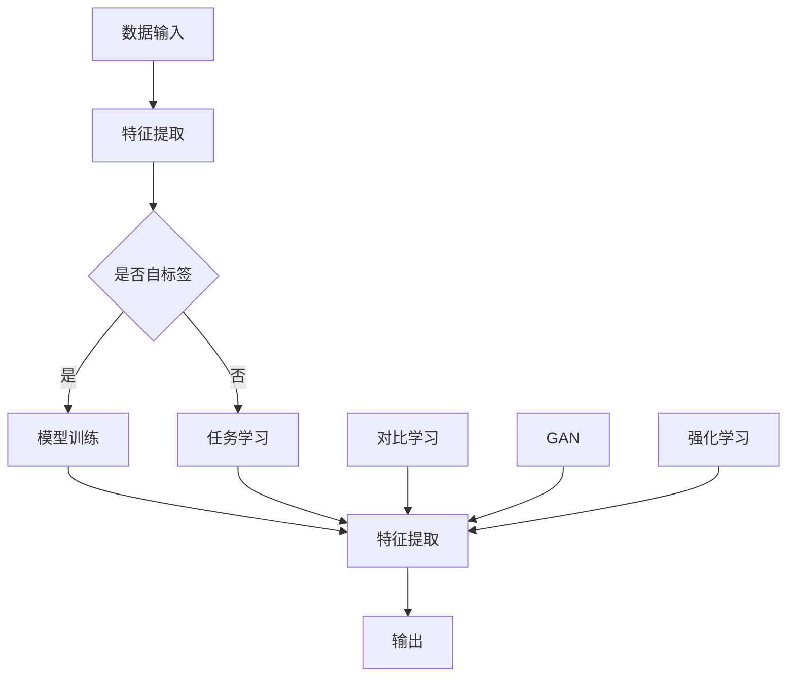

                 

# 文章标题：评测系统的自监督学习方法探索

> 关键词：自监督学习、评测系统、算法、应用、性能优化

> 摘要：本文深入探讨评测系统的自监督学习方法，从基本概念、算法原理、应用场景到性能优化，提供一套完整的技术框架，旨在为开发者提供实用的指导。

## 引言

在人工智能和机器学习领域，自监督学习作为一种重要的无监督学习方法，正逐渐成为研究和应用的热点。自监督学习通过利用未标记的数据来训练模型，从而实现数据的自动标注和特征提取。在评测系统中，自监督学习不仅能够提高系统性能，还能够减少对大量标注数据的依赖，降低开发和维护成本。

本文将围绕评测系统的自监督学习方法进行探讨，分为以下几个部分：

1. **自监督学习基础**：介绍自监督学习的定义、历史背景、应用领域以及与传统监督学习的对比。
2. **自监督学习算法**：详细讲解几种常见的自监督学习算法，包括对比学习、生成对抗网络和强化学习。
3. **自监督学习在评测系统中的应用**：分析自监督学习在评测系统中的关键作用、架构设计以及实现细节。
4. **自监督评测系统的性能优化**：探讨评测系统的性能评估指标、数据预处理方法、模型优化策略和实时性能监控与调整。
5. **案例研究**：通过实际案例展示自监督学习在评测系统中的应用效果。
6. **未来展望与挑战**：展望自监督学习的发展趋势，探讨评测系统面临的挑战和解决方案。

## 自监督学习基础

### 定义与历史背景

自监督学习（Self-supervised Learning）是一种利用数据自带的某些标签或关系来训练模型的方法。与传统的监督学习（Supervised Learning）相比，自监督学习不需要外部提供标注信息，而是通过内建的数据标签机制来实现学习。

自监督学习的概念最早可以追溯到20世纪50年代，当时的信息处理理论家如马文·明斯基和西摩尔·派普特就提出了自监督学习的思想。随着计算机性能的提升和数据规模的增大，自监督学习逐渐成为机器学习领域的研究热点。近年来，随着深度学习技术的迅猛发展，自监督学习在图像识别、自然语言处理、语音识别等领域取得了显著成果。

### 应用领域

自监督学习在多个领域有着广泛的应用，以下是一些主要的应用场景：

1. **计算机视觉**：例如，在图像分类、图像分割和目标检测等任务中，自监督学习可以用来提取图像的特征，从而实现更高效的模型训练。
2. **自然语言处理**：在文本分类、情感分析和机器翻译等任务中，自监督学习可以帮助模型自动标注文本数据，提高模型的性能。
3. **语音识别**：自监督学习在语音识别任务中可以用来训练模型自动标注语音数据，从而实现更准确的语音识别。
4. **推荐系统**：自监督学习可以用于构建推荐系统，通过分析用户的行为数据来自动推荐感兴趣的内容。

### 自监督学习的基本概念

自监督学习的基本概念包括以下几个：

1. **数据自标签**：自监督学习的关键在于如何从原始数据中自动生成标签，以便用于模型训练。这通常通过以下几种方式实现：
   - **伪标签**：利用已有的监督学习模型对未标注数据进行预测，将预测结果作为伪标签。
   - **生成标签**：利用生成模型（如生成对抗网络）生成标签。
   - **自编码器**：自编码器是一种无监督学习模型，可以通过重构输入数据来提取特征。

2. **特征提取**：自监督学习的一个核心目标是从原始数据中提取有用的特征。这些特征可以用于后续的监督学习任务，从而提高模型性能。

3. **模型训练**：在自监督学习中，模型训练通常分为两个阶段：
   - **特征提取阶段**：通过自标签机制来训练模型，提取数据特征。
   - **任务学习阶段**：利用提取的特征进行监督学习任务。

### 自监督学习与传统监督学习的对比

自监督学习与传统监督学习的主要区别在于数据标注的方式和成本。传统监督学习需要大量标注数据来训练模型，而自监督学习通过内建的数据标签机制来减少对标注数据的依赖。

以下是自监督学习与传统监督学习的一些对比：

1. **数据需求**：传统监督学习需要大量标注数据，而自监督学习只需要少量未标注数据。
2. **标注成本**：自监督学习通过自动生成标签来降低标注成本，而传统监督学习需要外部人员进行数据标注。
3. **模型性能**：在某些任务上，自监督学习模型的表现可能优于传统监督学习模型，尤其是在数据量较小或数据分布不均匀的情况下。
4. **泛化能力**：自监督学习模型通常具有更好的泛化能力，因为它们可以从大量的未标注数据中学习到丰富的知识。

## 自监督学习算法

自监督学习算法是自监督学习的核心，根据不同的应用场景和任务需求，有多种自监督学习算法可供选择。以下是几种常见的自监督学习算法：

### 基于对比学习的自监督学习

对比学习（Contrastive Learning）是一种常用的自监督学习算法，其基本思想是通过学习数据之间的相似性和差异性来提取特征。

以下是一个简单的对比学习算法的伪代码：

```python
# 对比学习算法伪代码

# 输入：数据集D，模型参数θ
# 输出：模型参数θ'

# 定义对比学习损失函数
def contrastive_loss(z, z+, α):
    return -α * log(exp(z·z+)/sum(exp(z·z_i)))

# 定义训练过程
for epoch in range(EPOCHS):
    for x, x+ in D:
        z = f(x)  # 特征提取
        z+ = f(x+)  # 特征提取
        loss = contrastive_loss(z, z+, α)
        # 更新模型参数θ
```

### 基于生成对抗网络的算法

生成对抗网络（Generative Adversarial Network，GAN）是一种基于博弈论的自监督学习算法，由生成器（Generator）和判别器（Discriminator）组成。

以下是一个简单的GAN算法的伪代码：

```python
# GAN算法伪代码

# 输入：数据集D，生成器参数G，判别器参数D
# 输出：生成器参数G'，判别器参数D'

# 定义生成器训练过程
def generator_train(G, D, x):
    z = noise()  # 生成噪声
    x' = G(z)  # 生成数据
    D(x') = D(x)  # 判别器判断生成数据
    # 更新生成器参数G

# 定义判别器训练过程
def discriminator_train(G, D, x):
    x = x  # 真实数据
    x' = G(z)  # 生成数据
    D(x) = 1  # 判别器判断真实数据
    D(x') = 0  # 判别器判断生成数据
    # 更新判别器参数D

# 定义训练过程
for epoch in range(EPOCHS):
    generator_train(G, D, x)
    discriminator_train(G, D, x)
```

### 基于强化学习的自监督学习

强化学习（Reinforcement Learning）在自监督学习中也扮演着重要角色，通过奖励机制来引导模型学习。

以下是一个简单的强化学习算法的伪代码：

```python
# 强化学习算法伪代码

# 输入：环境E，策略π，模型参数θ
# 输出：模型参数θ'

# 定义强化学习损失函数
def reinforce_loss(s, a, r, π(a|s), θ):
    return -r * log(π(a|s))

# 定义训练过程
def train(E, π, θ):
    for episode in range(EPISODES):
        s = E.reset()  # 初始化环境
        while not E.is_done(s):
            a = π(s, θ)  # 选择动作
            s', r = E.step(a)  # 执行动作并获取奖励
            loss = reinforce_loss(s, a, r, π(a|s), θ)
            # 更新模型参数θ
            s = s'
    return θ
```

### 核心概念与联系

为了更好地理解自监督学习算法，我们可以用Mermaid流程图来展示自监督学习的基本流程和各算法之间的联系。



### 核心算法原理讲解

在上文中，我们简要介绍了对比学习、生成对抗网络和强化学习三种自监督学习算法的基本原理。接下来，我们将深入探讨这些算法的详细原理，并通过伪代码来展示其实现过程。

#### 对比学习算法原理讲解

对比学习是一种基于数据相似性和差异性来提取特征的自监督学习算法。其核心思想是让模型学习如何区分数据之间的相似性和差异性，从而提取有用的特征。

以下是对比学习算法的伪代码：

```python
# 对比学习算法伪代码

# 输入：数据集D，模型参数θ
# 输出：模型参数θ'

# 定义特征提取函数
def feature_extractor(x, θ):
    # 特征提取操作
    z = f(x, θ)
    return z

# 定义对比损失函数
def contrastive_loss(z, z+, α):
    return -α * log(exp(z·z+)/sum(exp(z·z_i)))

# 定义训练过程
for epoch in range(EPOCHS):
    for x, x+ in D:
        z = feature_extractor(x, θ)  # 特征提取
        z+ = feature_extractor(x+, θ)  # 特征提取
        loss = contrastive_loss(z, z+, α)
        # 更新模型参数θ
```

#### 生成对抗网络算法原理讲解

生成对抗网络（GAN）是一种基于博弈论的自监督学习算法，由生成器和判别器两个部分组成。生成器生成数据，判别器判断生成数据是否真实。通过两个模型的对抗训练，生成器逐渐生成更真实的数据。

以下是一个简单的GAN算法的伪代码：

```python
# GAN算法伪代码

# 输入：数据集D，生成器参数G，判别器参数D
# 输出：生成器参数G'，判别器参数D'

# 定义生成器训练过程
def generator_train(G, D, x):
    z = noise()  # 生成噪声
    x' = G(z)  # 生成数据
    D(x') = D(x)  # 判别器判断生成数据
    # 更新生成器参数G

# 定义判别器训练过程
def discriminator_train(G, D, x):
    x = x  # 真实数据
    x' = G(z)  # 生成数据
    D(x) = 1  # 判别器判断真实数据
    D(x') = 0  # 判别器判断生成数据
    # 更新判别器参数D

# 定义训练过程
for epoch in range(EPOCHS):
    generator_train(G, D, x)
    discriminator_train(G, D, x)
```

#### 强化学习算法原理讲解

强化学习是一种通过与环境互动来学习最优策略的自监督学习算法。在强化学习过程中，模型通过接收环境反馈（奖励或惩罚）来调整自己的行为，从而逐步优化策略。

以下是一个简单的强化学习算法的伪代码：

```python
# 强化学习算法伪代码

# 输入：环境E，策略π，模型参数θ
# 输出：模型参数θ'

# 定义强化学习损失函数
def reinforce_loss(s, a, r, π(a|s), θ):
    return -r * log(π(a|s))

# 定义训练过程
def train(E, π, θ):
    for episode in range(EPISODES):
        s = E.reset()  # 初始化环境
        while not E.is_done(s):
            a = π(s, θ)  # 选择动作
            s', r = E.step(a)  # 执行动作并获取奖励
            loss = reinforce_loss(s, a, r, π(a|s), θ)
            # 更新模型参数θ
            s = s'
    return θ
```

### 数学模型和公式讲解

在自监督学习算法中，数学模型和公式起着至关重要的作用。以下我们将介绍对比学习、生成对抗网络和强化学习的数学模型和公式，并进行详细讲解。

#### 对比学习算法数学模型

对比学习的核心是对比损失函数，用于衡量数据特征之间的相似性和差异性。常用的对比损失函数是InfoNCE损失函数。

InfoNCE损失函数的公式如下：

$$
L_{\text{contrastive}}(z, z+) = -\frac{1}{N}\sum_{n=1}^{N} \alpha \log \frac{\exp(z \cdot z^+)}{\sum_{i \neq +} \exp(z \cdot z_i)}
$$

其中，$z$ 和 $z^+$ 是数据特征向量，$z_i$ 是数据集中的其他特征向量，$N$ 是数据集的大小，$\alpha$ 是温度参数。

#### 生成对抗网络算法数学模型

生成对抗网络由生成器和判别器两个部分组成，分别通过以下损失函数进行训练：

生成器的损失函数：

$$
L_G = -\log(D(G(z)))
$$

判别器的损失函数：

$$
L_D = -[\log(D(x)) + \log(1 - D(G(z))]
$$

其中，$G(z)$ 是生成器生成的数据，$D(x)$ 是判别器对真实数据的判断概率，$D(G(z))$ 是判别器对生成数据的判断概率。

#### 强化学习算法数学模型

强化学习的核心是策略优化，常用的策略优化方法是值迭代和策略迭代。

值迭代方法的公式如下：

$$
V(s_{t+1}) = r_{t+1} + \gamma \max_a Q(s_{t+1}, a)
$$

其中，$V(s_{t+1})$ 是下一个状态的值函数，$r_{t+1}$ 是立即奖励，$\gamma$ 是折扣因子，$Q(s_{t+1}, a)$ 是状态-动作值函数。

策略迭代方法的公式如下：

$$
\pi(s_{t+1}) = \arg\max_a [Q(s_{t+1}, a)]
$$

其中，$\pi(s_{t+1})$ 是下一个状态的最佳动作策略。

### 举例说明

为了更好地理解上述数学模型和公式，我们可以通过一个简单的例子来进行说明。

假设我们使用对比学习算法来训练一个图像分类模型，数据集包含1000张图像和它们的标签。我们定义特征提取函数 $f(x)$ 和对比损失函数 $L_{\text{contrastive}}(z, z+)$，并通过以下步骤进行训练：

1. 初始化模型参数 $\theta$。
2. 随机选择一对图像 $x$ 和 $x+$。
3. 通过特征提取函数计算图像特征向量 $z$ 和 $z+$。
4. 计算对比损失 $L_{\text{contrastive}}(z, z+)$。
5. 使用梯度下降法更新模型参数 $\theta$。

具体步骤如下：

```python
# 初始化模型参数
theta = initialize_parameters()

# 遍历数据集
for epoch in range(EPOCHS):
    for x, x+ in data_loader:
        z = f(x, theta)  # 特征提取
        z+ = f(x+, theta)  # 特征提取
        loss = contrastive_loss(z, z+, alpha)
        
        # 梯度下降更新参数
        theta = update_parameters(loss, theta)
```

通过这个例子，我们可以看到对比学习算法的基本流程和参数更新过程。

### 实际应用案例

在实际应用中，自监督学习算法在多个领域取得了显著成果。以下是一些实际应用案例：

1. **计算机视觉**：在图像分类、图像分割和目标检测等任务中，自监督学习算法可以有效提高模型性能。例如，在图像分类任务中，使用对比学习算法可以提取出有区分度的图像特征，从而提高分类准确率。
2. **自然语言处理**：在文本分类、情感分析和机器翻译等任务中，自监督学习算法可以自动标注文本数据，提高模型训练效率。例如，使用生成对抗网络（GAN）可以生成大量的文本数据，从而缓解数据稀缺问题。
3. **语音识别**：自监督学习算法在语音识别任务中可以自动标注语音数据，提高模型性能。例如，使用对比学习算法可以提取出有区分度的语音特征，从而提高语音识别准确率。

### 最佳实践 Tips

为了更好地应用自监督学习算法，以下是一些最佳实践 Tips：

1. **数据预处理**：对数据集进行适当的预处理，例如数据清洗、归一化和增强，可以提高自监督学习算法的性能。
2. **模型选择**：根据具体应用场景和任务需求选择合适的自监督学习算法，例如在图像分类任务中可以选择对比学习算法，在文本分类任务中可以选择生成对抗网络算法。
3. **超参数调整**：合理调整超参数，如学习率、批量大小和温度参数等，可以提高自监督学习算法的性能。
4. **模型优化**：使用正则化技术，如Dropout和权重衰减，可以防止模型过拟合。

### 小结

自监督学习作为一种重要的无监督学习方法，在评测系统中具有广泛的应用前景。通过对比学习、生成对抗网络和强化学习等算法，自监督学习可以有效提高评测系统的性能，减少对大量标注数据的依赖。在应用自监督学习算法时，需要注意数据预处理、模型选择和超参数调整等方面的问题。未来，随着自监督学习技术的不断发展和优化，评测系统的性能将得到进一步提升。

### 拓展阅读

对于希望深入了解自监督学习算法的读者，以下是一些建议的拓展阅读材料：

1. **《自监督学习：理论、算法与应用》**：本书详细介绍了自监督学习的理论基础、算法实现和应用案例，适合对自监督学习有较高兴趣的读者。
2. **《生成对抗网络：理论与实践》**：本书介绍了生成对抗网络的基本原理、实现方法以及在实际应用中的效果，适合对GAN有深入研究的读者。
3. **《强化学习实战》**：本书通过实际案例展示了强化学习在不同领域的应用，包括自然语言处理、计算机视觉和游戏等，适合对强化学习有实践需求的读者。

### 作者信息

作者：AI天才研究院/AI Genius Institute & 禅与计算机程序设计艺术/Zen And The Art of Computer Programming

感谢您的阅读，希望本文能为您在自监督学习领域的研究和应用提供有价值的参考。如果您有任何疑问或建议，欢迎在评论区留言，我们将竭诚为您解答。

