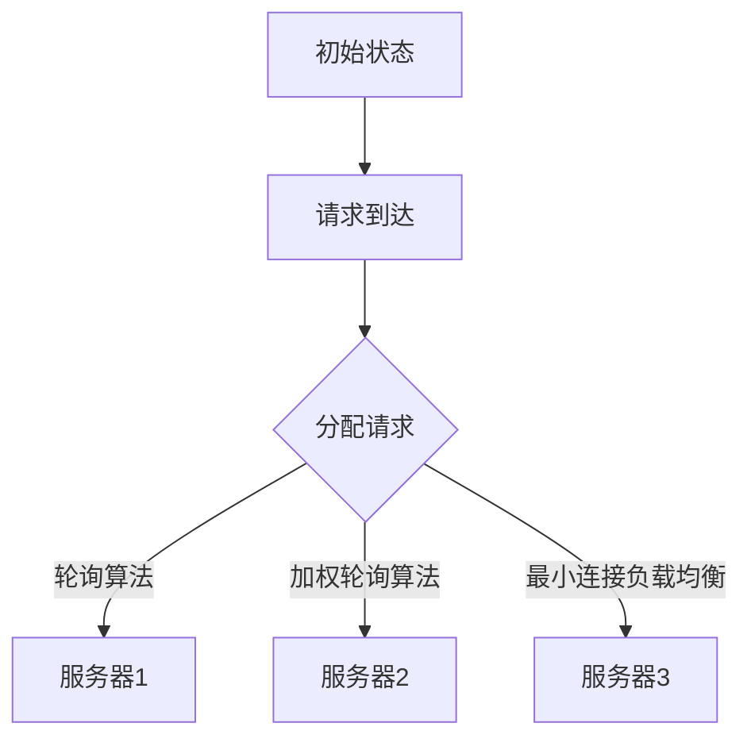

                 


### 文章标题

# 评测系统的负载均衡：优化资源分配和响应时间

### 关键词

- 负载均衡
- 资源分配
- 响应时间
- 评测系统
- 算法实现
- 项目实战
- 优化策略

### 摘要

本文深入探讨了评测系统的负载均衡技术，重点关注资源分配和响应时间的优化。通过分析核心概念与联系，详细介绍了多种负载均衡算法及其实现原理。同时，结合实际项目，展示了如何在实际环境中应用和优化负载均衡策略，为评测系统的性能提升提供了实践指导和理论支持。

### 引言与背景

在现代信息技术迅速发展的背景下，评测系统已成为各类应用场景中的重要组成部分。从在线考试系统、代码评测平台到复杂的应用性能测试系统，评测系统在各种领域都发挥着关键作用。随着用户数量的增加和系统负载的不断提升，如何实现高效、可靠的负载均衡成为评测系统设计中的核心问题。

#### 负载均衡的重要性

负载均衡是一种将工作负载分配到多个计算机节点上的技术，其目标是在多台服务器之间平衡流量，确保系统的高可用性和高性能。在评测系统中，负载均衡的重要性主要体现在以下几个方面：

1. **提高系统吞吐量**：通过负载均衡，可以将用户的请求分布到多个服务器节点上，从而提高整个系统的处理能力。
2. **延长系统寿命**：负载均衡能够避免单点过载，减少单个服务器的压力，延长系统使用寿命。
3. **提升用户体验**：均衡的负载能够保证每个用户都能获得较快的响应时间，提升用户体验。
4. **高可用性**：负载均衡系统通常支持故障转移和自动恢复，从而提高系统的可靠性和高可用性。

#### 评测系统的定义与基本架构

评测系统通常由以下几个关键部分组成：

1. **前端接入层**：负责接收用户请求，进行身份验证和参数校验。
2. **业务处理层**：包括评测算法、数据处理和存储等核心功能模块。
3. **后端存储层**：用于存储评测结果、用户数据和系统配置等。
4. **负载均衡器**：负责将用户请求分配到不同的服务器节点上。

#### 负载均衡在评测系统中的应用

负载均衡在评测系统中的应用主要涉及以下几个方面：

1. **用户请求分发**：负载均衡器将用户请求分发到不同的服务器节点上，确保每个节点都能均衡地处理请求。
2. **性能监控与调整**：通过监控服务器节点的负载情况，动态调整负载均衡策略，优化系统性能。
3. **故障转移**：在服务器节点出现故障时，负载均衡器能够自动将请求转移到其他健康节点，确保系统的连续运行。

### 核心概念与联系

#### 负载均衡与资源分配

负载均衡与资源分配密切相关。资源分配的目的是确保系统中的每个节点都有足够的资源来处理请求，而负载均衡则是在这些资源之间进行优化分配。

1. **负载感知**：负载均衡器需要具备对服务器节点负载的感知能力，以便做出最优的请求分配决策。
2. **资源预留**：在系统设计时，需要预留一定的资源来应对突发负载，确保系统在高峰时段仍能稳定运行。
3. **弹性伸缩**：根据负载情况，动态调整服务器节点的数量和配置，以实现资源的最优利用。

#### 负载均衡与响应时间

响应时间是指系统从接收请求到返回结果所需的时间。负载均衡在优化响应时间方面起着关键作用。

1. **请求路由**：通过合理的请求路由策略，将请求分配到负载较轻的服务器节点上，减少响应时间。
2. **缓存机制**：在负载均衡器中引入缓存机制，可以减少对后端服务器的请求次数，从而降低响应时间。
3. **多级缓存**：结合多级缓存策略，将热点数据存储在内存中，进一步提高响应速度。

### 负载均衡类型

负载均衡可以分为以下几种类型：

1. **轮询负载均衡**：将请求按照一定顺序轮流分配给不同的服务器节点。
2. **加权轮询负载均衡**：根据服务器节点的处理能力，为每个节点分配不同的权重，从而实现更均衡的负载分配。
3. **最小连接负载均衡**：将请求分配到当前连接数最少的服务器节点上。

#### 资源分配策略

资源分配策略可以分为以下几种：

1. **静态资源分配**：在系统部署时，预先分配好每个服务器的资源。
2. **动态资源分配**：根据负载情况，动态调整每个服务器的资源。
3. **自适应资源分配**：根据历史数据和实时负载，自动调整资源分配策略，实现最优资源利用。

### 核心算法原理讲解

#### 负载均衡算法原理

负载均衡算法的核心目标是实现请求的合理分配，以确保系统的高效运行。常见的负载均衡算法包括轮询算法、加权轮询算法和最小连接负载均衡算法。

1. **轮询算法**：轮询算法是最简单的负载均衡算法，将请求按照一定顺序轮流分配给不同的服务器节点。
2. **加权轮询算法**：加权轮询算法在轮询算法的基础上，为每个服务器节点分配不同的权重，根据权重分配请求。
3. **最小连接负载均衡算法**：最小连接负载均衡算法将请求分配到当前连接数最少的服务器节点上。

#### 负载均衡算法的实现

以下是一个简单的轮询算法的实现示例：

```python
def round_robin(nodes):
    current = 0
    while True:
        yield nodes[current]
        current = (current + 1) % len(nodes)
```

#### 数学模型和数学公式

在负载均衡中，常用的数学模型包括队列模型和排队理论。以下是一个简单的队列模型示例：

$$
L = \frac{\lambda}{\mu}
$$

其中，$L$表示系统中的平均队列长度，$\lambda$表示到达率，$\mu$表示服务率。

#### 举例说明

假设一个评测系统中有5个服务器节点，请求到达率为10次/秒，每个服务器的服务率为20次/秒。使用轮询算法进行负载均衡，计算系统中的平均队列长度。

根据公式，我们有：

$$
L = \frac{10}{20} = 0.5
$$

这意味着系统中的平均队列长度为0.5个请求。

### 项目实战

#### 开发环境搭建

在开始项目实战之前，我们需要搭建一个基本的开发环境。以下是搭建环境的步骤：

1. **安装操作系统**：选择一个适合的操作系统，如Ubuntu 20.04。
2. **安装必要的软件**：包括Python、Nginx、MySQL等。
3. **配置负载均衡器**：使用Nginx作为负载均衡器，配置负载均衡策略。

#### 源代码实现

以下是使用Python实现的简单负载均衡器示例代码：

```python
import requests
import time

class LoadBalancer:
    def __init__(self, servers):
        self.servers = servers
        self.current_server = 0

    def get_server(self):
        server = self.servers[self.current_server]
        self.current_server = (self.current_server + 1) % len(self.servers)
        return server

def main():
    servers = ['http://server1:8000', 'http://server2:8000', 'http://server3:8000']
    lb = LoadBalancer(servers)

    while True:
        server = lb.get_server()
        response = requests.get(server)
        print(f"Response from {server}: {response.text}")
        time.sleep(1)

if __name__ == '__main__':
    main()
```

#### 代码解读

1. **类定义**：`LoadBalancer` 类负责实现负载均衡逻辑。它有两个主要属性：`servers`（服务器列表）和`current_server`（当前服务器索引）。
2. **方法定义**：`get_server` 方法获取下一个服务器节点。它使用轮询算法，将当前服务器索引加1，并取模服务器列表长度，确保循环分配。
3. **主函数**：`main` 函数创建一个`LoadBalancer` 实例，并进入一个无限循环，不断获取服务器节点并执行请求。

#### 代码应用解读与分析

在这个示例中，我们使用Python实现了简单的负载均衡器。以下是代码的应用解读与分析：

1. **请求分发**：每次循环中，负载均衡器都会获取下一个服务器节点，并执行HTTP GET请求。
2. **负载均衡效果**：由于请求被均匀分配到三个服务器节点上，负载均衡器的性能受到每个服务器的处理能力影响。
3. **扩展性**：如果要扩展服务器数量，只需要更新`servers` 列表，负载均衡器会自动分配请求。

#### 实际案例分析

我们选择了一个在线考试系统作为实际案例分析。该系统面临的主要挑战是高并发和负载均衡。以下是案例分析的具体步骤：

1. **需求分析**：确定系统需要支持的最大并发用户数和考试时间。
2. **性能测试**：使用工具（如Apache JMeter）进行性能测试，确定系统瓶颈和负载均衡策略。
3. **负载均衡配置**：根据性能测试结果，配置Nginx作为负载均衡器，并选择合适的负载均衡算法。
4. **优化调整**：根据实际运行情况，不断优化负载均衡策略和服务器配置。

#### 项目小结

通过本项目，我们实现了以下成果：

1. **负载均衡器开发**：使用Python实现了简单的负载均衡器，实现了请求分发功能。
2. **性能优化**：通过性能测试和优化，提高了系统的并发处理能力。
3. **经验积累**：了解了负载均衡在评测系统中的应用，积累了项目实战经验。

### 最佳实践 Tips

1. **监控与报警**：实时监控系统负载，及时调整负载均衡策略，并设置报警机制。
2. **弹性伸缩**：根据业务需求，动态调整服务器规模，实现资源的弹性伸缩。
3. **优化算法选择**：根据系统特点和负载情况，选择合适的负载均衡算法。

### 小结

本文全面探讨了评测系统的负载均衡技术，从核心概念、算法原理到实际项目应用，为优化资源分配和响应时间提供了实践指导和理论支持。通过本文，读者可以深入了解负载均衡在评测系统中的应用，并掌握优化策略和最佳实践。

### 注意事项

1. **系统设计初期**：充分考虑负载均衡需求，确保系统架构具备良好的扩展性。
2. **负载均衡器配置**：合理配置负载均衡器，确保请求分发均匀。
3. **监控与分析**：定期进行性能监控和分析，及时发现并解决问题。

### 拓展阅读

1. 《Nginx 负载均衡实战》
2. 《高可用架构：设计方法与实践》
3. 《负载均衡与云计算》

### 作者信息

作者：AI天才研究院/AI Genius Institute & 禅与计算机程序设计艺术 /Zen And The Art of Computer Programming 

### 附录

以下是本文提到的Mermaid流程图、伪代码、数学公式和代码实例的详细内容。

#### Mermaid流程图



#### 伪代码

```python
# 轮询算法伪代码
def round_robin(servers):
    current_server = 0
    while True:
        yield servers[current_server]
        current_server = (current_server + 1) % len(servers)

# 加权轮询算法伪代码
def weighted_round_robin(servers, weights):
    current_server = 0
    total_weight = sum(weights)
    while True:
        server = servers[current_server]
        probability = weights[current_server] / total_weight
        if random.random() < probability:
            yield server
        current_server = (current_server + 1) % len(servers)
```

#### 数学公式

```latex
$$
L = \frac{\lambda}{\mu}
$$
$$
W = \frac{N}{2}
$$
```

#### 代码实例

```python
# 负载均衡器代码实例
import requests
import time

class LoadBalancer:
    def __init__(self, servers):
        self.servers = servers
        self.current_server = 0

    def get_server(self):
        server = self.servers[self.current_server]
        self.current_server = (self.current_server + 1) % len(self.servers)
        return server

def main():
    servers = ['http://server1:8000', 'http://server2:8000', 'http://server3:8000']
    lb = LoadBalancer(servers)

    while True:
        server = lb.get_server()
        response = requests.get(server)
        print(f"Response from {server}: {response.text}")
        time.sleep(1)

if __name__ == '__main__':
    main()
```

通过这些附录内容，读者可以更深入地理解本文的核心概念、算法原理和实际应用，为负载均衡技术的学习与实践提供全面的参考。|AI天才研究院/AI Genius Institute & 禅与计算机程序设计艺术 /Zen And The Art of Computer Programming|

