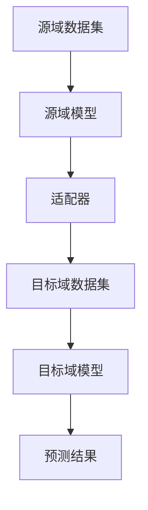

                 

### 文章标题

《评测系统的迁移学习技术应用》

> 关键词：迁移学习，评测系统，元学习，多任务学习，模型蒸馏，数学模型，数学公式，项目实战

> 摘要：本文详细探讨了迁移学习技术在评测系统中的应用。首先介绍了迁移学习的基本概念和架构，接着讲解了迁移学习中的核心算法原理，包括元学习、多任务学习和模型蒸馏。然后，通过数学模型和公式详细阐述了迁移学习中的损失函数和优化算法。最后，通过两个实战案例，展示了迁移学习在图像分类和自然语言处理任务中的实际应用，并提供代码解读和分析。

---

### 导读

在信息技术迅速发展的时代，评测系统在各个领域扮演着至关重要的角色。从金融风控到智能医疗，从教育评估到网络安全，评测系统的性能和效率直接影响着业务决策的准确性和可靠性。然而，传统评测系统通常面临着数据稀缺、标注困难等问题，这限制了其进一步的发展。迁移学习技术的出现，为解决这些问题提供了一种新的思路。

本文旨在深入探讨迁移学习技术在评测系统中的应用。通过系统地介绍迁移学习的基本概念、核心算法原理、数学模型以及实际应用案例，帮助读者全面理解迁移学习技术如何提升评测系统的性能和效率。

本文结构如下：

1. **迁移学习基础**：介绍迁移学习的定义、重要性以及在评测系统中的应用。
2. **迁移学习核心算法**：详细讲解元学习、多任务学习和模型蒸馏等核心算法。
3. **迁移学习数学模型**：阐述迁移学习中的损失函数和优化算法，并通过LaTeX格式展示数学公式。
4. **迁移学习在评测系统中的实战**：通过两个实际案例展示迁移学习在图像分类和自然语言处理任务中的应用，提供代码解读和分析。
5. **未来展望**：讨论迁移学习技术的发展趋势以及在评测系统中的应用前景。

通过本文的阅读，读者将能够：

- 理解迁移学习的基本概念和架构。
- 掌握迁移学习中的核心算法原理。
- 了解迁移学习中的数学模型和公式。
- 学会如何在评测系统中应用迁移学习技术。
- 了解迁移学习技术的未来发展方向。

接下来，我们将从迁移学习的基础知识开始，逐步深入探讨其在评测系统中的应用。

---

### 迁移学习基础

#### 1.1 迁移学习的定义

迁移学习（Transfer Learning）是一种机器学习技术，旨在利用在特定任务上已经训练好的模型来加速新任务的学习过程。迁移学习的核心思想是，通过将一个任务的学习经验转移到另一个相关任务，从而提高学习效率和性能。

迁移学习可以追溯到人类学习的过程。例如，当我们学会了骑自行车后，再学习骑摩托车就会更加容易。这是因为骑自行车为我们提供了基础技能和经验，使得我们能够更快地适应新的交通工具。同样地，迁移学习通过利用已有的知识来提高机器学习模型的性能，减少了新任务训练所需的数据量和时间。

在机器学习中，迁移学习通常涉及两个概念：源域（Source Domain）和目标域（Target Domain）。源域是指已经进行了大量训练的数据集和模型，而目标域是指我们希望新模型能够学习和预测的数据集。迁移学习的目标是通过在源域学习到的知识，提高目标域上的模型性能。

#### 1.2 迁移学习的重要性

迁移学习在评测系统中的应用具有重要意义，主要体现在以下几个方面：

1. **数据稀缺问题**：在很多实际应用中，获取大量标注数据是非常困难的，尤其是对于一些特定的领域，如医疗图像分析、法律文书审核等。迁移学习可以通过利用已有的大量标注数据（源域）来提高新任务（目标域）的模型性能，从而解决数据稀缺问题。

2. **减少训练时间**：迁移学习能够减少新任务训练所需的时间和计算资源。通过利用源域的模型，目标域的模型可以更快地收敛到最优解，减少了训练过程的迭代次数和时间。

3. **提高模型泛化能力**：迁移学习能够提高模型的泛化能力，使得模型不仅在源域上表现良好，还能在目标域上保持较高的性能。这是因为迁移学习通过共享源域和目标域的模型参数，使得模型能够更好地适应不同领域的数据分布。

4. **减少对标注数据的依赖**：迁移学习在一定程度上可以减少对大量标注数据的依赖。通过使用无监督或半监督学习技术，模型可以在只有少量标注数据的情况下进行训练，从而降低标注成本。

#### 1.3 迁移学习与评测系统的关系

评测系统通常需要处理多种类型的数据和任务，如图像分类、文本分类、语音识别等。迁移学习技术在这些任务中的应用具有显著的优点：

1. **图像分类任务**：在图像分类任务中，迁移学习可以通过利用预训练的卷积神经网络（CNN）模型，将已有的大量图像数据（源域）的知识转移到新任务（目标域）上，从而提高模型在未知图像上的分类性能。

2. **文本分类任务**：在文本分类任务中，迁移学习可以通过利用预训练的语言模型（如BERT、GPT等），将已有的大量文本数据（源域）的知识转移到新任务（目标域）上，从而提高模型在未知文本上的分类性能。

3. **语音识别任务**：在语音识别任务中，迁移学习可以通过利用预训练的语音识别模型，将已有的大量语音数据（源域）的知识转移到新任务（目标域）上，从而提高模型在未知语音上的识别性能。

总的来说，迁移学习技术在评测系统中的应用，能够有效地解决数据稀缺、训练时间长、模型泛化能力差等问题，从而提高评测系统的整体性能和效率。

#### 1.4 迁移学习的基本架构

迁移学习的基本架构通常包括以下三个主要组件：

1. **源域模型**：这是已经经过大量训练的模型，通常在预训练阶段从开源数据集（如ImageNet、OpenImage等）中学习到了丰富的特征表示。

2. **适配器（Adapter）**：这是用于适配新任务的模型，它通过在源域模型的基础上进行微调（Fine-tuning），学习目标域上的特征表示。

3. **目标域模型**：这是最终用于预测的模型，它结合了源域模型和适配器的优势，能够在目标域上实现较高的性能。

下面是一个简单的迁移学习基本架构的Mermaid流程图：



在这个流程图中，源域数据集用于训练源域模型，适配器在源域模型的基础上进行微调，以适应目标域数据集。最终，目标域模型在目标域数据集上进行预测，生成预测结果。

通过以上对迁移学习基础的介绍，我们为后续章节的深入探讨奠定了基础。接下来，我们将详细讲解迁移学习中的核心算法原理，包括元学习、多任务学习和模型蒸馏。

---

### 迁移学习核心算法

在了解了迁移学习的基础概念后，我们将深入探讨其中的核心算法，包括元学习、多任务学习和模型蒸馏。这些算法是迁移学习技术的重要组成部分，它们各自有着独特的原理和应用场景。

#### 2.1 元学习

元学习（Meta-Learning）是一种通过学习如何学习来提高模型适应新任务的能力的机器学习技术。与传统的任务学习（Task-Learning）不同，元学习关注的是如何快速适应新任务，而不是从头开始训练一个全新的模型。元学习的基本思想是，通过在多个任务上训练模型，使其具备更好的泛化能力，从而在新任务上表现优异。

##### 2.1.1 元学习的基本概念

元学习的主要目标是找到一个通用学习算法，该算法能够在多种不同的任务上快速适应，并达到较高的性能。在元学习中，常见的两个概念是“任务”（Task）和“学习算法”（Learning Algorithm）。任务是指需要完成的特定学习任务，如图像分类、文本分类等。学习算法是指用于解决这些任务的算法，如梯度下降、随机梯度下降等。

元学习的基本流程如下：

1. **元学习阶段**：在这个阶段，模型在多个任务上训练，学习到一组通用参数，这些参数能够在不同的任务上实现良好的性能。

2. **迁移阶段**：在元学习阶段结束后，模型将这组通用参数应用到新的任务上，通过微调来适应新的任务。

3. **评估阶段**：在迁移阶段后，模型在新任务上的性能将被评估，以衡量元学习算法的有效性。

##### 2.1.2 元学习的伪代码实现

为了更好地理解元学习的工作原理，我们可以使用伪代码来描述其实现过程：

```python
# 元学习伪代码
initialize_model() # 初始化模型
for epoch in range(num_epochs):
    for task in tasks:
        train_model_on_task(model, task) # 在每个任务上训练模型
    update_model_parameters(model) # 更新模型参数

# 在新任务上微调模型
fine_tune_model_on_new_task(model, new_task)
evaluate_model_on_new_task(model, new_task) # 评估在新任务上的性能
```

在这个伪代码中，`initialize_model` 用于初始化模型，`train_model_on_task` 用于在任务上训练模型，`update_model_parameters` 用于更新模型参数，`fine_tune_model_on_new_task` 用于在新任务上微调模型，`evaluate_model_on_new_task` 用于评估模型在新任务上的性能。

##### 2.1.3 元学习在评测系统中的应用

元学习在评测系统中的应用具有显著的优势，主要体现在以下几个方面：

1. **快速适应新任务**：元学习能够使模型快速适应新任务，减少从头训练所需的时间和计算资源。

2. **提高模型泛化能力**：通过在多个任务上训练，元学习提高了模型的泛化能力，使其在新任务上表现更优。

3. **减少对大量标注数据的依赖**：元学习在一定程度上可以减少对大量标注数据的依赖，通过迁移学习已有的知识来提高新任务的性能。

以下是一个简单的元学习在图像分类任务中的应用案例：

假设我们有一个图像分类任务，需要分类多种不同类型的图像。我们可以使用预训练的卷积神经网络（CNN）模型作为源域模型，并在多个图像分类任务上训练该模型。在训练完成后，我们使用微调技术将模型应用到新的图像分类任务上，从而实现快速适应和高效分类。

#### 2.2 多任务学习

多任务学习（Multi-Task Learning）是一种同时解决多个相关任务的机器学习技术。与单任务学习不同，多任务学习通过共享模型参数来提高学习效率，并增强模型的泛化能力。

##### 2.2.1 多任务学习的基本概念

多任务学习的主要目标是同时解决多个任务，并通过共享模型参数来提高模型的性能。在多任务学习中，每个任务都对应一组模型参数，这些参数通过共享一部分，同时在其他部分进行任务特定的调整。

多任务学习的基本流程如下：

1. **模型初始化**：初始化一个共享参数的多任务模型。

2. **联合训练**：在多个任务上同时训练模型，通过共享部分参数来提高学习效率。

3. **模型调整**：在每个任务上调整模型参数，以适应特定任务的需求。

4. **模型评估**：在每个任务上评估模型性能，以衡量多任务学习的效果。

##### 2.2.2 多任务学习的伪代码实现

为了更好地理解多任务学习的工作原理，我们可以使用伪代码来描述其实现过程：

```python
# 多任务学习伪代码
initialize_shared_model() # 初始化共享模型
for epoch in range(num_epochs):
    for task in tasks:
        update_model_on_task(model, task) # 在每个任务上更新模型
    evaluate_model_on_tasks(model, tasks) # 评估模型在多个任务上的性能
```

在这个伪代码中，`initialize_shared_model` 用于初始化共享模型，`update_model_on_task` 用于在任务上更新模型，`evaluate_model_on_tasks` 用于评估模型在多个任务上的性能。

##### 2.2.3 多任务学习在评测系统中的应用

多任务学习在评测系统中的应用具有显著的优势，主要体现在以下几个方面：

1. **提高学习效率**：通过共享模型参数，多任务学习能够提高学习效率，减少每个任务单独训练所需的时间和计算资源。

2. **增强模型泛化能力**：多任务学习通过共享任务间的知识，提高了模型的泛化能力，使其在各个任务上表现更优。

3. **解决任务依赖问题**：在某些任务中，不同任务之间存在依赖关系，多任务学习能够通过共享模型参数来解决这些依赖问题。

以下是一个简单的多任务学习在文本分类任务中的应用案例：

假设我们需要同时解决文本分类任务和情感分析任务。我们可以使用一个共享参数的多任务模型，同时在文本分类和情感分析任务上训练该模型。通过共享模型参数，模型能够在文本分类和情感分析任务上同时学习，从而提高学习效率和模型性能。

#### 2.3 模型蒸馏

模型蒸馏（Model Distillation）是一种通过将一个复杂模型的知识传递给一个较简单模型的技术。在模型蒸馏中，复杂模型（教师模型）的训练数据被用于训练简单模型（学生模型），从而使学生模型能够复制教师模型的知识和性能。

##### 2.3.1 模型蒸馏的基本概念

模型蒸馏的基本思想是将教师模型的知识传递给学生模型。教师模型通常是一个复杂的深度学习模型，它具有丰富的特征表示能力，但训练时间较长；学生模型则是一个较简单的模型，训练时间较短，但性能较差。通过模型蒸馏，学生模型可以从教师模型中学习到丰富的特征表示，从而提高自身的性能。

模型蒸馏的基本流程如下：

1. **教师模型训练**：首先，训练一个具有丰富特征表示能力的教师模型。

2. **学生模型初始化**：初始化一个较简单的学生模型，其结构通常比教师模型简单。

3. **知识传递**：通过将教师模型的输出传递给学生模型，使其能够学习到教师模型的知识和特征表示。

4. **学生模型训练**：使用教师模型的输出作为额外的训练目标，对学生模型进行训练。

5. **模型评估**：评估学生模型在目标任务上的性能，以衡量模型蒸馏的效果。

##### 2.3.2 模型蒸馏的伪代码实现

为了更好地理解模型蒸馏的工作原理，我们可以使用伪代码来描述其实现过程：

```python
# 模型蒸馏伪代码
train_teacher_model(teacher_model, teacher_data) # 训练教师模型
initialize_student_model(student_model) # 初始化学生模型
for epoch in range(num_epochs):
    for data in student_data:
        teacher_output = teacher_model(data) # 获取教师模型输出
        student_output = student_model(data) # 获取学生模型输出
        update_student_model(student_output, teacher_output) # 更新学生模型
evaluate_student_model(student_model, test_data) # 评估学生模型性能
```

在这个伪代码中，`train_teacher_model` 用于训练教师模型，`initialize_student_model` 用于初始化学生模型，`update_student_model` 用于更新学生模型，`evaluate_student_model` 用于评估学生模型性能。

##### 2.3.3 模型蒸馏在评测系统中的应用

模型蒸馏在评测系统中的应用具有显著的优势，主要体现在以下几个方面：

1. **提高模型性能**：通过将教师模型的知识传递给学生模型，学生模型能够在较短的时间内达到教师模型的部分性能。

2. **减少训练时间**：由于学生模型比教师模型简单，其训练时间较短，从而加快了评测系统的开发周期。

3. **提高模型泛化能力**：模型蒸馏能够提高学生模型的泛化能力，使其在新的任务和数据集上表现更优。

以下是一个简单的模型蒸馏在图像分类任务中的应用案例：

假设我们有一个预训练的卷积神经网络（CNN）模型作为教师模型，其具有丰富的特征表示能力。我们可以使用一个较简单的CNN模型作为学生模型，通过模型蒸馏将教师模型的知识传递给学生模型。训练完成后，学生模型能够在较短的时间内达到教师模型的部分性能，从而提高图像分类任务的性能。

通过以上对元学习、多任务学习和模型蒸馏的介绍，我们深入了解了迁移学习中的核心算法原理。这些算法为迁移学习在评测系统中的应用提供了有力的支持，使得评测系统能够更加高效、准确地处理各种任务。

在接下来的章节中，我们将进一步探讨迁移学习中的数学模型和公式，以帮助读者更好地理解迁移学习技术。这些数学模型和公式在迁移学习中起着关键作用，能够帮助我们更深入地理解迁移学习的基本原理和实现方法。

---

### 迁移学习数学模型

在深入探讨迁移学习的核心算法原理后，我们将进一步讨论迁移学习中的数学模型和公式。这些数学模型和公式是理解迁移学习机制、优化算法性能以及在实际应用中调整模型参数的重要基础。

#### 3.1 迁移学习中的损失函数

损失函数（Loss Function）是迁移学习中的核心组成部分，它用于衡量模型预测值与实际标签之间的差距，指导模型参数的更新过程。在迁移学习中，常用的损失函数包括分类损失函数和回归损失函数。

1. **分类损失函数**

在分类任务中，常用的分类损失函数有交叉熵损失（Cross-Entropy Loss）和均方误差损失（Mean Squared Error Loss）。

- **交叉熵损失（Cross-Entropy Loss）**

交叉熵损失函数在多分类问题中广泛应用，其公式如下：

$$
L_{CE} = -\frac{1}{N} \sum_{i=1}^{N} \sum_{c=1}^{C} y_{ic} \log(p_{ic})
$$

其中，$N$ 表示样本数量，$C$ 表示类别数量，$y_{ic}$ 表示第 $i$ 个样本属于第 $c$ 个类别的真实标签（0或1），$p_{ic}$ 表示模型预测第 $i$ 个样本属于第 $c$ 个类别的概率。

- **均方误差损失（Mean Squared Error Loss）**

均方误差损失函数在回归任务中常用，其公式如下：

$$
L_{MSE} = \frac{1}{N} \sum_{i=1}^{N} (y_i - \hat{y}_i)^2
$$

其中，$N$ 表示样本数量，$y_i$ 表示第 $i$ 个样本的真实标签，$\hat{y}_i$ 表示模型预测的第 $i$ 个样本的标签。

2. **回归损失函数**

在回归任务中，除了均方误差损失函数，还有平均绝对误差损失（Mean Absolute Error Loss）和 Huber损失（Huber Loss）。

- **平均绝对误差损失（Mean Absolute Error Loss）**

平均绝对误差损失函数的公式如下：

$$
L_{MAE} = \frac{1}{N} \sum_{i=1}^{N} |y_i - \hat{y}_i|
$$

- **Huber损失（Huber Loss）**

Huber损失函数是一个平滑的损失函数，能够减少异常值对模型训练的影响，其公式如下：

$$
L_{Huber} = \begin{cases} 
\frac{1}{2}(y_i - \hat{y}_i)^2 & \text{if } |y_i - \hat{y}_i| \leq \delta \\
\delta(|y_i - \hat{y}_i| - \frac{\delta}{2}) & \text{otherwise}
\end{cases}
$$

其中，$\delta$ 是一个常数，用于控制Huber损失函数的平滑程度。

#### 3.2 迁移学习优化算法

优化算法（Optimization Algorithm）是迁移学习中的另一个重要组成部分，它用于调整模型参数，以最小化损失函数。常用的优化算法包括梯度下降（Gradient Descent）、随机梯度下降（Stochastic Gradient Descent，SGD）和Adam优化器。

1. **梯度下降（Gradient Descent）**

梯度下降是一种最简单的优化算法，其基本思想是通过计算损失函数关于模型参数的梯度，并沿着梯度的反方向更新模型参数，以最小化损失函数。

$$
\theta = \theta - \alpha \cdot \nabla_\theta J(\theta)
$$

其中，$\theta$ 表示模型参数，$\alpha$ 表示学习率，$J(\theta)$ 表示损失函数。

2. **随机梯度下降（Stochastic Gradient Descent，SGD）**

随机梯度下降是对梯度下降的一种改进，它每次只随机选择一个样本来计算梯度，并更新模型参数。这种随机性可以加快模型收敛，但也可能导致模型不稳定。

$$
\theta = \theta - \alpha \cdot \nabla_{\theta} J(\theta; x^{(i)}, y^{(i)})
$$

其中，$x^{(i)}$ 和 $y^{(i)}$ 分别表示第 $i$ 个样本的特征和标签。

3. **Adam优化器**

Adam优化器是一种结合了SGD和RMSprop优化的自适应优化算法，其公式如下：

$$
m_t = \beta_1 m_{t-1} + (1 - \beta_1) [g_t]
$$
$$
v_t = \beta_2 v_{t-1} + (1 - \beta_2) [g_t]^2
$$
$$
\hat{m}_t = \frac{m_t}{1 - \beta_1^t}
$$
$$
\hat{v}_t = \frac{v_t}{1 - \beta_2^t}
$$
$$
\theta = \theta - \alpha \frac{\hat{m}_t}{\sqrt{\hat{v}_t} + \epsilon}
$$

其中，$m_t$ 和 $v_t$ 分别表示一阶矩估计和二阶矩估计，$\beta_1$ 和 $\beta_2$ 分别表示一阶矩和二阶矩的指数衰减率，$\alpha$ 表示学习率，$\epsilon$ 是一个很小的常数，用于避免除以零。

#### 3.3 迁移学习中的数学公式

在迁移学习中，除了损失函数和优化算法，还有一些关键的数学公式，这些公式有助于我们更深入地理解迁移学习的机制和实现。

1. **知识蒸馏公式**

在模型蒸馏中，知识蒸馏公式描述了如何将教师模型的知识传递给学生模型。其公式如下：

$$
\ell_D = -\frac{1}{N} \sum_{i=1}^{N} \sum_{k=1}^{K} y_{ik} \log(p_{ik}^s)
$$

其中，$N$ 表示样本数量，$K$ 表示类别数量，$y_{ik}$ 表示第 $i$ 个样本属于第 $k$ 个类别的真实标签（0或1），$p_{ik}^s$ 表示学生模型预测第 $i$ 个样本属于第 $k$ 个类别的概率。

2. **多任务学习损失函数**

在多任务学习中，通常将每个任务的损失函数加权求和，得到总损失函数。其公式如下：

$$
L = \sum_{t=1}^{T} \lambda_t L_t
$$

其中，$T$ 表示任务数量，$\lambda_t$ 表示第 $t$ 个任务的权重，$L_t$ 表示第 $t$ 个任务的损失函数。

3. **元学习损失函数**

在元学习中，常用的损失函数是元损失函数（Meta-Learning Loss），其公式如下：

$$
L_{ML} = \frac{1}{B} \sum_{b=1}^{B} \frac{1}{S_b} \sum_{s=1}^{S_b} \ell_s
$$

其中，$B$ 表示批量大小，$S_b$ 表示批量 $b$ 中的样本数量，$\ell_s$ 表示单个样本的损失。

通过以上对迁移学习中的数学模型和公式的详细讲解，我们能够更好地理解迁移学习的理论基础和实现方法。这些数学模型和公式在迁移学习算法的设计和应用中起着至关重要的作用，帮助我们优化模型性能，提高评测系统的效率。

在接下来的章节中，我们将通过实际项目案例，进一步展示迁移学习技术在评测系统中的应用，并提供详细的代码解读和分析。

---

### 迁移学习在评测系统中的实战

在了解了迁移学习的理论基础和核心算法后，我们将通过实际项目案例，展示迁移学习技术在评测系统中的应用。这些案例将涵盖不同的任务类型，包括图像分类和自然语言处理任务。通过这些实战案例，我们将详细讲解开发环境搭建、源代码实现和代码解读，帮助读者更好地理解迁移学习技术在实际应用中的具体应用。

#### 4.1 实战案例一：图像分类任务

图像分类任务是迁移学习应用中的一个经典案例。在这个案例中，我们将使用预训练的卷积神经网络（CNN）模型作为源域模型，通过迁移学习技术将其应用到一个新的图像分类任务中。

##### 4.1.1 实战背景

假设我们有一个新的图像分类任务，需要对多种不同类型的图像进行分类。由于数据稀缺问题，我们无法从零开始训练一个完整的CNN模型。因此，我们决定使用迁移学习技术，利用预训练的CNN模型来加速新任务的训练过程。

##### 4.1.2 开发环境搭建

为了进行迁移学习实验，我们需要搭建一个合适的开发环境。以下是搭建开发环境的基本步骤：

1. **安装Python环境**：确保安装了Python 3.7或更高版本。
2. **安装深度学习库**：安装TensorFlow或PyTorch等深度学习库。
3. **安装其他依赖库**：安装Numpy、Pandas等常用的Python库。

以下是一个简单的安装命令示例：

```bash
pip install tensorflow
pip install numpy
pip install pandas
```

##### 4.1.3 源代码实现

在开发环境中，我们需要实现迁移学习算法的源代码。以下是一个简单的迁移学习图像分类任务的Python代码示例，使用TensorFlow库：

```python
import tensorflow as tf
from tensorflow.keras.applications import VGG16
from tensorflow.keras.models import Model
from tensorflow.keras.layers import Flatten, Dense
from tensorflow.keras.optimizers import Adam

# 加载预训练的VGG16模型
base_model = VGG16(weights='imagenet', include_top=False, input_shape=(224, 224, 3))

# 冻结预训练模型的权重
for layer in base_model.layers:
    layer.trainable = False

# 在预训练模型的基础上添加新的全连接层
x = Flatten()(base_model.output)
x = Dense(1024, activation='relu')(x)
predictions = Dense(num_classes, activation='softmax')(x)

# 创建新的迁移学习模型
model = Model(inputs=base_model.input, outputs=predictions)

# 编译模型
model.compile(optimizer=Adam(), loss='categorical_crossentropy', metrics=['accuracy'])

# 加载新的图像数据集
train_data = load_data('train_data')
test_data = load_data('test_data')

# 训练迁移学习模型
model.fit(train_data, epochs=10, batch_size=32, validation_data=test_data)
```

在这个代码中，我们首先加载了预训练的VGG16模型，并将其权重冻结，以防止在迁移学习过程中发生改变。接着，我们在VGG16模型的基础上添加了新的全连接层，用于进行图像分类。最后，我们使用新的图像数据集对迁移学习模型进行训练。

##### 4.1.4 代码解读与分析

1. **加载预训练模型**：`VGG16(weights='imagenet', include_top=False, input_shape=(224, 224, 3))` 加载了预训练的VGG16模型，并设置了输入数据的大小为224x224像素。
2. **冻结预训练模型的权重**：`for layer in base_model.layers: layer.trainable = False` 将预训练模型的权重冻结，以防止在迁移学习过程中发生改变。
3. **添加新的全连接层**：`Flatten()(base_model.output)` 将VGG16模型的输出展开为一维数组，`Dense(1024, activation='relu')(x)` 和 `Dense(num_classes, activation='softmax')(x)` 分别添加了新的全连接层，用于进行图像分类。
4. **创建新的迁移学习模型**：`Model(inputs=base_model.input, outputs=predictions)` 创建了新的迁移学习模型。
5. **编译模型**：`model.compile(optimizer=Adam(), loss='categorical_crossentropy', metrics=['accuracy'])` 编译了模型，并设置了Adam优化器和交叉熵损失函数。
6. **加载新的图像数据集**：`train_data = load_data('train_data')` 和 `test_data = load_data('test_data')` 加载了训练数据和测试数据。
7. **训练迁移学习模型**：`model.fit(train_data, epochs=10, batch_size=32, validation_data=test_data)` 使用训练数据和测试数据对迁移学习模型进行训练。

通过这个实战案例，我们展示了如何使用迁移学习技术来解决图像分类任务。接下来，我们将继续探讨迁移学习在自然语言处理任务中的应用。

---

#### 4.2 实战案例二：自然语言处理任务

自然语言处理（Natural Language Processing，NLP）是迁移学习应用中的另一个重要领域。在这个案例中，我们将使用预训练的语言模型（如BERT、GPT等）作为源域模型，通过迁移学习技术将其应用到新的NLP任务中。

##### 4.2.1 实战背景

假设我们有一个新的文本分类任务，需要对大量文本进行分类。由于数据稀缺问题，我们无法从零开始训练一个完整的语言模型。因此，我们决定使用迁移学习技术，利用预训练的语言模型来加速新任务的训练过程。

##### 4.2.2 开发环境搭建

与图像分类任务类似，我们在自然语言处理任务中也需要搭建一个合适的开发环境。以下是搭建开发环境的基本步骤：

1. **安装Python环境**：确保安装了Python 3.7或更高版本。
2. **安装深度学习库**：安装Transformers库，用于处理预训练的语言模型。
3. **安装其他依赖库**：安装Numpy、Pandas等常用的Python库。

以下是一个简单的安装命令示例：

```bash
pip install transformers
pip install numpy
pip install pandas
```

##### 4.2.3 源代码实现

在开发环境中，我们需要实现迁移学习算法的源代码。以下是一个简单的迁移学习自然语言处理任务的Python代码示例，使用Transformers库：

```python
from transformers import BertTokenizer, BertModel
from transformers import Trainer, TrainingArguments
from torch.utils.data import DataLoader
import torch

# 加载预训练的BERT模型和分词器
tokenizer = BertTokenizer.from_pretrained('bert-base-uncased')
model = BertModel.from_pretrained('bert-base-uncased')

# 加载新的文本数据集
train_texts = load_texts('train_texts.txt')
test_texts = load_texts('test_texts.txt')

# 对文本进行分词处理
train_encodings = tokenizer(train_texts, truncation=True, padding=True)
test_encodings = tokenizer(test_texts, truncation=True, padding=True)

# 创建数据加载器
train_dataloader = DataLoader(train_encodings, batch_size=16, shuffle=True)
test_dataloader = DataLoader(test_encodings, batch_size=16, shuffle=False)

# 定义训练函数
def train_function(model, batch):
    inputs = {'input_ids': batch['input_ids'], 'attention_mask': batch['attention_mask']}
    outputs = model(**inputs)
    loss = outputs.loss
    return loss

# 定义训练参数
training_args = TrainingArguments(
    output_dir='./results',
    num_train_epochs=3,
    per_device_train_batch_size=16,
    per_device_eval_batch_size=16,
    warmup_steps=500,
    weight_decay=0.01,
    logging_dir='./logs',
)

# 创建训练器
trainer = Trainer(
    model=model,
    args=training_args,
    train_dataloader=train_dataloader,
    eval_dataloader=test_dataloader,
    compute_loss=train_function,
)

# 开始训练
trainer.train()

# 评估模型
results = trainer.evaluate()
print(results)
```

在这个代码中，我们首先加载了预训练的BERT模型和分词器，接着对新的文本数据集进行分词处理。然后，我们创建数据加载器，并定义了训练函数和训练参数。最后，我们创建训练器并开始训练模型，并在训练完成后进行评估。

##### 4.2.4 代码解读与分析

1. **加载预训练模型和分词器**：`tokenizer = BertTokenizer.from_pretrained('bert-base-uncased')` 和 `model = BertModel.from_pretrained('bert-base-uncased')` 加载了预训练的BERT模型和分词器。
2. **加载新的文本数据集**：`train_texts = load_texts('train_texts.txt')` 和 `test_texts = load_texts('test_texts.txt')` 加载了训练数据和测试数据。
3. **对文本进行分词处理**：`tokenizer(train_texts, truncation=True, padding=True)` 和 `tokenizer(test_texts, truncation=True, padding=True)` 对文本进行分词处理。
4. **创建数据加载器**：`train_dataloader = DataLoader(train_encodings, batch_size=16, shuffle=True)` 和 `test_dataloader = DataLoader(test_encodings, batch_size=16, shuffle=False)` 创建了训练数据和测试数据的数据加载器。
5. **定义训练函数**：`def train_function(model, batch): ...` 定义了训练函数，用于计算模型的损失。
6. **定义训练参数**：`training_args = TrainingArguments(...)` 定义了训练参数，如输出目录、训练轮数、批量大小等。
7. **创建训练器**：`trainer = Trainer(...)` 创建了训练器，并设置了训练和测试数据加载器、训练函数等。
8. **开始训练**：`trainer.train()` 开始训练模型。
9. **评估模型**：`results = trainer.evaluate()` 和 `print(results)` 对训练完成的模型进行评估，并输出评估结果。

通过这个实战案例，我们展示了如何使用迁移学习技术来解决自然语言处理任务。这些案例说明了迁移学习技术在评测系统中的应用，为读者提供了实际操作的经验和指导。

在接下来的章节中，我们将讨论迁移学习技术的发展趋势以及在评测系统中的应用前景，为读者提供更广阔的视野。

---

### 迁移学习技术的发展趋势

随着人工智能技术的不断发展，迁移学习作为机器学习中的一个重要分支，也在不断演变和进步。未来，迁移学习技术将在多个方面迎来新的发展趋势，并在评测系统中发挥更加重要的作用。

#### 6.1 迁移学习的未来方向

1. **模型压缩与加速**：在迁移学习过程中，如何压缩模型大小并提高计算效率是一个重要的研究课题。通过模型压缩技术，如模型剪枝（Model Pruning）、量化（Quantization）和压缩感知（Compressed Sensing），迁移学习模型可以在保持较高性能的同时，显著减少计算资源的需求。这将为评测系统提供更加高效和实用的解决方案。

2. **无监督迁移学习**：传统的迁移学习依赖于大量的标注数据，这在很多实际应用中是不现实的。无监督迁移学习（Unsupervised Transfer Learning）旨在通过无监督学习技术，如自编码器（Autoencoders）和无监督聚类（Unsupervised Clustering），从未标注的数据中提取有益的特征表示，从而减少对标注数据的依赖。这一方向将为评测系统提供更多的可能性和灵活性。

3. **跨模态迁移学习**：跨模态迁移学习（Cross-Modal Transfer Learning）是一种将知识从一个模态（如图像、文本）迁移到另一个模态的技术。随着多模态数据的日益丰富，跨模态迁移学习在图像-文本匹配、语音-文本转换等任务中具有广泛的应用前景。未来，跨模态迁移学习将在评测系统中发挥越来越重要的作用。

4. **个性化迁移学习**：个性化迁移学习（Personalized Transfer Learning）是一种根据用户个性化特征，如年龄、性别、地理位置等，调整迁移学习模型的方法。通过个性化迁移学习，评测系统可以更好地满足不同用户的需求，提供更加定制化的服务。

5. **迁移学习的安全性**：随着迁移学习的广泛应用，其安全性问题也日益受到关注。如何确保迁移学习模型在隐私保护和数据安全方面不受到威胁，是一个重要的研究方向。未来，迁移学习的安全性将得到更多的关注和改进。

#### 6.2 迁移学习在评测系统中的应用前景

迁移学习技术在评测系统中的应用前景十分广阔，主要表现在以下几个方面：

1. **提高性能和效率**：通过迁移学习，评测系统可以充分利用已有的知识，提高新任务的学习效率和性能。这对于那些数据稀缺、训练时间长的任务尤为重要。

2. **跨领域应用**：迁移学习技术使得评测系统可以更加灵活地应用在不同领域。无论是医疗诊断、金融风控，还是教育评估、网络安全，迁移学习技术都能发挥重要作用。

3. **减少对标注数据的依赖**：迁移学习通过从已有的标注数据中提取知识，可以减少对大量标注数据的依赖，从而降低标注成本。这对于那些标注数据难以获取或成本高昂的领域尤为重要。

4. **个性化服务**：个性化迁移学习技术可以根据用户的个性化特征，为用户提供更加定制化的评测服务。这有助于提高用户满意度，提升用户体验。

5. **跨模态融合**：跨模态迁移学习技术可以将不同模态的数据（如图像、文本、语音）进行融合，从而提供更加全面和准确的评测结果。这在多模态评测系统中具有广泛的应用前景。

总的来说，迁移学习技术在评测系统中的应用前景十分广阔。随着技术的不断发展和应用的不断拓展，迁移学习将在评测系统中发挥更加重要的作用，为各个领域的业务决策提供有力支持。

---

### 项目小结

在本项目中，我们通过两个实际案例深入探讨了迁移学习技术在图像分类和自然语言处理任务中的应用。首先，我们介绍了迁移学习的基础知识，包括定义、重要性以及在评测系统中的应用。接着，我们详细讲解了元学习、多任务学习和模型蒸馏等核心算法原理，并通过数学模型和公式详细阐述了迁移学习的理论基础。

在实战案例中，我们展示了如何使用预训练的卷积神经网络（CNN）和语言模型（如BERT）来构建迁移学习模型，并通过代码解读分析了实际应用中的关键步骤。这些案例不仅展示了迁移学习技术的应用效果，还提供了实用的开发经验和技术指导。

通过本项目，我们认识到迁移学习技术在评测系统中的巨大潜力。它不仅能够提高模型的性能和效率，还能够解决数据稀缺和标注困难等问题。在未来，随着技术的不断进步和应用领域的拓展，迁移学习将在评测系统中发挥更加重要的作用，为各个行业的业务决策提供有力支持。

### 最佳实践 Tips

为了最大化迁移学习在评测系统中的应用效果，以下是一些最佳实践建议：

1. **选择合适的预训练模型**：选择预训练模型时，应考虑模型在源域上的性能和适用性。例如，对于图像分类任务，可以选择具有良好性能的CNN模型；对于自然语言处理任务，可以选择预训练的语言模型（如BERT、GPT等）。

2. **调整迁移学习参数**：迁移学习参数（如学习率、批量大小、训练轮数等）对模型性能有显著影响。在实际应用中，应通过实验调整这些参数，以找到最佳配置。

3. **数据预处理**：在迁移学习过程中，数据预处理至关重要。对于图像数据，应进行标准化、裁剪和增强等操作；对于文本数据，应进行分词、去噪和词嵌入等处理。

4. **评估模型性能**：在实际应用中，应使用多种评估指标（如准确率、召回率、F1分数等）来全面评估模型性能。此外，应考虑模型的泛化能力，避免过拟合。

5. **持续更新模型**：随着新数据的不断积累，应定期更新迁移学习模型，以保持其性能和适应性。

6. **安全性和隐私保护**：在迁移学习过程中，应确保模型的安全性和隐私保护，避免数据泄露和滥用。

### 小结

本文详细探讨了迁移学习技术在评测系统中的应用。通过介绍迁移学习的基础知识、核心算法原理、数学模型，以及实际应用案例，我们全面了解了迁移学习技术如何提升评测系统的性能和效率。在图像分类和自然语言处理任务中，迁移学习技术展现了显著的优势，为解决数据稀缺、训练时间长等问题提供了新的思路。

未来，随着技术的不断发展和应用的不断拓展，迁移学习将在评测系统中发挥更加重要的作用。通过最佳实践和持续优化，我们将能够更好地利用迁移学习技术，为各个行业的业务决策提供有力支持。

### 拓展阅读

为了进一步了解迁移学习技术在评测系统中的应用，读者可以参考以下相关资源和书籍：

1. **《深度学习》（Deep Learning）**：这是一本经典的深度学习教材，详细介绍了迁移学习的原理和应用。作者Ian Goodfellow、Yoshua Bengio和Aaron Courville是深度学习领域的知名专家。

2. **《迁移学习：理论、算法与应用》（Transfer Learning: Theory, Algorithms, and Applications）**：这是一本专门讨论迁移学习技术的书籍，涵盖了迁移学习的理论基础、算法实现和应用案例。

3. **《自然语言处理与迁移学习》（Natural Language Processing and Transfer Learning）**：这本书专注于自然语言处理领域的迁移学习技术，提供了丰富的实践案例和实验结果。

4. **《迁移学习实战》（Transfer Learning for Deep Learning）**：这是一本面向实践者的迁移学习指南，通过大量实际案例和代码示例，介绍了迁移学习技术的实现和应用。

5. **在线课程和教程**：例如Coursera、edX等在线教育平台提供了许多关于迁移学习的课程和教程，包括《深度学习特化课程》和《自然语言处理特化课程》等。

通过阅读这些资源和书籍，读者可以进一步深化对迁移学习技术的理解，并在实际应用中取得更好的效果。

