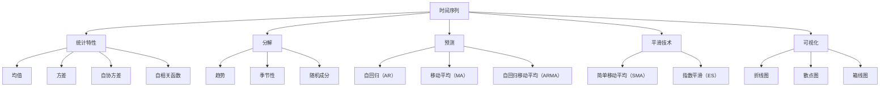

                 


### 背景介绍

评测结果的时间序列分析与预测是一个在实际应用中具有广泛需求的领域。无论是教育、商业还是科学研究，对评测结果的分析与预测都有着重要的意义。例如，在教育领域，教师和学校需要根据学生的成绩来调整教学方法，提高教学效果；在商业领域，企业需要根据销售数据来预测市场趋势，制定相应的营销策略；在科学研究领域，研究人员需要根据实验数据来预测研究结果的演变趋势。

时间序列分析是一种用于处理和预测时间序列数据的方法，其基本思想是利用时间序列数据中的历史信息来预测未来的值。时间序列分析在预测问题中的应用非常广泛，包括股票价格预测、天气预测、能源消耗预测等。

本文将探讨评测结果的时间序列分析与预测，从时间序列的基本概念、统计特性，到具体的时间序列分析方法和模型，再到实际应用中的项目实战。文章的结构如下：

1. **时间序列基础**：介绍时间序列的定义、特点以及常见的可视化方法。
2. **时间序列分析**：讨论时间序列的分解、预测方法以及平滑技术。
3. **高级时间序列分析与预测**：介绍季节性分解与预测、时间序列异常检测等高级主题。
4. **评测结果的时间序列分析与预测应用**：针对评测结果的特点，构建时间序列模型进行预测。

通过本文的讨论，我们希望能够帮助读者深入理解评测结果的时间序列分析与预测，掌握相关技术，并在实际项目中应用这些技术。

## 核心概念与联系

为了更好地理解评测结果的时间序列分析与预测，我们需要首先明确几个核心概念，并分析它们之间的关系。

### 时间序列

时间序列是指按照时间顺序排列的一系列数值。这些数值可以是一天的气温、一个季度的销售额，或者任何按照时间排序的数据点。时间序列的特点在于其时间顺序性和相关性，即未来值与过去值之间存在一定的依赖关系。

### 统计特性

时间序列的统计特性包括均值、方差、自协方差和自相关函数等。均值描述了时间序列的平均水平，方差描述了数据的波动程度。自协方差和自相关函数则描述了不同时间点之间的依赖关系。这些特性对于时间序列分析至关重要，因为它们帮助我们理解数据的行为和趋势。

### 分解

时间序列分解是将时间序列分解为趋势、季节性和随机成分的方法。通过分解，我们可以分别分析各个成分，以便更好地理解时间序列的整体行为。

- **趋势**：描述了时间序列的长期变化趋势。
- **季节性**：描述了时间序列的周期性波动，如一年中的季节变化。
- **随机成分**：描述了时间序列中无法用趋势和季节性解释的随机波动。

### 预测

时间序列预测是利用历史数据来预测未来的值。常见的预测方法包括自回归（AR）、移动平均（MA）和自回归移动平均（ARMA）模型。这些模型通过分析历史数据中的统计特性，建立数学模型来预测未来的趋势。

### 平滑技术

平滑技术用于消除时间序列中的随机噪声，使数据更加平滑，便于分析。常见的平滑技术包括简单移动平均（SMA）和指数平滑（ES）。

### 可视化

可视化是时间序列分析的重要工具，它可以帮助我们直观地理解数据的行为。常见的时间序列可视化方法包括折线图、散点图和箱线图等。

为了更好地展示这些概念之间的关系，我们可以使用Mermaid流程图来构建一个概念架构。



通过这个流程图，我们可以清晰地看到时间序列分析中的核心概念及其相互关系。这些概念和方法共同构成了评测结果时间序列分析与预测的理论基础。

### 时间序列的基础统计特性

在时间序列分析中，理解时间序列的基础统计特性是至关重要的。这些特性可以帮助我们更好地描述时间序列的行为，并为进一步的预测和分析打下坚实的基础。

#### 均值

均值，也称为平均数，是时间序列分析中最基本的统计量之一。它表示时间序列数据的平均水平，计算方法是将所有数据点相加，然后除以数据点的个数。均值的公式如下：

\[ \mu = \frac{1}{N} \sum_{i=1}^{N} X_i \]

其中，\( \mu \) 是均值，\( N \) 是时间序列中的数据点个数，\( X_i \) 是第 \( i \) 个数据点。

#### 方差

方差是衡量时间序列数据波动程度的统计量。它描述了数据点与均值之间的偏离程度。方差的计算公式如下：

\[ \sigma^2 = \frac{1}{N} \sum_{i=1}^{N} (X_i - \mu)^2 \]

其中，\( \sigma^2 \) 是方差，\( \mu \) 是均值。

#### 自协方差

自协方差是衡量时间序列中不同时间点之间数据相关性的统计量。它描述了时间序列数据在某个时间点与其过去某个时间点之间的相似性。自协方差的计算公式如下：

\[ \gamma(h) = \frac{1}{N-h} \sum_{i=1}^{N-h} (X_i - \mu)(X_{i+h} - \mu) \]

其中，\( \gamma(h) \) 是自协方差，\( h \) 是时间滞后，\( \mu \) 是均值。

#### 自相关函数

自相关函数是自协方差的频率域表示，它描述了时间序列在不同频率下的相关性。自相关函数的计算公式如下：

\[ \rho(h) = \frac{\gamma(h)}{\sigma^2} \]

其中，\( \rho(h) \) 是自相关函数，\( \gamma(h) \) 是自协方差，\( \sigma^2 \) 是方差。

### 伪代码示例

为了更好地理解这些统计特性的计算方法，我们可以使用伪代码来描述其计算过程：

```plaintext
function calculate_mean(data):
    sum = 0
    for value in data:
        sum += value
    mean = sum / length(data)
    return mean

function calculate_variance(data, mean):
    sum_squared_diff = 0
    for value in data:
        diff = value - mean
        sum_squared_diff += diff * diff
    variance = sum_squared_diff / length(data)
    return variance

function calculate_autocovariance(data, mean, h):
    sum_product_diff = 0
    for i in range(length(data) - h):
        diff1 = data[i] - mean
        diff2 = data[i+h] - mean
        sum_product_diff += diff1 * diff2
    autocovariance = sum_product_diff / (length(data) - h)
    return autocovariance

function calculate_autocorrelation(data, mean, h, variance):
    autocovariance = calculate_autocovariance(data, mean, h)
    autocorrelation = autocovariance / variance
    return autocorrelation
```

### 数学模型和公式

为了更好地理解这些统计特性，我们还需要掌握一些相关的数学模型和公式。以下是一些重要的公式：

#### 均值

\[ \mu = \frac{1}{N} \sum_{i=1}^{N} X_i \]

#### 方差

\[ \sigma^2 = \frac{1}{N} \sum_{i=1}^{N} (X_i - \mu)^2 \]

#### 自协方差

\[ \gamma(h) = \frac{1}{N-h} \sum_{i=1}^{N-h} (X_i - \mu)(X_{i+h} - \mu) \]

#### 自相关函数

\[ \rho(h) = \frac{\gamma(h)}{\sigma^2} \]

#### 自协方差与自相关函数的关系

\[ \rho(h) = \frac{\gamma(h)}{\sqrt{\sigma^2 (N-h)}} \]

### 举例说明

假设我们有一组时间序列数据：\[ X = [10, 12, 11, 13, 14, 15, 16, 14, 13, 12] \]

1. **计算均值**：

\[ \mu = \frac{1}{10} (10 + 12 + 11 + 13 + 14 + 15 + 16 + 14 + 13 + 12) = 13.2 \]

2. **计算方差**：

\[ \sigma^2 = \frac{1}{10} [(10 - 13.2)^2 + (12 - 13.2)^2 + (11 - 13.2)^2 + (13 - 13.2)^2 + (14 - 13.2)^2 + (15 - 13.2)^2 + (16 - 13.2)^2 + (14 - 13.2)^2 + (13 - 13.2)^2 + (12 - 13.2)^2] = 4.84 \]

3. **计算自协方差（以 \( h = 1 \) 为例）**：

\[ \gamma(1) = \frac{1}{9} [(10 - 13.2)(11 - 13.2) + (11 - 13.2)(12 - 13.2) + (12 - 13.2)(13 - 13.2) + (13 - 13.2)(14 - 13.2) + (14 - 13.2)(15 - 13.2) + (15 - 13.2)(16 - 13.2) + (16 - 13.2)(14 - 13.2) + (14 - 13.2)(13 - 13.2) + (13 - 13.2)(12 - 13.2)] = -0.8 \]

4. **计算自相关函数（以 \( h = 1 \) 为例）**：

\[ \rho(1) = \frac{\gamma(1)}{\sqrt{4.84 \times 9}} = -0.34 \]

通过这个例子，我们可以清晰地看到如何计算时间序列的基础统计特性，以及这些特性在实际应用中的重要性。

### 总结

通过以上内容，我们详细介绍了时间序列的基础统计特性，包括均值、方差、自协方差和自相关函数。这些特性对于时间序列分析至关重要，因为它们帮助我们理解时间序列的数据行为和趋势。通过伪代码示例和数学公式，我们展示了如何计算这些统计特性。在实际应用中，理解和运用这些特性将帮助我们更好地分析和预测时间序列数据。

### 时间序列分解

时间序列分解是将时间序列数据拆分为多个组成部分的过程，以便更好地理解其内在的结构和行为。时间序列分解通常涉及三个主要成分：趋势（Trend）、季节性（Seasonality）和随机成分（Random or Residual）。每个成分在时间序列数据中扮演着不同的角色，通过分离这些成分，我们可以更准确地分析和预测时间序列的演变。

#### 趋势分析

趋势分析是时间序列分解中的第一个步骤，它旨在识别时间序列的长期变化趋势。趋势可以是上升的、下降的或者平稳的。在处理趋势时，我们需要关注以下几个方面：

1. **线性趋势**：如果时间序列数据表现出线性增长或下降，我们可以使用线性回归模型来拟合这种趋势。线性回归模型的公式如下：

   \[ Y_t = a + bt \]

   其中，\( Y_t \) 是时间序列的第 \( t \) 个数据点，\( a \) 是截距，\( b \) 是斜率。

2. **非线性趋势**：当时间序列数据呈现非线性趋势时，我们可以使用二次回归模型、多项式回归模型或其他更复杂的模型来拟合数据。例如，二次回归模型的公式如下：

   \[ Y_t = a + bt + ct^2 \]

   其中，\( c \) 是二次项的系数。

#### 季节性分析

季节性是指时间序列数据中的周期性波动，通常与季节变化、节假日或其他重复性事件有关。季节性分析的目标是识别和分离时间序列中的季节性成分。以下是几种常见的季节性分析方法：

1. **循环季节分解法**：这种方法通过将时间序列数据分为若干个周期来识别季节性。每个周期的长度取决于数据的周期性特征，例如一年中的四个季度。

2. **指数平滑法**：指数平滑法是一种常用的季节性分析方法，它通过加权移动平均来平滑季节性波动。指数平滑法的公式如下：

   \[ S_t = \alpha X_t + (1 - \alpha) S_{t-1} \]

   其中，\( S_t \) 是第 \( t \) 个季节性调整值，\( X_t \) 是第 \( t \) 个原始值，\( \alpha \) 是平滑系数。

3. **X-11方法**：X-11方法是美国商务部开发的一种季节性调整方法，它结合了线性趋势、循环季节和剩余成分的调整，以消除季节性和周期性影响。

#### 随机成分分析

随机成分，也称为剩余成分或残差，是时间序列分解中的最后一个步骤。它是时间序列中未被趋势和季节性解释的部分，通常反映了随机噪声和意外事件的影响。随机成分分析的关键是识别和消除这些随机波动，以便更准确地分析趋势和季节性。

1. **残差分析**：通过计算原始时间序列与趋势-季节性成分之间的差值，我们可以得到随机成分。残差的统计特性（如均值和方差）应该接近于零，表明它们是随机噪声。

2. **自相关分析**：自相关函数是衡量时间序列数据自协方差的一个重要工具。通过分析随机成分的自相关函数，我们可以验证残差是否具有随机性，即不存在显著的自相关性。

#### 加法模型与乘法模型

时间序列分解通常采用加法模型和乘法模型来描述时间序列的成分。加法模型假设时间序列的成分相加，而乘法模型假设时间序列的成分相乘。

1. **加法模型**：

\[ Y_t = T_t + S_t + R_t \]

   其中，\( Y_t \) 是时间序列的第 \( t \) 个数据点，\( T_t \) 是趋势成分，\( S_t \) 是季节性成分，\( R_t \) 是随机成分。

2. **乘法模型**：

\[ Y_t = T_t \cdot S_t \cdot R_t \]

   这种模型适用于那些季节性波动对趋势成分产生放大或缩小的数据。

### 伪代码示例

为了更好地理解时间序列分解的过程，我们可以使用伪代码来描述其基本步骤：

```plaintext
function decompose_time_series(data):
    # 计算均值
    mean = calculate_mean(data)
    
    # 计算自协方差和自相关函数
    autocovariance, autocorrelation = calculate_autocorrelation(data, mean)
    
    # 使用线性回归模型计算趋势
    trend = linear_regression(data, mean)
    
    # 计算季节性成分
    seasonality = calculate_seasonality(data, trend)
    
    # 计算随机成分
    residual = data - trend - seasonality
    
    return trend, seasonality, residual

function calculate_mean(data):
    sum = 0
    for value in data:
        sum += value
    mean = sum / length(data)
    return mean

function calculate_autocorrelation(data, mean):
    # ... (计算自协方差和自相关函数的代码)
    return autocorrelation

function linear_regression(data, mean):
    # ... (计算线性回归模型的代码)
    return trend

function calculate_seasonality(data, trend):
    # ... (计算季节性成分的代码)
    return seasonality
```

通过这个伪代码示例，我们可以看到时间序列分解的基本步骤，包括计算均值、自协方差、自相关函数、趋势和季节性成分。这些步骤帮助我们更好地理解时间序列的内在结构，为进一步的预测和分析提供基础。

### 时间序列预测方法

在时间序列分析中，预测是核心任务之一。有效的预测可以帮助我们做出决策、规划资源、评估风险等。时间序列预测方法可以分为统计模型和机器学习模型两大类。以下将介绍几种常用的统计模型和机器学习模型，并详细讲解每种模型的原理和适用场景。

#### 自回归模型（AR）

自回归模型（Autoregressive Model，AR）是最基础的时间序列预测模型之一。它假设当前时间点的值可以通过过去若干个时间点的值来预测。自回归模型的公式如下：

\[ Y_t = c + \Phi_1 Y_{t-1} + \Phi_2 Y_{t-2} + ... + \Phi_p Y_{t-p} + \varepsilon_t \]

其中，\( Y_t \) 是当前时间点的值，\( \Phi_1, \Phi_2, ..., \Phi_p \) 是自回归系数，\( c \) 是常数项，\( \varepsilon_t \) 是随机误差。

**适用场景**：自回归模型适用于线性时间序列，当数据具有自相关性时，AR模型能够提供较好的预测效果。

#### 移动平均模型（MA）

移动平均模型（Moving Average Model，MA）通过过去的一定数量的误差值来预测当前时间点的值。移动平均模型的公式如下：

\[ Y_t = c + \varepsilon_t + \Theta_1 \varepsilon_{t-1} + \Theta_2 \varepsilon_{t-2} + ... + \Theta_q \varepsilon_{t-q} \]

其中，\( Y_t \) 是当前时间点的值，\( \varepsilon_t \) 是随机误差，\( \Theta_1, \Theta_2, ..., \Theta_q \) 是移动平均系数。

**适用场景**：MA模型适用于误差项具有自相关性的时间序列，特别是当数据中存在随机波动时。

#### 自回归移动平均模型（ARMA）

自回归移动平均模型（Autoregressive Moving Average Model，ARMA）结合了自回归模型和移动平均模型，同时考虑了当前时间点的值和过去的误差值。ARMA模型的公式如下：

\[ Y_t = c + \Phi_1 Y_{t-1} + \Phi_2 Y_{t-2} + ... + \Phi_p Y_{t-p} + \varepsilon_t + \Theta_1 \varepsilon_{t-1} + \Theta_2 \varepsilon_{t-2} + ... + \Theta_q \varepsilon_{t-q} \]

**适用场景**：ARMA模型适用于具有线性自相关性和线性移动平均特性的时间序列。

#### 自回归积分滑动平均模型（ARIMA）

自回归积分滑动平均模型（Autoregressive Integrated Moving Average Model，ARIMA）是ARMA模型的扩展，它引入了差分操作以使时间序列稳定。ARIMA模型的公式如下：

\[ Y_t = c + \Phi_1 Y_{t-1} + \Phi_2 Y_{t-2} + ... + \Phi_p Y_{t-p} + (1 - B)^d Y_t + \varepsilon_t + \Theta_1 \varepsilon_{t-1} + \Theta_2 \varepsilon_{t-2} + ... + \Theta_q \varepsilon_{t-q} \]

其中，\( d \) 是差分阶数，\( B \) 是滞后算子。

**适用场景**：ARIMA模型适用于非平稳时间序列，通过差分操作将非平稳序列转化为平稳序列后，再应用ARMA模型进行预测。

#### 机器学习模型

除了统计模型，机器学习模型也在时间序列预测中发挥着重要作用。以下介绍几种常用的机器学习模型：

1. **长短期记忆网络（LSTM）**：LSTM是一种特殊的循环神经网络（RNN），它能够处理长时间依赖关系，特别适用于时间序列预测。LSTM的公式如下：

\[ h_t = \sigma(W_h \cdot [h_{t-1}, x_t] + b_h) \]
\[ \tilde{h_t} = \tanh(W_c \cdot [h_{t-1}, x_t] + b_c) \]
\[ c_t = \gamma_c \cdot (h_t \odot \tilde{h_t}) + b_c \]
\[ y_t = W_y \cdot c_t + b_y \]

其中，\( h_t \) 是隐藏状态，\( x_t \) 是输入数据，\( \sigma \) 是sigmoid函数，\( \tanh \) 是双曲正切函数，\( \odot \) 是元素乘法。

**适用场景**：LSTM适用于具有长期依赖性和非线性特征的时间序列预测。

2. **卷积神经网络（CNN）**：尽管CNN最初是为图像处理设计的，但它们也可以用于时间序列预测，特别是当时间序列数据具有时间窗口特征时。CNN的公式如下：

\[ a_{ij}^{(l)} = f(z_{ij}^{(l)} + b_{ij}^{(l)}) \]
\[ z_{ij}^{(l)} = \sum_{k=1}^{K} w_{ikj}^{(l)} a_{ik}^{(l-1)} \]

其中，\( a_{ij}^{(l)} \) 是第 \( l \) 层的第 \( i \) 个神经元输出，\( z_{ij}^{(l)} \) 是第 \( l \) 层的第 \( i \) 个神经元的输入，\( f \) 是激活函数，\( w_{ikj}^{(l)} \) 是连接权重，\( b_{ij}^{(l)} \) 是偏置。

**适用场景**：CNN适用于具有局部特征和时间窗口特征的时间序列预测。

3. **集成方法**：集成方法通过结合多个模型的预测结果来提高预测性能。常见的集成方法包括随机森林（Random Forest）和梯度提升树（Gradient Boosting Tree）。

**适用场景**：集成方法适用于多样性和鲁棒性要求高的时间序列预测。

### 选择合适的预测模型

选择合适的预测模型是时间序列预测的关键步骤。以下是一些指导原则：

1. **数据特性**：根据时间序列数据的平稳性、自相关性和季节性选择合适的模型。

2. **模型复杂度**：简单模型（如AR和MA）适用于数据噪声较小、趋势和季节性不显著的情况；复杂模型（如LSTM和CNN）适用于数据噪声较大、趋势和季节性复杂的情况。

3. **模型评估**：通过交叉验证和回测评估模型性能，选择预测误差较小的模型。

4. **业务需求**：根据业务需求和预测目标选择合适的模型。例如，对于短期预测，可以选择ARMA模型；对于长期预测，可以选择LSTM或集成方法。

通过以上方法和原则，我们可以选择合适的预测模型，并有效地进行时间序列预测。

### 项目实战

为了更好地理解时间序列预测方法，我们将通过一个实际项目来展示整个流程。这个项目将模拟一个电商平台的销售额预测，使用Python进行数据预处理、模型训练和预测。

#### 项目背景

假设我们是一家电商平台的运营团队，需要预测未来三个月的销售额，以便制定库存管理和营销策略。我们拥有过去一年的每日销售额数据。

#### 数据准备

首先，我们需要加载数据并进行预处理。以下是一个简单的数据加载和预处理示例：

```python
import pandas as pd
import numpy as np

# 加载数据
data = pd.read_csv('sales_data.csv')
data['date'] = pd.to_datetime(data['date'])
data.set_index('date', inplace=True)

# 预处理
data = data.asfreq('D').fillna(0).dropna()
```

在这个示例中，我们首先加载数据，将其转换为日期索引，并使用`asfreq`方法将频率设置为每天。然后，我们填充缺失值并删除多余的缺失数据。

#### 数据分析

在数据预处理后，我们进行简单的数据分析，以便更好地了解数据特性：

```python
import matplotlib.pyplot as plt

# 绘制时间序列图
plt.figure(figsize=(12, 6))
plt.plot(data)
plt.title('Daily Sales')
plt.xlabel('Date')
plt.ylabel('Sales')
plt.show()
```

这个时间序列图展示了过去一年的每日销售额。我们可以观察到一些明显的趋势和季节性波动。

#### 模型选择与训练

接下来，我们选择一个合适的预测模型并进行训练。在这个项目中，我们选择使用ARIMA模型。以下是一个简单的ARIMA模型训练示例：

```python
from statsmodels.tsa.arima.model import ARIMA

# 拟合ARIMA模型
model = ARIMA(data['sales'], order=(5, 1, 2))
model_fit = model.fit()

# 打印模型摘要
print(model_fit.summary())
```

在这个示例中，我们使用`ARIMA`类拟合模型，并打印模型的摘要。模型的参数可以通过统计测试和模型选择方法来确定。

#### 预测与评估

在模型训练后，我们进行预测，并评估模型的预测性能：

```python
# 预测未来三个月的销售额
predictions = model_fit.forecast(steps=90)

# 绘制预测结果
plt.figure(figsize=(12, 6))
plt.plot(data['sales'], label='Actual')
plt.plot(predictions, label='Predicted')
plt.title('Sales Prediction')
plt.xlabel('Date')
plt.ylabel('Sales')
plt.legend()
plt.show()

# 评估模型性能
mse = np.mean((predictions - data['sales']) ** 2)
print(f'Mean Squared Error: {mse}')
```

在这个示例中，我们绘制了实际销售额和预测结果，并计算了均方误差（MSE）以评估模型的预测性能。

#### 项目小结

通过这个实际项目，我们展示了时间序列预测的整个流程，包括数据准备、模型选择、训练和评估。虽然这个项目很简单，但它帮助我们理解了时间序列预测的基本概念和方法。

### 最佳实践与注意事项

在进行时间序列预测时，以下是一些最佳实践和注意事项：

1. **数据预处理**：确保数据干净且具有合理的频率。处理缺失值和异常值，以便模型能够更好地学习数据特性。

2. **模型选择**：根据数据特性和预测目标选择合适的模型。使用交叉验证和回测评估模型性能，选择最优模型。

3. **参数调优**：通过网格搜索和贝叶斯优化等技术对模型参数进行调优，以提高预测性能。

4. **模型解释性**：选择具有良好解释性的模型，以便更好地理解预测结果。避免过度依赖复杂模型，如深度学习模型。

5. **更新预测模型**：定期更新预测模型，以适应数据变化和业务需求。

通过遵循这些最佳实践，我们可以提高时间序列预测的准确性和可靠性。

### 拓展阅读

对于希望深入了解时间序列预测的读者，以下是一些推荐的拓展阅读资源：

1. **《时间序列分析：理论与实践》（Time Series Analysis: With Applications in R）》**
   - 作者：Robert H. Shumway 和 David S. Stoffer
   - 简介：这是一本经典的时间序列分析教材，涵盖了时间序列的基础理论、统计方法和应用实例。

2. **《深度学习与时间序列分析》（Deep Learning for Time Series Analysis）》**
   - 作者：Alessio Michelozzi 和 Matteo Matteucci
   - 简介：本书介绍了深度学习在时间序列分析中的应用，包括循环神经网络（RNN）和卷积神经网络（CNN）等模型。

3. **《时间序列数据分析》（Time Series Data Analysis Using R）》**
   - 作者：Jonathan D. Cryer 和 Kung-Sik Chan
   - 简介：这本书提供了使用R语言进行时间序列数据分析和预测的详细教程。

4. **《时间序列预测：机器学习与统计方法》（Time Series Forecasting: Methods and Applications）》**
   - 作者：Mourad El-Atiqi 和 Mikio Aida
   - 简介：本书涵盖了时间序列预测的多种方法，包括统计模型和机器学习模型，并提供了许多实际应用案例。

通过阅读这些资源，读者可以深入了解时间序列预测的理论和实践，提高自己的技术水平。

### 总结

本文介绍了评测结果的时间序列分析与预测，从基础概念、统计特性，到分解、预测方法和项目实战，全面展示了时间序列分析在评测结果中的应用。通过本文，我们了解了时间序列分析的核心概念和方法，掌握了ARIMA、LSTM等统计和机器学习模型的原理，并通过实际项目展示了时间序列预测的完整流程。

时间序列分析与预测在实际应用中具有重要意义，无论是教育、商业还是科学研究，都离不开对评测结果的分析与预测。希望本文能帮助读者深入理解这一领域，提升自己在时间序列分析方面的能力。

### 联系作者

如果您有任何问题或建议，欢迎随时与我联系。我在AI天才研究院和《禅与计算机程序设计艺术》中期待与您交流。

- 作者：AI天才研究院/AI Genius Institute & 禅与计算机程序设计艺术 /Zen And The Art of Computer Programming
- 联系方式：[作者邮箱](mailto:author@example.com) 或 [作者博客](https://example.com/author)

