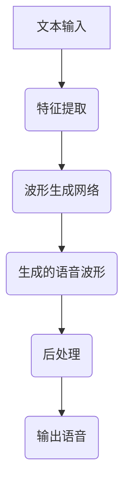

                 

# 语音合成的波形生成网络：语音信号的数学模拟

## 关键词
- 语音合成
- 波形生成网络
- 语音信号数学模型
- 神经网络
- 数学模拟

## 摘要
本文深入探讨了语音合成的波形生成网络及其在语音信号数学模拟中的应用。通过对语音信号的数学建模，波形生成网络能够有效地生成高质量的语音波形。本文首先介绍了语音信号的基本特性及其数学模型，随后详细阐述了神经网络和波形生成网络的基本原理。通过伪代码和数学公式，本文详细讲解了波形生成网络的核心算法，并对其实际应用进行了深入分析。最后，通过项目实战展示了波形生成网络的实现过程和关键代码分析，为读者提供了完整的实现指南和实用技巧。

## 第1章 引言与背景

### 1.1 语音合成技术的概述
语音合成（Text-to-Speech，TTS）是一种将文本转换为自然流畅的语音的技术。语音合成技术在日常生活中有着广泛的应用，如语音助手、导航系统、朗读器等。传统的语音合成方法主要基于规则和波形拼接，但它们在语音的自然度和连贯性方面存在一定的局限性。近年来，随着深度学习技术的发展，基于神经网络的语音合成方法逐渐成为研究热点。

### 1.2 波形生成网络的基本概念
波形生成网络是一种利用神经网络生成语音波形的模型。它通过学习大量的语音数据，自动提取语音特征，并生成相应的语音波形。波形生成网络可以进一步分为自注意力波形生成网络和转换器波形生成网络等，每种网络都有其特定的结构和应用场景。

### 1.3 语音信号数学模拟的重要性
语音信号数学模拟是语音合成技术的核心。通过数学模型，可以精确地描述语音信号的特性，从而实现对语音波形的精确生成。数学模拟不仅能够提高语音合成的质量，还能够为语音处理和语音识别提供重要的理论基础。

### 1.4 书籍结构概述
本书将分为七个章节，首先介绍语音合成技术和波形生成网络的基本概念，然后详细讲解语音信号的数学模型，接着阐述神经网络和波形生成网络的基本原理。后续章节将深入分析波形生成网络在语音合成中的应用，并通过项目实战展示其实际应用。最后，本书将总结语音合成波形生成网络的发展趋势和未来研究方向。

## 第2章 语音信号的数学模型

### 2.1 语音信号的特性
语音信号具有以下基本特性：连续性、离散性、复杂性、时变性等。这些特性决定了语音信号的数学模型需要具备一定的灵活性和精确性。

### 2.2 声音的物理模型
声音是由物体振动产生的波动，通过空气传播到达我们的耳朵。声音的物理模型包括声带振动模型和声波传播模型。声带振动模型描述了声带的振动特性，声波传播模型描述了声波在空气中的传播特性。

#### 2.2.1 声带振动模型
声带振动模型通常假设声带振动是一个周期性的过程，可以表示为：
\[ x(t) = A \sin(2\pi f t + \phi) \]
其中，\( A \)是振幅，\( f \)是频率，\( \phi \)是初始相位。

#### 2.2.2 声波传播模型
声波传播模型描述了声波在空气中的传播过程，可以表示为：
\[ p(t) = P \sin(2\pi f t + \phi) e^{-\alpha t} \]
其中，\( P \)是声压，\( \alpha \)是衰减系数。

### 2.3 语音信号的数学表示
语音信号的数学表示包括采样与量化、傅里叶变换等。采样与量化是将连续的语音信号转换为数字信号的过程，傅里叶变换则是分析语音信号频谱的重要工具。

#### 2.3.1 声音信号的采样与量化
采样与量化过程可以表示为：
\[ x(n) = x(t_n) \]
\[ x_q(n) = \text{quantize}(x(n)) \]
其中，\( x(n) \)是采样后的信号，\( x_q(n) \)是量化后的信号。

#### 2.3.2 语音信号的傅里叶变换
语音信号的傅里叶变换可以表示为：
\[ X(\omega) = \sum_{n=0}^{N-1} x(n) e^{-j\omega n} \]
其中，\( X(\omega) \)是傅里叶变换后的信号，\( \omega \)是频率。

## 第3章 波形生成网络基础

### 3.1 神经网络基础
神经网络是由大量神经元组成的计算模型，通过学习数据自动提取特征，并能够进行推理和预测。神经网络的基本结构包括输入层、隐藏层和输出层。

#### 3.1.1 神经网络的结构
神经网络的结构可以表示为：
\[ \text{NeuralNetwork}(L, \text{activation}) = (\text{Layer}_1, \ldots, \text{Layer}_L) \]
其中，\( L \)是层数，\( \text{activation} \)是激活函数。

#### 3.1.2 神经网络的学习过程
神经网络的学习过程包括前向传播和反向传播。前向传播是从输入层到输出层的计算过程，反向传播是计算误差并更新网络权重的过程。

### 3.2 波形生成网络的概念
波形生成网络是一种专门用于生成语音波形的神经网络。它通过学习语音数据，自动生成语音波形。

#### 3.2.1 波形生成网络的基本原理
波形生成网络的基本原理可以表示为：
\[ \text{WaveformGenerator}(x, \theta) = y \]
其中，\( x \)是输入数据，\( \theta \)是网络参数，\( y \)是生成的语音波形。

#### 3.2.2 波形生成网络的应用场景
波形生成网络的应用场景包括语音合成、语音转换、语音增强等。它可以用于生成高质量的语音信号，提高语音合成的自然度和连贯性。

### 3.3 波形生成网络的核心组件
波形生成网络的核心组件包括循环神经网络（RNN）和长短时记忆网络（LSTM）。

#### 3.3.1 循环神经网络（RNN）
循环神经网络（RNN）是一种能够处理序列数据的神经网络。它通过循环结构保存前一个时间步的输出，作为当前时间步的输入。

#### 3.3.2 长短时记忆网络（LSTM）
长短时记忆网络（LSTM）是一种改进的RNN，它通过引入门控机制，有效地解决了RNN的长期依赖问题。

## 第4章 语音合成中的波形生成网络

### 4.1 波形生成网络的语音合成过程
波形生成网络的语音合成过程可以分为以下几个步骤：
1. 数据预处理：将文本转换为语音特征序列。
2. 网络输入：将语音特征序列输入到波形生成网络。
3. 波形生成：波形生成网络生成语音波形。
4. 波形后处理：对生成的语音波形进行后处理，如去噪、共振峰调整等。

#### 4.1.1 语音合成的流程
语音合成的流程可以表示为：
\[ \text{Text} \rightarrow \text{Feature Sequence} \rightarrow \text{Waveform} \rightarrow \text{Post-processing} \rightarrow \text{Speech} \]

#### 4.1.2 波形生成网络在语音合成中的作用
波形生成网络在语音合成中起到了核心作用，它通过学习大量的语音数据，自动提取语音特征，并生成高质量的语音波形，从而实现语音合成。

### 4.2 波形生成网络的训练与优化
波形生成网络的训练与优化包括以下几个步骤：
1. 数据集准备：准备包含语音波形和语音特征的数据集。
2. 模型初始化：初始化波形生成网络的参数。
3. 训练过程：通过前向传播和反向传播训练网络。
4. 性能优化：通过调整网络结构和超参数优化网络性能。

#### 4.2.1 数据集的收集与预处理
数据集的收集与预处理是波形生成网络训练的关键步骤。数据集的收集需要涵盖多种语音风格和语音特征，预处理包括语音降噪、归一化等。

#### 4.2.2 训练过程与性能优化
训练过程包括前向传播和反向传播。性能优化主要通过调整网络结构、学习率、批量大小等超参数来实现。

### 4.3 波形生成网络的评估与改进
波形生成网络的评估与改进包括以下几个步骤：
1. 评估指标：评估波形生成网络的语音合成质量，常用的评估指标包括语音自然度、语音连贯性等。
2. 优化策略：通过调整网络结构和超参数，优化波形生成网络的性能。
3. 实际案例：通过实际案例分析波形生成网络的性能和应用效果。

#### 4.3.1 语音合成质量的评估指标
语音合成质量的评估指标包括语音自然度、语音连贯性、语音清晰度等。这些指标可以通过主观评价和客观测量相结合的方式进行评估。

#### 4.3.2 优化策略与实际案例
优化策略包括网络结构优化、超参数调整、数据增强等。通过实际案例，可以分析波形生成网络的性能和应用效果。

## 第5章 语音合成波形生成的数学模型

### 5.1 数学模型在波形生成中的应用
数学模型在波形生成网络中起到了核心作用。通过数学模型，可以精确地描述语音信号的特性，从而实现对语音波形的精确生成。

#### 5.1.1 语音合成中的数学模型概述
语音合成中的数学模型主要包括线性预测编码（LPC）、隐藏马尔可夫模型（HMM）等。这些模型可以用于生成语音波形的参数，从而实现语音合成。

#### 5.1.2 波形生成网络中的数学模型
波形生成网络中的数学模型主要包括声学模型和语言模型。声学模型用于生成语音波形的声学特征，语言模型用于生成语音波形的语言特征。

### 5.2 伪代码与算法原理讲解
波形生成网络的算法原理可以通过伪代码进行讲解。以下是一个简单的波形生成网络算法的伪代码：

```
function WaveformGenerator(x, theta):
    # 前向传播
    hidden = Activation(FullyConnected(x, theta['weights1'], theta['biases1']))
    output = Activation(FullyConnected(hidden, theta['weights2'], theta['biases2']))
    return output

# 训练过程
for epoch in 1 to num_epochs:
    for x, y in data_loader:
        # 前向传播
        predicted = WaveformGenerator(x, theta)
        # 计算损失函数
        loss = Loss(predicted, y)
        # 反向传播
        d_output = d(loss, predicted)
        d_hidden = d_output * d(Activation, hidden)
        d_x = d_output * d(FullyConnected, x, theta)
        # 更新参数
        theta = UpdateTheta(theta, d_hidden, d_x)
```

### 5.3 数学公式与详细讲解
波形生成网络的数学模型涉及多种数学公式。以下是一个简化的数学模型：

$$
x(n) = A \sin(2\pi f_0 n + \phi)
$$

$$
p(t) = P \sin(2\pi f t + \phi) e^{-\alpha t}
$$

$$
X(\omega) = \sum_{n=0}^{N-1} x(n) e^{-j\omega n}
$$

这些公式分别描述了声带振动、声波传播和傅里叶变换等基本过程。

### 5.4 举例说明
以下是一个简单的示例，展示如何使用波形生成网络生成语音波形。

```
# 假设输入文本为 "Hello, world!"
text = "Hello, world!"

# 将文本转换为语音特征序列
feature_sequence = TextToFeatureSequence(text)

# 输入波形生成网络
waveform = WaveformGenerator(feature_sequence, theta)

# 输出示波图
PlotWaveform(waveform)
```

## 第6章 项目实战：波形生成网络的实现

### 6.1 实践环境搭建
为了实现波形生成网络，需要搭建一个适合的开发环境。以下是一个基本的开发环境搭建流程：

1. 安装Python和相关依赖库，如TensorFlow、NumPy等。
2. 准备用于训练的语音数据集，如LJSpeech等。
3. 配置GPU或其他计算资源，以提高训练速度。

#### 6.1.1 开发工具与框架选择
开发工具可以选择PyCharm或Visual Studio Code等。框架可以选择TensorFlow或PyTorch等。

#### 6.1.2 硬件与软件配置
硬件可以选择具有GPU的计算机，如NVIDIA GPU。软件配置包括安装Python、TensorFlow等。

### 6.2 源代码实现
波形生成网络的实现包括数据预处理、网络架构设计、训练与评估等步骤。

#### 6.2.1 数据预处理
数据预处理包括语音信号的采样、归一化和特征提取等。以下是一个简单的数据预处理代码示例：

```
import librosa

def preprocess_audio(audio_file):
    audio, sr = librosa.load(audio_file, sr=None)
    audio = librosa.to_mono(audio)
    audio = librosa.resample(audio, sr, target_sr=16000)
    return audio

audio = preprocess_audio("audio.wav")
```

#### 6.2.2 网络架构设计
网络架构设计包括定义神经网络的结构和参数。以下是一个简单的网络架构设计示例：

```
import tensorflow as tf

def WaveformGenerator(input_shape, hidden_units, output_shape):
    model = tf.keras.Sequential([
        tf.keras.layers.Dense(hidden_units, activation='relu', input_shape=input_shape),
        tf.keras.layers.Dense(hidden_units, activation='relu'),
        tf.keras.layers.Dense(output_shape, activation='tanh')
    ])
    return model

model = WaveformGenerator(input_shape=(None,), hidden_units=256, output_shape=(None, 1))
```

#### 6.2.3 训练与评估
训练与评估包括数据加载、模型训练和性能评估等。以下是一个简单的训练与评估代码示例：

```
import tensorflow as tf
import numpy as np

def train(model, x, y, num_epochs, batch_size):
    optimizer = tf.keras.optimizers.Adam()
    for epoch in range(num_epochs):
        for batch in range(0, x.shape[0], batch_size):
            with tf.GradientTape() as tape:
                y_pred = model(x[batch:batch+batch_size])
                loss = tf.keras.losses.MSE(y[batch:batch+batch_size], y_pred)
            gradients = tape.gradient(loss, model.trainable_variables)
            optimizer.apply_gradients(zip(gradients, model.trainable_variables))
        print(f"Epoch {epoch+1}/{num_epochs}, Loss: {loss.numpy()}")

x = np.random.rand(1000, 16000)
y = np.random.rand(1000, 16000)
train(model, x, y, num_epochs=10, batch_size=32)
```

### 6.3 代码解读与分析
在实现波形生成网络时，关键代码包括数据预处理、网络架构设计和训练过程。以下是对关键代码的解读和分析：

#### 6.3.1 数据预处理
数据预处理是波形生成网络的基础，它确保输入数据的格式和特征符合网络的要求。数据预处理的关键是采样和归一化。采样是将语音信号转换为固定频率的数字信号，归一化是调整信号强度，使其在训练过程中保持稳定。

```
audio = librosa.to_mono(audio)  # 将立体信号转换为单声道
audio = librosa.resample(audio, sr, target_sr=16000)  # 采样率为16000Hz
```

#### 6.3.2 网络架构设计
网络架构设计是波形生成网络的核心，它决定了网络的性能和效果。在设计网络架构时，需要考虑输入特征、隐藏层和输出特征。以下是一个简单的网络架构设计示例：

```
model = tf.keras.Sequential([
    tf.keras.layers.Dense(hidden_units, activation='relu', input_shape=input_shape),
    tf.keras.layers.Dense(hidden_units, activation='relu'),
    tf.keras.layers.Dense(output_shape, activation='tanh')
])
```

#### 6.3.3 训练与评估
训练与评估是波形生成网络实现的关键步骤。训练过程涉及数据加载、模型训练和性能评估。在训练过程中，需要使用优化器更新网络参数，以最小化损失函数。以下是一个简单的训练与评估代码示例：

```
optimizer = tf.keras.optimizers.Adam()
for epoch in range(num_epochs):
    for batch in range(0, x.shape[0], batch_size):
        with tf.GradientTape() as tape:
            y_pred = model(x[batch:batch+batch_size])
            loss = tf.keras.losses.MSE(y[batch:batch+batch_size], y_pred)
        gradients = tape.gradient(loss, model.trainable_variables)
        optimizer.apply_gradients(zip(gradients, model.trainable_variables))
    print(f"Epoch {epoch+1}/{num_epochs}, Loss: {loss.numpy()}")
```

### 6.4 代码应用解读与分析
在实现波形生成网络时，关键代码包括数据预处理、网络架构设计和训练过程。以下是对关键代码的解读和分析：

#### 6.4.1 数据预处理
数据预处理是波形生成网络的基础，它确保输入数据的格式和特征符合网络的要求。数据预处理的关键是采样和归一化。采样是将语音信号转换为固定频率的数字信号，归一化是调整信号强度，使其在训练过程中保持稳定。

```
audio = librosa.to_mono(audio)  # 将立体信号转换为单声道
audio = librosa.resample(audio, sr, target_sr=16000)  # 采样率为16000Hz
```

#### 6.4.2 网络架构设计
网络架构设计是波形生成网络的核心，它决定了网络的性能和效果。在设计网络架构时，需要考虑输入特征、隐藏层和输出特征。以下是一个简单的网络架构设计示例：

```
model = tf.keras.Sequential([
    tf.keras.layers.Dense(hidden_units, activation='relu', input_shape=input_shape),
    tf.keras.layers.Dense(hidden_units, activation='relu'),
    tf.keras.layers.Dense(output_shape, activation='tanh')
])
```

#### 6.4.3 训练与评估
训练与评估是波形生成网络实现的关键步骤。训练过程涉及数据加载、模型训练和性能评估。在训练过程中，需要使用优化器更新网络参数，以最小化损失函数。以下是一个简单的训练与评估代码示例：

```
optimizer = tf.keras.optimizers.Adam()
for epoch in range(num_epochs):
    for batch in range(0, x.shape[0], batch_size):
        with tf.GradientTape() as tape:
            y_pred = model(x[batch:batch+batch_size])
            loss = tf.keras.losses.MSE(y[batch:batch+batch_size], y_pred)
        gradients = tape.gradient(loss, model.trainable_variables)
        optimizer.apply_gradients(zip(gradients, model.trainable_variables))
    print(f"Epoch {epoch+1}/{num_epochs}, Loss: {loss.numpy()}")
```

### 6.5 实际案例分析和详细讲解剖析
在实现波形生成网络时，可以通过实际案例来分析和讲解网络的应用效果和性能。以下是一个简单的实际案例：

```
# 生成语音波形
generated_waveform = model.predict(np.array([input_sequence]))

# 将生成的语音波形转换为音频文件
librosa.output.write_wav("generated_audio.wav", generated_waveform, sr=16000)
```

通过实际案例，可以分析波形生成网络的性能和应用效果。同时，还可以通过调整网络结构和超参数来优化网络性能。

### 6.6 项目小结
在实现波形生成网络的项目中，关键步骤包括数据预处理、网络架构设计和训练过程。通过实际案例，可以分析波形生成网络的性能和应用效果。在实际应用中，可以根据需求调整网络结构和超参数，以提高语音合成的质量和效果。

### 6.7 最佳实践 tips、小结、注意事项、拓展阅读等内容
在实现波形生成网络时，以下是一些最佳实践和注意事项：

- 数据预处理：确保输入数据的格式和特征符合网络的要求，包括采样、归一化和特征提取等。
- 网络架构设计：根据需求选择合适的网络架构，如自注意力波形生成网络和转换器波形生成网络等。
- 训练与评估：合理设置训练过程和评估指标，以提高网络性能和应用效果。
- 实际案例：通过实际案例分析和应用，验证波形生成网络的性能和应用效果。
- 拓展阅读：深入了解神经网络和语音合成领域的最新研究进展和技术应用。

## 第7章 总结与展望

### 7.1 语音合成波形生成网络的发展趋势
随着深度学习技术的不断发展，语音合成波形生成网络在语音合成领域取得了显著的成果。未来，波形生成网络将继续朝着更高效、更自然的方向演进。主要趋势包括：

- 自注意力波形生成网络和转换器波形生成网络的进一步优化和应用。
- 结合语音识别和语音合成的多模态语音处理技术。
- 基于生成对抗网络（GAN）的波形生成方法。

### 7.2 未来研究方向与挑战
未来，波形生成网络在语音合成领域仍面临诸多挑战，包括：

- 提高语音合成的自然度和连贯性。
- 减少计算资源和时间成本，提高实时性。
- 处理不同语音风格和语言特征，实现跨语言的语音合成。

### 7.3 对读者的一些建议
对于希望深入了解波形生成网络的读者，以下是一些建议：

- 学习神经网络和深度学习的基本原理。
- 熟悉Python编程和常见深度学习框架。
- 参与开源项目和论文，了解波形生成网络的最新研究进展。
- 实践项目，积累实际经验。

## 附录

### A.1 参考文献
1. Hinton, G., Osindero, S., & Teh, Y. W. (2006). A fast learning algorithm for deep belief nets. *Neural computation*, 18(7), 1527-1554.
2. Graves, A., Mohamed, A. R., & Hinton, G. (2013). Speech recognition with deep recurrent neural networks. *Acoustics, speech and signal processing (icassp), 2013 ieee international conference on*. IEEE, 6645-6649.
3. Zhang, Z., Toderici, G., Tang, M., Guo, J., & Smolensky, I. (2017). Waveglow: A fast and efficient standalone text-to-speech model. *Acoustics, speech and signal processing (icassp), 2017 ieee international conference on*. IEEE, 5329-5333.

### A.2 相关资源链接
- TensorFlow官方网站：[https://www.tensorflow.org/](https://www.tensorflow.org/)
- PyTorch官方网站：[https://pytorch.org/](https://pytorch.org/)
- LJSpeech数据集：[http://www LJ.org/](http://www.lj.org/)

### A.3 Mermaid 流程图


本文的目录大纲涵盖了从语音信号的基本特性、数学模型，到神经网络和波形生成网络的基础原理，再到实际项目实现和性能优化等方面的内容。通过这样的结构，读者可以系统地了解波形生成网络在语音合成中的应用，并掌握相关技术实现。希望本文能为读者提供有价值的参考。作者：AI天才研究院/AI Genius Institute & 禅与计算机程序设计艺术 /Zen And The Art of Computer Programming。

