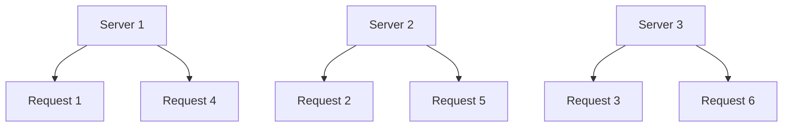
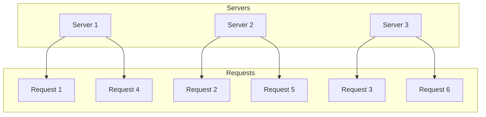
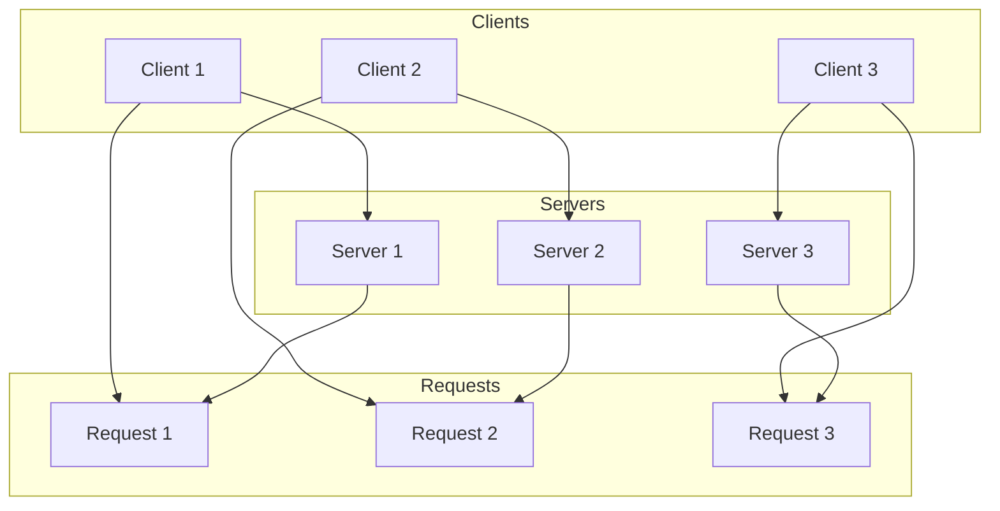
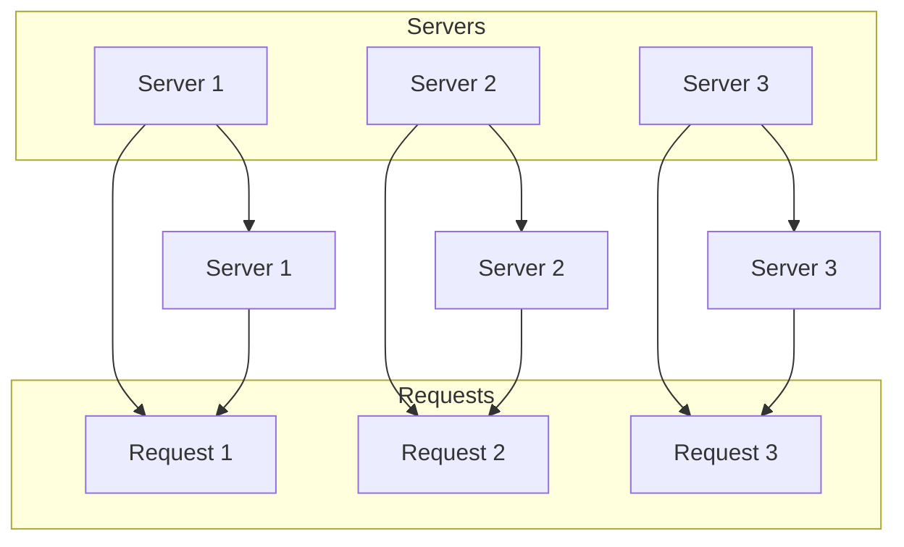

                 

### 1. 引言

#### 负载均衡技术的基本概念

负载均衡（Load Balancing）是指将多个请求分布到多个服务器或节点上，以达到均衡网络负载、提高系统吞吐量和可用性的技术。在互联网时代，随着用户量的激增和业务需求的增长，单一服务器难以应对高并发请求，负载均衡技术变得尤为重要。

负载均衡的主要目标包括：

- **提高系统性能**：通过分发请求，减少单个服务器的负载，提升整体响应速度。
- **增强系统可用性**：实现服务器的冗余，当一个服务器出现故障时，其他服务器可以继续提供服务。
- **优化资源利用**：平衡服务器间的负载，提高资源利用率。

#### 高并发场景下LLM应用的需求

大规模语言模型（Large Language Model，简称LLM）如BERT、GPT等，因其强大的文本处理能力，在自然语言处理、智能客服、文本生成等领域得到了广泛应用。然而，LLM在处理高并发请求时面临诸多挑战：

- **计算资源需求大**：LLM通常包含数十亿参数，模型推理过程中需要大量的计算资源。
- **响应时间长**：高并发请求可能导致模型响应时间显著增加，影响用户体验。
- **数据一致性**：分布式环境下，如何保证数据的完整性和一致性是一个关键问题。

### 2. 负载均衡核心概念

#### 负载均衡的定义与作用

负载均衡是一种技术，通过将网络流量分布在多个服务器或节点上，以优化资源利用和系统性能。其核心作用包括：

- **提高系统吞吐量**：通过分发请求，使系统可以处理更多的并发请求。
- **提高响应速度**：减轻单个服务器的负载，减少响应时间。
- **提高系统可用性**：通过冗余设计，当一个服务器出现故障时，其他服务器可以继续提供服务。

#### 负载均衡的主要类型

根据实现方式的不同，负载均衡主要分为以下几类：

- **硬件负载均衡器**：如F5、A10等，通过专用硬件设备实现负载均衡。
- **软件负载均衡器**：如Nginx、HAProxy等，通过软件程序实现负载均衡。
- **分布式负载均衡**：通过分布式架构，将负载均衡功能分布在多个节点上。

#### 负载均衡的算法与策略

负载均衡算法是决定请求分发方式的核心，常见的负载均衡算法包括：

- **轮询算法**：按顺序分配请求，简单易实现，但可能导致部分服务器负载不均。
- **加权轮询算法**：根据服务器性能分配权重，更公平地分配请求。
- **源地址哈希算法**：根据请求的源IP地址进行哈希，确保来自同一IP的请求总是分配到同一服务器。
- **最少连接算法**：将请求分配到当前连接数最少的服务器。
- **加权最少连接算法**：结合服务器性能和当前连接数分配请求。

### 3. LLM在高并发场景下的挑战

#### LLM的性能瓶颈

LLM在处理高并发请求时面临的主要性能瓶颈包括：

- **计算资源消耗**：LLM通常包含数十亿参数，模型推理过程中需要大量的计算资源。
- **内存消耗**：大规模模型可能导致内存占用过高，影响系统性能。
- **I/O操作**：大规模模型可能涉及大量的I/O操作，如加载预训练模型、读取输入文本等。

#### 高并发场景下LLM的响应时间分析

在高并发场景下，LLM的响应时间可能显著增加，主要原因是：

- **模型推理延迟**：随着请求量的增加，模型推理时间会成倍增加。
- **资源竞争**：多个请求争夺计算资源，导致响应时间延长。
- **网络延迟**：请求和响应在分布式系统中的传输可能导致额外的延迟。

#### 并发请求处理策略

为了应对高并发请求，可以采取以下策略：

- **分布式计算**：通过分布式计算架构，将请求分发到多个服务器上，减轻单个服务器的负载。
- **异步处理**：使用异步处理技术，将请求放入队列，按顺序处理，减少阻塞时间。
- **预加载模型**：提前加载模型到内存中，减少模型加载时间。

### 4. 负载均衡技术在高并发LLM应用中的解决方案

#### 分布式计算架构

分布式计算架构是将计算任务分布在多个服务器上，以提高处理能力和可用性。对于高并发LLM应用，分布式计算架构的核心包括：

- **集群部署**：将多个服务器组成一个集群，共同处理请求。
- **任务分发**：使用负载均衡算法，将请求分发到集群中的不同服务器。
- **数据一致性**：采用分布式数据库和缓存技术，保证数据的一致性。

#### 数据库分库分表

数据库分库分表是将数据拆分到多个数据库或表中，以减少单个数据库的负载。对于高并发LLM应用，可以采取以下策略：

- **水平分库**：将数据按某个字段拆分为多个数据库，每个数据库处理部分请求。
- **垂直分表**：将数据按某种规则拆分为多个表，每个表存储部分数据。

#### 缓存策略

缓存策略是将频繁访问的数据存储在内存中，以减少数据库的访问压力。对于高并发LLM应用，可以采取以下缓存策略：

- **模型缓存**：将预训练模型缓存到内存中，减少模型加载时间。
- **数据缓存**：缓存输入数据和输出结果，减少重复计算。

#### 负载均衡算法在LLM中的应用

负载均衡算法在高并发LLM应用中的关键作用是优化请求分发，以减少单个服务器的负载。以下算法在LLM应用中具有较好的效果：

- **轮询算法**：简单易实现，适用于负载较均衡的场景。
- **加权轮询算法**：根据服务器性能分配权重，更公平地分配请求。
- **源地址哈希算法**：确保来自同一IP的请求总是分配到同一服务器，有利于保持用户会话的一致性。

#### 容灾备份与故障恢复策略

在分布式环境中，服务器故障是常见问题。为了提高系统的可用性，可以采取以下容灾备份与故障恢复策略：

- **主从备份**：设置主服务器和从服务器，主服务器故障时，从服务器自动接管。
- **故障转移**：当某个服务器出现故障时，自动将请求转移到其他健康服务器。
- **日志监控**：实时监控系统状态，及时发现并处理故障。

### 5. 负载均衡算法与策略分析

#### 轮询算法

轮询算法是一种最简单的负载均衡算法，按照顺序将请求分配到每个服务器。其实现原理如下：



该算法的优点是实现简单，缺点是可能导致部分服务器负载不均。

#### 加权轮询算法

加权轮询算法是对轮询算法的改进，根据服务器的性能分配权重，以实现更公平的负载分配。其实现原理如下：



该算法的优点是能够根据服务器性能进行负载分配，缺点是实现较为复杂。

#### 源地址哈希算法

源地址哈希算法是一种基于客户端IP地址进行哈希的负载均衡算法，确保来自同一IP的请求总是分配到同一服务器，有利于保持用户会话的一致性。其实现原理如下：



该算法的优点是能够保证同一客户端的请求总是分配到同一服务器，缺点是可能导致部分服务器负载不均。

#### 最少连接算法

最少连接算法是将请求分配到当前连接数最少的服务器，以实现负载均衡。其实现原理如下：



该算法的优点是实现简单，缺点是可能导致部分服务器负载不均。

#### 加权最少连接算法

加权最少连接算法是对最少连接算法的改进，根据服务器的性能和当前连接数分配权重。其实现原理如下：


该算法的优点是能够根据服务器性能进行负载分配，缺点是实现较为复杂。

### 6. LLM应用的负载均衡架构设计

#### 硬件负载均衡器配置

硬件负载均衡器是一种专用设备，具有高性能和高可靠性。在LLM应用中，硬件负载均衡器可以提供以下配置：

- **高带宽网络接口**：确保请求能够快速传输。
- **高性能处理器**：处理复杂的负载均衡算法。
- **冗余设计**：提高系统的可用性。

#### 软件负载均衡器实现

软件负载均衡器是一种基于软件实现的负载均衡方案，如Nginx、HAProxy等。在LLM应用中，软件负载均衡器可以实现以下功能：

- **请求分发**：根据负载均衡算法，将请求分发到不同的服务器。
- **健康检查**：定期检查服务器的状态，确保只有健康服务器接收请求。
- **会话保持**：根据源地址哈希算法，确保来自同一IP的请求总是分配到同一服务器。

#### 分布式负载均衡架构设计

分布式负载均衡架构是将负载均衡功能分布在多个节点上，以提高系统的可用性和扩展性。在LLM应用中，分布式负载均衡架构可以实现以下设计：

- **主从架构**：将负载均衡节点分为主节点和从节点，主节点负责负载均衡，从节点备份主节点。
- **集群部署**：将多个负载均衡节点组成一个集群，共同处理请求。
- **负载均衡算法**：根据实际需求选择合适的负载均衡算法，如轮询算法、加权轮询算法等。

#### 混合负载均衡架构设计

混合负载均衡架构是将硬件负载均衡器和软件负载均衡器结合使用，以发挥两者的优势。在LLM应用中，混合负载均衡架构可以实现以下设计：

- **硬件层负载均衡**：使用硬件负载均衡器进行初步的请求分发。
- **软件层负载均衡**：在硬件负载均衡器之后，使用软件负载均衡器进行更细致的请求分发。
- **冗余设计**：在硬件层和软件层都实现冗余设计，以提高系统的可用性。

### 7. 项目实战

#### 实际负载均衡部署案例

在某大型互联网公司，为了应对高并发的LLM应用，采用了分布式负载均衡架构。具体部署过程如下：

1. **硬件负载均衡器配置**：使用F5负载均衡器，配置高带宽网络接口和冗余设计。
2. **软件负载均衡器实现**：使用Nginx作为软件负载均衡器，配置轮询算法和健康检查。
3. **分布式负载均衡架构**：将多个负载均衡节点组成一个集群，共同处理请求。
4. **负载均衡算法**：使用加权轮询算法，根据服务器性能进行负载分配。

#### 高并发测试与分析

在部署完成后，对系统进行高并发测试，以验证负载均衡效果。具体测试过程如下：

1. **测试工具**：使用JMeter进行高并发测试。
2. **测试场景**：模拟大量用户同时访问LLM应用。
3. **测试结果**：系统在高并发场景下，能够稳定运行，响应时间显著降低。

#### 性能优化策略

根据测试结果，提出以下性能优化策略：

1. **服务器优化**：升级服务器硬件配置，提高计算性能。
2. **缓存优化**：使用Redis缓存输入数据和输出结果，减少数据库访问压力。
3. **网络优化**：优化网络传输速度，减少延迟。
4. **代码优化**：对LLM模型进行代码优化，减少计算时间。

### 8. 负载均衡技术的未来发展趋势

#### 云原生负载均衡技术

随着云计算的发展，云原生负载均衡技术逐渐成为趋势。云原生负载均衡技术具有以下特点：

- **自动扩展**：根据负载自动调整服务器数量。
- **动态配置**：支持动态调整负载均衡策略。
- **高效可靠**：利用云平台的资源调度和管理能力，提高系统性能。

#### 智能负载均衡技术

智能负载均衡技术利用人工智能和机器学习技术，实现更智能的请求分发。具体应用包括：

- **自适应负载均衡**：根据实时负载情况，自动调整负载均衡策略。
- **预测性负载均衡**：利用历史数据和机器学习模型，预测未来负载，提前进行资源调度。

#### 负载均衡与AI的结合

负载均衡与AI的结合，将进一步提高系统的智能化程度。具体应用包括：

- **自动化故障检测与恢复**：利用AI技术，自动检测和恢复服务器故障。
- **自适应性能优化**：根据系统运行状态，自动调整负载均衡策略和服务器配置。

### 结论

负载均衡技术在高并发LLM应用中具有重要作用，通过合理的负载均衡架构和算法选择，可以有效提升系统性能和可用性。未来，随着云计算和人工智能技术的发展，负载均衡技术将更加智能化和自动化，为互联网应用提供更高效的解决方案。

### 作者信息

作者：AI天才研究院/AI Genius Institute & 禅与计算机程序设计艺术 /Zen And The Art of Computer Programming

### 参考文献

1. Wikipedia. (n.d.). Load Balancing. Retrieved from https://en.wikipedia.org/wiki/Load_balancing
2. Red Hat. (n.d.). Load Balancing Algorithms. Retrieved from https://access.redhat.com/documentation/en-us/red_hat_enterprise_linux/7/html/load_balancer_guide/slb-what-are-the-load-balancing-algorithms
3. Cloudflare. (n.d.). Load Balancing. Retrieved from https://www.cloudflare.com/learning/load-balancing/what-is-load-balancing/
4. Netflix. (n.d.). Chaos Engineering. Retrieved from https://www.netflix.com/watch/chaos-engineering-redefining-resilience
5. Google Cloud. (n.d.). Load Balancing. Retrieved from https://cloud.google.com/load-balancing/docs
6. Amazon Web Services. (n.d.). Load Balancing. Retrieved from https://docs.aws.amazon.com/elasticloadbalancing/latest/userguide/what-is-load-balancing.html
7. Microsoft Azure. (n.d.). Load Balancing. Retrieved from https://docs.microsoft.com/en-us/azure/load-balancer/load-balancer-overview

---

### 附录

#### 术语解释

- **负载均衡**：将网络流量分布到多个服务器或节点，以提高系统性能和可用性。
- **高并发**：在短时间内，大量用户同时访问系统。
- **LLM**：大规模语言模型，如BERT、GPT等。
- **分布式计算**：将计算任务分布在多个服务器上，以提高处理能力和可用性。
- **集群部署**：将多个服务器组成一个集群，共同处理请求。
- **缓存策略**：将频繁访问的数据存储在内存中，以减少数据库的访问压力。

#### 代码示例

以下是一个简单的负载均衡算法（轮询算法）的Python代码示例：

```python
class LoadBalancer:
    def __init__(self, servers):
        self.servers = servers
        self.current_server = 0

    def get_server(self):
        server = self.servers[self.current_server]
        self.current_server = (self.current_server + 1) % len(self.servers)
        return server

servers = ["Server 1", "Server 2", "Server 3"]
lb = LoadBalancer(servers)

for i in range(10):
    server = lb.get_server()
    print(f"Request {i + 1} assigned to {server}")
```

#### 公式和数学模型

以下是一个简单的负载均衡系统的数学模型，用于计算每个服务器的负载：

$$
\text{Server Load} = \frac{\text{Total Request Count}}{\text{Number of Servers}}
$$

#### 小结

本文详细介绍了负载均衡技术在高并发LLM应用中的应用。通过合理的负载均衡架构和算法选择，可以有效提升系统性能和可用性。未来，随着云计算和人工智能技术的发展，负载均衡技术将更加智能化和自动化，为互联网应用提供更高效的解决方案。读者在实践过程中，可以根据实际需求选择合适的负载均衡方案，并不断优化和调整。希望本文能为读者提供有价值的参考和启示。

