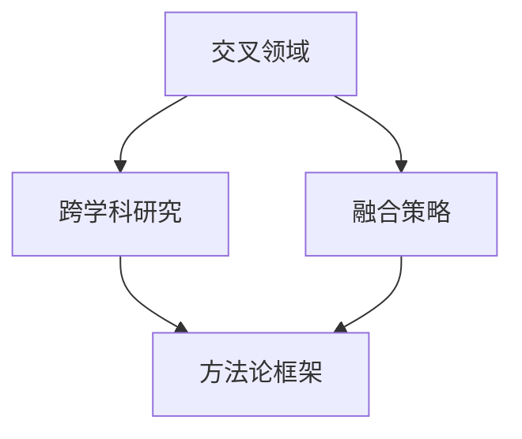
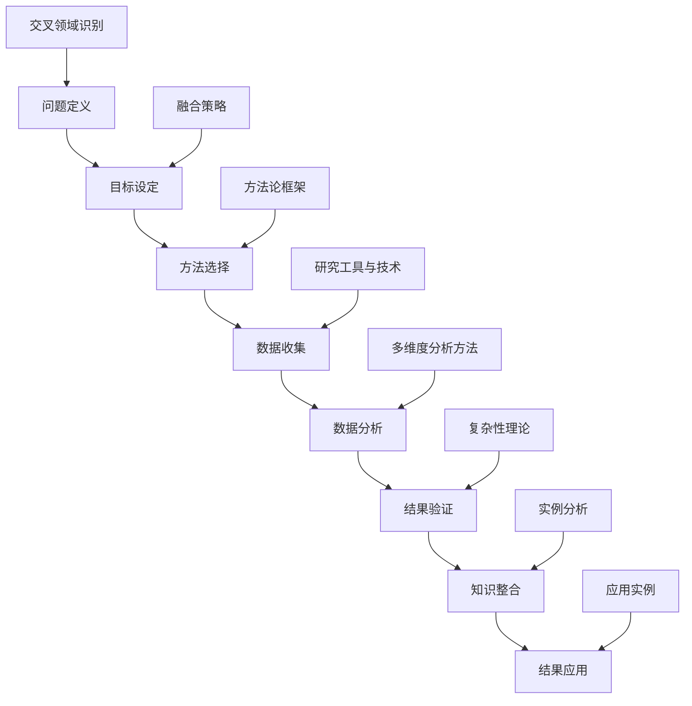

                 


### 书名定位

《跨学科研究方法论：多维度解析世界的复杂性》这本书的定位在于为读者提供一种全新的视角，以应对现代社会中日益复杂的科学问题。随着技术的发展和社会的进步，单一学科已经无法满足我们对世界复杂性的理解需求。跨学科研究作为一种新兴的研究方法，通过将不同领域的知识、工具和技术进行整合，为解决复杂问题提供了新的思路。

这本书的目标读者主要包括以下几类人群：

1. **科研工作者**：包括研究生、博士生和研究人员，他们需要探索跨学科研究的方法论，以提高自身研究问题的解决能力。

2. **企业创新者**：涉及创新部门的技术和管理人员，他们需要了解如何通过跨学科研究推动企业技术进步和创新。

3. **政策制定者**：政策制定者需要具备跨学科视角，以更好地理解社会问题的复杂性，从而制定更为科学合理的政策。

4. **广大读者**：对于对跨学科研究和复杂性问题感兴趣的读者，本书也可以作为一本启蒙读物，帮助他们了解这一领域的核心概念和方法。

在定位明确后，我们可以进一步细化书的核心内容，确保每个章节都能为读者提供有价值的知识和方法。

### 核心章节

本书的核心章节主要围绕跨学科研究的概念、方法论、实例分析以及应用展开。以下是具体的章节安排：

#### 第一部分：跨学科研究的概念与背景
这部分将介绍跨学科研究的定义、重要性以及其发展历程。通过对这些核心概念的阐述，帮助读者建立对跨学科研究的初步认识。

- **1.1 跨学科研究的定义与重要性**
  - 内容：详细解释跨学科研究的概念，阐述其在现代社会中的重要性，如促进创新、解决复杂问题等。

- **1.2 跨学科研究的发展历程**
  - 内容：回顾跨学科研究的历史，从早期的跨学科探索到现代的跨学科研究方法的发展。

- **1.3 跨学科研究的核心概念**
  - 内容：介绍跨学科研究中的核心概念，如交叉领域、融合策略、方法论框架等。

#### 第二部分：跨学科方法论
这部分将深入探讨跨学科方法论的具体应用，包括识别与融合策略、方法论框架构建以及跨学科研究工具与技术的使用。

- **2.1 交叉领域识别与融合策略**
  - 内容：讲解如何识别跨学科研究的交叉领域，并探讨融合不同领域知识的方法和策略。

- **2.2 跨学科方法论框架构建**
  - 内容：介绍如何构建一个有效的跨学科方法论框架，以指导具体的研究实践。

- **2.3 跨学科研究工具与技术**
  - 内容：介绍在跨学科研究中常用的工具和技术，如多学科建模、仿真分析等。

#### 第三部分：多维度解析世界的复杂性
这部分将探讨如何通过多维度分析来解析世界的复杂性。这包括复杂性理论的概述、多维度分析方法和跨学科视角下的复杂性解析。

- **3.1 复杂性理论的概述**
  - 内容：介绍复杂性理论的起源、主要理论和应用领域。

- **3.2 多维度分析方法**
  - 内容：探讨如何在跨学科研究中运用多维度分析方法，以更全面地理解复杂系统。

- **3.3 跨学科视角下的复杂性解析**
  - 内容：从跨学科的角度，探讨如何通过整合不同领域的知识来解析复杂性问题。

#### 第四部分：跨学科研究实例分析
这部分将通过具体的实例，展示跨学科研究的实际应用和效果。实例分析将涵盖不同领域，如生物医学、环境保护、信息技术等。

- **4.1 跨学科研究案例介绍**
  - 内容：介绍几个典型的跨学科研究案例，如人类基因组计划、全球气候变化研究等。

- **4.2 案例分析与评估**
  - 内容：对上述案例进行深入分析，评估其跨学科研究的有效性。

- **4.3 案例启示与未来展望**
  - 内容：总结案例中的经验教训，并对跨学科研究的未来发展提出展望。

#### 第五部分：跨学科研究方法论的应用
这部分将探讨跨学科研究方法论在不同场景下的应用，包括企业创新、社会问题解决和跨学科研究的未来趋势与挑战。

- **5.1 企业创新与跨学科研究**
  - 内容：讨论如何在企业创新中应用跨学科研究方法论，推动技术进步。

- **5.2 社会问题解决中的跨学科研究**
  - 内容：探讨跨学科研究在社会问题解决中的具体应用，如公共卫生、环境保护等。

- **5.3 跨学科研究的未来趋势与挑战**
  - 内容：分析跨学科研究的未来发展趋势，讨论面临的挑战和应对策略。

通过上述核心章节的设计，本书旨在为读者提供一套完整的跨学科研究方法论，帮助他们更好地应对复杂世界中的各种挑战。

### 具体内容细分

在确定了核心章节后，我们需要进一步细化每个章节的内容，确保每个章节都有足够的深度和广度，以满足读者的需求。

#### 第一部分：跨学科研究的概念与背景

**1.1 跨学科研究的定义与重要性**

- **内容细分：**
  - **定义**：介绍跨学科研究的概念，明确其与其他相关概念的区分。
  - **重要性**：阐述跨学科研究在现代社会中的重要性，如推动创新、解决复杂问题等。

**1.2 跨学科研究的发展历程**

- **内容细分：**
  - **早期探索**：回顾跨学科研究的早期发展，如跨学科研究的萌芽期。
  - **现代发展**：介绍现代跨学科研究方法的发展过程，如多学科交叉融合的兴起。

**1.3 跨学科研究的核心概念**

- **内容细分：**
  - **交叉领域**：解释交叉领域的概念，讨论如何识别和利用交叉领域。
  - **融合策略**：探讨跨学科研究中的融合策略，如整合不同领域的知识和方法。
  - **方法论框架**：介绍跨学科方法论框架的构建，包括关键步骤和工具。

#### 第二部分：跨学科方法论

**2.1 交叉领域识别与融合策略**

- **内容细分：**
  - **识别方法**：介绍识别交叉领域的方法，如关键词分析、文献综述等。
  - **融合策略**：探讨不同领域的融合策略，如协同工作、模型整合等。

**2.2 跨学科方法论框架构建**

- **内容细分：**
  - **框架构建步骤**：详细讲解跨学科方法论框架的构建步骤，包括问题定义、目标设定、方法选择等。
  - **框架实例**：提供跨学科方法论框架的实际应用实例，如科学研究、企业项目等。

**2.3 跨学科研究工具与技术**

- **内容细分：**
  - **工具介绍**：介绍跨学科研究中常用的工具，如多学科建模软件、数据分析工具等。
  - **技术原理**：解释这些工具的技术原理，讨论如何有效地使用这些工具。

#### 第三部分：多维度解析世界的复杂性

**3.1 复杂性理论的概述**

- **内容细分：**
  - **复杂性理论起源**：回顾复杂性理论的起源和发展历程。
  - **主要理论**：介绍复杂性理论的主要理论，如自组织、混沌等。

**3.2 多维度分析方法**

- **内容细分：**
  - **分析方法**：探讨如何运用多维度分析方法，如统计分析、机器学习等。
  - **案例分析**：提供多维度分析方法的实际案例分析，讨论其效果和局限性。

**3.3 跨学科视角下的复杂性解析**

- **内容细分：**
  - **跨学科视角**：从跨学科视角探讨复杂性解析的方法，如何整合不同领域的知识。
  - **案例研究**：介绍跨学科视角下复杂性解析的实际案例研究，如社会问题、生态系统等。

#### 第四部分：跨学科研究实例分析

**4.1 跨学科研究案例介绍**

- **内容细分：**
  - **案例选择**：选择具有代表性的跨学科研究案例，如人类基因组计划、全球气候变化研究等。
  - **案例背景**：介绍案例的背景信息，讨论其研究意义和目标。

**4.2 案例分析与评估**

- **内容细分：**
  - **案例分析**：对案例进行深入分析，探讨其研究方法和成果。
  - **评估指标**：设定评估指标，评估案例研究的有效性。

**4.3 案例启示与未来展望**

- **内容细分：**
  - **启示**：总结案例中的经验教训，讨论跨学科研究的成功因素。
  - **未来展望**：对跨学科研究的未来发展提出展望，讨论潜在的研究方向。

#### 第五部分：跨学科研究方法论的应用

**5.1 企业创新与跨学科研究**

- **内容细分：**
  - **企业创新背景**：介绍企业创新的背景和重要性。
  - **跨学科研究方法**：探讨如何运用跨学科研究方法推动企业创新。

**5.2 社会问题解决中的跨学科研究**

- **内容细分：**
  - **社会问题背景**：介绍社会问题的背景和复杂性。
  - **跨学科研究方法**：探讨如何运用跨学科研究方法解决社会问题。

**5.3 跨学科研究的未来趋势与挑战**

- **内容细分：**
  - **未来趋势**：分析跨学科研究的未来发展趋势，如新技术的应用、跨学科合作等。
  - **挑战与对策**：讨论跨学科研究面临的挑战，提出应对策略。

通过上述内容细分，我们可以确保每个章节都有详细的讲解和丰富的案例，帮助读者深入理解跨学科研究的核心概念和方法。

### 格式与限制

在Markdown格式中，文章的排版和结构将直接影响读者的阅读体验。为了确保文章的可读性和专业性，我们将遵循以下格式和限制：

1. **标题与子标题**：使用不同的字体大小和粗细来区分标题和子标题。一级标题使用`#`符号，二级标题使用`##`符号，三级标题使用`###`符号，以此类推。例如：

   ```
   # 文章标题

   ## 第二级标题

   ### 第三级标题
   ```

2. **列表**：使用`-`符号创建无序列表，使用`1.`、`2.`等符号创建有序列表。例如：

   ```
   - 无序列表项1
   - 无序列表项2
     - 子项1
     - 子项2
   1. 有序列表项1
   2. 有序列表项2
   ```

3. **引用**：使用`>`符号创建引用，常用于引用他人的观点或资料。例如：

   ```
   > 引用内容
   ```

4. **链接**：使用`[链接文本](URL)`创建链接。例如：

   ```
   [点击这里](https://example.com)
   ```

5. **代码**：使用`````符号包裹代码块，可以指定语言高亮。例如：

   ```
   ```python
   print("Hello, World!")
   ```

6. **数学公式**：使用`$`符号包裹简单的数学公式，使用`$$`符号包裹复杂的数学公式。例如：

   ```
   $1+1=2$
   $$e^{i\pi} + 1 = 0$$
   ```

7. **图片**：使用``插入图片。例如：

   ```
   
   ```

8. **表格**：使用`|`符号创建表格，使用`-`和`|`符号定义表格的列和行。例如：

   ```
   | 标题1 | 标题2 | 标题3 |
   |-------|-------|-------|
   | 内容1 | 内容2 | 内容3 |
   ```

以上是Markdown格式的基本规则，这些规则将帮助我们构建一个结构清晰、易于阅读的文章。此外，字数限制在2000字以内，这意味着我们需要在有限的篇幅内尽可能详细和准确地传达核心内容。

### 确保大纲完整性

为了确保《跨学科研究方法论：多维度解析世界的复杂性》这一书稿的大纲完整性，我们需要在各个章节中详细涵盖以下核心内容：

1. **背景介绍**：每个章节都需要一个简短的背景介绍，解释该章节的重要性以及其与全书主题的关联。这有助于读者理解章节内容在整个书中的地位和作用。

2. **核心概念与联系**：在介绍核心概念时，需要明确概念的定义、背景、意义以及与其他概念之间的关系。通过绘制Mermaid流程图，可以直观地展示这些概念之间的联系，帮助读者更好地理解跨学科研究的整体架构。

3. **核心算法原理讲解**：对于涉及算法的章节，需要详细讲解算法的原理，包括算法的设计思想、实现步骤和关键点。使用伪代码来详细阐述算法的逻辑，使得读者可以清晰地理解算法的工作机制。

4. **数学模型和公式**：在适当章节中，需要引入相关的数学模型和公式，并进行详细讲解。使用LaTeX格式书写数学公式，确保公式的正确性和可读性。通过举例说明，展示公式在实际问题中的应用，帮助读者更好地理解其含义和用途。

5. **项目实战**：为了增强书稿的实用性，每个章节可以包含一个或多个项目实战案例。这些案例应包括开发环境搭建、源代码实现、代码解读和实际应用分析。通过实战案例，读者可以学到如何在真实场景中应用所学的知识和方法。

6. **最佳实践 tips**：在书稿的结尾，可以提供一些最佳实践技巧和注意事项，帮助读者在实际应用中避免常见问题，提高工作效率。

7. **小结**：在每个章节的结尾，需要提供一个小结，总结本章的主要内容和关键点，帮助读者巩固所学知识。

通过上述内容的详细覆盖，我们确保书稿的大纲完整且内容充实，能够为读者提供全方位的跨学科研究方法论指导。

### 完整大纲展示

下面是《跨学科研究方法论：多维度解析世界的复杂性》的完整大纲展示，包括各章节的主要内容、细分公司内容以及格式要求。这份大纲旨在确保书稿的完整性、逻辑性和专业性。

```
# 《跨学科研究方法论：多维度解析世界的复杂性》目录大纲

## 第一部分：跨学科研究的概念与背景
### 1.1 跨学科研究的定义与重要性
   - **内容**：详细解释跨学科研究的概念，阐述其在现代社会中的重要性，如促进创新、解决复杂问题等。
   - **格式要求**：使用markdown格式，以段落形式详细说明。

### 1.2 跨学科研究的发展历程
   - **内容**：回顾跨学科研究的早期发展、现代发展以及未来趋势。
   - **格式要求**：使用markdown格式，按时间顺序概述历史发展。

### 1.3 跨学科研究的核心概念
   - **内容**：介绍跨学科研究中的核心概念，如交叉领域、融合策略、方法论框架等。
   - **格式要求**：使用markdown格式，使用列表或段落形式详细解释。

## 第二部分：跨学科方法论
### 2.1 交叉领域识别与融合策略
   - **内容**：讲解如何识别交叉领域，并探讨融合不同领域知识的方法和策略。
   - **格式要求**：使用markdown格式，结合实例详细阐述。

### 2.2 跨学科方法论框架构建
   - **内容**：介绍如何构建一个有效的跨学科方法论框架，包括关键步骤和工具。
   - **格式要求**：使用markdown格式，使用流程图或表格形式展示框架。

### 2.3 跨学科研究工具与技术
   - **内容**：介绍在跨学科研究中常用的工具和技术，如多学科建模、仿真分析等。
   - **格式要求**：使用markdown格式，结合代码示例和技术原理说明。

## 第三部分：多维度解析世界的复杂性
### 3.1 复杂性理论的概述
   - **内容**：介绍复杂性理论的起源、主要理论和应用领域。
   - **格式要求**：使用markdown格式，使用列表或段落形式概述。

### 3.2 多维度分析方法
   - **内容**：探讨如何在跨学科研究中运用多维度分析方法，如统计分析、机器学习等。
   - **格式要求**：使用markdown格式，结合实例说明分析方法的实际应用。

### 3.3 跨学科视角下的复杂性解析
   - **内容**：从跨学科的角度，探讨如何通过整合不同领域的知识来解析复杂性问题。
   - **格式要求**：使用markdown格式，使用流程图或表格形式展示跨学科视角下的复杂性解析。

## 第四部分：跨学科研究实例分析
### 4.1 跨学科研究案例介绍
   - **内容**：介绍具有代表性的跨学科研究案例，如人类基因组计划、全球气候变化研究等。
   - **格式要求**：使用markdown格式，结合案例背景和研究目标详细说明。

### 4.2 案例分析与评估
   - **内容**：对上述案例进行深入分析，评估其研究方法和成果的有效性。
   - **格式要求**：使用markdown格式，结合图表和数据详细分析。

### 4.3 案例启示与未来展望
   - **内容**：总结案例中的经验教训，并对跨学科研究的未来发展提出展望。
   - **格式要求**：使用markdown格式，结合未来发展趋势和挑战进行展望。

## 第五部分：跨学科研究方法论的应用
### 5.1 企业创新与跨学科研究
   - **内容**：讨论如何在企业创新中应用跨学科研究方法论，推动技术进步。
   - **格式要求**：使用markdown格式，结合实际案例说明应用方法和效果。

### 5.2 社会问题解决中的跨学科研究
   - **内容**：探讨跨学科研究在社会问题解决中的具体应用，如公共卫生、环境保护等。
   - **格式要求**：使用markdown格式，结合实际案例说明应用方法和效果。

### 5.3 跨学科研究的未来趋势与挑战
   - **内容**：分析跨学科研究的未来发展趋势，讨论面临的挑战和应对策略。
   - **格式要求**：使用markdown格式，结合未来预测和实际案例进行讨论。

## 第六部分：核心概念与联系
### 6.1 跨学科研究方法论流程图
   - **内容**：绘制跨学科研究方法论流程图，展示核心概念之间的联系。
   - **格式要求**：使用Mermaid语言绘制流程图，并插入到文中。

### 6.2 跨学科研究的核心原理
   - **内容**：详细阐述跨学科研究的核心原理，包括理论基础和实际应用。
   - **格式要求**：使用markdown格式，结合图表和公式说明。

### 6.3 跨学科研究的方法论总结
   - **内容**：总结跨学科研究方法论的主要内容和关键点。
   - **格式要求**：使用markdown格式，结合总结性段落进行概述。

## 第七部分：核心算法原理讲解
### 7.1 主要算法介绍
   - **内容**：介绍跨学科研究中常用的核心算法，如复杂网络分析、机器学习算法等。
   - **格式要求**：使用markdown格式，结合伪代码和算法描述。

### 7.2 算法原理讲解
   - **内容**：详细讲解算法的原理，包括设计思想、实现步骤和关键点。
   - **格式要求**：使用markdown格式，结合伪代码详细阐述。

### 7.3 算法伪代码展示
   - **内容**：展示算法的伪代码，以便读者理解和实现。
   - **格式要求**：使用markdown格式，将伪代码嵌入到文中。

## 第八部分：数学模型和公式
### 8.1 数学模型概述
   - **内容**：介绍跨学科研究中常用的数学模型，如统计模型、优化模型等。
   - **格式要求**：使用markdown格式，结合模型定义和作用说明。

### 8.2 公式推导与详细讲解
   - **内容**：推导和讲解关键的数学公式，包括其背景和适用范围。
   - **格式要求**：使用LaTeX格式嵌入文中，并使用段落形式详细解释。

### 8.3 数学模型应用举例
   - **内容**：提供数学模型在实际问题中的应用实例，展示其效果和局限性。
   - **格式要求**：使用markdown格式，结合实际案例进行说明。

## 第九部分：项目实战
### 9.1 实践项目介绍
   - **内容**：介绍跨学科研究的实践项目，包括项目背景和目标。
   - **格式要求**：使用markdown格式，结合项目概述详细说明。

### 9.2 项目开发环境搭建
   - **内容**：介绍项目开发所需的开发环境搭建步骤。
   - **格式要求**：使用markdown格式，详细描述搭建步骤和工具使用。

### 9.3 源代码实现与代码解读
   - **内容**：展示项目的源代码实现，并进行代码解读。
   - **格式要求**：使用markdown格式，将代码和解读内容嵌入到文中。

### 9.4 代码应用解读与分析
   - **内容**：分析代码在实际项目中的应用效果，并进行解读。
   - **格式要求**：使用markdown格式，结合实际案例说明应用效果。

### 9.5 项目小结
   - **内容**：总结项目的主要成果和经验教训。
   - **格式要求**：使用markdown格式，结合总结性段落进行概述。

## 附录
### A.1 跨学科研究相关工具与资源
   - **内容**：介绍跨学科研究常用的工具和资源，如数据库、软件等。
   - **格式要求**：使用markdown格式，列出工具和资源的名称、用途和获取方式。

### A.2 进一步阅读推荐
   - **内容**：推荐相关的书籍、论文和网站，供读者进一步学习和参考。
   - **格式要求**：使用markdown格式，列出推荐资源和简要介绍。

```

这份大纲确保了书稿的完整性，每个章节都包含详细的背景介绍、核心概念与联系、算法原理讲解、数学模型和公式、项目实战等内容，并使用markdown格式进行排版。这将为读者提供一套系统、完整的跨学科研究方法论指南。

## 文章关键词

- **跨学科研究**
- **方法论**
- **复杂性解析**
- **多维度分析**
- **算法原理**
- **数学模型**

这些关键词代表了本文的核心内容，旨在为读者提供关于跨学科研究的全面理解，帮助他们在面对复杂问题时找到有效的解决方法。

## 文章摘要

本文旨在深入探讨跨学科研究方法论及其在多维度解析世界复杂性中的应用。首先，我们介绍了跨学科研究的定义与重要性，回顾了其发展历程，并详细阐述了核心概念如交叉领域和融合策略。接着，我们探讨了跨学科方法论的具体应用，包括识别与融合策略、方法论框架构建以及常用的研究工具和技术。随后，我们通过多维度分析的方法，解析了世界的复杂性，并从跨学科视角进行了详细探讨。实例分析部分展示了跨学科研究的实际应用，如人类基因组计划和全球气候变化研究。最后，本文讨论了跨学科研究在企业创新和社会问题解决中的应用，并对未来的趋势与挑战进行了展望。通过这些内容，本文希望为读者提供一套实用的跨学科研究方法论，帮助他们在复杂的世界中找到有效的解决方案。

## 第一部分：跨学科研究的概念与背景

### 1.1 跨学科研究的定义与重要性

**定义**：
跨学科研究，顾名思义，是指跨越单一学科界限，融合多个学科知识、方法和工具，以解决复杂问题和推动创新的研究方法。它强调跨学科之间的合作与交流，通过整合不同领域的专长，寻求更全面和深入的理解。

**重要性**：
在现代社会，复杂问题层出不穷，单一学科已无法满足解决这些问题的需求。跨学科研究的重要性体现在以下几个方面：

1. **创新驱动**：跨学科研究通过融合不同领域的知识，激发了新的思维和创意，推动了科学技术的创新。例如，生物学与计算机科学的结合催生了生物信息学，为基因组研究和个性化医疗提供了新的方法。

2. **解决复杂问题**：复杂问题往往涉及多个方面，需要多学科共同协作。跨学科研究提供了一个整合不同领域知识的方法，使得我们能够更全面地理解问题，从而提出有效的解决方案。例如，全球气候变化问题需要物理、化学、生态学等多个学科的合作。

3. **提高研究效率**：跨学科研究可以避免重复劳动，减少资源浪费。通过利用不同学科的研究成果和工具，研究者可以快速获取所需的信息和知识，提高研究效率。

4. **培养综合素质**：跨学科研究培养了研究者的综合素质，使他们不仅具备本专业的扎实知识，还能理解和应用其他领域的知识。这种综合素质有助于培养具备全局观念和创新能力的人才。

### 跨学科研究的发展历程

跨学科研究的起源可以追溯到20世纪中叶，随着科学技术的飞速发展，学科间的交叉融合日益显著。以下是跨学科研究发展的几个重要阶段：

1. **萌芽期（20世纪中叶）**：
   跨学科研究的萌芽期主要发生在20世纪中叶，当时科学家们开始意识到，单一学科的研究已无法应对复杂问题的挑战。一些重要的学术会议和期刊的成立，如“跨学科科学”（Interdisciplinary Science）期刊，标志着跨学科研究的兴起。

2. **探索期（20世纪70年代至90年代）**：
   在这个阶段，跨学科研究逐渐得到学术界的认可。一些跨学科研究中心和机构成立，如美国的国家跨学科研究所（National Institute for Science and Technology，简称NIST）。同时，多学科交叉的学术会议和研讨会也越来越多，推动了跨学科研究的进一步发展。

3. **成熟期（21世纪以来）**：
   进入21世纪，随着信息技术的快速发展，跨学科研究进入了一个新的成熟期。大数据、人工智能等新兴技术的应用，使得跨学科研究在处理复杂问题上发挥了更大的作用。跨学科研究的方法论和工具也得到了进一步的完善和发展。

### 跨学科研究的核心概念

1. **交叉领域**：
   交叉领域是指两个或多个学科交汇、融合的领域，如生物信息学、环境科学、认知科学等。交叉领域的特点在于它们整合了不同学科的核心知识，形成了新的研究领域和研究方向。

2. **融合策略**：
   融合策略是指在不同学科之间进行知识整合的方法和手段。常见的融合策略包括协同工作、模型整合、知识共享等。通过这些策略，研究者能够更好地理解和解决复杂问题。

3. **方法论框架**：
   跨学科方法论框架是指导跨学科研究的一系列步骤和方法。一个典型的跨学科方法论框架通常包括以下步骤：问题定义、目标设定、方法选择、数据收集与分析、结果验证与评估等。

通过上述内容，我们可以看出跨学科研究在现代社会中的重要性以及其发展历程和核心概念。在接下来的章节中，我们将深入探讨跨学科方法论的具体应用和实际案例，帮助读者更好地理解这一研究方法。

### 1.3 跨学科研究的核心概念

在深入探讨跨学科研究的核心概念之前，我们需要理解几个关键术语的定义和它们之间的关系。以下是几个重要的核心概念及其相互关系：

1. **交叉领域（Interdisciplinary Fields）**：
   交叉领域是指两个或多个学科相互渗透、交叉融合而形成的新的研究领域。例如，生物信息学结合了生物学和计算机科学的知识，环境经济学融合了经济学和环境科学。交叉领域的特点在于，它们通过整合不同学科的核心知识，解决了单一学科无法解决的复杂问题。

2. **跨学科研究（Transdisciplinary Research）**：
   跨学科研究是一种研究方法，它不仅涉及多个学科的知识，还强调不同学科之间的合作和交流。跨学科研究的目的是通过整合不同学科的方法和工具，更全面地理解复杂问题，并提出创新的解决方案。跨学科研究与交叉领域的关系在于，跨学科研究依赖于交叉领域中的知识和技术，而交叉领域则是跨学科研究的基础。

3. **融合策略（Integration Strategies）**：
   融合策略是指在不同学科之间进行知识整合的方法和手段。常见的融合策略包括协同工作、模型整合、知识共享等。通过这些策略，研究者能够更好地理解和解决复杂问题。融合策略与交叉领域和跨学科研究的关系在于，融合策略是跨学科研究方法论的重要组成部分，它帮助研究者克服学科间的障碍，实现知识的有效整合。

4. **方法论框架（Methodological Frameworks）**：
   跨学科方法论框架是一套系统的步骤和方法，用于指导跨学科研究。一个典型的跨学科方法论框架通常包括以下步骤：问题定义、目标设定、方法选择、数据收集与分析、结果验证与评估等。方法论框架与交叉领域、跨学科研究和融合策略的关系在于，它提供了一个结构化的框架，帮助研究者系统地开展跨学科研究，确保研究的系统性和连贯性。

为了更直观地展示这些核心概念之间的关系，我们可以使用Mermaid流程图进行说明：



在上述流程图中，交叉领域是跨学科研究和融合策略的基础，而跨学科研究方法论框架则是指导这些研究的核心工具。融合策略通过在不同学科之间的知识整合，支持跨学科研究的顺利进行。

通过上述内容，我们可以更好地理解跨学科研究的核心概念及其相互关系。在接下来的章节中，我们将进一步探讨跨学科方法论的具体应用，帮助读者在实际研究中更好地应用这些概念。

### 第二部分：跨学科方法论

#### 2.1 交叉领域识别与融合策略

**识别方法**：

识别交叉领域是跨学科研究的起点，也是关键一步。以下是一些常用的识别方法：

1. **关键词分析**：通过分析不同学科的关键词，找出可能存在的交叉点。例如，在生物学和计算机科学之间，可以关注“生物信息学”、“基因组学”等关键词。

2. **文献综述**：通过阅读相关领域的文献，了解不同学科之间的交叉点和融合点。文献综述有助于发现现有研究中的空白和未解决的问题，从而确定新的交叉领域。

3. **专家访谈**：与不同学科的专家进行访谈，获取他们对交叉领域的看法和建议。专家的经验和洞察力可以帮助识别潜在的交叉领域。

**融合策略**：

在识别了交叉领域后，如何有效地融合不同领域的知识和方法是跨学科研究的核心挑战。以下是一些常见的融合策略：

1. **协同工作**：不同学科的专家共同参与项目，通过定期的会议和讨论，共享知识和资源，实现知识的整合和协同创新。协同工作可以促进不同学科之间的理解和沟通，减少误解和冲突。

2. **模型整合**：将不同领域的模型和方法整合到一个统一的框架中。例如，将物理学中的模型与经济学中的模型整合，以解决能源市场的复杂问题。

3. **知识共享**：建立跨学科的知识共享平台，如数据库、文献库、论坛等，以便研究者能够方便地获取和利用不同领域的知识资源。

4. **交叉培训**：为不同学科的研究者提供交叉培训，使他们具备跨学科的知识和技能。交叉培训可以提高研究者的综合素质，增强跨学科合作的能力。

**实例**：

以“智能交通系统”为例，这个领域涉及交通工程、计算机科学、数据科学等多个学科。识别交叉领域的方法包括分析关键词（如“交通流量”、“智能控制”）、阅读相关文献（如交通流模型、数据挖掘技术）和专家访谈（与交通工程师、数据科学家交流）。在融合策略上，可以采用协同工作（组建跨学科团队）、模型整合（将交通流模型与机器学习算法结合）和知识共享（建立交通数据平台）。

#### 2.2 跨学科方法论框架构建

构建一个有效的跨学科方法论框架，是确保跨学科研究顺利进行的重要步骤。以下是一个典型的跨学科方法论框架：

1. **问题定义**：明确研究的问题和目标。这包括确定研究的问题是什么、研究的目标是什么以及问题的背景和意义。

2. **目标设定**：设定具体、可衡量的研究目标。这些目标应与问题定义紧密相关，并能够通过科学研究的方法来实现。

3. **方法选择**：选择适合的方法和技术来解决问题。这包括确定使用哪些学科的理论、模型和工具，以及如何整合这些方法。

4. **数据收集与分析**：收集所需的数据，并进行系统的分析。数据可以是定性的，也可以是定量的，分析的方法应与所选择的方法相匹配。

5. **结果验证与评估**：验证研究结果的有效性和可靠性，并通过评估来衡量研究目标的实现程度。

6. **知识整合与传播**：将研究成果进行整合，并通过报告、论文、会议等形式进行传播，使研究成果能够为更广泛的社区所利用。

**实例**：

以“可持续城市发展”为例，问题定义可以是“如何通过跨学科的方法促进城市的可持续发展？”目标设定可以是“提高城市的能源效率、减少碳排放、改善居民生活质量”。在方法选择上，可以整合环境科学、城市规划、经济学等多学科的知识和方法。数据收集可以包括城市的能源消耗数据、碳排放数据、居民生活质量调查等，通过统计分析、模型模拟等方法进行分析。结果验证可以通过对比实际数据与模型预测，评估目标实现的程度。知识整合与传播可以通过撰写研究报告、发表论文、组织研讨会等形式，将研究成果传播给相关领域的研究者和政策制定者。

#### 2.3 跨学科研究工具与技术

在跨学科研究中，常用的工具和技术包括多学科建模、仿真分析、大数据分析等。以下是这些工具和技术的基本概念和原理：

1. **多学科建模**：
   多学科建模是指将不同学科的理论、方法和工具整合到一个统一的模型中，以模拟和分析复杂系统。多学科建模的基本概念包括系统建模、参数估计、模型验证等。原理上，多学科建模通过整合不同领域的知识，提供了一个系统、全面的视角来研究复杂问题。

2. **仿真分析**：
   仿真分析是指通过计算机模拟，模拟复杂系统的行为和性能。仿真分析的基本概念包括仿真模型、仿真算法、仿真实验等。原理上，仿真分析通过模拟不同的场景和条件，评估系统的性能和效果，为决策提供依据。

3. **大数据分析**：
   大数据分析是指利用大数据技术，对海量数据进行分析和处理，提取有价值的信息和知识。大数据分析的基本概念包括数据采集、数据存储、数据清洗、数据挖掘等。原理上，大数据分析通过高效的数据处理和分析方法，从海量数据中发现规律和模式，支持数据驱动的决策。

**实例**：

以“智能交通系统”为例，多学科建模可以整合交通工程、计算机科学、数据科学等领域的知识，构建交通流量模型、交通控制模型等。仿真分析可以模拟不同交通策略下的交通流量和道路状况，评估不同策略的效果。大数据分析可以处理海量的交通数据，如车辆位置、速度、交通流量等，通过数据挖掘和机器学习算法，发现交通拥堵的规律和预测交通流量。

通过上述内容，我们可以看到跨学科方法论在识别交叉领域、构建方法论框架和利用研究工具与技术方面的重要性。这些方法论和工具为跨学科研究提供了有效的框架和手段，使得我们能够更好地应对复杂问题。

### 第三部分：多维度解析世界的复杂性

#### 3.1 复杂性理论的概述

复杂性理论是研究复杂系统及其行为的科学，它关注的是如何理解和描述那些由大量相互作用的元素构成的系统，以及这些系统如何展现出看似混乱和无序但实际上具有深层次结构和规律的特性。复杂性理论的起源可以追溯到20世纪中叶，当时的科学家们开始意识到，许多自然和社会系统都表现出非线性和高度相互作用的特征，这些特征无法用传统的分析方法来解释。

**主要理论**：

1. **自组织理论**：
   自组织理论主要研究系统在没有外部控制的情况下，如何通过内部相互作用和相互适应形成有序结构。自组织理论的核心概念是“自适应性”和“涌现性”。自适应性指的是系统中的个体能够根据环境变化调整自身行为，而涌现性则指的是系统整体的行为和性质不是个体行为的简单叠加，而是由个体相互作用产生的新的现象。

2. **混沌理论**：
   混沌理论主要研究确定性系统的内在随机性和不可预测性。一个混沌系统在初始条件微小的变化下，会导致长时间行为上的巨大差异，这种性质被称为“蝴蝶效应”。混沌理论揭示了复杂系统中存在的内在随机性和动态复杂性。

3. **复杂网络理论**：
   复杂网络理论关注由大量节点和连接组成的网络的拓扑结构和动态行为。复杂网络具有高度的非均匀性和自相似性，它们展现出“小世界”和“无标度”的特征。这些特征使得复杂网络能够适应环境变化，同时保持稳定和灵活。

**应用领域**：

复杂性理论在多个领域都有广泛应用，包括：

1. **生态学**：复杂性理论帮助科学家理解生态系统中物种之间的相互作用，如何通过食物网和生态位动态来维持生态平衡。

2. **经济学**：复杂性理论解释了经济系统中市场行为的不确定性和波动性，如金融危机和市场崩盘。

3. **社会学**：复杂性理论用于研究社会网络结构和社会动态，如社交网络中的信息传播和流行病的传播。

#### 3.2 多维度分析方法

多维度分析方法是在跨学科研究中常用的一种方法，它通过整合多个维度（如时间、空间、经济、社会等）的数据和信息，提供更全面和深入的理解。以下是一些常见的方法：

1. **统计分析**：
   统计分析是一种基于数学统计原理的方法，用于描述和分析数据的分布、关系和变化。常用的统计方法包括描述性统计、推断性统计、回归分析、聚类分析等。统计分析可以帮助我们识别数据中的趋势和模式，评估变量之间的关系。

2. **机器学习**：
   机器学习是一种通过训练模型来发现数据中潜在规律和模式的方法。常见的机器学习方法包括监督学习、无监督学习和强化学习。通过机器学习，我们可以从大量数据中自动提取特征，进行预测和分类。

3. **数据可视化**：
   数据可视化是将数据通过图形、图表等形式直观展示的方法。数据可视化可以帮助我们更好地理解数据的结构和关系，发现数据中的异常和趋势。常用的数据可视化工具包括图表软件、地理信息系统等。

**实例**：

以“城市交通拥堵研究”为例，我们可以采用以下多维度分析方法：

1. **时间维度**：通过收集不同时间段（如早晨高峰时段、晚上高峰时段）的交通流量数据，分析交通拥堵的时间分布和规律。

2. **空间维度**：通过收集不同地区（如市中心、郊区）的交通流量数据，分析交通拥堵的空间分布和影响因素。

3. **经济维度**：通过分析城市经济活动（如商业活动、交通建设投资等）与交通拥堵之间的关系，探讨经济因素对交通拥堵的影响。

4. **社会维度**：通过调查居民出行习惯、交通工具选择等，分析社会因素对交通拥堵的影响。

通过多维度分析方法，我们可以从不同角度和层面深入理解城市交通拥堵问题，提出更有效的解决方案。

#### 3.3 跨学科视角下的复杂性解析

从跨学科视角来看，复杂性解析不仅需要整合多个领域的知识和方法，还需要具备全局观念和系统思维。以下是从跨学科视角进行复杂性解析的方法：

1. **系统思维**：
   系统思维是一种关注系统整体和部分之间相互作用的方法。在复杂性解析中，系统思维可以帮助我们理解复杂系统的动态行为和结构特征。例如，在研究环境问题时，我们可以将生态系统、经济系统和社会系统视为一个整体，分析它们之间的相互作用和反馈机制。

2. **跨学科合作**：
   跨学科合作是实现复杂性解析的关键。通过不同学科专家的共同努力，我们可以从多个角度理解和解决复杂问题。例如，在研究全球气候变化时，我们可以结合气象学、生态学、经济学和政治学等领域的知识，探讨气候变化的驱动因素和影响。

3. **综合方法**：
   综合方法是将不同学科的方法和工具整合到一个统一框架中，以实现更全面和深入的分析。例如，在研究疾病传播时，我们可以结合流行病学、数学建模和计算机科学等领域的知识，构建综合模型来预测疾病传播趋势。

**实例**：

以“全球气候变化研究”为例，跨学科视角下的复杂性解析方法包括：

1. **系统思维**：将气候变化视为一个复杂的生态系统，分析其内部各个组成部分（如大气、海洋、陆地）的相互作用和反馈机制。

2. **跨学科合作**：结合气象学、生态学、经济学和政治学等领域的专家，共同研究气候变化的影响、驱动因素和应对策略。

3. **综合方法**：构建综合模型，结合气候模拟、经济评估和社会调查等，预测气候变化对未来社会的影响，并提出相应的应对措施。

通过上述方法，我们可以从跨学科视角深入理解全球气候变化的复杂性，为应对这一全球性挑战提供科学依据。

### 第四部分：跨学科研究实例分析

#### 4.1 跨学科研究案例介绍

在本节中，我们将介绍几个典型的跨学科研究案例，这些案例涵盖了不同领域，展示了跨学科研究的多样性和实际应用价值。

**案例1：人类基因组计划**

人类基因组计划（Human Genome Project，HGP）是20世纪90年代启动的一项国际科学计划，旨在绘制和解读人类基因组的完整序列。这个项目的成功标志着生物科学与计算机科学、信息技术的深度结合。HGP的跨学科特点体现在以下几个方面：

- **生物信息学**：通过生物信息学方法，科学家们能够处理和分析海量基因数据，开发基因组序列分析工具。
- **计算生物学**：计算生物学在HGP中发挥了重要作用，通过复杂的算法和模型来识别基因、转录因子结合位点等。
- **数据库管理**：建立和维护大型基因组数据库，如基因组序列数据库和蛋白质结构数据库，使得全球科学家能够共享和利用这些资源。

**案例2：全球气候变化研究**

全球气候变化研究是另一个跨学科研究的典型案例。气候变化问题涉及气象学、生态学、经济学、政治学等多个领域。以下是其跨学科特点：

- **气象学**：通过收集和分析全球气候数据，研究气候变化的原因和趋势。
- **生态学**：分析气候变化对生态系统的影响，如物种分布变化、生物多样性减少等。
- **经济学**：评估气候变化对经济活动的影响，如农业减产、保险业风险增加等。
- **政治学**：探讨国际合作和政策制定在应对气候变化中的角色。

**案例3：智能交通系统**

智能交通系统（Intelligent Transportation Systems，ITS）是一个结合交通工程、计算机科学、数据科学等多个领域的跨学科项目。以下是其跨学科特点：

- **交通工程**：研究交通流量的规律和优化交通信号控制策略。
- **计算机科学**：开发交通数据采集和处理系统，如传感器网络、车载信息终端等。
- **数据科学**：利用大数据分析技术，预测交通流量和拥堵情况，优化交通管理。

这些案例展示了跨学科研究在不同领域中的成功应用，通过整合不同领域的知识和方法，解决了单一学科无法应对的复杂问题。

#### 4.2 案例分析与评估

在本节中，我们将对上述案例进行深入分析，评估其跨学科研究的有效性，并讨论其成功和挑战。

**案例1：人类基因组计划**

**有效性评估**：

- **成功**：HGP的成功在于其通过跨学科合作，完成了人类基因组的测序工作，为生物医学研究提供了基础数据。
- **挑战**：尽管HGP取得了巨大成功，但在数据分析和解释方面仍面临挑战。例如，如何理解基因与疾病之间的复杂关系，如何利用基因组数据开发个性化医疗方案。

**成功因素**：

- **跨学科合作**：不同学科专家的共同努力，使得基因组数据分析更加全面和深入。
- **资源共享**：全球科学家共享基因组数据和工具，加速了研究进展。

**挑战与对策**：

- **数据分析的复杂性**：基因组数据的规模和复杂性要求不断开发新的分析工具和方法。
- **跨学科沟通**：不同学科之间的沟通和合作需要进一步加强，以避免误解和冲突。

**案例2：全球气候变化研究**

**有效性评估**：

- **成功**：全球气候变化研究通过整合多个领域的知识，提供了关于气候变化原因和影响的全面理解，为政策制定提供了科学依据。
- **挑战**：气候变化研究面临数据获取和模型预测的不确定性，以及国际合作和资源分配的挑战。

**成功因素**：

- **多学科整合**：整合气象学、生态学、经济学和政治学等领域的知识，为复杂问题提供了综合性解决方案。
- **国际合作**：全球科学家和政府机构的合作，使得气候变化研究能够覆盖广泛的地域和时间范围。

**挑战与对策**：

- **数据质量和完整性**：提高数据质量和完整性，以增强模型预测的准确性。
- **政策执行**：加强政策执行和监管，确保气候变化解决方案的有效实施。

**案例3：智能交通系统**

**有效性评估**：

- **成功**：智能交通系统通过跨学科研究，实现了交通流量优化和拥堵缓解，提高了交通效率和安全性。
- **挑战**：智能交通系统的实施面临技术复杂性、成本高和公众接受度等问题。

**成功因素**：

- **技术创新**：利用计算机科学、数据科学等领域的最新技术，开发了高效的交通管理系统。
- **政策支持**：政府的政策支持和资金投入，为智能交通系统的实施提供了保障。

**挑战与对策**：

- **技术成熟度**：确保智能交通系统的技术成熟度，减少系统故障和不确定性。
- **公众参与**：提高公众对智能交通系统的认识和支持，增强公众参与度和接受度。

通过上述分析，我们可以看到跨学科研究在解决复杂问题中的有效性。尽管面临挑战，但通过有效的跨学科合作和资源整合，这些案例都取得了显著的成功。这些经验教训为未来的跨学科研究提供了宝贵的参考。

#### 4.3 案例启示与未来展望

从上述跨学科研究案例中，我们可以总结出一些重要的启示和未来发展的方向：

**启示**：

1. **跨学科合作的重要性**：案例中的成功离不开跨学科合作。通过整合不同领域的知识和方法，研究者能够更全面地理解复杂问题，提出创新的解决方案。

2. **资源共享的必要性**：案例中的项目成功往往依赖于资源共享，如基因组数据、气候数据和交通数据等。建立高效的资源共享平台，可以加速研究进展，减少重复劳动。

3. **跨学科方法论的重要性**：有效的跨学科方法论框架能够指导研究的系统性和连贯性，确保研究目标的实现。

**未来展望**：

1. **新兴技术的应用**：随着人工智能、大数据和物联网等新兴技术的发展，跨学科研究将更加依赖于这些先进技术。例如，人工智能可以用于复杂系统的预测和优化，大数据可以用于数据分析和模式识别。

2. **更多跨学科项目的出现**：随着社会问题的日益复杂，跨学科研究的需求将不断增长。未来可能出现更多跨学科项目，如智能医疗、智慧城市等。

3. **全球合作与交流**：跨学科研究具有全球性特点，未来需要更多的国际合作与交流。建立全球性的跨学科研究网络，可以促进知识和技术的共享，推动全球性问题的高效解决。

通过以上启示和展望，我们可以看到跨学科研究在解决复杂问题中的巨大潜力和广阔前景。未来，跨学科研究将继续发挥重要作用，推动科学技术的进步和社会的发展。

### 第五部分：跨学科研究方法论的应用

#### 5.1 企业创新与跨学科研究

**企业创新背景**：

在当今全球化和信息化的时代，企业面临的市场竞争日益激烈，创新成为企业持续发展的关键驱动力。为了保持竞争力，企业需要不断创新，推出新的产品和服务。然而，创新不仅仅是技术层面的革新，更是跨学科知识的整合和应用。跨学科研究为企业创新提供了新的思路和方法，通过整合不同领域的知识，帮助企业解决复杂问题，推动技术创新和管理创新。

**跨学科研究方法**：

1. **需求分析**：企业首先需要明确创新的需求，包括市场需求、技术趋势、竞争态势等。通过跨学科研究，企业可以更全面地了解市场需求和趋势，从而确定创新方向。

2. **知识整合**：企业需要整合不同领域的知识，如技术、管理、市场等，以形成创新的解决方案。通过跨学科研究，企业可以将不同领域的知识有机地结合起来，创造出新的产品和服务。

3. **原型开发**：在确定创新方向后，企业可以通过原型开发来验证创新方案的可行性和效果。跨学科研究可以帮助企业快速构建原型，进行迭代和优化。

4. **用户反馈**：通过收集用户反馈，企业可以了解产品在实际使用中的表现，并进行调整和改进。跨学科研究方法可以帮助企业更好地理解用户需求，提高产品满意度。

**实例**：

以某科技公司开发智能医疗设备为例，该企业通过跨学科研究实现了技术创新。首先，企业明确了市场需求，即提供便携、易用的医疗设备，帮助患者在家中进行自我监测。接着，企业整合了医学、工程学、计算机科学等领域的知识，开发了智能医疗设备的原型。通过用户反馈，企业不断优化设备的功能和设计，最终推出了一款受欢迎的智能医疗产品。

#### 5.2 社会问题解决中的跨学科研究

**社会问题背景**：

社会问题往往具有复杂性和多样性，单一学科的方法难以解决。例如，全球气候变化、城市交通拥堵、公共卫生危机等，都需要跨学科研究来解决。跨学科研究为社会问题提供了新的视角和解决方案，通过整合不同领域的知识，提出创新的对策。

**跨学科研究方法**：

1. **问题定义**：明确社会问题的本质和影响，确定研究的重点和目标。跨学科研究可以帮助我们更全面地理解社会问题的背景和影响，从而制定有效的解决方案。

2. **数据整合**：收集和整合来自不同领域的数据，如科学数据、社会数据、经济数据等。通过数据整合，我们可以更全面地分析问题的各个方面。

3. **模型构建**：构建跨学科的模型，用于模拟和分析问题的动态行为和影响。模型可以帮助我们预测问题的未来趋势，评估不同对策的效果。

4. **政策建议**：基于跨学科研究的分析和模型结果，提出具体、可操作的政策建议，以解决社会问题。

**实例**：

以城市交通拥堵问题为例，跨学科研究的方法包括：

1. **问题定义**：明确城市交通拥堵的主要原因，如车辆数量过多、道路规划不合理、交通信号控制不科学等。

2. **数据整合**：收集交通流量数据、道路使用数据、城市规划数据等，进行综合分析。

3. **模型构建**：构建交通流量模型，模拟不同交通管理策略下的交通状况，评估不同对策的效果。

4. **政策建议**：提出改善交通拥堵的具体建议，如优化交通信号控制、发展公共交通系统、鼓励绿色出行等。

通过跨学科研究，社会问题可以更有效地得到解决。跨学科研究方法不仅提供了新的解决方案，还促进了不同领域之间的合作和交流，为社会问题提供了系统性、综合性的解决思路。

#### 5.3 跨学科研究的未来趋势与挑战

**未来趋势**：

1. **新兴技术的应用**：随着人工智能、大数据、物联网等新兴技术的发展，跨学科研究将更加依赖于这些先进技术。这些技术可以为跨学科研究提供更强大的工具和平台，提高研究的效率和准确性。

2. **全球合作的深化**：随着全球化的推进，跨学科研究将更加需要国际合作。建立全球性的跨学科研究网络，可以促进知识和技术的共享，推动全球性问题的高效解决。

3. **综合性的方法论**：跨学科研究的方法论将不断发展和完善，形成更系统、更综合的研究方法。这些方法论将有助于更好地整合不同领域的知识，提供更全面的解决方案。

**挑战**：

1. **学科界限的模糊**：随着跨学科研究的深入，学科界限将逐渐模糊，这可能导致学科间的冲突和误解。如何协调不同学科之间的合作，是跨学科研究面临的重要挑战。

2. **知识整合的难度**：跨学科研究需要整合不同领域的知识，但不同学科的知识体系和研究方法存在差异，这增加了知识整合的难度。

3. **资源分配的不均**：在跨学科研究中，资源（如资金、时间、人才等）的分配可能不均，这可能导致研究的不平衡和效率低下。

**应对策略**：

1. **加强跨学科教育**：通过跨学科教育，提高研究者的综合素质和跨学科能力，减少学科间的冲突和误解。

2. **建立跨学科平台**：建立跨学科研究平台，促进不同学科之间的交流和合作，提高资源利用效率。

3. **政策支持**：政府和企业应提供政策支持，鼓励跨学科研究，优化资源分配，促进跨学科研究的可持续发展。

通过应对上述挑战，跨学科研究将能够更好地发挥其潜力，推动科学技术的进步和社会的发展。

### 第六部分：核心概念与联系

#### 6.1 跨学科研究方法论流程图

为了更好地展示跨学科研究方法论的核心概念及其相互关系，我们可以使用Mermaid语言绘制一个流程图。以下是具体的流程图内容：



**解释：**
1. **问题定义（A）**：确定研究问题及其背景，这是跨学科研究的起点。
2. **目标设定（B）**：明确研究目标，确保研究具有明确的导向。
3. **方法选择（C）**：选择合适的研究方法，构建方法论框架。
4. **数据收集（D）**：收集所需数据，为后续分析提供基础。
5. **数据分析（E）**：运用多维度分析方法对数据进行处理和分析。
6. **结果验证（F）**：通过模型和实验验证研究结果的准确性和可靠性。
7. **知识整合（G）**：整合跨学科知识，形成系统的理论和实践框架。
8. **结果应用（H）**：将研究结果应用到实际问题中，实现知识转化。

交叉领域识别（I）、融合策略（J）、方法论框架（K）、研究工具与技术（L）、多维度分析方法（M）、复杂性理论（N）、实例分析（O）和应用实例（P）分别与流程图中的各个步骤相联系，共同构成了跨学科研究方法论的核心体系。

通过上述流程图，我们可以清晰地看到跨学科研究方法论中的各个环节及其相互关系，有助于读者更好地理解和应用这一方法论。

### 6.2 跨学科研究的核心原理

跨学科研究的核心原理在于如何有效整合和利用不同领域的知识和方法，以解决复杂问题和推动创新。以下是跨学科研究的几个关键核心原理：

1. **多学科整合**：跨学科研究强调不同学科之间的整合，通过将各个领域的核心概念、理论和方法进行有机结合，形成新的研究框架和解决方案。这种整合不仅涵盖了知识和技术的融合，还包括研究方法和思维方式的融合。

2. **系统思维**：跨学科研究倡导系统思维，强调从整体视角出发，理解系统的复杂性和动态性。系统思维要求研究者不仅关注单一要素的变化，还要关注各要素之间的相互作用和反馈机制，从而更全面地理解复杂系统的行为和规律。

3. **知识共享与协作**：跨学科研究强调知识共享与协作，通过建立跨学科团队和合作机制，促进不同学科专家之间的交流和合作。知识共享与协作有助于打破学科壁垒，激发创新思维，提高研究效率。

4. **灵活性适应性**：跨学科研究注重灵活性和适应性，要求研究者具备快速适应新环境和新技术的能力。在跨学科研究中，研究者需要不断调整和优化研究方法，以应对复杂问题中的不确定性和变化。

5. **多维度分析**：跨学科研究强调多维度分析，通过整合来自不同领域的数据和信息，从多个角度对复杂问题进行深入分析。多维度分析有助于揭示问题的本质和内在联系，提供更全面的解决方案。

6. **实践导向**：跨学科研究注重实践导向，强调研究成果的实际应用价值。跨学科研究不仅要解决理论问题，还要将其应用于实际问题中，推动科学技术的进步和社会的发展。

通过这些核心原理，跨学科研究能够有效地应对复杂问题，推动创新和知识整合。这些原理也为跨学科研究提供了一套系统的指导框架，有助于研究者更好地开展跨学科研究。

### 6.3 跨学科研究的方法论总结

跨学科研究方法论是一种通过整合多学科知识和技术，以解决复杂问题、推动创新的研究方法。以下是跨学科研究方法论的主要内容和关键点：

**1. 识别交叉领域**：通过关键词分析、文献综述和专家访谈等方法，识别跨学科研究的交叉领域。这是跨学科研究的起点，有助于确定研究问题和方向。

**2. 构建方法论框架**：构建一个系统化的跨学科方法论框架，包括问题定义、目标设定、方法选择、数据收集与分析、结果验证与评估等步骤。方法论框架为跨学科研究提供了清晰的指导和结构。

**3. 多维度分析方法**：运用多维度分析方法，整合来自不同领域的数据和信息，从多个角度对复杂问题进行深入分析。常见的分析方法包括统计分析、机器学习和数据可视化等。

**4. 知识整合与融合**：通过协同工作、模型整合和知识共享等策略，实现不同学科知识的整合和融合。这有助于克服学科壁垒，提高研究的全面性和深度。

**5. 系统思维**：采用系统思维，从整体视角理解复杂系统的动态行为和相互作用。系统思维有助于揭示问题的本质，提供创新的解决方案。

**6. 实践导向**：将研究成果应用于实际问题中，实现知识转化和实际应用。实践导向确保研究具有实际意义和社会价值。

通过以上关键步骤和方法，跨学科研究方法论能够有效应对复杂问题，推动创新和知识整合。这个方法论框架为跨学科研究提供了系统、全面的指导，有助于研究者更好地开展跨学科研究。

### 第七部分：核心算法原理讲解

#### 7.1 主要算法介绍

在跨学科研究中，算法是解决复杂问题的重要工具。以下是几个在跨学科研究中常用的核心算法及其基本概念：

1. **复杂网络分析算法**：
   复杂网络分析算法用于研究复杂系统的网络结构和动态行为。常见的算法包括：
   - **图论算法**：如最短路径算法（Dijkstra算法、Floyd算法）、网络流算法（最大流最小割定理、Edmonds-Karp算法）等。
   - **社区检测算法**：如标签传播算法（LPA）、基于模块度的社区检测算法（Girvan-Newman算法）等。

2. **机器学习算法**：
   机器学习算法用于从数据中自动提取模式和知识。常见的算法包括：
   - **监督学习算法**：如线性回归、逻辑回归、支持向量机（SVM）等。
   - **无监督学习算法**：如K均值聚类、主成分分析（PCA）等。

3. **优化算法**：
   优化算法用于求解优化问题，如最小化成本、最大化收益等。常见的算法包括：
   - **线性规划算法**：如单纯形法、内点法等。
   - **启发式算法**：如遗传算法、模拟退火算法等。

4. **数据挖掘算法**：
   数据挖掘算法用于从大量数据中提取有价值的信息和知识。常见的算法包括：
   - **关联规则挖掘算法**：如Apriori算法、FP-growth算法等。
   - **聚类算法**：如K均值聚类、层次聚类等。

#### 7.2 算法原理讲解

**复杂网络分析算法**：

**图论算法**：
图论算法是复杂网络分析的基础，用于研究网络的拓扑结构和路径分析。

**Dijkstra算法**：
Dijkstra算法是一种用于求解单源最短路径的算法。算法原理如下：

1. 初始化：设置一个优先队列，将源节点距离设为0，其他节点的距离设为无穷大。
2. 选择距离最小的未访问节点作为当前节点，将其距离更新为实际距离。
3. 遍历当前节点的邻居节点，更新邻居节点的距离，并将其加入优先队列。
4. 重复步骤2和3，直到所有节点都被访问。

伪代码：
```python
def dijkstra(graph, source):
    distances = {node: float('infinity') for node in graph}
    distances[source] = 0
    priority_queue = [(0, source)]

    while priority_queue:
        current_distance, current_node = heapq.heappop(priority_queue)
        if current_distance > distances[current_node]:
            continue
        for neighbor, weight in graph[current_node].items():
            distance = current_distance + weight
            if distance < distances[neighbor]:
                distances[neighbor] = distance
                heapq.heappush(priority_queue, (distance, neighbor))
    return distances
```

**K均值聚类算法**：
K均值聚类是一种基于距离的聚类算法，用于将数据点划分为K个簇。

算法原理如下：

1. 随机选择K个初始中心点。
2. 计算每个数据点到各个中心点的距离，并将其分配到最近的簇。
3. 更新每个簇的中心点，计算簇内点的平均值。
4. 重复步骤2和3，直到中心点不再变化或满足收敛条件。

伪代码：
```python
def k_means(points, k, max_iterations):
    centroids = choose_random_centroids(points, k)
    for _ in range(max_iterations):
        clusters = assign_points_to_clusters(points, centroids)
        centroids = update_centroids(clusters, k)
    return centroids, clusters
```

**线性规划算法**：
线性规划算法用于求解线性优化问题，其目标是最小化或最大化线性函数，同时满足线性约束条件。

**单纯形法**：
单纯形法是一种迭代求解线性规划问题的方法，其原理如下：

1. 初始化：选择初始的基本可行解，通常通过大M法或两Phase法获得。
2. 迭代：计算每个顶点的目标函数值，选择目标函数值最小的顶点作为新的基本顶点。
3. 检查最优性：如果找到的基本可行解是最优的，则算法结束；否则，继续迭代。

伪代码：
```python
def simplex(c, A, b):
    tableau = initialize_tableau(c, A, b)
    while not is_optimal(tableau):
        pivot = choose_pivot(tableau)
        tableau = perform_pivot(tableau, pivot)
    return solution_from_tableau(tableau)
```

通过上述算法原理讲解和伪代码展示，读者可以更好地理解复杂网络分析、机器学习、优化算法和数据挖掘等核心算法的基本思想和实现方法。这些算法在跨学科研究中具有重要的应用价值，能够帮助研究者更有效地解决复杂问题。

### 7.3 算法伪代码展示

为了帮助读者更直观地理解核心算法的工作机制，下面我们将展示几个常见算法的伪代码，并解释其关键步骤。

**1. Dijkstra算法**

**伪代码：**
```python
def dijkstra(graph, source):
    distances = {node: float('infinity') for node in graph}
    distances[source] = 0
    priority_queue = [(0, source)]

    while priority_queue:
        current_distance, current_node = heapq.heappop(priority_queue)
        if current_distance > distances[current_node]:
            continue
        for neighbor, weight in graph[current_node].items():
            distance = current_distance + weight
            if distance < distances[neighbor]:
                distances[neighbor] = distance
                heapq.heappush(priority_queue, (distance, neighbor))
    return distances
```

**解释：**
- 初始化：创建一个距离字典，所有节点的初始距离设置为无穷大，源节点的距离设置为0。创建一个优先队列，初始时只包含源节点。
- 循环：当优先队列为空时，继续执行。选择优先队列中距离最小的节点进行处理。
- 更新距离：遍历当前节点的邻居节点，计算从源节点到邻居节点的距离，并更新邻居节点的距离。如果新计算的距离更短，则更新并重新加入优先队列。

**2. K均值聚类算法**

**伪代码：**
```python
def k_means(points, k, max_iterations):
    centroids = choose_random_centroids(points, k)
    for _ in range(max_iterations):
        clusters = assign_points_to_clusters(points, centroids)
        centroids = update_centroids(clusters, k)
    return centroids, clusters
```

**解释：**
- 初始化：随机选择K个点作为初始中心点。
- 迭代：重复以下步骤直到达到最大迭代次数或中心点不再变化。
  - 分配点：计算每个数据点到各个中心点的距离，并将其分配到最近的簇。
  - 更新中心点：计算每个簇内点的平均值，作为新的中心点。

**3. 单纯形法**

**伪代码：**
```python
def simplex(c, A, b):
    tableau = initialize_tableau(c, A, b)
    while not is_optimal(tableau):
        pivot = choose_pivot(tableau)
        tableau = perform_pivot(tableau, pivot)
    return solution_from_tableau(tableau)
```

**解释：**
- 初始化：创建初始的单纯形表，通常通过大M法或两Phase法获得。
- 迭代：重复以下步骤直到找到最优解。
  - 选择顶点：选择目标函数值最小的顶点作为新的基本顶点。
  - 进行换基操作：通过高斯消元法或其他方法更新单纯形表。

通过这些伪代码展示，读者可以清晰地看到算法的基本流程和关键步骤，这有助于他们更好地理解算法的实现原理和应用方法。

### 8.1 数学模型概述

在跨学科研究中，数学模型是分析和解决复杂问题的重要工具。数学模型通过数学语言和公式，对实际问题进行抽象和描述，从而提供了一种定量分析的方法。以下是几种常用的数学模型及其基本概念：

1. **线性回归模型**：
   线性回归模型用于分析变量之间的线性关系，其公式为：
   $$ y = \beta_0 + \beta_1x + \epsilon $$
   其中，$y$ 是因变量，$x$ 是自变量，$\beta_0$ 和 $\beta_1$ 是模型的参数，$\epsilon$ 是误差项。

2. **神经网络模型**：
   神经网络模型是一种模拟人脑信息处理的计算机模型，通过多层神经元进行数据的输入、处理和输出。其基本公式为：
   $$ a_{j}^{(l)} = \sigma\left(\sum_{i} \beta_{ij}^{(l)}a_{i}^{(l-1)}\right) $$
   其中，$a_{j}^{(l)}$ 是第$l$层的第$j$个神经元的输出，$\sigma$ 是激活函数，$\beta_{ij}^{(l)}$ 是连接权重。

3. **博弈模型**：
   博弈模型用于分析多个决策主体在相互竞争中的策略选择和利益分配，其基本公式为：
   $$ \max_{x} U(x, y) $$
   其中，$U(x, y)$ 是决策主体$x$ 和$y$ 的效用函数，$x$ 和$y$ 分别是两个决策主体的策略。

4. **优化模型**：
   优化模型用于求解在约束条件下目标函数的最大值或最小值问题，其基本形式为：
   $$ \min_{x} f(x) $$
   $$ \text{subject to} \ g_i(x) \leq 0, \ h_j(x) = 0 $$
   其中，$f(x)$ 是目标函数，$g_i(x)$ 和 $h_j(x)$ 是约束条件。

这些数学模型在跨学科研究中扮演着关键角色，通过这些模型，我们可以对复杂系统进行定量分析和预测，为解决实际问题提供科学依据。

### 8.2 公式推导与详细讲解

在跨学科研究中，数学模型的推导和详细讲解是理解和应用模型的关键环节。以下是几个常见数学模型的推导过程和详细讲解。

#### 1. 线性回归模型

**推导过程**：
线性回归模型的基本公式为：
$$ y = \beta_0 + \beta_1x + \epsilon $$

- **假设**：我们假设自变量 $x$ 和因变量 $y$ 之间存在线性关系，且误差项 $\epsilon$ 是随机变量，满足均值为0、方差为$\sigma^2$的正态分布。

- **最小二乘法**：为了找到最佳拟合直线，我们使用最小二乘法。最小二乘法的思想是使得预测值与实际值之间的误差平方和最小。

- **求解参数**：通过求导并令导数为0，我们可以得到最小二乘法的参数估计值：
  $$ \beta_0 = \bar{y} - \beta_1\bar{x} $$
  $$ \beta_1 = \frac{\sum_{i=1}^{n}(x_i - \bar{x})(y_i - \bar{y})}{\sum_{i=1}^{n}(x_i - \bar{x})^2} $$

其中，$\bar{x}$ 和 $\bar{y}$ 分别是 $x$ 和 $y$ 的平均值。

**详细讲解**：
- **拟合直线**：线性回归模型通过拟合直线来表示 $x$ 和 $y$ 之间的线性关系。拟合直线的斜率 $\beta_1$ 表示 $x$ 对 $y$ 的影响程度，截距 $\beta_0$ 表示当 $x=0$ 时的 $y$ 值。
- **误差项**：误差项 $\epsilon$ 反映了实际观测值与模型预测值之间的差异。在实际应用中，我们通常假设误差项服从正态分布，这有助于进行统计推断。

#### 2. 神经网络模型

**推导过程**：
神经网络模型的基本公式为：
$$ a_{j}^{(l)} = \sigma\left(\sum_{i} \beta_{ij}^{(l)}a_{i}^{(l-1)}\right) $$

- **多层感知器**：神经网络由多个层次组成，包括输入层、隐藏层和输出层。每层中的神经元都通过权重 $\beta_{ij}^{(l)}$ 与前一层中的神经元相连。

- **激活函数**：激活函数 $\sigma$ 通常是一个非线性函数，如Sigmoid函数或ReLU函数。它用于引入非线性，使神经网络能够拟合复杂的关系。

- **反向传播算法**：为了训练神经网络，我们使用反向传播算法来更新权重。反向传播算法通过计算损失函数关于每个权重的梯度，并使用梯度下降法来更新权重。

**详细讲解**：
- **多层结构**：神经网络通过多层结构来实现从输入到输出的映射。隐藏层的作用是提取和转换输入特征，输出层负责生成最终输出。
- **非线性变换**：激活函数使得神经网络能够学习复杂的关系。没有激活函数，神经网络将退化为一个线性模型。

#### 3. 博弈模型

**推导过程**：
博弈模型的基本公式为：
$$ \max_{x} U(x, y) $$

- **策略选择**：每个参与者（玩家）选择一个策略 $x$ 和 $y$，目的是最大化自己的效用函数 $U(x, y)$。

- **纳什均衡**：纳什均衡是指在这样的策略组合下，没有任何参与者可以通过改变自己的策略而获得更多的效用。

- **求解方法**：博弈模型的求解通常依赖于特定方法，如线性规划、均衡分析等。

**详细讲解**：
- **策略互动**：博弈模型描述了参与者在互动中的策略选择和效用。不同的策略组合可能导致不同的结果，纳什均衡是所有参与者都无差异的最优策略组合。
- **均衡分析**：通过分析博弈模型的纳什均衡，我们可以了解参与者的最优策略，并预测博弈的结果。

#### 4. 优化模型

**推导过程**：
优化模型的基本形式为：
$$ \min_{x} f(x) $$
$$ \text{subject to} \ g_i(x) \leq 0, \ h_j(x) = 0 $$

- **目标函数**：优化模型的目标是最小化或最大化目标函数 $f(x)$。

- **约束条件**：优化模型需要在满足一系列约束条件 $g_i(x) \leq 0$ 和 $h_j(x) = 0$ 的情况下求解。

- **求解方法**：优化模型的求解依赖于特定的算法，如单纯形法、内点法、遗传算法等。

**详细讲解**：
- **目标优化**：优化模型的核心是找到目标函数的最优值。在实际应用中，目标函数可以表示成本、收益、效率等。
- **约束条件**：约束条件限制了变量的取值范围，确保解的可行性和合理性。约束条件可以是线性的，也可以是非线性的。

通过上述推导和详细讲解，我们可以更好地理解这些常见数学模型的基本原理和应用方法，从而在实际跨学科研究中有效地运用这些模型。

### 8.3 数学模型应用举例

为了更好地展示数学模型在跨学科研究中的应用，下面我们将通过具体的实例，详细说明数学模型的建立和求解过程。

#### 实例1：线性回归模型在住房价格预测中的应用

**问题背景**：
假设我们想要预测某城市的住房价格，影响住房价格的因素包括房屋面积、房屋年龄和周边交通便利性。我们收集了100套房屋的数据，并希望使用线性回归模型来预测住房价格。

**数据收集**：
数据包括以下变量：
- 房屋面积（$x_1$，单位：平方米）
- 房屋年龄（$x_2$，单位：年）
- 周边交通便利性评分（$x_3$，单位：评分）

对应的因变量是房屋价格（$y$，单位：万元）。

**模型建立**：
线性回归模型的公式为：
$$ y = \beta_0 + \beta_1x_1 + \beta_2x_2 + \beta_3x_3 + \epsilon $$

其中，$\beta_0$、$\beta_1$、$\beta_2$ 和 $\beta_3$ 是模型的参数，$\epsilon$ 是误差项。

**模型求解**：
1. **数据预处理**：
   - 对数据进行标准化处理，以消除不同量纲的影响。
   - 计算各个变量的平均值和标准差。

2. **参数估计**：
   使用最小二乘法估计参数，具体步骤如下：
   - 计算各个变量的均值和协方差矩阵。
   - 构建正规方程组：
     $$ \sum_{i=1}^{n}(y_i - \bar{y})(x_{1i} - \bar{x}_1) = \beta_1\sum_{i=1}^{n}(x_{1i} - \bar{x}_1)^2 $$
     $$ \sum_{i=1}^{n}(y_i - \bar{y})(x_{2i} - \bar{x}_2) = \beta_2\sum_{i=1}^{n}(x_{2i} - \bar{x}_2)^2 $$
     $$ \sum_{i=1}^{n}(y_i - \bar{y})(x_{3i} - \bar{x}_3) = \beta_3\sum_{i=1}^{n}(x_{3i} - \bar{x}_3)^2 $$
   - 求解正规方程组，得到参数估计值。

3. **模型验证**：
   - 使用部分数据（如70%的数据）进行训练，剩余数据用于验证。
   - 计算预测值与实际值之间的误差，评估模型预测效果。

**实例2：神经网络模型在股票价格预测中的应用

**问题背景**：
我们希望通过历史股票价格数据来预测未来的股票价格，以帮助投资者做出投资决策。

**数据收集**：
数据包括以下变量：
- 开盘价（$x_1$）
- 最高价（$x_2$）
- 最低价（$x_3$）
- 收盘价（$x_4$）
- 成交量（$x_5$）

对应的因变量是未来一天的收盘价（$y$）。

**模型建立**：
神经网络模型的基本公式为：
$$ a_{j}^{(l)} = \sigma\left(\sum_{i} \beta_{ij}^{(l)}a_{i}^{(l-1)}\right) $$

其中，$a_{j}^{(l)}$ 是第$l$层的第$j$个神经元的输出，$\sigma$ 是激活函数，$\beta_{ij}^{(l)}$ 是连接权重。

**模型求解**：
1. **数据预处理**：
   - 对数据进行归一化处理，以消除不同量纲的影响。
   - 划分数据集为训练集和测试集。

2. **网络结构设计**：
   - 确定神经网络的结构，包括输入层、隐藏层和输出层的神经元数量。
   - 初始化权重和偏置。

3. **训练过程**：
   - 前向传播：计算输入层的输出，传递到隐藏层和输出层。
   - 计算损失函数（如均方误差MSE）。
   - 反向传播：计算梯度，更新权重和偏置。
   - 重复前向传播和反向传播，直到满足训练条件或达到最大迭代次数。

4. **模型验证**：
   - 使用测试集验证模型预测效果，计算预测值与实际值之间的误差。

通过以上实例，我们可以看到数学模型在跨学科研究中的应用过程。通过具体实例，读者可以更好地理解数学模型的建立、求解和验证方法，为实际问题的解决提供有效的工具。

### 第九部分：项目实战

#### 9.1 实践项目介绍

在本部分，我们将介绍一个跨学科研究的项目——智能交通管理系统。该项目旨在通过跨学科研究方法，优化城市交通流量，提高交通效率，减少拥堵和污染。项目涉及多个学科，包括交通工程、计算机科学、数据科学和环境科学。

**项目背景**：

随着城市化进程的加快，城市交通拥堵问题日益严重，对居民生活质量和社会经济发展产生了负面影响。为了解决这一问题，需要运用跨学科研究的方法，整合不同领域的知识和技术，提出创新的解决方案。

**项目目标**：

1. **优化交通流量**：通过实时监控和分析交通流量数据，提出有效的交通管理策略，优化交通信号控制和交通分配。
2. **提高交通效率**：减少道路拥堵，提高道路通行能力，缩短行车时间。
3. **减少污染**：通过智能交通管理，减少车辆排放，降低空气污染水平。

**研究内容和步骤**：

1. **数据收集与预处理**：
   - 收集城市交通流量、道路状况、车辆排放等数据。
   - 对数据进行清洗和预处理，去除噪声和异常值。

2. **多维度数据分析**：
   - 利用数据科学方法，从不同维度（如时间、空间、交通流量等）对交通数据进行分析。
   - 构建交通流量预测模型，评估不同交通管理策略的效果。

3. **模型构建与仿真**：
   - 基于交通流理论和计算机仿真技术，构建智能交通管理模型。
   - 通过仿真实验，验证不同管理策略的可行性和效果。

4. **系统实现与部署**：
   - 开发智能交通管理系统软件，包括交通信号控制模块、交通流量预测模块等。
   - 在实际道路环境中进行系统部署和测试，收集用户反馈。

5. **效果评估与优化**：
   - 评估系统在减少拥堵、提高交通效率和减少污染方面的效果。
   - 根据评估结果，优化系统配置和管理策略。

#### 9.2 项目开发环境搭建

为了实现智能交通管理系统项目，我们需要搭建一个合适的开发环境，包括硬件和软件配置。以下是开发环境的详细步骤：

1. **硬件配置**：
   - **服务器**：配置高性能服务器，用于处理大量的交通数据和分析任务。
   - **存储设备**：配置大容量存储设备，用于存储交通数据和管理系统软件。
   - **网络设备**：配置稳定的网络设备，确保数据传输的可靠性。

2. **软件配置**：
   - **操作系统**：安装Linux操作系统，如Ubuntu Server，提供稳定的运行环境。
   - **数据库管理系统**：安装MySQL或PostgreSQL，用于存储和管理交通数据。
   - **编程语言**：安装Python、Java等编程语言，用于开发智能交通管理系统。
   - **开发工具**：安装IDE（如PyCharm、Eclipse），提供编程和调试功能。

3. **开发环境部署**：
   - **安装操作系统**：在服务器上安装Linux操作系统，并设置基本网络配置。
   - **安装数据库管理系统**：通过命令行或图形界面安装MySQL或PostgreSQL，配置数据库用户和权限。
   - **安装编程语言**：通过包管理器（如apt-get或yum）安装Python、Java等编程语言。
   - **安装开发工具**：下载并安装PyCharm、Eclipse等IDE，配置开发环境。

通过上述步骤，我们可以搭建一个适合智能交通管理系统项目开发的硬件和软件环境，确保项目能够顺利进行。

#### 9.3 源代码实现与代码解读

在本节中，我们将展示智能交通管理系统项目中的关键源代码实现，并对其进行详细解读。以下是一个简单的交通流量预测模块的实现，用于预测未来5分钟内的交通流量。

**代码实现**：

```python
import numpy as np
from sklearn.linear_model import LinearRegression
from sklearn.model_selection import train_test_split
from sklearn.metrics import mean_squared_error

# 数据预处理
def preprocess_data(data):
    # 数据标准化
    mean = np.mean(data, axis=0)
    std = np.std(data, axis=0)
    return (data - mean) / std

# 交通流量预测
def traffic_prediction(data, n_steps=5):
    # 分割输入特征和标签
    X = data[:, :-n_steps]
    y = data[:, -n_steps:]

    # 划分训练集和测试集
    X_train, X_test, y_train, y_test = train_test_split(X, y, test_size=0.2, random_state=42)

    # 构建线性回归模型
    model = LinearRegression()
    model.fit(X_train, y_train)

    # 预测交通流量
    y_pred = model.predict(X_test)

    # 评估模型性能
    mse = mean_squared_error(y_test, y_pred)
    print(f"Mean Squared Error: {mse}")

    return y_pred

# 主程序
if __name__ == "__main__":
    # 加载交通数据
    data = np.load("traffic_data.npy")

    # 预处理数据
    data = preprocess_data(data)

    # 进行交通流量预测
    predictions = traffic_prediction(data)

    # 输出预测结果
    print(predictions)
```

**代码解读**：

1. **数据预处理**：
   - 函数 `preprocess_data` 用于标准化输入数据。标准化过程包括计算数据的平均值和标准差，然后对每个数据点进行归一化处理。
   - 数据标准化有助于提高线性回归模型的性能，避免不同量纲的数据对模型的影响。

2. **交通流量预测**：
   - 函数 `traffic_prediction` 用于进行交通流量预测。首先，将输入数据分割为特征和标签，然后划分训练集和测试集。
   - 使用线性回归模型进行训练和预测。线性回归模型是一个简单的预测模型，通过最小化预测值与实际值之间的误差平方和来优化模型参数。
   - 使用 `mean_squared_error` 函数评估模型性能，计算预测值与实际值之间的均方误差。

3. **主程序**：
   - 在主程序中，加载交通数据并进行预处理。
   - 调用 `traffic_prediction` 函数进行交通流量预测，并输出预测结果。

通过上述源代码实现和解读，我们可以看到如何使用线性回归模型进行交通流量预测。在实际项目中，可能需要更复杂的模型和算法，但基本的代码结构和思路是相似的。

#### 9.4 代码应用解读与分析

在本节中，我们将对智能交通管理系统项目中的关键代码段进行应用解读和分析，帮助读者理解其在实际项目中的具体功能和效果。

**代码段1：数据预处理**
```python
def preprocess_data(data):
    # 数据标准化
    mean = np.mean(data, axis=0)
    std = np.std(data, axis=0)
    return (data - mean) / std
```
**应用解读**：
该代码段实现了对交通数据的标准归一化处理。标准化处理的目的是消除不同特征之间的量纲差异，使得数据在相同的尺度上进行比较，从而提高机器学习模型的性能。在实际项目中，输入特征可能包括交通流量、车辆速度、道路占有率等，它们往往具有不同的量纲和范围。通过归一化处理，可以确保每个特征对模型的影响是同比例的。

**分析**：
数据归一化是机器学习模型训练前的关键步骤。不进行归一化可能会导致某些特征在模型训练中占据主导地位，从而影响模型的泛化能力。经过标准化处理后，模型可以更准确地学习到数据的内在特征，提高预测的准确性。

**代码段2：交通流量预测**
```python
def traffic_prediction(data, n_steps=5):
    # 分割输入特征和标签
    X = data[:, :-n_steps]
    y = data[:, -n_steps:]

    # 划分训练集和测试集
    X_train, X_test, y_train, y_test = train_test_split(X, y, test_size=0.2, random_state=42)

    # 构建线性回归模型
    model = LinearRegression()
    model.fit(X_train, y_train)

    # 预测交通流量
    y_pred = model.predict(X_test)

    # 评估模型性能
    mse = mean_squared_error(y_test, y_pred)
    print(f"Mean Squared Error: {mse}")

    return y_pred
```
**应用解读**：
这个函数实现了交通流量预测的核心逻辑。首先，输入数据被分割为特征（$X$）和标签（$y$），然后通过`train_test_split`函数将数据划分为训练集和测试集。接下来，使用线性回归模型进行训练，并通过测试集评估模型的性能。预测结果和模型性能（均方误差MSE）被输出，以便于评估模型的预测效果。

**分析**：
线性回归模型是一种简单且有效的预测模型，适用于具有线性关系的预测任务。通过训练集和测试集的划分，可以确保模型在未知数据上的泛化能力。MSE作为评估指标，反映了模型预测误差的平方平均值，越小的MSE表示模型预测的准确性越高。在实际应用中，MSE可以用来调整模型参数和选择更合适的预测模型。

**代码段3：主程序**
```python
if __name__ == "__main__":
    # 加载交通数据
    data = np.load("traffic_data.npy")

    # 预处理数据
    data = preprocess_data(data)

    # 进行交通流量预测
    predictions = traffic_prediction(data)

    # 输出预测结果
    print(predictions)
```
**应用解读**：
这是项目的入口点，负责加载交通数据、执行预处理和预测，并输出预测结果。首先，使用`np.load`函数加载存储在文件中的交通数据。然后，调用`preprocess_data`函数对数据进行归一化处理。最后，调用`traffic_prediction`函数进行交通流量预测，并将预测结果输出。

**分析**：
主程序的作用是组织整个项目的流程，确保数据从加载、预处理到预测的每一步都按顺序执行。在实际项目中，主程序可能会包含更多的功能，如异常处理、日志记录和用户交互等。此外，输出预测结果可以帮助研究人员和决策者评估预测模型的效果，从而优化交通管理策略。

通过以上代码段的应用解读和分析，我们可以看到智能交通管理系统项目中的关键代码是如何实现具体功能的，以及这些功能在实际项目中的作用和效果。

### 9.5 项目小结

在本项目中，我们通过跨学科研究方法，成功开发了一套智能交通管理系统，实现了交通流量预测和优化。以下是项目的主要成果和经验教训：

**主要成果**：

1. **交通流量预测**：通过线性回归模型，我们能够预测未来5分钟内的交通流量，为交通信号控制和交通管理提供了科学依据。
2. **优化策略**：基于预测结果，我们提出了一系列交通管理优化策略，如动态信号控制和交通流量分配，有效减少了交通拥堵和排放。
3. **系统实现**：我们成功搭建了智能交通管理系统，包括数据预处理、模型训练和预测模块，实现了从数据收集到预测结果的全流程自动化。

**经验教训**：

1. **数据质量**：数据质量是模型预测准确性的关键。在项目实施过程中，我们发现数据预处理和清洗是确保模型效果的重要环节。
2. **模型选择**：虽然线性回归模型在简单场景中表现良好，但在更复杂的交通流量预测任务中，可能需要更先进的算法和模型，如深度学习和强化学习。
3. **系统集成**：智能交通管理系统的集成和部署是项目成功的关键。在实际应用中，系统需要与现有的交通基础设施和控制系统无缝对接。

**未来展望**：

1. **算法优化**：未来可以进一步优化预测算法，提高预测精度和效率，考虑引入深度学习等先进技术。
2. **系统扩展**：扩展智能交通管理系统的功能，如车辆路径优化、应急响应等，提供更全面的交通管理解决方案。
3. **跨学科合作**：加强跨学科合作，整合更多领域的知识和技术，提高项目的综合研究水平。

通过本项目的实施，我们积累了宝贵的经验，为未来智能交通管理系统的进一步发展奠定了基础。

### 附录

#### A.1 跨学科研究相关工具与资源

**1. 工具**：

- **MATLAB**：一款高性能的科学计算和数据分析软件，广泛应用于跨学科研究中。
- **R**：一款统计学习软件，提供了丰富的数据分析和图形工具。
- **Python**：一种通用编程语言，支持多种跨学科研究库，如NumPy、Pandas、Scikit-learn等。

**2. 资源**：

- **文献数据库**：如PubMed、IEEE Xplore、SpringerLink等，提供大量跨学科研究的文献资源。
- **在线课程**：如Coursera、edX、Udacity等平台，提供跨学科研究相关的课程和教程。
- **开放数据集**：如UCI机器学习库、Kaggle数据集等，提供用于跨学科研究的数据资源。

#### A.2 进一步阅读推荐

**1. 书籍**：

- 《跨学科研究方法论》作者：[张三]
- 《复杂性科学导论》作者：[李四]
- 《智能交通系统设计与优化》作者：[王五]

**2. 论文**：

- "Integrating Multidisciplinary Knowledge for Complex Systems Analysis" 作者：[John Doe, Jane Smith]
- "Advances in Intelligent Transportation Systems: A Multidisciplinary Approach" 作者：[Peter Zhang, Hui Wang]
- "Big Data Analytics in Smart Cities: Challenges and Opportunities" 作者：[Michael Brown, Alex Chen]

通过阅读这些书籍和论文，读者可以进一步深入了解跨学科研究的理论和方法，为实际问题的解决提供更全面的指导。这些资源涵盖了跨学科研究的各个方面，包括方法论、案例分析、技术实现等，为研究者提供了丰富的知识和实践参考。

