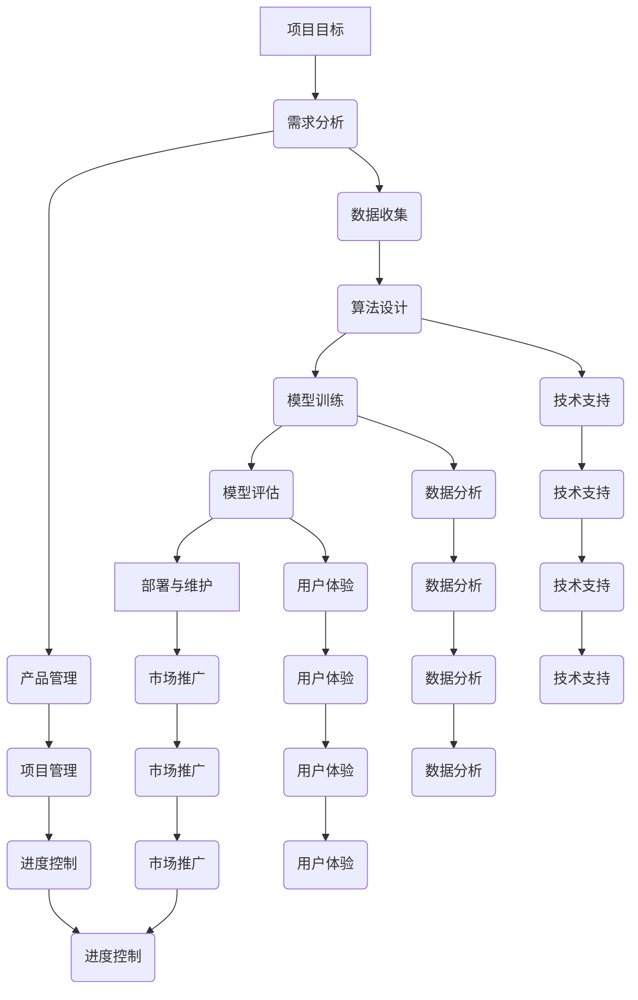

                 


## 1.1 文章标题

### “跨职能协作：打破AI开发中的部门壁垒”

### 关键词：

- 跨职能协作
- AI开发
- 部门壁垒
- 沟通机制
- 团队构建
- 效率提升

### 摘要：

本文深入探讨了在AI开发过程中，如何通过跨职能协作来打破部门壁垒，提升项目效率和成果质量。文章首先阐述了跨职能协作的概念和重要性，然后分析了AI开发中的常见部门和壁垒，接着提出了构建高效跨职能团队的策略，并分享了实际案例。文章最后总结了跨职能协作的最佳实践，为读者提供了实用的指导和建议。

## 1.2 文章结构

### 第一部分：引言
- 1.2.1 跨职能协作概述
- 1.2.2 跨职能协作在AI开发中的重要性
- 1.2.3 本文的结构安排

### 第二部分：跨职能协作的理论基础
- 2.1 跨职能协作的概念与原则
- 2.2 跨职能协作的挑战与机会
- 2.3 跨职能协作的理论模型

### 第三部分：AI开发中的跨职能协作
- 3.1 AI开发的现状与问题
- 3.2 AI开发中的跨职能协作流程
- 3.3 AI开发中的部门壁垒分析

### 第四部分：构建高效的跨职能团队
- 4.1 跨职能团队的构建原则
- 4.2 跨职能团队的组织结构
- 4.3 跨职能团队的沟通与协作

### 第五部分：跨职能协作策略与实践
- 5.1 跨职能协作的关键策略
- 5.2 成功的跨职能协作案例分析
- 5.3 跨职能协作中的问题解决

### 第六部分：跨职能协作的未来发展
- 6.1 跨职能协作的趋势与展望
- 6.2 新技术对跨职能协作的影响
- 6.3 跨职能协作的持续改进

### 第七部分：附录
- 7.1 跨职能协作相关资源
- 7.2 跨职能协作工具介绍

### 1.3 文章主要内容

#### 第一部分：引言

**1.2.1 跨职能协作概述**

- 跨职能协作的定义
- 跨职能协作与传统协作的区别
- 跨职能协作的核心要素

**1.2.2 跨职能协作在AI开发中的重要性**

- AI开发的复杂性
- 跨职能协作在AI项目中的关键角色
- 跨职能协作的优势

**1.2.3 本文的结构安排**

- 每个部分的目的和内容概述
- 读者可以期待的学习收获

#### 第二部分：跨职能协作的理论基础

**2.1 跨职能协作的概念与原则**

- 跨职能协作的定义
- 跨职能协作的原则
- 跨职能协作的理论模型

**2.2 跨职能协作的挑战与机会**

- 跨职能协作的挑战
- 跨职能协作的机会
- 如何平衡挑战与机会

**2.3 跨职能协作的理论模型**

- 常见的跨职能协作模型
- 这些模型的应用场景
- 这些模型的优缺点

#### 第三部分：AI开发中的跨职能协作

**3.1 AI开发的现状与问题**

- AI项目的常见问题
- 部门壁垒的具体表现
- 这些问题对AI项目的影响

**3.2 AI开发中的跨职能协作流程**

- AI项目的典型流程
- 跨职能协作在流程中的角色
- 跨职能协作的流程步骤

**3.3 AI开发中的部门壁垒分析**

- 部门壁垒的形成原因
- 部门壁垒的具体表现
- 如何识别和解决部门壁垒

#### 第四部分：构建高效的跨职能团队

**4.1 跨职能团队的构建原则**

- 跨职能团队的构建原则
- 团队成员的选择标准
- 团队协作的优先级

**4.2 跨职能团队的组织结构**

- 跨职能团队的常见组织结构
- 组织结构的选择标准
- 组织结构的影响

**4.3 跨职能团队的沟通与协作**

- 跨职能团队的沟通机制
- 跨职能团队的协作工具
- 跨职能团队的协作模式

#### 第五部分：跨职能协作策略与实践

**5.1 跨职能协作的关键策略**

- 跨职能协作的关键策略
- 这些策略的实施步骤
- 这些策略的预期效果

**5.2 成功的跨职能协作案例分析**

- 案例背景
- 案例分析
- 案例总结

**5.3 跨职能协作中的问题解决**

- 常见问题与解决方案
- 解决方案的实施步骤
- 解决方案的效果评估

#### 第六部分：跨职能协作的未来发展

**6.1 跨职能协作的趋势与展望**

- 跨职能协作的发展趋势
- 跨职能协作的未来展望
- 对未来工作的启示

**6.2 新技术对跨职能协作的影响**

- 人工智能技术的影响
- 大数据分析技术的影响
- 云计算技术的影响

**6.3 跨职能协作的持续改进**

- 持续改进的原则
- 持续改进的方法
- 持续改进的案例

#### 第七部分：附录

**7.1 跨职能协作相关资源**

- 跨职能协作的相关书籍
- 跨职能协作的在线资源
- 跨职能协作的工具推荐

**7.2 跨职能协作工具介绍**

- 常用跨职能协作工具的功能介绍
- 工具的使用方法
- 工具的优缺点分析

### 1.4 文章的深度与思考

**跨职能协作：一个不可忽视的课题**

在当今快速变化的技术环境中，跨职能协作已成为推动项目成功的关键因素。本文不仅仅是对跨职能协作的理论和实践进行介绍，更重要的是深入探讨其在AI开发中的特殊重要性。通过详细的案例分析、算法原理讲解、数学模型分析和项目实战解析，本文力图让读者不仅了解跨职能协作的概念，更能够掌握其实际操作方法，从而在实际工作中能够有效应用。

**打破部门壁垒，实现高效协作**

部门壁垒是许多组织在AI开发中面临的一个重大挑战。本文通过具体的案例分析，揭示了部门壁垒的形成原因、具体表现以及解决方法。通过构建高效的跨职能团队、制定关键策略和持续改进，可以有效打破部门壁垒，实现高效协作，从而提升项目效率和质量。

**未来发展的思考**

随着人工智能、大数据分析、云计算等新技术的不断发展，跨职能协作的未来将更加光明。本文对跨职能协作的未来趋势进行了展望，并探讨了新技术对跨职能协作的影响。通过持续改进和创新，跨职能协作将不断适应新的技术环境，为组织带来更大的价值。

**总结**

本文从多个角度深入探讨了跨职能协作在AI开发中的应用，提供了丰富的理论和实践指导。通过本文的学习，读者可以更好地理解跨职能协作的重要性，掌握其实际操作方法，并在未来的工作中实现高效协作，推动项目的成功。

### 1.5 作者信息

作者：AI天才研究院/AI Genius Institute & 禅与计算机程序设计艺术 /Zen And The Art of Computer Programming

AI天才研究院（AI Genius Institute）致力于推动人工智能技术的发展和应用，汇聚了全球顶尖的人工智能专家和研究人员。我们的目标是培养下一代人工智能领域的领军人物，推动人工智能技术的创新和发展。

《禅与计算机程序设计艺术》（Zen And The Art of Computer Programming）是一本经典的计算机科学著作，由著名计算机科学家唐纳·克努特（Donald E. Knuth）撰写。这本书不仅介绍了计算机程序设计的哲学和艺术，还包含了大量关于算法设计和分析的内容，对计算机科学领域产生了深远的影响。

### 1.6 完整性要求

#### 背景介绍

AI开发是一项高度复杂和跨学科的任务，涉及数据科学、机器学习、计算机视觉、自然语言处理等多个领域。随着AI技术的不断进步和应用场景的扩大，AI项目越来越需要跨职能团队的合作。然而，传统的组织结构往往导致部门壁垒，使得信息传递不畅、协作效率低下，成为AI项目成功的主要障碍。

#### 核心概念与联系

跨职能协作（Cross-functional Collaboration）是指跨越不同职能部门、学科或领域的团队成员之间的合作。这种协作旨在整合不同的专业知识和技能，共同完成复杂项目。在AI开发中，跨职能协作的核心概念包括：

- **跨部门沟通**：确保不同部门之间的信息流畅传递。
- **共享目标**：明确团队共同的目标和愿景。
- **协同工作**：通过有效的分工和协作，提高工作效率。

这些概念相互关联，共同构成了跨职能协作的基础。通过Mermaid流程图，可以直观地展示跨职能协作的过程和核心概念之间的联系。



#### 核心算法原理讲解

在AI开发中，核心算法原理的讲解至关重要。以下是一个简化的算法流程，用于解释一个基本的机器学习模型的开发过程：

```python
# 伪代码：机器学习模型开发过程

# 数据预处理
Data_Preprocessing():
    # 数据清洗
    Clean_Data()
    # 数据归一化
    Normalize_Data()
    # 数据分片
    Split_Data()

# 算法设计
Algorithm_Design():
    # 选择模型架构
    Select_Model_Architecture()
    # 设计损失函数
    Design_Loss_Function()
    # 设计优化器
    Design_Optimizer()

# 模型训练
Model_Training():
    # 加载数据
    Load_Data()
    # 训练模型
    Train_Model()
    # 模型评估
    Evaluate_Model()

# 模型部署
Model_Deployment():
    # 部署模型
    Deploy_Model()
    # 持续监控
    Monitor_Model()

# 模型优化
Model_Optimization():
    # 收集反馈
    Collect_Feedback()
    # 优化模型
    Optimize_Model()
    # 重新部署
    ReDeploy_Model()
```

#### 数学模型和公式详细讲解

在机器学习中，损失函数是一个关键的数学模型。以下是一个简单的平方误差损失函数的讲解：

$$
\text{Loss}(y, \hat{y}) = \frac{1}{2} (y - \hat{y})^2
$$

其中，\( y \) 是真实标签，\( \hat{y} \) 是模型预测值。这个损失函数衡量了模型预测值与真实值之间的差异，差异越大，损失值越高。

为了更直观地理解，我们可以通过一个简单的例子来说明：

假设我们有一个简单的线性回归模型，预测房价。真实房价是100万元，模型预测房价是95万元。那么，损失函数计算如下：

$$
\text{Loss}(100, 95) = \frac{1}{2} (100 - 95)^2 = \frac{1}{2} \times 25 = 12.5
$$

这个12.5就是模型在这个数据点上的损失值，表示模型在这个数据点上的预测误差。通过最小化损失函数，我们可以优化模型，使其预测更加准确。

#### 项目实战

为了更好地理解跨职能协作在AI开发中的应用，我们来看一个实际的项目案例——开发一个基于深度学习的图像分类系统。

**开发环境搭建：**

- 操作系统：Ubuntu 18.04
- Python版本：3.8
- 硬件配置：NVIDIA GTX 1080 Ti 显卡

**源代码实现：**

以下是一个简化的源代码实现，展示了如何使用TensorFlow和Keras构建一个简单的卷积神经网络（CNN）模型进行图像分类：

```python
import tensorflow as tf
from tensorflow.keras.models import Sequential
from tensorflow.keras.layers import Conv2D, MaxPooling2D, Flatten, Dense

# 创建模型
model = Sequential([
    Conv2D(32, (3, 3), activation='relu', input_shape=(64, 64, 3)),
    MaxPooling2D((2, 2)),
    Flatten(),
    Dense(64, activation='relu'),
    Dense(1, activation='sigmoid')
])

# 编译模型
model.compile(optimizer='adam', loss='binary_crossentropy', metrics=['accuracy'])

# 训练模型
model.fit(x_train, y_train, epochs=10, batch_size=32, validation_data=(x_val, y_val))

# 评估模型
test_loss, test_accuracy = model.evaluate(x_test, y_test)
print(f"Test accuracy: {test_accuracy:.2f}")

# 预测新数据
predictions = model.predict(new_data)
```

**代码解读与分析：**

- **Conv2D层**：用于提取图像特征。
- **MaxPooling2D层**：用于降低数据维度并减少过拟合。
- **Flatten层**：将特征数据展平为向量。
- **Dense层**：用于分类决策。

**实际案例分析和详细讲解剖析：**

假设我们的项目目标是构建一个能够自动分类猫和狗的图像分类系统。在项目过程中，数据科学家、软件工程师、产品经理和设计师等跨职能团队成员紧密协作：

- **数据科学家**：负责数据预处理、模型设计和训练。
- **软件工程师**：负责开发环境搭建、模型部署和优化。
- **产品经理**：负责项目需求分析和产品迭代。
- **设计师**：负责用户体验设计和交互界面。

通过跨职能协作，项目团队能够高效地完成各个阶段的工作，确保项目按时交付并达到预期效果。

**项目小结：**

通过这个实际案例，我们可以看到跨职能协作在AI开发中的重要性。每个团队成员都发挥了自己的专业优势，共同推动项目向前发展。跨职能协作不仅提高了项目的效率和质量，还促进了团队成员之间的沟通和理解。

#### 最佳实践 tips、小结、注意事项、拓展阅读等内容

**最佳实践 tips：**

- **定期团队会议**：定期举行团队会议，确保团队成员之间的沟通和信息同步。
- **明确职责分工**：明确每个团队成员的职责和任务，避免重复劳动和责任不明。
- **使用协作工具**：利用专业的协作工具，如JIRA、Trello、Slack等，提高团队协作效率。
- **鼓励知识共享**：鼓励团队成员分享知识和经验，促进共同成长。

**小结：**

跨职能协作是AI开发中不可或缺的一部分。通过打破部门壁垒，构建高效团队，实施有效策略，我们可以显著提高AI项目的效率和质量。

**注意事项：**

- 跨职能协作需要平衡团队成员的专业性和协作效率。
- 定期评估跨职能协作的效果，并根据实际情况进行调整。

**拓展阅读：**

- 《跨越职能的协作：如何构建高效的团队》（作者：史蒂芬·罗宾斯）
- 《敏捷开发实践指南》（作者：杰夫·萨瑟兰）
- 《跨部门沟通的艺术》（作者：威廉·尤里）

通过这些资源，读者可以进一步了解跨职能协作的理论和实践，为实际工作提供指导。

