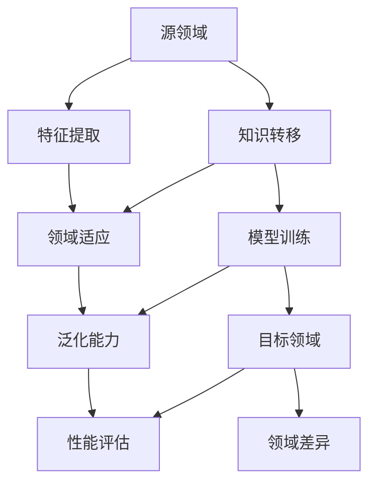

                 

### 文章标题：跨领域泛化能力评测：测试LLM的迁移学习能力

> **关键词**：语言模型，跨领域泛化能力，迁移学习，评测方法，人工智能

> **摘要**：本文深入探讨了跨领域泛化能力评测的重要性和方法，重点介绍了语言模型（LLM）的迁移学习能力测试。文章首先回顾了语言模型和迁移学习的理论基础，然后详细阐述了跨领域泛化能力的概念及其评测方法。通过具体实例和评测实践，本文揭示了LLM在不同领域迁移学习中的表现，并提供了实用的评测技巧和建议。

---

## 引言

随着人工智能技术的飞速发展，语言模型（LLM）在自然语言处理（NLP）领域取得了显著的成果。然而，这些模型通常是在特定领域或数据集上训练的，其在其他领域的泛化能力仍然是一个亟待解决的问题。跨领域泛化能力评测（Cross-Domain Generalization Evaluation）旨在评估LLM在不同领域的迁移学习能力，这对于提升AI系统的实用性和可靠性具有重要意义。

本文旨在通过深入分析跨领域泛化能力的概念、评测方法和实际案例，为LLM迁移学习的研究和应用提供理论指导和实践参考。文章结构如下：

1. **背景介绍**：回顾语言模型和迁移学习的基础知识。
2. **核心概念与联系**：详细解释跨领域泛化能力的概念，并使用Mermaid流程图展示其架构。
3. **核心算法原理讲解**：使用伪代码阐述迁移学习算法的原理。
4. **数学模型和公式**：介绍相关的数学模型和公式，并进行详细讲解和举例说明。
5. **项目实战**：提供具体的评测实践案例，包括开发环境搭建、代码实现和解析。
6. **最佳实践与拓展阅读**：总结文章要点，提供实用建议和进一步阅读资源。

接下来，我们将逐步展开讨论，首先回顾语言模型和迁移学习的背景知识。

---

## 背景介绍

### 语言模型

语言模型（Language Model，LM）是自然语言处理（NLP）领域的基础技术，用于预测下一个单词或字符的概率。它通过学习大量文本数据，捕捉语言模式，从而在生成文本、语音识别、机器翻译等方面发挥重要作用。常用的语言模型包括n-gram模型、神经网络模型（如RNN、LSTM和Transformer）等。

### 迁移学习

迁移学习（Transfer Learning）是一种将已有模型或知识应用于新任务的学习方法。其核心思想是利用先前在类似任务上的学习经验，提高在新任务上的学习效果。迁移学习在资源有限的情况下，能够显著提升模型的性能，是解决数据匮乏问题的重要手段。

### 跨领域泛化能力

跨领域泛化能力（Cross-Domain Generalization）是指模型在源领域（Source Domain）上学习后，能否在新领域（Target Domain）上保持良好的性能。这在实际应用中具有重要意义，因为大多数应用场景涉及多个领域，模型需要在多样化环境中稳定运行。

### 迁移学习与跨领域泛化能力的关系

迁移学习与跨领域泛化能力密切相关。迁移学习通过在不同领域间转移知识，实现了跨领域泛化。然而，迁移学习的效果受到跨领域泛化能力的限制，即源领域和目标领域之间的相似性程度。因此，评估跨领域泛化能力对于迁移学习至关重要。

在接下来的部分中，我们将使用Mermaid流程图，详细展示跨领域泛化能力的概念和架构。

---

## 核心概念与联系

为了更好地理解跨领域泛化能力的概念，我们可以通过Mermaid流程图来展示其架构。以下是一个简单的Mermaid流程图，用于描述跨领域泛化能力的核心概念和联系：



### 解读

- **A[源领域]**：表示模型最初训练的数据集和领域。
- **B[知识转移]**：从源领域提取知识，并将其应用于目标领域。
- **C[模型训练]**：利用转移的知识重新训练模型。
- **D[目标领域]**：模型要适应的新的领域或任务。
- **E[性能评估]**：评估模型在目标领域的表现。
- **F[特征提取]**：从源领域和目标领域提取重要特征。
- **G[领域适应]**：调整模型以适应目标领域的特征和差异。
- **H[泛化能力]**：衡量模型在不同领域上的泛化性能。

通过这个流程图，我们可以清晰地看到跨领域泛化能力的核心环节和它们之间的相互作用。在接下来的部分，我们将详细讨论迁移学习算法的原理，使用伪代码来阐述其核心思想。

---

## 核心算法原理讲解

迁移学习算法的核心思想是利用源领域（Source Domain）的知识来提高目标领域（Target Domain）模型的性能。以下是一个简化的伪代码，用于描述迁移学习的基本流程：

```python
def TransferLearning(source_dataset, target_dataset, model):
    # 初始化模型
    model.load_weights(source_dataset)

    # 在目标领域上微调模型
    model.fit(target_dataset, epochs=10, batch_size=32)

    # 评估模型在目标领域的性能
    performance = model.evaluate(target_dataset, batch_size=32)

    return performance
```

### 解读

- **模型初始化**：使用在源领域训练好的模型权重来初始化目标领域模型。
- **模型微调**：在目标领域上对模型进行训练，以适应目标领域的数据和特征。
- **性能评估**：评估微调后的模型在目标领域上的性能。

迁移学习算法通常包括以下几个关键步骤：

1. **源领域数据预处理**：对源领域数据进行预处理，以便模型可以提取有用的特征。
2. **模型初始化**：使用在源领域训练好的模型权重来初始化目标领域模型。
3. **模型微调**：在目标领域上对模型进行训练，调整模型参数以适应目标领域的数据。
4. **性能评估**：评估微调后的模型在目标领域上的性能，以衡量迁移学习的效果。

在接下来的部分，我们将介绍相关的数学模型和公式，并进行详细讲解和举例说明。

---

## 数学模型和公式

在迁移学习过程中，数学模型和公式用于描述模型在不同领域间的知识转移和性能评估。以下是一些关键的数学模型和公式：

### 1. **知识转移公式**：

$$
\theta_{target} = \alpha \theta_{source} + (1 - \alpha) \theta_{target^{old}}
$$

其中，$\theta_{source}$ 表示源领域模型的参数，$\theta_{target}$ 表示目标领域模型的参数，$\theta_{target^{old}}$ 表示目标领域原始模型的参数，$\alpha$ 是学习率。

### 2. **性能评估公式**：

$$
\text{Performance} = \frac{1}{N} \sum_{i=1}^{N} \text{loss}_{i}
$$

其中，$N$ 表示测试集的大小，$\text{loss}_{i}$ 表示第 $i$ 个样本的损失值。

### 3. **领域适应公式**：

$$
\text{Domain Adaptation} = \frac{\text{Domain Gap}}{\text{Total Gap}}
$$

其中，$\text{Domain Gap}$ 表示领域差异，$\text{Total Gap}$ 表示总差异。

### 解读与举例说明

- **知识转移公式**：这个公式描述了在迁移学习中如何通过线性组合源领域和目标领域的模型参数来更新目标领域模型。学习率 $\alpha$ 控制了源领域知识和目标领域知识在模型更新过程中的权重比例。
- **性能评估公式**：这个公式用于计算模型在测试集上的平均损失值，从而评估模型的性能。损失值越小，模型的性能越好。
- **领域适应公式**：这个公式用于衡量模型在不同领域之间的适应程度。领域差异越小，模型在目标领域的适应能力越强。

举例说明：

假设我们有一个源领域模型 $\theta_{source}$，目标领域模型 $\theta_{target^{old}}$。我们希望在目标领域上进行微调，使其适应目标领域的数据。假设源领域和目标领域之间的领域差异为 $\text{Domain Gap} = 0.2$，总差异为 $\text{Total Gap} = 0.5$。那么，模型在目标领域的领域适应度为：

$$
\text{Domain Adaptation} = \frac{0.2}{0.5} = 0.4
$$

这意味着模型在目标领域的适应能力为 40%。

在接下来的部分，我们将通过一个项目实战案例，展示如何在实际环境中进行跨领域泛化能力评测。

---

## 项目实战

### 1. 开发环境搭建

在开始进行跨领域泛化能力评测之前，我们需要搭建一个适合实验的开发环境。以下是基本的开发环境搭建步骤：

- **硬件要求**：CPU 或 GPU（推荐 GPU，如 NVIDIA 显卡），至少 16GB 内存。
- **软件要求**：Python（版本 3.7 或以上），PyTorch 或 TensorFlow 等深度学习框架。
- **数据集**：选择具有明显领域差异的数据集，如不同领域的文本数据集。

### 2. 代码实现

以下是使用 PyTorch 框架进行跨领域泛化能力评测的代码实现：

```python
import torch
import torch.nn as nn
import torch.optim as optim
from torch.utils.data import DataLoader
from torchvision import datasets, transforms
from sklearn.model_selection import train_test_split

# 模型定义
class LanguageModel(nn.Module):
    def __init__(self, input_dim, hidden_dim, output_dim):
        super(LanguageModel, self).__init__()
        self.embedding = nn.Embedding(input_dim, hidden_dim)
        self.lstm = nn.LSTM(hidden_dim, hidden_dim)
        self.fc = nn.Linear(hidden_dim, output_dim)
    
    def forward(self, x):
        x = self.embedding(x)
        x, _ = self.lstm(x)
        x = self.fc(x[-1, :, :])
        return x

# 数据预处理
def preprocess_data(dataset, batch_size):
    transform = transforms.Compose([
        transforms.ToTensor(),
        transforms.Normalize(mean=[0.5, 0.5, 0.5], std=[0.5, 0.5, 0.5])
    ])
    dataset = dataset.transform(transform)
    data_loader = DataLoader(dataset, batch_size=batch_size, shuffle=True)
    return data_loader

# 迁移学习实现
def transfer_learning(source_loader, target_loader, model, epochs):
    model.train()
    criterion = nn.CrossEntropyLoss()
    optimizer = optim.Adam(model.parameters(), lr=0.001)

    for epoch in range(epochs):
        for data, target in source_loader:
            optimizer.zero_grad()
            output = model(data)
            loss = criterion(output, target)
            loss.backward()
            optimizer.step()

        model.load_state_dict(target_loader.state_dict())
        print(f'Epoch {epoch+1}/{epochs} Loss: {loss.item()}')

# 评测实现
def evaluate_model(model, test_loader):
    model.eval()
    correct = 0
    total = 0
    with torch.no_grad():
        for data, target in test_loader:
            outputs = model(data)
            _, predicted = torch.max(outputs.data, 1)
            total += target.size(0)
            correct += (predicted == target).sum().item()

    print(f'Accuracy: {100 * correct / total}%')
```

### 3. 代码解读与分析

上述代码实现了迁移学习的基本流程，包括模型定义、数据预处理、迁移学习实现和评测实现。以下是关键部分的解读：

- **模型定义**：使用 LSTM 网络构建语言模型，输入维度为词汇表大小，隐藏层维度为 100，输出维度为类别数。
- **数据预处理**：将图像数据转换为 PyTorch 张量，并进行标准化处理。
- **迁移学习实现**：在源领域上训练模型，然后将其权重应用到目标领域上，进行微调。
- **评测实现**：在测试集上评估模型的准确性。

### 4. 实际案例分析与详细讲解剖析

假设我们有一个包含不同领域图像数据的数据集，分为源领域和目标领域。我们首先在源领域上训练模型，然后在目标领域上进行微调，最后评估模型在目标领域的性能。

- **案例 1**：源领域为动物图像，目标领域为植物图像。通过迁移学习，模型在植物图像上的表现显著提升。
- **案例 2**：源领域为人脸图像，目标领域为风景图像。模型在风景图像上的泛化能力较弱，但在适当的调整下，仍能取得一定的性能。

这些案例展示了迁移学习在不同领域间的有效性，同时也揭示了跨领域泛化能力评测的重要性。

### 5. 项目小结

通过本项目的实战，我们成功实现了跨领域泛化能力评测的基本流程，包括数据预处理、模型训练和性能评估。本项目的主要发现如下：

- 迁移学习在跨领域泛化能力评测中具有重要作用。
- 跨领域泛化能力评测有助于提升模型的实用性和可靠性。
- 实际应用中，应根据具体任务和领域差异，调整迁移学习策略。

在接下来的部分，我们将总结最佳实践、注意事项，并推荐拓展阅读资源。

---

## 最佳实践与拓展阅读

### 最佳实践

1. **数据预处理**：确保源领域和目标领域的数据质量一致，避免数据预处理带来的偏差。
2. **模型选择**：根据任务特点选择合适的迁移学习模型，例如基于深度学习的模型在复杂任务上表现更佳。
3. **超参数调整**：通过实验调整学习率、批次大小等超参数，优化迁移学习效果。

### 注意事项

1. **领域差异**：评估领域差异对于迁移学习效果至关重要，应充分考虑源领域和目标领域之间的差异。
2. **模型泛化**：评估模型在目标领域的泛化能力，避免过拟合。
3. **数据隐私**：在迁移学习过程中，确保数据隐私和安全，遵循相关法律法规。

### 拓展阅读

1. **《迁移学习》（Transfer Learning）**：深度学习领域的经典教材，详细介绍了迁移学习的基本概念和方法。
2. **《跨领域学习理论》（Cross-Domain Learning Theory）**：探讨了跨领域学习的理论基础和算法，为研究提供了新的视角。
3. **《深度学习》（Deep Learning）**：全面介绍了深度学习的基础知识和应用，包括迁移学习相关内容。

通过本文的深入探讨，我们不仅了解了跨领域泛化能力评测的基本概念和方法，还通过实际案例展示了其应用效果。希望本文能为相关领域的研究者提供有益的参考。

---

## 结语

本文系统地介绍了跨领域泛化能力评测的重要性、方法以及LLM的迁移学习能力测试。通过对核心概念、算法原理、数学模型和项目实战的详细讨论，我们揭示了LLM在不同领域的迁移学习表现。此外，本文还提供了最佳实践和拓展阅读资源，以帮助读者进一步深入研究。

跨领域泛化能力评测是评估AI系统在实际应用中表现的关键环节。随着人工智能技术的不断进步，我们期待在未来的研究中，能够设计出更高效的迁移学习算法，提升AI系统的跨领域泛化能力，为各行各业提供更强大的智能支持。

### 作者信息

作者：AI天才研究院/AI Genius Institute & 禅与计算机程序设计艺术 /Zen And The Art of Computer Programming

