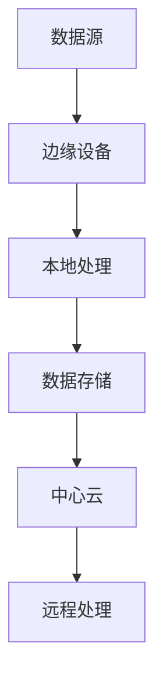
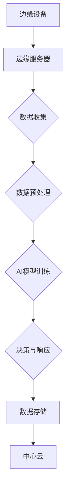

                 

### 边缘AI：将智能推向设备端的技术革新

> 关键词：边缘AI，边缘计算，智能设备，算法优化，应用实践，发展趋势

> 摘要：边缘AI是一种将智能计算能力从云端迁移到设备端的技术，旨在解决云计算的局限性和提高实时数据处理能力。本文将从边缘AI的概述、关键技术、应用实践和发展展望等方面进行深入探讨，帮助读者全面了解边缘AI的原理、技术和应用。

## 目录大纲

## 第一部分：边缘AI概述

### 第1章：边缘计算与边缘AI的定义和背景

1.1 边缘计算的定义

1.2 边缘AI的概念

1.3 边缘计算和边缘AI的发展背景

1.4 边缘AI的应用场景

### 第2章：边缘AI的关键技术

2.1 边缘AI硬件设备

2.2 边缘AI算法优化

2.3 边缘AI数据管理

2.4 边缘AI安全性考虑

### 第3章：边缘AI与云计算的协同

3.1 云计算与边缘计算的区别

3.2 边缘AI与云计算的结合方式

3.3 资源协同优化策略

3.4 边缘AI服务的部署模型

## 第二部分：边缘AI应用实践

### 第4章：智能物联网设备

4.1 物联网设备的边缘智能需求

4.2 智能传感器和执行器的边缘计算

4.3 边缘AI在智能家居中的应用

4.4 边缘AI在智能工厂中的应用

### 第5章：自动驾驶与边缘AI

5.1 自动驾驶的边缘计算需求

5.2 边缘AI在自动驾驶感知系统中的应用

5.3 边缘AI在自动驾驶决策系统中的应用

5.4 自动驾驶边缘计算挑战与解决方案

### 第6章：医疗健康领域的边缘AI

6.1 边缘AI在医疗数据处理中的应用

6.2 边缘AI在远程诊断中的应用

6.3 边缘AI在智能药物管理中的应用

6.4 边缘AI在医疗机器人中的应用

### 第7章：边缘AI在其他领域的应用

7.1 边缘AI在农业监测中的应用

7.2 边缘AI在环境保护中的应用

7.3 边缘AI在公共安全中的应用

7.4 边缘AI在智慧城市中的应用

## 第三部分：边缘AI发展展望

### 第8章：边缘AI的未来趋势

8.1 边缘AI技术的未来发展方向

8.2 边缘AI与5G、物联网等技术的融合

8.3 边缘AI在新兴行业中的应用

8.4 边缘AI对社会和经济的影响

### 第9章：边缘AI发展挑战与解决方案

9.1 边缘AI技术挑战

9.2 数据隐私与安全挑战

9.3 硬件资源限制与能耗优化

9.4 边缘AI人才培养

## 附录：边缘AI开发工具与资源

- 主流边缘AI框架介绍

- 边缘AI开发工具和平台

- 边缘AI研究机构和学术资源

## 第1章：边缘计算与边缘AI的定义和背景

### 1.1 边缘计算的定义

边缘计算（Edge Computing）是一种分布式计算范式，它将数据处理、存储和应用程序逻辑从中心化的数据中心转移到网络的边缘，即在靠近数据源或用户的地方进行处理。这种计算模型旨在减少数据传输的延迟，提高实时数据处理能力，并减轻中心云的负担。

边缘计算的核心概念是“靠近数据源”，这意味着数据处理和存储的地理位置接近数据生成的地方，如图1.1所示。

### 1.2 边缘AI的概念

边缘AI（Edge AI）是边缘计算与人工智能技术的结合，它将机器学习、深度学习等AI算法部署到边缘设备上，使其能够在本地处理和分析数据，而不需要将数据传输到中心云。边缘AI的核心目标是提高设备的智能化程度，实现实时决策和响应。

边缘AI的基本架构如图1.2所示，包括边缘设备、边缘服务器、本地数据处理单元和AI模型。

### 1.3 边缘计算和边缘AI的发展背景

边缘计算和边缘AI的发展受到以下几个因素的推动：

1. **云计算的局限性**：随着数据量的爆炸式增长，云计算中心无法处理所有数据，导致数据处理延迟和网络拥堵。
2. **物联网和5G的发展**：物联网设备和5G网络的普及使得数据生成的速度和规模前所未有，边缘计算成为满足实时数据处理需求的关键。
3. **数据隐私和安全**：用户对数据隐私和安全的需求日益增加，边缘计算可以减少数据传输，降低数据泄露的风险。
4. **智能化设备的兴起**：智能家居、智能城市、自动驾驶等领域对实时决策和智能响应的需求推动边缘AI的发展。

### 1.4 边缘AI的应用场景

边缘AI在多个领域展现出巨大的应用潜力，以下是一些典型的应用场景：

1. **智能物联网设备**：如智能门锁、智能摄像头等，通过边缘AI实现本地数据分析和智能控制。
2. **自动驾驶**：边缘AI可以用于自动驾驶车辆的实时感知、决策和路径规划。
3. **医疗健康**：如远程诊断、智能药物管理、医疗机器人等，边缘AI可以提高医疗服务的质量和效率。
4. **工业制造**：边缘AI可以用于设备监测、故障预测、生产优化等，提高生产效率和降低成本。
5. **公共安全**：如视频监控、人脸识别、事件检测等，边缘AI可以实时分析大量监控数据，提高安全监控的效率。

边缘AI的出现，不仅解决了云计算在处理实时数据方面的局限性，还推动了智能设备的普及和应用。随着技术的不断进步，边缘AI将在更多领域发挥重要作用，推动数字化转型的深入发展。

## 第2章：边缘AI的关键技术

### 2.1 边缘AI硬件设备

边缘AI硬件设备是边缘AI系统的核心组成部分，它决定了边缘AI的性能和应用范围。边缘AI硬件设备主要包括以下几类：

1. **边缘服务器**：边缘服务器是边缘AI系统中的计算中心，负责执行复杂的AI算法和数据处理任务。边缘服务器通常具有高性能的计算能力、低延迟的网络连接和丰富的I/O接口，以便与各种设备和传感器进行数据交换。
2. **边缘网关**：边缘网关位于网络边缘，负责连接各种设备和传感器，并将采集到的数据传输到边缘服务器或云端。边缘网关通常具备数据处理、存储和转发功能，可以实时分析数据并做出决策。
3. **边缘设备**：边缘设备是指直接嵌入在物联网设备中的计算单元，如智能摄像头、智能门锁、智能传感器等。边缘设备通常具有有限的计算资源和存储能力，但能够执行一些基本的AI算法和数据处理任务。

边缘AI硬件设备的选型需要考虑以下几个因素：

1. **计算性能**：根据具体应用需求，选择具有合适计算性能的硬件设备，包括CPU、GPU、FPGA等。
2. **功耗**：边缘设备的功耗对设备的运行时间和能源效率有重要影响，需要选择低功耗的硬件设备。
3. **存储容量**：根据数据处理和存储需求，选择具有足够存储空间的硬件设备。
4. **网络连接**：边缘设备需要具备稳定的网络连接能力，以便与边缘服务器或云端进行数据传输。
5. **兼容性**：硬件设备需要兼容现有的AI算法和开发工具，以便快速部署和扩展。

### 2.2 边缘AI算法优化

边缘AI算法优化是提升边缘AI系统性能和效率的关键技术。由于边缘设备通常具有有限的计算资源和存储能力，因此需要对算法进行优化，使其能够在这些限制条件下高效运行。以下是一些常见的边缘AI算法优化方法：

1. **模型压缩**：模型压缩是减小AI模型的大小和参数数量的过程，从而减少计算资源和存储空间的消耗。常见的模型压缩方法包括量化、剪枝、蒸馏等。
2. **模型迁移学习**：通过迁移学习将预训练的大型AI模型迁移到边缘设备上，可以减少模型的训练时间和计算资源消耗。迁移学习还可以提高边缘AI模型的泛化能力。
3. **模型量化**：模型量化是一种将AI模型的权重和激活值从浮点数转换为低精度整数的方法，从而减少模型的存储空间和计算复杂度。量化技术包括整数量化、二值量化等。
4. **模型蒸馏**：模型蒸馏是一种将大型AI模型的知识传递给小型AI模型的方法，从而提高小型模型的性能和泛化能力。模型蒸馏通常通过训练一个小型模型来学习大型模型的特征表示。
5. **在线学习**：在线学习是一种实时更新和优化边缘AI模型的方法，使其能够适应不断变化的数据和环境。在线学习可以减少模型更新和传输的时间，提高边缘AI的实时性。

### 2.3 边缘AI数据管理

边缘AI数据管理是边缘AI系统能够高效运行的重要保障。由于边缘设备通常具有有限的存储空间和计算能力，因此需要对数据进行有效的管理和处理。以下是一些常见的边缘AI数据管理方法：

1. **数据收集**：边缘设备需要能够高效地收集和传输数据。数据收集策略需要考虑数据的重要性、频率和实时性等因素。
2. **数据预处理**：边缘设备需要能够对数据进行预处理，如去噪、归一化、特征提取等。数据预处理可以提高后续算法的性能和效率。
3. **数据存储**：边缘设备需要选择合适的存储策略来管理数据。数据存储策略需要考虑存储空间、访问速度、数据冗余等因素。
4. **数据加密**：为了保护数据的安全性和隐私性，边缘设备需要使用数据加密技术对数据进行加密存储和传输。
5. **数据同步**：边缘设备需要能够与中心云或其他边缘设备进行数据同步，以确保数据的完整性和一致性。

### 2.4 边缘AI安全性考虑

边缘AI的安全性是边缘AI系统稳定运行的重要保障。由于边缘设备通常分布在广泛的地理区域内，容易受到网络攻击和数据泄露的威胁，因此需要采取一系列安全措施来保护边缘AI系统的安全。以下是一些常见的边缘AI安全性考虑：

1. **访问控制**：通过访问控制机制来限制只有授权用户和设备才能访问边缘AI系统，从而防止未授权访问。
2. **加密传输**：使用加密技术来保护数据在传输过程中的安全性，如TLS/SSL加密协议。
3. **数据完整性**：通过数据完整性校验和哈希算法来确保数据的完整性和一致性。
4. **安全审计**：对边缘AI系统的操作进行记录和审计，以便在发生安全事件时进行调查和恢复。
5. **设备安全**：确保边缘设备的硬件和软件不受恶意软件和病毒的攻击，如安装安全防护软件和定期更新系统。

边缘AI硬件设备的选型、算法优化、数据管理和安全性考虑是构建高效、稳定和安全的边缘AI系统的关键。通过合理选择硬件设备、优化算法和数据处理策略，以及采取有效的安全措施，可以构建一个强大的边缘AI系统，为各种应用场景提供强大的支持。

## 第3章：边缘AI与云计算的协同

### 3.1 云计算与边缘计算的区别

云计算（Cloud Computing）和边缘计算（Edge Computing）是两种不同的计算模型，它们在处理数据的方式、资源分布和目标上存在显著差异。

1. **数据处理方式**：
   - **云计算**：云计算通常涉及中心化的数据处理，数据主要存储在数据中心或云服务器上，通过高速网络连接进行数据传输和处理。
   - **边缘计算**：边缘计算则是在网络边缘进行数据处理，数据在产生地附近进行初步处理和分析，减少数据传输延迟和网络拥堵。

2. **资源分布**：
   - **云计算**：云计算资源分布广泛，包括数据中心、服务器、存储等，可以根据需求动态分配和扩展。
   - **边缘计算**：边缘计算资源分布较分散，通常包括各种边缘设备、边缘服务器和边缘网关，资源分布靠近数据源。

3. **目标**：
   - **云计算**：云计算旨在提供强大的计算和存储能力，支持大规模数据处理和应用。
   - **边缘计算**：边缘计算则注重实时性和低延迟，以支持对实时数据的快速响应和本地决策。

### 3.2 边缘AI与云计算的结合方式

边缘AI与云计算的结合，可以通过以下几种方式实现，以发挥各自的优势，满足不同的应用需求：

1. **协同处理**：
   - **边缘预处理**：在边缘设备上对数据进行初步处理和分析，然后将处理结果或关键信息上传到云端进行进一步处理。
   - **云端增强**：边缘设备执行基本的算法和任务，而复杂的算法和计算任务则在云端完成，然后将结果返回给边缘设备。

2. **分布式计算**：
   - **多级处理**：数据在多个层次进行分布式处理，从边缘设备到边缘服务器，再到云端，每一级都承担不同的计算任务。
   - **联合优化**：通过联合优化边缘设备和云端的计算资源，实现整体性能和效率的提升。

3. **混合部署**：
   - **边缘AI服务**：在边缘部署AI服务，提供实时处理能力，同时利用云端的存储和计算资源进行数据分析和模型训练。
   - **云端模型训练**：在云端进行大规模数据训练，然后将训练好的模型部署到边缘设备上，实现高效的数据分析和决策。

### 3.3 资源协同优化策略

边缘AI与云计算的协同优化，需要考虑以下几个方面：

1. **负载均衡**：
   - 根据任务的重要性和紧急程度，合理分配计算任务到边缘设备和云端，避免资源过度集中或浪费。
   - 利用智能调度算法，动态调整任务执行位置，实现负载均衡。

2. **数据流管理**：
   - **数据压缩与加密**：在传输数据时进行压缩和加密，减少带宽占用和传输风险。
   - **数据流控制**：根据数据流的特点和需求，调整数据传输策略，如批量传输、实时传输等。

3. **资源调度**：
   - **资源预留**：为高优先级的任务预留必要的计算和存储资源，确保任务的及时处理。
   - **资源回收**：在任务完成后回收释放的资源，为其他任务提供资源支持。

4. **能量管理**：
   - **能耗优化**：通过优化计算任务分配和调度，降低边缘设备和云端的能耗。
   - **能量采集**：利用可再生能源，如太阳能、风能等，为边缘设备提供稳定的能源供应。

### 3.4 边缘AI服务的部署模型

边缘AI服务的部署模型可以分为以下几种：

1. **边缘独立部署**：
   - 边缘设备独立完成AI算法的执行，不依赖于云端资源。
   - 适用于计算需求较低、实时性要求高的场景，如智能门锁、智能摄像头等。

2. **边缘协同部署**：
   - 边缘设备与云端协同工作，边缘设备负责数据预处理和初步分析，云端负责复杂计算和数据处理。
   - 适用于计算需求较高、实时性要求较高的场景，如自动驾驶、智能工厂等。

3. **云端为主部署**：
   - 边缘设备主要负责数据收集和传输，主要计算任务在云端完成。
   - 适用于计算资源有限、对实时性要求不高的场景，如远程医疗诊断、在线教育等。

4. **混合部署**：
   - 结合边缘独立部署和边缘协同部署，根据具体应用需求灵活调整。
   - 适用于复杂场景，如智能城市、智能交通等。

边缘AI与云计算的结合，为构建高效、实时、安全的边缘AI系统提供了丰富的解决方案。通过合理设计资源协同优化策略和选择合适的部署模型，可以最大限度地发挥边缘计算和云计算的优势，满足不同应用场景的需求。

## 第4章：智能物联网设备

### 4.1 物联网设备的边缘智能需求

随着物联网（IoT）技术的快速发展，物联网设备正在各行各业中广泛应用。然而，传统的物联网设备通常依赖于中心化的数据处理和存储架构，导致数据处理延迟、带宽占用和安全性等问题。为了解决这些问题，边缘智能成为物联网设备的重要发展方向。

边缘智能（Edge Intelligence）是指将数据处理和分析任务从云端迁移到网络边缘，使物联网设备具备本地数据处理和分析能力。边缘智能的需求主要包括以下几个方面：

1. **实时数据处理**：物联网设备产生的数据量庞大且实时性要求高，边缘智能可以实现对数据的实时处理和分析，提供快速响应。

2. **减少带宽占用**：将数据在边缘设备上处理和存储，可以显著减少数据传输量，降低带宽占用，提高网络传输效率。

3. **提高数据安全性**：边缘智能减少了数据在传输过程中的暴露风险，降低了数据泄露的风险，增强数据安全性。

4. **增强设备自主能力**：边缘智能使得物联网设备具备更强大的自主决策和响应能力，可以独立完成一些复杂的任务，减少对云端的依赖。

### 4.2 智能传感器和执行器的边缘计算

智能传感器和执行器是物联网设备的重要组成部分，它们通过边缘计算实现数据的采集、处理和执行。边缘计算在智能传感器和执行器中的应用主要包括以下几个方面：

1. **数据采集**：智能传感器可以实时采集环境数据，如温度、湿度、光照强度等。边缘设备对采集到的数据进行初步处理，如滤波、去噪、特征提取等。

2. **数据处理**：边缘设备对传感器数据进行实时分析，可以识别异常情况、预测设备故障、优化设备运行状态等。

3. **决策执行**：基于数据分析结果，边缘设备可以自动调整执行器的参数，如自动调节空调温度、自动调节灯光亮度等，实现设备的自主控制。

### 4.3 边缘AI在智能家居中的应用

智能家居是边缘AI的重要应用领域之一，通过边缘智能技术，可以提升家庭设备的管理和智能化水平。以下是一些典型的应用场景：

1. **智能安防**：边缘AI可以用于家庭安防设备的实时监控，如智能摄像头、门锁等。边缘设备可以实时分析视频数据，识别入侵者、火灾等异常情况，及时发出警报。

2. **智能照明**：通过边缘计算，智能灯具可以实时感知环境光线和用户行为，自动调节灯光亮度和色温，提升用户体验。

3. **智能温控**：智能空调和暖气系统可以通过边缘计算，根据室内温度和用户需求，自动调节温度，提高能源利用效率。

4. **智能家电控制**：边缘AI可以用于智能家电的控制和管理，如智能冰箱、洗衣机、烤箱等。通过边缘计算，用户可以远程控制家电，实现一键操作。

### 4.4 边缘AI在智能工厂中的应用

智能工厂是制造业的重要发展方向，边缘AI在智能工厂中的应用可以提升生产效率、降低成本、提高产品质量。以下是一些典型的应用场景：

1. **设备监测**：边缘AI可以用于实时监测工厂设备的运行状态，通过数据分析，预测设备故障，提前进行维护，避免生产中断。

2. **生产优化**：边缘AI可以对生产过程中的各种数据进行实时分析，优化生产流程，提高生产效率，降低生产成本。

3. **质量检测**：边缘AI可以用于产品质量检测，通过边缘计算，实时分析产品数据，识别质量缺陷，确保产品质量。

4. **自动化控制**：边缘AI可以用于自动化控制，通过边缘设备对生产设备进行实时控制，实现自动化生产。

边缘智能在物联网设备中的应用，不仅提升了设备的智能化水平，还提高了数据处理效率、降低了成本、增强了设备安全性。随着边缘AI技术的不断发展和成熟，边缘智能将在更多领域发挥重要作用，推动物联网和智能设备的普及和应用。

## 第5章：自动驾驶与边缘AI

### 5.1 自动驾驶的边缘计算需求

自动驾驶技术的快速发展，对边缘计算提出了新的需求。自动驾驶系统需要实时感知周围环境、做出快速决策并控制车辆，这对计算速度和数据处理能力提出了极高的要求。边缘计算在这一场景中发挥着关键作用，通过将计算任务从云端迁移到边缘设备，实现实时性、安全性和效率的提升。

1. **实时性需求**：自动驾驶系统需要实时处理大量传感器数据，如摄像头、激光雷达、雷达等，以检测行人和车辆的位置、速度等信息。边缘计算能够在本地快速处理这些数据，实现毫秒级的响应时间，满足自动驾驶的实时性需求。

2. **数据处理能力**：自动驾驶系统生成的数据量巨大，传统的云计算中心难以在短时间内处理这些数据。边缘计算通过在车辆附近的边缘设备处理数据，可以显著降低数据传输延迟，提高数据处理能力。

3. **安全性需求**：自动驾驶系统对数据的安全性要求极高，数据传输过程中可能存在泄露、篡改等风险。边缘计算通过在本地处理数据，减少了数据传输过程中暴露的风险，提高了系统的安全性。

### 5.2 边缘AI在自动驾驶感知系统中的应用

自动驾驶感知系统是自动驾驶技术的核心组成部分，它通过多种传感器收集环境信息，实现对周围环境的感知和理解。边缘AI在自动驾驶感知系统中发挥着重要作用，以下是一些典型应用：

1. **图像识别**：边缘AI可以通过图像识别技术，实时识别道路标志、交通信号灯、车辆、行人等物体，实现对周围环境的精确感知。

2. **目标检测**：边缘AI可以用于目标检测，实时检测和跟踪行人和车辆的位置和运动轨迹，为自动驾驶决策系统提供准确的信息。

3. **车道线识别**：边缘AI可以识别道路上的车道线，为自动驾驶车辆提供行驶路径信息，确保车辆在正确的车道上行驶。

4. **环境建模**：边缘AI可以结合多源传感器数据，构建车辆周围的三维环境模型，为自动驾驶决策系统提供详细的环境信息。

### 5.3 边缘AI在自动驾驶决策系统中的应用

自动驾驶决策系统是自动驾驶技术的核心，它根据感知系统提供的信息，做出行驶决策并控制车辆。边缘AI在自动驾驶决策系统中发挥着关键作用，以下是一些典型应用：

1. **路径规划**：边缘AI可以实时分析道路状况和周围环境，为自动驾驶车辆规划最优行驶路径，确保车辆安全、高效地行驶。

2. **速度控制**：边缘AI可以根据车速、交通流量等信息，自动调整车辆的行驶速度，保持与前车的安全距离。

3. **避障决策**：边缘AI可以实时检测车辆周围障碍物，做出避障决策，确保车辆在复杂环境中安全行驶。

4. **紧急制动**：边缘AI可以实时监测车辆状态和周围环境，在检测到潜在危险时，自动执行紧急制动，避免事故发生。

### 5.4 自动驾驶边缘计算挑战与解决方案

自动驾驶边缘计算面临一系列挑战，包括数据处理速度、安全性、功耗和成本等方面。以下是一些常见的挑战和解决方案：

1. **数据处理速度**：
   - **挑战**：自动驾驶系统需要实时处理大量传感器数据，对计算速度有较高要求。
   - **解决方案**：采用高性能的边缘设备，如AI加速卡、FPGA等，提高数据处理速度。

2. **安全性**：
   - **挑战**：边缘计算设备可能面临网络攻击和数据泄露的风险。
   - **解决方案**：采用加密技术、访问控制和安全审计等手段，提高边缘设备的安全性。

3. **功耗**：
   - **挑战**：边缘设备通常需要长时间运行，对功耗有较高要求。
   - **解决方案**：采用低功耗硬件设计、能量收集技术和节能算法，降低功耗。

4. **成本**：
   - **挑战**：边缘计算设备的成本较高，对大规模部署形成制约。
   - **解决方案**：通过技术进步和规模化生产，降低边缘计算设备的成本。

自动驾驶与边缘AI的结合，为自动驾驶技术的发展提供了新的机遇。通过边缘计算，自动驾驶系统能够实现更高效、更安全、更可靠的运行，为未来智能交通和智慧城市的发展奠定基础。

## 第6章：医疗健康领域的边缘AI

### 6.1 边缘AI在医疗数据处理中的应用

边缘AI在医疗数据处理中发挥着重要作用，通过将数据处理和分析任务从云端迁移到边缘设备，可以提高数据处理速度、减少数据传输延迟，并增强数据安全性。以下是边缘AI在医疗数据处理中的几个关键应用：

1. **实时数据采集**：边缘AI可以实时采集来自各种医疗设备的数据，如心电图（ECG）、脑电图（EEG）、血压计、血糖仪等。这些设备通常分布在医院的不同科室或患者家中，通过边缘设备进行数据采集和处理，可以显著减少数据传输延迟。

2. **数据预处理**：边缘AI可以对采集到的医疗数据进行初步处理，如滤波、去噪、归一化等，提高数据质量，为后续分析提供准确的基础。

3. **实时监测**：边缘AI可以实时分析医疗数据，监测患者的健康状况，及时发现异常情况。例如，对于心脏病患者，边缘AI可以实时分析ECG数据，识别心律失常，并及时发出警报，提高诊断的准确性和及时性。

4. **早期预警**：边缘AI可以根据历史数据和实时监测结果，预测患者可能出现的健康问题，实现早期预警。例如，对于糖尿病等慢性病患者，边缘AI可以预测血糖波动趋势，提醒患者调整饮食和用药，预防并发症的发生。

### 6.2 边缘AI在远程诊断中的应用

远程诊断是医疗健康领域的重要应用，通过边缘AI技术，可以实现医生与患者之间的远程互动，提高医疗服务的质量和效率。以下是边缘AI在远程诊断中的几个关键应用：

1. **实时影像分析**：边缘AI可以实时分析医疗影像数据，如X光片、CT扫描、MRI等。通过边缘计算，医生可以在远程直接查看和分析影像，提供快速、准确的诊断意见。

2. **语音识别与文字转换**：边缘AI可以将医生的语音诊断转化为文字，实现远程病历记录和管理。这一技术不仅提高了医生的诊断效率，还降低了医疗错误的风险。

3. **实时会诊**：边缘AI可以支持医生之间的远程会诊，通过视频通话和实时数据共享，实现跨地域的医疗协作。边缘AI还可以分析医生的历史诊断数据，提供诊断建议，帮助医生做出更准确的决策。

4. **智能分诊**：边缘AI可以分析患者的症状和病史，智能分诊到相应的科室和医生，提高医疗资源的利用效率。例如，对于疑似心血管疾病的患者，边缘AI可以将其分诊到心血管科，提供更专业的诊断和治疗建议。

### 6.3 边缘AI在智能药物管理中的应用

智能药物管理是医疗健康领域的一个重要方向，边缘AI在智能药物管理中的应用，可以提高药物管理的精确性和安全性。以下是边缘AI在智能药物管理中的几个关键应用：

1. **药物剂量调整**：边缘AI可以根据患者的实时健康状况和药物代谢数据，智能调整药物的剂量。例如，对于糖尿病患者，边缘AI可以实时监测血糖水平，根据血糖波动自动调整胰岛素剂量，提高治疗效果。

2. **药物副作用监测**：边缘AI可以实时监测患者的药物副作用，及时发现并预警可能的药物不良反应。例如，对于服用多种药物的患者，边缘AI可以分析药物相互作用，预测可能的副作用，并提供相应的预警和建议。

3. **用药提醒**：边缘AI可以自动提醒患者按时服药，通过手机App、智能音箱等设备发送用药提醒，确保患者按医嘱正确用药。

4. **智能药箱管理**：边缘AI可以管理家庭药箱，实时监控药物库存，提醒患者药物过期或不足，确保患者有足够的药物供应。

### 6.4 边缘AI在医疗机器人中的应用

医疗机器人是现代医疗技术的重要组成部分，边缘AI在医疗机器人中的应用，可以提升医疗机器人的智能化水平和应用范围。以下是边缘AI在医疗机器人中的几个关键应用：

1. **手术辅助**：边缘AI可以辅助医生进行手术，通过实时分析患者数据和手术过程中的各种信息，提供精准的手术指导。例如，在微创手术中，边缘AI可以实时分析手术刀的位置和深度，帮助医生避免误伤。

2. **康复训练**：边缘AI可以辅助患者进行康复训练，通过实时监测患者的运动状态和康复进度，提供个性化的康复方案。例如，对于骨折患者，边缘AI可以实时监测患者的肢体活动，根据康复进度调整训练方案。

3. **护理监控**：边缘AI可以用于护理监控，实时监测患者的生命体征和活动状态，及时发现异常情况。例如，在养老院中，边缘AI可以监测老人的活动情况，预防跌倒等意外事件的发生。

4. **远程医疗服务**：边缘AI可以支持远程医疗服务，通过边缘设备和远程通信技术，实现医生与患者的远程互动，提供远程诊断、治疗和康复指导。

边缘AI在医疗健康领域的应用，不仅提高了医疗服务的质量和效率，还为医疗资源的优化配置提供了新的解决方案。随着边缘AI技术的不断发展和成熟，医疗健康领域将迎来更加智能、便捷和高效的发展阶段。

## 第7章：边缘AI在其他领域的应用

### 7.1 边缘AI在农业监测中的应用

农业监测是边缘AI的重要应用领域之一，通过边缘AI技术，可以实现农业生产过程的实时监测和智能管理，提高农业生产效率和质量。以下是边缘AI在农业监测中的几个关键应用：

1. **土壤监测**：边缘AI可以实时监测土壤的湿度、温度、酸碱度等参数，通过边缘设备进行数据采集和初步分析，为农民提供精准的土壤管理建议。

2. **作物生长监测**：边缘AI可以监测作物的生长状态，如株高、叶色、病虫害等，通过图像识别和数据分析技术，识别作物生长过程中的异常情况，及时采取措施。

3. **气象监测**：边缘AI可以实时监测气象数据，如温度、湿度、风速、降雨量等，为农民提供准确的天气预报和农业决策支持，优化灌溉和施肥计划。

4. **病虫害预警**：边缘AI可以通过分析气象数据、土壤数据和作物生长数据，预测病虫害的发生风险，提前采取防治措施，减少病虫害对作物的影响。

### 7.2 边缘AI在环境保护中的应用

边缘AI在环境保护中的应用，可以实现对环境污染的实时监测和预警，提高环境治理的效率和效果。以下是边缘AI在环境保护中的几个关键应用：

1. **空气质量监测**：边缘AI可以实时监测空气质量，通过传感器采集空气中的污染物数据，如PM2.5、PM10、二氧化硫、氮氧化物等，为政府和企业提供准确的空气质量信息，指导环境治理和污染防控。

2. **水质监测**：边缘AI可以实时监测水质，通过传感器采集水中的污染物数据，如重金属、有机污染物、氮磷等，为水环境治理提供科学依据。

3. **噪声监测**：边缘AI可以实时监测环境噪声，通过传感器采集噪声数据，为城市规划和管理提供数据支持，优化城市环境质量。

4. **生态监测**：边缘AI可以监测生态系统的变化，如森林覆盖率、植被生长情况、野生动物活动等，为生态保护和恢复提供技术支持。

### 7.3 边缘AI在公共安全中的应用

边缘AI在公共安全中的应用，可以提高公共安全保障水平，预防和应对各种突发事件。以下是边缘AI在公共安全中的几个关键应用：

1. **视频监控**：边缘AI可以用于视频监控系统的智能化升级，通过图像识别技术，实时分析监控视频，识别可疑人员和物品，及时发现和预警潜在的安全威胁。

2. **人脸识别**：边缘AI可以用于人脸识别系统，通过边缘设备进行人脸识别和匹配，实现快速、准确的身份验证，提高公共区域的访问控制和安全保障。

3. **事件检测**：边缘AI可以实时分析监控视频，识别突发事件，如火灾、打架斗殴、交通事故等，及时发出警报，指导应急响应。

4. **交通管理**：边缘AI可以用于交通管理，通过实时监测交通流量和交通事故，优化交通信号控制，减少交通事故和拥堵。

### 7.4 边缘AI在智慧城市中的应用

边缘AI在智慧城市中的应用，可以提升城市管理水平和居民生活质量，实现城市的智能化和可持续发展。以下是边缘AI在智慧城市中的几个关键应用：

1. **智能交通**：边缘AI可以用于智能交通系统的建设，通过实时监测交通流量和路况，优化交通信号控制，减少交通拥堵，提高交通运行效率。

2. **能源管理**：边缘AI可以用于智慧能源系统的建设，通过实时监测能源消耗和设备运行状态，优化能源分配和使用，提高能源利用效率。

3. **环境监测**：边缘AI可以用于智慧环境系统的建设，通过实时监测环境质量，优化环境治理和污染防控，提高城市环境质量。

4. **公共安全**：边缘AI可以用于智慧公共安全系统的建设，通过视频监控、人脸识别、事件检测等技术，提升公共安全保障水平。

边缘AI在农业监测、环境保护、公共安全和智慧城市等领域的应用，展示了边缘AI技术的广泛适用性和巨大潜力。随着边缘AI技术的不断发展和成熟，这些领域的智能化水平将得到显著提升，为人类社会的可持续发展做出重要贡献。

## 第8章：边缘AI的未来趋势

### 8.1 边缘AI技术的未来发展方向

边缘AI技术的发展正朝着几个关键方向迈进，以适应不断变化的技术和应用需求：

1. **硬件性能的提升**：随着硬件技术的进步，边缘设备将拥有更高的计算能力、更大的存储容量和更优的功耗性能。这将使边缘AI系统能够处理更复杂的数据和更大量的任务。

2. **AI算法的优化**：针对边缘设备的计算资源限制，研究人员正在开发更高效、更轻量级的AI算法。这些算法将通过模型压缩、量化、迁移学习和在线学习等技术，提高边缘AI系统的性能和效率。

3. **网络技术的进步**：5G、边缘计算网络和物联网技术的融合，将进一步提升边缘AI系统的实时性和可靠性。低延迟、高带宽的网络连接将为边缘AI提供更好的支持。

4. **安全性和隐私保护**：随着边缘AI在更多领域的应用，数据安全和隐私保护将成为关键挑战。未来，边缘AI技术将引入更严密的安全机制和隐私保护技术，确保数据在传输和处理过程中的安全性。

### 8.2 边缘AI与5G、物联网等技术的融合

边缘AI与5G、物联网等技术的融合，将推动边缘AI的广泛应用和深度发展：

1. **5G网络的支持**：5G网络的低延迟、高带宽特性，为边缘AI提供了更好的网络环境。边缘设备可以通过5G网络快速传输数据，实现实时数据处理和决策。

2. **物联网的融合**：物联网设备的普及和多样化，为边缘AI提供了丰富的数据来源。边缘AI可以整合来自物联网设备的数据，实现更全面的环境感知和智能决策。

3. **多技术协同**：边缘AI与5G、物联网等技术的协同发展，将形成强大的技术生态系统。通过多技术融合，边缘AI系统可以实现更高效、更智能、更安全的应用。

### 8.3 边缘AI在新兴行业中的应用

边缘AI在新兴行业的应用潜力巨大，以下是一些关键领域：

1. **智能制造**：边缘AI可以用于生产线的实时监测和优化，提高生产效率和质量。通过边缘计算，智能工厂可以实现自动化生产、预测维护和个性化制造。

2. **智慧医疗**：边缘AI可以提升医疗服务的质量和效率，通过实时监测和诊断，实现远程医疗和个性化治疗。

3. **智能交通**：边缘AI可以优化交通管理，提高交通效率，减少拥堵和事故。通过边缘计算，智能交通系统可以实现实时路况监测、智能信号控制和自动驾驶。

4. **智慧能源**：边缘AI可以优化能源分配和使用，提高能源利用效率。通过边缘计算，智能电网可以实现实时监测、预测和维护，确保能源供应的稳定和可靠。

### 8.4 边缘AI对社会和经济的影响

边缘AI的发展将对社会和经济产生深远的影响：

1. **社会影响**：边缘AI将推动智慧城市、智能医疗、智能交通等领域的应用，提高生活质量和公共服务水平。同时，边缘AI也将促进就业，创造新的就业机会。

2. **经济影响**：边缘AI技术将为企业和行业带来新的增长点，推动数字化转型的深入发展。边缘AI在智能制造、智慧物流、智慧金融等领域的应用，将提高生产效率和经济效益。

边缘AI的未来发展，将以其强大的计算能力和智能化水平，推动技术的创新和应用的拓展，为社会和经济带来新的机遇和挑战。

## 第9章：边缘AI发展挑战与解决方案

### 9.1 边缘AI技术挑战

边缘AI技术在发展过程中面临一系列挑战，包括以下几个方面：

1. **计算资源限制**：边缘设备通常具有有限的计算资源和存储能力，这使得复杂的AI算法和大规模数据处理变得困难。如何优化算法和硬件设计，提高边缘设备的计算性能，是边缘AI技术面临的一个重要挑战。

2. **数据安全和隐私**：边缘设备分散在广泛的地理区域内，容易受到网络攻击和数据泄露的威胁。如何确保数据在传输和处理过程中的安全性，保护用户隐私，是边缘AI技术需要解决的关键问题。

3. **低延迟通信**：边缘AI系统依赖于高效的数据传输，以实现实时数据处理和决策。如何降低通信延迟，提高网络传输效率，是边缘AI技术需要克服的另一个挑战。

4. **能耗优化**：边缘设备通常需要长时间运行，能耗问题成为制约其应用的一个重要因素。如何优化算法和硬件设计，降低能耗，延长设备寿命，是边缘AI技术需要面对的挑战之一。

### 9.2 数据隐私与安全挑战

数据隐私与安全是边缘AI技术发展中的关键挑战，以下是一些具体的挑战和解决方案：

1. **挑战**：
   - **数据泄露**：边缘设备在数据传输和处理过程中，容易受到网络攻击和数据泄露的风险。
   - **隐私保护**：如何确保用户数据在传输、存储和处理过程中的隐私保护，避免被未经授权的访问和使用。

2. **解决方案**：
   - **加密传输**：采用加密技术，如TLS/SSL，确保数据在传输过程中的安全性。
   - **数据匿名化**：在数据传输和存储过程中，对敏感信息进行匿名化处理，减少隐私泄露的风险。
   - **访问控制**：实施严格的访问控制机制，确保只有授权用户和设备才能访问敏感数据。
   - **安全审计**：对边缘设备进行定期安全审计，确保系统的安全性和完整性。

### 9.3 硬件资源限制与能耗优化

边缘设备通常具有有限的硬件资源，如何优化算法和硬件设计，降低能耗，是边缘AI技术发展中的重要挑战。以下是一些具体的解决方案：

1. **挑战**：
   - **计算资源限制**：边缘设备计算资源有限，无法支持复杂的AI算法和大规模数据处理。
   - **能耗优化**：边缘设备需要长时间运行，能耗问题成为制约其应用的一个重要因素。

2. **解决方案**：
   - **算法优化**：采用轻量级的AI算法和模型压缩技术，减少计算复杂度和存储空间需求。
   - **硬件设计优化**：采用低功耗硬件设计和能效优化技术，提高边缘设备的能源利用效率。
   - **能量收集**：利用可再生能源，如太阳能、风能等，为边缘设备提供稳定的能源供应。
   - **能效管理**：通过智能调度和能效管理技术，优化边缘设备的运行状态，降低能耗。

### 9.4 边缘AI人才培养

边缘AI技术的发展，需要大量具备相关专业知识和技能的人才。以下是一些关于边缘AI人才培养的建议：

1. **课程设置**：高校和培训机构应开设边缘AI相关的课程，涵盖边缘计算、AI算法、硬件设计、网络安全等领域，为学生提供全面的知识体系。

2. **实践项目**：鼓励学生参与边缘AI相关的实践项目，通过实际操作，提升学生的实践能力和创新精神。

3. **跨界合作**：推动计算机科学、电子工程、通信工程等不同领域的人才跨界合作，培养具备多学科背景的复合型人才。

4. **终身学习**：鼓励边缘AI从业人员持续学习，跟进最新的技术发展和应用趋势，提升自身专业素养。

边缘AI技术的发展挑战和解决方案，涉及到技术、数据安全、硬件资源和人才培养等多个方面。通过技术创新和人才培养，边缘AI技术将在未来发挥更大的作用，推动数字化转型的深入发展。

## 附录：边缘AI开发工具与资源

### 主流边缘AI框架介绍

1. **TensorFlow Lite**：TensorFlow Lite是一个轻量级框架，支持在移动设备和嵌入式设备上运行TensorFlow模型。它提供了丰富的API，支持模型转换、部署和运行。
2. **PyTorch Mobile**：PyTorch Mobile是一个PyTorch的移动端版本，允许开发者将PyTorch模型部署到移动设备和嵌入式设备上，并提供C++和Python API。
3. **Edge TPU**：Google的Edge TPU是一款专为边缘设备设计的AI加速器，支持TensorFlow Lite模型，提供高性能的计算能力，适用于需要低延迟和高效率的应用。

### 边缘AI开发工具和平台

1. **Jetson**：NVIDIA的Jetson系列是一款嵌入式系统，适用于边缘AI应用。Jetson提供了高性能的计算能力和丰富的开发工具，适用于自动驾驶、机器人、智能家居等领域。
2. **Raspberry Pi**：Raspberry Pi是一款低成本、低功耗的微型计算机，适用于边缘计算和AI应用。它拥有丰富的扩展接口和社区支持，适合开发者和初学者。
3. **Arduino**：Arduino是一款开源的嵌入式开发平台，适用于物联网和边缘AI应用。它提供了丰富的硬件模块和库函数，支持多种编程语言，如C++、Python等。

### 边缘AI研究机构和学术资源

1. **MIT Computer Science and Artificial Intelligence Laboratory (CSAIL)**：MIT CSAIL是国际上知名的计算机科学和人工智能研究机构，专注于边缘AI、机器人、自动驾驶等领域的研究。
2. **Stanford University Computer Science Department**：斯坦福大学计算机科学系是一个领先的研究机构，其研究人员在边缘计算和AI领域有着丰富的成果。
3. **IEEE Edge Computing Initiative**：IEEE边缘计算倡议是一个致力于推动边缘计算技术和应用的全球性组织，提供最新的研究论文、会议信息和行业标准。

通过了解和应用这些工具和资源，开发者可以更轻松地构建和部署边缘AI系统，探索边缘AI的无限可能。希望这些信息能对您在边缘AI领域的探索和开发提供帮助。

