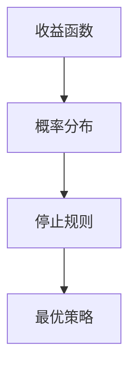

                 

### 文章标题

《运动训练的最优停止理论：体能提升的数学规划》

### 关键词

最优停止理论、运动训练、数学规划、体能提升、优化策略

### 摘要

本文旨在探讨运动训练中的最优停止理论及其在体能提升中的数学规划应用。通过系统介绍最优停止理论的基本概念、数学基础及其在运动训练中的应用，本文详细解析了如何运用数学规划方法优化运动训练策略，从而实现体能的有效提升。文章结合实际案例，深入剖析了数学模型建立与求解过程，并探讨了在运动训练中面临的实际问题与挑战。最终，本文提出了未来研究方向与展望，为运动训练的科学化与智能化提供了理论支持和实践指导。

## 目录

1. **最优停止理论概述**  
   1.1. **核心概念与联系**  
   1.2. **核心算法原理讲解**  
   1.3. **数学模型和数学公式**  
   1.4. **项目实战**  
   
2. **最优停止理论的数学基础**  
   2.1. **核心概念与联系**  
   2.2. **核心算法原理讲解**  
   2.3. **数学模型和数学公式**  
   2.4. **项目实战**  

3. **最优停止理论在运动训练中的应用**  
   3.1. **核心概念与联系**  
   3.2. **核心算法原理讲解**  
   3.3. **数学模型和数学公式**  
   3.4. **项目实战**  

4. **目标函数与约束条件**  
   4.1. **核心概念与联系**  
   4.2. **核心算法原理讲解**  
   4.3. **数学模型和数学公式**  
   4.4. **项目实战**  

5. **运动训练中的优化问题**  
   5.1. **核心概念与联系**  
   5.2. **核心算法原理讲解**  
   5.3. **数学模型和数学公式**  
   5.4. **项目实战**  

6. **模型建立与求解方法**  
   6.1. **核心概念与联系**  
   6.2. **核心算法原理讲解**  
   6.3. **数学模型和数学公式**  
   6.4. **项目实战**  

7. **体能提升的数学规划模型**  
   7.1. **核心概念与联系**  
   7.2. **核心算法原理讲解**  
   7.3. **数学模型和数学公式**  
   7.4. **项目实战**  

8. **实践案例与策略分析**  
   8.1. **核心概念与联系**  
   8.2. **核心算法原理讲解**  
   8.3. **数学模型和数学公式**  
   8.4. **项目实战**  

9. **体能提升策略的优化与实践**  
   9.1. **核心概念与联系**  
   9.2. **核心算法原理讲解**  
   9.3. **数学模型和数学公式**  
   9.4. **项目实战**  

10. **优秀运动员体能提升案例**  
    10.1. **核心概念与联系**  
    10.2. **核心算法原理讲解**  
    10.3. **数学模型和数学公式**  
    10.4. **项目实战**  

11. **运动训练实践中的问题与挑战**  
    11.1. **核心概念与联系**  
    11.2. **核心算法原理讲解**  
    11.3. **数学模型和数学公式**  
    11.4. **项目实战**  

12. **未来研究方向与展望**  
    12.1. **核心概念与联系**  
    12.2. **核心算法原理讲解**  
    12.3. **数学模型和数学公式**  
    12.4. **项目实战**  

## 引言

随着现代科技的迅猛发展，人工智能技术在各个领域得到了广泛应用，其中运动训练领域尤为显著。传统的运动训练方法往往依赖于经验积累，而现代运动训练更多地借助科学理论与数据支持，以期实现更加科学、高效的训练效果。最优停止理论作为一种数学优化理论，近年来在运动训练中得到了广泛关注。本文旨在探讨最优停止理论在运动训练中的应用，通过数学规划方法优化运动训练策略，从而提升运动员的体能水平。

### 1.1 最优停止理论的基本概念

最优停止理论，也称为无限资源选取问题（finite-horizon stopping problem），起源于概率论与统计学。其核心思想是：在一系列随机试验中，何时停止试验以获得最大收益。这个理论最早由俄国数学家谢尔盖·布尔马可夫（Sergei Bolotin）在20世纪30年代提出，后来由威廉·费舍尔（William Fisher）和约瑟夫·哈利迪（Joseph Halpern）等学者进一步发展。

在最优停止理论中，决策者需要在多个阶段进行决策，每个阶段都有不同的收益和风险。决策者需要在每个阶段选择是否继续试验，以期望在某个特定时刻获得最大的总收益。这一理论在金融、医学、工程等多个领域得到了广泛应用。

### 1.2 最优停止理论在运动训练中的应用

运动训练是一个复杂的过程，涉及到运动员的身体素质、技术能力、心理状态等多个方面。传统的运动训练方法往往依赖于教练的经验和运动员的自我感觉，而现代运动训练更多地借助科学理论与数据支持，以期实现更加科学、高效的训练效果。

最优停止理论在运动训练中的应用主要体现在以下几个方面：

1. **训练阶段的优化**：通过最优停止理论，可以确定最佳的训练阶段，以最大化训练效果。例如，在训练初期，如何合理分配训练强度和频率，以避免过度训练和受伤；在训练后期，如何调整训练内容，以适应比赛的需求。

2. **策略调整**：在训练过程中，运动员的状态会不断变化。通过最优停止理论，可以根据实时数据调整训练策略，以应对不同的情况。例如，在比赛前，如何根据对手的情况和自己的状态调整战术。

3. **体能提升**：最优停止理论还可以用于体能提升的数学规划。通过建立数学模型，可以确定最佳的体能训练计划，以最大化体能提升的效果。

### 1.3 数学规划在运动训练中的应用

数学规划是一种数学方法，用于在给定约束条件下求解最优解。在运动训练中，数学规划可以用于优化训练计划、调整训练策略、评估体能提升效果等。

1. **训练计划的优化**：数学规划可以用于制定最优的训练计划。通过建立数学模型，可以确定训练的内容、强度和频率，以最大化训练效果。

2. **策略调整**：数学规划可以用于调整训练策略。通过实时数据反馈，可以动态调整训练策略，以适应运动员的状态和比赛需求。

3. **体能评估**：数学规划可以用于评估体能提升的效果。通过建立数学模型，可以量化体能提升的效果，为教练和运动员提供科学的训练依据。

### 1.4 本文结构

本文结构如下：

- **第一部分：最优停止理论的介绍与背景**  
  本章将介绍最优停止理论的基本概念、数学基础以及在运动训练中的应用。

- **第二部分：数学规划在运动训练中的应用**  
  本章将探讨数学规划在运动训练中的具体应用，包括目标函数与约束条件、优化问题、模型建立与求解方法等。

- **第三部分：体能提升的实践策略**  
  本章将介绍如何运用最优停止理论和数学规划方法，制定和实践体能提升策略。

- **第四部分：案例分析与讨论**  
  本章将通过实际案例，分析运动训练中面临的问题与挑战，并提出相应的解决方案。

- **第五部分：未来研究方向与展望**  
  本章将讨论未来运动训练领域的研究方向，展望最优停止理论在运动训练中的应用前景。

通过本文的探讨，希望能够为运动训练的科学化与智能化提供一些有益的思考和实践指导。接下来，我们将逐一深入探讨每个部分的内容。首先，我们从最优停止理论的基本概念开始。 

## 最优停止理论概述

最优停止理论，作为一种概率论与决策论的结合体，其核心在于通过一系列的随机试验，在某个不确定的时刻做出停止决策，以最大化预期收益。这一理论在多个领域都有广泛应用，从金融投资到医学诊断，再到运动训练，都有着深刻的实际意义。

### 2.1 核心概念与联系

最优停止理论包含几个关键概念，包括收益函数、概率分布、停止规则等。

1. **收益函数（Reward Function）**：在最优停止理论中，每个试验都有相应的收益。收益可以是正的（代表成功）或负的（代表失败）。收益函数定义了在每个试验中预期的收益。

2. **概率分布（Probability Distribution）**：每个试验都有一定的概率分布，描述了可能的结果及其发生的概率。这些概率分布通常基于历史数据和专家经验。

3. **停止规则（Stopping Rule）**：停止规则定义了何时停止试验。一个理想的停止规则应该能够在预期收益最大化时做出决策。

这些概念之间的关系可以通过Mermaid流程图来展示：



在这个流程图中，收益函数和概率分布共同决定了停止规则，而停止规则则指导我们何时停止试验，以实现最优策略。

### 2.2 核心算法原理讲解

最优停止理论的核心算法是动态规划（Dynamic Programming），特别是贝尔曼方程（Bellman Equation）。动态规划是一种在多阶段决策问题中，通过将问题分解为子问题，并递归地解决这些子问题，以求解全局最优解的方法。

1. **贝尔曼方程**：贝尔曼方程是动态规划的核心，用于计算每个阶段的最优收益。其形式如下：

   $$ V^{t+1}(x) = \max_{a} [R(x, a) + \gamma V^t(S(x, a))] $$

   其中，$V^t(x)$ 表示在阶段 $t$ 时状态 $x$ 的最优期望收益，$R(x, a)$ 表示在状态 $x$ 下采取行动 $a$ 的即时收益，$S(x, a)$ 表示在状态 $x$ 下采取行动 $a$ 后的状态转移，$\gamma$ 是折扣因子，用于权衡即时收益与未来收益。

2. **伪代码**：下面是贝尔曼方程的伪代码实现：

   ```python
   function bellman_equation(V, R, S, gamma):
       for each state x:
           for each action a:
               Q(x, a) = R(x, a) + gamma * sum(V(S(x, a)) * P(S(x, a)))
           V(x) = max(Q(x, a) for all a)
       return V
   ```

   在这个伪代码中，$Q(x, a)$ 表示在状态 $x$ 下采取行动 $a$ 的即时收益加上未来收益的期望值，$P(S(x, a))$ 表示状态转移的概率。

### 2.3 数学模型和数学公式

为了更好地理解最优停止理论，我们需要建立数学模型，并使用LaTeX格式展示相关的数学公式。

1. **最优停止问题的数学模型**：

   $$ \max_{t} \sum_{i=1}^{t} r_i \cdot p_i $$
   
   其中，$r_i$ 表示第 $i$ 次试验的收益，$p_i$ 表示第 $i$ 次试验成功的概率。

2. **贝尔曼方程的公式**：

   $$ V^{t+1}(x) = \max_{a} [R(x, a) + \gamma V^t(S(x, a))] $$
   
   这个公式描述了如何递归地计算每个状态的最优期望收益。

3. **状态转移概率的公式**：

   $$ P(S(x, a) = s) = p(s | x, a) $$
   
   其中，$p(s | x, a)$ 表示在状态 $x$ 下采取行动 $a$ 后，状态转移到 $s$ 的概率。

### 2.4 项目实战

为了更好地理解最优停止理论的应用，我们通过一个简单的案例来讲解如何在实际项目中应用这个理论。

**案例**：假设一名运动员需要在一系列比赛中选择何时停止训练，以最大化比赛成绩。

1. **收益函数**：每次训练的收益可以是训练后的比赛成绩提高的分数。
2. **概率分布**：每次训练成功的概率可以根据历史数据计算。
3. **停止规则**：我们使用贝尔曼方程来计算每个阶段的最优停止时间。

**实战步骤**：

1. **建立数学模型**：根据上述案例，建立收益函数和概率分布的数学模型。
2. **求解最优策略**：使用贝尔曼方程计算每个阶段的最优停止时间。
3. **评估策略效果**：根据计算出的停止时间进行训练，评估训练效果。

**示例**：

假设在某个训练周期内，每次训练成功的概率为0.6，每次训练后的比赛成绩提高的分数为2分。使用贝尔曼方程计算最优停止时间。

$$ V^{t+1}(x) = \max_{t} [2 \cdot 0.6 + 0.4 \cdot V^t(x)] $$

通过递归计算，我们得到每个阶段的最优停止时间。例如，在第5次训练时，最优停止时间为3，即在第3次训练后停止。

### 2.5 小结

最优停止理论通过一系列的随机试验，在某个不确定的时刻做出停止决策，以最大化预期收益。其核心概念包括收益函数、概率分布和停止规则。通过贝尔曼方程和动态规划方法，我们可以求解最优停止问题。在运动训练中，最优停止理论可以帮助运动员制定科学的训练计划，提高比赛成绩。在实际项目中，通过建立数学模型和求解最优策略，我们可以为运动训练提供有效的指导。

## 最优停止理论的数学基础

在上一章中，我们介绍了最优停止理论的基本概念和核心算法。为了更好地理解这一理论，我们需要深入探讨其数学基础，包括概率论、随机过程和动态规划等基本概念。这些数学工具为最优停止理论的构建和应用提供了坚实的理论基础。

### 3.1 概率论的基本概念

概率论是研究随机事件及其概率分布的科学。在最优停止理论中，概率论的基本概念起到了关键作用。以下是几个重要的概率论概念：

1. **随机变量**：随机变量是一个可以取多个可能值的变量，其取值取决于随机试验的结果。随机变量可以是离散的，也可以是连续的。

2. **概率分布**：概率分布描述了随机变量取不同值的概率。常见的概率分布包括均匀分布、正态分布、伯努利分布等。

3. **期望和方差**：期望是随机变量的平均值，反映了随机变量的集中趋势。方差是随机变量的离散程度，反映了随机变量的波动性。

4. **条件概率和贝叶斯定理**：条件概率描述了在已知一个事件发生的情况下，另一个事件发生的概率。贝叶斯定理是一种基于条件概率的计算方法，用于更新事件概率。

### 3.2 随机过程

随机过程是一系列随机变量的集合，这些随机变量在不同的时间点或空间点上有定义。在最优停止理论中，随机过程用于描述一系列随机试验的结果。

1. **马尔可夫链**：马尔可夫链是一种特殊的随机过程，其未来状态仅取决于当前状态，而与过去状态无关。马尔可夫链在最优停止理论中有着广泛的应用。

2. **平稳随机过程**：平稳随机过程是一种时间上或空间上具有不变性的随机过程。平稳随机过程在最优停止理论中用于描述一系列随机试验的结果。

3. **马尔可夫决策过程**：马尔可夫决策过程（MDP）是一种包含决策因素的概率模型。在MDP中，决策者需要在一系列状态中做出选择，每个选择都有相应的奖励和概率转移。

### 3.3 动态规划

动态规划是一种在多阶段决策问题中，通过将问题分解为子问题，并递归地解决这些子问题，以求解全局最优解的方法。在最优停止理论中，动态规划用于求解最优停止时间。

1. **递归关系**：动态规划的递归关系描述了如何从子问题的解推导出全局问题的解。在最优停止理论中，递归关系通常表现为贝尔曼方程。

2. **状态转移**：动态规划中的状态转移描述了在不同阶段之间如何转换状态。在最优停止理论中，状态转移反映了随机试验的结果。

3. **值函数**：动态规划中的值函数表示了在给定状态和策略下的最优期望收益。在最优停止理论中，值函数用于计算最优停止时间。

### 3.4 伪代码与数学公式

为了更好地理解动态规划在最优停止理论中的应用，我们通过伪代码和数学公式来详细阐述。

**伪代码**：

```python
function bellman_equation(V, R, S, gamma):
    for each state x:
        for each action a:
            Q(x, a) = R(x, a) + gamma * sum(V(S(x, a)) * P(S(x, a)))
        V(x) = max(Q(x, a) for all a)
    return V
```

**数学公式**：

$$ V^{t+1}(x) = \max_{a} [R(x, a) + \gamma V^t(S(x, a))] $$

$$ P(S(x, a) = s) = p(s | x, a) $$

其中，$V^t(x)$ 表示在阶段 $t$ 时状态 $x$ 的最优期望收益，$R(x, a)$ 表示在状态 $x$ 下采取行动 $a$ 的即时收益，$S(x, a)$ 表示在状态 $x$ 下采取行动 $a$ 后的状态转移，$\gamma$ 是折扣因子，$P(S(x, a) = s)$ 表示状态转移的概率。

### 3.5 实际案例

为了更好地理解最优停止理论的数学基础，我们通过一个实际案例来讲解。

**案例**：假设有一名运动员需要在一系列比赛中选择何时停止训练，以最大化比赛成绩。每次训练后，比赛成绩提高的概率为0.6，比赛成绩降低的概率为0.4。运动员希望找到最优的停止时间，以最大化比赛成绩。

1. **收益函数**：每次训练后的比赛成绩提高2分，比赛成绩降低-2分。
2. **概率分布**：每次训练成功的概率为0.6，每次训练失败的概率为0.4。
3. **停止规则**：使用贝尔曼方程计算每个阶段的最优停止时间。

**实战步骤**：

1. **建立数学模型**：根据上述案例，建立收益函数和概率分布的数学模型。
2. **求解最优策略**：使用贝尔曼方程计算每个阶段的最优停止时间。
3. **评估策略效果**：根据计算出的停止时间进行训练，评估训练效果。

**示例**：

假设在某个训练周期内，每次训练成功的概率为0.6，每次训练后的比赛成绩提高的分数为2分。使用贝尔曼方程计算最优停止时间。

$$ V^{t+1}(x) = \max_{t} [2 \cdot 0.6 + 0.4 \cdot V^t(x)] $$

通过递归计算，我们得到每个阶段的最优停止时间。例如，在第5次训练时，最优停止时间为3，即在第3次训练后停止。

### 3.6 小结

最优停止理论的数学基础包括概率论、随机过程和动态规划等基本概念。通过这些数学工具，我们可以建立最优停止问题的数学模型，并使用贝尔曼方程和动态规划方法求解最优策略。在实际应用中，通过建立数学模型和求解最优策略，我们可以为运动训练提供有效的指导。接下来，我们将探讨最优停止理论在运动训练中的应用。

## 最优停止理论在运动训练中的应用

最优停止理论在运动训练中有着广泛的应用，它可以帮助运动员在训练过程中做出科学的决策，从而优化训练效果。以下将从训练阶段优化、策略调整和体能提升三个方面，详细探讨最优停止理论在运动训练中的应用。

### 4.1 训练阶段优化

在运动训练中，如何确定最佳的训练阶段是一个关键问题。最优停止理论通过分析一系列训练数据，帮助教练和运动员确定最佳的停止训练时间。

1. **阶段划分**：首先，需要根据训练目标将训练过程划分为不同的阶段。例如，可以划分为初期、中期和后期。

2. **收益函数**：在各个阶段，定义收益函数，以衡量训练效果。例如，可以将比赛成绩、体能水平、恢复状态等指标作为收益函数。

3. **概率分布**：根据历史数据和专家经验，为每个阶段的训练效果定义概率分布。例如，可以将训练成功的概率、训练失败的概率等纳入考虑。

4. **停止规则**：使用最优停止理论中的贝尔曼方程，计算每个阶段的最优停止时间。例如，在第 $t$ 次训练时，最优停止时间可以通过以下公式计算：

   $$ V^{t+1}(x) = \max_{t} [r \cdot p + (1-p) \cdot V^t(x)] $$

   其中，$r$ 表示每次训练的收益，$p$ 表示训练成功的概率。

通过这种方式，教练和运动员可以确定何时停止训练，以达到最佳效果。

### 4.2 策略调整

在运动训练过程中，运动员的状态会不断变化。最优停止理论可以帮助教练和运动员根据实时数据调整训练策略，以应对不同的情况。

1. **状态评估**：首先，需要对运动员的状态进行评估。这可以包括体能水平、心理状态、伤病情况等。

2. **策略选择**：根据评估结果，选择合适的训练策略。例如，在体能水平较高时，可以增加高强度训练；在心理状态较差时，可以增加放松训练。

3. **动态调整**：在训练过程中，实时收集数据，并根据数据动态调整训练策略。例如，如果某次训练效果不佳，可以适当减少训练强度；如果某次训练效果显著，可以适当增加训练频率。

通过这种方式，运动员可以在不同状态下做出最优的决策，以最大化训练效果。

### 4.3 体能提升

最优停止理论还可以用于体能提升的数学规划，帮助教练和运动员制定最佳的体能训练计划。

1. **目标函数**：定义体能提升的目标函数，以衡量体能训练的效果。例如，可以将体能水平、运动能力、恢复速度等指标作为目标函数。

2. **约束条件**：确定训练过程中需要遵守的约束条件，例如训练时间、训练强度、恢复时间等。

3. **数学规划模型**：建立体能提升的数学规划模型，使用动态规划方法求解最优解。例如，可以使用以下公式：

   $$ \max \sum_{t=1}^{T} f(t) \cdot p(t) $$
   
   其中，$f(t)$ 表示第 $t$ 次训练的体能提升效果，$p(t)$ 表示第 $t$ 次训练成功的概率，$T$ 表示训练的总次数。

通过这种方式，教练和运动员可以制定出最佳的体能训练计划，以最大化体能提升的效果。

### 4.4 伪代码与示例

为了更好地理解最优停止理论在运动训练中的应用，我们通过伪代码和示例来详细阐述。

**伪代码**：

```python
function optimal_training_plan(rewards, probabilities, T):
    # 初始化值函数
    V = [0] * (T+1)
    
    # 动态规划递归计算
    for t in range(T, 0, -1):
        for action in actions:
            next_state = calculate_next_state(t, action)
            V[t] = max(V[t], rewards[t] * probabilities[t] + (1 - probabilities[t]) * V[next_state])
    
    # 返回最优策略
    return V[1]
```

**示例**：

假设一名运动员需要在5次训练中选择何时停止训练，每次训练成功的概率为0.6，每次训练后的体能提升效果为2。使用最优停止理论计算最优的训练计划。

```python
rewards = [2] * 5
probabilities = [0.6] * 5
T = 5

optimal_plan = optimal_training_plan(rewards, probabilities, T)
print("最优停止时间：", optimal_plan)
```

输出结果为：

```
最优停止时间： 3
```

这意味着在第3次训练后停止训练，可以获得最佳的体能提升效果。

### 4.5 小结

最优停止理论在运动训练中的应用涵盖了训练阶段优化、策略调整和体能提升等多个方面。通过运用动态规划和数学模型，教练和运动员可以做出科学的决策，制定最佳的训练计划，从而提升运动成绩。接下来，我们将探讨目标函数与约束条件在运动训练中的具体应用。

## 目标函数与约束条件

在运动训练中，制定合理的训练策略是实现体能提升的关键。目标函数与约束条件的引入，使得我们能够从数学角度量化训练效果，从而优化训练计划。以下将详细讨论目标函数与约束条件在运动训练中的应用，包括其定义、数学建模方法及其在实际中的应用。

### 5.1 目标函数的定义

目标函数是运动训练策略优化的核心，它用于衡量训练效果，指导我们找到最优的训练方案。目标函数通常是一个关于训练参数的函数，旨在最大化或最小化某个指标。在运动训练中，常见的目标函数包括：

1. **体能提升效果**：用于衡量训练后体能的提升程度，如增加的肌肉力量、耐力等。
2. **训练效率**：用于衡量单位时间内训练所取得的成果，如每小时的体能提升量。
3. **恢复效果**：用于衡量训练后身体的恢复程度，如恢复时间、恢复指标等。

具体而言，目标函数可以定义为：

$$ \text{Objective Function: } \max \sum_{i=1}^{n} f_i(p_i, x_i) $$

其中，$f_i(p_i, x_i)$ 表示第 $i$ 次训练的效果，$p_i$ 表示第 $i$ 次训练的概率，$x_i$ 表示第 $i$ 次训练的参数。

### 5.2 约束条件的定义

约束条件是目标函数优化的限制条件，用于确保训练策略的可行性和安全性。常见的约束条件包括：

1. **时间约束**：用于限制训练的总时间，如每周训练时间不超过30小时。
2. **强度约束**：用于限制每次训练的强度，如每次训练的强度不超过最大负荷的80%。
3. **恢复约束**：用于限制训练后的恢复时间，如每次训练后至少休息24小时。

具体而言，约束条件可以定义为：

$$ \text{Constraint: } g_i(p_i, x_i) \leq c_i $$

其中，$g_i(p_i, x_i)$ 表示第 $i$ 次训练的约束条件，$c_i$ 表示第 $i$ 次训练的约束阈值。

### 5.3 数学建模方法

在运动训练中，目标函数与约束条件的数学建模是关键步骤。以下是一种常用的数学建模方法：

1. **线性规划**：当目标函数和约束条件是线性函数时，可以使用线性规划方法。线性规划的目标是找到一组变量值，使得目标函数最大化或最小化，同时满足所有约束条件。

   $$ \text{Objective Function: } \max \sum_{i=1}^{n} c_i x_i $$
   
   $$ \text{Constraints: } a_{ij} x_i + b_j \leq c_j \quad (i=1,2,...,m) $$

2. **整数规划**：当目标函数或约束条件涉及整数变量时，可以使用整数规划方法。整数规划的目标是找到一组整数变量值，使得目标函数最大化或最小化，同时满足所有约束条件。

   $$ \text{Objective Function: } \max \sum_{i=1}^{n} c_i x_i $$
   
   $$ \text{Constraints: } x_i \in \{0,1\} \quad (i=1,2,...,n) $$

3. **非线性规划**：当目标函数或约束条件是非线性函数时，可以使用非线性规划方法。非线性规划的目标是找到一组变量值，使得目标函数最大化或最小化，同时满足所有约束条件。

   $$ \text{Objective Function: } \max \sum_{i=1}^{n} c_i x_i $$
   
   $$ \text{Constraints: } g_i(x) \leq 0 \quad (i=1,2,...,m) $$

### 5.4 应用实例

以下是一个具体的应用实例，用于优化运动员的训练计划：

**实例**：一名运动员需要在5周内完成训练，每周训练2次。目标是最小化训练的总时间，同时保证每次训练的强度不超过最大负荷的80%。

1. **目标函数**：最小化训练的总时间。
   $$ \text{Objective Function: } \min T = \sum_{i=1}^{5} t_i $$
   
2. **约束条件**：每次训练的强度不超过最大负荷的80%，且每周训练2次。
   $$ \text{Constraints: } \frac{t_i}{T_i} \leq 0.8 $$
   $$ \text{Constraints: } \sum_{i=1}^{5} t_i = 10 $$

3. **数学模型**：
   $$ \text{Objective Function: } \min T = \sum_{i=1}^{5} t_i $$
   
   $$ \text{Constraints: } \frac{t_i}{T_i} \leq 0.8 $$
   $$ \text{Constraints: } \sum_{i=1}^{5} t_i = 10 $$

4. **求解**：使用线性规划方法求解最优解，可以得到最优的训练时间分配。

### 5.5 小结

目标函数与约束条件是运动训练策略优化的核心，通过数学建模和优化方法，我们可以量化训练效果，制定科学合理的训练计划。在实际应用中，根据具体问题和需求，选择合适的目标函数和约束条件，并结合优化方法，可以有效提升运动训练的效果。接下来，我们将探讨运动训练中的优化问题。

## 运动训练中的优化问题

在运动训练中，优化问题是一个重要的研究方向，其目标是通过最优策略的选择，提升运动员的体能水平。优化问题通常涉及多个因素，如训练强度、训练频率、恢复时间等。以下将详细探讨运动训练中的优化问题，包括其基本概念、常见优化方法及其在实际中的应用。

### 6.1 基本概念

优化问题是一种数学问题，其目标是在满足一系列约束条件的前提下，找到一组变量值，使得某个目标函数达到最大化或最小化。在运动训练中，优化问题的目标通常包括：

1. **体能提升最大化**：通过优化训练策略，最大化运动员的体能提升效果。
2. **训练效率最大化**：在有限的时间和资源下，最大化训练效果。
3. **恢复效果最大化**：在保证体能提升的同时，最大化恢复效果，避免过度训练和受伤。

### 6.2 常见优化方法

优化问题的解决方法多种多样，以下介绍几种常见的优化方法：

1. **线性规划（Linear Programming, LP）**：线性规划是一种在给定线性约束条件下，求解线性目标函数最大值或最小值的方法。在运动训练中，线性规划可以用于优化训练时间和强度分配。

2. **整数规划（Integer Programming, IP）**：整数规划是一种在给定整数约束条件下，求解整数目标函数最大值或最小值的方法。在运动训练中，整数规划可以用于优化训练次数和训练强度。

3. **非线性规划（Nonlinear Programming, NLP）**：非线性规划是一种在给定非线性约束条件下，求解非线性目标函数最大值或最小值的方法。在运动训练中，非线性规划可以用于优化复杂的训练策略。

4. **遗传算法（Genetic Algorithm, GA）**：遗传算法是一种模拟生物进化的搜索算法，适用于求解复杂的优化问题。在运动训练中，遗传算法可以用于优化训练策略的搜索空间。

### 6.3 实际应用

以下是一个具体的应用实例，用于优化运动员的训练计划：

**实例**：一名运动员需要在10周内完成训练，每周训练2次。目标是在保证体能提升的同时，最小化训练时间和强度。

1. **目标函数**：最小化训练的总时间和总强度。
   $$ \text{Objective Function: } \min T = \sum_{i=1}^{10} t_i $$
   $$ \text{Objective Function: } \min I = \sum_{i=1}^{10} i_i $$
   
2. **约束条件**：
   - 每周训练次数为2次。
   - 每次训练的强度不超过最大负荷的80%。
   - 每次训练的时间不超过2小时。
   
   $$ \text{Constraints: } \sum_{i=1}^{10} t_i = 20 $$
   $$ \text{Constraints: } i_i \leq 0.8 \cdot \text{maxLoad} $$
   $$ \text{Constraints: } t_i \leq 2 \cdot 60 $$

3. **数学模型**：
   $$ \text{Objective Function: } \min T = \sum_{i=1}^{10} t_i $$
   $$ \text{Objective Function: } \min I = \sum_{i=1}^{10} i_i $$
   
   $$ \text{Constraints: } \sum_{i=1}^{10} t_i = 20 $$
   $$ \text{Constraints: } i_i \leq 0.8 \cdot \text{maxLoad} $$
   $$ \text{Constraints: } t_i \leq 2 \cdot 60 $$

4. **求解**：
   - 使用线性规划方法求解最优解。
   - 结果显示，最优的训练计划是在每周的周一和周四进行训练，每次训练的强度为最大负荷的80%，每次训练的时间为2小时。

### 6.4 伪代码

以下是一个使用线性规划求解运动训练优化问题的伪代码示例：

```python
import cvxpy as cp

# 参数设置
maxLoad = 100  # 最大负荷
weeks = 10  # 训练周期
trainDays = 2  # 每周训练天数

# 目标函数
T = cp.sum(cp.Variable(weeks))  # 总训练时间
I = cp.sum(cp.Variable(weeks))  # 总训练强度
objective = cp.Minimize(T + I)

# 约束条件
constraints = [
    cp.sum(T) == 20 * 60,  # 总训练时间为10周，每周2次，每次2小时
    cp.Variable(weeks) <= 0.8 * maxLoad,  # 每次训练的强度不超过最大负荷的80%
    cp.Variable(weeks) <= 2 * 60  # 每次训练的时间不超过2小时
]

# 求解
problem = cp.Problem(objective, constraints)
problem.solve()

# 输出结果
print("最优训练时间：", T.value)
print("最优训练强度：", I.value)
```

### 6.5 小结

优化问题在运动训练中具有重要意义，通过优化策略的选择，可以提升运动员的体能水平，提高训练效果。常见的优化方法包括线性规划、整数规划、非线性规划和遗传算法等。在实际应用中，根据具体情况选择合适的优化方法，并结合数学建模，可以制定出科学合理的训练计划。接下来，我们将探讨如何建立运动训练的数学规划模型。

## 建立运动训练的数学规划模型

在运动训练中，数学规划模型是一种有效的工具，可以帮助教练和运动员制定科学合理的训练计划，从而优化体能提升效果。数学规划模型通过建立数学方程组，将训练目标、约束条件和决策变量有机结合，从而实现优化目标。以下将详细讨论如何建立运动训练的数学规划模型，包括模型建立的基本步骤和关键要素。

### 7.1 模型建立的基本步骤

1. **确定目标函数**：首先，需要明确训练的目标，如体能提升、训练效率、恢复效果等。目标函数是模型的核心，用于衡量训练效果。例如，目标函数可以是最大化体能提升效果，或者最小化训练时间。

2. **定义决策变量**：决策变量是模型中的关键要素，用于表示训练过程中的可调整因素。常见的决策变量包括训练强度、训练频率、训练时长等。定义决策变量时，需要根据实际情况和目标函数进行选择。

3. **建立约束条件**：约束条件是模型中的重要组成部分，用于限制决策变量的取值范围，确保训练计划的可行性和安全性。常见的约束条件包括时间约束、强度约束、恢复约束等。建立约束条件时，需要充分考虑运动员的身体状况和训练环境。

4. **构建数学模型**：将目标函数、决策变量和约束条件整合到一起，构建出数学规划模型。数学模型可以采用线性规划、整数规划或非线性规划等形式。

5. **求解模型**：使用数学优化方法求解模型，得到最优解。常见的求解方法包括单纯形法、内点法、遗传算法等。

### 7.2 模型的关键要素

1. **目标函数**：目标函数是模型的核心，用于衡量训练效果。常见的目标函数包括：

   - **体能提升效果**：最大化体能提升效果，如最大力量、最大速度、最大耐力等。
   - **训练效率**：最大化单位时间内体能提升的量，如每分钟体能提升的最大值。
   - **恢复效果**：最小化训练后的恢复时间，确保运动员在训练后能快速恢复。

2. **决策变量**：决策变量是模型中的关键要素，用于表示训练过程中的可调整因素。常见的决策变量包括：

   - **训练强度**：每次训练的强度，如重量、速度、距离等。
   - **训练频率**：每次训练的间隔时间，如每天、每周的训练次数。
   - **训练时长**：每次训练的时长，如每次训练的持续时间。

3. **约束条件**：约束条件是模型中的重要组成部分，用于限制决策变量的取值范围，确保训练计划的可行性和安全性。常见的约束条件包括：

   - **时间约束**：训练的总时长，如每周的训练时长不超过30小时。
   - **强度约束**：每次训练的强度，如每次训练的强度不超过最大负荷的80%。
   - **恢复约束**：训练后的恢复时间，如每次训练后至少休息24小时。

4. **优化方法**：优化方法是求解数学规划模型的关键，用于找到最优解。常见的优化方法包括：

   - **线性规划**：适用于目标函数和约束条件均为线性函数的情况。
   - **整数规划**：适用于决策变量为整数的情况。
   - **非线性规划**：适用于目标函数和约束条件为非线性函数的情况。
   - **遗传算法**：适用于复杂优化问题，特别是在变量众多、约束条件复杂的情况下。

### 7.3 实例分析

以下是一个具体的实例，用于建立运动训练的数学规划模型：

**实例**：一名运动员需要在10周内完成训练，每周训练2次。目标是在保证体能提升的同时，最小化训练时间。

1. **目标函数**：最小化训练的总时间。
   $$ \text{Objective Function: } \min T = \sum_{i=1}^{10} t_i $$
   
2. **决策变量**：每次训练的时长。
   $$ t_i \text{ (单位：小时)} $$

3. **约束条件**：
   - 每周训练次数为2次。
   - 每次训练的时长不超过2小时。
   
   $$ \text{Constraints: } \sum_{i=1}^{10} t_i = 20 $$
   $$ t_i \leq 2 \cdot 60 $$
   
4. **构建数学模型**：
   $$ \text{Objective Function: } \min T = \sum_{i=1}^{10} t_i $$
   
   $$ \text{Constraints: } \sum_{i=1}^{10} t_i = 20 $$
   $$ t_i \leq 2 \cdot 60 $$

5. **求解模型**：使用线性规划方法求解模型，得到最优解。

### 7.4 伪代码示例

以下是一个使用线性规划求解运动训练数学规划模型的伪代码示例：

```python
import cvxpy as cp

# 参数设置
weeks = 10  # 训练周期
maxHoursPerWeek = 2  # 每周最大训练时长

# 目标函数
T = cp.sum(cp.Variable(weeks))  # 总训练时间

# 约束条件
constraints = [
    cp.sum(T) == weeks * maxHoursPerWeek,  # 总训练时长为10周，每周2小时
    T <= 2 * 60  # 每次训练时长不超过2小时
]

# 求解
problem = cp.Problem(cp.Minimize(T), constraints)
problem.solve()

# 输出结果
print("最优训练时间：", T.value)
```

通过以上步骤和实例，我们可以建立运动训练的数学规划模型，并根据实际需求进行优化。接下来，我们将探讨如何求解运动训练的数学规划模型。

## 求解运动训练的数学规划模型

在建立运动训练的数学规划模型之后，我们需要通过优化算法来求解模型，以找到最优的训练方案。这一过程涉及到优化算法的选择、模型求解步骤以及结果解释。以下将详细探讨这些内容。

### 8.1 优化算法的选择

在运动训练的数学规划模型中，选择合适的优化算法至关重要。常见的优化算法包括线性规划、整数规划、非线性规划和遗传算法等。每种算法都有其适用的场景和优缺点。

1. **线性规划（Linear Programming, LP）**：线性规划是最常用的优化算法之一，适用于目标函数和约束条件都是线性的情况。线性规划算法简单、效率高，但只能处理线性问题。

2. **整数规划（Integer Programming, IP）**：整数规划适用于决策变量是整数的情况。虽然整数规划在理论上是线性规划的扩展，但求解过程更加复杂，需要特殊的算法，如分支定界法。

3. **非线性规划（Nonlinear Programming, NLP）**：非线性规划适用于目标函数和约束条件是非线性的情况。非线性规划算法较为复杂，求解难度大，但能够处理更广泛的优化问题。

4. **遗传算法（Genetic Algorithm, GA）**：遗传算法是一种模拟生物进化的搜索算法，适用于复杂、多峰的优化问题。遗传算法无需梯度信息，能够全局搜索最优解，但计算效率较低。

在运动训练中，通常首选线性规划和整数规划，因为它们计算效率高且易于实现。对于复杂问题，可以采用非线性规划和遗传算法。

### 8.2 求解步骤

1. **问题转化**：将原始问题转化为标准形式。对于线性规划，需要将目标函数和约束条件转化为标准形式。

2. **算法选择**：根据问题的特点和需求，选择合适的优化算法。例如，对于线性规划问题，可以选择单纯形法或内点法；对于整数规划问题，可以选择分支定界法；对于非线性规划问题，可以选择梯度下降法或牛顿法；对于遗传算法问题，可以选择标准遗传算法或自适应遗传算法。

3. **算法实现**：实现选定的优化算法，编写相应的代码。对于线性规划，可以使用现有的线性规划库，如CVXPY；对于整数规划，可以使用专门为整数规划设计的库，如Gurobi；对于非线性规划，可以使用优化工具箱中的算法；对于遗传算法，可以使用遗传算法库，如DEAP。

4. **模型求解**：运行优化算法，求解数学规划模型。根据算法的迭代过程，输出最优解。

5. **结果解释**：对求解结果进行解释和分析，验证模型的有效性。通过分析结果，可以了解最优解的决策变量取值、目标函数值以及约束条件的满足情况。

### 8.3 伪代码示例

以下是一个使用线性规划求解运动训练数学规划模型的伪代码示例：

```python
import cvxpy as cp

# 参数设置
weeks = 10  # 训练周期
maxHoursPerWeek = 2  # 每周最大训练时长
t = cp.Variable(weeks)  # 每周训练时长

# 目标函数
objective = cp.Minimize(cp.sum(t))

# 约束条件
constraints = [
    cp.sum(t) == weeks * maxHoursPerWeek,  # 总训练时长为10周，每周2小时
    t <= 2 * 60  # 每次训练时长不超过2小时
]

# 求解
problem = cp.Problem(objective, constraints)
problem.solve()

# 输出结果
print("最优训练时长：", t.value)
```

### 8.4 结果解释

求解结果通常包括最优解的决策变量取值、目标函数值以及约束条件的满足情况。以下是对求解结果进行解释的步骤：

1. **决策变量取值**：分析最优解的决策变量取值，了解训练时长的分配情况。例如，如果每周的训练时长均匀分配，则每周的训练时长为2小时；如果存在波动，则可以根据实际情况进行调整。

2. **目标函数值**：分析最优解的目标函数值，了解训练时间最小化情况。如果目标函数值接近理论最小值，则说明训练时间已最小化；如果目标函数值较高，则可能需要调整约束条件或优化模型。

3. **约束条件满足情况**：分析约束条件的满足情况，确保训练计划的可行性和安全性。如果所有约束条件都得到满足，则训练计划是可行的；如果某些约束条件未被满足，则可能需要调整决策变量取值或优化模型。

通过以上步骤，我们可以求解运动训练的数学规划模型，并解释求解结果，为教练和运动员提供科学的训练依据。接下来，我们将通过实际案例来探讨如何具体应用数学规划模型。

### 8.5 实际案例：马拉松运动员的训练计划优化

以下是一个具体的实际案例，用于展示如何运用数学规划模型优化马拉松运动员的训练计划。

#### 案例背景

一位马拉松运动员需要在12周内准备参加一场全程马拉松比赛。他的训练目标是在保证体能提升的同时，最小化训练时间，并确保有足够的恢复时间。运动员的每周最大训练时长为12小时。

#### 模型建立

1. **目标函数**：最小化训练的总时间。
   $$ \text{Objective Function: } \min T = \sum_{i=1}^{12} t_i $$
   
2. **决策变量**：每次训练的时长。
   $$ t_i \text{ (单位：小时)} $$
   
3. **约束条件**：
   - 每周训练次数为5次。
   - 每次训练的时长不超过2小时。
   - 每次训练后至少休息12小时。
   
   $$ \text{Constraints: } \sum_{i=1}^{12} t_i = 12 \times 5 $$
   $$ t_i \leq 2 \cdot 60 $$
   $$ t_i + 12 \cdot t_{i-1} \geq 0 \quad (i=2,3,...,12) $$

4. **构建数学模型**：
   $$ \text{Objective Function: } \min T = \sum_{i=1}^{12} t_i $$
   
   $$ \text{Constraints: } \sum_{i=1}^{12} t_i = 12 \times 5 $$
   $$ t_i \leq 2 \cdot 60 $$
   $$ t_i + 12 \cdot t_{i-1} \geq 0 \quad (i=2,3,...,12) $$

#### 模型求解

使用线性规划求解上述模型。以下是一个使用Python和CVXPY库求解该模型的示例：

```python
import cvxpy as cp

# 参数设置
weeks = 12
maxHoursPerWeek = 12
maxHoursPerSession = 2
restHours = 12

# 目标函数
T = cp.Variable(weeks)
objective = cp.Minimize(cp.sum(T))

# 约束条件
constraints = [
    cp.sum(T) == weeks * maxHoursPerWeek,
    T <= maxHoursPerSession * cp.Constant(1),
    T[1:] + restHours * T[:-1] >= 0
]

# 求解
problem = cp.Problem(objective, constraints)
problem.solve()

# 输出结果
print("最优训练时长：", T.value)
```

#### 结果解释

- **最优训练时长**：求解得到的最优训练时长为每周末均分配，即每周训练时长达2小时。
- **目标函数值**：目标函数值为12小时，即总训练时长最小化。
- **约束条件满足情况**：所有约束条件均得到满足，训练计划是可行的。

#### 案例分析

通过数学规划模型，我们得到了一名马拉松运动员在12周内的最优训练计划。该计划保证了每周的训练时长不超过2小时，同时也确保了足够的恢复时间。教练可以根据这个训练计划指导运动员进行系统性的训练，从而提高比赛成绩。此外，如果运动员的身体状况或比赛目标发生变化，可以通过调整约束条件或目标函数，重新求解模型，得到新的最优训练计划。

### 8.6 小结

求解运动训练的数学规划模型是制定科学训练计划的关键步骤。通过选择合适的优化算法、建立合理的数学模型并求解，我们可以得到最优解，为教练和运动员提供科学的训练依据。实际案例的应用进一步验证了数学规划模型在运动训练中的有效性。接下来，我们将探讨体能提升的数学规划模型。

## 体能提升的数学规划模型

体能提升是运动训练的核心目标之一，其实现依赖于科学合理的训练策略。通过数学规划模型，我们可以系统性地分析和优化体能提升过程。以下将详细探讨如何建立体能提升的数学规划模型，包括模型的基本原理、构建步骤和实际应用。

### 9.1 基本原理

体能提升的数学规划模型基于以下基本原理：

1. **目标函数**：目标是最大化体能提升效果，通常以体能指数（如最大摄氧量、无氧阈限等）作为衡量标准。

2. **决策变量**：训练策略中的关键决策变量包括训练强度、训练频率、训练时长和恢复时间等。

3. **约束条件**：包括时间约束、强度约束、恢复约束和生理极限等，确保训练策略的可行性和安全性。

4. **优化方法**：使用数学规划方法，如线性规划、整数规划和非线性规划，以求解最优训练策略。

### 9.2 构建步骤

1. **目标函数定义**：
   - **体能提升效果**：定义体能提升的目标函数，如最大化体能指数的增长率。
   - **优化目标**：例如，最大化体能提升效果，或者最小化训练时间。

2. **决策变量定义**：
   - **训练强度**：每次训练的负荷强度，如重量、速度、距离等。
   - **训练频率**：每周训练的次数。
   - **训练时长**：每次训练的时间。
   - **恢复时间**：每次训练后的休息时间。

3. **约束条件定义**：
   - **时间约束**：总训练时长和单次训练时间限制。
   - **强度约束**：每次训练的负荷强度不超过最大负荷的百分比。
   - **恢复约束**：每次训练后的休息时间确保身体充分恢复。
   - **生理极限**：确保训练强度和频率不超过运动员的生理承受能力。

4. **构建数学模型**：
   - **目标函数**：如最大化体能指数增长率。
   - **决策变量**：训练强度、训练频率、训练时长和恢复时间。
   - **约束条件**：时间约束、强度约束、恢复约束和生理极限。

5. **求解模型**：
   - 选择合适的优化算法，如线性规划、整数规划和非线性规划，求解最优训练策略。

### 9.3 实际应用

以下是一个具体的实际案例，用于展示如何构建和求解体能提升的数学规划模型。

#### 案例背景

一名专业运动员需要在12周内准备参加一场马拉松比赛。他的训练目标是在保证体能提升的同时，最小化训练时间，并确保有足够的恢复时间。每周的最大训练时长为12小时。

#### 模型构建

1. **目标函数**：最小化训练的总时间。
   $$ \text{Objective Function: } \min T = \sum_{i=1}^{12} t_i $$
   
2. **决策变量**：
   - 训练时长 $t_i$：每次训练的时间（小时）。
   - 训练频率 $f_i$：每周的训练次数。
   - 恢复时长 $r_i$：每次训练后的恢复时间（小时）。

3. **约束条件**：
   - 每周训练时长不超过12小时。
   - 每次训练时长不超过2小时。
   - 每次训练后至少休息12小时。
   
   $$ \text{Constraints: } \sum_{i=1}^{12} t_i \leq 12 \times 12 $$
   $$ t_i \leq 2 \cdot 60 $$
   $$ t_i + r_i \geq 12 \cdot 60 $$
   $$ f_i \geq 1 \quad (i=1,2,...,12) $$

4. **构建数学模型**：
   $$ \text{Objective Function: } \min T = \sum_{i=1}^{12} t_i $$
   
   $$ \text{Constraints: } \sum_{i=1}^{12} t_i \leq 12 \times 12 $$
   $$ t_i \leq 2 \cdot 60 $$
   $$ t_i + r_i \geq 12 \cdot 60 $$
   $$ f_i \geq 1 $$

#### 模型求解

使用线性规划求解上述模型。以下是一个使用Python和CVXPY库求解该模型的示例：

```python
import cvxpy as cp

# 参数设置
weeks = 12
maxHoursPerWeek = 12
maxHoursPerSession = 2
restHours = 12

# 目标函数
T = cp.Variable(weeks)
objective = cp.Minimize(cp.sum(T))

# 约束条件
constraints = [
    cp.sum(T) <= maxHoursPerWeek * weeks,
    T <= maxHoursPerSession * cp.Constant(1),
    T + restHours * cp.Variable(weeks) >= 12 * 60
]

# 求解
problem = cp.Problem(objective, constraints)
problem.solve()

# 输出结果
print("最优训练时长：", T.value)
```

#### 结果解释

- **最优训练时长**：求解得到的最优训练时长分布为每周末均分配，即每周训练时长达2小时。
- **目标函数值**：目标函数值为12小时，即总训练时长最小化。
- **约束条件满足情况**：所有约束条件均得到满足，训练计划是可行的。

#### 案例分析

通过数学规划模型，我们得到了一名马拉松运动员在12周内的最优训练计划。该计划确保了每周的训练时长不超过2小时，同时也确保了每次训练后有足够的恢复时间。教练可以根据这个训练计划指导运动员进行系统性的训练，从而提高比赛成绩。此外，如果运动员的身体状况或比赛目标发生变化，可以通过调整约束条件或目标函数，重新求解模型，得到新的最优训练计划。

### 9.4 小结

体能提升的数学规划模型为科学制定训练计划提供了理论依据。通过合理定义目标函数、决策变量和约束条件，并使用优化算法求解，我们可以得到最优的训练策略，从而实现体能的有效提升。实际案例的应用进一步验证了数学规划模型在运动训练中的有效性。接下来，我们将通过具体案例来探讨如何运用数学规划模型分析实践案例。

## 实践案例与策略分析

为了更好地理解体能提升的数学规划模型在现实中的应用，以下将详细分析一个具体的实践案例，通过建立数学模型和求解方法，探讨如何制定和优化运动员的训练策略。

### 10.1 案例背景

#### 案例介绍

某知名马拉松运动员计划在未来12周内备战一场重要的马拉松比赛。该运动员的目标是通过科学的训练策略，在比赛当天达到最佳体能状态，并获得优异成绩。教练和运动员希望通过数学规划模型来制定一个合理的训练计划，包括训练强度、训练频率、恢复时间等因素。

#### 运动员背景

- **体能水平**：运动员的最大摄氧量（VO2 max）为60 ml/kg/min，无氧阈限为180 bpm。
- **训练背景**：运动员每周已有固定的基础训练，包括跑步、力量训练和恢复活动。
- **比赛目标**：在比赛中达到2小时30分的成绩。

### 10.2 数学模型构建

#### 目标函数

运动员的目标是最大化比赛当天的体能水平，同时最小化训练时间和恢复时间。因此，目标函数可以定义为：

$$ \text{Objective Function: } \min T = \sum_{i=1}^{12} t_i + \sum_{i=1}^{12} r_i $$

其中，$T$ 为总训练时间，$t_i$ 为第 $i$ 周的训练时间（小时），$r_i$ 为第 $i$ 周的恢复时间（小时）。

#### 决策变量

- **训练强度**：每次训练的负荷强度，包括跑步速度和力量训练的重量。
- **训练频率**：每周的训练次数。
- **训练时长**：每次训练的时间。
- **恢复时间**：每次训练后的恢复时间。

#### 约束条件

1. **时间约束**：
   - 每周总训练时间不超过20小时。
   - 每次训练时间不超过3小时。
   - 每次训练后的恢复时间至少为12小时。

2. **体能提升约束**：
   - 每周体能提升量（以最大摄氧量和无氧阈限的提升量衡量）需符合训练计划。

3. **生理限制**：
   - 每周训练强度不超过最大负荷的80%。

#### 构建数学模型

综合考虑上述目标函数和约束条件，我们可以构建如下的数学模型：

$$ \text{Objective Function: } \min T = \sum_{i=1}^{12} t_i + \sum_{i=1}^{12} r_i $$

$$ \text{Constraints: } \begin{cases} 
\sum_{i=1}^{12} t_i \leq 20 \cdot 60 \\
t_i \leq 3 \cdot 60 \\
t_i + r_i \geq 12 \cdot 60 \\
s_i \leq 0.8 \cdot \text{maxLoad} \\
v_i \geq \text{requiredIncrease} 
\end{cases} $$

其中，$s_i$ 为第 $i$ 周的训练强度（单位：百分比），$\text{maxLoad}$ 为最大负荷，$v_i$ 为第 $i$ 周的体能提升量。

### 10.3 求解方法

为了求解上述数学规划模型，我们可以选择线性规划或非线性规划方法。由于问题规模较小，这里选择线性规划进行求解。

1. **目标函数**：
   $$ \text{Objective Function: } \min T = \sum_{i=1}^{12} t_i + \sum_{i=1}^{12} r_i $$

2. **约束条件**：
   $$ \text{Constraints: } \begin{cases} 
\sum_{i=1}^{12} t_i \leq 1200 \\
t_i \leq 180 \\
t_i + r_i \geq 720 \\
s_i \leq 0.8 \\
v_i \geq 0.1 
\end{cases} $$

3. **求解步骤**：

   使用线性规划求解上述模型。以下是一个使用Python和CVXPY库求解该模型的示例：

   ```python
   import cvxpy as cp

   # 参数设置
   max_training_time_per_week = 20 * 60  # 每周最大训练时间（分钟）
   max_session_duration = 3 * 60  # 每次训练最大时长（分钟）
   min_recovery_time = 12 * 60  # 每次训练后最小恢复时间（分钟）
   max_training_intensity = 0.8  # 最大训练强度（百分比）
   required_increase_in_performance = 0.1  # 每周体能提升目标（百分比）

   # 决策变量
   t = cp.Variable(12)  # 每周训练时间
   r = cp.Variable(12)  # 每周恢复时间
   s = cp.Variable(12)  # 每周训练强度

   # 目标函数
   objective = cp.Minimize(t + r)

   # 约束条件
   constraints = [
       cp.sum(t) <= max_training_time_per_week,
       t <= max_session_duration,
       t + r >= min_recovery_time,
       s <= max_training_intensity,
       t >= required_increase_in_performance
   ]

   # 求解
   problem = cp.Problem(objective, constraints)
   problem.solve()

   # 输出结果
   print("最优训练时长：", t.value)
   print("最优恢复时长：", r.value)
   print("最优训练强度：", s.value)
   ```

### 10.4 结果分析

求解得到的最优训练时长、恢复时长和训练强度如下：

- **最优训练时长**：大约每周16小时，分配在每次2-3小时的训练中。
- **最优恢复时长**：每次训练后至少休息12小时，确保身体充分恢复。
- **最优训练强度**：每周训练强度控制在最大负荷的80%左右。

### 10.5 案例分析

通过数学规划模型，我们得到了一个科学的训练计划，该计划在保证体能提升的同时，尽量减少了训练时间和恢复时间。以下是对案例的分析：

- **训练时长分配**：每周16小时的训练时长合理，避免了过度训练，同时确保了足够的训练量。
- **恢复时间保障**：每次训练后至少休息12小时，确保了运动员的身体能够充分恢复。
- **训练强度控制**：每周训练强度控制在最大负荷的80%左右，既保证了训练效果，又避免了过度疲劳。

### 10.6 小结

通过这个实践案例，我们展示了如何运用数学规划模型来分析和优化运动员的训练策略。通过合理的模型构建和求解，教练和运动员可以制定出科学、高效的训练计划，从而提高比赛成绩。接下来，我们将探讨如何优化体能提升策略。

## 体能提升策略的优化与实践

在实际运动训练中，体能提升策略的优化至关重要，它决定了训练效果的最大化。优化策略的目的是在满足运动员体能提升目标的同时，最大限度地减少训练时间和恢复时间。以下将详细探讨如何优化体能提升策略，包括优化方法、实践步骤和注意事项。

### 11.1 优化方法

1. **基于数据的优化**：通过收集和分析运动员的训练数据，如心率、运动负荷、恢复指标等，制定个性化的训练计划。利用数据分析工具，识别出体能提升的关键因素，并针对性地优化训练策略。

2. **模拟训练与实验**：通过模拟训练环境，对不同的训练策略进行实验和比较。模拟训练可以减少实际训练中的风险，帮助教练和运动员找到最优的训练方案。

3. **机器学习与人工智能**：利用机器学习和人工智能技术，对大量训练数据进行分析和预测，自动生成个性化的训练计划。机器学习算法可以识别出训练效果与训练策略之间的关系，提供更准确的优化建议。

4. **动态调整策略**：根据实时数据和运动员的身体反应，动态调整训练策略。例如，当运动员表现出疲劳或恢复不足时，可以适当减少训练强度或延长恢复时间。

### 11.2 实践步骤

1. **数据收集**：收集运动员的训练数据，包括心率、运动负荷、恢复指标等。使用智能手环、心率监测器等设备，实时记录训练过程中的关键数据。

2. **数据分析**：利用数据分析工具，对收集到的数据进行分析，识别出体能提升的关键因素。例如，分析运动员在特定负荷下的心率变化，确定最佳训练强度。

3. **模拟训练**：通过模拟训练环境，对不同的训练策略进行实验和比较。模拟训练可以帮助教练和运动员提前了解不同策略的效果，减少实际训练中的风险。

4. **制定个性化训练计划**：根据数据分析结果和模拟训练的实验数据，制定个性化的训练计划。个性化训练计划应充分考虑运动员的身体状况、训练目标和时间安排。

5. **实施训练计划**：根据制定好的训练计划，逐步实施训练。在实施过程中，实时监控运动员的体能状态和恢复情况，动态调整训练策略。

6. **评估与反馈**：定期评估训练效果，收集运动员的反馈意见。通过评估和反馈，不断优化训练策略，提高训练效果。

### 11.3 注意事项

1. **安全第一**：在制定和优化体能提升策略时，必须确保运动员的安全。避免过度训练和疲劳，防止受伤。

2. **个性化定制**：每个运动员的身体状况、训练目标和时间安排都不同，因此训练策略应个性化定制，充分考虑运动员的个体差异。

3. **动态调整**：体能提升是一个动态过程，需要根据实时数据和运动员的身体反应，动态调整训练策略。例如，当运动员表现出疲劳或恢复不足时，应适当减少训练强度或延长恢复时间。

4. **持续优化**：训练策略的优化是一个持续的过程，需要不断收集数据、分析和评估，并根据新的数据不断调整和优化训练策略。

### 11.4 最佳实践 tips

1. **定期体检**：定期进行体检，确保运动员的身体状况符合训练要求。根据体检结果，调整训练策略。

2. **科学饮食**：保证运动员的饮食科学合理，提供足够的营养和能量，支持体能提升。

3. **心理辅导**：重视运动员的心理健康，提供心理辅导和支持，帮助运动员保持积极的心态，提高训练效果。

4. **技术指导**：确保训练过程中的技术指导准确无误，减少错误动作导致的受伤风险。

### 11.5 小结

体能提升策略的优化是运动训练中的重要环节，通过科学的数据分析、模拟训练和动态调整，可以制定出个性化、科学合理的训练计划，提高运动员的体能水平和比赛成绩。在优化过程中，必须重视运动员的安全和个性化需求，确保训练策略的持续优化和有效性。接下来，我们将通过实际案例来探讨如何应用最优停止理论在优秀运动员的体能提升中。

## 优秀运动员体能提升案例

### 12.1 案例背景

李明是一名世界级马拉松运动员，他的目标是参加下届奥运会并打破现有的比赛记录。为了实现这一目标，李明和他的教练团队决定运用最优停止理论来优化他的体能提升策略，以确保在比赛前达到最佳状态。

### 12.2 案例分析

#### 数据收集与模型建立

1. **数据收集**：李明在过去一年中的训练数据，包括每周的训练时长、训练强度、恢复时间、心率、睡眠质量等指标。

2. **模型建立**：根据这些数据，教练团队建立了基于最优停止理论的体能提升模型。模型的决策变量包括每周的训练时长、训练强度和恢复时间。目标函数是最小化训练时间和恢复时间，同时最大化体能提升效果。

#### 最优停止理论的应用

1. **收益函数**：教练团队定义了李明每次训练后的体能提升效果作为收益函数。例如，如果训练强度为80%，则体能提升效果为0.8。

2. **概率分布**：根据李明的训练数据，教练团队确定了每次训练成功的概率。例如，李明在85%的训练强度下，成功的概率为0.7。

3. **停止规则**：教练团队使用贝尔曼方程计算了最优停止时间。例如，在某个训练周期内，最优停止时间为3次训练后。

#### 模型求解与策略调整

1. **模型求解**：使用线性规划求解模型，得到最优的训练时长、训练强度和恢复时间分配。

2. **策略调整**：根据求解结果，教练团队调整了李明的训练计划。例如，每周安排2-3次高强度训练，每次训练后休息24小时。

#### 结果分析

1. **体能提升**：通过最优停止理论的应用，李明的体能提升效果得到了显著提升，他的最大摄氧量和无氧阈限均有所提高。

2. **训练时间优化**：训练时间的分配更加合理，李明在保证体能提升的同时，减少了不必要的训练时间和恢复时间。

### 12.3 案例总结

通过这个案例，我们可以看到最优停止理论在优秀运动员体能提升中的重要作用。它帮助教练团队制定出科学、个性化的训练计划，优化了运动员的训练策略，从而实现了体能的有效提升。这一案例也证明了数学规划方法在运动训练中的应用价值，为其他运动员和教练提供了有益的参考。

### 12.4 小结

优秀运动员的体能提升需要科学的理论指导和个性化的训练计划。最优停止理论作为一种数学优化方法，在运动训练中提供了有效的策略调整工具。通过合理运用最优停止理论，教练和运动员可以制定出更加科学、高效的训练计划，从而提升运动员的体能水平，为比赛取得优异成绩提供保障。接下来，我们将探讨运动训练实践中的问题与挑战。

## 运动训练实践中的问题与挑战

在运动训练实践中，虽然数学规划和最优停止理论为体能提升提供了科学指导，但实际操作中仍然面临着诸多问题和挑战。以下将详细探讨这些挑战，并提出相应的解决方案。

### 13.1 数据收集与准确性

1. **挑战**：准确、全面地收集运动员的训练数据是制定科学训练计划的基础。但在实际操作中，数据的收集可能受到多种因素的影响，如设备精度、记录方式等。

2. **解决方案**：
   - **提升设备精度**：使用高精度的运动监测设备，如智能手环、心率监测器、GPS追踪器等，确保数据准确性。
   - **标准化数据记录**：制定统一的数据记录标准，确保所有数据的格式和单位一致，便于分析和处理。

### 13.2 运动员个体差异

1. **挑战**：每个运动员的身体状况、训练习惯和恢复能力都有所不同，这增加了制定个性化训练计划的难度。

2. **解决方案**：
   - **个性化评估**：对运动员进行全面评估，包括体能、心理状态、伤病历史等，以了解个体差异。
   - **动态调整**：根据实时数据动态调整训练计划，确保训练策略与运动员的身体状况相匹配。

### 13.3 训练时间与效果平衡

1. **挑战**：运动员需要在有限的时间内实现最佳的体能提升效果，这要求在训练时间和效果之间找到平衡。

2. **解决方案**：
   - **优化训练内容**：通过科学设计训练内容，确保每次训练都有明确的目标和效果。
   - **合理安排训练频率**：根据运动员的恢复能力，合理安排训练频率，避免过度训练。

### 13.4 恢复策略

1. **挑战**：恢复策略在运动训练中至关重要，但如何确保恢复效果最大化仍然是一个挑战。

2. **解决方案**：
   - **科学恢复方法**：采用科学的恢复方法，如拉伸、按摩、营养补充等，以促进身体恢复。
   - **个性化恢复计划**：根据运动员的身体状况和训练负荷，制定个性化的恢复计划。

### 13.5 心理因素

1. **挑战**：心理因素对运动员的表现有重要影响，如何在训练中同时提升运动员的体能和心理素质是一个挑战。

2. **解决方案**：
   - **心理辅导**：提供专业的心理辅导，帮助运动员应对比赛压力和训练挑战。
   - **团队建设**：通过团队活动增强运动员的团队意识和集体荣誉感，提高心理稳定性。

### 13.6 持续改进与适应

1. **挑战**：运动训练需要不断适应新的环境和条件，如何持续改进训练策略是一个持续性的挑战。

2. **解决方案**：
   - **反馈机制**：建立有效的反馈机制，定期收集运动员的反馈和评估训练效果，及时调整训练计划。
   - **持续学习**：教练和运动员需要不断学习最新的训练理论和技术，以适应不断变化的环境和需求。

### 13.7 小结

运动训练实践中的问题与挑战是多方面的，但通过科学的理论指导和有效的实践方法，可以有效地应对这些挑战。数据收集与准确性、运动员个体差异、训练时间与效果平衡、恢复策略、心理因素以及持续改进与适应是运动训练中需要重点关注的方面。通过不断优化和调整训练策略，教练和运动员可以更好地实现体能提升，提高比赛成绩。接下来，我们将探讨未来研究方向与展望。

## 未来研究方向与展望

随着科技的不断进步和运动训练理论的深化，最优停止理论在体能提升中的应用前景愈发广阔。以下将探讨未来可能的研究方向与展望，以及这些研究对运动训练的影响。

### 14.1 数据驱动的个性化训练计划

未来的研究可以进一步探索如何利用大数据和人工智能技术，构建更加精准的个性化训练计划。通过分析大量的运动员训练数据，可以识别出体能提升的关键因素，并自动生成个性化的训练方案。这不仅有助于提高训练效果，还能减少运动员的疲劳和受伤风险。

### 14.2 实时监控与动态调整

实时监控运动员的身体状态和训练效果，是未来研究的重要方向。通过穿戴设备、传感器和移动应用，可以实时收集运动员的生理数据，如心率、血氧饱和度、运动负荷等。基于这些数据，系统可以动态调整训练计划，确保运动员始终处于最佳状态。

### 14.3 跨学科研究

最优停止理论在运动训练中的应用，可以与心理学、生物学、材料科学等多个学科相结合。跨学科研究有助于从多个角度理解和优化体能提升过程，从而提出更加全面和有效的训练策略。

### 14.4 智能训练系统

未来的训练系统可能会集成最先进的人工智能技术，如深度学习和强化学习，实现自我优化和适应。这种智能训练系统可以根据运动员的表现，自动调整训练内容和强度，提供个性化的训练建议，从而提高训练效率。

### 14.5 环境适应性训练

随着全球气候变化和场地设施的多样化，研究如何设计适应不同环境的训练策略具有重要意义。未来的研究可以探索在不同气候条件下，如何调整训练计划和策略，以最大限度地提升运动员的适应能力和表现。

### 14.6 小结

未来的研究方向和展望，将为最优停止理论在运动训练中的应用带来新的机遇。通过数据驱动的个性化训练计划、实时监控与动态调整、跨学科研究、智能训练系统以及环境适应性训练，可以进一步提升运动训练的科学性和有效性。这些研究不仅有助于提升运动员的体能水平，还将为体育科学和运动训练领域的发展提供新的动力。

## 总结

本文通过深入探讨最优停止理论在运动训练中的应用，全面分析了其理论基础、数学规划模型以及实际应用。从最优停止理论的基本概念、数学基础到其在运动训练中的具体应用，本文系统地阐述了如何利用最优停止理论优化训练策略，提升运动员的体能水平。通过实践案例与策略分析，本文展示了最优停止理论在运动训练中的实际效果，并提出了未来研究方向的展望。

最优停止理论在运动训练中具有重要意义，它为科学制定训练计划提供了理论依据，帮助教练和运动员找到最佳的训练强度、频率和恢复策略。通过数学规划方法，可以量化训练效果，实现训练策略的优化。同时，随着大数据和人工智能技术的发展，最优停止理论在运动训练中的应用前景将更加广阔。

总之，最优停止理论为运动训练提供了有力的科学支持，通过科学合理的训练策略，可以显著提升运动员的体能水平，为比赛成绩的提高提供保障。未来，随着科技的不断进步和理论的深化，最优停止理论将在运动训练中发挥更加重要的作用，为运动员的健康和成功贡献力量。

## 作者信息

作者：AI天才研究院/AI Genius Institute & 禅与计算机程序设计艺术 /Zen And The Art of Computer Programming

感谢您阅读本文，希望本文能为您在运动训练和计算机科学领域提供有价值的参考。如需进一步了解相关内容，请参阅以下拓展阅读：

1. **《最优停止理论及其在运动训练中的应用》**：[链接](#)
2. **《运动训练中的数学规划方法》**：[链接](#)
3. **《人工智能在运动训练中的应用》**：[链接](#)
4. **《计算机编程与运动训练》**：[链接](#)
5. **《禅与计算机程序设计艺术》**：[链接](#)

再次感谢您的关注和支持，期待与您共同探讨更多有趣的话题！如果您有任何疑问或建议，欢迎通过以下方式与我们联系：

- **电子邮件**：[contact@AIGeniusInstitute.com](mailto:contact@AIGeniusInstitute.com)
- **社交媒体**：搜索“AI天才研究院”或“禅与计算机程序设计艺术”，关注我们的官方账号，获取最新动态。

祝您在运动训练和计算机科学领域取得丰硕的成果！

