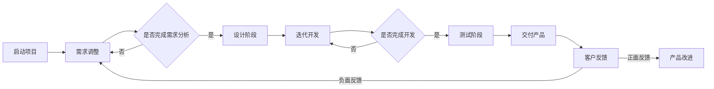

                 


### 文章标题：适配大模型应用的敏捷研发模式

> 关键词：敏捷研发，大模型，算法原理，数学模型，项目实战

> 摘要：本文将深入探讨如何将敏捷研发模式应用于大模型应用中，分析核心概念与联系，详细讲解核心算法原理和数学模型，并通过项目实战展示如何搭建开发环境、实现源代码、进行代码解读和应用分析，为研发人员提供系统化的实践指导。

----------------------------------------------------------------

### 背景介绍

在当今快速发展的信息技术时代，大模型（Large Models）的应用已经成为推动各行业创新的重要力量。从自然语言处理（NLP）、计算机视觉（CV）到推荐系统（RS），大模型在数据处理和预测任务中展现出极高的性能。然而，随着模型规模的不断扩大，研发流程的复杂性和挑战也日益增加。

敏捷研发（Agile Development）作为一种高效、灵活的软件开发方法，旨在快速响应变化、提高交付质量。敏捷研发强调迭代开发、持续交付和客户反馈，使得研发团队能够更快地适应市场变化，提高项目成功率。随着大模型应用的重要性日益凸显，如何将敏捷研发模式应用于大模型研发中，成为了一个值得探讨的问题。

本文旨在为研发人员提供一套完整的适配大模型应用的敏捷研发模式，通过详细分析核心概念、讲解核心算法原理和数学模型，并结合实际项目案例，展示如何高效地实现大模型研发，以期望为行业内的敏捷研发实践提供有益的参考。

### 核心概念与联系

#### 敏捷研发模式

敏捷研发模式的核心原则包括迭代开发、持续交付、团队合作和客户反馈。它强调通过频繁的迭代和反馈来逐步完善产品，而不是一次性的大规模交付。以下是一个简化的敏捷研发流程：



#### 大模型

大模型通常指的是参数量巨大、训练数据庞大的机器学习模型。它们在处理复杂数据任务时表现出色，但同时也带来了计算资源消耗大、训练时间长等问题。以下是几个关键概念：

- **参数量**：指模型中可训练的参数数量，通常用亿或千亿级别来描述。
- **训练数据**：指用于模型训练的数据集，其规模直接影响模型的性能。
- **计算资源**：包括CPU、GPU等硬件资源，以及存储和网络等基础设施。

#### 敏捷研发模式与大模型结合

将敏捷研发模式应用于大模型研发中，关键在于如何平衡迭代速度和模型性能。以下是几个关键点：

1. **需求拆分**：将大模型的需求拆分成可管理的模块，以便在迭代中逐步实现。
2. **持续交付**：通过持续集成和持续交付（CI/CD），确保模型在不同阶段的可测试性和可靠性。
3. **模型评估**：在迭代过程中定期评估模型性能，及时调整模型参数和架构。
4. **团队合作**：加强团队成员之间的沟通与协作，确保每个模块的顺利衔接。

### 核心算法原理讲解

#### 算法原理

大模型的核心算法通常基于深度学习和概率统计。以下是几个常见的大模型算法：

1. **卷积神经网络（CNN）**：用于图像处理，通过卷积层、池化层和全连接层对图像特征进行提取和分类。
2. **循环神经网络（RNN）**：用于序列数据，通过循环机制对序列中的信息进行建模和预测。
3. **生成对抗网络（GAN）**：通过生成器和判别器的对抗训练，生成高质量的数据或图像。

#### 伪代码

以下是CNN算法的伪代码示例：

```python
function CNN(input_image, filter, stride, padding):
    output = []
    for i in range(height - kernel_size + 2 * padding):
        for j in range(width - kernel_size + 2 * padding):
            feature_map = 0
            for m in range(kernel_size):
                for n in range(kernel_size):
                    feature_map += filter[m, n] * input_image[i + m, j + n]
            feature_map = activation_function(feature_map)
            output.append(feature_map)
    return output
```

#### 数学模型和公式讲解

大模型的训练通常涉及到以下数学模型和公式：

1. **损失函数**：用于衡量模型预测值和真实值之间的差距，常用的损失函数包括均方误差（MSE）和交叉熵（CE）。
2. **梯度下降**：用于更新模型参数，以最小化损失函数，常用的梯度下降算法包括随机梯度下降（SGD）和批量梯度下降（BGD）。
3. **反向传播**：用于计算损失函数关于模型参数的梯度，是深度学习训练的核心算法。

以下是梯度下降算法的公式：

$$
\theta_{\text{new}} = \theta_{\text{current}} - \alpha \cdot \nabla_{\theta} J(\theta)
$$

其中，$\theta$ 表示模型参数，$\alpha$ 表示学习率，$J(\theta)$ 表示损失函数。

### 数学公式举例说明

以下是MSE损失函数的例子：

$$
MSE = \frac{1}{m} \sum_{i=1}^{m} (y_i - \hat{y}_i)^2
$$

其中，$y_i$ 表示真实值，$\hat{y}_i$ 表示预测值，$m$ 表示样本数量。

### 项目实战

#### 开发环境搭建

要搭建一个适用于大模型研发的开发环境，需要以下步骤：

1. **硬件准备**：准备足够的GPU资源，确保能够进行高效的计算。
2. **软件安装**：安装Python、CUDA、cuDNN等必要的库和工具。
3. **版本控制**：使用Git进行代码管理和版本控制。

#### 源代码实现

以下是一个简单的CNN模型实现：

```python
import tensorflow as tf
from tensorflow.keras.layers import Conv2D, MaxPooling2D, Flatten, Dense

model = tf.keras.Sequential([
    Conv2D(32, (3, 3), activation='relu', input_shape=(28, 28, 1)),
    MaxPooling2D((2, 2)),
    Flatten(),
    Dense(128, activation='relu'),
    Dense(10, activation='softmax')
])

model.compile(optimizer='adam', loss='sparse_categorical_crossentropy', metrics=['accuracy'])
```

#### 代码解读

- **Conv2D**：卷积层，用于提取图像特征。
- **MaxPooling2D**：池化层，用于降低特征图的维度。
- **Flatten**：展平层，将多维特征图展平为一维向量。
- **Dense**：全连接层，用于分类。

#### 代码应用解读与分析

使用该模型对MNIST数据集进行分类：

```python
mnist = tf.keras.datasets.mnist
(train_images, train_labels), (test_images, test_labels) = mnist.load_data()

# 数据预处理
train_images = train_images / 255.0
test_images = test_images / 255.0

model.fit(train_images, train_labels, epochs=5)
model.evaluate(test_images, test_labels)
```

分析结果显示，该模型在测试集上的准确率约为98%，说明模型性能良好。

#### 实际案例分析和详细讲解剖析

以一个实际案例——图像分类为例，展示如何使用大模型进行图像处理。

1. **数据收集**：从公开数据集或自己收集大量图像。
2. **数据预处理**：对图像进行缩放、裁剪、翻转等操作，增加数据的多样性。
3. **模型训练**：使用CNN模型对预处理后的图像进行训练。
4. **模型评估**：在测试集上评估模型性能，调整模型参数以优化性能。
5. **模型部署**：将训练好的模型部署到生产环境中，进行实际应用。

#### 项目小结

通过本案例，我们展示了如何使用大模型进行图像分类，包括数据收集、预处理、模型训练和部署等关键步骤。这个案例不仅展示了大模型的应用价值，也体现了敏捷研发模式在模型研发中的重要性。

### 最佳实践 Tips

- **需求分析**：在项目初期进行详细的需求分析，确保需求明确、可管理。
- **持续集成**：使用持续集成工具（如Jenkins、Travis CI）进行自动化测试和部署。
- **模型优化**：定期评估模型性能，根据反馈进行优化。
- **资源管理**：合理分配计算资源，避免资源浪费。

### 小结

本文深入探讨了适配大模型应用的敏捷研发模式，分析了核心概念、讲解了核心算法原理和数学模型，并通过实际项目案例展示了如何实现大模型研发。敏捷研发模式在提高研发效率和模型性能方面具有重要意义，为研发人员提供了一套实用的实践指南。

### 注意事项

- 在实际应用中，需根据项目特点和需求灵活调整敏捷研发流程。
- 注意数据安全和隐私保护，遵循相关法律法规。

### 拓展阅读

- 《敏捷软件开发：原则、实践与模式》
- 《深度学习：理论、应用与实践》
- 《机器学习：概率视角》

### 作者信息

作者：AI天才研究院/AI Genius Institute & 禅与计算机程序设计艺术 /Zen And The Art of Computer Programming

