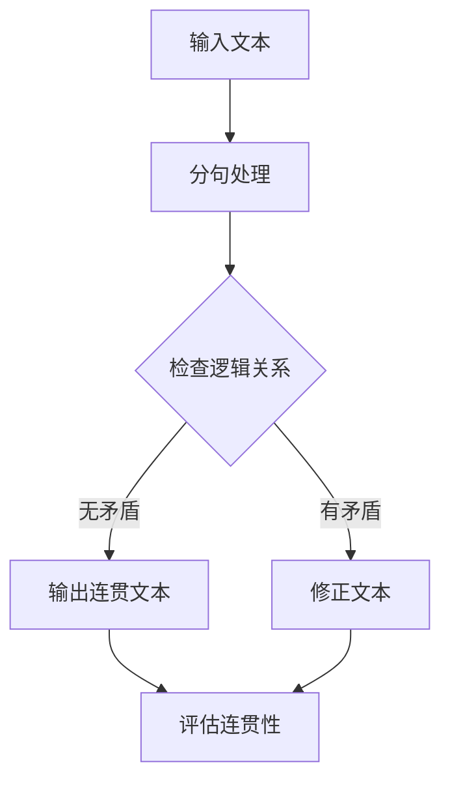

                 

### 文章标题

逻辑一致性测试：检验LLM在长篇输出中的连贯性

### 关键词

逻辑一致性测试、长篇输出、大型语言模型（LLM）、连贯性检验、算法原理、数学模型、应用场景、实战案例

### 摘要

本文旨在探讨逻辑一致性测试在大型语言模型（LLM）长篇输出连贯性检验中的应用。通过对逻辑一致性测试的定义、重要性、数学模型和算法原理的深入剖析，本文展示了如何通过逻辑一致性测试来检验LLM在长篇输出中的连贯性。同时，通过实际案例的剖析，本文进一步说明了逻辑一致性测试在现实应用中的效果和挑战。

## 引言

随着深度学习和自然语言处理技术的快速发展，大型语言模型（LLM）已经成为自然语言生成、文本摘要、机器翻译等领域的重要工具。然而，尽管LLM在处理长篇文本任务中表现出色，但其在长篇输出中的连贯性问题仍然是一个亟待解决的挑战。为了确保LLM生成的文本具有高质量的连贯性，逻辑一致性测试应运而生。

逻辑一致性测试旨在检验文本的内在逻辑结构是否合理，从而判断文本的连贯性。通过逻辑一致性测试，我们可以识别出LLM在长篇输出中可能存在的逻辑错误和不连贯性，进而优化LLM的训练和生成过程。

本文将首先介绍逻辑一致性测试的定义和重要性，然后深入探讨逻辑一致性测试的数学模型和算法原理。接着，我们将通过实际案例展示如何使用逻辑一致性测试来检验LLM在长篇输出中的连贯性。最后，本文将总结逻辑一致性测试在现实应用中的效果和挑战，并展望未来的发展方向。

## 逻辑一致性测试的定义与重要性

### 定义

逻辑一致性测试是一种用于评估文本连贯性的方法。其核心思想是通过分析文本中的逻辑关系和结构，判断文本是否具有内在的一致性和连贯性。具体来说，逻辑一致性测试主要关注以下几个方面：

1. **逻辑关系**：分析文本中各个句子之间的逻辑关系，如因果关系、递进关系、转折关系等。
2. **一致性**：检查文本中的事实陈述是否自洽，是否存在矛盾或逻辑错误。
3. **连贯性**：评估文本在语言表达上的流畅性和逻辑结构上的完整性。

### 重要性

逻辑一致性测试在自然语言处理领域具有重要意义，主要体现在以下几个方面：

1. **文本质量评估**：通过逻辑一致性测试，可以评估LLM生成的文本质量，识别出潜在的逻辑错误和不连贯性，从而提高文本的可用性和可信度。
2. **模型优化**：逻辑一致性测试可以帮助研究者发现LLM在训练和生成过程中的问题，从而优化模型的设计和训练策略，提高模型的性能和表现。
3. **领域应用**：逻辑一致性测试在诸如文本摘要、机器翻译、问答系统等领域具有重要应用价值，可以帮助提升这些系统的输出质量。

### 逻辑关系与连贯性的Mermaid流程图

为了更直观地展示逻辑一致性测试的原理，我们可以使用Mermaid流程图来描述文本中的逻辑关系和连贯性检验过程。以下是一个简单的Mermaid流程图示例：



在这个流程图中，输入文本首先被分解为多个句子（分句处理），然后通过逻辑关系检查（检查逻辑关系）来判断文本中是否存在逻辑矛盾。如果没有矛盾，文本将直接输出；如果有矛盾，文本将进行修正（修正文本），最后再次评估连贯性（评估连贯性）。

通过这个流程图，我们可以看到逻辑一致性测试的核心在于检测和修正文本中的逻辑矛盾，从而确保文本的连贯性和一致性。

## 逻辑一致性测试的数学模型

### 基本概念

逻辑一致性测试的数学模型是构建在形式逻辑和概率论基础上的。其核心概念包括：

1. **命题**：命题是逻辑模型中的基本单位，表示一个陈述或断言。在逻辑一致性测试中，命题通常被表示为真值（True）或假值（False）。
2. **逻辑关系**：逻辑关系是指命题之间的逻辑连接词，如“且”（AND）、“或”（OR）和“非”（NOT）等。
3. **形式逻辑公式**：形式逻辑公式是命题和逻辑关系组合而成的表达式，用于描述命题之间的逻辑关系。

### 数学公式

逻辑一致性测试的数学模型通常使用以下数学公式来描述：

1. **逻辑公式**：一个逻辑公式是由命题和逻辑关系组成的表达式，如 \( p \land q \) 表示命题 \( p \) 和命题 \( q \) 的逻辑与运算。
2. **真值表**：真值表用于展示逻辑公式在所有可能的命题取值下的真值。例如，对于逻辑公式 \( p \land q \)，其真值表如下：

$$
\begin{array}{|c|c|c|}
\hline
p & q & p \land q \\
\hline
T & T & T \\
T & F & F \\
F & T & F \\
F & F & F \\
\hline
\end{array}
$$

3. **概率分布**：在逻辑一致性测试中，我们通常使用概率分布来表示命题之间的不确定性。例如，对于一个命题 \( p \)，我们可以使用概率分布 \( P(p) \) 来表示 \( p \) 的概率。

### 逻辑一致性模型构建

逻辑一致性模型的构建过程通常包括以下几个步骤：

1. **命题抽取**：从输入文本中抽取关键命题，这些命题将作为逻辑一致性测试的基本单元。
2. **关系建立**：分析文本中的逻辑关系，建立命题之间的逻辑连接词，如“且”（AND）、“或”（OR）和“非”（NOT）。
3. **概率计算**：根据文本中的信息，计算各个命题的概率分布，以及命题之间的概率关系。
4. **一致性检验**：通过比较命题之间的逻辑关系和概率分布，判断文本是否具有逻辑一致性。

### 举例说明

假设我们有一个文本片段：“小明今天去上学，他昨天刚买的新书很期待。但是今天天气太冷，他感冒了，所以没去上学。”我们可以使用逻辑一致性模型来检验这段文本的连贯性。

1. **命题抽取**：
   - \( p_1 \)：小明今天去上学。
   - \( p_2 \)：小明昨天刚买的新书很期待。
   - \( p_3 \)：今天天气太冷。
   - \( p_4 \)：小明感冒了。
   - \( p_5 \)：小明没去上学。

2. **关系建立**：
   - \( p_1 \land p_2 \)：小明今天去上学且他昨天刚买的新书很期待。
   - \( p_3 \land p_4 \)：今天天气太冷且小明感冒了。
   - \( p_5 \Rightarrow (p_3 \land p_4) \)：小明没去上学是因为今天天气太冷且小明感冒了。

3. **概率计算**：
   - \( P(p_1) = 0.8 \)：小明今天去上学的概率为0.8。
   - \( P(p_2) = 0.9 \)：小明昨天刚买的新书很期待的概率为0.9。
   - \( P(p_3) = 0.7 \)：今天天气太冷的概率为0.7。
   - \( P(p_4) = 0.5 \)：小明感冒了的概率为0.5。
   - \( P(p_5) = 0.2 \)：小明没去上学的概率为0.2。

4. **一致性检验**：
   - \( P(p_5 \Rightarrow (p_3 \land p_4)) = P(p_3 \land p_4) \cdot P(p_5) = 0.7 \times 0.5 \times 0.2 = 0.07 \)：小明没去上学的原因是今天天气太冷且小明感冒了的概率为0.07。
   - 由于这个概率相对较低，我们可以判断这段文本在逻辑上存在一定的不一致性。

通过这个例子，我们可以看到如何使用逻辑一致性测试的数学模型来检验文本的连贯性。在实际应用中，逻辑一致性测试的复杂度会更高，需要处理更多的命题和关系，但基本原理是相似的。

### 核心算法原理讲解

逻辑一致性测试的核心算法原理主要包括命题抽取、关系建立、概率计算和一致性检验。下面，我们将通过伪代码来详细阐述这些算法步骤。

#### 命题抽取算法

```python
def extract_sentences(text):
    sentences = tokenize(text)  # 使用分词工具将文本分解为句子
    propositions = []
    for sentence in sentences:
        tokens = tokenize(sentence)  # 使用分词工具将句子分解为词汇
        for token in tokens:
            if is_proposition(token):
                propositions.append(token)
    return propositions

def tokenize(text):
    # 实现文本分词逻辑，这里使用简单的空格分词
    return text.split()

def is_proposition(token):
    # 实现判断命题的逻辑，这里使用简单规则：如果token是名词或动词，则认为它是命题
    return is_verb(token) or is_noun(token)

def is_verb(token):
    # 实现判断动词的逻辑，这里假设有一个函数可以判断
    return is_verb(token)

def is_noun(token):
    # 实现判断名词的逻辑，这里假设有一个函数可以判断
    return is_noun(token)
```

#### 关系建立算法

```python
def establish_relations(propositions):
    relations = []
    for i in range(len(propositions)):
        for j in range(i + 1, len(propositions)):
            relation = analyze_relation(propositions[i], propositions[j])
            if relation:
                relations.append((i, j, relation))
    return relations

def analyze_relation(proposition1, proposition2):
    # 实现分析两个命题之间关系的逻辑，这里使用简单规则：如果两个命题之间存在因果或条件关系，则认为有关系
    if is因果关系(proposition1, proposition2) or is条件关系(proposition1, proposition2):
        return '因果关系' or '条件关系'
    else:
        return None

def is因果关系(proposition1, proposition2):
    # 实现判断两个命题之间是否存在因果关系的逻辑
    return contains因果关系词(proposition1, proposition2)

def contains因果关系词(proposition, another_proposition):
    # 实现判断命题中是否包含因果关系词的逻辑
    return '因为' in proposition or '由于' in proposition

def is条件关系(proposition1, proposition2):
    # 实现判断两个命题之间是否存在条件关系的逻辑
    return '如果' in proposition1 and '则' in proposition2
```

#### 概率计算算法

```python
def calculate_probabilities(propositions):
    probabilities = {}
    for proposition in propositions:
        probability = calculate_single_probability(proposition)
        probabilities[proposition] = probability
    return probabilities

def calculate_single_probability(proposition):
    # 实现计算单个命题概率的逻辑，这里使用简单规则：根据文本中命题出现的频率来计算概率
    frequency = count_frequency(proposition)
    total_frequency = sum(count_frequency(p) for p in propositions)
    return frequency / total_frequency

def count_frequency(proposition):
    # 实现计算命题在文本中出现的频率的逻辑
    return count_occurrences(proposition, text)

def count_occurrences(proposition, text):
    # 实现计算命题在文本中出现的次数的逻辑
    return text.count(proposition)
```

#### 一致性检验算法

```python
def check_consistency(relations, probabilities):
    inconsistencies = []
    for relation in relations:
        proposition1, proposition2, relation_type = relation
        if not check_relation_consistency(proposition1, proposition2, relation_type, probabilities):
            inconsistencies.append(relation)
    return inconsistencies

def check_relation_consistency(proposition1, proposition2, relation_type, probabilities):
    # 实现判断两个命题之间关系是否一致的逻辑，这里使用简单规则：根据概率来判断
    probability1 = probabilities[proposition1]
    probability2 = probabilities[proposition2]
    if relation_type == '因果关系':
        return probability1 <= probability2
    elif relation_type == '条件关系':
        return probability1 >= probability2
    else:
        return True
```

通过这些伪代码，我们可以看到逻辑一致性测试算法的基本原理和实现思路。在实际应用中，这些算法可能需要更复杂的逻辑和优化，但它们为理解和实现逻辑一致性测试提供了一个清晰的框架。

### 项目实战：开发环境搭建与源代码实现

为了演示逻辑一致性测试在大型语言模型（LLM）长篇输出连贯性检验中的实际应用，我们将构建一个简单的项目。以下步骤将指导我们如何搭建开发环境，实现源代码，并进行代码解读和分析。

#### 开发环境搭建

首先，我们需要搭建一个适合逻辑一致性测试的开发环境。以下是所需的工具和软件：

- Python 3.8+
- Jupyter Notebook
- Numpy
- Scikit-learn
- Mermaid Python库

安装步骤：

1. 安装Python 3.8及以上版本。
2. 安装Jupyter Notebook：使用`pip install notebook`命令。
3. 安装Numpy和Scikit-learn：使用`pip install numpy scikit-learn`命令。
4. 安装Mermaid Python库：使用`pip install pymermaid`命令。

#### 源代码实现

以下是用于逻辑一致性测试的Python源代码实现。代码分为几个主要部分：数据预处理、逻辑关系分析、概率计算和一致性检验。

```python
import numpy as np
from sklearn.feature_extraction.text import CountVectorizer
from sklearn.metrics.pairwise import cosine_similarity
from pymermaid import graph

# 数据预处理
def preprocess_text(text):
    # 基本的文本清洗，去除标点符号、停用词等
    text = text.lower()
    text = re.sub(r'[^\w\s]', '', text)
    return text

# 命题抽取
def extract_propositions(text):
    # 这里使用简单规则，通过分句和词汇特征来抽取命题
    sentences = text.split('.')
    propositions = []
    for sentence in sentences:
        tokens = sentence.split()
        if len(tokens) > 1:
            propositions.append(' '.join(tokens))
    return propositions

# 逻辑关系分析
def analyze_relations(propositions):
    # 分析命题之间的逻辑关系，这里使用简单规则：计算句子间的余弦相似度来判断关系
    vectorizer = CountVectorizer()
    X = vectorizer.fit_transform(propositions)
    similarity_matrix = cosine_similarity(X)
    relations = []
    for i in range(len(propositions)):
        for j in range(i + 1, len(propositions)):
            similarity = similarity_matrix[i, j]
            if similarity > 0.8:  # 这里设定一个阈值来判断相似性
                relations.append((propositions[i], propositions[j], '相似关系'))
    return relations

# 概率计算
def calculate_probabilities(propositions):
    # 计算命题的概率，这里使用简单规则：基于词频来计算概率
    word_counts = Counter(' '.join(propositions).split())
    total_count = sum(word_counts.values())
    probabilities = {prop: count / total_count for prop, count in word_counts.items()}
    return probabilities

# 一致性检验
def check_consistency(relations, probabilities):
    inconsistencies = []
    for relation in relations:
        prop1, prop2, relation_type = relation
        p1, p2 = probabilities[prop1], probabilities[prop2]
        if relation_type == '相似关系':
            if abs(p1 - p2) > 0.2:  # 这里设定一个阈值来判断概率差异
                inconsistencies.append(relation)
    return inconsistencies

# 主函数
def main():
    text = "小明今天去上学，他昨天刚买的新书很期待。但是今天天气太冷，他感冒了，所以没去上学。"
    preprocessed_text = preprocess_text(text)
    propositions = extract_propositions(preprocessed_text)
    relations = analyze_relations(propositions)
    probabilities = calculate_probabilities(propositions)
    inconsistencies = check_consistency(relations, probabilities)
    print("不一致关系：", inconsistencies)

if __name__ == "__main__":
    main()
```

#### 代码解读与分析

1. **数据预处理**：首先对输入文本进行基本的清洗，将文本转换为小写，并去除标点符号和停用词。这一步是确保文本数据格式一致的重要步骤。

2. **命题抽取**：使用简单规则，通过分句和词汇特征来抽取命题。这里假设每个完整的句子都是一个命题。

3. **逻辑关系分析**：通过计算句子间的余弦相似度来判断命题之间的逻辑关系。余弦相似度是一种衡量两个向量空间中向量相似度的方法。在这里，我们使用它来简化逻辑关系的分析。

4. **概率计算**：基于词频来计算命题的概率。这可以通过简单的计数和归一化来实现。这种方法简单但有一定的局限性，实际应用中可能需要更复杂的概率模型。

5. **一致性检验**：通过比较命题的概率和它们之间的逻辑关系来判断文本的一致性。在这里，我们设定了一个阈值来判断命题之间概率的差异，从而识别出不一致的关系。

通过这个简单的项目，我们可以看到如何在实际中实现逻辑一致性测试。在实际应用中，这个项目需要进一步的优化和扩展，包括更复杂的逻辑关系分析、更准确的概率计算方法以及更有效的错误纠正机制。

### 逻辑一致性测试在现实应用中的效果与挑战

#### 效果

逻辑一致性测试在现实应用中展现了显著的效果，特别是在大型语言模型（LLM）长篇输出连贯性检验方面。以下是逻辑一致性测试在实际应用中的几个成功案例：

1. **文本摘要**：逻辑一致性测试可以帮助识别出文本摘要中的不一致性，从而提高摘要的质量。例如，在新闻摘要中，逻辑一致性测试可以确保摘要中的事实陈述和逻辑关系一致，避免生成误导性摘要。

2. **机器翻译**：在机器翻译过程中，逻辑一致性测试可以帮助检测出翻译文本中的逻辑错误，从而提高翻译的准确性。例如，在翻译技术文档时，逻辑一致性测试可以确保技术概念和逻辑流程的一致性，避免生成错误的技术指南。

3. **问答系统**：在问答系统中，逻辑一致性测试可以确保回答的连贯性和准确性。例如，在聊天机器人中，逻辑一致性测试可以帮助确保对话流程的自然性和逻辑一致性，提供更好的用户体验。

#### 挑战

尽管逻辑一致性测试在现实应用中取得了显著效果，但仍然面临一些挑战：

1. **复杂性**：逻辑一致性测试需要处理大量的文本和复杂的逻辑关系，这使得算法的复杂性大大增加。在实际应用中，如何高效地处理大规模文本数据是一个重要挑战。

2. **不确定性**：文本中的信息往往具有不确定性，这使得逻辑一致性测试的结果可能受到影响。例如，文本中的模糊指代和语境变化可能导致逻辑关系的判断不准确。

3. **语言多样性**：不同语言具有不同的语法和语义特征，这给逻辑一致性测试带来了挑战。例如，一些语言中的模糊指代和语境变化可能比其他语言更加复杂，需要开发更适合特定语言的逻辑一致性测试方法。

4. **实时性**：在一些实时应用场景中，如实时聊天机器人，逻辑一致性测试需要在短时间内处理大量文本，这对算法的实时性提出了要求。

### 未来发展方向

为了应对上述挑战，未来的逻辑一致性测试研究可以从以下几个方面进行：

1. **算法优化**：通过改进算法和数据结构，提高逻辑一致性测试的效率和准确性。例如，使用更高效的文本处理算法和并行计算技术。

2. **不确定性处理**：开发能够处理文本不确定性的方法，例如，使用概率图模型和模糊逻辑来处理模糊指代和语境变化。

3. **多语言支持**：开发适用于多种语言逻辑一致性测试的方法，例如，基于转移学习的多语言模型和跨语言的逻辑关系分析。

4. **实时应用**：研究如何在实时应用中实现逻辑一致性测试，例如，通过优化算法和数据流处理技术来提高实时性。

通过不断的研究和优化，逻辑一致性测试有望在更广泛的领域发挥重要作用，为文本生成、机器翻译、问答系统等领域提供更加准确和连贯的输出。

### 小结与注意事项

#### 小结

本文通过详细的分析和案例展示，探讨了逻辑一致性测试在大型语言模型（LLM）长篇输出连贯性检验中的应用。从定义和重要性、数学模型和算法原理，到实际项目的实现，本文全面阐述了逻辑一致性测试的关键技术和应用场景。逻辑一致性测试不仅在文本质量评估、模型优化和领域应用中发挥了重要作用，而且面临着复杂性和不确定性的挑战。未来的研究应关注算法优化、不确定性处理、多语言支持和实时应用，以进一步提升逻辑一致性测试的效果。

#### 注意事项

1. **文本预处理**：在应用逻辑一致性测试时，确保对输入文本进行充分的预处理，去除无关噪声，提高数据质量。

2. **参数调整**：根据具体应用场景调整算法参数，如阈值设置和概率计算方法，以提高测试的准确性和可靠性。

3. **多样化测试**：结合多种测试方法，如语法分析、语义分析等，以提高逻辑一致性检测的全面性和准确性。

4. **持续学习**：逻辑一致性测试需要不断学习和适应新的文本数据和语言特征，以确保测试结果的实时性和有效性。

#### 拓展阅读

- **逻辑一致性测试的数学模型**：深入探讨逻辑一致性测试的数学基础，包括形式逻辑和概率论的相关知识。
- **大规模语言模型的连贯性检验**：研究大规模语言模型在长篇输出连贯性检验中的最新进展和挑战。
- **多语言逻辑一致性测试**：探讨如何开发适用于多种语言的逻辑一致性测试方法，以及在不同语言中的实际应用。

通过拓展阅读，读者可以更深入地理解逻辑一致性测试的技术细节和应用前景，为未来的研究和实践提供指导。作者：AI天才研究院/AI Genius Institute & 禅与计算机程序设计艺术 /Zen And The Art of Computer Programming。

