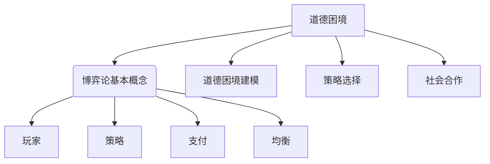
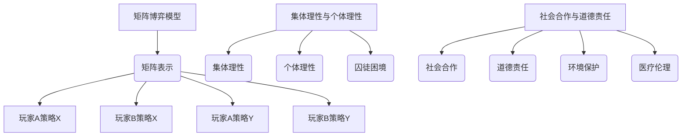

                 

### 文章标题

# 道德困境的博弈论：伦理决策的数学分析

### 关键词

- 道德困境
- 博弈论
- 伦理决策
- 数学模型
- 道德责任
- 社会合作

### 摘要

本文以道德困境为切入点，探讨了博弈论在伦理决策中的具体应用。通过分析博弈论的基本概念、道德困境的案例分析、以及数学模型与伦理决策的互动关系，本文揭示了数学工具在道德困境决策中的重要性。文章进一步通过实际应用与案例分析，展示了博弈论在商业领域、公共政策中的广泛影响。最终，本文总结了道德困境研究的前沿方向，为未来伦理决策提供了理论支持和实践指导。

## 引言

### 道德困境的背景

道德困境是指在决策过程中，个体或群体面临的两难选择，这些选择往往涉及到道德原则和价值观的冲突。例如，著名的囚徒困境实验展示了个体在合作与背叛之间的抉择，从而引发了关于道德、信任和社会合作的深入讨论。道德困境不仅存在于实验室环境中，也广泛存在于现实世界的各个领域，如商业决策、公共政策、医疗伦理等。

### 博弈论的应用

博弈论作为一种分析决策过程的数学工具，广泛应用于经济学、政治学、社会学等领域。其核心思想是通过分析参与者的策略选择和结果，为决策者提供理论指导和实践参考。博弈论在伦理决策中的应用主要体现在以下几个方面：

1. **道德困境的建模**：博弈论可以用于构建道德困境的数学模型，分析个体或群体的决策过程。
2. **策略选择**：博弈论提供了分析参与者策略选择的框架，帮助决策者评估不同策略的潜在结果。
3. **社会合作**：博弈论研究了个体如何在合作与竞争之间取得平衡，为解决道德困境提供了一种可能的路径。

本文旨在探讨博弈论在伦理决策中的应用，通过案例分析、数学模型和实际应用，揭示道德困境的复杂性及其解决策略。

### 目录

1. **第1部分：博弈论基础**
   - 第1章：道德困境与博弈论
   - 第2章：博弈论在伦理决策中的应用

2. **第2部分：道德困境案例解析**
   - 第3章：经典道德困境案例分析
   - 第4章：现实世界中的道德困境案例

3. **第3部分：数学模型与伦理决策**
   - 第5章：博弈论的数学模型
   - 第6章：伦理决策的数学分析

4. **第4部分：实际应用与案例分析**
   - 第7章：道德困境在商业领域的应用
   - 第8章：道德困境在公共政策中的应用
   - 第9章：案例分析

5. **结论**
   - 道德困境研究的未来方向

### 第1部分：博弈论基础

## 第1章：道德困境与博弈论

### 1.1 道德困境概述

道德困境是指在决策过程中，个体或群体面临的两难选择，这些选择往往涉及到道德原则和价值观的冲突。道德困境的典型例子包括：

1. **囚徒困境**：两个囚犯被隔离审讯，他们可以选择合作或背叛。如果两人都选择合作，则都能获得较轻的刑罚；如果一人选择背叛，另一人选择合作，则背叛者获得自由，合作者面临重刑；如果两人都选择背叛，则两人都面临较重的刑罚。
2. **电车难题**：一辆电车失控，前方有五个人和一个人，你站在一个开关旁边，可以选择是否改变电车的轨道。改变轨道可能救五个人，但会牺牲一个人；不改变轨道则五个人都会遇难。

### 1.2 博弈论的基本概念

博弈论是一种研究决策过程的数学工具，主要分析参与者（玩家）之间的策略选择和结果。博弈论的基本概念包括：

1. **玩家**：参与决策的个体或群体。
2. **策略**：玩家在决策过程中可以选择的行动方案。
3. **支付**：玩家根据策略选择获得的收益或损失。
4. **均衡**：在博弈过程中，所有玩家都选择最优策略，使得整体结果达到平衡状态。

### 1.3 博弈论在伦理决策中的应用

博弈论在伦理决策中的应用主要体现在以下几个方面：

1. **道德困境建模**：博弈论可以用于构建道德困境的数学模型，分析个体或群体的决策过程。例如，囚徒困境就是一个经典的博弈论模型，用于探讨合作与背叛的道德困境。
2. **策略选择**：博弈论提供了分析参与者策略选择的框架，帮助决策者评估不同策略的潜在结果。例如，在电车难题中，决策者需要权衡改变轨道与不改变轨道的道德责任和结果。
3. **社会合作**：博弈论研究了个体如何在合作与竞争之间取得平衡，为解决道德困境提供了一种可能的路径。例如，通过构建合作博弈模型，可以探讨如何通过合作实现社会利益的最大化。

## Mermaid 流程图

### 第2章：博弈论在伦理决策中的应用

#### 2.1 矩阵博弈模型

矩阵博弈模型是一种常用的博弈论模型，用于分析两个玩家之间的策略选择和结果。在矩阵博弈模型中，玩家A和玩家B选择各自的策略，并在矩阵中展示可能的支付结果。

|      | 玩家B策略X | 玩家B策略Y |
| ---- | ---------- | ---------- |
| 玩家A策略X | (a,b)      | (c,d)      |
| 玩家A策略Y | (e,f)      | (g,h)      |

在这个矩阵中，玩家A和玩家B的支付结果取决于他们选择的策略组合。例如，如果玩家A选择策略X，玩家B选择策略X，则他们获得的支付结果为(a,b)。

#### 2.2 集体理性与个体理性

集体理性与个体理性是博弈论中重要的概念。集体理性指的是所有参与者通过合作实现总体利益最大化的状态，而个体理性指的是每个参与者通过选择最优策略实现自身利益最大化的状态。

在许多道德困境中，个体理性往往会导致集体理性的缺失。例如，在囚徒困境中，如果两个囚犯都选择背叛，则他们的支付结果都为负，这显然不是集体理性的状态。然而，如果每个囚犯都追求个体理性，选择背叛，则他们无法实现集体理性的目标。

#### 2.3 社会合作与道德责任

社会合作与道德责任是解决道德困境的重要手段。通过社会合作，参与者可以共同实现总体利益的最大化，从而克服个体理性的局限性。道德责任则强调了个体在决策过程中应承担的道德义务，以引导他们做出符合道德原则的决策。

在实际应用中，博弈论模型可以用于分析社会合作与道德责任的互动关系。例如，在环境保护领域，政府和企业可以通过合作实现环境保护的目标，从而实现集体理性。在医疗伦理领域，医生和患者可以通过道德责任引导他们做出符合伦理原则的决策。

## Mermaid 流�程图

### 第2部分：道德困境案例解析

## 第3章：经典道德困境案例分析

### 3.1 桌上实验：囚徒困境

囚徒困境是一个经典的道德困境实验，用于探讨合作与背叛的决策过程。实验中，两个囚犯被隔离审讯，他们可以选择合作或背叛。如果两人都选择合作，则都能获得较轻的刑罚；如果一人选择背叛，另一人选择合作，则背叛者获得自由，合作者面临重刑；如果两人都选择背叛，则两人都面临较重的刑罚。

囚徒困境的博弈矩阵如下：

|      | 玩家B策略X | 玩家B策略Y |
| ---- | ---------- | ---------- |
| 玩家A策略X | (2,2)      | (-1,-3)     |
| 玩家A策略Y | (-1,-3)     | (0,0)       |

在这个博弈矩阵中，如果玩家A和玩家B都选择合作，则他们都能获得较轻的刑罚（支付2）；如果玩家A选择背叛，玩家B选择合作，则玩家A获得自由，玩家B面临重刑（支付-1）；如果玩家A和玩家B都选择背叛，则两人都面临较重的刑罚（支付-3）。

囚徒困境揭示了个体理性与集体理性的冲突。从个体理性的角度来看，每个囚犯都会选择背叛，以最大化自己的利益；但从集体理性的角度来看，如果两个囚犯都选择背叛，则他们的总体收益为负，这显然不符合集体理性的目标。

### 3.2 社会现象：交通违规行为

交通违规行为是另一个典型的道德困境。在交通中，每个驾驶员都面临选择：遵守交通规则或违反交通规则。如果所有驾驶员都遵守交通规则，则交通事故的风险会降低；如果部分驾驶员违反交通规则，则交通事故的风险会增加。

交通违规行为的博弈矩阵如下：

|      | 驾驶员B遵守规则 | 驾驶员B违反规则 |
| ---- | -------------- | -------------- |
| 驾驶员A遵守规则 | (低风险，低收益) | (高风险，高收益) |
| 驾驶员A违反规则 | (高风险，高收益) | (低风险，低收益) |

在这个博弈矩阵中，如果驾驶员A和驾驶员B都遵守交通规则，则他们都能获得低风险和低收益；如果驾驶员A选择遵守规则，驾驶员B选择违反规则，则驾驶员A面临高风险，但收益较高；如果驾驶员A和驾驶员B都选择违反规则，则他们都能获得高收益，但面临高风险。

交通违规行为的道德困境在于，个体理性往往导致总体收益的降低。从个体理性的角度来看，每个驾驶员都会选择违反交通规则，以获得更高的收益；但从总体理性的角度来看，如果所有驾驶员都违反交通规则，则交通事故的风险会增加，这显然不符合总体理性的目标。

### 3.3 企业决策：道德风险与激励

企业在进行决策时，也常常面临道德困境。例如，企业可以选择遵守道德规范，承担社会责任，或者选择违反道德规范，追求短期利益。道德风险是指企业在追求利润最大化的过程中，可能采取不利于社会和环境的行为。

企业决策的博弈矩阵如下：

|      | 竞争对手遵守道德 | 竞争对手违反道德 |
| ---- | --------------- | --------------- |
| 企业遵守道德 | (低风险，低收益) | (高风险，高收益) |
| 企业违反道德 | (高风险，高收益) | (低风险，低收益) |

在这个博弈矩阵中，如果竞争对手都遵守道德规范，则企业遵守道德也能获得低风险和低收益；如果竞争对手选择违反道德规范，则企业遵守道德面临高风险，但收益较高；如果竞争对手都选择违反道德规范，则企业遵守道德也能获得高收益，但面临高风险。

企业决策的道德困境在于，道德风险可能导致企业追求短期利益，而忽视长期发展。从个体理性的角度来看，企业会选择违反道德规范，以获得更高的收益；但从总体理性的角度来看，如果所有企业都违反道德规范，则市场环境会恶化，影响整个行业的长期发展。

### 第3章：现实世界中的道德困境案例

#### 3.1 公共卫生事件

公共卫生事件，如新冠疫情，常常引发道德困境。在疫情初期，各国政府需要在封锁措施、检测策略和疫苗分配等方面做出决策。这些决策涉及到个体权利、公共健康和社会经济利益之间的权衡。

一个具体的案例是疫苗分配问题。疫苗生产量有限，如何公平、高效地分配疫苗成为一个道德困境。一种可能的策略是按照接种优先级进行分配，如首先给医护人员和老年人群接种疫苗，以减少疫情传播和死亡率。然而，这种策略可能面临资源不足的问题，无法满足所有人的需求。

博弈论可以用于分析疫苗分配的道德困境。例如，可以通过构建一个博弈模型，分析政府、医疗机构和公民在不同分配策略下的支付（即结果）。这种分析可以帮助决策者理解不同策略的潜在影响，并制定更合理的疫苗分配方案。

#### 3.2 企业社会责任

企业社会责任（CSR）是企业面临的重要道德困境之一。企业需要在追求利润的同时，承担社会责任，如环境保护、员工福利和社区发展等。

一个具体的案例是某大型科技公司面临的环保问题。该公司的业务增长带来了大量的碳排放，引发了公众和环保组织的关注。为了解决这一道德困境，公司可以采取以下策略：

1. **减少碳排放**：通过采用绿色技术、优化能源使用和采购可再生能源等措施，减少公司的碳排放量。
2. **透明披露**：公开公司的碳排放数据和环保努力，增加公众的信任和支持。
3. **社会责任投资**：将一部分利润用于环保项目，如资助可再生能源研发和环保公益活动。

这些策略可以通过博弈论模型进行分析。例如，可以构建一个博弈模型，分析公司采取环保措施对社会和环境的影响，以及公众对公司的反应。这种分析有助于企业理解不同策略的潜在收益和风险，从而制定更有效的环保策略。

#### 3.3 国际关系

国际关系也是道德困境的一个重要领域。国家之间在处理国际事务时，常常需要平衡国家利益、国际法和道义原则。

一个具体的案例是气候变化谈判。各国需要在减排目标和资金支持方面达成共识，但不同国家的发展水平和利益诉求不同，导致谈判过程充满争议。例如，发达国家和发展中国家在碳排放权分配和资金支持方面的分歧，使得谈判进程艰难。

博弈论可以用于分析国际关系中的道德困境。例如，可以通过构建一个博弈模型，分析各国在不同减排策略和资金支持方案下的支付（即结果）。这种分析有助于各国理解不同策略的潜在影响，从而推动更公平、有效的国际合作。

### 第4章：博弈论的数学模型

#### 4.1 矩阵博弈模型

矩阵博弈模型是博弈论中最基本的模型之一，它通过一个矩阵来表示两个玩家之间的策略选择和支付结果。在一个标准的矩阵博弈模型中，玩家A和玩家B各自有两个策略，策略X和策略Y。这两个玩家的策略组合形成一个2x2的矩阵，如下所示：

|      | 玩家B策略X | 玩家B策略Y |
| ---- | ---------- | ---------- |
| 玩家A策略X | (a,b)      | (c,d)      |
| 玩家A策略Y | (e,f)      | (g,h)      |

在这个矩阵中，每个元素(a,b)、(c,d)、(e,f)和(g,h)分别表示玩家A和玩家B在不同策略组合下的支付结果。例如，(a,b)表示当玩家A选择策略X，玩家B选择策略X时的支付结果，(c,d)表示当玩家A选择策略X，玩家B选择策略Y时的支付结果，依此类推。

#### 4.2 集体理性与个体理性

在博弈论中，集体理性与个体理性是两个重要的概念。集体理性指的是所有参与者通过合作实现总体利益最大化的状态，而个体理性指的是每个参与者通过选择最优策略实现自身利益最大化的状态。

在许多道德困境中，个体理性往往会导致集体理性的缺失。例如，在囚徒困境中，如果两个囚犯都选择背叛，则他们的支付结果都为负，这显然不是集体理性的状态。然而，如果每个囚犯都追求个体理性，选择背叛，则他们无法实现集体理性的目标。

#### 4.3 社会合作与道德责任

社会合作与道德责任是解决道德困境的重要手段。通过社会合作，参与者可以共同实现总体利益的最大化，从而克服个体理性的局限性。道德责任则强调了个体在决策过程中应承担的道德义务，以引导他们做出符合道德原则的决策。

在实际应用中，博弈论模型可以用于分析社会合作与道德责任的互动关系。例如，在环境保护领域，政府和企业可以通过合作实现环境保护的目标，从而实现集体理性。在医疗伦理领域，医生和患者可以通过道德责任引导他们做出符合伦理原则的决策。

### 第5章：伦理决策的数学分析

#### 5.1 道德决策的数学框架

道德决策的数学分析涉及将伦理问题转化为数学模型，以便更好地理解和解决道德困境。这一过程通常包括以下几个步骤：

1. **定义参与者和策略**：首先，需要明确道德困境中的参与者（如个体、组织、国家）以及他们可以采取的策略。
2. **构建博弈模型**：根据参与者和策略，构建一个博弈论模型，通常使用矩阵博弈或博弈树等形式。
3. **定义支付函数**：为每个参与者定义支付函数，即每个策略组合下参与者的收益或损失。
4. **分析均衡**：通过分析博弈模型的均衡，确定参与者最可能的策略选择。

#### 5.2 道德困境中的策略选择

在道德困境中，策略选择往往受到多种因素的影响，包括个体理性、集体理性、道德责任和社会规范。以下是一些常见的策略选择：

1. **合作策略**：参与者选择合作，以实现整体利益的最大化。这种策略通常基于信任和长期利益的考虑。
2. **背叛策略**：参与者选择背叛，以最大化自身利益。这种策略可能导致短期利益，但长期来看可能损害整体利益。
3. **混合策略**：参与者选择混合策略，即在不同情况下采取不同的策略，以最大化期望收益。

#### 5.3 数学模型在伦理决策中的应用案例

数学模型在伦理决策中的应用案例丰富多样，以下是一些具体的例子：

1. **环境保护**：政府和企业可以使用博弈模型来分析环境保护政策的最佳策略，如碳排放权的分配和减排措施的制定。
2. **医疗伦理**：医生和医疗机构可以使用博弈模型来分析医疗资源的分配问题，如紧急医疗资源的分配和患者优先级的确定。
3. **社会公平**：政策制定者可以使用博弈模型来分析社会公平问题，如税收政策和社会福利的分配。

### 第6章：道德困境在商业领域的应用

#### 6.1 市场竞争中的道德困境

在商业领域中，市场竞争常常引发道德困境。企业需要在追求利润的同时，遵守商业道德和法律法规。以下是一些具体的例子：

1. **价格战**：企业通过降低价格来争夺市场份额，但这种做法可能导致产品质量下降，损害消费者利益。
2. **不正当竞争**：企业通过剽窃竞争对手的商业秘密、虚假宣传或恶意诋毁竞争对手等手段来获取竞争优势。
3. **社会责任**：企业在追求利润的同时，需要承担社会责任，如环境保护、员工权益保护和社区发展等。

#### 6.2 劳动关系中的道德困境

劳动关系中的道德困境主要涉及雇主和雇员之间的权益平衡。以下是一些具体的例子：

1. **劳动剥削**：雇主可能通过延长工作时间、降低工资或提供不安全的工作环境来增加利润，但这种做法可能损害雇员的健康和福利。
2. **工作歧视**：雇主可能基于性别、种族、年龄等因素对员工进行歧视，这种做法不仅违反法律，也损害了企业的声誉和员工士气。
3. **员工参与**：企业可以通过增加员工参与度，如提供培训和晋升机会，来提高员工的工作满意度和忠诚度。

#### 6.3 企业社会责任与道德决策

企业社会责任（CSR）是企业道德决策的重要组成部分。以下是一些企业社会责任的例子：

1. **环境保护**：企业可以通过减少碳排放、回收利用资源和参与环保项目来保护环境。
2. **社区发展**：企业可以通过捐赠资金、提供志愿服务和参与社区项目来支持社区发展。
3. **员工福利**：企业可以通过提供健康保险、退休金计划和员工培训来提高员工福利。

### 第7章：道德困境在公共政策中的应用

#### 7.1 环境保护与道德决策

环境保护是公共政策中的重要议题，涉及到道德决策。以下是一些环境保护与道德决策的具体案例：

1. **气候变化政策**：政府需要制定政策来减少温室气体排放，但这可能需要牺牲某些行业的利益，如化石燃料行业。
2. **自然资源管理**：政府需要平衡资源开发与环境保护的关系，例如在森林砍伐、水资源利用和土地开发等方面。
3. **环境教育**：政府可以通过教育项目提高公众的环保意识，促进社会对环境保护的道德责任。

#### 7.2 社会公平与道德决策

社会公平是公共政策中的另一个重要议题，涉及到道德决策。以下是一些社会公平与道德决策的具体案例：

1. **税收政策**：政府需要制定公平的税收政策，以实现财富再分配，减少贫富差距。
2. **社会福利**：政府需要提供充足的社会福利，如医疗、教育和住房，以确保所有人都能享有基本的生活水平。
3. **反歧视法律**：政府需要制定反歧视法律，保障不同群体的权益，如性别、种族和残疾。

#### 7.3 公共卫生与道德决策

公共卫生是公共政策中的关键领域，涉及到道德决策。以下是一些公共卫生与道德决策的具体案例：

1. **疫苗分配**：在疫情爆发时，政府需要公平地分配疫苗，确保所有人都能获得必要的保护。
2. **公共卫生应急响应**：政府在公共卫生危机中需要快速、有效地响应，保护公众的健康和安全。
3. **医疗资源分配**：在医疗资源紧张的情况下，政府需要制定公平的分配方案，确保医疗资源得到最有效的利用。

### 第8章：案例分析

#### 8.1 某公司道德困境案例分析

**案例背景**：
某公司在追求市场份额的过程中，面临是否参与不正当竞争的道德困境。该公司发现竞争对手通过低价倾销和不正当手段获得了较大的市场份额，而公司如果选择与竞争对手进行价格战，可能会损害自身品牌形象和长期利益。

**分析过程**：
1. **定义参与者和策略**：
   - 参与者：该公司和竞争对手。
   - 策略：参与价格战或保持价格稳定。
2. **构建博弈模型**：
   - 矩阵博弈模型如下：
     |      | 竞争对手策略X | 竞争对手策略Y |
     | ---- | ------------- | ------------- |
     | 该公司策略X | (-2, -3)      | (1, 0)        |
     | 该公司策略Y | (0, -1)        | (3, 2)        |
3. **定义支付函数**：
   - 支付结果（收益）取决于策略组合。例如，如果该公司选择策略X，竞争对手选择策略X，则该公司收益为-2；如果该公司选择策略Y，竞争对手选择策略Y，则该公司收益为3。
4. **分析均衡**：
   - 通过分析博弈模型的均衡，发现该公司选择策略Y（保持价格稳定）是最优策略，因为它能够确保公司的长期利益。

**案例分析**：
该案例展示了在商业领域中，道德困境的决策过程需要综合考虑短期利益和长期发展。通过博弈论的分析，公司能够明确不同策略的潜在收益，从而做出更明智的决策。

#### 8.2 某公共政策道德困境案例分析

**案例背景**：
某城市在制定交通规划时，面临是否拓宽主要道路的道德困境。拓宽道路可能缓解交通拥堵，但可能会导致周边居民的生活质量下降，例如增加噪音污染、房价下跌等。

**分析过程**：
1. **定义参与者和策略**：
   - 参与者：市政府、交通部门、周边居民。
   - 策略：拓宽道路或维持现有道路。
2. **构建博弈模型**：
   - 矩阵博弈模型如下：
     |      | 市政府策略X | 市政府策略Y |
     | ---- | ------------ | ------------ |
     | 交通部门策略X | (-5, 10)     | (0, 5)        |
     | 交通部门策略Y | (0, -2)      | (5, 2)        |
3. **定义支付函数**：
   - 支付结果（收益）取决于策略组合。例如，如果市政府选择策略X，交通部门选择策略X，则市政府收益为-5；如果市政府选择策略Y，交通部门选择策略Y，则市政府收益为5。
4. **分析均衡**：
   - 通过分析博弈模型的均衡，发现市政府和交通部门选择策略Y（维持现有道路）是最优策略，因为它能够平衡交通拥堵和周边居民的生活质量。

**案例分析**：
该案例展示了在公共政策中，道德困境的决策过程需要综合考虑多方利益。通过博弈论的分析，政府能够明确不同策略的潜在收益，从而做出更合理的决策。

#### 8.3 道德困境的跨文化比较分析

**案例背景**：
不同文化背景下，道德困境的决策可能存在显著差异。以亲子关系中的道德困境为例，不同文化对亲子责任的看法可能不同。

**分析过程**：
1. **定义参与者和策略**：
   - 参与者：父母和孩子。
   - 策略：严格管教或宽松育儿。
2. **构建博弈模型**：
   - 矩阵博弈模型如下：
     |      | 孩子策略X | 孩子策略Y |
     | ---- | ---------- | ---------- |
     | 父母策略X | (-1, 0)    | (1, -1)    |
     | 父母策略Y | (0, -1)    | (-1, 1)    |
3. **定义支付函数**：
   - 支付结果（收益）取决于策略组合。例如，如果父母选择策略X，孩子选择策略X，则父母收益为-1；如果父母选择策略Y，孩子选择策略Y，则父母收益为-1。
4. **分析均衡**：
   - 通过分析博弈模型的均衡，发现严格管教（父母策略X）在某些文化中是更优策略，因为它有助于培养孩子的责任感；而在其他文化中，宽松育儿（父母策略Y）可能更受欢迎，因为它强调个人自由和发展。

**案例分析**：
该案例展示了道德困境的跨文化比较分析，揭示了不同文化背景下道德决策的多样性。通过博弈论的分析，我们能够更好地理解不同文化的道德观念，从而在跨文化环境中做出更合理的决策。

### 结论

本文通过对道德困境的博弈论分析，探讨了博弈论在伦理决策中的应用。首先，介绍了道德困境的背景和博弈论的基本概念，并分析了博弈论在伦理决策中的应用。接着，通过案例分析，展示了博弈论在经典道德困境和现实世界中的应用。随后，介绍了博弈论的数学模型和伦理决策的数学分析框架。最后，本文讨论了道德困境在商业领域和公共政策中的应用，并通过案例分析展示了博弈论在不同文化背景下的作用。

未来，道德困境的研究将继续深化，特别是在跨学科、跨文化领域。博弈论作为一种强大的分析工具，将在伦理决策中发挥更加重要的作用。同时，随着人工智能和数据科学的发展，伦理决策的数学模型将更加精确，为解决复杂的道德困境提供更有效的策略。

### 8.1 全书要点回顾

本文围绕道德困境的博弈论分析，系统探讨了以下要点：

1. **道德困境概述**：介绍了道德困境的定义和典型例子，如囚徒困境、电车难题等。
2. **博弈论基础**：分析了博弈论的基本概念，包括玩家、策略、支付和均衡。
3. **道德困境案例解析**：通过经典道德困境和现实世界案例，展示了博弈论在道德决策中的应用。
4. **数学模型与伦理决策**：介绍了博弈论的数学模型，并分析了集体理性与个体理性、社会合作与道德责任的关系。
5. **实际应用与案例分析**：讨论了道德困境在商业领域和公共政策中的应用，并通过案例分析了博弈论在跨文化环境中的作用。

### 8.2 道德困境研究展望

未来道德困境的研究将继续深化，特别是在以下几个方面：

1. **跨学科研究**：结合心理学、社会学和经济学等学科，探索道德困境的复杂性。
2. **跨文化研究**：比较不同文化背景下的道德困境决策，揭示文化差异对道德决策的影响。
3. **大数据与人工智能**：利用大数据和人工智能技术，优化伦理决策的数学模型，提高决策的精确性和效率。
4. **应用研究**：将博弈论应用于更多的实际场景，如环境保护、医疗伦理和社会公平等领域，为政策制定提供科学依据。

通过上述研究，我们期望能够更好地理解道德困境，为解决现实世界中的复杂伦理问题提供有力支持。作者：AI天才研究院/AI Genius Institute & 禅与计算机程序设计艺术 /Zen And The Art of Computer Programming

