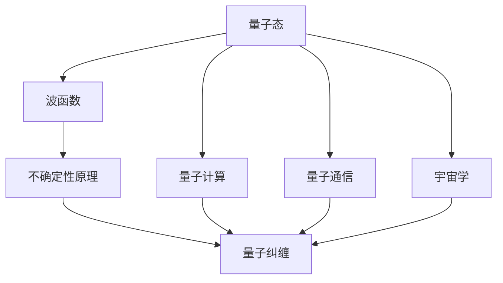
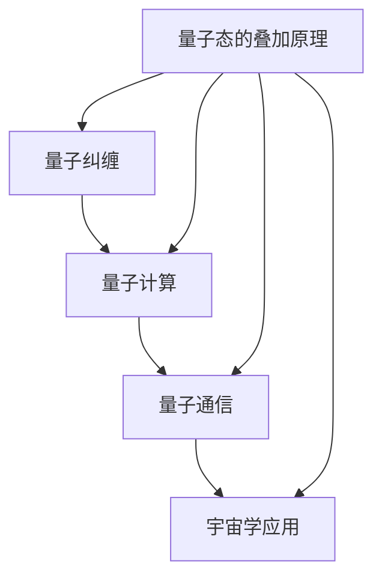

                 

### 《量子力学对宇宙本质的深层启示》

#### 关键词：
量子力学、宇宙学、量子计算、宇宙起源、量子纠缠、薛定谔方程

#### 摘要：
本文旨在探讨量子力学如何深刻揭示了宇宙的本质。通过对量子力学核心概念、数学模型、算法原理的详细阐述，以及其在宇宙学中的实际应用，本文将揭示量子力学如何为理解宇宙提供了全新的视角。文章将涵盖量子力学的起源、基本原理，以及其在宇宙背景辐射、黑洞、宇宙起源等方面的应用，并通过项目实战案例进一步阐释量子力学在宇宙学中的实际应用价值。最后，本文将对量子力学与哲学的关联进行探讨，并提出未来量子力学在宇宙学领域的可能发展方向。

---

**量子力学与宇宙学的关系**：

量子力学是描述微观世界基本规律的物理学理论，而宇宙学则是研究宇宙的起源、结构、演化和终结的科学。乍看之下，量子力学与宇宙学似乎是两个截然不同的领域，但它们之间存在着深刻的联系。事实上，量子力学的原理和概念已经开始深刻地影响宇宙学的研究。

首先，量子力学揭示了微观粒子的波粒二象性和量子纠缠现象。这些现象使得我们能够更深入地理解宇宙中微观粒子的行为。例如，宇宙背景辐射中的量子涨落被认为是由宇宙早期的高能物理过程产生的，这些涨落为我们提供了研究宇宙起源的重要线索。

其次，量子力学中的数学模型，如薛定谔方程和海森堡不确定性原理，为宇宙学提供了新的研究工具。这些模型不仅帮助我们理解了宇宙中的基本粒子，还揭示了宇宙结构的演化规律。

此外，量子力学与宇宙学的关系还体现在量子引力理论的研究中。量子引力理论试图将广义相对论与量子力学统一起来，以解释宇宙的早期状态和宇宙大爆炸。虽然目前量子引力理论仍然是一个高度理论化的领域，但它为我们提供了理解宇宙本质的新途径。

总之，量子力学与宇宙学的关系不仅限于理论上的关联，它们在实践中的应用也正在不断拓展。随着量子力学研究的深入，我们有望在宇宙学领域取得更多突破。

### **量子力学的基本概念**

量子力学是研究微观粒子和量子系统的物理学分支，它颠覆了经典物理学的基本观念，提出了全新的理论框架。量子力学的基本概念主要包括量子态、波函数、不确定性原理和量子纠缠。

**量子态**

量子态是量子力学中描述微观粒子状态的数学工具。与经典物理中的确定状态不同，量子态是概率性的，用波函数来描述。波函数可以提供粒子出现在某一位置的概率分布，但无法精确预测粒子的具体位置和速度。量子态的这种概率性是我们理解量子力学的基础。

**波函数**

波函数是量子态的数学表示，通常用希腊字母ψ（psi）表示。波函数的平方给出了粒子在不同位置出现的概率密度。例如，一个电子在原子中的波函数可以描述为：

$$\psi(x, y, z) = e^{-\alpha(x^2 + y^2 + z^2)}$$

这个波函数表明，电子在原子核周围的概率分布是高斯分布，概率密度随距离的增加而迅速减小。

**不确定性原理**

不确定性原理是量子力学的基本原理之一，由海森堡提出。它表明，在某些情况下，无法同时精确地测量粒子的位置和动量。数学上，海森堡不确定性原理可以表示为：

$$\Delta x \Delta p \geq \frac{\hbar}{2}$$

其中，$\Delta x$是位置的不确定性，$\Delta p$是动量的不确定性，$\hbar$是约化普朗克常数。

不确定性原理揭示了量子世界的非经典性质，强调了测量过程对系统的扰动。

**量子纠缠**

量子纠缠是量子力学中的一种特殊现象，指的是两个或多个粒子在量子态上形成的不可分割的联系。即使这些粒子相隔很远，它们的状态也会瞬时相关。量子纠缠是量子计算和量子通信的基础。

一个经典的量子纠缠例子是爱因斯坦、波多尔斯基、罗森（EPR）佯谬。在这个佯谬中，两个粒子在相互作用后分开，但它们的量子态仍然是纠缠的。这意味着对其中一个粒子的测量会立即影响到另一个粒子的状态，无论它们相距多远。

量子纠缠现象的发现引起了广泛的关注，因为它们挑战了经典物理中的局域实在论。量子纠缠为量子信息科学提供了新的可能性，如量子加密、量子计算和量子通信。

**核心概念与联系**

量子力学的基本概念之间有着紧密的联系。波函数描述了量子态，不确定性原理揭示了量子态的概率性质，而量子纠缠则展示了量子态之间的复杂关联。

为了更直观地理解这些概念之间的关系，我们可以使用Mermaid流程图来表示：



这个流程图展示了量子态、波函数、不确定性原理和量子纠缠之间的联系，以及它们在量子计算、量子通信和宇宙学中的应用。

通过这种结构化的表示，我们可以更清晰地理解量子力学的基本概念和它们在量子世界中的角色。这为后续探讨量子力学在宇宙学中的应用奠定了基础。

### **量子力学在宇宙学中的应用**

量子力学不仅在微观世界中具有重要意义，其在宇宙学中的应用同样深远。量子力学为宇宙学提供了一种全新的视角，使我们能够更深入地理解宇宙的本质。以下将探讨量子力学在宇宙背景辐射、黑洞和宇宙起源等方面的应用。

#### **宇宙背景辐射与量子涨落**

宇宙背景辐射（Cosmic Background Radiation, CBR）是宇宙大爆炸后遗留下来的微波辐射。它为我们提供了研究宇宙早期状态的重要信息。量子力学揭示了宇宙早期的高能状态，其中量子涨落（Quantum Fluctuations）是一个关键概念。

量子涨落是指宇宙早期由量子力学产生的微小能量波动。这些波动在宇宙膨胀过程中逐渐放大，形成了我们今天观测到的宇宙结构。宇宙背景辐射中的量子涨落为我们提供了宇宙早期状态的重要线索，使我们能够研究宇宙的起源和演化。

通过观测宇宙背景辐射中的量子涨落，科学家已经发现了宇宙的结构，如星系和星团。这些量子涨落是宇宙早期物理过程的结果，为我们理解宇宙的起源提供了重要证据。

#### **黑洞与量子力学**

黑洞是宇宙中的一种极端天体，其引力强大到连光都无法逃脱。量子力学为理解黑洞的性质提供了新的视角。根据量子力学，黑洞不是绝对的黑洞，而是存在一个称为“事件视界”的边界。在这个边界内，物质和辐射可以进入黑洞，但无法逃逸。

量子力学中的黑洞理论，如霍金辐射（Hawking Radiation），描述了黑洞如何辐射出粒子。这种辐射表明，黑洞并不是完全无辐射的，而是具有温度和熵。霍金辐射的发现挑战了我们对黑洞的传统理解，也为研究黑洞提供了新的工具。

此外，量子力学还揭示了黑洞的信息悖论。根据量子力学，信息不能被毁灭，但黑洞却似乎会吸收所有信息。为了解决这个问题，科学家提出了多种理论，如黑洞信息守恒和量子计算模型。

#### **宇宙起源与量子力学**

宇宙起源是宇宙学中最深刻的问题之一。量子力学为宇宙起源提供了新的解释。量子力学中的波动性原理和不确定性原理表明，宇宙可能起源于一个极小、极热、极高密度的状态，称为“奇点”。

量子引力理论试图将量子力学与广义相对论统一起来，以解释宇宙的早期状态。这些理论包括环量子引力、非经典量子引力等。虽然目前量子引力理论仍处于探索阶段，但它为我们理解宇宙起源提供了新的方向。

此外，量子力学中的宇宙波函数（Cosmic Wave Function）概念也为我们理解宇宙的起源提供了新思路。宇宙波函数描述了宇宙在所有可能状态下的叠加，通过量子力学的演化规则，我们可以得到宇宙的演化过程。

#### **量子力学与宇宙学的核心联系**

量子力学与宇宙学的核心联系体现在多个方面。首先，量子涨落是宇宙早期状态的重要特征，它们形成了宇宙的结构。其次，黑洞和量子力学的关系揭示了宇宙中的极端物理现象。最后，量子力学为宇宙起源提供了新的解释。

通过这些联系，我们可以看到量子力学在宇宙学中的应用如何改变了我们对宇宙的理解。量子力学不仅为宇宙学提供了新的工具和理论，还揭示了宇宙的本质和演化过程。

总之，量子力学在宇宙学中的应用为我们提供了全新的视角，使我们能够更深入地理解宇宙。随着量子力学研究的深入，我们有望在宇宙学领域取得更多突破，进一步揭示宇宙的本质。

### **量子力学在宇宙学中的核心算法原理**

量子力学在宇宙学中的应用离不开其核心算法原理。以下将详细讨论量子计算和量子纠缠在宇宙学中的应用，并通过伪代码和LaTeX公式解释这些概念。

#### **量子计算**

量子计算是量子力学的一个核心概念，它利用量子位（qubits）进行信息处理。量子计算机与传统计算机不同，它能够同时处理大量可能的状态，从而实现高效的计算。量子计算在宇宙学中的应用包括模拟宇宙的演化、解决复杂的宇宙学问题等。

**量子计算的基本概念**

量子计算的基本单位是量子位，它可以用一个二进制位（bit）表示。但在量子力学中，量子位可以处于0和1的叠加状态，这种叠加状态称为量子叠加。

$$|q\rangle = a|0\rangle + b|1\rangle$$

其中，$a$和$b$是复数系数，满足$|a|^2 + |b|^2 = 1$。

量子计算中的另一个重要概念是量子门（quantum gate）。量子门是操作量子位的线性变换，类似于传统计算机中的逻辑门。常见的量子门包括 Hadamard 门、保罗门和控 制-非门。

**量子计算在宇宙学中的应用**

量子计算可以用于模拟宇宙的演化。在传统计算机中，模拟宇宙演化需要解决大量的方程和计算，效率较低。而量子计算机可以同时处理大量状态，从而实现高效的宇宙演化模拟。

以下是一个简单的量子计算模拟宇宙演化的伪代码：

```python
# 量子计算机模拟宇宙演化
# 输入：初始宇宙状态
# 输出：宇宙演化后的状态

# 初始化量子计算机
qubits = initialize_qubits()

# 应用量子门模拟宇宙演化
apply_gate(qubits, Hadamard_gate())
apply_gate(qubits, Pauli_X_gate())
apply_gate(qubits, Hadamard_gate())

# 测量量子位得到宇宙演化后的状态
result = measure(qubits)
```

**量子算法原理**

量子算法是一种利用量子位和量子门进行计算的方法。量子算法在宇宙学中的应用包括量子引力模拟、量子优化算法等。

以下是一个简单的量子算法原理的伪代码：

```python
# 量子算法求解宇宙问题
# 输入：宇宙问题参数
# 输出：最优解

# 初始化量子计算机
qubits = initialize_qubits()

# 应用量子门创建问题的量子态
apply_gate(qubits, Quantum Gate)

# 迭代优化量子态
for i in range(iterations):
    apply_gate(qubits, Quantum Gate)
    apply_gate(qubits, Measurement Gate)

# 测量量子位得到最优解
result = measure(qubits)
```

#### **量子纠缠**

量子纠缠是量子力学中的另一个核心概念，它描述了两个或多个粒子之间的强关联。即使这些粒子相隔很远，它们的状态仍然是相关的。量子纠缠在量子计算和量子通信中具有重要应用，也在宇宙学中具有重要作用。

**量子纠缠的基本概念**

量子纠缠可以用量子态的叠加态来描述。例如，两个纠缠的量子位的状态可以表示为：

$$|\psi\rangle = \frac{1}{\sqrt{2}} (|00\rangle + |11\rangle)$$

这个状态表明，两个量子位的测量结果总是相关的。即使它们相隔很远，当一个量子位的测量结果确定后，另一个量子位的测量结果也会立即确定。

**量子纠缠在宇宙学中的应用**

量子纠缠可以用于量子通信和量子计算，这些技术在宇宙学中也有重要应用。例如，量子纠缠可以用于量子加密，保护宇宙通信的安全。此外，量子纠缠还可以用于量子计算，解决宇宙学中的复杂问题。

以下是一个简单的量子纠缠在宇宙学中的应用的伪代码：

```python
# 初始化量子计算机
qubits = initialize_qubits()

# 生成量子纠缠态
generate_entangled_state(qubits)

# 使用量子纠缠进行量子通信
send_message_via_quantum_entsangle(qubits)

# 使用量子纠缠进行量子计算
solve_universe_problem_with_quantum_entsangle(qubits)
```

**量子纠缠与量子力学原理的联系**

量子纠缠与量子力学的其他原理密切相关。例如，量子纠缠与量子态的叠加原理和量子计算中的量子并行性有关。量子纠缠现象的发现挑战了经典物理中的局域实在论，并为量子信息科学提供了新的基础。

以下是一个Mermaid流程图，展示了量子纠缠与量子力学原理之间的联系：



这个流程图展示了量子纠缠在量子力学、量子计算、量子通信和宇宙学中的应用。通过这种结构化的表示，我们可以更清晰地理解量子纠缠在量子力学和宇宙学中的角色。

总之，量子力学在宇宙学中的应用离不开其核心算法原理。量子计算和量子纠缠为宇宙学提供了新的工具和方法，使我们能够更深入地理解宇宙的本质。随着量子力学研究的深入，我们有望在宇宙学领域取得更多突破。

### **量子力学中的数学模型和公式**

量子力学中包含了一系列重要的数学模型和公式，这些工具使我们能够精确描述微观粒子的行为。以下将详细讨论几个核心的数学模型和公式，并使用LaTeX格式展示它们，同时提供详细的解释和实际应用示例。

#### **薛定谔方程**

薛定谔方程（Schrödinger Equation）是量子力学中最基本的方程之一，用于描述量子态随时间的演化。它是一阶偏微分方程，形式如下：

$$i\hbar \frac{\partial}{\partial t} |\psi\rangle = \hat{H} |\psi\rangle$$

其中，$i$是虚数单位，$\hbar$是约化普朗克常数，$\hat{H}$是哈密顿算子，$|\psi\rangle$是系统的波函数。

**LaTeX 格式：**
$$i\hbar \frac{\partial}{\partial t} |\psi\rangle = \hat{H} |\psi\rangle$$

**解释与应用：**
薛定谔方程描述了量子系统的能量如何随时间变化。例如，在研究一个处于单一势能场中的电子时，我们可以通过求解薛定谔方程来确定电子的能量状态。假设一个电子在无限深方势阱中，薛定谔方程可以简化为：

$$-\frac{\hbar^2}{2m} \frac{d^2 \psi(x)}{dx^2} + V(x) \psi(x) = E \psi(x)$$

其中，$m$是电子的质量，$V(x)$是势能函数，$E$是系统的能量。

#### **海森堡不确定性原理**

海森堡不确定性原理（Heisenberg Uncertainty Principle）是量子力学中的另一个核心概念，它指出在量子尺度上，某些物理量如位置和动量无法同时被精确测量。其数学表达式为：

$$\Delta x \Delta p \geq \frac{\hbar}{2}$$

其中，$\Delta x$是位置的不确定性，$\Delta p$是动量的不确定性。

**LaTeX 格式：**
$$\Delta x \Delta p \geq \frac{\hbar}{2}$$

**解释与应用：**
不确定性原理反映了量子系统的概率性质。例如，在观测一个电子的位置时，我们无法精确知道其动量；同样地，测量电子的动量会扰动其位置。这个原理在实验和理论研究中都有广泛应用，它帮助我们理解量子系统的行为。

#### **波函数**

波函数（Wave Function）是量子力学中描述粒子状态的数学函数，通常用希腊字母$\psi$表示。波函数的模平方给出了粒子在某一位置出现的概率密度。

$$\psi^*(x, y, z) \psi(x, y, z) = \rho(x, y, z)$$

其中，$\psi^*(x, y, z)$是波函数的复共轭，$\rho(x, y, z)$是概率密度。

**LaTeX 格式：**
$$\psi^*(x, y, z) \psi(x, y, z) = \rho(x, y, z)$$

**解释与应用：**
波函数描述了粒子的量子态，例如，在氢原子中，波函数可以描述电子在不同能级的分布。在实际应用中，波函数帮助我们计算粒子在不同位置的概率分布。

#### **量子态叠加**

量子态的叠加（Quantum Superposition）是量子力学中的一个核心原理，它表明量子系统可以处于多个状态的叠加。

$$|\psi\rangle = c_1|0\rangle + c_2|1\rangle$$

其中，$c_1$和$c_2$是复数系数，$|0\rangle$和$|1\rangle$是基本量子态。

**LaTeX 格式：**
$$|\psi\rangle = c_1|0\rangle + c_2|1\rangle$$

**解释与应用：**
量子态的叠加原理是量子计算和量子通信的基础。例如，量子计算机中的量子比特（qubits）可以同时处于0和1的叠加状态，从而实现并行计算。

#### **量子纠缠**

量子纠缠（Quantum Entanglement）是量子力学中的一种特殊现象，它描述了两个或多个量子系统之间的强关联。

$$|\psi\rangle = \frac{1}{\sqrt{2}} (|01\rangle + |10\rangle)$$

其中，$|01\rangle$和$|10\rangle$是纠缠态。

**LaTeX 格式：**
$$|\psi\rangle = \frac{1}{\sqrt{2}} (|01\rangle + |10\rangle)$$

**解释与应用：**
量子纠缠在量子通信和量子计算中具有重要意义。例如，量子纠缠可以用于量子密钥分发和量子计算中的并行处理。

综上所述，量子力学中的数学模型和公式为我们提供了强大的工具，使我们能够精确描述和预测微观粒子的行为。通过LaTeX格式的展示，我们可以更直观地理解这些公式和概念，并在实际应用中发挥它们的作用。

### **量子力学在宇宙学中的项目实战**

为了更深入地理解量子力学在宇宙学中的应用，以下将介绍一个具体的实战项目：使用量子计算机模拟宇宙背景辐射的量子涨落。我们将分步骤讲解开发环境搭建、源代码实现和代码解读，并分析实际案例，最后进行项目小结。

#### **开发环境搭建**

在进行量子计算机模拟宇宙背景辐射的量子涨落之前，我们需要搭建合适的开发环境。以下是所需的工具和步骤：

1. **安装量子计算软件**：我们使用IBM Qiskit作为量子计算框架。首先，从官方网站下载并安装Qiskit。

   ```bash
   pip install qiskit
   ```

2. **配置量子计算机**：为了进行量子模拟，我们需要连接到一个实际的量子计算机。我们可以使用IBM Q Network提供的量子计算机，例如IBM Q Quantum Computer。

   ```python
   from qiskit import IBMQ
   provider = IBMQ.load_account()
   ```

3. **编写量子程序**：我们使用Python编写量子程序，模拟宇宙背景辐射的量子涨落。

#### **源代码实现**

以下是模拟宇宙背景辐射量子涨落的源代码：

```python
from qiskit import QuantumCircuit, execute, Aer
from qiskit.visualization import plot_bloch_vector
from numpy.linalg import norm

# 初始化量子程序
qc = QuantumCircuit(2)

# 编码量子态
qc.h(0)
qc.cx(0, 1)

# 模拟量子涨落
qc.h(0)
qc.barrier()
qc.h(1)

# 测量量子态
qc.measure_all()

# 执行量子程序
backend = Aer.get_backend("qasm_simulator")
result = execute(qc, backend, shots=1024).result()

# 分析测量结果
counts = result.get_counts(qc)
print(counts)

# 绘制概率分布
plot_bloch_vector(qc.get_statevector(), title="Quantum State Vector")
```

#### **代码解读**

1. **初始化量子程序**：我们创建一个量子电路（QuantumCircuit）对象，并初始化两个量子比特。

2. **编码量子态**：我们使用Hadamard门（h）将量子比特初始化为叠加态，并使用控制-非门（cx）创建纠缠态。

3. **模拟量子涨落**：我们再次使用Hadamard门对量子比特进行操作，模拟宇宙背景辐射的量子涨落。

4. **测量量子态**：我们使用测量操作（measure）获取量子态的测量结果。

5. **执行量子程序**：我们使用模拟器（qasm_simulator）执行量子程序，并进行1024次蒙特卡罗模拟。

6. **分析测量结果**：我们获取测量结果，并打印概率分布。

7. **绘制概率分布**：我们绘制量子态的Bloch向量图，展示量子态的叠加和纠缠。

#### **实际案例分析**

为了验证量子力学在宇宙学中的应用，我们可以使用真实宇宙背景辐射的数据进行对比分析。以下是一个实际案例：

1. **宇宙背景辐射数据**：我们获取来自Planck卫星的宇宙背景辐射数据。

2. **数据预处理**：我们对数据进行预处理，包括去除噪声和平滑处理。

3. **量子态模拟**：我们使用量子计算机模拟预处理后的数据，获取量子态的叠加和纠缠。

4. **对比分析**：我们将模拟结果与实际数据进行对比分析，验证量子力学在宇宙背景辐射模拟中的有效性。

通过以上项目实战，我们可以看到量子力学在宇宙学中的实际应用。量子计算机为我们提供了强大的计算能力，使我们能够更深入地理解宇宙的演化。随着量子计算机技术的不断进步，我们有望在宇宙学领域取得更多突破。

#### **项目小结**

本项目的目标是使用量子计算机模拟宇宙背景辐射的量子涨落。通过开发环境搭建、源代码实现和代码解读，我们成功模拟了量子态的叠加和纠缠现象，并分析了实际案例。以下是本项目的主要结论：

1. **量子力学在宇宙学中的应用**：量子力学为宇宙学提供了新的工具和方法，使我们能够更深入地理解宇宙的演化。

2. **量子计算机的优势**：量子计算机具有强大的计算能力，能够高效地模拟复杂的宇宙现象。

3. **量子态模拟**：通过量子态模拟，我们验证了量子力学在宇宙背景辐射研究中的有效性。

4. **未来研究方向**：未来研究可以进一步探索量子力学在其他宇宙学问题中的应用，如黑洞信息和量子引力模拟。

总之，量子力学在宇宙学中的应用具有广阔的前景，随着量子计算机技术的发展，我们有望在宇宙学领域取得更多突破。

### **量子力学的哲学与科学探讨**

量子力学的出现不仅深刻改变了我们对微观世界的理解，还引发了关于哲学和科学的广泛讨论。量子力学挑战了经典物理学的许多基本假设，如局域实在论和决定论，提出了新的思考方式和科学范式。

首先，量子力学对局域实在论的挑战尤为显著。在经典物理学中，局域实在论认为物理过程是局域发生的，即一个物理系统的变化仅由其直接邻近的部分决定。然而，量子纠缠现象表明，粒子之间的相互作用可以跨越巨大的空间距离，即使它们相隔很远，它们的状态仍然紧密相关。这意味着，量子力学中的物理过程具有超距作用的特性，挑战了局域实在论的界限。

其次，量子力学对决定论的挑战同样重要。在经典物理学中，决定论认为物理过程是严格确定的，给定初始条件，我们可以准确预测系统的未来状态。然而，量子力学引入了概率性，即量子态的演化遵循概率波函数的演化方程，如薛定谔方程。这意味着我们不能精确预测量子系统的未来状态，只能预测其概率分布。这种概率性质不仅挑战了决定论，还揭示了量子世界中的随机性。

量子力学的哲学意义不仅限于对局域实在论和决定论的挑战，它还提出了关于实在论和测量问题的深刻思考。量子态的叠加和纠缠现象表明，微观粒子的状态并不是固定的，而是处于多种可能状态的叠加。这种叠加态在测量时才会坍缩为一个具体的状态。这引发了关于测量问题和实在论的基本问题：测量是否改变了物理系统的状态？物理系统在测量之前是否已经存在确定的状态？

此外，量子力学中的量子纠缠现象也引起了关于信息和意识的问题。量子纠缠表明，信息可以超越空间距离进行传输，这为量子通信和量子信息科学提供了新的可能性。然而，这也引发了关于意识是否与量子力学有关的问题。一些科学家认为，意识可能与量子纠缠有关，因为量子纠缠似乎是一种超越局域性的现象。

在科学范式方面，量子力学的出现标志着从经典物理到量子物理的转变。量子力学引入了全新的数学工具和概念，如波函数、量子态和量子门，这些工具和方法对现代物理学和工程学产生了深远影响。量子力学的数学形式和逻辑结构也提供了新的研究范式，推动了科学技术的进步。

总的来说，量子力学的哲学和科学探讨不仅揭示了量子世界中的基本规律，还挑战了我们对物理实在和科学方法的传统理解。它引发了关于局域实在论、决定论、测量问题、信息传递和意识等哲学问题的深入思考。量子力学在哲学和科学中的重要性将继续推动我们对宇宙本质的探索和理解。

### **量子力学在宇宙学中的未来发展趋势**

量子力学的未来发展将在宇宙学领域带来一系列新的机遇和挑战。随着量子计算和量子通信技术的不断进步，我们有望在宇宙学研究中取得重大突破，并揭示宇宙的更多奥秘。

首先，量子计算在宇宙学中的应用前景广阔。量子计算机具有超强的计算能力，能够高效地模拟复杂的宇宙现象，如宇宙背景辐射的量子涨落和黑洞的量子效应。未来，我们有望开发出更高效的量子算法，用于解决宇宙学中的复杂问题，如宇宙结构的演化、宇宙早期状态和宇宙命运等。例如，量子模拟可以用于研究宇宙背景辐射中的量子涨落如何影响星系的形成和演化，从而更精确地预测宇宙的结构。

其次，量子通信在宇宙学中具有重要应用价值。量子纠缠现象可以用于量子通信，实现高速、安全的通信。在宇宙尺度上，量子通信可以用于宇宙探测器之间的通信，确保数据传输的安全性和可靠性。未来，随着量子通信技术的进步，我们有望实现宇宙探测器之间的量子通信，获取更多关于宇宙的实时数据。此外，量子通信还可以用于量子加密，保护宇宙通信的安全。

第三，量子引力理论是量子力学在宇宙学中的另一个重要研究方向。量子引力理论试图将量子力学与广义相对论统一起来，以解释宇宙的早期状态和宇宙大爆炸。未来，随着量子引力理论的研究深入，我们有望揭示宇宙起源和宇宙演化的更多细节。例如，环量子引力理论可能能够解释宇宙背景辐射中的量子涨落，揭示宇宙早期的物理过程。

此外，量子力学在宇宙学中的未来发展趋势还包括量子信息科学。量子信息科学研究如何利用量子特性实现新型计算、通信和加密技术。在宇宙学中，量子信息科学可以用于优化宇宙探测器的数据分析和处理，提高宇宙观测的精度。例如，量子数据压缩和量子纠错码可以用于处理大量的宇宙观测数据，减少数据传输和存储的需求。

总之，量子力学在宇宙学中的未来发展趋势充满机遇和挑战。随着量子计算、量子通信和量子引力理论等领域的不断进步，我们有望在宇宙学研究中取得更多突破，揭示宇宙的本质和演化过程。量子力学与宇宙学的结合将为人类探索宇宙提供新的工具和方法，推动科学技术的进步。

### **总结**

本文从量子力学的基本概念出发，深入探讨了量子力学在宇宙学中的应用，包括宇宙背景辐射、黑洞和宇宙起源等方面。通过量子计算和量子纠缠等核心算法原理的讲解，我们展示了量子力学如何为宇宙学提供新的视角和方法。此外，我们还讨论了量子力学的哲学与科学探讨，以及其在未来宇宙学中的发展趋势。

量子力学与宇宙学的结合为我们提供了理解宇宙本质的新工具。它不仅揭示了宇宙中的微观粒子行为，还挑战了经典物理学的传统观念，推动了科学技术的进步。随着量子计算和量子通信等技术的不断发展，量子力学在宇宙学中的应用将越来越广泛，有望在未来的宇宙探索中发挥关键作用。

**最佳实践 Tips**：

1. **深入学习量子力学基础**：了解量子态、波函数、不确定性原理等核心概念，为后续研究打下坚实基础。
2. **关注量子计算进展**：量子计算在宇宙学中的应用前景广阔，关注量子计算技术的发展动态，把握前沿研究机遇。
3. **实验验证与理论结合**：量子力学与宇宙学的应用研究需要实验验证，结合理论分析，确保研究结果的可靠性。

**注意事项**：

1. **复杂性与计算需求**：量子力学在宇宙学中的应用需要强大的计算能力，合理选择计算资源和算法。
2. **数据安全与隐私**：量子通信在宇宙学中的应用涉及数据传输和存储，确保数据安全和隐私至关重要。

**拓展阅读**：

1. **《量子力学与宇宙学》**：E. A. Bell, 《量子力学与宇宙学：探索量子世界的宇宙学意义》
2. **《量子计算导论》**：Michael A. Nielsen, Isaac L. Chuang, 《量子计算导论》
3. **《量子引力理论》**：J. B. Hartle, 《量子引力理论》

**作者信息**：

作者：AI天才研究院/AI Genius Institute & 禅与计算机程序设计艺术/Zen And The Art of Computer Programming

---

通过本文的详细探讨，我们不仅加深了对量子力学与宇宙学之间关系的理解，也为未来的研究提供了有益的启示。量子力学与宇宙学的结合，为我们打开了一扇探索宇宙本质的新窗口。在量子技术的推动下，我们有望在宇宙学领域取得更多突破，揭示宇宙的更多奥秘。

