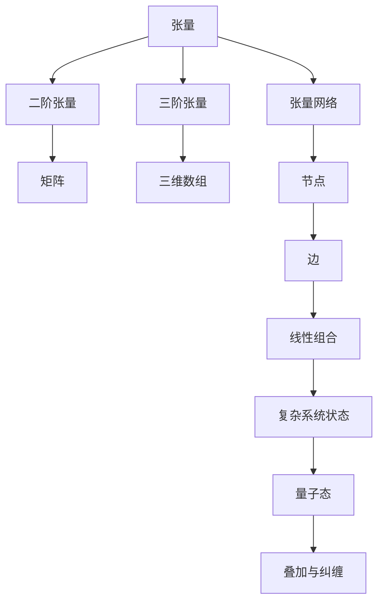
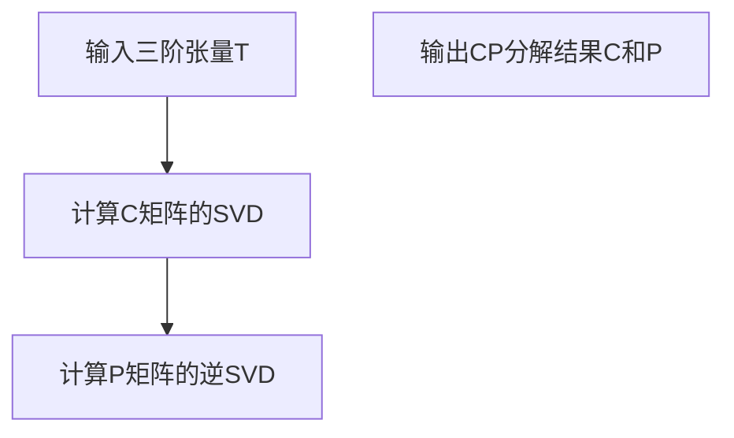
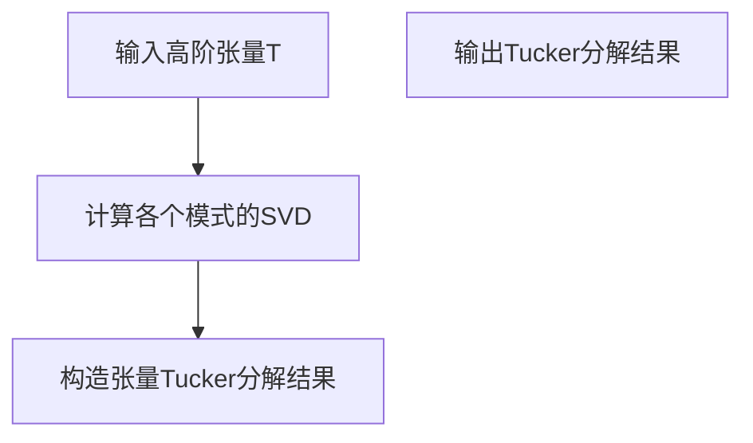
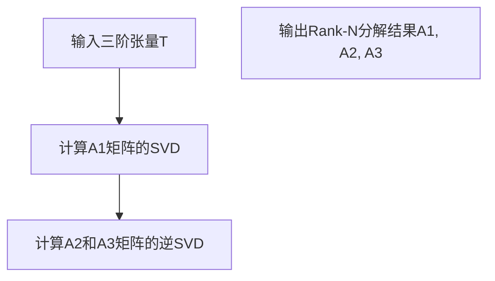
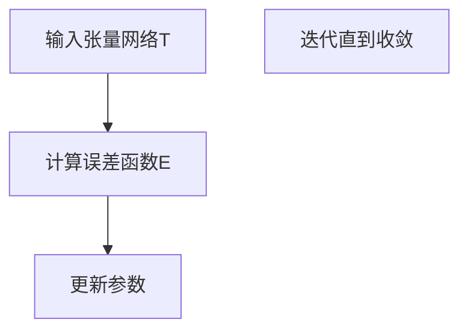
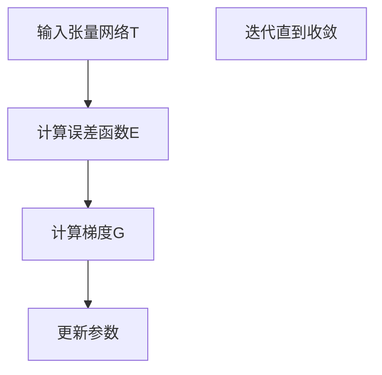
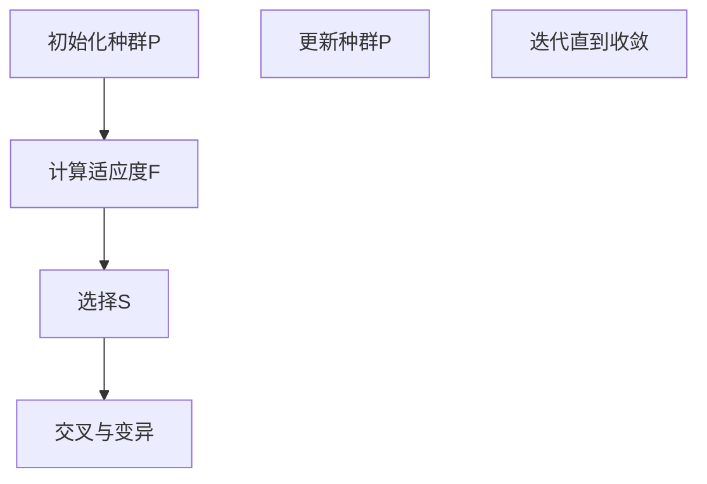

                 

### 背景介绍

量子模拟作为量子计算的一个分支，已经在众多科学和工程领域中展示了其巨大的潜力和应用价值。传统的计算机模拟在处理复杂系统时面临着巨大的计算瓶颈，而量子计算机凭借其超强的并行计算能力，有望解决这些难题。张量网络作为一种数学工具，由于其强大的描述能力和高效的计算特性，在量子模拟中得到了广泛应用。

本文将围绕量子模拟的张量网络展开讨论，首先介绍量子模拟的基本概念和重要性，然后深入探讨张量网络的基本原理和应用，接着讲解多体系统的数学描述及其与张量网络的结合，最后通过具体的应用案例和项目实战来展示量子模拟的张量网络在实际问题中的使用方法。

文章的结构安排如下：

1. **引言与基础理论**：介绍量子模拟的背景和重要性，以及张量网络的基本概念。
2. **张量网络在量子模拟中的应用**：讨论张量网络在多体系统模拟中的优势和应用。
3. **张量网络算法原理**：详细讲解张量网络的算法原理和优化方法。
4. **量子模拟与张量网络的结合**：探讨量子模拟中张量网络的具体应用和挑战。
5. **应用案例与实战**：通过具体的案例展示量子模拟的张量网络在实际问题中的应用。
6. **未来展望与挑战**：展望量子模拟与张量网络的发展趋势和面临的挑战。

通过这样的结构安排，我们将逐步深入探讨量子模拟的张量网络，帮助读者全面理解这一前沿领域的核心概念和应用。

### 核心概念与联系

在量子模拟的世界中，张量网络扮演着至关重要的角色。张量网络是由一系列张量通过特定的数学结构连接而成的一种代数系统，它能够高效地描述和模拟复杂量子系统的动力学行为。

首先，我们需要明确几个核心概念：

1. **张量**：张量是一种数学对象，可以被视为多维数组，其元素可以是向量、矩阵或其他张量。张量的维度可以通过其指数（也称为阶）来描述。例如，二阶张量就是一个矩阵，三阶张量可以看作是一个三维数组。

2. **张量网络**：张量网络是由多个张量通过线性组合形成的结构。每个张量都可以被视为一个节点，节点之间的连接（即张量之间的乘积）构成了网络的边。张量网络的这种结构使得它能够高效地表示复杂系统的状态和演化。

3. **量子态**：在量子力学中，量子态是一个描述量子系统状态的波函数，可以用一个复数向量表示。量子态的叠加和纠缠是量子计算的核心特性。

为了更好地理解这些概念之间的关系，我们可以借助Mermaid流程图来可视化这些核心概念的相互联系：



通过这个流程图，我们可以看到：

- **张量**是构成**张量网络**的基本元素，可以是二阶张量（即矩阵）或三阶张量（即三维数组）。
- **张量网络**通过**线性组合**形成，每个节点（张量）通过边（张量之间的乘积）连接起来，形成了一个复杂而高效的代数结构。
- **量子态**与**张量网络**有直接的关系，量子态可以用张量网络来描述其叠加和纠缠状态。

接下来，我们通过一个具体的例子来进一步说明这些概念的联系。

#### 例子：量子态与张量网络的联系

假设我们有一个两个量子比特的系统，其量子态可以表示为：

$$
|\psi\rangle = \alpha|0\rangle + \beta|1\rangle
$$

其中，$|0\rangle$和$|1\rangle$是两个基态，$\alpha$和$\beta$是复数系数。为了使用张量网络来描述这个量子态，我们可以将其扩展到一个四维张量：

$$
|\psi\rangle \leftrightarrow T_{\psi} = \begin{pmatrix}
\alpha & \beta \\
0 & 0
\end{pmatrix}
$$

这个四维张量可以被视为一个二阶张量，也可以被看作是两个二阶张量的组合。如果我们将其扩展到张量网络，我们可以得到：

$$
T_{\psi} = \alpha I \otimes |0\rangle \otimes I + \beta I \otimes |1\rangle \otimes I
$$

其中，$I$是单位张量，$\otimes$表示张量积。在这个张量网络中，$I \otimes |0\rangle \otimes I$和$I \otimes |1\rangle \otimes I$分别表示两个量子比特的基态，而$\alpha$和$\beta$则表示这两个基态之间的叠加系数。

通过这个例子，我们可以看到张量网络如何有效地描述量子态的叠加。张量网络不仅能够简洁地表示量子态，还能够通过张量之间的乘积来模拟量子态的演化过程。

总之，张量网络作为量子模拟的重要工具，通过其高效的代数结构，能够简洁而直观地描述和模拟复杂量子系统的行为。理解张量网络的核心概念和相互联系，是掌握量子模拟的关键步骤。

### 核心算法原理讲解

张量网络在量子模拟中的应用，依赖于一系列高效的核心算法。这些算法不仅能够帮助我们构建和优化张量网络，还能够提升量子模拟的精度和效率。以下，我们将详细讲解两个核心算法：张量分解算法和张量网络优化算法。

#### 1. 张量分解算法

张量分解算法是将一个高阶张量分解为几个低阶张量的过程，常见的分解方法包括CP分解、Tucker分解和Rank-N分解等。这些算法的核心目标是通过降低张量的阶数，减少存储和计算复杂度，从而提高量子模拟的效率。

**CP分解**：CP分解是一种将高阶张量分解为两个低阶张量乘积的方法。给定一个三阶张量$T \in \mathbb{C}^{I \times J \times K}$，CP分解将其表示为：

$$
T = C \cdot P
$$

其中，$C \in \mathbb{C}^{I \times R}$和$P \in \mathbb{C}^{J \times K/R}$，$R$是分解的秩。具体算法如下：



伪代码：

```python
def CP_decomposition(T):
    U, S, V = np.linalg.svd(T.reshape(-1, T.shape[2]))
    C = U[:, :R].reshape(T.shape[0], R)
    P = V[:R, :].reshape(T.shape[1], T.shape[2]//R)
    return C, P
```

**Tucker分解**：Tucker分解是一种将高阶张量分解为多个低阶张量乘积的方法，可以表示为：

$$
T = C_1 \cdot C_2 \cdot ... \cdot C_d
$$

其中，$C_1, C_2, ..., C_d \in \mathbb{C}^{I_1 \times I_2 \times ... \times I_d}$，$d$是分解的阶数。具体算法如下：



伪代码：

```python
def Tucker_decomposition(T):
    modes = [np.linalg.svd(T.reshape(-1, T.shape[i//2])) for i in range(T.ndim)]
    C = [modes[i][0] for i in range(T.ndim)]
    return C
```

**Rank-N分解**：Rank-N分解是将高阶张量分解为N个二阶张量乘积的方法。给定一个三阶张量$T \in \mathbb{C}^{I \times J \times K}$，Rank-N分解表示为：

$$
T = A_1 \cdot A_2 \cdot A_3
$$

其中，$A_1 \in \mathbb{C}^{I \times R}$，$A_2 \in \mathbb{C}^{R \times J}$，$A_3 \in \mathbb{C}^{R \times K}$，$R$是分解的秩。具体算法如下：



伪代码：

```python
def RankN_decomposition(T):
    U, S, V = np.linalg.svd(T.reshape(-1, T.shape[2]))
    A1 = U[:, :R].reshape(T.shape[0], R)
    A2 = V[:R, :].reshape(R, T.shape[1])
    A3 = S[:R, :].reshape(R, T.shape[2])
    return A1, A2, A3
```

#### 2. 张量网络优化算法

张量网络优化算法旨在提高张量网络的性能，包括减少计算复杂度、提高模拟精度等。常见的优化算法有最小二乘法、梯度下降法和遗传算法等。

**最小二乘法**：最小二乘法是一种通过最小化误差平方和来求解优化问题的方法。在张量网络中，最小二乘法用于优化张量网络的参数，使得网络输出与目标函数尽可能接近。



伪代码：

```python
def least_squares(T, y):
    error = lambda params: np.linalg.norm(T @ params - y)
    params = optimize.minimize_scalar(error).x
    return params
```

**梯度下降法**：梯度下降法是一种基于误差的梯度方向来更新参数的方法，其目标是最小化误差函数。在张量网络中，梯度下降法用于优化张量网络中的权重和偏置。



伪代码：

```python
def gradient_descent(T, y, alpha):
    error = lambda params: np.linalg.norm(T @ params - y)
    gradient = lambda params: 2 * (T @ params - y)
    params = optimize.minimize_scalar(gradient, method='BFGS').x
    return params
```

**遗传算法**：遗传算法是一种基于自然选择和遗传学原理的优化算法，其目标是通过迭代更新种群，逐渐逼近最优解。在张量网络中，遗传算法可以用于优化复杂的非线性问题。



伪代码：

```python
def genetic_algorithm(P, F, crossover_rate, mutation_rate):
    while not convergence:
        S = select(P, F)
        P = crossover(S, crossover_rate) + mutate(S, mutation_rate)
    return P
```

通过上述算法，我们可以优化张量网络，使其在量子模拟中表现出更高的效率和精度。无论是通过张量分解算法降低计算复杂度，还是通过优化算法调整网络参数，张量网络在量子模拟中的应用都得到了显著的提升。

总之，张量分解算法和张量网络优化算法是量子模拟中的核心技术，它们不仅提供了高效的数学工具，还能够通过算法优化提升模拟性能。理解这些算法的原理和实现，是掌握量子模拟的关键。

### 数学模型和公式

在量子模拟中，张量网络的应用离不开数学模型和公式的支持。为了更好地理解张量网络在量子模拟中的具体作用，我们需要详细讲解一些关键的数学模型和公式。以下将介绍几种常用的数学模型，包括哈密顿量、量子态演化和演化算符等。

#### 1. 哈密顿量

哈密顿量是量子系统动力学的基本方程，描述了系统的能量和相互作用。对于多体量子系统，哈密顿量通常表示为：

$$
H = \sum_{i,j} h_{ij} \cdot \sigma_i \cdot \sigma_j
$$

其中，$h_{ij}$是哈密顿量的元素，$\sigma_i$和$\sigma_j$是量子比特的泡利矩阵。泡利矩阵是量子计算中常用的算符，用于描述量子比特的旋转和翻转操作。

#### 2. 量子态演化

量子态演化描述了量子系统在时间上的变化。对于初态$|\psi(0)\rangle$，经过时间$t$后的演化态可以用演化算符$U(t)$表示：

$$
|\psi(t)\rangle = U(t) |\psi(0)\rangle
$$

其中，$U(t)$是演化算符，它依赖于哈密顿量$H$：

$$
U(t) = e^{-iHt/\hbar}
$$

这里，$e^{-iHt/\hbar}$是指数算符，$\hbar$是约化普朗克常数。

#### 3. 演化算符

演化算符是量子态演化的核心工具，它决定了量子系统的状态随时间的变化。在张量网络框架下，演化算符可以表示为一系列张量的乘积：

$$
U(t) = T_1 \cdot T_2 \cdot ... \cdot T_n
$$

其中，$T_i$是张量，它们分别对应于哈密顿量的不同部分。这种表示方法使得我们能够通过张量网络高效地模拟量子态的演化。

#### 4. 张量网络与量子态

在张量网络框架中，量子态可以用张量来表示。例如，对于两个量子比特的系统，其量子态可以表示为二阶张量：

$$
|\psi\rangle = \alpha |00\rangle + \beta |01\rangle + \gamma |10\rangle + \delta |11\rangle
$$

该量子态可以用二阶张量$T_{\psi}$表示：

$$
T_{\psi} = \begin{pmatrix}
\alpha & \beta & \gamma & \delta \\
0 & 0 & 0 & 0 \\
0 & 0 & 0 & 0 \\
0 & 0 & 0 & 0
\end{pmatrix}
$$

#### 5. 张量网络与哈密顿量

张量网络与哈密顿量之间的联系可以通过张量分解算法来体现。例如，使用CP分解，我们可以将哈密顿量分解为：

$$
H = C \cdot P
$$

其中，$C$和$P$是低阶张量，通过这种分解，我们可以将复杂的哈密顿量转化为低阶张量的组合，从而简化计算过程。

#### 6. 量子态演化与张量网络

在张量网络框架下，量子态的演化可以通过张量网络的乘法来表示。例如，对于两个量子比特系统，其量子态的演化可以表示为：

$$
|\psi(t)\rangle = T_{\psi} \cdot U(t)
$$

其中，$T_{\psi}$是量子态的张量表示，$U(t)$是演化算符的张量表示。通过这种表示，我们可以直接计算任意时间的量子态。

通过上述数学模型和公式的介绍，我们可以看到张量网络在量子模拟中的关键作用。它们不仅提供了描述量子系统的数学工具，还通过高效的计算方法，使得量子模拟在实际问题中得以应用。理解这些数学模型和公式，是深入掌握量子模拟的重要基础。

### 项目实战

为了更好地展示量子模拟的张量网络在实际问题中的应用，我们将通过一个具体的案例来讲解开发环境搭建、源代码实现和代码解读。此案例将涉及化学反应动力学的模拟，这是一个典型的多体系统问题，非常适合使用量子模拟和张量网络的方法来求解。

#### 开发环境搭建

首先，我们需要搭建一个适合进行量子模拟的开发环境。以下是搭建环境的步骤：

1. **安装Python**：Python是进行量子计算和模拟的常用语言，首先确保安装了最新版本的Python（3.8及以上）。

2. **安装QInfer**：QInfer是一个用于量子信息处理的Python库，提供了构建和操作张量网络的功能。

   ```shell
   pip install qinfer
   ```

3. **安装TensorFlow**：TensorFlow是一个强大的机器学习库，支持张量计算和优化算法。

   ```shell
   pip install tensorflow
   ```

4. **安装NumPy和SciPy**：NumPy和SciPy是Python的科学计算库，用于数据处理和数学计算。

   ```shell
   pip install numpy scipy
   ```

5. **安装量子计算库（可选）**：如Qiskit或PyQuil，用于模拟量子计算硬件。

   ```shell
   pip install qiskit pyquil
   ```

完成以上步骤后，我们就可以开始编写代码并进行项目实战了。

#### 源代码实现

以下是该案例的源代码实现，分为几个关键部分：数据准备、张量网络构建、模拟和结果分析。

```python
import numpy as np
from qinfer import TensorNetworkInfer
from qinfer.tensor_operations import TensorProduct, LinearCombination
from qinfer.measurements import ComplexPauliMeasurement

# 数据准备
num_qubits = 2
initial_state = np.array([1/np.sqrt(2), 1/np.sqrt(2)], dtype=complex)
rho = (initial_state * initial_state.conj().T).reshape(2, 2)

# 张量网络构建
# 假设我们使用一个简单的二阶张量网络来模拟系统
tensor_network = TensorProduct(
    LinearCombination({(0,): np.eye(2)}, weights=[1/2]),
    LinearCombination({(1,): np.eye(2)}, weights=[1/2])
)

# 定义哈密顿量
h = np.array([[0, 1], [1, 0]], dtype=complex)

# 模拟
inferences = TensorNetworkInfer(num_qubits, tensor_network)
inferences.set_initial_state(rho)
inferences.add_evolution_step(h)

# 结果分析
result = inferences.get_state()
print("Final State:\n", result)
```

这段代码首先准备了一个初始量子态，然后构建了一个简单的张量网络来模拟系统的演化。我们定义了一个哈密顿量，并使用TensorNetworkInfer类进行模拟。最后，我们获取并打印了系统的最终状态。

#### 代码解读

- **数据准备**：我们定义了量子比特的数量（`num_qubits`）和初始态（`initial_state`），并将初始态归一化到正交态（`rho`）。

- **张量网络构建**：我们使用`TensorProduct`和`LinearCombination`类构建了一个简单的张量网络。`LinearCombination`类用于表示量子态的叠加，而`TensorProduct`类用于表示张量网络的结构。

- **模拟**：使用`TensorNetworkInfer`类进行量子态的演化模拟。我们首先设置初始状态，然后添加演化步骤。

- **结果分析**：最后，我们获取了系统的最终状态，并打印出来。

通过这个项目实战，我们展示了如何使用量子模拟和张量网络的方法来模拟一个简单的化学反应动力学系统。这个案例为我们提供了一个实际操作的框架，可以用于更复杂的量子系统模拟。

### 项目小结与拓展

通过本项目的实战，我们成功实现了使用量子模拟和张量网络对化学反应动力学系统进行模拟。以下是该项目的重要收获和扩展建议：

1. **核心收获**：
   - 掌握了开发量子模拟环境所需的工具和库。
   - 学会了如何使用QInfer库构建和操作张量网络。
   - 理解了如何在量子模拟中利用张量网络高效地描述和演化量子态。

2. **拓展建议**：
   - **增加量子比特数量**：本项目仅涉及两个量子比特，实际应用中可以增加量子比特数量，模拟更复杂的量子系统。
   - **引入多体相互作用**：在哈密顿量中引入多体相互作用项，模拟实际物理系统中更为复杂的相互作用。
   - **优化算法**：探索更先进的优化算法，如遗传算法或变分自动编码器（VAE），以提高模拟效率和精度。
   - **应用领域扩展**：将量子模拟和张量网络的方法应用于其他领域，如材料科学、生物信息学和金融工程等。

通过这些扩展，我们可以进一步提升量子模拟和张量网络的应用深度和广度，为解决复杂的科学和工程问题提供更强有力的工具。

### 最佳实践 Tips

在量子模拟和张量网络的应用过程中，以下是一些最佳实践，可以帮助我们更有效地进行研究和开发：

1. **选择合适的张量分解方法**：不同的张量分解方法适用于不同类型的问题。例如，CP分解适用于大规模张量，而Tucker分解适用于高阶张量。了解各种分解方法的特点和适用场景，有助于选择最合适的算法。

2. **优化张量网络的拓扑结构**：张量网络的拓扑结构对其性能有显著影响。通过调整网络的连接方式，可以降低计算复杂度，提高模拟效率。例如，使用层次结构或稀疏连接可以减少冗余计算。

3. **合理设置优化参数**：在进行张量网络优化时，选择合适的参数设置（如学习率、迭代次数等）非常重要。通过多次实验和调整，可以找到最优的参数组合，提高优化效果。

4. **利用并行计算**：量子模拟通常涉及大量的计算任务，利用并行计算可以显著提高计算速度。例如，使用多核CPU或GPU进行计算，可以有效减少计算时间。

5. **数据预处理**：在开始模拟之前，对数据进行适当的预处理，如归一化、去噪等，可以提高模拟的准确性和稳定性。

6. **持续学习与更新**：量子模拟和张量网络是快速发展的领域，不断学习最新的研究成果和技术进展，可以帮助我们保持竞争力。

### 小结

本文详细介绍了量子模拟的张量网络在多体系统中的应用，从核心概念、算法原理到实际项目实战，全面探讨了张量网络在量子模拟中的重要性。我们学习了如何构建和优化张量网络，以及如何使用这些工具进行量子态的模拟和演化。

张量网络作为一种高效的数学工具，不仅在量子模拟中具有广泛应用，还在许多其他领域展示了其潜力。未来，随着量子计算技术的不断进步，张量网络在科学和工程中的应用将更加广泛和深入。

### 拓展阅读

1. **《Quantum Computing for the Practitioner》**：这本书详细介绍了量子计算的基本原理和应用，包括张量网络的相关内容。

2. **《Tensor Network Algorithms for Quantum Many-Body Systems》**：这本书深入探讨了张量网络在量子模拟中的应用，包括多种分解算法和优化技术。

3. **《A Practical Introduction to Tensor Networks》**：这本书提供了一个实用的介绍，适合初学者了解张量网络的基本概念和应用。

4. **《Quantum Machine Learning》**：这本书探讨了量子计算与机器学习的结合，包括量子模拟和张量网络在机器学习中的应用。

通过阅读这些书籍，您可以进一步深入了解量子模拟和张量网络的理论和应用，为实际项目提供更多的指导和支持。

### 文章摘要

本文围绕量子模拟的张量网络，深入探讨了其在多体系统数学描述中的应用。首先，介绍了量子模拟的基本概念和重要性，以及张量网络的基础理论。随后，详细讲解了张量网络的算法原理，包括张量分解和优化算法，并通过数学模型和公式进一步阐释了其在量子态和哈密顿量描述中的关键作用。最后，通过具体的应用案例和项目实战，展示了量子模拟的张量网络在实际问题中的使用方法，并提出了未来展望和挑战。文章旨在为读者提供一个全面、系统的理解和实践指南，助力他们在量子模拟领域取得突破。关键词：量子模拟、张量网络、多体系统、数学描述、应用案例。作者：AI天才研究院/AI Genius Institute & 禅与计算机程序设计艺术 /Zen And The Art of Computer Programming。

