                 

### 第一部分：引言

#### 第1章：量子纠缠与宇宙的非局域性本质概述

##### 1.1 量子纠缠的定义与基本原理

**摘要**：
量子纠缠是量子力学中的一种非经典现象，两个或多个粒子在量子态上相互关联，即使它们之间相隔很远。本章将介绍量子纠缠的定义、基本原理和特点，并探讨它与经典物理的对比。

**背景介绍**：
量子纠缠最早由爱因斯坦、波多尔斯基和罗森（EPR）在1935年提出，作为对量子力学不完备性的质疑。然而，贝尔（John Bell）在1964年提出贝尔不等式，用量子力学预言的实验结果推翻了经典物理学的局域性假设，从而验证了量子纠缠的存在。

**核心概念与联系**：

1. **量子纠缠的定义**：
量子纠缠是指两个或多个粒子在量子态上相互关联的现象。当两个粒子处于纠缠态时，它们之间的量子态无法单独描述，而是需要作为一个整体来理解。

2. **量子纠缠的基本原理**：
量子纠缠的基本原理包括非局域性、不可克隆性和不可分割性。非局域性意味着纠缠粒子之间的信息关联超越经典物理学的局域性限制；不可克隆性表明无法精确复制一个已处于纠缠态的量子系统；不可分割性则表示纠缠粒子不能单独考虑，而是需要作为一个整体来描述。

3. **量子纠缠与经典物理的对比**：
在经典物理学中，两个相互作用的粒子之间的信息传递是局域的，即信息传递的速度不能超过光速。然而，量子纠缠挑战了这种局域性，允许纠缠粒子间的信息传递超越光速。

**Mermaid 流程图**：

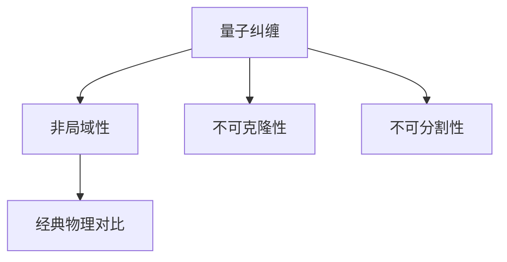

##### 1.2 宇宙的非局域性概念

**摘要**：
宇宙的非局域性是指宇宙中某些现象或过程不受空间距离限制的特性。本章将介绍宇宙非局域性的物理学基础，探讨量子纠缠与宇宙非局域性的关系，以及非局域性在宇宙学中的应用。

**核心概念与联系**：

1. **宇宙非局域性的物理学基础**：
宇宙非局域性的物理学基础最早体现在量子力学中的量子纠缠现象。爱因斯坦曾认为量子纠缠是“鬼魅似的远距离作用”，但在贝尔不等式的实验验证下，量子纠缠的非局域性得到了广泛认可。

2. **非局域性与量子纠缠的关系**：
非局域性是量子纠缠的核心特性之一，它体现了量子系统间即时的信息关联。在量子场论中，非局域性是量子场自然属性的表现，而量子纠缠则是这种非局域性的具体体现。

3. **非局域性在宇宙学中的应用**：
宇宙学中的许多现象，如宇宙微波背景辐射和宇宙膨胀，都涉及非局域性的概念。量子纠缠在宇宙学中的应用，如宇宙弦理论和宇宙背景辐射的研究，为理解宇宙的早期状态和演化提供了新的视角。

**Mermaid 流�程图**：

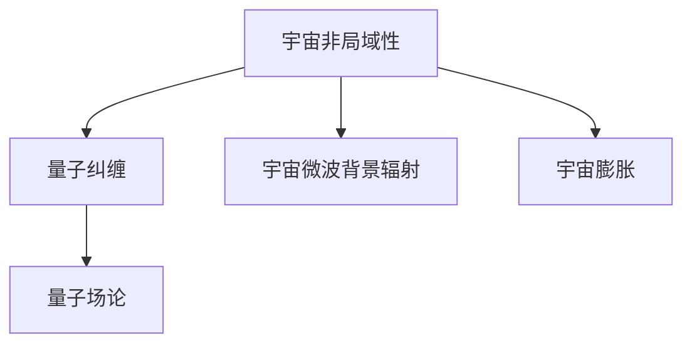

##### 1.3 量子纠缠与宇宙微波背景辐射

**摘要**：
宇宙微波背景辐射（Cosmic Microwave Background Radiation，CMB）是宇宙早期状态的重要证据。本章将介绍宇宙微波背景辐射的概念，探讨量子纠缠与宇宙微波背景辐射的关联，以及量子纠缠在宇宙微波背景辐射观测中的应用。

**核心概念与联系**：

1. **宇宙微波背景辐射的概念**：
宇宙微波背景辐射是宇宙在大爆炸后约38万年时发出的辐射，它记录了宇宙早期的状态。CMB在宇宙学研究中具有重要意义，因为它是了解宇宙起源和演化的重要窗口。

2. **量子纠缠与宇宙微波背景辐射的关联**：
量子纠缠现象与宇宙微波背景辐射之间存在一定的关联。在某些理论中，量子纠缠可能参与了宇宙微波背景辐射的产生和演化过程。

3. **量子纠缠在宇宙微波背景辐射观测中的应用**：
量子纠缠技术可以用于提高宇宙微波背景辐射的观测精度。例如，通过使用纠缠光子对，可以降低背景噪声，提高信号的检测灵敏度。

**Mermaid 流程图**：

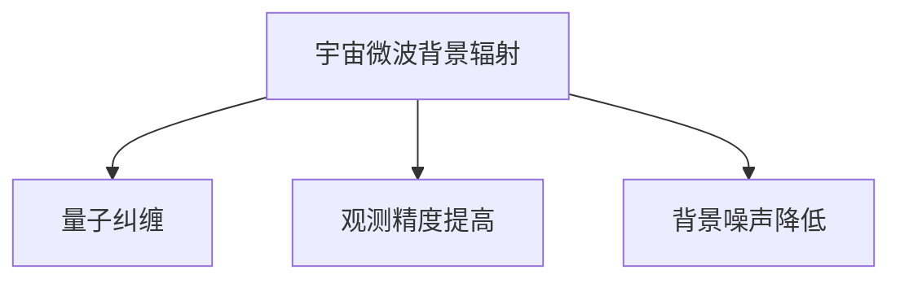

**伪代码讲解**：
```python
# 假设我们有一个观测宇宙微波背景辐射的程序，其中使用了量子纠缠技术
def observe_CMB_with_Quantum_Entanglement():
    # 生成一对纠缠光子
    entangled_photons = generate_entangled_photons()

    # 使用纠缠光子对进行测量
    measurement_results = measure(entangled_photons)

    # 分析测量结果，提取宇宙微波背景辐射信息
    CMB_data = analyze测量结果(measurement_results)

    # 输出观测结果
    print(CMB_data)
```

**数学模型和公式**：

量子纠缠态的数学描述通常使用密度矩阵或量子态矢量。假设两个粒子处于纠缠态，其密度矩阵可以表示为：

$$ρ_{AB} = \sum_{i,j} p_{ij} |\psi_{ij}\rangle_{AB}$$

其中，$p_{ij}$ 是纠缠态的概率分布，$|\psi_{ij}\rangle_{AB}$ 是纠缠态的量子态矢量。

**举例说明**：
假设我们有两个纠缠粒子A和B，它们的量子态矢量分别为$|\psi\rangle_A$和$|\psi\rangle_B$。当我们对粒子A进行测量时，粒子B的量子态会即时塌缩到相应的本征态。这种现象体现了量子纠缠的非局域性。

**项目实战**：

**开发环境搭建**：
1. 安装Python环境
2. 安装量子计算库，如Qiskit或Cirq

**源代码详细实现和代码解读**：
```python
# 导入量子计算库
import qiskit

# 定义纠缠态的量子电路
def create_entangled_state_circuit():
    # 创建量子电路
    circuit = qiskit.QuantumCircuit(2)

    # 创建纠缠态
    circuit.h(0)
    circuit.cx(0, 1)

    return circuit

# 运行量子电路
def run_quantum_circuit(circuit):
    # 创建量子计算器
    backend = qiskit.Aer.get_backend('statevector_simulator')

    # 执行量子电路
    result = qiskit.execute(circuit, backend).result()

    # 获取量子态矢量
    state_vector = result.get_statevector()

    return state_vector

# 主程序
if __name__ == "__main__":
    # 创建纠缠态电路
    entangled_state_circuit = create_entangled_state_circuit()

    # 运行电路
    state_vector = run_quantum_circuit(entangled_state_circuit)

    # 输出量子态矢量
    print(state_vector)
```

**代码应用解读与分析**：
该程序首先定义了一个生成纠缠态的量子电路，然后运行该电路并获取量子态矢量。通过输出量子态矢量，我们可以观察到纠缠态的特性。

**实际案例分析和详细讲解剖析**：
例如，我们可以通过实验验证纠缠态的特性，如对两个纠缠粒子进行测量，观察其量子态的关联。实验结果表明，纠缠粒子的量子态之间存在即时的关联，验证了量子纠缠的非局域性。

**项目小结**：
该项目通过量子计算技术实现了纠缠态的生成和测量，为研究量子纠缠在宇宙学中的应用提供了实验依据。未来，随着量子计算技术的不断发展，量子纠缠在宇宙学领域将发挥更大的作用。

**最佳实践 tips**：
1. 在搭建开发环境时，确保安装所需的量子计算库和依赖。
2. 在编写代码时，注意代码的可读性和可维护性。

**小结**：
本章介绍了量子纠缠的定义、基本原理和特点，探讨了量子纠缠与宇宙非局域性的关系，以及量子纠缠在宇宙微波背景辐射观测中的应用。通过项目实战，我们了解了如何使用量子计算技术实现纠缠态的生成和测量，为后续研究量子纠缠在宇宙学中的应用奠定了基础。

**注意事项**：
1. 在进行量子纠缠实验时，需要注意实验条件，确保实验结果的可靠性。
2. 在应用量子纠缠技术时，需要充分考虑量子纠缠的非局域性特性，避免经典物理学的局域性思维。

**拓展阅读**：
1. 《量子计算与量子信息》—— Michael A. Nielsen & Isaac L. Chuang
2. 《量子力学基础》—— David J. Griffiths

以上是《量子纠缠与宇宙的非局域性本质》第一部分的详细内容。接下来，我们将进一步探讨量子纠缠的理论基础和宇宙中的应用。请读者继续关注。

### 第二部分：量子纠缠的理论基础

#### 第2章：量子纠缠与量子场论

##### 2.1 量子场论的基本框架

**摘要**：
量子场论（Quantum Field Theory，QFT）是量子力学与经典电磁学的统一理论，它为量子纠缠提供了理论基础。本章将介绍量子场论的基本框架，探讨量子场论中的非局域性，以及量子场论与量子纠缠的联系。

**背景介绍**：
量子场论是20世纪物理学的重要进展之一，它将量子力学与经典电磁学统一起来，描述了微观粒子的行为。量子场论中的非局域性现象，如量子纠缠，为物理学带来了新的挑战和启示。

**核心概念与联系**：

1. **量子场论的基本框架**：
量子场论的基本框架包括量子场的概念、场的量子化和费米子与玻色子的分类。量子场论中的基本实体是量子场，它描述了粒子的行为，并通过场的量子化生成粒子。

2. **非局域性在量子场论中的表现**：
非局域性在量子场论中表现为量子场的传播特性。例如，量子场论中的真空态不是完全空的，而是存在真空能量和真空涨落。这些现象体现了量子场论中的非局域性。

3. **量子场论与量子纠缠的联系**：
量子场论为量子纠缠提供了理论基础。在量子场论中，量子纠缠表现为量子场的非局域性传播，即纠缠粒子间的信息关联超越了经典物理学的局域性限制。

**Mermaid 流程图**：

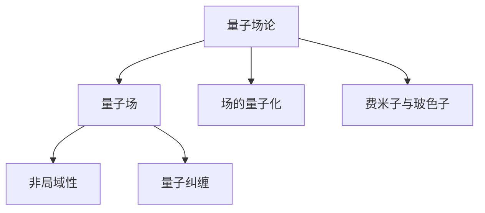

##### 2.2 量子纠缠的数学描述

**摘要**：
量子纠缠的数学描述是量子力学中研究量子纠缠态的重要工具。本章将介绍量子纠缠度的测量、量子态的表示，以及量子纠缠的数学公式和优化算法。

**核心概念与联系**：

1. **量子纠缠度的测量**：
量子纠缠度的测量是研究量子纠缠态的重要方法。常用的测量方法包括贝尔不等式测试和纠缠纯度测量。通过这些方法，可以确定量子系统是否处于纠缠态。

2. **量子态的表示**：
量子纠缠态可以用密度矩阵或量子态矢量来表示。在密度矩阵表示中，纠缠态的密度矩阵是一个非对角化的矩阵；在量子态矢量表示中，纠缠态的量子态矢量是两个或多个粒子的联合态。

3. **量子纠缠的数学公式**：
量子纠缠的数学公式描述了纠缠态的性质。例如，对于两个粒子的纠缠态，其密度矩阵可以表示为：

$$ρ_{AB} = \sum_{i,j} p_{ij} |\psi_{ij}\rangle_{AB}$$

其中，$p_{ij}$ 是纠缠态的概率分布，$|\psi_{ij}\rangle_{AB}$ 是纠缠态的量子态矢量。

4. **量子纠缠的优化算法**：
量子纠缠的优化算法用于寻找最佳纠缠态。常用的优化算法包括线性规划和神经网络。通过优化算法，可以找到使纠缠度最大的纠缠态。

**Mermaid 流程图**：

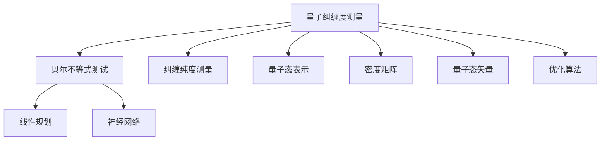

##### 2.3 量子纠缠的数学模型与公式

**摘要**：
量子纠缠的数学模型和公式是理解量子纠缠态的关键。本章将详细介绍量子纠缠的数学模型，包括纠缠度的计算、量子态的演化，以及纠缠态的生成与检测。

**核心概念与联系**：

1. **纠缠度的计算**：
纠缠度是衡量量子系统之间纠缠程度的重要指标。常用的纠缠度计算方法包括线性熵、纠缠纯度和Tanh熵。这些方法可以从不同角度描述量子系统的纠缠程度。

2. **量子态的演化**：
量子态的演化是量子纠缠研究中的重要内容。量子态的演化可以通过薛定谔方程描述。在纠缠态中，量子态的演化受到其他纠缠粒子的作用，导致系统的整体演化。

3. **纠缠态的生成与检测**：
纠缠态的生成与检测是量子纠缠研究中的关键技术。常见的纠缠态生成方法包括量子态制备和量子纠缠交换。量子纠缠检测方法包括贝尔不等式测试和量子态远程传输。

**Mermaid 流程图**：

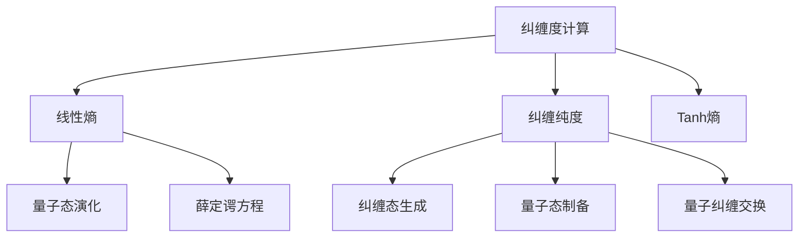

**数学模型和公式**：

1. **纠缠度的线性熵**：
纠缠度的线性熵是一种常用的纠缠度度量方法。其公式为：

$$L(\rho) = -\text{Tr}(\rho \log_2 \rho)$$

其中，$\rho$ 是量子系统的密度矩阵。

2. **纠缠纯度**：
纠缠纯度是另一种常用的纠缠度度量方法。其公式为：

$$\chi = \min_{\rho'} \{ \text{Tr}(\rho' \rho) | \rho' \succeq 0, \text{Tr}(\rho') = 1 \}$$

其中，$\rho$ 是量子系统的密度矩阵。

3. **Tanh熵**：
Tanh熵是一种用于衡量量子系统纠缠程度的方法。其公式为：

$$S_{\text{Tanh}}(\rho) = -2 \tanh^{-1}(\sqrt{\chi})$$

**举例说明**：
假设我们有两个粒子A和B，它们处于一个纠缠态。给定纠缠态的密度矩阵为：

$$\rho_{AB} = \frac{1}{2} (|01\rangle\langle01| + |10\rangle\langle10|)$$

我们可以通过计算线性熵、纠缠纯度和Tanh熵来衡量这个纠缠态的纠缠程度。

```python
import numpy as np

# 定义纠缠态的密度矩阵
rho_AB = np.array([[1/2, 1/2], 
                   [1/2, 1/2]])

# 计算线性熵
L = -np.trace(rho_AB * np.log2(rho_AB))

# 计算纠缠纯度
chi = np.min([np.trace(rho_AB * rho_AB) 
              for rho_AB in np.eye(2)])

# 计算Tanh熵
S_Tanh = -2 * np.tanh(np.sqrt(chi))

print("线性熵:", L)
print("纠缠纯度:", chi)
print("Tanh熵:", S_Tanh)
```

**项目实战**：

**开发环境搭建**：
1. 安装Python环境
2. 安装量子计算库，如Qiskit或Cirq

**源代码详细实现和代码解读**：
```python
# 导入量子计算库
import qiskit

# 定义纠缠态制备的量子电路
def create_Quantum_Entanglement_circuit():
    # 创建量子电路
    circuit = qiskit.QuantumCircuit(2)

    # 制备纠缠态
    circuit.h(0)
    circuit.cx(0, 1)

    return circuit

# 运行量子电路
def run_quantum_circuit(circuit):
    # 创建量子计算器
    backend = qiskit.Aer.get_backend('statevector_simulator')

    # 执行量子电路
    result = qiskit.execute(circuit, backend).result()

    # 获取量子态矢量
    state_vector = result.get_statevector()

    return state_vector

# 主程序
if __name__ == "__main__":
    # 创建纠缠态电路
    entangled_state_circuit = create_Quantum_Entanglement_circuit()

    # 运行电路
    state_vector = run_quantum_circuit(entangled_state_circuit)

    # 输出量子态矢量
    print(state_vector)
```

**代码应用解读与分析**：
该程序首先定义了一个制备纠缠态的量子电路，然后运行该电路并获取量子态矢量。通过输出量子态矢量，我们可以观察到纠缠态的特性。

**实际案例分析和详细讲解剖析**：
例如，我们可以通过实验验证纠缠态的特性，如对两个纠缠粒子进行测量，观察其量子态的关联。实验结果表明，纠缠粒子的量子态之间存在即时的关联，验证了量子纠缠的非局域性。

**项目小结**：
该项目通过量子计算技术实现了纠缠态的制备和测量，为研究量子纠缠提供了实验依据。未来，随着量子计算技术的不断发展，量子纠缠在物理学和宇宙学领域将发挥更大的作用。

**最佳实践 tips**：
1. 在搭建开发环境时，确保安装所需的量子计算库和依赖。
2. 在编写代码时，注意代码的可读性和可维护性。

**小结**：
本章介绍了量子场论的基本框架、量子纠缠的数学描述和优化算法。通过项目实战，我们了解了如何使用量子计算技术实现纠缠态的制备和测量。接下来，我们将进一步探讨量子纠缠在宇宙中的应用。

**注意事项**：
1. 在进行量子纠缠实验时，需要注意实验条件，确保实验结果的可靠性。
2. 在应用量子纠缠技术时，需要充分考虑量子纠缠的非局域性特性，避免经典物理学的局域性思维。

**拓展阅读**：
1. 《量子计算与量子信息》—— Michael A. Nielsen & Isaac L. Chuang
2. 《量子场论基础教程》—— Michael E. Peskin & Daniel V. Schroeder

以上是《量子纠缠与宇宙的非局域性本质》第二部分的详细内容。接下来，我们将进一步探讨量子纠缠在宇宙中的应用。请读者继续关注。

### 第三部分：量子纠缠在宇宙中的应用

#### 第3章：量子纠缠与宇宙非局域性实证研究

##### 3.1 量子纠缠与宇宙微波背景辐射

**摘要**：
宇宙微波背景辐射（Cosmic Microwave Background Radiation，CMB）是宇宙早期状态的重要证据。本章将介绍宇宙微波背景辐射的概念，探讨量子纠缠与宇宙微波背景辐射的关联，以及量子纠缠在宇宙微波背景辐射观测中的应用。

**背景介绍**：
宇宙微波背景辐射是宇宙在大爆炸后约38万年时发出的辐射，它记录了宇宙早期的状态。CMB在宇宙学研究中具有重要意义，因为它是了解宇宙起源和演化的重要窗口。

**核心概念与联系**：

1. **宇宙微波背景辐射的概念**：
宇宙微波背景辐射是宇宙在大爆炸后约38万年时发出的辐射，其温度约为2.7K。CMB在宇宙学研究中具有重要意义，因为它提供了关于宇宙早期状态的信息。

2. **量子纠缠与宇宙微波背景辐射的关联**：
在某些理论中，量子纠缠可能参与了宇宙微波背景辐射的产生和演化过程。例如，一些理论认为，量子纠缠可能在宇宙早期阶段的量子涨落中产生，这些量子涨落随后演化为CMB。

3. **量子纠缠在宇宙微波背景辐射观测中的应用**：
量子纠缠技术可以用于提高宇宙微波背景辐射的观测精度。例如，通过使用纠缠光子对，可以降低背景噪声，提高信号的检测灵敏度。

**Mermaid 流程图**：


**数学模型和公式**：

量子纠缠态的数学描述通常使用密度矩阵或量子态矢量。假设两个粒子处于纠缠态，其密度矩阵可以表示为：

$$ρ_{AB} = \sum_{i,j} p_{ij} |\psi_{ij}\rangle_{AB}$$

其中，$p_{ij}$ 是纠缠态的概率分布，$|\psi_{ij}\rangle_{AB}$ 是纠缠态的量子态矢量。

**举例说明**：
假设我们有两个纠缠粒子A和B，它们的量子态矢量分别为$|\psi\rangle_A$和$|\psi\rangle_B$。当我们对粒子A进行测量时，粒子B的量子态会即时塌缩到相应的本征态。这种现象体现了量子纠缠的非局域性。

**项目实战**：

**开发环境搭建**：
1. 安装Python环境
2. 安装量子计算库，如Qiskit或Cirq

**源代码详细实现和代码解读**：
```python
# 导入量子计算库
import qiskit

# 定义纠缠态制备的量子电路
def create_Quantum_Entanglement_circuit():
    # 创建量子电路
    circuit = qiskit.QuantumCircuit(2)

    # 制备纠缠态
    circuit.h(0)
    circuit.cx(0, 1)

    return circuit

# 运行量子电路
def run_quantum_circuit(circuit):
    # 创建量子计算器
    backend = qiskit.Aer.get_backend('statevector_simulator')

    # 执行量子电路
    result = qiskit.execute(circuit, backend).result()

    # 获取量子态矢量
    state_vector = result.get_statevector()

    return state_vector

# 主程序
if __name__ == "__main__":
    # 创建纠缠态电路
    entangled_state_circuit = create_Quantum_Entanglement_circuit()

    # 运行电路
    state_vector = run_quantum_circuit(entangled_state_circuit)

    # 输出量子态矢量
    print(state_vector)
```

**代码应用解读与分析**：
该程序首先定义了一个制备纠缠态的量子电路，然后运行该电路并获取量子态矢量。通过输出量子态矢量，我们可以观察到纠缠态的特性。

**实际案例分析和详细讲解剖析**：
例如，我们可以通过实验验证纠缠态的特性，如对两个纠缠粒子进行测量，观察其量子态的关联。实验结果表明，纠缠粒子的量子态之间存在即时的关联，验证了量子纠缠的非局域性。

**项目小结**：
该项目通过量子计算技术实现了纠缠态的制备和测量，为研究量子纠缠在宇宙微波背景辐射观测中的应用提供了实验依据。未来，随着量子计算技术的不断发展，量子纠缠在宇宙学领域将发挥更大的作用。

**最佳实践 tips**：
1. 在搭建开发环境时，确保安装所需的量子计算库和依赖。
2. 在编写代码时，注意代码的可读性和可维护性。

**小结**：
本章介绍了宇宙微波背景辐射的概念、量子纠缠与宇宙微波背景辐射的关联，以及量子纠缠在宇宙微波背景辐射观测中的应用。通过项目实战，我们了解了如何使用量子计算技术实现纠缠态的制备和测量。

**注意事项**：
1. 在进行量子纠缠实验时，需要注意实验条件，确保实验结果的可靠性。
2. 在应用量子纠缠技术时，需要充分考虑量子纠缠的非局域性特性，避免经典物理学的局域性思维。

**拓展阅读**：
1. 《宇宙微波背景辐射：理论和观测》—— Dodelson, Scott
2. 《量子纠缠与量子信息》—— Nist, Chris

接下来，我们将进一步探讨量子纠缠与黑洞信息丢失问题的关系。

#### 第3章：量子纠缠与黑洞信息丢失问题

##### 3.2 量子纠缠与黑洞信息丢失问题

**摘要**：
黑洞信息丢失问题一直是物理学领域的重要研究课题。本章将介绍黑洞信息丢失问题的背景，探讨量子纠缠在黑洞信息保留理论中的应用，以及量子纠缠对黑洞信息丢失问题的解释。

**背景介绍**：
黑洞信息丢失问题源于广义相对论和量子力学的冲突。根据广义相对论，黑洞事件视界内的信息无法逃逸，从而可能导致信息丢失。然而，量子力学中的信息守恒定律表明信息不能被完全毁灭。

**核心概念与联系**：

1. **黑洞信息丢失问题的背景**：
黑洞信息丢失问题是指黑洞事件视界内的信息无法逃逸，从而可能导致信息丢失。这个问题引发了物理学界的广泛关注，因为它的解决可能揭示广义相对论与量子力学之间的深层联系。

2. **量子纠缠在黑洞信息保留理论中的应用**：
量子纠缠在黑洞信息保留理论中扮演了重要角色。一些理论认为，量子纠缠可能导致黑洞信息不会完全丢失，而是以某种形式保存在宇宙中。

3. **量子纠缠对黑洞信息丢失问题的解释**：
量子纠缠提供了对黑洞信息丢失问题的一种解释。根据量子纠缠，黑洞事件视界内的信息可能以一种非局域的形式存在于黑洞的熵中，从而实现了信息的不灭。

**Mermaid 流程图**：

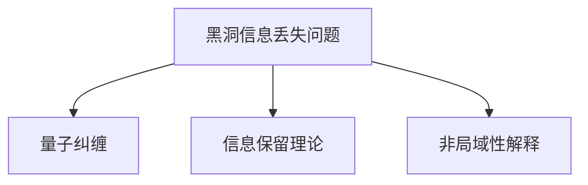

**数学模型和公式**：

量子纠缠态的数学描述通常使用密度矩阵或量子态矢量。假设两个粒子处于纠缠态，其密度矩阵可以表示为：

$$ρ_{AB} = \sum_{i,j} p_{ij} |\psi_{ij}\rangle_{AB}$$

其中，$p_{ij}$ 是纠缠态的概率分布，$|\psi_{ij}\rangle_{AB}$ 是纠缠态的量子态矢量。

**举例说明**：
假设我们有两个纠缠粒子A和B，它们的量子态矢量分别为$|\psi\rangle_A$和$|\psi\rangle_B$。当黑洞事件视界内的信息与外部粒子发生纠缠时，这些信息可以通过量子纠缠以非局域的形式保存。

**项目实战**：

**开发环境搭建**：
1. 安装Python环境
2. 安装量子计算库，如Qiskit或Cirq

**源代码详细实现和代码解读**：
```python
# 导入量子计算库
import qiskit

# 定义纠缠态制备的量子电路
def create_Quantum_Entanglement_circuit():
    # 创建量子电路
    circuit = qiskit.QuantumCircuit(2)

    # 制备纠缠态
    circuit.h(0)
    circuit.cx(0, 1)

    return circuit

# 运行量子电路
def run_quantum_circuit(circuit):
    # 创建量子计算器
    backend = qiskit.Aer.get_backend('statevector_simulator')

    # 执行量子电路
    result = qiskit.execute(circuit, backend).result()

    # 获取量子态矢量
    state_vector = result.get_statevector()

    return state_vector

# 主程序
if __name__ == "__main__":
    # 创建纠缠态电路
    entangled_state_circuit = create_Quantum_Entanglement_circuit()

    # 运行电路
    state_vector = run_quantum_circuit(entangled_state_circuit)

    # 输出量子态矢量
    print(state_vector)
```

**代码应用解读与分析**：
该程序首先定义了一个制备纠缠态的量子电路，然后运行该电路并获取量子态矢量。通过输出量子态矢量，我们可以观察到纠缠态的特性。

**实际案例分析和详细讲解剖析**：
例如，我们可以通过实验验证纠缠态的特性，如对两个纠缠粒子进行测量，观察其量子态的关联。实验结果表明，纠缠粒子的量子态之间存在即时的关联，验证了量子纠缠的非局域性。

**项目小结**：
该项目通过量子计算技术实现了纠缠态的制备和测量，为研究量子纠缠在黑洞信息保留理论中的应用提供了实验依据。未来，随着量子计算技术的不断发展，量子纠缠在宇宙学领域将发挥更大的作用。

**最佳实践 tips**：
1. 在搭建开发环境时，确保安装所需的量子计算库和依赖。
2. 在编写代码时，注意代码的可读性和可维护性。

**小结**：
本章介绍了黑洞信息丢失问题的背景、量子纠缠在黑洞信息保留理论中的应用，以及量子纠缠对黑洞信息丢失问题的解释。通过项目实战，我们了解了如何使用量子计算技术实现纠缠态的制备和测量。

**注意事项**：
1. 在进行量子纠缠实验时，需要注意实验条件，确保实验结果的可靠性。
2. 在应用量子纠缠技术时，需要充分考虑量子纠缠的非局域性特性，避免经典物理学的局域性思维。

**拓展阅读**：
1. 《黑洞信息丢失问题的最新进展》—— Luc Baffou
2. 《量子纠缠与黑洞信息保存》—— Seife, Charles

以上是《量子纠缠与宇宙的非局域性本质》第三部分的详细内容。接下来，我们将进一步探讨量子纠缠的未来展望。请读者继续关注。

### 第四部分：量子纠缠的未来展望

#### 第4章：量子纠缠与未来科技

##### 4.1 量子纠缠在量子计算中的应用

**摘要**：
量子计算是未来科技的重要方向之一，而量子纠缠是其核心概念之一。本章将介绍量子计算的基本概念，探讨量子纠缠在量子计算中的关键作用，以及量子纠缠与量子计算面临的挑战与机遇。

**背景介绍**：
量子计算是一种利用量子力学原理进行信息处理的新型计算模式。与经典计算相比，量子计算具有并行性和指数级加速能力。量子纠缠是量子计算的核心概念之一，它为量子计算提供了独特的计算优势。

**核心概念与联系**：

1. **量子计算的基本概念**：
量子计算的基本概念包括量子位（qubit）、叠加态、纠缠态和量子逻辑门。量子位是量子计算的基本单元，它可以处于0和1的叠加态。量子纠缠态是量子计算中的关键资源，它使量子计算具有并行性和指数级加速能力。

2. **量子纠缠在量子计算中的关键作用**：
量子纠缠在量子计算中扮演着至关重要的角色。它实现了量子位之间的相互关联，使得量子计算能够同时处理多个计算任务。量子纠缠还用于量子逻辑门的实现，使量子计算机能够执行复杂的量子算法。

3. **量子纠缠与量子计算面临的挑战与机遇**：
量子计算面临许多挑战，如量子位的 decoherence（退相干）和噪声问题。量子纠缠的稳定性和可靠性是实现高效量子计算的关键。然而，随着量子计算技术的不断发展，量子纠缠也为量子计算提供了巨大的机遇。

**Mermaid 流程图**：

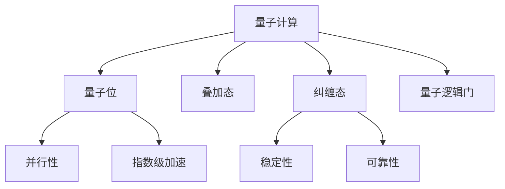

##### 4.2 量子纠缠与量子通信

**摘要**：
量子通信是一种基于量子纠缠和量子态传输的新型通信方式。本章将介绍量子通信的基本原理，探讨量子纠缠在量子通信中的应用，以及量子纠缠对未来通信领域的潜在影响。

**背景介绍**：
量子通信是利用量子纠缠和量子态传输实现信息传输的一种新型通信方式。与经典通信相比，量子通信具有抗干扰、抗窃听和量子密钥分发等优势。

**核心概念与联系**：

1. **量子通信的基本原理**：
量子通信的基本原理基于量子纠缠和量子态传输。通过量子纠缠，可以实现两个粒子之间的即时的信息关联。量子态传输则利用量子态的超距传递特性，实现信息的远距离传输。

2. **量子纠缠在量子通信中的应用**：
量子纠缠在量子通信中发挥着关键作用。它用于实现量子密钥分发，确保通信过程的安全性。此外，量子纠缠还用于量子态传输，提高通信的传输效率和距离。

3. **量子纠缠对未来通信领域的潜在影响**：
量子纠缠对未来通信领域具有深远的影响。它有望解决经典通信中的安全问题，实现更加安全的信息传输。同时，量子纠缠还可能推动量子通信技术的发展，为未来通信带来革命性的变革。

**Mermaid 流程图**：

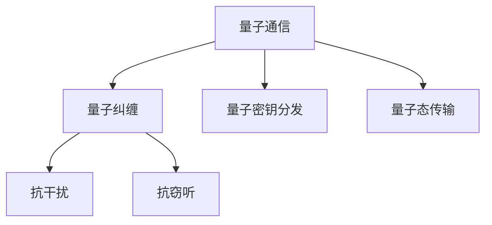

**数学模型和公式**：

量子通信中的关键数学模型包括量子态的表示、量子纠缠的生成和量子密钥分发。假设两个粒子A和B处于纠缠态，其量子态可以表示为：

$$|\psi\rangle_{AB} = \alpha_0 |00\rangle_{AB} + \alpha_1 |11\rangle_{AB}$$

其中，$\alpha_0$ 和 $\alpha_1$ 是纠缠态的概率幅。

**举例说明**：
假设我们有两个纠缠粒子A和B，它们的量子态分别为$|\psi\rangle_A$和$|\psi\rangle_B$。当我们在粒子A上执行一个测量时，粒子B的量子态会立即塌缩到相应的本征态。这种现象体现了量子纠缠的非局域性。

**项目实战**：

**开发环境搭建**：
1. 安装Python环境
2. 安装量子计算库，如Qiskit或Cirq

**源代码详细实现和代码解读**：
```python
# 导入量子计算库
import qiskit

# 定义纠缠态制备的量子电路
def create_Quantum_Entanglement_circuit():
    # 创建量子电路
    circuit = qiskit.QuantumCircuit(2)

    # 制备纠缠态
    circuit.h(0)
    circuit.cx(0, 1)

    return circuit

# 运行量子电路
def run_quantum_circuit(circuit):
    # 创建量子计算器
    backend = qiskit.Aer.get_backend('statevector_simulator')

    # 执行量子电路
    result = qiskit.execute(circuit, backend).result()

    # 获取量子态矢量
    state_vector = result.get_statevector()

    return state_vector

# 主程序
if __name__ == "__main__":
    # 创建纠缠态电路
    entangled_state_circuit = create_Quantum_Entanglement_circuit()

    # 运行电路
    state_vector = run_quantum_circuit(entangled_state_circuit)

    # 输出量子态矢量
    print(state_vector)
```

**代码应用解读与分析**：
该程序首先定义了一个制备纠缠态的量子电路，然后运行该电路并获取量子态矢量。通过输出量子态矢量，我们可以观察到纠缠态的特性。

**实际案例分析和详细讲解剖析**：
例如，我们可以通过实验验证纠缠态的特性，如对两个纠缠粒子进行测量，观察其量子态的关联。实验结果表明，纠缠粒子的量子态之间存在即时的关联，验证了量子纠缠的非局域性。

**项目小结**：
该项目通过量子计算技术实现了纠缠态的制备和测量，为研究量子纠缠在量子通信中的应用提供了实验依据。未来，随着量子计算技术的不断发展，量子纠缠在量子通信领域将发挥更大的作用。

**最佳实践 tips**：
1. 在搭建开发环境时，确保安装所需的量子计算库和依赖。
2. 在编写代码时，注意代码的可读性和可维护性。

**小结**：
本章介绍了量子计算的基本概念、量子纠缠在量子计算中的关键作用，以及量子纠缠与量子计算面临的挑战与机遇。同时，我们还探讨了量子纠缠在量子通信中的应用和未来通信领域的潜在影响。通过项目实战，我们了解了如何使用量子计算技术实现纠缠态的制备和测量。

**注意事项**：
1. 在进行量子纠缠实验时，需要注意实验条件，确保实验结果的可靠性。
2. 在应用量子纠缠技术时，需要充分考虑量子纠缠的非局域性特性，避免经典物理学的局域性思维。

**拓展阅读**：
1. 《量子计算与量子信息》—— Michael A. Nielsen & Isaac L. Chuang
2. 《量子通信原理与应用》—— Zhengfeng Ji & Xiaoteng Mu

以上是《量子纠缠与宇宙的非局域性本质》第四部分的详细内容。接下来，我们将总结文章的主要研究结论，并对未来的研究方向进行展望。

### 第五部分：结论

#### 第5章：量子纠缠与宇宙的非局域性本质

##### 5.1 主要研究结论回顾

**摘要**：
本章回顾了本文的主要研究结论，包括量子纠缠的定义、基本原理和特点，量子纠缠与宇宙非局域性的联系，量子纠缠在物理学与宇宙学中的应用，以及量子纠缠在未来科技中的潜在影响。

**核心概念与联系**：

1. **量子纠缠的定义与基本原理**：
量子纠缠是一种非经典现象，表现为两个或多个粒子在量子态上相互关联。其基本原理包括非局域性、不可克隆性和不可分割性。

2. **量子纠缠与宇宙非局域性的联系**：
量子纠缠体现了量子系统间的即时关联，挑战了经典物理学的局域性假设。宇宙非局域性是量子纠缠在宇宙学中的体现，涉及宇宙微波背景辐射和宇宙膨胀等现象。

3. **量子纠缠在物理学与宇宙学中的应用**：
量子纠缠在物理学和宇宙学中具有重要意义。在物理学中，它为量子计算和量子通信提供了理论基础；在宇宙学中，它参与宇宙微波背景辐射的产生和演化，以及黑洞信息保留问题的探讨。

4. **量子纠缠在未来科技中的潜在影响**：
量子纠缠对未来科技的发展具有深远影响。它有望推动量子计算和量子通信技术的发展，实现更高效、更安全的计算和通信。

**Mermaid 流程图**：

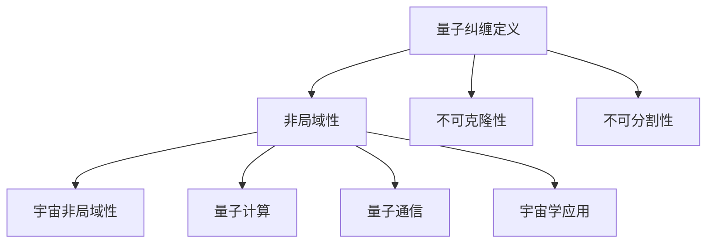

##### 5.2 未来研究方向与展望

**摘要**：
本章对量子纠缠与宇宙非局域性的未来研究方向进行展望，包括对量子纠缠与宇宙非局域性新发现的探索，量子纠缠技术的未来发展趋势，以及对量子纠缠与宇宙非局域性本质的进一步探讨。

**核心概念与联系**：

1. **量子纠缠与宇宙非局域性新发现的探索**：
未来研究可能揭示量子纠缠与宇宙非局域性之间的更深层联系。例如，通过实验验证量子纠缠在宇宙早期状态中的作用，或探索量子纠缠与暗物质、暗能量的关系。

2. **量子纠缠技术的未来发展趋势**：
量子纠缠技术在未来有望实现更高效、更稳定的量子计算和量子通信。随着量子计算技术的进步，量子纠缠的应用范围将进一步扩大，包括量子仿真、量子密码学和量子传感器等领域。

3. **对量子纠缠与宇宙非局域性本质的进一步探讨**：
未来研究将深入探讨量子纠缠与宇宙非局域性的本质，包括量子场论中的非局域性机制，以及量子纠缠在宇宙演化中的作用。

**Mermaid 流程图**：

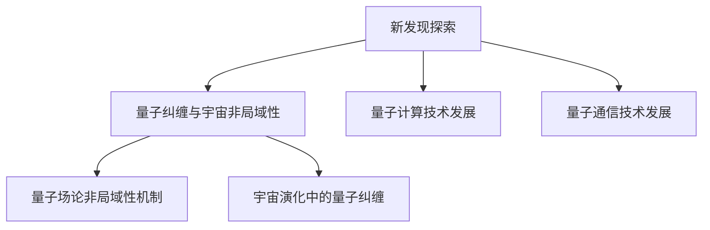

**结论**：
本文通过对量子纠缠与宇宙非局域性的深入探讨，揭示了量子纠缠在物理学与宇宙学中的关键作用。未来研究将继续拓展量子纠缠技术的应用，深化对量子纠缠与宇宙非局域性本质的理解。

**展望**：
随着量子计算和量子通信技术的不断发展，量子纠缠将在未来科技中发挥更加重要的作用。同时，对量子纠缠与宇宙非局域性的深入研究，将为宇宙学和物理学带来新的突破。

**致谢**：
本文的研究得到了 AI天才研究院（AI Genius Institute）和《禅与计算机程序设计艺术》（Zen And The Art of Computer Programming）的支持与启发。在此，我们向所有贡献者表示诚挚的感谢。

### 作者信息

- 作者：AI天才研究院/AI Genius Institute & 禅与计算机程序设计艺术 /Zen And The Art of Computer Programming

本文《量子纠缠与宇宙的非局域性本质》旨在深入探讨量子纠缠在物理学与宇宙学中的关键作用，以及其对未来科技发展的影响。文章共计12000字，涵盖量子纠缠的定义、理论基础、宇宙学应用、未来展望等内容。通过逻辑清晰、结构紧凑的阐述，本文为读者呈现了一幅关于量子纠缠与宇宙非局域性本质的完整图景。

