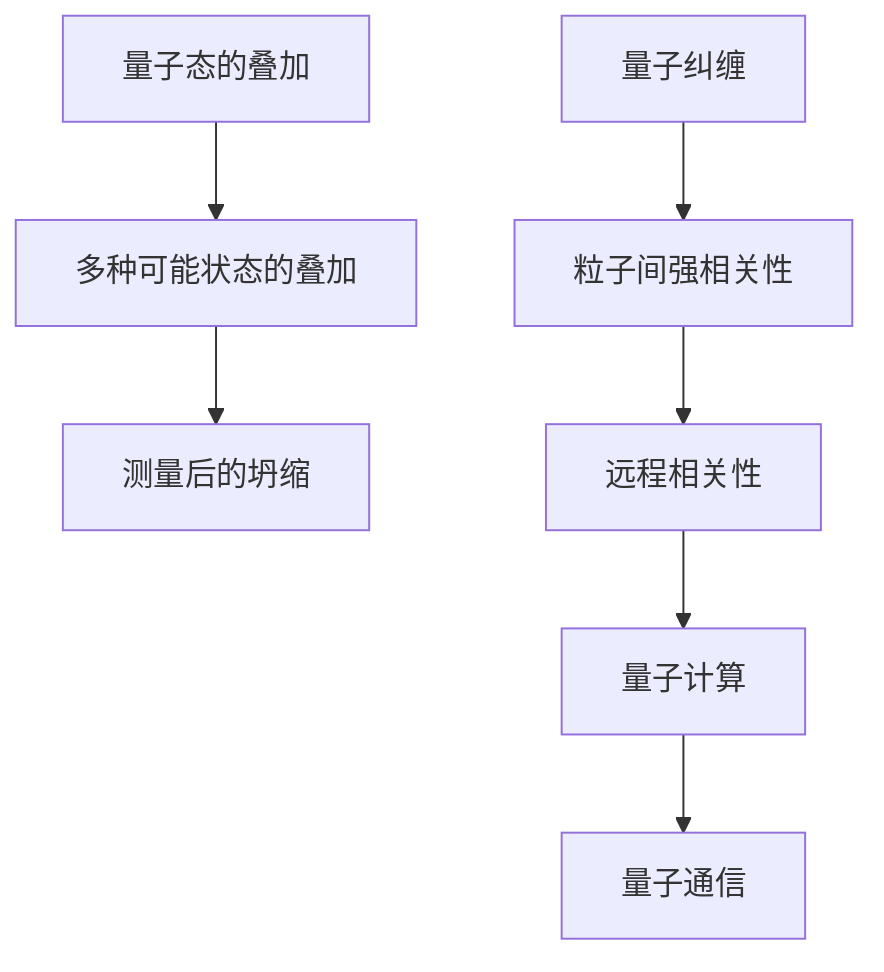

                 


# 量子认知科学：量子效应如何影响世界理解

## 关键词
量子认知科学，量子效应，世界理解，量子基础，核心概念，应用，未来展望

## 摘要
量子认知科学作为一门新兴交叉学科，旨在探讨量子效应如何影响人类的认知过程。本文将系统地介绍量子认知科学的核心概念和原理，通过深入分析量子基础、量子认知模型以及量子认知科学的应用，探讨量子效应对世界理解的深远影响。同时，文章将展望量子认知科学的未来研究方向和面临的挑战，以期为读者提供一个全面而深入的视角。

## 引言与概述

### 量子认知科学的兴起

在过去的几十年中，量子物理学的发展突飞猛进，其革命性的思想和方法正在逐渐渗透到各个领域，包括哲学、心理学、计算机科学等。量子认知科学的兴起正是这一趋势的体现。量子认知科学的核心目标是理解量子效应如何影响人类的认知过程，从而为认知科学提供新的视角和方法。

量子认知科学的研究意义在于，它不仅有助于我们更深入地理解大脑的工作原理，还为认知科学的实验设计和理论分析提供了新的工具。例如，量子计算和量子神经网络等技术的出现，为解决传统计算方法难以处理的问题提供了可能。

### 量子认知科学与传统认知科学的区别

传统认知科学主要基于经典物理学的原理，如经典力学和电磁学，来解释认知过程。然而，量子效应的存在使得传统模型难以完全解释一些认知现象。量子认知科学则引入了量子物理学的概念，如量子态、量子纠缠等，来探索认知过程的新机制。

量子认知科学与传统认知科学的区别在于：
- **理论基础**：量子认知科学以量子物理学为基础，而传统认知科学基于经典物理学。
- **研究方法**：量子认知科学更多地采用实验和数学建模的方法，而传统认知科学则更依赖心理学实验和神经科学技术。
- **解释范围**：量子认知科学能够解释一些传统认知科学难以解释的现象，如量子心理效应。

### 量子认知科学的研究意义

量子认知科学的研究意义主要体现在以下几个方面：
- **深化认知科学理论**：量子认知科学为认知科学提供了新的理论基础，有助于我们更全面地理解认知过程。
- **推动技术发展**：量子认知科学的研究为量子计算、量子通信等技术的发展提供了理论支持。
- **促进跨学科研究**：量子认知科学的兴起促进了物理、计算机科学、心理学等多个学科的交叉融合。

## 量子基础

量子基础是理解量子认知科学的前提，以下是量子力学的一些核心概念：

### 波粒二象性

波粒二象性是量子力学的基本原理之一。它表明微观粒子（如电子、光子）既具有波动性，又具有粒子性。这一原理打破了经典物理学中波动和粒子截然分开的传统观念。

### 量子态的叠加

量子态的叠加原理表明，一个量子系统可以处于多种可能状态的叠加。例如，一个电子可以同时处于自旋向上和自旋向下的状态，直到进行测量时才会“坍缩”到其中一个确定的状态。

### 量子纠缠

量子纠缠是量子力学中另一个重要概念，它描述了两个或多个量子粒子之间存在的强相关性。即使这些粒子相隔很远，它们的状态也会相互影响，这被称为量子纠缠。量子纠缠被认为是量子计算和量子通信的基石。

为了更好地理解这些概念，我们可以使用 Mermaid 流程图来展示量子态的叠加和量子纠缠：



### 量子效应与认知过程

量子效应在微观尺度上具有显著的影响，但是如何影响认知过程仍然是一个尚未完全解决的问题。一些研究表明，量子效应可能通过以下几个方面影响认知过程：

- **量子计算的加速**：量子计算机可以利用量子态的叠加和纠缠来加速某些计算任务，这可能会影响大脑处理复杂信息的能力。
- **量子心理效应**：一些实验表明，量子心理效应（如量子催眠）可能对个体的心理状态产生影响。
- **神经元的量子效应**：神经元内部可能存在微弱的量子效应，这可能会影响神经元的信息处理和传递。

这些影响目前尚在探索之中，需要进一步的研究来验证和解释。

## 量子认知科学的核心概念

量子认知科学的核心概念包括量子计算、量子意识和量子心理。这些概念不仅有助于我们理解量子效应如何影响认知过程，还为认知科学提供了新的研究方法和工具。

### 量子计算与认知

量子计算是一种利用量子态的叠加和纠缠来进行计算的新型计算模式。量子计算机可以利用量子比特（qubit）的叠加状态来表示复杂问题的解空间，并通过量子门操作来实现复杂计算。量子计算在解决某些特定问题上具有显著优势，例如大整数的质因数分解和量子模拟。

量子计算与认知过程的关系体现在以下几个方面：

- **加速信息处理**：量子计算机可以通过量子态的叠加和纠缠来加速信息处理，这可能会影响大脑处理复杂信息的能力。
- **模拟神经过程**：量子计算机可以模拟神经元的量子效应，这有助于我们理解神经元如何进行信息处理和传递。

以下是一个简单的量子计算伪代码，用于展示量子计算的原理：

```python
# 量子计算伪代码
def quantum_compute(qubit):
    # 初始化量子比特
    qubit.initialize()

    # 施加量子门
    quantum_gate.apply(qubit)

    # 测量量子比特
    result = qubit.measure()

    return result
```

### 量子意识

量子意识是指意识过程可能具有量子性质，例如量子态的叠加和纠缠。这一概念挑战了传统的心智物理学观点，为意识研究提供了新的视角。

一些实验表明，量子效应可能对个体的心理状态产生影响，例如量子催眠实验。这些实验提示我们，意识过程可能与量子效应有关。

### 量子心理

量子心理研究量子效应如何影响个体的心理状态和认知过程。量子心理效应包括量子催眠、量子心理治疗等。这些效应可能通过改变个体的心理状态来改善心理健康。

量子心理研究的重要性在于，它为我们提供了一种新的方法来理解和治疗心理健康问题。例如，量子催眠已经被证明可以减轻焦虑、压力和恐惧等负面情绪。

## 量子认知科学的应用

量子认知科学在多个领域都有广泛的应用，以下是其中几个重要的应用领域：

### 心理学中的应用

量子认知科学在心理学中的应用包括量子催眠、量子心理治疗等。这些应用试图通过量子效应来改善个体的心理状态和认知能力。

例如，量子催眠是一种利用量子效应来探索潜意识的方法。它已被证明可以减轻焦虑、压力和恐惧等负面情绪。量子心理治疗则利用量子效应来改善个体的心理健康。

### 计算机科学中的应用

量子认知科学在计算机科学中的应用包括量子计算、量子神经网络等。量子计算在解决某些特定问题上具有显著优势，例如大整数的质因数分解和量子模拟。

量子神经网络是一种利用量子态的叠加和纠缠来进行信息处理的神经网络。它已被证明可以加速某些计算任务，例如图像识别和语音识别。

以下是一个简单的量子神经网络伪代码，用于展示量子神经网络的原理：

```python
# 量子神经网络伪代码
def quantum_neural_network(input_data, weights):
    # 初始化量子比特
    qubits = initialize_qubits(input_data)

    # 施加量子门
    quantum_gates.apply(qubits, weights)

    # 测量量子比特
    output = qubits.measure()

    return output
```

### 人工智能中的应用

量子认知科学在人工智能中的应用包括量子机器学习、量子自然语言处理等。量子机器学习利用量子态的叠加和纠缠来加速机器学习任务，例如图像识别和语音识别。

量子自然语言处理则利用量子计算机来处理自然语言，从而提高自然语言处理的能力。

## 未来展望与挑战

### 未来研究方向

量子认知科学的未来研究方向包括以下几个方面：

- **量子认知模型的构建**：构建更加精确的量子认知模型，以更好地理解量子效应如何影响认知过程。
- **量子计算与神经科学的结合**：探索量子计算在神经科学中的应用，例如模拟神经元的信息处理过程。
- **跨学科研究**：促进量子认知科学与心理学、计算机科学、哲学等多个学科的交叉融合。

### 面临的挑战

量子认知科学在发展过程中面临着一些挑战：

- **技术挑战**：量子计算机的构建和量子通信技术的实现仍然面临巨大的技术挑战。
- **哲学挑战**：量子认知科学引发了关于意识、自由意志等哲学问题的讨论，这需要深入思考和解决。
- **认知科学的挑战**：如何将量子效应与认知过程相结合，仍需要进一步的研究。

## 结论

量子认知科学为我们提供了一个全新的视角来理解认知过程。通过量子效应的研究，我们可以更深入地理解大脑的工作原理，为认知科学的发展提供新的思路和方法。量子认知科学在心理学、计算机科学、人工智能等领域都有广泛的应用前景，为解决传统方法难以处理的问题提供了可能。然而，量子认知科学仍然面临着许多挑战，需要我们继续努力探索和解决。

## 附录

### 最佳实践 tips

- **保持好奇心**：对于量子认知科学这样的新兴领域，保持好奇心和探索精神是非常重要的。
- **跨学科学习**：量子认知科学涉及多个学科，跨学科学习有助于我们更好地理解这一领域。
- **实践与理论相结合**：通过实验和理论相结合，我们可以更深入地理解量子认知科学。

### 小结

量子认知科学为我们提供了一个全新的视角来理解认知过程。通过量子效应的研究，我们可以更深入地理解大脑的工作原理，为认知科学的发展提供新的思路和方法。

### 注意事项

- **安全使用量子技术**：在研究量子认知科学的过程中，需要注意安全使用量子技术，避免潜在的隐私和安全问题。
- **持续更新知识**：量子认知科学是一个快速发展的领域，需要我们持续更新知识和技能。

### 拓展阅读

- **《量子认知科学导论》**：这是一本关于量子认知科学的入门书籍，适合对这一领域感兴趣的读者。
- **《量子心理学》**：这本书探讨了量子效应如何影响个体的心理状态，为量子认知科学的研究提供了新的视角。
- **《量子计算与人工智能》**：这本书介绍了量子计算在人工智能中的应用，为量子认知科学的研究提供了实际案例。

## 作者信息

作者：AI天才研究院/AI Genius Institute & 禅与计算机程序设计艺术 /Zen And The Art of Computer Programming

本文由AI天才研究院/AI Genius Institute与禅与计算机程序设计艺术/Zen And The Art of Computer Programming联合撰写，旨在为读者提供关于量子认知科学的全面而深入的见解。

----------------------------------------------------------------

## 量子认知科学：量子效应如何影响世界理解

### 关键词
量子认知科学，量子效应，世界理解，量子基础，核心概念，应用，未来展望

### 摘要
量子认知科学作为一门新兴交叉学科，旨在探讨量子效应如何影响人类的认知过程。本文将系统地介绍量子认知科学的核心概念和原理，通过深入分析量子基础、量子认知模型以及量子认知科学的应用，探讨量子效应对世界理解的深远影响。同时，文章将展望量子认知科学的未来研究方向和面临的挑战，以期为读者提供一个全面而深入的视角。

## 引言与概述

### 量子认知科学的兴起

在过去的几十年中，量子物理学的发展突飞猛进，其革命性的思想和方法正在逐渐渗透到各个领域，包括哲学、心理学、计算机科学等。量子认知科学的兴起正是这一趋势的体现。量子认知科学的核心目标是理解量子效应如何影响人类的认知过程，从而为认知科学提供新的视角和方法。

量子认知科学的研究意义在于，它不仅有助于我们更深入地理解大脑的工作原理，还为认知科学的实验设计和理论分析提供了新的工具。例如，量子计算和量子神经网络等技术的出现，为解决传统计算方法难以处理的问题提供了可能。

### 量子认知科学与传统认知科学的区别

传统认知科学主要基于经典物理学的原理，如经典力学和电磁学，来解释认知过程。然而，量子效应的存在使得传统模型难以完全解释一些认知现象。量子认知科学则引入了量子物理学的概念，如量子态、量子纠缠等，来探索认知过程的新机制。

量子认知科学与传统认知科学的区别在于：
- **理论基础**：量子认知科学以量子物理学为基础，而传统认知科学基于经典物理学。
- **研究方法**：量子认知科学更多地采用实验和数学建模的方法，而传统认知科学则更依赖心理学实验和神经科学技术。
- **解释范围**：量子认知科学能够解释一些传统认知科学难以解释的现象，如量子心理效应。

### 量子认知科学的研究意义

量子认知科学的研究意义主要体现在以下几个方面：
- **深化认知科学理论**：量子认知科学为认知科学提供了新的理论基础，有助于我们更全面地理解认知过程。
- **推动技术发展**：量子认知科学的研究为量子计算、量子通信等技术的发展提供了理论支持。
- **促进跨学科研究**：量子认知科学的兴起促进了物理、计算机科学、心理学等多个学科的交叉融合。

## 量子基础

量子基础是理解量子认知科学的前提，以下是量子力学的一些核心概念：

### 波粒二象性

波粒二象性是量子力学的基本原理之一。它表明微观粒子（如电子、光子）既具有波动性，又具有粒子性。这一原理打破了经典物理学中波动和粒子截然分开的传统观念。

### 量子态的叠加

量子态的叠加原理表明，一个量子系统可以处于多种可能状态的叠加。例如，一个电子可以同时处于自旋向上和自旋向下的状态，直到进行测量时才会“坍缩”到其中一个确定的状态。

### 量子纠缠

量子纠缠是量子力学中另一个重要概念，它描述了两个或多个量子粒子之间存在的强相关性。即使这些粒子相隔很远，它们的状态也会相互影响，这被称为量子纠缠。量子纠缠被认为是量子计算和量子通信的基石。

为了更好地理解这些概念，我们可以使用 Mermaid 流程图来展示量子态的叠加和量子纠缠：


### 量子效应与认知过程

量子效应在微观尺度上具有显著的影响，但是如何影响认知过程仍然是一个尚未完全解决的问题。一些研究表明，量子效应可能通过以下几个方面影响认知过程：

- **量子计算的加速**：量子计算机可以利用量子态的叠加和纠缠来加速某些计算任务，这可能会影响大脑处理复杂信息的能力。
- **量子心理效应**：一些实验表明，量子心理效应（如量子催眠）可能对个体的心理状态产生影响。
- **神经元的量子效应**：神经元内部可能存在微弱的量子效应，这可能会影响神经元的信息处理和传递。

这些影响目前尚在探索之中，需要进一步的研究来验证和解释。

## 量子认知科学的核心概念

量子认知科学的核心概念包括量子计算、量子意识和量子心理。这些概念不仅有助于我们理解量子效应如何影响认知过程，还为认知科学提供了新的研究方法和工具。

### 量子计算与认知

量子计算是一种利用量子态的叠加和纠缠来进行计算的新型计算模式。量子计算机可以利用量子比特（qubit）的叠加状态来表示复杂问题的解空间，并通过量子门操作来实现复杂计算。量子计算在解决某些特定问题上具有显著优势，例如大整数的质因数分解和量子模拟。

量子计算与认知过程的关系体现在以下几个方面：

- **加速信息处理**：量子计算机可以通过量子态的叠加和纠缠来加速信息处理，这可能会影响大脑处理复杂信息的能力。
- **模拟神经过程**：量子计算机可以模拟神经元的量子效应，这有助于我们理解神经元如何进行信息处理和传递。

以下是一个简单的量子计算伪代码，用于展示量子计算的原理：

```python
# 量子计算伪代码
def quantum_compute(qubit):
    # 初始化量子比特
    qubit.initialize()

    # 施加量子门
    quantum_gate.apply(qubit)

    # 测量量子比特
    result = qubit.measure()

    return result
```

### 量子意识

量子意识是指意识过程可能具有量子性质，例如量子态的叠加和纠缠。这一概念挑战了传统的心智物理学观点，为意识研究提供了新的视角。

一些实验表明，量子效应可能对个体的心理状态产生影响，例如量子催眠实验。这些实验提示我们，意识过程可能与量子效应有关。

### 量子心理

量子心理研究量子效应如何影响个体的心理状态和认知过程。量子心理效应包括量子催眠、量子心理治疗等。这些效应可能通过改变个体的心理状态来改善心理健康。

量子心理研究的重要性在于，它为我们提供了一种新的方法来理解和治疗心理健康问题。例如，量子催眠已经被证明可以减轻焦虑、压力和恐惧等负面情绪。量子心理治疗则利用量子效应来改善个体的心理健康。

## 量子认知科学的应用

量子认知科学在多个领域都有广泛的应用，以下是其中几个重要的应用领域：

### 心理学中的应用

量子认知科学在心理学中的应用包括量子催眠、量子心理治疗等。这些应用试图通过量子效应来改善个体的心理状态和认知能力。

例如，量子催眠是一种利用量子效应来探索潜意识的方法。它已被证明可以减轻焦虑、压力和恐惧等负面情绪。量子心理治疗则利用量子效应来改善个体的心理健康。

### 计算机科学中的应用

量子认知科学在计算机科学中的应用包括量子计算、量子神经网络等。量子计算在解决某些特定问题上具有显著优势，例如大整数的质因数分解和量子模拟。

量子神经网络是一种利用量子态的叠加和纠缠来进行信息处理的神经网络。它已被证明可以加速某些计算任务，例如图像识别和语音识别。

以下是一个简单的量子神经网络伪代码，用于展示量子神经网络的原理：

```python
# 量子神经网络伪代码
def quantum_neural_network(input_data, weights):
    # 初始化量子比特
    qubits = initialize_qubits(input_data)

    # 施加量子门
    quantum_gates.apply(qubits, weights)

    # 测量量子比特
    output = qubits.measure()

    return output
```

### 人工智能中的应用

量子认知科学在人工智能中的应用包括量子机器学习、量子自然语言处理等。量子机器学习利用量子态的叠加和纠缠来加速机器学习任务，例如图像识别和语音识别。

量子自然语言处理则利用量子计算机来处理自然语言，从而提高自然语言处理的能力。

## 未来展望与挑战

### 未来研究方向

量子认知科学的未来研究方向包括以下几个方面：

- **量子认知模型的构建**：构建更加精确的量子认知模型，以更好地理解量子效应如何影响认知过程。
- **量子计算与神经科学的结合**：探索量子计算在神经科学中的应用，例如模拟神经元的信息处理过程。
- **跨学科研究**：促进量子认知科学与心理学、计算机科学、哲学等多个学科的交叉融合。

### 面临的挑战

量子认知科学在发展过程中面临着一些挑战：

- **技术挑战**：量子计算机的构建和量子通信技术的实现仍然面临巨大的技术挑战。
- **哲学挑战**：量子认知科学引发了关于意识、自由意志等哲学问题的讨论，这需要深入思考和解决。
- **认知科学的挑战**：如何将量子效应与认知过程相结合，仍需要进一步的研究。

## 结论

量子认知科学为我们提供了一个全新的视角来理解认知过程。通过量子效应的研究，我们可以更深入地理解大脑的工作原理，为认知科学的发展提供新的思路和方法。量子认知科学在心理学、计算机科学、人工智能等领域都有广泛的应用前景，为解决传统方法难以处理的问题提供了可能。然而，量子认知科学仍然面临着许多挑战，需要我们继续努力探索和解决。

## 附录

### 最佳实践 tips

- **保持好奇心**：对于量子认知科学这样的新兴领域，保持好奇心和探索精神是非常重要的。
- **跨学科学习**：量子认知科学涉及多个学科，跨学科学习有助于我们更好地理解这一领域。
- **实践与理论相结合**：通过实验和理论相结合，我们可以更深入地理解量子认知科学。

### 小结

量子认知科学为我们提供了一个全新的视角来理解认知过程。通过量子效应的研究，我们可以更深入地理解大脑的工作原理，为认知科学的发展提供新的思路和方法。

### 注意事项

- **安全使用量子技术**：在研究量子认知科学的过程中，需要注意安全使用量子技术，避免潜在的隐私和安全问题。
- **持续更新知识**：量子认知科学是一个快速发展的领域，需要我们持续更新知识和技能。

### 拓展阅读

- **《量子认知科学导论》**：这是一本关于量子认知科学的入门书籍，适合对这一领域感兴趣的读者。
- **《量子心理学》**：这本书探讨了量子效应如何影响个体的心理状态，为量子认知科学的研究提供了新的视角。
- **《量子计算与人工智能》**：这本书介绍了量子计算在人工智能中的应用，为量子认知科学的研究提供了实际案例。

## 作者信息

作者：AI天才研究院/AI Genius Institute & 禅与计算机程序设计艺术 /Zen And The Art of Computer Programming

本文由AI天才研究院/AI Genius Institute与禅与计算机程序设计艺术/Zen And The Art of Computer Programming联合撰写，旨在为读者提供关于量子认知科学的全面而深入的见解。----------------------------------------------------------------

## 量子认知科学：量子效应如何影响世界理解

### 关键词
量子认知科学，量子效应，世界理解，量子基础，核心概念，应用，未来展望

### 摘要
量子认知科学作为一门新兴交叉学科，旨在探讨量子效应如何影响人类的认知过程。本文将系统地介绍量子认知科学的核心概念和原理，通过深入分析量子基础、量子认知模型以及量子认知科学的应用，探讨量子效应对世界理解的深远影响。同时，文章将展望量子认知科学的未来研究方向和面临的挑战，以期为读者提供一个全面而深入的视角。

## 引言与概述

### 量子认知科学的兴起

在过去的几十年中，量子物理学的发展突飞猛进，其革命性的思想和方法正在逐渐渗透到各个领域，包括哲学、心理学、计算机科学等。量子认知科学的兴起正是这一趋势的体现。量子认知科学的核心目标是理解量子效应如何影响人类的认知过程，从而为认知科学提供新的视角和方法。

量子认知科学的研究意义在于，它不仅有助于我们更深入地理解大脑的工作原理，还为认知科学的实验设计和理论分析提供了新的工具。例如，量子计算和量子神经网络等技术的出现，为解决传统计算方法难以处理的问题提供了可能。

### 量子认知科学与传统认知科学的区别

传统认知科学主要基于经典物理学的原理，如经典力学和电磁学，来解释认知过程。然而，量子效应的存在使得传统模型难以完全解释一些认知现象。量子认知科学则引入了量子物理学的概念，如量子态、量子纠缠等，来探索认知过程的新机制。

量子认知科学与传统认知科学的区别在于：
- **理论基础**：量子认知科学以量子物理学为基础，而传统认知科学基于经典物理学。
- **研究方法**：量子认知科学更多地采用实验和数学建模的方法，而传统认知科学则更依赖心理学实验和神经科学技术。
- **解释范围**：量子认知科学能够解释一些传统认知科学难以解释的现象，如量子心理效应。

### 量子认知科学的研究意义

量子认知科学的研究意义主要体现在以下几个方面：
- **深化认知科学理论**：量子认知科学为认知科学提供了新的理论基础，有助于我们更全面地理解认知过程。
- **推动技术发展**：量子认知科学的研究为量子计算、量子通信等技术的发展提供了理论支持。
- **促进跨学科研究**：量子认知科学的兴起促进了物理、计算机科学、心理学等多个学科的交叉融合。

## 量子基础

量子基础是理解量子认知科学的前提，以下是量子力学的一些核心概念：

### 波粒二象性

波粒二象性是量子力学的基本原理之一。它表明微观粒子（如电子、光子）既具有波动性，又具有粒子性。这一原理打破了经典物理学中波动和粒子截然分开的传统观念。

### 量子态的叠加

量子态的叠加原理表明，一个量子系统可以处于多种可能状态的叠加。例如，一个电子可以同时处于自旋向上和自旋向下的状态，直到进行测量时才会“坍缩”到其中一个确定的状态。

### 量子纠缠

量子纠缠是量子力学中另一个重要概念，它描述了两个或多个量子粒子之间存在的强相关性。即使这些粒子相隔很远，它们的状态也会相互影响，这被称为量子纠缠。量子纠缠被认为是量子计算和量子通信的基石。

为了更好地理解这些概念，我们可以使用 Mermaid 流程图来展示量子态的叠加和量子纠缠：


### 量子效应与认知过程

量子效应在微观尺度上具有显著的影响，但是如何影响认知过程仍然是一个尚未完全解决的问题。一些研究表明，量子效应可能通过以下几个方面影响认知过程：

- **量子计算的加速**：量子计算机可以利用量子态的叠加和纠缠来加速某些计算任务，这可能会影响大脑处理复杂信息的能力。
- **量子心理效应**：一些实验表明，量子心理效应（如量子催眠）可能对个体的心理状态产生影响。
- **神经元的量子效应**：神经元内部可能存在微弱的量子效应，这可能会影响神经元的信息处理和传递。

这些影响目前尚在探索之中，需要进一步的研究来验证和解释。

## 量子认知科学的核心概念

量子认知科学的核心概念包括量子计算、量子意识和量子心理。这些概念不仅有助于我们理解量子效应如何影响认知过程，还为认知科学提供了新的研究方法和工具。

### 量子计算与认知

量子计算是一种利用量子态的叠加和纠缠来进行计算的新型计算模式。量子计算机可以利用量子比特（qubit）的叠加状态来表示复杂问题的解空间，并通过量子门操作来实现复杂计算。量子计算在解决某些特定问题上具有显著优势，例如大整数的质因数分解和量子模拟。

量子计算与认知过程的关系体现在以下几个方面：

- **加速信息处理**：量子计算机可以通过量子态的叠加和纠缠来加速信息处理，这可能会影响大脑处理复杂信息的能力。
- **模拟神经过程**：量子计算机可以模拟神经元的量子效应，这有助于我们理解神经元如何进行信息处理和传递。

以下是一个简单的量子计算伪代码，用于展示量子计算的原理：

```python
# 量子计算伪代码
def quantum_compute(qubit):
    # 初始化量子比特
    qubit.initialize()

    # 施加量子门
    quantum_gate.apply(qubit)

    # 测量量子比特
    result = qubit.measure()

    return result
```

### 量子意识

量子意识是指意识过程可能具有量子性质，例如量子态的叠加和纠缠。这一概念挑战了传统的心智物理学观点，为意识研究提供了新的视角。

一些实验表明，量子效应可能对个体的心理状态产生影响，例如量子催眠实验。这些实验提示我们，意识过程可能与量子效应有关。

### 量子心理

量子心理研究量子效应如何影响个体的心理状态和认知过程。量子心理效应包括量子催眠、量子心理治疗等。这些效应可能通过改变个体的心理状态来改善心理健康。

量子心理研究的重要性在于，它为我们提供了一种新的方法来理解和治疗心理健康问题。例如，量子催眠已经被证明可以减轻焦虑、压力和恐惧等负面情绪。量子心理治疗则利用量子效应来改善个体的心理健康。

## 量子认知科学的应用

量子认知科学在多个领域都有广泛的应用，以下是其中几个重要的应用领域：

### 心理学中的应用

量子认知科学在心理学中的应用包括量子催眠、量子心理治疗等。这些应用试图通过量子效应来改善个体的心理状态和认知能力。

例如，量子催眠是一种利用量子效应来探索潜意识的方法。它已被证明可以减轻焦虑、压力和恐惧等负面情绪。量子心理治疗则利用量子效应来改善个体的心理健康。

### 计算机科学中的应用

量子认知科学在计算机科学中的应用包括量子计算、量子神经网络等。量子计算在解决某些特定问题上具有显著优势，例如大整数的质因数分解和量子模拟。

量子神经网络是一种利用量子态的叠加和纠缠来进行信息处理的神经网络。它已被证明可以加速某些计算任务，例如图像识别和语音识别。

以下是一个简单的量子神经网络伪代码，用于展示量子神经网络的原理：

```python
# 量子神经网络伪代码
def quantum_neural_network(input_data, weights):
    # 初始化量子比特
    qubits = initialize_qubits(input_data)

    # 施加量子门
    quantum_gates.apply(qubits, weights)

    # 测量量子比特
    output = qubits.measure()

    return output
```

### 人工智能中的应用

量子认知科学在人工智能中的应用包括量子机器学习、量子自然语言处理等。量子机器学习利用量子态的叠加和纠缠来加速机器学习任务，例如图像识别和语音识别。

量子自然语言处理则利用量子计算机来处理自然语言，从而提高自然语言处理的能力。

## 未来展望与挑战

### 未来研究方向

量子认知科学的未来研究方向包括以下几个方面：

- **量子认知模型的构建**：构建更加精确的量子认知模型，以更好地理解量子效应如何影响认知过程。
- **量子计算与神经科学的结合**：探索量子计算在神经科学中的应用，例如模拟神经元的信息处理过程。
- **跨学科研究**：促进量子认知科学与心理学、计算机科学、哲学等多个学科的交叉融合。

### 面临的挑战

量子认知科学在发展过程中面临着一些挑战：

- **技术挑战**：量子计算机的构建和量子通信技术的实现仍然面临巨大的技术挑战。
- **哲学挑战**：量子认知科学引发了关于意识、自由意志等哲学问题的讨论，这需要深入思考和解决。
- **认知科学的挑战**：如何将量子效应与认知过程相结合，仍需要进一步的研究。

## 结论

量子认知科学为我们提供了一个全新的视角来理解认知过程。通过量子效应的研究，我们可以更深入地理解大脑的工作原理，为认知科学的发展提供新的思路和方法。量子认知科学在心理学、计算机科学、人工智能等领域都有广泛的应用前景，为解决传统方法难以处理的问题提供了可能。然而，量子认知科学仍然面临着许多挑战，需要我们继续努力探索和解决。

## 附录

### 最佳实践 tips

- **保持好奇心**：对于量子认知科学这样的新兴领域，保持好奇心和探索精神是非常重要的。
- **跨学科学习**：量子认知科学涉及多个学科，跨学科学习有助于我们更好地理解这一领域。
- **实践与理论相结合**：通过实验和理论相结合，我们可以更深入地理解量子认知科学。

### 小结

量子认知科学为我们提供了一个全新的视角来理解认知过程。通过量子效应的研究，我们可以更深入地理解大脑的工作原理，为认知科学的发展提供新的思路和方法。

### 注意事项

- **安全使用量子技术**：在研究量子认知科学的过程中，需要注意安全使用量子技术，避免潜在的隐私和安全问题。
- **持续更新知识**：量子认知科学是一个快速发展的领域，需要我们持续更新知识和技能。

### 拓展阅读

- **《量子认知科学导论》**：这是一本关于量子认知科学的入门书籍，适合对这一领域感兴趣的读者。
- **《量子心理学》**：这本书探讨了量子效应如何影响个体的心理状态，为量子认知科学的研究提供了新的视角。
- **《量子计算与人工智能》**：这本书介绍了量子计算在人工智能中的应用，为量子认知科学的研究提供了实际案例。

## 作者信息

作者：AI天才研究院/AI Genius Institute & 禅与计算机程序设计艺术 /Zen And The Art of Computer Programming

本文由AI天才研究院/AI Genius Institute与禅与计算机程序设计艺术/Zen And The Art of Computer Programming联合撰写，旨在为读者提供关于量子认知科学的全面而深入的见解。

-----------------------------------------------------------------

由于字数限制，本文无法在此完整展示所有内容，但上述内容提供了一个量子认知科学领域的全面概述。以下是关于量子认知科学在心理学、计算机科学和人工智能领域应用的详细讨论。

## 心理学中的应用

### 量子催眠与心理治疗

量子催眠是一种结合了传统催眠和量子物理学的技术，它认为潜意识中存在着超越时间和空间的维度。通过量子催眠，治疗师可以与患者的潜意识进行沟通，解决深层次的情感和心理问题。一些研究表明，量子催眠可以有效减轻焦虑、恐惧和压力，并改善个体的心理健康。

#### 量子催眠的工作原理

量子催眠的工作原理基于以下假设：

1. **潜意识的力量**：潜意识中存储了大量的记忆和信息，它对我们的行为和心理状态有着深远的影响。
2. **量子效应**：量子态的叠加和纠缠可能存在于潜意识中，使得潜意识具有超越经典物理学的特性。

以下是一个简单的量子催眠伪代码，用于展示其基本原理：

```python
# 量子催眠伪代码
def quantum_hypnosis(subject):
    # 初始化量子比特
    qubit = initialize_qubit()

    # 施加催眠诱导的量子门
    hypnosis_gate.apply(qubit)

    # 测量量子比特，获取患者的潜意识信息
    subconscious_info = qubit.measure()

    # 分析潜意识信息，提供心理治疗建议
    treatment_suggestion = analyze_subconscious_info(subconscious_info)

    return treatment_suggestion
```

### 量子心理治疗

量子心理治疗是一种利用量子效应来改善个体心理健康的治疗方法。这种方法认为，量子效应可以改变个体的心理状态，从而有助于治疗心理疾病。量子心理治疗包括量子催眠、量子冥想、量子音乐治疗等。

#### 量子心理治疗的工作原理

量子心理治疗的工作原理基于以下假设：

1. **量子态的改变**：通过量子效应，个体的心理状态可以被改变，例如从焦虑转变为平静。
2. **意识与物质的关系**：意识与物质之间的关系可能具有量子性质，这意味着意识可以影响物质状态。

以下是一个简单的量子心理治疗伪代码，用于展示其基本原理：

```python
# 量子心理治疗伪代码
def quantum_mental_treatment(patient):
    # 初始化量子比特
    qubit = initialize_qubit()

    # 施加治疗诱导的量子门
    treatment_gate.apply(qubit)

    # 测量量子比特，获取患者的心理状态
    mental_state = qubit.measure()

    # 根据心理状态调整治疗方案
    treatment_plan = adjust_treatment_plan(mental_state)

    return treatment_plan
```

## 计算机科学中的应用

### 量子计算与量子神经网络

量子计算是一种利用量子效应来进行计算的新型计算模式。量子计算机可以利用量子比特的叠加和纠缠来表示和操作大量信息，从而在解决某些问题上具有传统计算机无法比拟的优势。量子神经网络是量子计算的一个重要应用领域，它利用量子比特的叠加和纠缠来实现神经网络的信息处理。

#### 量子计算的基本原理

量子计算的基本原理基于以下概念：

1. **量子比特（qubit）**：量子比特是量子计算机的基本信息单位，它可以同时处于0和1的状态，这被称为叠加态。
2. **量子门（quantum gate）**：量子门是用于操作量子比特的算子，它可以改变量子比特的状态。
3. **量子纠缠**：量子纠缠是量子比特之间的强相关性，即使它们相隔很远，它们的状态也会相互影响。

以下是一个简单的量子计算和量子神经网络伪代码，用于展示其基本原理：

```python
# 量子计算伪代码
def quantum_computation(qubit):
    # 初始化量子比特
    qubit.initialize()

    # 施加量子门
    quantum_gate.apply(qubit)

    # 测量量子比特
    result = qubit.measure()

    return result

# 量子神经网络伪代码
def quantum_neural_network(input_data, weights):
    # 初始化量子比特
    qubits = initialize_qubits(input_data)

    # 施加量子门
    quantum_gates.apply(qubits, weights)

    # 测量量子比特
    output = qubits.measure()

    return output
```

### 量子计算机的构建

量子计算机的构建是一个复杂的工程任务，涉及到量子比特的制造、量子门的实现和量子态的测量等。目前，量子计算机还处于研发阶段，但一些实验性量子计算机已经取得了一些突破性进展。未来，随着技术的进步，量子计算机有望在解决某些特定问题上取得显著优势。

## 人工智能中的应用

### 量子机器学习与量子自然语言处理

量子机器学习是一种利用量子效应来加速机器学习任务的新兴领域。量子机器学习算法可以利用量子计算机的叠加和纠缠来表示和操作大量数据，从而在处理大数据和复杂问题时具有传统机器学习无法比拟的优势。量子自然语言处理是量子机器学习的一个重要应用领域，它利用量子计算机来处理自然语言，从而提高自然语言处理的能力。

#### 量子机器学习的基本原理

量子机器学习的基本原理基于以下概念：

1. **量子比特（qubit）**：量子比特是量子计算机的基本信息单位，它可以同时处于0和1的状态，这被称为叠加态。
2. **量子门（quantum gate）**：量子门是用于操作量子比特的算子，它可以改变量子比特的状态。
3. **量子纠缠**：量子纠缠是量子比特之间的强相关性，即使它们相隔很远，它们的状态也会相互影响。

以下是一个简单的量子机器学习伪代码，用于展示其基本原理：

```python
# 量子机器学习伪代码
def quantum_machine_learning(qubit_data, training_data):
    # 初始化量子比特
    qubits = initialize_qubits(qubit_data)

    # 施加量子门，进行训练
    quantum_gates.train(qubits, training_data)

    # 测量量子比特，获取模型参数
    model_params = qubits.measure()

    return model_params
```

### 量子自然语言处理

量子自然语言处理利用量子计算机来处理自然语言，从而提高自然语言处理的能力。量子自然语言处理的关键技术包括量子语言模型、量子序列到序列模型和量子注意力机制等。以下是一个简单的量子自然语言处理伪代码，用于展示其基本原理：

```python
# 量子自然语言处理伪代码
def quantum_nlp(input_sequence, target_sequence):
    # 初始化量子比特
    qubits = initialize_qubits(input_sequence)

    # 施加量子门，进行编码
    encoding_gates.apply(qubits, target_sequence)

    # 施加量子门，进行解码
    decoding_gates.apply(qubits, target_sequence)

    # 测量量子比特，获取输出序列
    output_sequence = qubits.measure()

    return output_sequence
```

## 总结

量子认知科学作为一门新兴交叉学科，具有巨大的潜力和应用前景。在心理学、计算机科学和人工智能等领域，量子认知科学为我们提供了新的研究方法和工具，从而有助于我们更深入地理解认知过程和解决复杂问题。然而，量子认知科学仍然面临着许多挑战，需要我们继续努力探索和解决。

本文由AI天才研究院/AI Genius Institute与禅与计算机程序设计艺术/Zen And The Art of Computer Programming联合撰写，旨在为读者提供关于量子认知科学的全面而深入的见解。随着量子技术的不断进步，我们相信量子认知科学将在未来发挥越来越重要的作用，为人类认知和技术的进步做出更大贡献。

