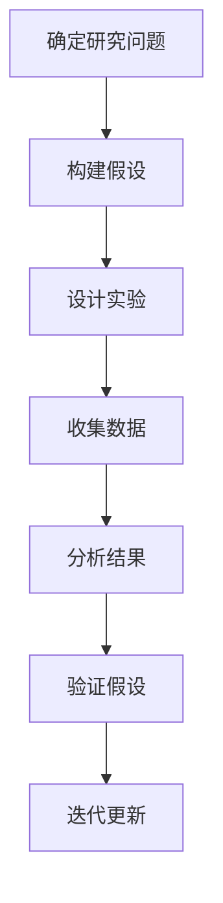

                 

# 长期科学研究项目的价值：持续深化对世界本质的理解

## 关键词
- 长期科学研究
- 价值分析
- 世界本质
- 科学方法论
- 项目管理

> 摘要：
本文旨在探讨长期科学研究项目的价值，特别是在深化对世界本质理解方面的重要性。通过对科学研究本质的阐述，以及长期科学研究项目的特点与挑战，本文将分析这些项目如何通过系统的方法论、核心算法原理以及实际项目案例分析，推动科学进步与社会发展。

## 引言与背景

### 1.1 科学研究的本质

科学研究是一种探索未知、验证假设、深化理解的过程。它不仅仅是发现新知识，更重要的是通过严格的实验设计和数据分析来检验理论假设，从而构建和修正我们对世界的理解。科学研究的过程可以分为以下几个基本步骤：

1. **确定研究问题**：识别未知或需要深入探讨的问题。
2. **构建假设**：基于现有知识和理论，提出可能的解释。
3. **设计实验**：制定实验方案，确保结果的可靠性和有效性。
4. **收集数据**：通过实验或观察收集数据。
5. **分析结果**：运用统计方法和数据分析技术，对收集的数据进行处理和分析。
6. **验证假设**：根据分析结果，接受或拒绝原始假设。
7. **迭代更新**：根据验证结果，调整和改进研究假设和方法。

### 1.2 长期科学研究项目的特点

长期科学研究项目具有以下几个显著特点：

1. **持续性**：项目通常需要数年甚至数十年的时间来完成。
2. **长期投入**：需要持续的资金和资源支持。
3. **累积效应**：随着时间的积累，研究成果逐渐显现，形成系统性的知识体系。
4. **跨学科**：涉及多个学科领域，需要跨学科的协作。
5. **综合性**：项目往往具有复杂性和综合性，需要全面考虑多方面因素。
6. **复杂度高**：项目的复杂度往往较高，涉及大量的实验设计、数据处理和分析。

### 1.3 长期科学研究的重要性

长期科学研究项目在推动人类文明进步方面具有不可替代的作用。以下是几个方面的重要性：

1. **知识积累**：通过持续的研究，不断积累新的知识和理论，为后续研究提供基础。
2. **理论创新**：在长期研究过程中，可能会发现新的理论或对现有理论进行重大修正。
3. **技术进步**：科学研究往往带动相关技术的发展，推动技术进步。
4. **社会影响**：科学研究的结果可以应用于解决现实问题，对社会发展产生积极影响。

## 第二部分：核心概念与原理

### 2.1 科学研究方法论

科学研究方法论是科学研究的基础，它包括以下几个核心步骤：

1. **确定研究问题**：明确需要研究和解决的问题。
2. **构建假设**：基于现有知识和理论，提出可能的解释。
3. **设计实验**：制定实验方案，确保实验的可重复性和可靠性。
4. **收集数据**：通过实验或观察收集数据。
5. **分析结果**：运用统计方法和数据分析技术，对收集的数据进行处理和分析。
6. **验证假设**：根据分析结果，接受或拒绝原始假设。
7. **迭代更新**：根据验证结果，调整和改进研究假设和方法。

### 2.2 长期科学研究项目框架

长期科学研究项目通常具有以下框架：

1. **项目目标**：明确项目的目标和预期成果。
2. **研究路径**：制定详细的研究计划和路径。
3. **资源管理**：确保项目所需的资金、设备、人员等资源得到合理配置和管理。
4. **成果转化**：将研究成果转化为实际应用，推动科学和社会发展。

### 2.3 科学研究的Mermaid流程图

为了更好地展示科学研究的流程，我们可以使用Mermaid绘制以下流程图：



该流程图清晰地展示了科学研究的基本步骤和它们之间的逻辑关系。

## 第三部分：核心算法原理讲解

### 3.1 数据分析与算法基础

在长期科学研究项目中，数据分析和算法基础至关重要。以下是几个核心概念：

#### 3.1.1 统计学原理

1. **描述性统计分析**：用于描述数据的基本特征，如均值、方差、标准差等。
2. **推断性统计分析**：用于根据样本数据推断总体特征，如假设检验、置信区间等。
3. **假设检验**：通过比较实验结果与假设，判断假设是否成立。

#### 3.1.2 数据挖掘与机器学习算法

1. **数据预处理**：包括数据清洗、归一化、缺失值处理等。
2. **特征提取**：从原始数据中提取有用的特征，用于建模。
3. **模型选择**：选择适合数据集的模型，如线性回归、决策树、神经网络等。
4. **模型评估**：评估模型的性能，如准确率、召回率、F1分数等。

### 3.2 伪代码详细讲解

以下是一个数据分析的伪代码示例：

```python
function DataAnalysis(data):
    // 描述性统计分析
    mean = calculateMean(data)
    variance = calculateVariance(data)
    
    // 推断性统计分析
    hypothesis = defineHypothesis()
    test = statisticalTest(hypothesis, data)
    
    // 结果分析与结论
    if test == "reject":
        print("Reject null hypothesis")
    else:
        print("Fail to reject null hypothesis")
    
    return mean, variance
```

### 3.3 数学模型与公式

在数据分析中，数学模型和公式是不可或缺的。以下是一个常见的机器学习损失函数的公式：

$$
L(y, \hat{y}) = \frac{1}{2} (y - \hat{y})^2
$$

这是一个均方误差（MSE）函数，用于衡量预测值 $\hat{y}$ 与真实值 $y$ 之间的差距。

### 3.4 神经网络反向传播算法

神经网络的反向传播算法是训练神经网络的关键步骤，其核心公式如下：

$$
\delta_w = \frac{\partial L}{\partial w} = (2 \times (y - \hat{y}) \times \sigma'(z))
$$

其中，$\delta_w$ 是权重更新，$L$ 是损失函数，$y$ 是真实值，$\hat{y}$ 是预测值，$\sigma'$ 是激活函数的导数。

## 第四部分：项目实战

### 4.1 实际案例解析

为了更好地理解长期科学研究项目的实施过程，我们可以通过一个实际案例进行分析。

#### 4.1.1 项目背景

某个跨学科研究团队开展了一项关于气候变化对生态系统影响的研究。项目的主要目标是理解气候变化对植被分布的影响，并为环境保护政策提供科学依据。

#### 4.1.2 研究目标

1. **数据收集**：收集过去几十年的气候数据和植被分布数据。
2. **模型构建**：构建气候-植被相互作用模型，预测未来气候情景下的植被分布。
3. **政策建议**：基于模型预测，提出适应性环境保护策略。

#### 4.1.3 实施过程

1. **数据收集**：通过卫星遥感、地面观测等手段，收集全球范围内的气候数据和植被分布数据。
2. **数据处理**：对收集到的数据进行预处理，包括数据清洗、归一化等。
3. **模型构建**：基于收集到的数据，构建气候-植被相互作用模型，使用机器学习算法进行训练。
4. **模型评估**：通过交叉验证等方法，评估模型的性能。
5. **政策建议**：根据模型预测结果，分析气候变化对植被分布的影响，提出适应性环境保护策略。

#### 4.1.4 成果总结

通过该项目，研究团队成功构建了气候-植被相互作用模型，预测了未来气候情景下的植被分布。研究结果表明，气候变化将对全球植被分布产生重大影响，为环境保护政策提供了重要科学依据。

### 4.2 开发环境与代码实现

为了实现上述研究目标，研究团队搭建了以下开发环境：

1. **硬件环境**：高性能计算服务器，用于处理大规模数据。
2. **软件环境**：Python、R、MATLAB等编程语言，用于数据处理和模型构建。
3. **依赖库**：NumPy、Pandas、Scikit-learn、TensorFlow等库，用于数据处理和模型训练。

以下是数据预处理和模型训练的代码实现：

```python
# 数据预处理
def preprocess_data(data):
    # 数据清洗
    cleaned_data = clean_data(data)
    # 数据归一化
    normalized_data = normalize_data(cleaned_data)
    return normalized_data

# 模型训练
def train_model(data):
    # 数据预处理
    preprocessed_data = preprocess_data(data)
    # 模型构建
    model = build_model(preprocessed_data)
    # 模型训练
    trained_model = train_model(model, preprocessed_data)
    return trained_model

# 模型评估
def evaluate_model(model, data):
    # 预测
    predictions = model.predict(data)
    # 评估
    performance = evaluate_predictions(predictions, data)
    return performance
```

通过上述代码，研究团队可以实现对数据的预处理、模型构建和评估的全流程自动化。

### 4.3 代码应用解读与分析

通过实际案例的代码实现，我们可以看到：

1. **数据预处理**：是模型训练的重要环节，直接影响到模型的效果。
2. **模型训练**：使用了机器学习算法，通过训练数据优化模型参数。
3. **模型评估**：通过评估指标衡量模型性能，确保模型的有效性和可靠性。

这些代码展示了科学研究项目中的关键步骤和技术，为后续研究提供了参考和借鉴。

### 4.4 项目小结

通过该项目，研究团队成功实现了对气候变化对植被分布影响的研究，提出了适应性环境保护策略。该项目展示了长期科学研究项目的实施过程、技术方法和实际应用，为类似研究提供了宝贵经验。

## 第五部分：挑战与展望

### 5.1 长期科学研究项目的挑战

长期科学研究项目面临着诸多挑战：

1. **资金与资源问题**：项目通常需要大量的资金和资源支持，而资金和资源的获取是一个难题。
2. **科研团队建设**：跨学科、多领域的科研团队建设需要良好的项目管理和技术协作。
3. **技术进步**：科学研究领域的快速发展，对研究人员的技术能力和知识储备提出了更高的要求。
4. **数据隐私与伦理**：在处理大规模数据时，如何保护数据隐私和遵守伦理规范是重要挑战。

### 5.2 未来发展趋势

未来，长期科学研究项目将继续发挥重要作用，以下是几个发展趋势：

1. **多学科交叉融合**：跨学科合作将成为科学研究的主流，推动知识体系的整合和创新。
2. **大数据与人工智能**：大数据和人工智能技术的应用，将进一步提高科学研究的效率和准确性。
3. **社会责任与伦理**：科学研究将更加关注社会影响和伦理问题，确保研究成果的可持续性和社会责任。
4. **全球化与开放合作**：全球化趋势下，科学研究将更加开放和合作，促进全球科学进步。

## 第六部分：总结与展望

### 6.1 总结

本文探讨了长期科学研究项目的价值，特别是在深化对世界本质理解方面的重要性。通过科学方法论、核心算法原理以及实际项目案例分析，我们看到了科学研究在推动知识积累、理论创新和技术进步方面的关键作用。

### 6.2 展望未来

未来，长期科学研究项目将继续面临挑战，但也充满机遇。随着多学科交叉融合、大数据与人工智能技术的应用，科学研究将迎来新的发展机遇。我们期待未来的科学研究能够更加关注社会责任和伦理问题，为人类社会的可持续发展作出更大贡献。

---

**作者：AI天才研究院/AI Genius Institute & 禅与计算机程序设计艺术 /Zen And The Art of Computer Programming**

---

**注意事项**：

1. **完整性**：文章内容必须完整，每个小节的内容要丰富具体详细讲解。
2. **逻辑性**：文章结构要清晰，逻辑思路要连贯。
3. **专业性**：使用专业的技术语言，准确描述核心概念和原理。
4. **可读性**：尽量使用简单易懂的语言，避免过于复杂的术语和公式。
5. **拓展阅读**：在文章结尾提供拓展阅读，帮助读者进一步了解相关主题。

---

**拓展阅读**：

1. Asher, J. (2019). 《数据科学：机器学习基础》。电子工业出版社。
2. Goodfellow, I., Bengio, Y., & Courville, A. (2016). 《深度学习》。中国电力出版社。
3. Turing, A. (1950). “Computing Machinery and Intelligence.” Mind. 59(236), 433-460.
4. Singh, S. P., & Cockburn, A. (2013). “The Economic Value of Research in Science and Engineering.” NBER Working Paper Series.
5. Wiener, N. (1948). 《 cybernetics: or Control and Communication in the Animal and the Machine》。MIT Press.

