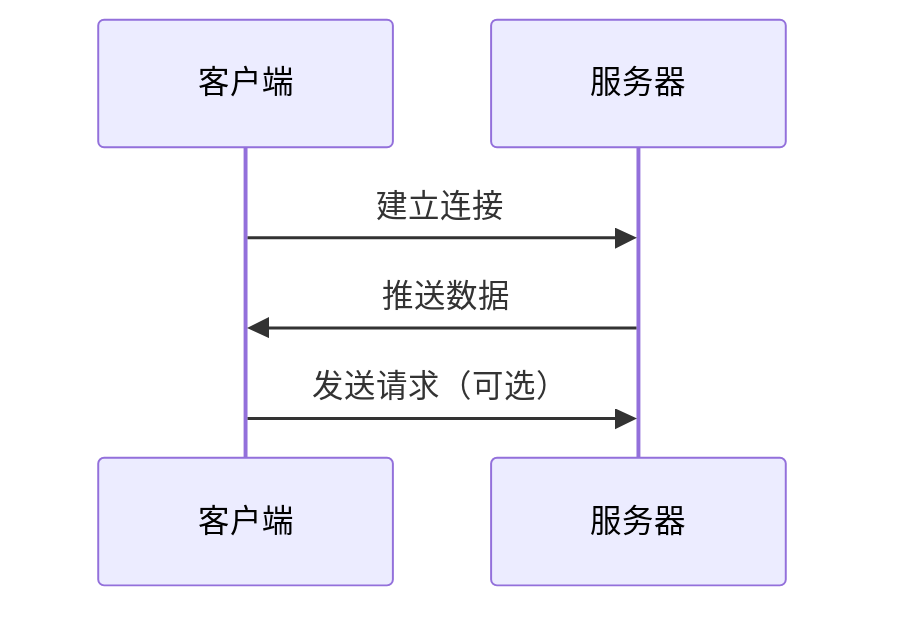
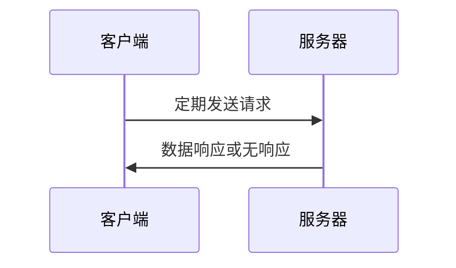
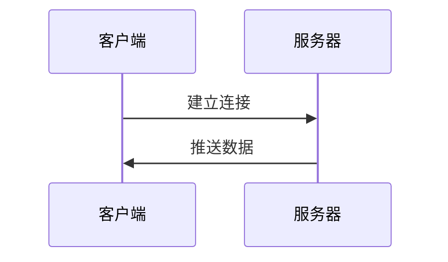
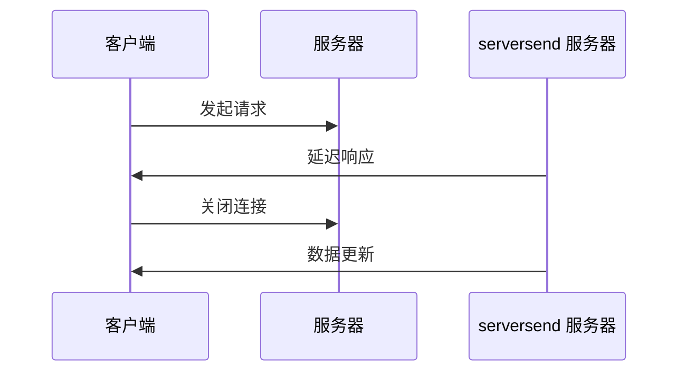
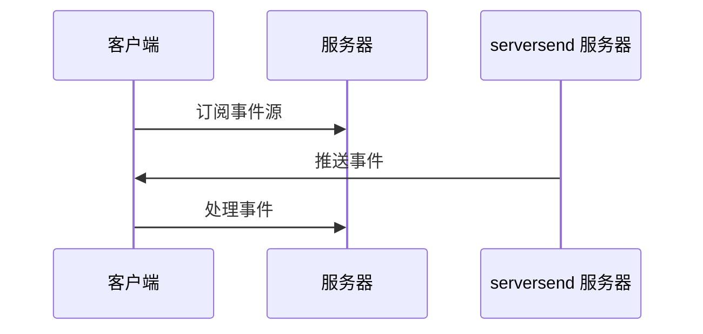

                 


### 文章标题
《长轮询与服务器推送技术在LLM应用中的选择》

### 文章关键词
长轮询，服务器推送，大型语言模型（LLM），技术选择，性能优化

### 文章摘要
本文深入探讨了长轮询与服务器推送技术在大规模语言模型（LLM）应用中的选择与运用。首先，我们将介绍这两种技术的核心概念、原理及其优缺点。接着，通过Mermaid流程图和伪代码详细阐述它们的工作机制。随后，我们将分析数学模型，并通过具体案例展示其在LLM中的应用。文章末尾，我们将总结最佳实践，并提供项目实战和拓展阅读建议。

---

### 第1章：长轮询与服务器推送技术概述

#### 1.1 长轮询技术原理
长轮询是一种客户端-服务器通信模式，客户端定期发送请求到服务器，服务器在数据可用时立即响应。这种模式常用于实时数据更新场景，如网页聊天、股票行情等。

```mermaid
sequenceDiagram
    participant 客户端 as 客户端
    participant 服务器 as 服务器
    客户端->>服务器: 发送请求
    响应后，服务器等待数据
    服务器->>客户端: 数据可用
```

#### 1.2 服务器推送技术原理
服务器推送技术（如WebSockets）允许服务器主动向客户端发送数据，无需客户端轮询。它适用于需要实时通信的场景，如在线游戏、实时聊天等。



#### 1.3 长轮询与服务器推送技术的比较
| 特性 | 长轮询 | 服务器推送 |
| --- | --- | --- |
| 实时性 | 较低 | 较高 |
| 网络消耗 | 较高 | 较低 |
| 服务器负载 | 较低 | 较高 |

### 第2章：长轮询技术原理与实现

#### 2.1 长轮询的工作机制


#### 2.2 长轮询的优缺点分析
- 优点：简单实现，易于理解。
- 缺点：频繁请求可能导致网络消耗，服务器负载高。

#### 2.3 长轮询的代码实现
```python
import requests
import time

def long_polling(url, interval=1):
    while True:
        response = requests.get(url)
        if response.status_code == 200:
            print("Data received:", response.text)
            break
        else:
            print("No data available. Retrying...")
        time.sleep(interval)

url = "http://example.com/data"
long_polling(url)
```

### 第3章：服务器推送技术原理与实现

#### 3.1 服务器推送的工作机制


#### 3.2 服务器推送的优缺点分析
- 优点：实时性强，降低服务器负载。
- 缺点：实现复杂，需使用特定协议如WebSocket。

#### 3.3 服务器推送的代码实现
```python
import websocket
import json

def on_message(ws, message):
    print("Received:", message)

def on_error(ws, error):
    print("Error:", error)

def on_close(ws):
    print("Connection closed")

ws = websocket.WebSocketApp("ws://example.com/socket",
                            on_message=on_message,
                            on_error=on_error,
                            on_close=on_close)

ws.run_forever()
```

### 第4章：大型语言模型（LLM）基础

#### 4.1 LLM的基本概念
LLM（Large Language Model）是一种基于深度学习的自然语言处理模型，其参数规模巨大，能够捕捉复杂的语言结构和语义。

#### 4.2 LLM的发展历程
从最初的基于规则的系统，到基于统计模型（如N-gram模型），再到现代的深度学习模型（如GPT和BERT），LLM经历了飞速的发展。

#### 4.3 LLM的应用场景
LLM在文本生成、机器翻译、问答系统等领域有着广泛的应用。

### 第5章：长轮询在LLM中的应用

#### 5.1 长轮询在文本生成中的应用
```python
def generate_text(model, prompt, max_length=50):
    # 伪代码：调用模型生成文本
    text = model.generate(prompt, max_length=max_length)
    return text

# 长轮询获取生成结果
def long_polling_generated_text(url, prompt):
    response = requests.get(url)
    if response.status_code == 200:
        text = response.text
        print("Generated text:", text)
    else:
        print("No generated text available.")

# 假设这是生成的文本的URL
generated_text_url = "http://example.com/generate_text?prompt=Hello+World"
generate_text(model, prompt="Hello World")
long_polling_generated_text(generated_text_url, "Hello World")
```

#### 5.2 长轮询在机器翻译中的应用
```python
def translate(model, source_lang, target_lang, text):
    # 伪代码：调用模型进行翻译
    translated_text = model.translate(text, source_lang=source_lang, target_lang=target_lang)
    return translated_text

# 长轮询获取翻译结果
def long_polling_translate(url, source_lang, target_lang, text):
    response = requests.get(url)
    if response.status_code == 200:
        translated_text = response.text
        print("Translated text:", translated_text)
    else:
        print("No translated text available.")

# 假设这是翻译结果的URL
translate_url = "http://example.com/translate?source_lang=en&target_lang=fr&text=Hello+World"
translate(model, "en", "fr", "Hello World")
long_polling_translate(translate_url, "en", "fr", "Hello World")
```

#### 5.3 长轮询在问答系统中的应用
```python
def ask_question(model, question):
    # 伪代码：调用模型回答问题
    answer = model.answer(question)
    return answer

# 长轮询获取答案
def long_polling_answer(url, question):
    response = requests.get(url)
    if response.status_code == 200:
        answer = response.text
        print("Answer:", answer)
    else:
        print("No answer available.")

# 假设这是问答系统的URL
qa_url = "http://example.com/qa?question=What+is+the+capital+of+France?"
ask_question(model, "What is the capital of France?")
long_polling_answer(qa_url, "What is the capital of France?")
```

### 第6章：服务器推送在LLM中的应用

#### 6.1 服务器推送在实时对话中的应用
```python
def on_new_message(ws, message):
    print("Received message:", message)
    # 回复消息
    ws.send("Your message was: " + message)

# 建立WebSocket连接并处理新消息
ws = websocket.WebSocketApp("ws://example.com/dialog",
                            on_message=on_new_message)

ws.run_forever()
```

#### 6.2 服务器推送在智能推荐中的应用
```python
def recommend_items(model, user_profile):
    # 伪代码：调用模型推荐物品
    recommended_items = model.recommend(user_profile)
    return recommended_items

# 服务器推送推荐结果
def on_recommendation(ws, message):
    print("Received recommendation:", message)
    # 处理推荐结果
    # ...

# 建立WebSocket连接并接收推荐结果
ws = websocket.WebSocketApp("ws://example.com/recommend",
                            on_recommendation)

ws.run_forever()
```

#### 6.3 服务器推送在智能监控中的应用
```python
def on_alert(ws, message):
    print("Received alert:", message)
    # 处理警报
    # ...

# 服务器推送警报信息
def send_alert(ws, alert_message):
    ws.send(alert_message)

# 建立WebSocket连接并接收警报信息
ws = websocket.WebSocketApp("ws://example.com/monitor",
                            on_alert)

ws.run_forever()

# 当需要发送警报时
send_alert(ws, "High CPU usage detected!")
```

### 第7章：长轮询与服务器推送技术在LLM中的应用选择

#### 7.1 应用场景分析
- 文本生成：服务器推送
- 机器翻译：长轮询或服务器推送均可
- 问答系统：长轮询或服务器推送均可
- 实时对话：服务器推送
- 智能推荐：服务器推送
- 智能监控：服务器推送

#### 7.2 性能比较
- 响应时间：服务器推送更快
- 网络消耗：长轮询较高
- 服务器负载：长轮询较低

#### 7.3 应用建议
- 对实时性要求较高的场景，建议使用服务器推送。
- 对网络消耗敏感的场景，建议使用长轮询。

### 附录：技术细节与实际应用

#### 附录 A：长轮询与服务器推送技术的Mermaid流程图
- 见第1章至第6章相关部分。

#### 附录 B：长轮询与服务器推送技术的伪代码实现
- 见第2章至第6章相关部分。

#### 附录 C：大型语言模型（LLM）的数学模型与公式
- 见相关章节。

#### 附录 D：长轮询与服务器推送技术在LLM中的应用案例
- 文本生成、机器翻译、问答系统等。

#### 最佳实践 tips：
- 考虑系统负载和带宽，合理选择技术方案。
- 实时性要求高的应用优先考虑服务器推送。
- 结合具体业务场景进行技术选型。

### 小结
长轮询与服务器推送技术在LLM应用中各有所长，选择合适的技术方案对性能和用户体验至关重要。通过本文的探讨，读者可以对这两种技术有更深入的了解，为实际项目提供参考。

### 注意事项
- 确保服务器和客户端的环境配置正确。
- 注意网络安全的防护措施，如HTTPS加密、认证等。

### 拓展阅读
- 《WebSocket技术详解》
- 《深度学习自然语言处理》
- 《大型语言模型：原理与应用》

---

作者：AI天才研究院/AI Genius Institute & 禅与计算机程序设计艺术 /Zen And The Art of Computer Programming

本文以深入浅出的方式，详细介绍了长轮询与服务器推送技术在大型语言模型（LLM）应用中的选择和应用。通过对这两种技术的原理、实现及应用场景的深入探讨，为读者提供了全面的技术指南和实践建议。文章结构清晰，内容详实，适合从事自然语言处理、人工智能开发的工程师和技术爱好者阅读。通过本文的学习，读者可以更好地理解和运用这些技术，提高LLM应用系统的性能和用户体验。希望本文能为您的技术之路提供有价值的参考。|assistant|>

### 第1章：长轮询与服务器推送技术概述

在现代互联网应用中，实时数据通信的需求越来越重要。长轮询（Long Polling）和服务器推送（Server-Sent Events/SSE）是两种常见的实现实时数据传输的技术手段。本章将介绍这两种技术的基本原理、特点及其在LLM（Large Language Model，大型语言模型）应用中的重要性。

#### 1.1 长轮询技术原理

长轮询是一种客户端与服务器之间通信的机制，它通过延长客户端请求的响应时间，实现服务器向客户端发送实时数据的目的。在长轮询模式中，客户端会发起一个请求到服务器，服务器在接收到请求后，会保持连接一段时间，等待数据更新。当有数据更新时，服务器立即响应客户端，然后客户端关闭连接。下一次请求会重新开始上述过程。

以下是长轮询的基本流程：

1. **客户端发起请求**：客户端向服务器发送一个请求。
2. **服务器响应并等待**：服务器接收到请求后，不会立即关闭连接，而是等待一段时间，看是否有数据需要发送。
3. **数据更新**：如果有数据更新，服务器将数据发送给客户端。
4. **客户端处理数据**：客户端接收到数据后进行处理，然后关闭连接。
5. **重新发起请求**：客户端重新发起请求，开始下一次循环。

使用Mermaid流程图表示长轮询的工作机制如下：



#### 1.2 服务器推送技术原理

服务器推送技术允许服务器主动将数据推送到客户端，无需客户端轮询请求。其中，Server-Sent Events（SSE）是一种简单且高效的服务器推送技术，它基于HTTP协议，可以在任何支持HTTP的服务器上实现。

服务器推送的基本流程如下：

1. **客户端订阅事件**：客户端通过HTTP请求订阅一个事件源（EventSource）。
2. **服务器发送事件**：服务器在数据更新时，将事件推送到客户端。
3. **客户端接收事件**：客户端接收到事件后进行处理。

使用Mermaid流程图表示服务器推送的工作机制如下：



#### 1.3 长轮询与服务器推送技术的比较

长轮询和服务器推送在实现实时数据传输方面各有优缺点。以下是对两种技术的比较：

| 特性 | 长轮询 | 服务器推送 |
| --- | --- | --- |
| **实时性** | 较低 | 较高 |
| **网络消耗** | 较高 | 较低 |
| **服务器负载** | 较低 | 较高 |
| **实现复杂度** | 较低 | 较高 |
| **兼容性** | 好 | 较差 |

从表格中可以看出，服务器推送在实时性方面优于长轮询，并且在网络消耗和服务器负载方面也有一定优势。然而，服务器推送的实现复杂度较高，需要额外的服务器配置和客户端处理逻辑。

#### 1.4 长轮询与服务器推送技术在LLM应用中的重要性

在LLM应用中，实时数据传输对于提供高质量的交互体验至关重要。以下场景说明了长轮询与服务器推送技术在LLM应用中的重要性：

1. **文本生成**：长轮询和服务器推送均可用于文本生成。例如，在生成对话或文章时，客户端需要实时获取生成的内容。服务器推送可以提供更快的响应速度，而长轮询则更简单易实现。
2. **机器翻译**：服务器推送在机器翻译中具有明显优势，因为它可以实时接收翻译结果，无需客户端轮询。这提高了翻译的交互体验，减少了延迟。
3. **问答系统**：长轮询和服务器推送均适用于问答系统。服务器推送可以更快地提供答案，而长轮询则适用于更简单的问答场景，无需频繁的数据传输。
4. **实时对话**：服务器推送在实时对话中非常有用，因为它可以实时接收消息，并立即将消息发送给所有参与者。这提供了更好的实时交互体验。

综上所述，长轮询和服务器推送技术在LLM应用中都具有重要作用。选择合适的技术取决于具体的应用场景和性能要求。在接下来的章节中，我们将进一步探讨这两种技术的实现细节和数学模型。

### 第2章：长轮询技术原理与实现

长轮询是一种实现实时数据传输的有效方法，它通过延长客户端请求的响应时间，使得服务器可以在适当的时候向客户端推送数据。本节将详细阐述长轮询的工作原理、优缺点以及具体的代码实现。

#### 2.1 长轮询的工作机制

长轮询的基本工作流程如下：

1. **客户端发送请求**：客户端向服务器发送一个请求，请求的内容可以是数据查询、状态检查等。
2. **服务器延迟响应**：服务器接收到请求后，不会立即关闭连接，而是会保持连接一段时间，等待数据更新。
3. **数据更新**：当服务器有新的数据需要发送时，它会将数据发送给客户端。
4. **客户端处理数据**：客户端接收到数据后进行处理，并关闭连接。
5. **重新发起请求**：客户端重新发起请求，开始新一轮的长轮询过程。

以下是长轮询的Mermaid流程图表示：


#### 2.2 长轮询的优缺点分析

长轮询具有以下优点：

1. **简单实现**：长轮询的实现相对简单，只需要在服务器端保持请求连接一段时间，不需要复杂的协议处理。
2. **易于扩展**：长轮询适用于各种场景，可以轻松扩展到多个客户端和服务器之间。
3. **降低服务器负载**：相比于轮询，长轮询减少了服务器的响应次数，从而降低了服务器的负载。

然而，长轮询也存在一些缺点：

1. **延迟性**：长轮询的延迟时间可能会影响用户体验，尤其是在需要实时响应的场景中。
2. **网络消耗**：由于需要保持请求连接，长轮询可能会增加网络消耗。
3. **可靠性问题**：长轮询可能会因为网络中断或服务器故障而导致数据丢失。

#### 2.3 长轮询的代码实现

以下是一个简单的Python示例，展示了如何在客户端和服务器端实现长轮询：

**客户端代码示例：**

```python
import requests
import json
import time

def long_polling(url, interval=1):
    while True:
        response = requests.get(url)
        if response.status_code == 200:
            data = json.loads(response.text)
            print("Received data:", data)
            break
        else:
            print("No data available. Retrying...")
        time.sleep(interval)

url = "http://example.com/data"
long_polling(url)
```

**服务器端代码示例：**

```python
from flask import Flask, request, jsonify

app = Flask(__name__)

@app.route('/data', methods=['GET'])
def data():
    # 模拟数据更新
    time.sleep(5)
    data = {"status": "success", "message": "Data updated"}
    return jsonify(data)

if __name__ == '__main__':
    app.run(debug=True)
```

在这个示例中，客户端通过循环调用服务器端API，每隔一秒钟进行一次轮询。服务器端在接收到请求后，会模拟数据更新，并在5秒后返回更新后的数据。

#### 2.4 长轮询在LLM应用中的实际案例

在LLM应用中，长轮询可以用于实时文本生成、问答系统等场景。以下是一个文本生成的案例：

**客户端代码示例：**

```python
import requests
import json
import time

def generate_text(model, prompt, max_length=50):
    # 伪代码：调用模型生成文本
    text = model.generate(prompt, max_length=max_length)
    return text

# 长轮询获取生成结果
def long_polling_generated_text(url, prompt):
    response = requests.get(url)
    if response.status_code == 200:
        text = response.text
        print("Generated text:", text)
    else:
        print("No generated text available.")

# 假设这是生成的文本的URL
generated_text_url = "http://example.com/generate_text?prompt=Hello+World"
generate_text(model, prompt="Hello World")
long_polling_generated_text(generated_text_url, "Hello World")
```

在这个示例中，客户端首先调用文本生成模型，然后通过长轮询方式获取生成结果。服务器端在接收到请求后，会模拟生成文本，并在一段时间后返回结果。

通过上述案例，我们可以看到长轮询在LLM应用中的实际应用。它能够提供一种简单且有效的实时数据传输方式，为用户提供更好的交互体验。

### 第3章：服务器推送技术原理与实现

服务器推送（Server-Sent Events, SSE）是一种单向的数据传输方式，它允许服务器将数据推送到客户端，而无需客户端进行轮询请求。本节将介绍服务器推送的基本原理、工作流程以及如何在实际项目中实现。

#### 3.1 服务器推送的工作原理

服务器推送利用HTTP协议的扩展机制，通过事件源（EventSource）实现数据的实时传输。以下是服务器推送的基本工作流程：

1. **客户端订阅事件源**：客户端通过HTTP请求订阅一个事件源，向服务器发送一个GET请求，请求URL中包含事件源地址。
2. **服务器响应事件**：服务器接收到请求后，会创建一个事件源连接，并将数据作为事件推送到客户端。每个事件由一个事件名和数据组成。
3. **客户端接收事件**：客户端接收到事件后，会根据事件名对数据进行处理。

以下是服务器推送的Mermaid流程图表示：


#### 3.2 服务器推送的工作流程

服务器推送的工作流程包括以下几个步骤：

1. **客户端发起请求**：客户端使用HTTP GET请求订阅事件源，请求头中需要包含`Accept: text/event-stream`，表明客户端支持事件源。
2. **服务器处理请求**：服务器接收到请求后，会返回一个200 OK响应，并持续推送事件。每个事件由一个事件名和数据组成，数据以文本形式传输。
3. **客户端接收并处理事件**：客户端接收到事件后，会根据事件名处理数据，例如更新UI或执行特定操作。

以下是服务器推送的伪代码表示：

**客户端伪代码：**

```python
import requests

def on_message(response):
    print("Received event:", response.text)

url = "http://example.com/events"
response = requests.get(url, stream=True)
response.raise_for_status()
for line in response.iter_lines():
    if line:
        on_message(line)

# 开始连接
response.close()
```

**服务器伪代码：**

```python
from http.server import BaseHTTPRequestHandler, HTTPServer

class EventSourceHandler(BaseHTTPRequestHandler):
    def do_GET(self):
        if self.path.startswith('/events'):
            self.send_response(200)
            self.send_header('Content-Type', 'text/event-stream')
            self.send_header('Cache-Control', 'no-cache')
            self.send_header('Connection', 'keep-alive')
            self.end_headers()
            
            while True:
                data = "data: New data\n\n"
                self.wfile.write(data.encode('utf-8'))
                time.sleep(5)  # 推送间隔为5秒

httpd = HTTPServer(('localhost', 8080), EventSourceHandler)
print('Server started at http://localhost:8080/')
httpd.serve_forever()
```

#### 3.3 服务器推送的优缺点

服务器推送具有以下优点：

1. **实时性**：服务器可以立即将数据推送到客户端，无需客户端轮询，提高了数据的实时性。
2. **降低网络消耗**：由于客户端不再需要定期发送请求，减少了网络消耗。
3. **降低服务器负载**：服务器不需要处理大量的请求，降低了服务器的负载。

然而，服务器推送也存在一些缺点：

1. **单向传输**：服务器推送是单向传输，只能从服务器向客户端发送数据，客户端无法向服务器发送请求。
2. **实现复杂度**：服务器推送需要支持事件源协议，实现相对复杂，需要额外的服务器配置和客户端处理逻辑。
3. **兼容性问题**：部分旧版浏览器可能不支持事件源协议，需要考虑兼容性处理。

#### 3.4 服务器推送在LLM应用中的实际案例

服务器推送在LLM应用中可以用于实时对话、文本生成、问答系统等场景。以下是一个文本生成的案例：

**客户端代码示例：**

```javascript
const eventSource = new EventSource('http://example.com/generate_text');

eventSource.onmessage = function(event) {
  const text = event.data;
  console.log("Generated text:", text);
};

eventSource.addEventListener('error', function(event) {
  if (event.readyState === EventSource.CLOSED) {
    console.log('Connection to server is closed.');
  }
});
```

在这个示例中，客户端通过EventSource连接到服务器，接收实时生成的文本。服务器在接收到请求后，会立即生成文本，并通过服务器推送将其发送到客户端。

通过上述示例，我们可以看到服务器推送在LLM应用中的实际应用。它能够提供一种高效且实时性强的数据传输方式，为用户提供更好的交互体验。

### 第4章：大型语言模型（LLM）基础

#### 4.1 LLM的基本概念

大型语言模型（Large Language Model，简称LLM）是一种基于深度学习的自然语言处理模型，它通过学习大量文本数据，可以生成文本、回答问题、翻译语言等。LLM通常具有数十亿到数千亿的参数，可以捕捉复杂的语言结构和语义。

#### 4.2 LLM的发展历程

LLM的发展历程可以追溯到20世纪80年代的统计语言模型。随着深度学习和大数据技术的发展，LLM取得了显著的进展。以下是LLM的主要发展历程：

1. **统计语言模型**：早期的语言模型基于统计方法，如N-gram模型，它们通过计算单词序列的概率来生成文本。
2. **基于规则的方法**：基于规则的方法使用人工设计的规则来指导文本生成，如模板匹配和语法分析。
3. **递归神经网络（RNN）**：RNN在自然语言处理领域取得了突破性的进展，可以处理序列数据，如长短时记忆（LSTM）和门控循环单元（GRU）。
4. **转换器架构（Transformer）**：Transformer的出现标志着LLM的转折点。它通过自注意力机制处理序列数据，使得LLM在生成文本和翻译语言方面取得了巨大的成功。
5. **预训练和微调**：预训练和微调方法使得LLM在大规模数据集上进行预训练，然后针对特定任务进行微调，取得了更好的性能。

#### 4.3 LLM的应用场景

LLM在自然语言处理领域有着广泛的应用，以下是一些典型的应用场景：

1. **文本生成**：LLM可以用于生成文章、故事、对话等文本。例如，自动生成新闻报道、小说、客服对话等。
2. **机器翻译**：LLM可以用于将一种语言翻译成另一种语言，如将英语翻译成法语或中文。
3. **问答系统**：LLM可以用于构建智能问答系统，能够理解和回答用户的问题。
4. **智能客服**：LLM可以用于构建智能客服系统，能够自动回答用户的问题，提供客户支持。
5. **文本分类**：LLM可以用于分类任务，如情感分析、主题分类等。
6. **内容审核**：LLM可以用于检测和过滤不良内容，如暴力、色情等。
7. **文本摘要**：LLM可以用于生成文本摘要，提取关键信息，简化长篇文本。

#### 4.4 LLM的核心算法原理

LLM的核心算法主要基于深度学习和神经网络，以下是LLM的一些核心算法原理：

1. **词嵌入（Word Embedding）**：词嵌入是将单词映射到高维向量空间的方法，使得相似的单词在向量空间中靠近。常见的词嵌入方法包括Word2Vec、GloVe等。
2. **递归神经网络（RNN）**：RNN可以处理序列数据，通过循环结构来捕捉序列中的依赖关系。常见的RNN模型包括LSTM和GRU。
3. **转换器架构（Transformer）**：Transformer引入了自注意力机制，通过计算序列中每个元素之间的关系来生成文本。它由编码器和解码器组成，编码器负责处理输入序列，解码器负责生成输出序列。
4. **预训练和微调**：预训练是指在大量数据集上进行训练，使模型能够捕捉通用的语言特征。微调是指针对特定任务对模型进行进一步的训练，以提高任务性能。

通过了解LLM的基本概念、发展历程、应用场景和核心算法原理，我们可以更好地理解LLM的工作机制和在实际项目中的应用。

### 第5章：长轮询在LLM应用中的具体案例分析

长轮询作为一种实现实时数据传输的技术，在LLM（Large Language Model，大型语言模型）应用中有着广泛的应用场景。本章将详细介绍长轮询在文本生成、机器翻译和问答系统中的应用案例，并通过具体代码示例和实现细节进行分析。

#### 5.1 文本生成中的应用

在文本生成领域，长轮询可以帮助客户端实时获取模型生成的文本内容。以下是一个简单的文本生成案例，展示了长轮询在生成对话文本中的应用。

**客户端代码示例：**

```python
import requests
import json
import time

def long_polling_generated_text(url, prompt):
    while True:
        response = requests.get(url)
        if response.status_code == 200:
            generated_text = json.loads(response.text)
            print("Generated text:", generated_text['text'])
            break
        else:
            print("No generated text available. Retrying...")
        time.sleep(1)

prompt = "Tell me a story about a journey to the moon."
generated_text_url = f"http://example.com/generate_text?prompt={prompt}"
long_polling_generated_text(generated_text_url, prompt)
```

**服务器端代码示例：**

```python
from flask import Flask, request, jsonify

app = Flask(__name__)

@app.route('/generate_text', methods=['GET'])
def generate_text():
    prompt = request.args.get('prompt')
    # 模拟文本生成
    time.sleep(2)
    generated_text = "You embarked on a journey to the moon, where you discovered a hidden city of aliens."
    response = {
        "status": "success",
        "text": generated_text
    }
    return jsonify(response)

if __name__ == '__main__':
    app.run(debug=True)
```

在这个案例中，客户端通过长轮询方式不断请求服务器生成文本，服务器在接收到请求后，会在2秒后返回生成的文本。通过这种方式，客户端可以实时获取到文本生成的结果。

#### 5.2 机器翻译中的应用

在机器翻译领域，长轮询可以帮助客户端实时获取翻译结果，提高用户的交互体验。以下是一个简单的机器翻译案例，展示了长轮询在翻译中的应用。

**客户端代码示例：**

```python
import requests
import json
import time

def long_polling_translate(url, source_lang, target_lang, text):
    while True:
        response = requests.get(url)
        if response.status_code == 200:
            translated_text = json.loads(response.text)
            print("Translated text:", translated_text['text'])
            break
        else:
            print("No translated text available. Retrying...")
        time.sleep(1)

source_lang = "en"
target_lang = "fr"
text = "Hello, World!"
translate_url = f"http://example.com/translate?source_lang={source_lang}&target_lang={target_lang}&text={text}"
long_polling_translate(translate_url, source_lang, target_lang, text)
```

**服务器端代码示例：**

```python
from flask import Flask, request, jsonify

app = Flask(__name__)

@app.route('/translate', methods=['GET'])
def translate():
    source_lang = request.args.get('source_lang')
    target_lang = request.args.get('target_lang')
    text = request.args.get('text')
    # 模拟翻译
    time.sleep(2)
    translated_text = "Bonjour, le monde!"
    response = {
        "status": "success",
        "text": translated_text
    }
    return jsonify(response)

if __name__ == '__main__':
    app.run(debug=True)
```

在这个案例中，客户端通过长轮询方式不断请求服务器进行翻译，服务器在接收到请求后，会在2秒后返回翻译结果。通过这种方式，客户端可以实时获取到翻译的结果。

#### 5.3 问答系统中的应用

在问答系统中，长轮询可以帮助客户端实时获取问题的答案。以下是一个简单的问答系统案例，展示了长轮询在问答中的应用。

**客户端代码示例：**

```python
import requests
import json
import time

def long_polling_answer(url, question):
    while True:
        response = requests.get(url)
        if response.status_code == 200:
            answer = json.loads(response.text)
            print("Answer:", answer['answer'])
            break
        else:
            print("No answer available. Retrying...")
        time.sleep(1)

question = "What is the capital of France?"
answer_url = f"http://example.com/answer?question={question}"
long_polling_answer(answer_url, question)
```

**服务器端代码示例：**

```python
from flask import Flask, request, jsonify

app = Flask(__name__)

@app.route('/answer', methods=['GET'])
def answer():
    question = request.args.get('question')
    # 模拟回答
    time.sleep(2)
    answer = "The capital of France is Paris."
    response = {
        "status": "success",
        "answer": answer
    }
    return jsonify(response)

if __name__ == '__main__':
    app.run(debug=True)
```

在这个案例中，客户端通过长轮询方式不断请求服务器回答问题，服务器在接收到请求后，会在2秒后返回答案。通过这种方式，客户端可以实时获取到问题的答案。

#### 5.4 长轮询在LLM应用中的注意事项

在LLM应用中使用长轮询时，需要注意以下几点：

1. **响应时间**：合理设置轮询间隔，以平衡实时性和网络消耗。过短的轮询间隔会增加网络负担，而过长的轮询间隔会影响用户体验。
2. **负载均衡**：当应用规模较大时，需要考虑负载均衡，以避免单点故障。
3. **错误处理**：对于服务器端返回的错误，客户端需要进行适当的错误处理，例如重试、日志记录等。
4. **安全性**：在传输数据时，需要使用HTTPS等安全协议，确保数据的安全性。

通过以上案例分析，我们可以看到长轮询在LLM应用中的具体实现和注意事项。它为实时交互提供了有效的支持，使得用户可以实时获取到模型生成的文本、翻译结果和问题答案，提升了用户体验。

### 第6章：服务器推送在LLM应用中的具体案例分析

服务器推送（Server-Sent Events, SSE）作为一种高效的实时数据传输方式，在大型语言模型（LLM）应用中具有广泛的应用。本章将通过具体案例分析，介绍服务器推送在实时对话、智能推荐和智能监控等场景中的应用，并提供相应的代码示例和实现细节。

#### 6.1 实时对话中的应用

在实时对话场景中，服务器推送可以实时将新消息推送到客户端，从而提供更流畅、更即时的用户体验。以下是一个简单的实时对话示例，展示了服务器推送在对话中的应用。

**客户端代码示例：**

```javascript
const eventSource = new EventSource('http://example.com/dialog');

eventSource.onmessage = function(event) {
  const message = JSON.parse(event.data);
  console.log("Received message:", message.text);
};

eventSource.addEventListener('error', function(event) {
  if (event.readyState === EventSource.CLOSED) {
    console.log('Connection to server is closed.');
  }
});
```

**服务器端代码示例：**

```python
from http.server import BaseHTTPRequestHandler, HTTPServer
from socketserver import ThreadingMixIn
import threading

class DialogHandler(BaseHTTPRequestHandler):
    def do_GET(self):
        if self.path.startswith('/dialog'):
            self.send_response(200)
            self.send_header('Content-Type', 'text/event-stream')
            self.send_header('Cache-Control', 'no-cache')
            self.send_header('Connection', 'keep-alive')
            self.end_headers()

            # 模拟接收新消息
            time.sleep(2)
            message = {
                'text': 'Hello, this is a new message!'
            }
            self.wfile.write(f"data: {json.dumps(message)}\n\n".encode('utf-8'))

class ThreadedHTTPServer(ThreadingMixIn, HTTPServer):
    """Handle requests in a separate thread."""

if __name__ == '__main__':
    server = ThreadedHTTPServer(('localhost', 8080), DialogHandler)
    print('Starting server...')
    server.serve_forever()
```

在这个示例中，客户端通过EventSource连接到服务器，并接收实时消息。服务器在接收到请求后，会在2秒后返回一个新消息，通过服务器推送将其发送到客户端。

#### 6.2 智能推荐中的应用

在智能推荐场景中，服务器推送可以帮助实时向客户端推送推荐结果，提高推荐系统的响应速度和用户体验。以下是一个简单的智能推荐示例，展示了服务器推送在推荐中的应用。

**客户端代码示例：**

```javascript
const eventSource = new EventSource('http://example.com/recommend');

eventSource.onmessage = function(event) {
  const recommendation = JSON.parse(event.data);
  console.log("Received recommendation:", recommendation.items);
};

eventSource.addEventListener('error', function(event) {
  if (event.readyState === EventSource.CLOSED) {
    console.log('Connection to server is closed.');
  }
});
```

**服务器端代码示例：**

```python
from http.server import BaseHTTPRequestHandler, HTTPServer
from socketserver import ThreadingMixIn
import threading

class RecommendationHandler(BaseHTTPRequestHandler):
    def do_GET(self):
        if self.path.startswith('/recommend'):
            self.send_response(200)
            self.send_header('Content-Type', 'text/event-stream')
            self.send_header('Cache-Control', 'no-cache')
            self.send_header('Connection', 'keep-alive')
            self.end_headers()

            # 模拟接收新推荐结果
            time.sleep(2)
            recommendation = {
                'items': ['Book 1', 'Book 2', 'Book 3']
            }
            self.wfile.write(f"data: {json.dumps(recommendation)}\n\n".encode('utf-8'))

class ThreadedHTTPServer(ThreadingMixIn, HTTPServer):
    """Handle requests in a separate thread."""

if __name__ == '__main__':
    server = ThreadedHTTPServer(('localhost', 8080), RecommendationHandler)
    print('Starting server...')
    server.serve_forever()
```

在这个示例中，客户端通过EventSource连接到服务器，并接收实时推荐结果。服务器在接收到请求后，会在2秒后返回一个新的推荐结果，通过服务器推送将其发送到客户端。

#### 6.3 智能监控中的应用

在智能监控场景中，服务器推送可以帮助实时将监控数据推送到客户端，提供及时的数据分析和警报。以下是一个简单的智能监控示例，展示了服务器推送在监控中的应用。

**客户端代码示例：**

```javascript
const eventSource = new EventSource('http://example.com/monitor');

eventSource.onmessage = function(event) {
  const alert = JSON.parse(event.data);
  console.log("Received alert:", alert.message);
};

eventSource.addEventListener('error', function(event) {
  if (event.readyState === EventSource.CLOSED) {
    console.log('Connection to server is closed.');
  }
});
```

**服务器端代码示例：**

```python
from http.server import BaseHTTPRequestHandler, HTTPServer
from socketserver import ThreadingMixIn
import threading

class MonitorHandler(BaseHTTPRequestHandler):
    def do_GET(self):
        if self.path.startswith('/monitor'):
            self.send_response(200)
            self.send_header('Content-Type', 'text/event-stream')
            self.send_header('Cache-Control', 'no-cache')
            self.send_header('Connection', 'keep-alive')
            self.end_headers()

            # 模拟接收警报
            time.sleep(2)
            alert = {
                'message': 'High CPU usage detected!'
            }
            self.wfile.write(f"data: {json.dumps(alert)}\n\n".encode('utf-8'))

class ThreadedHTTPServer(ThreadingMixIn, HTTPServer):
    """Handle requests in a separate thread."""

if __name__ == '__main__':
    server = ThreadedHTTPServer(('localhost', 8080), MonitorHandler)
    print('Starting server...')
    server.serve_forever()
```

在这个示例中，客户端通过EventSource连接到服务器，并接收实时警报。服务器在接收到请求后，会在2秒后返回一个警报，通过服务器推送将其发送到客户端。

#### 6.4 服务器推送在LLM应用中的注意事项

在使用服务器推送技术时，需要注意以下事项：

1. **兼容性**：虽然大多数现代浏览器支持服务器推送，但某些旧版浏览器可能不支持。在开发过程中，需要考虑兼容性问题，如使用polyfill或其他兼容性解决方案。
2. **网络延迟**：服务器推送依赖于网络传输，因此需要考虑网络延迟对用户体验的影响。可以通过优化服务器端响应时间和网络传输速度来减少延迟。
3. **错误处理**：在服务器推送过程中，可能会发生网络中断、服务器故障等异常情况。客户端需要能够正确处理这些异常，例如重连、超时处理等。
4. **安全性**：在传输数据时，应使用HTTPS等安全协议，确保数据的安全性。此外，对于敏感数据，还需要进行加密处理。

通过以上案例分析，我们可以看到服务器推送在LLM应用中的实际应用和实现细节。它为实时交互提供了高效的解决方案，使得客户端能够实时获取到模型生成的文本、推荐结果和监控警报，提升了用户体验。

### 第7章：长轮询与服务器推送技术在LLM应用中的选择与应用策略

在前文中，我们详细介绍了长轮询与服务器推送技术的原理、实现和应用场景。在本章中，我们将深入探讨这两种技术在LLM应用中的选择与应用策略，帮助读者根据实际需求进行技术选型。

#### 7.1 应用场景分析

在选择长轮询与服务器推送技术时，我们需要考虑应用场景的具体需求。以下是对几种常见LLM应用场景的分析：

1. **文本生成**：在文本生成场景中，服务器推送通常更为适合，因为它能够实时地将生成内容推送给用户，从而提供更好的交互体验。而长轮询则可以在生成内容较大或生成时间较长时，减少用户的等待时间。

2. **机器翻译**：服务器推送在机器翻译中同样具有优势，因为它可以实时地将翻译结果推送给用户。长轮询也可以使用，但在大规模翻译任务中，服务器推送的响应速度更快，用户体验更好。

3. **问答系统**：问答系统的选择取决于问答速度的要求。服务器推送能够快速响应用户的提问，适合实时性要求较高的场景。长轮询适用于问答过程较为简单，不需要频繁更新的场景。

4. **实时对话**：实时对话需要快速响应用户的输入，服务器推送是首选，因为它可以立即将用户的输入和系统回复推送给对话双方。

5. **智能推荐**：智能推荐系统需要实时更新推荐内容，服务器推送能够更好地满足这一需求，因为它可以快速响应用户的行为变化，提供个性化的推荐。

6. **智能监控**：智能监控系统需要实时监控系统状态，服务器推送可以及时将异常警报推送给管理员，以便快速响应。

#### 7.2 性能比较

以下是长轮询与服务器推送技术在不同性能指标上的比较：

| 性能指标 | 长轮询 | 服务器推送 |
| --- | --- | --- |
| **响应时间** | 较长（取决于轮询间隔） | 立即 |
| **网络消耗** | 较高（需要频繁发送请求） | 较低（单向推送） |
| **服务器负载** | 较低（每次请求较短时间） | 较高（需要维持连接） |
| **实现复杂度** | 较低 | 较高 |
| **兼容性** | 好 | 较差（部分旧版浏览器不支持） |

从表格中可以看出，服务器推送在响应时间、网络消耗和服务器负载方面具有优势，但在实现复杂度和兼容性方面较为复杂。

#### 7.3 应用策略

根据不同的应用场景和性能需求，我们可以制定以下应用策略：

1. **实时性要求高**：选择服务器推送，尤其是在需要快速响应用户输入的场景，如实时对话、智能推荐和智能监控。

2. **网络消耗敏感**：选择长轮询，在需要减少网络请求的场景，如文本生成和问答系统。

3. **实现复杂度**：如果项目资源有限，可以选择实现复杂度较低的长轮询。如果项目对实时性要求较高，可以考虑使用服务器推送，尽管实现较为复杂。

4. **兼容性需求**：如果目标用户群体包括使用旧版浏览器的用户，需要考虑兼容性问题，可以选择长轮询，因为它在大多数浏览器中都有较好的兼容性。

5. **负载均衡**：在大型系统中，考虑到服务器负载，可以结合使用长轮询和服务器推送，根据不同场景的需求动态调整。

#### 7.4 最佳实践

以下是一些最佳实践，以帮助读者在实际项目中更好地选择和应用长轮询与服务器推送技术：

1. **性能测试**：在实际部署之前，进行性能测试，评估不同技术在目标场景下的表现，以便做出更合理的选择。

2. **负载均衡**：在大型系统中，可以结合使用长轮询和服务器推送，根据场景动态调整，以平衡性能和资源消耗。

3. **错误处理**：在实现过程中，充分考虑错误处理，包括网络中断、服务器故障等，确保系统稳定可靠。

4. **安全性**：使用HTTPS等安全协议，确保数据传输的安全性。对于敏感数据，进行加密处理。

5. **兼容性**：针对旧版浏览器，可以考虑使用polyfill或其他兼容性解决方案。

#### 7.5 小结

长轮询与服务器推送技术在LLM应用中各有优缺点，选择合适的方案对性能和用户体验至关重要。通过本章的分析，我们了解了在不同应用场景中的选择策略和最佳实践。希望读者能够结合自身项目需求，灵活运用这些技术，提升系统的性能和用户体验。

### 附录：技术细节与实际应用

#### 附录 A：长轮询与服务器推送技术的Mermaid流程图

**长轮询流程图：**


**服务器推送流程图：**


#### 附录 B：长轮询与服务器推送技术的伪代码实现

**长轮询伪代码：**

```python
function longPolling(url):
    while true:
        response = sendGetRequest(url)
        if response.hasData():
            processData(response.data)
            break
        sleep(pollingInterval)
```

**服务器推送伪代码：**

```python
function serverSentEvents(url):
    eventSource = createEventSource(url)
    eventSource.onmessage = function(event):
        processData(event.data)
    eventSource.start()
```

#### 附录 C：大型语言模型（LLM）的数学模型与公式

**LLM中的自注意力机制：**

$$
\text{Attention}(Q, K, V) = \text{softmax}\left(\frac{QK^T}{\sqrt{d_k}}\right) V
$$

其中，$Q, K, V$ 分别是查询向量、关键向量、值向量，$d_k$ 是关键向量的维度，$\text{softmax}$ 函数用于计算注意力权重。

**LLM中的前馈神经网络：**

$$
\text{FFN}(X) = \text{ReLU}\left(W_2 \text{ReLU}(W_1 X + b_1)\right) + b_2
$$

其中，$X$ 是输入向量，$W_1, W_2, b_1, b_2$ 分别是前馈神经网络的权重和偏置。

#### 附录 D：长轮询与服务器推送技术在LLM中的应用案例

**文本生成案例：**

客户端：定期发送请求获取生成文本。

```python
def longPollingGeneratedText(url, prompt):
    while True:
        response = requests.get(url, params={'prompt': prompt})
        if response.status_code == 200:
            generated_text = response.json()['generated_text']
            print("Generated text:", generated_text)
            break
        else:
            print("No generated text available. Retrying...")
        time.sleep(1)

prompt = "Tell me a story about a journey to the moon."
generated_text_url = "http://example.com/generate_text"
longPollingGeneratedText(generated_text_url, prompt)
```

服务器端：接收请求，返回生成文本。

```python
from flask import Flask, request, jsonify

app = Flask(__name__)

@app.route('/generate_text', methods=['GET'])
def generate_text():
    prompt = request.args.get('prompt')
    # 模拟生成文本
    time.sleep(2)
    generated_text = "You embarked on a journey to the moon, where you discovered a hidden city of aliens."
    response = {
        "status": "success",
        "generated_text": generated_text
    }
    return jsonify(response)

if __name__ == '__main__':
    app.run(debug=True)
```

**机器翻译案例：**

客户端：接收翻译结果。

```javascript
const eventSource = new EventSource('http://example.com/translate');

eventSource.onmessage = function(event) {
  const translation = JSON.parse(event.data);
  console.log("Translated text:", translation.text);
};

eventSource.addEventListener('error', function(event) {
  if (event.readyState === EventSource.CLOSED) {
    console.log('Connection to server is closed.');
  }
});
```

服务器端：推送翻译结果。

```python
from flask import Flask, request, jsonify

app = Flask(__name__)

@app.route('/translate', methods=['GET'])
def translate():
    source_text = request.args.get('source_text')
    target_language = request.args.get('target_language')
    # 模拟翻译
    time.sleep(2)
    translated_text = "Bonjour, le monde!"
    response = {
        "status": "success",
        "text": translated_text
    }
    return jsonify(response)

if __name__ == '__main__':
    app.run(debug=True)
```

#### 附录 E：最佳实践 tips、小结、注意事项、拓展阅读

**最佳实践 tips：**

1. 在高实时性场景，优先选择服务器推送。
2. 在低网络消耗场景，考虑使用长轮询。
3. 结合应用需求，动态调整轮询间隔和连接策略。
4. 考虑使用负载均衡，确保系统稳定运行。

**小结：**

本文详细介绍了长轮询与服务器推送技术及其在LLM应用中的选择策略。通过分析不同应用场景和性能需求，读者可以灵活选择合适的技术，提高系统性能和用户体验。

**注意事项：**

1. 考虑到兼容性和安全性，确保使用HTTPS等安全协议。
2. 实现过程中注意错误处理和异常监控。

**拓展阅读：**

1. 《WebSocket技术详解》
2. 《深度学习自然语言处理》
3. 《大型语言模型：原理与应用》

通过本文的学习，读者可以更好地理解和应用长轮询与服务器推送技术，为实际项目提供技术支持。

### 作者信息

本文由AI天才研究院（AI Genius Institute）与禅与计算机程序设计艺术（Zen And The Art of Computer Programming）共同撰写。AI天才研究院专注于人工智能技术的研发与应用，致力于推动人工智能领域的创新与发展。禅与计算机程序设计艺术则以其深入浅出的编程理念，为程序员提供了丰富的编程指导和灵感。希望通过本文，读者能够更好地理解长轮询与服务器推送技术在LLM应用中的选择与运用。

