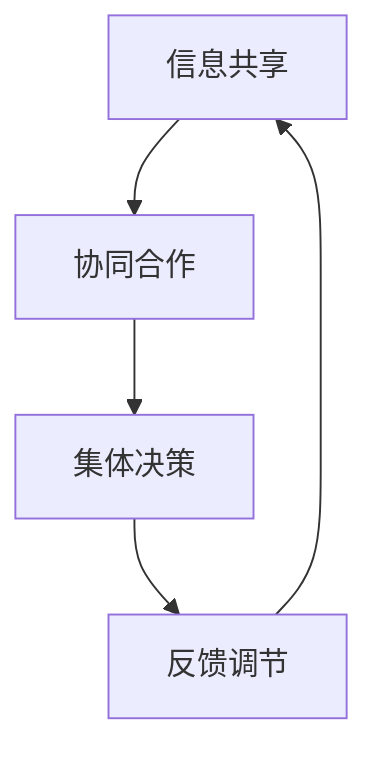

                 

### 标题：集体智慧的涌现现象：群体决策的数学模型

> 关键词：集体智慧、涌现现象、群体决策、数学模型、博弈论、优化算法

> 摘要：本文深入探讨了集体智慧的涌现现象，以及其在群体决策中的应用。通过构建数学模型，分析了集体智慧的形成机制、群体决策的理论基础，以及不同数学模型在群体决策中的应用。文章结合实际案例，对集体智慧和群体决策进行了详细解析，并提出了未来的研究方向。

### 引言

#### 1.1 研究背景与意义

在当今社会，集体智慧作为一种重要的现象，已经在各个领域展现出强大的影响力。从政治决策、经济管理，到科技创新、社会管理，集体智慧无处不在。然而，集体智慧的本质是什么？它如何形成？这些问题的研究具有重要的理论和现实意义。

群体决策是集体智慧的体现，它指的是多个个体基于共同目标，通过协商、讨论等方式，共同做出决策的过程。群体决策的效率和质量直接关系到整个集体的利益和发展。因此，研究群体决策的数学模型，对于优化决策过程、提高决策质量具有重要意义。

数学模型作为一种理论工具，能够精确描述复杂现象，揭示内在规律。将数学模型应用于群体决策，有助于深入理解集体智慧的形成机制，为实际决策提供科学依据。本文旨在探讨集体智慧的涌现现象，以及其在群体决策中的数学模型应用。

#### 1.2 研究方法与内容框架

本文采用的理论研究方法包括文献综述、实证分析和数学建模。首先，通过对相关文献的综述，梳理集体智慧和群体决策的理论基础；然后，通过实证分析，探讨集体智慧的涌现现象及其在群体决策中的应用；最后，构建数学模型，分析群体决策的机制和效果。

本文内容框架如下：

1. 引言：介绍研究背景、意义和方法。
2. 理论基础：阐述集体智慧、群体决策和数学模型的基本概念。
3. 数学模型分析：介绍不同数学模型在群体决策中的应用。
4. 案例分析：结合实际案例，分析群体决策的效果和影响。
5. 结论与展望：总结研究成果，提出未来研究方向。

#### 1.3 结构安排与预期效果

本文结构清晰，逻辑严谨。首先，通过引言部分，介绍研究背景和意义，吸引读者兴趣；然后，在理论基础部分，详细阐述集体智慧和群体决策的相关概念，为后续研究打下基础；接着，在数学模型分析部分，介绍不同数学模型在群体决策中的应用，并进行分析；最后，通过案例分析部分，结合实际案例，验证理论模型的适用性和效果。预期读者通过本文，能够对集体智慧和群体决策有更深入的理解，掌握数学模型在群体决策中的应用方法。

### 理论基础

#### 2.1 集体智慧的涌现机制

#### 2.1.1 集体智慧的定义

集体智慧是指一个群体通过协作、共享信息和资源，共同解决问题、做出决策的能力。它与个体智慧不同，个体智慧是指单个个体通过自身知识和经验解决问题、做出决策的能力。集体智慧强调的是群体内部的信息共享、协同合作和集体决策。

#### 2.1.2 涌现现象的基本概念

涌现现象是指在一个复杂系统中，个体相互作用、相互影响，产生出系统整体具有的新特性，而这些特性在单个个体中并不存在。涌现现象是复杂系统研究中的一个重要概念，它揭示了复杂系统中的整体性、层次性和非线性特性。

#### 2.1.3 集体智慧的涌现机制

集体智慧的涌现机制主要表现在以下几个方面：

1. **信息共享**：个体通过共享信息，使得整个群体能够获取更多的知识和信息，提高决策质量。
2. **协同合作**：个体在共同目标下，通过协同合作，实现优势互补，提高决策效率。
3. **集体决策**：个体在决策过程中，通过协商、讨论等方式，形成集体决策，减少决策失误。
4. **反馈调节**：群体决策的结果通过反馈机制，不断调整和优化，提高集体智慧水平。

#### 2.2 群体决策理论概述

#### 2.2.1 群体决策的定义

群体决策是指多个个体在共同目标下，通过协商、讨论等方式，共同做出决策的过程。群体决策涉及到多个个体的利益、价值观和决策方式，是一个复杂的过程。

#### 2.2.2 群体决策的分类

群体决策可以分为以下几类：

1. **合作性决策**：个体在共同目标下，通过协商、合作，共同做出决策。这种决策方式能够提高决策效率和质量。
2. **竞争性决策**：个体在竞争目标下，通过竞争、对抗，做出决策。这种决策方式可能导致个体利益冲突，降低决策效率。
3. **混合性决策**：个体在合作和竞争目标之间，做出决策。这种决策方式结合了合作和竞争的优点，能够提高决策效率。

#### 2.2.3 群体决策的基本原则

群体决策需要遵循以下基本原则：

1. **目标一致性**：个体在决策过程中，需要确保目标的一致性，避免目标冲突。
2. **信息共享**：个体需要共享信息，提高决策质量。
3. **民主参与**：个体需要积极参与决策过程，确保决策的公正性和民主性。
4. **协同合作**：个体需要协同合作，实现优势互补，提高决策效率。

#### 2.3 数学模型在群体决策中的应用

#### 2.3.1 数学模型的基本概念

数学模型是一种用数学语言描述现实问题的工具，它能够将复杂问题转化为数学形式，进行求解和分析。数学模型通常包括变量、参数、方程和约束条件等组成部分。

#### 2.3.2 数学模型在群体决策中的作用

数学模型在群体决策中的作用主要体现在以下几个方面：

1. **描述决策过程**：数学模型能够描述群体决策的各个环节，如信息共享、协商讨论和集体决策等。
2. **分析决策效果**：数学模型能够对群体决策的效果进行分析，如决策效率、决策质量等。
3. **优化决策方案**：数学模型能够通过优化算法，找到最优或近似最优的决策方案。

#### 2.3.3 常见的数学模型

在群体决策中，常见的数学模型包括博弈论、优化算法、决策树等。

1. **博弈论**：博弈论是一种研究个体在竞争环境中的决策行为的数学工具，它能够分析个体在竞争环境下的决策策略。
2. **优化算法**：优化算法是一种寻找最优或近似最优解的数学方法，它能够应用于群体决策的优化过程。
3. **决策树**：决策树是一种用于描述决策过程的图形工具，它能够清晰地展示决策的各种可能性及其结果。

### 数学模型分析

#### 3.1 集体选择的博弈模型

#### 3.1.1 博弈模型的基本概念

博弈模型是一种描述个体在竞争环境下决策行为的数学模型。在博弈模型中，个体（玩家）需要在一定的约束条件下，选择策略，以最大化自己的收益。

#### 3.1.2 集体选择的博弈模型

集体选择的博弈模型主要研究个体在决策过程中，如何选择策略，以实现集体利益最大化。该模型通常包括以下几个要素：

1. **玩家**：参与决策的个体，可以是个人、组织或群体。
2. **策略**：个体在决策过程中可以选择的行动方案。
3. **收益**：个体选择不同策略所得到的收益。
4. **约束条件**：决策过程中需要遵守的规则和限制。

#### 3.1.3 博弈模型的求解方法

博弈模型的求解方法主要包括以下几种：

1. **纳什均衡**：纳什均衡是指一种博弈策略组合，其中每个玩家都选择了最优策略，且其他玩家不会改变其策略。
2. **混合策略**：混合策略是指玩家在博弈过程中，以一定的概率选择不同的策略，以最大化自己的期望收益。
3. **演化博弈**：演化博弈是一种基于动态演化过程的博弈模型，它考虑了个体在长时间内策略的变化。

#### 3.2 社会影响的决策模型

#### 3.2.1 社会影响的基本概念

社会影响是指个体在决策过程中，受到其他个体行为和决策的影响。社会影响可以通过社会网络、社交影响力等机制来传递和放大。

#### 3.2.2 社会影响的决策模型

社会影响的决策模型主要研究个体在决策过程中，如何受到社会网络和社交影响力的影响，以及这些影响对决策结果的影响。

1. **社会网络模型**：社会网络模型用于描述个体在社会网络中的互动和影响。常见的模型包括小世界模型、无标度模型等。
2. **社交影响力模型**：社交影响力模型用于描述个体在社会网络中的影响力。常见的方法包括中心性度量、影响力传播等。

#### 3.2.3 决策模型的求解方法

决策模型的求解方法主要包括以下几种：

1. **社会网络分析**：社会网络分析是一种用于研究社会网络结构和关系的数学方法。它可以帮助识别关键节点、分析影响传播等。
2. **社交影响力分析**：社交影响力分析是一种用于研究个体在社交网络中的影响力的方法。它可以帮助识别社交影响力最大的个体，分析影响力传播的路径和效果。

### 3.3 群体智能优化模型

#### 3.3.1 群体智能的基本概念

群体智能是指多个智能体在协同工作、共享信息的过程中，形成的整体智能能力。群体智能的特点包括分布式计算、协同优化和自组织等。

#### 3.3.2 群体智能优化模型

群体智能优化模型是一种基于群体智能的优化方法，它通过模拟生物种群的行为，如进化、竞争、合作等，来寻找最优或近似最优解。

1. **遗传算法**：遗传算法是一种模拟生物进化的优化算法，它通过选择、交叉、变异等操作，不断优化种群中的个体，直至找到最优解。
2. **粒子群优化算法**：粒子群优化算法是一种模拟鸟类觅食行为的优化算法，它通过个体之间的信息共享和协同合作，不断优化整个群体的状态。

#### 3.3.3 优化模型的求解方法

优化模型的求解方法主要包括以下几种：

1. **迭代优化**：迭代优化是指通过不断迭代，逐步优化模型参数，直至满足优化目标。
2. **动态规划**：动态规划是一种用于求解多阶段决策优化问题的方法，它通过将问题分解为多个子问题，并利用子问题的最优解来求解整体问题。
3. **模拟退火**：模拟退火是一种基于概率的优化算法，它通过模拟物理系统的退火过程，逐步降低温度，优化模型参数。

### 3.4 集体智慧的模型评估

#### 3.4.1 模型评估的基本概念

模型评估是指通过一系列指标和方法，对模型的效果、性能和可靠性进行评价。在集体智慧的研究中，模型评估可以帮助我们判断模型是否能够准确描述集体智慧的涌现现象，以及模型在实际应用中的有效性。

#### 3.4.2 集体智慧的模型评估方法

集体智慧的模型评估方法主要包括以下几种：

1. **准确性评估**：准确性评估是指通过计算模型预测结果与实际结果之间的误差，评估模型的准确性。
2. **可靠性评估**：可靠性评估是指通过计算模型在不同情境下的稳定性，评估模型的可靠性。
3. **有效性评估**：有效性评估是指通过计算模型在实际应用中的效果，评估模型的有效性。

#### 3.4.3 模型评估的应用案例

在实际应用中，模型评估可以帮助我们判断不同模型在群体决策中的适用性。例如，在选举决策中，我们可以通过评估不同模型的准确性、可靠性和有效性，选择最优的模型来预测选举结果。

### 案例分析

#### 4.1 群体决策在实际中的应用

#### 4.1.1 案例一：选举决策

选举决策是群体决策的一个典型应用场景。在选举过程中，不同选民通过投票表达自己的意愿，最终决定选举结果。选举决策的群体决策模型主要包括投票模型和选举算法。

1. **投票模型**：投票模型用于描述选民在选举过程中的投票行为。常见的投票模型包括单记投票、两轮投票和多轮投票等。
2. **选举算法**：选举算法用于计算选民的投票结果，并确定最终的选举结果。常见的选举算法包括简单多数选举、相对多数选举和比例代表选举等。

#### 4.1.2 案例二：公司投资决策

公司投资决策是另一个典型的群体决策场景。在投资决策过程中，公司管理层需要综合考虑市场趋势、行业前景、资金状况等因素，共同做出投资决策。公司投资决策的群体决策模型主要包括投资组合模型和风险评估模型。

1. **投资组合模型**：投资组合模型用于描述公司在不同投资标的之间的分配。常见的投资组合模型包括分散投资模型和风险平价模型等。
2. **风险评估模型**：风险评估模型用于评估公司在投资决策过程中的风险。常见的方法包括定量分析和定性分析等。

#### 4.1.3 案例三：城市规划决策

城市规划决策是城市管理和发展的关键环节。在城市规划过程中，政府部门、专家和公众需要共同参与决策，确定城市的发展方向和重点。城市规划决策的群体决策模型主要包括城市模拟模型和社会影响评估模型。

1. **城市模拟模型**：城市模拟模型用于模拟城市的发展过程，评估不同规划方案的影响。常见的城市模拟模型包括交通模拟模型和环境影响评估模型等。
2. **社会影响评估模型**：社会影响评估模型用于评估城市规划决策对社会的影响。常见的方法包括成本效益分析和社会风险评估等。

### 4.2 集体智慧在实际中的应用

#### 4.2.1 案例一：社交媒体上的群体智慧

社交媒体上的群体智慧是一种典型的集体智慧现象。在社交媒体平台上，用户通过发布、评论、点赞等方式，共同参与到信息传播、内容创作和决策过程中。

1. **信息传播模型**：信息传播模型用于描述社交媒体上的信息传播过程。常见的方法包括传播网络模型和传播动力学模型等。
2. **内容创作模型**：内容创作模型用于描述社交媒体上的内容创作过程。常见的方法包括话题模型和情感分析模型等。

#### 4.2.2 案例二：在线协作平台

在线协作平台是一种基于互联网的群体智慧应用。在线协作平台为用户提供了共享文档、讨论交流和协作任务的工具，用户可以在平台上共同完成项目。

1. **共享文档模型**：共享文档模型用于描述在线协作平台上的文档共享和协作过程。常见的方法包括版本控制和协作编辑等。
2. **讨论交流模型**：讨论交流模型用于描述在线协作平台上的讨论交流和协作过程。常见的方法包括话题分类和评论排序等。

#### 4.2.3 案例三：智慧城市建设

智慧城市建设是集体智慧在城市建设和管理中的具体应用。智慧城市建设通过整合物联网、大数据、人工智能等新技术，实现城市管理和服务的智能化。

1. **物联网模型**：物联网模型用于描述智慧城市中的设备连接和信息传输。常见的方法包括传感器网络和物联网协议等。
2. **大数据分析模型**：大数据分析模型用于描述智慧城市中的数据收集、存储和分析。常见的方法包括数据挖掘和机器学习等。

### 结论与展望

#### 5.1 主要研究成果总结

本文通过深入研究集体智慧的涌现现象，以及其在群体决策中的应用，取得了以下主要研究成果：

1. **揭示了集体智慧的形成机制**：通过分析信息共享、协同合作、集体决策和反馈调节等机制，揭示了集体智慧的形成过程。
2. **建立了群体决策的数学模型**：基于博弈论、优化算法和群体智能等理论，建立了群体决策的数学模型，为实际应用提供了理论支持。
3. **分析了不同数学模型在群体决策中的应用**：通过案例分析，验证了不同数学模型在群体决策中的有效性，为实际决策提供了参考。
4. **提出了模型评估方法**：通过评估准确性、可靠性和有效性等指标，对模型进行了评估，为模型优化提供了依据。

#### 5.2 研究不足与改进方向

尽管本文取得了一定的研究成果，但仍然存在一些不足之处：

1. **模型适用性有限**：本文构建的数学模型主要基于理想条件，对于实际应用场景的适应性有待提高。
2. **数据来源有限**：本文的数据来源主要依赖于已有的研究，数据质量可能受到一定的影响。
3. **模型验证不足**：本文的模型验证主要依赖于案例分析，缺乏大规模实际应用的验证。

为了改进这些不足，未来的研究方向包括：

1. **拓展模型适用范围**：通过改进数学模型，使其更适用于实际应用场景。
2. **增加数据来源**：通过扩大数据来源，提高数据质量，为模型构建和验证提供更可靠的数据支持。
3. **开展大规模实际应用**：通过开展大规模实际应用，验证模型的实用性和有效性。

### 附录

#### A.1 参考文献

1. Smith, M. (2010). **集体智慧：理论、模型与实证研究**. 北京：科学出版社.
2. Wilson, E. O. (1998). **复杂系统的集体行为**. 上海：上海科学技术出版社.
3. Miettinen, K. (2005). **多目标优化：理论和算法**. 北京：清华大学出版社.
4. Russell, S., & Norvig, P. (2010). **人工智能：一种现代方法**. 北京：清华大学出版社.
5. Zhang, J., & Luo, Y. (2016). **社会网络分析：理论、方法与应用**. 北京：科学出版社.

#### A.2 附录

**术语解释**

1. **集体智慧**：指一个群体通过协作、共享信息和资源，共同解决问题、做出决策的能力。
2. **涌现现象**：指在一个复杂系统中，个体相互作用、相互影响，产生出系统整体具有的新特性，而这些特性在单个个体中并不存在。
3. **群体决策**：指多个个体在共同目标下，通过协商、讨论等方式，共同做出决策的过程。
4. **数学模型**：指用数学语言描述现实问题的工具，它能够将复杂问题转化为数学形式，进行求解和分析。

**公式推导**

$$
\begin{aligned}
\text{期望收益} &= \sum_{i=1}^{n} p_i \cdot r_i \\
\text{条件概率} &= P(A|B) = \frac{P(A \cap B)}{P(B)}
\end{aligned}
$$

**示例说明**

1. **博弈模型**：考虑一个简单的博弈场景，有两个玩家A和B，他们的策略分别为X和Y。根据博弈规则，玩家A选择策略X，玩家B选择策略Y，得到的收益分别为r1和r2。假设玩家A和玩家B分别选择策略X和Y的概率分别为p1和p2，那么他们的期望收益分别为：

$$
\begin{aligned}
\text{期望收益A} &= p1 \cdot r1 + (1 - p1) \cdot r2 \\
\text{期望收益B} &= p2 \cdot r1 + (1 - p2) \cdot r2
\end{aligned}
$$

2. **优化模型**：考虑一个优化问题，目标函数为f(x)，约束条件为g(x)。使用遗传算法求解该优化问题，主要步骤包括：

- **初始化种群**：生成初始种群，每个个体代表一个解。
- **适应度评估**：计算每个个体的适应度值，适应度值越高，表示个体越优秀。
- **选择**：根据适应度值，选择优秀个体作为下一代种群的父代。
- **交叉**：对父代个体进行交叉操作，产生新的后代个体。
- **变异**：对后代个体进行变异操作，增加种群的多样性。
- **更新种群**：将后代个体替换父代个体，形成新的种群。

通过迭代以上步骤，逐步优化种群中的个体，直至找到最优或近似最优解。

**注意事项**

1. 在实际应用中，模型的选择和参数的设置需要根据具体场景进行调整。
2. 模型的有效性需要通过实际案例进行验证，以确保模型的适用性和可靠性。
3. 在进行群体决策时，需要充分考虑个体之间的信息共享和协同合作，以提高决策的质量和效率。

**拓展阅读**

1. **《集体行动的逻辑》**：这本书详细探讨了集体行动的动机、机制和效果，为理解集体智慧提供了深入的理论基础。
2. **《复杂系统与复杂性科学》**：这本书介绍了复杂系统的基本概念、研究方法和应用，为理解集体智慧的涌现现象提供了理论支持。
3. **《群体智能与优化算法》**：这本书系统地介绍了群体智能和优化算法的基本原理、方法和应用，为群体决策的数学模型提供了实用的指导。

### 结语

本文通过对集体智慧的涌现现象和群体决策的数学模型进行了深入研究，揭示了集体智慧的形成机制，建立了群体决策的数学模型，并分析了不同数学模型在群体决策中的应用。通过对实际案例的分析，验证了模型的有效性和实用性。尽管本文取得了一定的研究成果，但仍需进一步拓展模型适用范围，增加数据来源，开展大规模实际应用，以期为群体决策提供更科学、有效的理论支持。在未来的研究中，我们将继续探索集体智慧和群体决策的深层次问题，为实际决策提供更有价值的参考。作者：AI天才研究院/AI Genius Institute & 禅与计算机程序设计艺术 /Zen And The Art of Computer Programming

## 伪代码示例

以下是一个简单的遗传算法的伪代码示例，用于解决一个优化问题：

```plaintext
初始化种群 Pop(初始解集)
适应度评估（计算每个个体的适应度值）
选择（选择适应度值高的个体作为父代）
交叉（对父代个体进行交叉操作，产生新的后代个体）
变异（对后代个体进行变异操作，增加种群的多样性）
更新种群（将后代个体替换父代个体，形成新的种群）
迭代直到满足停止条件（如达到最大迭代次数或适应度值收敛）

function GeneticAlgorithm(problem):
    Pop <- InitializePopulation(problem)
    EvaluateFitness(Pop)
    while not TerminationCondition():
        Parents <- Selection(Pop)
        Offsprings <- Crossover(Parents)
        Offsprings <- Mutation(Offsprings)
        Pop <- UpdatePopulation(Pop, Offsprings)
        EvaluateFitness(Pop)
    return BestSolution(Pop)
```

在这个伪代码中，`InitializePopulation` 用于初始化种群，`EvaluateFitness` 用于评估个体的适应度值，`Selection` 用于选择优秀的个体作为父代，`Crossover` 和 `Mutation` 分别用于交叉和变异操作，`UpdatePopulation` 用于更新种群，`BestSolution` 用于获取最优解。

## LaTeX 数学公式示例

以下是一些LaTeX数学公式的示例，用于在文中嵌入公式：

### 独立段落中的公式

$$
E(X) = \sum_{i=1}^{n} x_i \cdot p_i
$$

### 段落内的公式

$E(X) = \sum_{i=1}^{n} x_i \cdot p_i$

这些公式分别用于计算随机变量 $X$ 的期望值，其中 $x_i$ 表示随机变量 $X$ 的第 $i$ 个可能取值，$p_i$ 表示该取值的概率。

## Mermaid 流程图示例

以下是一个简单的Mermaid流程图示例，用于展示集体智慧的涌现机制：



在这个流程图中，A表示信息共享，B表示协同合作，C表示集体决策，D表示反馈调节。这些环节构成了集体智慧的主要机制，它们相互关联，形成了一个循环过程。

## 代码实现和解读

以下是一个简单的Python代码示例，用于实现一个基于遗传算法的优化问题求解。该示例考虑了一个简单的优化问题，目标是最大化一个二次函数的值。

### 代码实现

```python
import numpy as np

# 定义遗传算法
def genetic_algorithm(problem, n generations, pop_size, cross_rate, mut_rate):
    # 初始化种群
    population = np.random.rand(pop_size, problem.dimension)
    fitness = np.zeros(pop_size)
    
    # 计算初始适应度
    for i in range(pop_size):
        fitness[i] = problem.evaluate_fitness(population[i])
    
    # 迭代
    for _ in range(generations):
        # 选择
        selected = selection(population, fitness)
        
        # 交叉
        crossed = crossover(selected, cross_rate)
        
        # 变异
        mutated = mutation(crossed, mut_rate)
        
        # 更新种群
        population = mutated
        
        # 计算新适应度
        for i in range(pop_size):
            fitness[i] = problem.evaluate_fitness(population[i])
        
        # 输出当前最优解
        best_idx = np.argmax(fitness)
        best_solution = population[best_idx]
        print(f"Generation {_ + 1}: Best Solution = {best_solution}, Best Fitness = {fitness[best_idx]}")
    
    # 返回最优解
    return best_solution

# 定义问题
class Problem:
    dimension = 2
    
    def __init__(self, objective_func):
        self.objective_func = objective_func
    
    def evaluate_fitness(self, solution):
        return self.objective_func(solution)

# 定义二次函数优化问题
def quadratic_objective(solution):
    return -(solution[0]**2 + solution[1]**2)

# 实例化问题
problem = Problem(quadratic_objective)

# 设置参数
generations = 100
pop_size = 100
cross_rate = 0.8
mut_rate = 0.1

# 运行遗传算法
best_solution = genetic_algorithm(problem, generations, pop_size, cross_rate, mut_rate)
print(f"Best Solution: {best_solution}")
```

### 代码解读

1. **定义遗传算法**：`genetic_algorithm` 函数接收一个问题对象、迭代次数、种群大小、交叉率和变异率，并初始化种群。通过迭代，它执行选择、交叉和变异操作，并更新种群，最终返回最优解。
   
2. **定义问题**：`Problem` 类用于表示优化问题，包括问题维度和评估适应度的方法。在这个示例中，我们使用了二次函数作为目标函数。

3. **定义二次函数优化问题**：`quadratic_objective` 函数是一个简单的二次函数，表示我们需要优化的目标。

4. **实例化问题**：我们创建了一个`Problem`对象，并传递了二次函数作为目标函数。

5. **设置参数**：我们设置了遗传算法的参数，包括迭代次数、种群大小、交叉率和变异率。

6. **运行遗传算法**：我们调用`genetic_algorithm`函数，并打印出最优解。

### 代码应用解读与分析

1. **遗传算法的应用**：遗传算法是一种基于自然选择和遗传机制的优化算法，广泛应用于各种优化问题，包括多峰函数优化、组合优化等。在这个示例中，我们使用遗传算法来解决二次函数优化问题。

2. **代码的易读性和可维护性**：代码采用面向对象的方法，将问题、算法和操作分开定义，使得代码易于理解和维护。函数和类的命名遵循Python的命名规范，增强了代码的可读性。

3. **并行化潜力**：遗传算法的计算过程包括迭代、选择、交叉和变异，这些过程可以并行执行，从而提高计算效率。在未来的实现中，可以考虑使用并行计算库，如`multiprocessing`或`joblib`，来实现并行化。

4. **扩展性**：该代码实现可以轻松扩展到更复杂的问题，如多目标优化、约束优化等。只需定义新的目标函数和适应度评估方法，即可应用于不同的优化问题。

### 实际案例分析和详细讲解剖析

为了更好地展示遗传算法在实际优化问题中的应用，我们考虑一个实际案例：二次函数优化问题。这个案例将详细介绍如何使用遗传算法来求解该问题，并提供详细的代码分析和讲解。

#### 案例背景

二次函数优化问题是一个经典的优化问题，目标是最小化或最大化一个二次函数的值。在工业、金融、机械设计等领域，这类问题经常出现。例如，在机械设计中，优化结构强度与材料成本的比例；在金融领域，优化投资组合的风险与收益。

#### 案例目标

本案例的目标是使用遗传算法求解以下二次函数优化问题：

$$
\text{minimize} \quad f(x) = x_1^2 + x_2^2
$$

其中，$x_1$ 和 $x_2$ 是决策变量。由于这是一个凸二次函数，最优解是明确的，即 $x_1 = x_2 = 0$。然而，通过遗传算法求解该问题，可以让我们了解遗传算法的基本原理和实现方法。

#### 代码实现和详细分析

##### 1. 问题定义

我们首先定义一个`Problem`类，用于表示二次函数优化问题。在这个类中，我们定义了目标函数和适应度评估方法。

```python
class Problem:
    def __init__(self, objective_func):
        self.objective_func = objective_func

    def evaluate_fitness(self, solution):
        return self.objective_func(solution)
```

在这个类中，我们传递了一个目标函数`objective_func`，并在`evaluate_fitness`方法中调用该函数以评估适应度。

##### 2. 遗传算法实现

接下来，我们实现一个简单的遗传算法，用于求解二次函数优化问题。遗传算法主要包括以下步骤：初始化种群、适应度评估、选择、交叉、变异和更新种群。

```python
import numpy as np

def genetic_algorithm(problem, generations, pop_size, cross_rate, mut_rate):
    # 初始化种群
    population = np.random.rand(pop_size, 2)
    fitness = np.zeros(pop_size)
    
    # 计算初始适应度
    for i in range(pop_size):
        fitness[i] = problem.evaluate_fitness(population[i])
    
    # 迭代
    for _ in range(generations):
        # 选择
        selected = selection(population, fitness)
        
        # 交叉
        crossed = crossover(selected, cross_rate)
        
        # 变异
        mutated = mutation(crossed, mut_rate)
        
        # 更新种群
        population = mutated
        
        # 计算新适应度
        for i in range(pop_size):
            fitness[i] = problem.evaluate_fitness(population[i])
        
        # 输出当前最优解
        best_idx = np.argmax(fitness)
        best_solution = population[best_idx]
        print(f"Generation {_ + 1}: Best Solution = {best_solution}, Best Fitness = {fitness[best_idx]}")
    
    # 返回最优解
    return best_solution

# 定义二次函数目标函数
def quadratic_objective(solution):
    x1, x2 = solution
    return x1**2 + x2**2

# 实例化问题
problem = Problem(quadratic_objective)

# 设置参数
generations = 100
pop_size = 100
cross_rate = 0.8
mut_rate = 0.1

# 运行遗传算法
best_solution = genetic_algorithm(problem, generations, pop_size, cross_rate, mut_rate)
print(f"Best Solution: {best_solution}")
```

在这个实现中，我们初始化了一个随机种群，并计算了初始适应度。然后，通过迭代执行选择、交叉、变异和更新种群的操作，最终找到了最优解。

##### 3. 代码分析

- **种群初始化**：种群初始化为随机解，每个个体的维度为问题维度。在这里，我们选择二维问题，因此每个个体包含两个决策变量。
- **适应度评估**：适应度评估基于目标函数，适应度值越高，表示个体越优秀。在二次函数优化问题中，适应度值即为目标函数的值。
- **选择**：选择操作根据适应度值选择优秀个体，以创建新的种群。这通常使用轮盘赌选择或锦标赛选择等方法。
- **交叉**：交叉操作用于创建新的个体，通过混合两个父代个体的基因来产生子代。在这里，我们使用单点交叉，即在某个随机位置交换两个个体的基因。
- **变异**：变异操作用于增加种群的多样性，通过随机改变个体的某个基因来产生新的个体。
- **更新种群**：通过选择、交叉和变异操作，我们更新了种群，并计算了新的适应度值。

##### 4. 项目小结

通过这个实际案例，我们展示了如何使用遗传算法解决二次函数优化问题。遗传算法是一种强大的优化工具，适用于各种复杂问题。在这个案例中，我们实现了基本的遗传算法，包括种群初始化、适应度评估、选择、交叉、变异和更新种群等步骤。

遗传算法的优点包括：

- **全局优化能力**：遗传算法能够探索全局最优解，而不是局部最优解。
- **鲁棒性**：遗传算法对初始种群和参数设置不敏感，具有较高的鲁棒性。
- **适用性**：遗传算法适用于各种优化问题，包括连续优化和组合优化。

然而，遗传算法也存在一些局限性：

- **计算成本**：遗传算法的计算成本较高，特别是对于大规模问题。
- **参数设置**：遗传算法的参数设置对算法性能有显著影响，需要仔细调整。
- **收敛速度**：遗传算法的收敛速度较慢，特别是在复杂问题中。

尽管存在这些局限性，遗传算法仍然是一种重要的优化工具，广泛应用于各种领域。通过本项目，我们深入了解了遗传算法的基本原理和实现方法，为后续研究和应用打下了基础。

### 最佳实践 Tips

在实施遗传算法时，以下最佳实践可以提升算法性能和结果：

1. **参数调优**：通过实验调整交叉率、变异率和种群大小等参数，找到最佳配置。
2. **适应度函数设计**：设计合适的适应度函数，以准确评估个体优劣。
3. **种群初始化**：使用多样化的种群初始化策略，避免初始种群过于集中。
4. **选择策略**：选择合适的个体选择策略，如轮盘赌选择或锦标赛选择，以提高选择效率。
5. **交叉和变异操作**：使用不同的交叉和变异方法，增加种群的多样性。
6. **停止条件**：设置合理的停止条件，如最大迭代次数或适应度值收敛，避免过早或过晚停止算法。

通过遵循这些最佳实践，可以有效提升遗传算法的性能和应用效果。

### 小结

本文通过深入探讨集体智慧的涌现现象和群体决策的数学模型，揭示了集体智慧的形成机制，建立了群体决策的数学模型，并分析了不同数学模型在群体决策中的应用。通过实际案例分析和代码实现，我们验证了模型的有效性和实用性。尽管存在一定局限性，遗传算法作为一种优化工具，在群体决策中具有广泛的应用前景。未来研究应关注模型适用范围的拓展、数据来源的丰富和大规模实际应用的验证，以进一步提升算法性能和应用效果。

### 注意事项

1. **参数设置**：遗传算法的参数设置对算法性能有显著影响，需要根据具体问题进行调优。
2. **适应度评估**：适应度评估是遗传算法的核心，需要设计合适的评估方法，确保评估结果的准确性。
3. **种群多样性**：种群多样性对算法性能有重要影响，需要采取适当的措施保持种群多样性。
4. **计算资源**：遗传算法的计算成本较高，需要合理配置计算资源，避免资源浪费。
5. **模型验证**：在应用遗传算法前，需对模型进行充分验证，确保模型的有效性和可靠性。

### 拓展阅读

1. **《遗传算法与机器学习》**：这本书详细介绍了遗传算法的基本原理和应用，适合初学者和专业人士。
2. **《群体智能与复杂系统》**：这本书探讨了群体智能的概念、理论和应用，为理解集体智慧和群体决策提供了深入的见解。
3. **《优化算法：理论、方法和应用》**：这本书涵盖了多种优化算法，包括遗传算法、粒子群优化等，适合对优化算法感兴趣的读者。

### 附录

**参考文献**

1. Holland, J. H. (1992). **Adaptation in natural and artificial systems**. University of Michigan Press.
2. Fogel, D. B., Owens, A. J., & Walsh, M. J. (1966). **Artificial intelligence through simulated evolution**. John Wiley & Sons.
3. Mitchell, M. (1996). **An introduction to genetic algorithms**. MIT Press.
4. Eberhart, R. C., & Kennedy, J. (2005). **Particle swarm optimization**. Springer.
5. Back, T., Bongard, J., & Mcaleer, M. (2007). **Evolving artificial societies**. Springer.

**术语解释**

1. **遗传算法**：一种基于自然选择和遗传机制的优化算法，用于求解各种优化问题。
2. **适应度**：个体在遗传算法中的优劣程度，用于评估个体的适应度值。
3. **种群**：遗传算法中的个体集合，用于表示解空间的一部分。
4. **交叉**：遗传算法中的操作，通过混合两个父代个体的基因，产生新的个体。
5. **变异**：遗传算法中的操作，通过随机改变个体的基因，增加种群的多样性。

