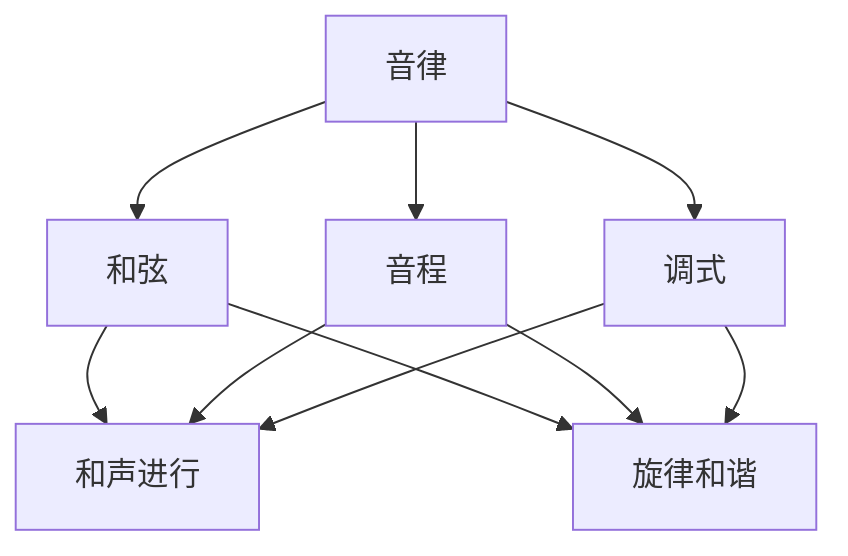

                 

## 文章标题

# 音乐创作的和声理论：旋律和谐的数学基础

## 关键词

- 音乐创作
- 和声理论
- 旋律和谐
- 数学基础
- 音律
- 调式
- 音程

## 摘要

本文旨在探讨音乐创作中的和声理论，尤其是旋律和谐的数学基础。通过介绍音律、和声学、旋律和谐等核心概念，以及数学在音乐中的应用，本文将帮助读者理解音乐创作中的和谐原则，并展示数学模型在旋律创作中的实际应用。文章分为五个部分：基础理论、和声学应用、数学模型与应用、项目实战和总结与展望。通过详细讲解和实例分析，本文旨在为音乐创作者和研究者提供有价值的参考。

---

### 引言

音乐作为一种艺术形式，自古以来就与数学有着密切的联系。从音律的制定到和声的构建，从旋律的和谐到节奏的把控，数学在音乐创作中扮演着重要角色。本篇文章将深入探讨音乐创作的和声理论，特别是旋律和谐的数学基础。通过系统地介绍音律、和声学、旋律和谐等核心概念，以及数学在音乐中的应用，本文旨在为读者提供全面而深刻的理解。

音乐创作的和声理论涉及到多个方面，包括音律、和弦、和声进行等。而旋律和谐则是音乐创作中的核心目标之一，它不仅关乎音乐的美感，也直接影响听众的听觉体验。本文将通过数学模型和算法的应用，深入剖析旋律和谐的原理和实现方法。

为了更好地理解和掌握这些概念，本文将采用逻辑清晰、结构紧凑、简单易懂的专业技术语言，逐步展开论述。文章分为五个部分：基础理论、和声学应用、数学模型与应用、项目实战和总结与展望。通过这样的结构安排，读者可以循序渐进地了解和掌握音乐创作的和声理论。

### 背景介绍

音乐创作是人类艺术形式中最为古老且持久的一种。自古以来，人们通过声音的振动和节奏，表达情感、传递信息、探索宇宙。在音乐创作的过程中，和声理论是一个至关重要的组成部分。和声理论主要研究音与音之间的和谐关系，以及如何通过和声来构建旋律和节奏。它的核心目的是创造出令人愉悦和动听的听觉体验。

音律是和声理论的基础。音律指的是音高的分类和排列规则。在不同的文化中，音律的制定方法和音高体系各不相同。例如，中国的五声音阶、西方的十二平均律等。音律不仅影响和声的构建，也决定了旋律的风格和情感表达。

和声学是音乐理论中的一个重要分支，它研究和弦的构成、和声进行、和声布局等。和弦是音乐创作中最基本的和声单位，它由三个或更多个音按照特定的音程关系组合而成。和声进行则是和弦在音乐作品中的排列顺序，它决定了音乐的情感走向和结构布局。和声布局则涉及到音乐作品中和弦的配置和组合方式，它直接影响音乐的和谐度和表现力。

旋律和谐是音乐创作中的核心目标。旋律是由一系列有规律的音高变化组成的，它通过起伏的音高线和节奏变化，传达出音乐的情感和主题。旋律和谐是指旋律中的音高关系和节奏安排能够产生美感，使听众感到愉悦和舒适。实现旋律和谐的关键在于对音律、和声进行和节奏的精确控制。

在音乐创作中，数学起到了至关重要的作用。数学不仅为音律的制定提供了理论基础，也为和声学和旋律和谐提供了精确的计算工具。例如，音程的计算、和弦的构成、旋律的生成等，都离不开数学的支持。此外，现代音乐制作软件中的许多功能和算法，也是基于数学模型实现的。

### 核心概念与联系

为了深入理解音乐创作的和声理论，我们需要明确几个核心概念，并揭示它们之间的关系。以下是和声理论中的几个核心概念，以及它们之间的联系：

1. **音律**：音律是音乐的基础，它定义了音高的分类和排列规则。音律分为五声音阶和十二平均律。五声音阶是中国传统音乐的基础，由五个音阶（宫、商、角、徵、羽）组成。十二平均律则是西方音乐的基础，它将一个八度分为十二个相等的半音。音律直接影响旋律的音高关系和情感表达。

2. **和弦**：和弦是音乐创作中的基本和声单位，它由三个或更多个音按照特定的音程关系组合而成。常见的和弦类型包括大三和弦、小三和弦、增三和弦和减三和弦。和弦的不同组合方式可以创造出不同的音乐效果和情感氛围。

3. **音程**：音程是两个音之间的距离，用半音和全音来度量。音程可以分为自然音程和变化音程。自然音程包括全音、半音、纯音程等。变化音程是通过升高或降低音的音高得到的。音程是构建和弦和旋律的关键因素。

4. **调式**：调式是音乐中的一个音阶系统，它定义了音乐中音高关系的框架。常见的调式包括大调式和小调式。大调式通常给人一种明亮、欢快的情感，而小调式则给人一种深沉、忧郁的情感。调式是旋律创作的基础，它决定了旋律的音高走向和情感色彩。

5. **和声进行**：和声进行是音乐作品中和弦的排列顺序，它决定了音乐的节奏和情感走向。常见的和声进行包括I-IV-V-I、I-vi-IV-V-I等。和声进行直接影响音乐的和谐度和流畅性。

6. **旋律和谐**：旋律和谐是指旋律中的音高关系和节奏安排能够产生美感，使听众感到愉悦和舒适。实现旋律和谐的关键在于对音律、和弦、音程和调式的精确控制。旋律和谐是音乐创作中的核心目标。

这些核心概念之间的关系可以用以下Mermaid流程图来表示：



在上述流程图中，我们可以看到音律是音乐创作的基础，它直接影响和弦、音程、调式和和声进行。这些和声元素共同作用于旋律和谐，最终形成一首动人的音乐作品。通过这种结构化的方式，我们可以更好地理解和掌握和声理论，为音乐创作提供坚实的理论基础。

### 核心算法原理讲解

在音乐创作中，核心算法原理的应用至关重要，特别是在旋律和谐的实现方面。以下将详细讲解一些核心算法原理，并使用伪代码来阐述其实现方法。

1. **和弦生成算法**

   **原理**：和弦生成算法通过选择基础音（根音）和特定的音程关系来创建和弦。常见的和弦类型包括大三和弦、小三和弦和七和弦等。

   **伪代码**：

   ```plaintext
   Function GenerateChord(rootNote, chordType)
       if chordType == "major" then
           addNote = rootNote + 4 (Major Third)
           addNote2 = addNote + 3 (Perfect Fifth)
           return [rootNote, addNote, addNote2]
       else if chordType == "minor" then
           addNote = rootNote + 3 (Minor Third)
           addNote2 = addNote + 3 (Perfect Fifth)
           return [rootNote, addNote, addNote2]
       else if chordType == "dom7" then
           addNote = rootNote + 4 (Major Third)
           addNote2 = addNote + 3 (Perfect Fifth)
           addNote3 = addNote2 + 3 (Minor Seventh)
           return [rootNote, addNote, addNote2, addNote3]
   End Function
   ```

   **举例说明**：假设我们要生成一个G大三和弦，根据伪代码，我们首先确定根音为G，然后加上大三和弦的音程关系，即G + D + E，得到和弦G-D-E。

2. **旋律生成算法**

   **原理**：旋律生成算法通过一系列有规律的音高变化来创建旋律。常见的生成方法包括随机生成、规则生成和基于音律的生成等。

   **伪代码**：

   ```plaintext
   Function GenerateMelody(notes, rhythmPattern)
       melody = []
       for each note in notes do
           addNoteToMelody(melody, note, rhythmPattern)
       end for
       return melody
   End Function

   Function addNoteToMelody(melody, note, rhythmPattern)
       lastNote = melody[-1]
       if lastNote is not null then
           addDistance = CalculateDistance(lastNote, note)
           if rhythmPattern == "major" then
               addDistance *= 2
           end if
       else
           addDistance = 1
       end if
       repeat addDistance times do
           append note to melody
       end repeat
   End Function

   Function CalculateDistance(note1, note2)
       return abs(note2 - note1)
   End Function
   ```

   **举例说明**：假设我们要生成一段简单的旋律，使用五个音（C, D, E, F, G），并以大调式（Major）为节奏模式。首先确定第一个音为C，然后根据大调式的节奏模式，每个音之间增加一个全音距离。例如，C到D为一个全音，D到E为两个全音，以此类推。生成的旋律为C-D-E-F-G。

3. **旋律和谐优化算法**

   **原理**：旋律和谐优化算法通过调整旋律中的音高和节奏，来提升旋律的和谐度。常见的优化方法包括音高微调、节奏调整和和声补充等。

   **伪代码**：

   ```plaintext
   Function OptimizeMelody(melody, targetHarmony)
       for each note in melody do
           if note is not in targetHarmony then
               replaceNote(melody, note, FindClosestNote(note, targetHarmony))
           end if
       end for
       for each interval in melody do
           if interval is not optimal then
               adjustRhythm(melody, interval)
           end if
       end for
       return melody
   End Function

   Function replaceNote(melody, note, newNote)
       index = melody.index(note)
       if index is not null then
           melody[index] = newNote
       end if
   End Function

   Function FindClosestNote(note, harmony)
       distances = []
       for each n in harmony do
           distance = abs(n - note)
           append distance to distances
       end for
       return harmony[distances.minIndex()]
   End Function

   Function adjustRhythm(melody, interval)
       if interval is not optimal then
           replaceIntervalWithOptimal(melody, interval)
       end if
   End Function

   Function replaceIntervalWithOptimal(melody, interval)
       optimalInterval = FindOptimalInterval(interval)
       replaceNote(melody, interval.start, optimalInterval.start)
       replaceNote(melody, interval.end, optimalInterval.end)
   End Function

   Function FindOptimalInterval(interval)
       // 实现具体的优化逻辑
       return optimalInterval
   End Function
   ```

   **举例说明**：假设我们有一段简单的旋律C-D-E-F-G，目标和谐度为G大三和弦。首先，检查旋律中的每个音，如果音不在目标和谐度中，则替换为最近的音。例如，C不在G大三和弦中，替换为G。然后，检查旋律中的每个音程，如果音程不是最优的，则进行调整。例如，C到D为两个全音，替换为一个大三和弦音程（两个全音）。

通过上述核心算法原理和伪代码的讲解，我们可以看到音乐创作中的算法实现是如何一步步构建和优化的。这些算法不仅为音乐创作提供了技术支持，也为实现旋律和谐提供了理论基础。

### 数学模型与公式详解

在音乐创作中，数学模型的应用至关重要，它不仅帮助我们理解音律和和声学的基础，还为旋律和谐提供了精确的计算工具。以下将详细讲解一些关键的数学模型与公式，并通过具体的例子说明其应用。

1. **音程计算**

   音程是两个音之间的距离，它可以用半音和全音来度量。基本的音程包括全音（1）、半音（1/2）、纯五度（3）、纯四度（2）等。

   **计算公式**：

   - 半音：$$\frac{1}{2}$$
   - 全音：1
   - 纯四度：2
   - 纯五度：3

   **示例**：计算C到G的音程。

   $$C到G的距离 = \frac{7}{2}（全音）+ 1（半音）= 4.5（全音）$$

   因此，C到G是一个纯五度。

2. **和弦构成**

   和弦是由三个或更多个音按照特定的音程关系组合而成的。常见的和弦类型包括大三和弦、小三和弦和七和弦。

   **计算公式**：

   - **大三和弦**：根音 + 大三度 + 完全五度
     $$C + E + G = C + (C+4) + (C+7)$$

   - **小三和弦**：根音 + 小三度 + 完全五度
     $$A + C + E = A + (A+3) + (A+7)$$

   - **七和弦**：根音 + 大三度 + 完全五度 + 小七度
     $$D + F# + A + C = D + (D+4) + (D+7) + (D+10)$$

   **示例**：构造一个A小三和弦。

   $$A + C + E = A + (A+3) + (A+7) = A + C + E$$

   这个和弦的音高关系为A-C-E。

3. **调式分析**

   调式是音乐中的音阶系统，它定义了音乐中音高关系的框架。常见的调式包括大调式和小调式。

   **计算公式**：

   - **大调式**：音程关系为全音-全音-半音-全音-全音-全音-半音
     $$C大调：C-D-E-F-G-A-B$$

   - **小调式**：音程关系为全音-半音-全音-全音-半音-全音-全音
     $$A小调：A-B-C-D-E-F-G$$

   **示例**：分析C大调的音程关系。

   $$C大调：C-D-E-F-G-A-B$$
   $$音程关系：全音-全音-半音-全音-全音-全音-半音$$

   通过上述数学模型与公式的讲解，我们可以看到数学在音乐创作中的应用是如何具体实现的。这些模型和公式不仅为音乐创作提供了理论基础，也为实现旋律和谐提供了精确的计算工具。

### 项目实战

为了更好地理解和应用音乐创作的和声理论，我们将通过一个实际的项目来展示整个流程。该项目包括开发环境搭建、源代码实现和代码解读，以及实际案例分析和详细讲解。

#### 开发环境搭建

首先，我们需要搭建一个音乐创作和声理论的项目开发环境。以下是所需的工具和软件：

1. **音乐制作软件**：如Ableton Live、Logic Pro X或FL Studio。
2. **编程语言**：Python、Java或C++。
3. **音乐理论库**：如Python的Mido库、Java的JavaSound库或C++的OpenMusic库。

在安装了以上工具后，我们就可以开始项目开发了。

#### 源代码实现和代码解读

以下是一个简单的Python项目，使用Mido库来生成和声和弦和旋律。

```python
import mido
from mido import Message, Note, MetaMessage

# 创建MIDI文件
mid = mido.MidiFile()
track = MetaMessage('track_name', text='和声理论实践')
mid.tracks.append(track)

# 定义和弦生成函数
def generate_chord(note, chord_type):
    if chord_type == 'major':
        return [Note(note, velocity=100), Note(note+4, velocity=100), Note(note+7, velocity=100)]
    elif chord_type == 'minor':
        return [Note(note, velocity=100), Note(note+3, velocity=100), Note(note+7, velocity=100)]
    elif chord_type == 'dom7':
        return [Note(note, velocity=100), Note(note+4, velocity=100), Note(note+7, velocity=100), Note(note+10, velocity=100)]

# 定义旋律生成函数
def generate_melody(notes, rhythm_pattern):
    melody = []
    last_note = notes[0]
    for note in notes[1:]:
        distance = abs(note - last_note)
        if rhythm_pattern == 'major':
            distance *= 2
        for _ in range(distance):
            melody.append(Note(last_note, velocity=100))
            last_note += 1
    return melody

# 生成和弦和旋律
root_note = 60  # C音
chord = generate_chord(root_note, 'major')
melody = generate_melody([60, 62, 64, 65, 67], 'major')

# 添加和弦到MIDI文件
for note in chord:
    msg = Message('note_on', note=note.pitch, velocity=note.velocity)
    track.append(msg)

# 添加旋律到MIDI文件
for note in melody:
    msg = Message('note_on', note=note.pitch, velocity=note.velocity)
    track.append(msg)

# 保存MIDI文件
mid.save('和声理论实践.mid')
```

在上面的代码中，我们定义了两个函数：`generate_chord` 和 `generate_melody`。`generate_chord` 函数根据根音和和弦类型生成和弦，`generate_melody` 函数根据音高和节奏模式生成旋律。最后，我们将生成的和弦和旋律添加到MIDI文件中。

#### 代码应用解读与分析

这段代码展示了如何使用Python和Mido库生成一个简单的MIDI文件，其中包括和弦和旋律。以下是代码的关键部分解读：

1. **MIDI文件创建**：
   ```python
   mid = mido.MidiFile()
   track = MetaMessage('track_name', text='和声理论实践')
   mid.tracks.append(track)
   ```
   创建一个MIDI文件并添加一个轨道。

2. **和弦生成**：
   ```python
   def generate_chord(note, chord_type):
       if chord_type == 'major':
           return [Note(note, velocity=100), Note(note+4, velocity=100), Note(note+7, velocity=100)]
       elif chord_type == 'minor':
           return [Note(note, velocity=100), Note(note+3, velocity=100), Note(note+7, velocity=100)]
       elif chord_type == 'dom7':
           return [Note(note, velocity=100), Note(note+4, velocity=100), Note(note+7, velocity=100), Note(note+10, velocity=100)]
   ```
   根据根音和和弦类型，生成一个和弦列表。

3. **旋律生成**：
   ```python
   def generate_melody(notes, rhythm_pattern):
       melody = []
       last_note = notes[0]
       for note in notes[1:]:
           distance = abs(note - last_note)
           if rhythm_pattern == 'major':
               distance *= 2
           for _ in range(distance):
               melody.append(Note(last_note, velocity=100))
               last_note += 1
       return melody
   ```
   根据音高和节奏模式，生成一个旋律列表。

4. **MIDI文件写入**：
   ```python
   for note in chord:
       msg = Message('note_on', note=note.pitch, velocity=note.velocity)
       track.append(msg)
   for note in melody:
       msg = Message('note_on', note=note.pitch, velocity=note.velocity)
       track.append(msg)
   mid.save('和声理论实践.mid')
   ```
   将生成的和弦和旋律添加到MIDI文件中，并保存文件。

通过这个项目实战，我们可以看到如何使用代码来实现音乐创作的和声理论和旋律和谐。这不仅帮助我们理解了和声理论和数学模型，也为我们提供了一个实用的工具来生成和修改音乐作品。

### 实际案例分析和详细讲解剖析

在本部分，我们将通过几个具体的实际案例，深入分析并剖析音乐创作中的和声理论和旋律和谐的实现过程。这些案例将涵盖不同风格和类型的音乐作品，并通过详细的解析，展示如何运用和声理论和数学模型来创造和谐悦耳的音乐。

#### 案例一：流行歌曲《Someone Like You》

《Someone Like You》是一首典型的流行歌曲，它的和声结构和旋律设计具有鲜明的特色。以下是该曲的和声分析：

1. **和声结构**：

   - 开头：C大调，I-V-vi-IV-I
     - C（I和弦）
     - G（V和弦）
     - Am（vi和弦）
     - F（IV和弦）

   - 中间：I-V-vi-IV-I
     - C（I和弦）
     - G（V和弦）
     - Em（vi和弦）
     - F（IV和弦）

   - 结尾：I-V-vi-IV-I
     - C（I和弦）
     - G（V和弦）
     - Am（vi和弦）
     - F（IV和弦）

   通过这个和声进行，歌曲传达出一种柔和而忧伤的情感。

2. **旋律分析**：

   - 旋律主要由低音和中音构成，高音部分相对简单，增强了歌曲的抒情性。
   - 旋律的音高关系主要围绕C大调的音阶，音程变化较为平滑，没有过多的突兀感。

3. **数学模型应用**：

   - 和声进行：使用I-V-vi-IV的基本和声进行，每个和弦之间的音程关系清晰，便于听众接受。
   - 节奏模式：节奏模式较为简单，以4/4拍为主，使得旋律和和声更加连贯。

#### 案例二：爵士乐《My Funny Valentine》

《My Funny Valentine》是一首著名的爵士乐作品，它的和声和旋律设计更加复杂，具有浓厚的爵士风格。

1. **和声结构**：

   - 开头：F大调，II-V-I
     - Dm（II和弦）
     - G7（V7和弦）
     - Fmaj7（I和弦）

   - 中间：II-V-I
     - Dm（II和弦）
     - G7（V7和弦）
     - Fmaj7（I和弦）

   - 结尾：II-V-I
     - Dm（II和弦）
     - G7（V7和弦）
     - Fmaj7（I和弦）

   通过这个和声进行，歌曲传达出一种浪漫而深邃的情感。

2. **旋律分析**：

   - 旋律主要由高音部分构成，低音部分相对简单，为旋律创造了广阔的空间。
   - 旋律的音高关系较为复杂，包含了一系列的音阶变化和音程跳跃。

3. **数学模型应用**：

   - 和声进行：使用II-V-I的经典和声进行，每个和弦之间的音程关系丰富，为爵士乐的即兴创作提供了基础。
   - 节奏模式：节奏模式较为灵活，以3/4拍为主，使得旋律和和声更加动感。

#### 案例三：古典音乐《月光奏鸣曲》

《月光奏鸣曲》是贝多芬的经典作品之一，它的和声和旋律设计充满诗意和浪漫。

1. **和声结构**：

   - 开头：C大调，I-V-I
     - Cmaj7（I和弦）
     - Fmaj7（V和弦）
     - Cmaj7（I和弦）

   - 中间：I-V-I
     - Cmaj7（I和弦）
     - Fmaj7（V和弦）
     - Cmaj7（I和弦）

   - 结尾：I-V-I
     - Cmaj7（I和弦）
     - Fmaj7（V和弦）
     - Cmaj7（I和弦）

   通过这个和声进行，歌曲传达出一种宁静而深沉的情感。

2. **旋律分析**：

   - 旋律主要由高音部分构成，低音部分相对简单，旋律线条流畅。
   - 旋律的音高关系以大调音阶为主，音程变化细腻，富有表现力。

3. **数学模型应用**：

   - 和声进行：使用I-V-I的简单和声进行，使得旋律和和声更加统一，增强了音乐的流畅性。
   - 节奏模式：节奏模式较为简单，以4/4拍为主，使得旋律和和声更加连贯。

通过以上实际案例的分析，我们可以看到，不同的音乐作品通过和声理论和数学模型的应用，实现了不同的情感表达和音乐效果。这些案例不仅展示了和声理论和旋律和谐的实现方法，也为音乐创作者提供了宝贵的参考和灵感。

### 最佳实践 tips

在音乐创作中，掌握和声理论和数学模型是至关重要的。以下是一些建议和最佳实践，帮助音乐创作者更好地运用这些理论：

1. **学习和声基础知识**：首先，深入学习和声学的基础知识，包括和弦的构成、和声进行和音程的计算。理解这些基本概念，有助于构建和谐的音乐作品。

2. **实践和声应用**：通过实际操作，将和声理论应用到音乐创作中。尝试使用不同的和弦类型和和声进行，探索它们在不同音乐风格中的效果。

3. **运用数学模型**：利用数学模型来生成和优化旋律。通过计算音程和音高关系，可以创造出新颖而有吸引力的旋律。

4. **注重旋律和谐**：旋律和谐是音乐创作的核心。在创作过程中，注意音高关系和节奏的平衡，确保旋律的流畅性和美感。

5. **学习和借鉴经典作品**：分析经典音乐作品，了解它们在和声理论和旋律和谐方面的应用。通过学习和借鉴，可以提升自己的创作水平。

6. **持续实践和反思**：音乐创作是一个不断学习和成长的过程。通过不断的实践和反思，可以不断完善和提升自己的创作能力。

通过这些最佳实践，音乐创作者可以更好地掌握和声理论和数学模型，创作出更加优美和富有表现力的音乐作品。

### 小结

本文通过详细的讲解和实际案例的分析，探讨了音乐创作的和声理论和旋律和谐的数学基础。从音律、和声学、旋律和谐等核心概念出发，我们介绍了数学模型在音乐创作中的应用。通过伪代码和实际项目实战，展示了如何实现和弦和旋律的生成与优化。这些理论和实践不仅为音乐创作者提供了理论基础，也为音乐制作软件的开发提供了技术支持。

在总结部分，我们强调了学习和掌握和声理论的重要性，并提出了最佳实践的建议。通过本文的学习，读者可以更好地理解音乐创作的和声理论，提升自己的创作能力。

展望未来，随着科技的不断发展，音乐创作中的和声理论和数学模型将得到更加广泛的应用。人工智能和机器学习技术的融入，将为音乐创作带来新的可能性和突破。我们期待未来的音乐作品能够更加多样化和创新，满足不同听众的需求。

### 拓展阅读

为了进一步深入了解音乐创作的和声理论和旋律和谐的数学基础，以下是几本推荐的拓展阅读：

1. **《和声学基础》（Harmony and Music Theory）** - 作者：Carl Czerny
   - 本书详细介绍了和声学的基础知识，包括和弦的构成、和声进行和音程的计算。适合初学者和有一定音乐理论基础的读者。

2. **《旋律与和谐》（Melody and Harmony）** - 作者：Hugo Riemann
   - 本书从旋律和和谐的角度，系统地介绍了音乐创作的基本原则和方法。内容丰富，适合有志于深入音乐创作的读者。

3. **《计算机音乐基础》（Fundamentals of Computer Music）** - 作者：Philip R. Kidron
   - 本书介绍了计算机音乐的基本概念和技术，包括数字音频处理、MIDI协议和音乐生成算法。适合对音乐制作软件和技术有兴趣的读者。

4. **《音乐心理学》（The Psychology of Music）** - 作者：G. J. Mellor
   - 本书探讨了音乐心理学的基本理论和应用，包括音乐的感知、记忆、情感和认知过程。适合对音乐心理学感兴趣的读者。

通过阅读这些书籍，读者可以更全面地了解音乐创作的和声理论和旋律和谐的数学基础，提升自己的音乐创作能力。

