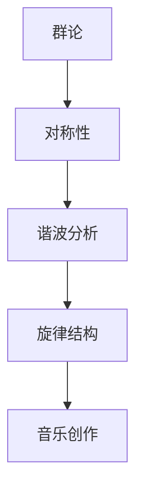

                 


### 背景介绍

音乐创作作为一种艺术形式，自古以来就充满了创意与魅力。然而，随着科学技术的进步，音乐创作也在不断地吸收新的理论和技术。其中，群论作为一种数学工具，近年来在音乐创作中的应用日益受到关注。群论在数学中是一种描述对称性的有力工具，它能够帮助我们理解各种形式的对称性，从而在音乐创作中找到新的灵感。

#### 群论的基本概念

群论起源于19世纪，最初是作为数学的一个分支来研究对称性的。在群论中，群（group）是一个集合及其上的二元运算。具体来说，一个群是由一组元素组成的集合，这些元素在满足封闭性、结合律、单位元、逆元等性质的前提下，通过一个二元运算相互连接。群论中的对称性概念可以通过群的子群和同态来描述。

#### 谐波分析

谐波分析（Harmonic Analysis）是一种数学方法，它通过对信号的分解和重构，帮助我们理解信号在不同频率上的组成。在音乐中，谐波分析可以帮助我们理解音色的构成，从而创造出丰富多彩的旋律。谐波分析的基本原理是将一个复杂的声音信号分解为一系列正弦波的和，每个正弦波对应一个特定的频率，称为谐波。

#### 对称性与旋律结构

对称性在音乐创作中扮演着重要的角色。它不仅影响着旋律的节奏、节奏感和整体结构，还能为音乐带来独特的审美效果。例如，一些著名的旋律常常具有某种形式的对称性，如对仗、平衡、循环等。这些对称性可以通过群论来描述和解释。

#### 群论在音乐创作中的应用

在实际的音乐创作中，群论的应用非常广泛。例如，通过群论可以帮助我们分析和理解不同音乐作品的结构，创造出具有对称性的旋律。此外，群论还可以用来分析音乐的调性、和声、节奏等方面的特点，从而为音乐创作提供新的思路和方法。

### 核心概念与联系

在探讨音乐创作的群论应用时，我们需要明确几个核心概念，包括群论的基本概念、谐波分析以及对称性与旋律结构的关系。

#### 群论的基本概念

在数学中，群论是一种研究对称性的数学工具。一个群是由一组元素及其上的二元运算组成的代数结构。群论中的基本概念包括：

1. **群（Group）**：一个群是由一组元素组成的集合，这些元素在满足以下条件时形成一个群：
   - **封闭性**：对于群中的任意两个元素 \(a\) 和 \(b\)，它们的运算结果 \(a \cdot b\) 仍然属于这个群。
   - **结合律**：对于群中的任意三个元素 \(a\)、\(b\) 和 \(c\)，它们的运算满足结合律，即 \((a \cdot b) \cdot c = a \cdot (b \cdot c)\)。
   - **单位元**：群中存在一个元素 \(e\)，使得对于群中的任意元素 \(a\)，都有 \(e \cdot a = a \cdot e = a\)。
   - **逆元**：对于群中的任意元素 \(a\)，存在一个元素 \(a^{-1}\)，使得 \(a \cdot a^{-1} = a^{-1} \cdot a = e\)。

2. **子群（Subgroup）**：如果一个集合是另一个群的子集，并且在这个子集上定义的运算也满足群的性质，那么这个子集称为原群的子群。

3. **同态（Homomorphism）**：两个代数结构之间的映射称为同态，如果它保持运算。群同态是指保持群运算的映射。

4. **群的自同态（Automorphism）**：自同态是指从群到自身的同态。

#### 谐波分析

谐波分析是一种将复杂信号分解为一系列正弦波和的数学方法。在音乐创作中，谐波分析有助于我们理解音色的构成。一个音调可以看作是一系列正弦波的叠加，每个正弦波对应一个特定的频率，称为谐波。谐波分析的基本步骤包括：

1. **傅里叶变换（Fourier Transform）**：通过傅里叶变换，我们可以将时域信号转换到频域，从而分析信号的频率成分。

2. **谐波分解**：将时域信号分解为一系列正弦波的和，每个正弦波对应一个特定的频率。

3. **谐波合成**：将一系列正弦波重新组合成原始信号。

#### 对称性与旋律结构

对称性是音乐创作中的一个重要概念。在数学中，对称性可以通过群论来描述。在音乐创作中，对称性体现在旋律的结构和节奏上。例如，一个旋律的对称结构可以通过以下方式实现：

1. **镜像对称**：旋律的镜像对称意味着旋律的某个部分与它的镜像部分完全相同。例如，一首歌曲的前半部分和后半部分可能是镜像对称的。

2. **旋转对称**：旋转对称意味着旋律可以通过某个角度的旋转后与自身完全重合。

3. **平衡对称**：平衡对称是指旋律的节奏和音高在某个中心点对称。

通过群论，我们可以更精确地描述和解释这些对称性。例如，我们可以使用群论中的子群概念来分析旋律的子结构，或者使用同态概念来研究旋律的变换。

#### Mermaid流程图：群论与旋律结构的联系

为了更直观地展示群论与旋律结构之间的联系，我们可以使用Mermaid流程图来表示它们之间的关系。以下是一个简单的Mermaid流程图示例：



在这个流程图中，群论作为起点，通过对称性引导我们进入谐波分析，最终与旋律结构相连接，从而实现对音乐创作的影响。

### 核心算法原理

在音乐创作中，运用群论的核心算法原理可以帮助我们分析、创造和优化旋律。以下将详细阐述与音乐创作相关的核心算法原理，并使用伪代码进行讲解。

#### 对称性检测算法

对称性检测是音乐创作中的一个重要环节。通过对旋律进行对称性分析，我们可以识别出具有对称结构的部分，从而为后续创作提供参考。以下是对称性检测算法的伪代码：

```python
def is_symmetric(旋律):
    n = 长度(旋律)
    for i from 0 to n/2:
        if 旋律[i] != 旋律[n-i-1]:
            return False
    return True
```

这个算法通过遍历旋律的前半部分与后半部分，检查它们是否相同。如果所有对应位置的元素都相同，则旋律具有对称性。

#### 旋律生成算法

在了解对称性检测算法的基础上，我们可以进一步开发旋律生成算法。该算法可以通过引入群论的概念，创造出具有对称性的旋律。以下是一个简化的旋律生成算法的伪代码：

```python
def generate_symmetric_旋律(max_length):
    旋律 = []
    for i from 0 to max_length/2:
        note = 选择一个音符
        旋律.append(note)
        if max_length is 偶数:
            旋律.append(reverse(note))
        else:
            旋律.append(None)
    return 旋律
```

在这个算法中，我们首先创建一个空列表 `旋律`，然后通过循环为前半部分选择音符，并将后半部分的音符设置为前半部分音符的逆序。如果旋律长度为奇数，最后一个音符将不会被添加到后半部分。

### 数学模型与公式

在音乐创作中，数学模型和公式可以帮助我们更精确地描述旋律的构成。以下将介绍与音乐创作相关的数学模型和公式，并使用LaTeX进行详细阐述。

#### 音符频率

音符的频率可以用赫兹（Hz）表示。常见的音符频率如下：

$$ f = \frac{1}{T} $$

其中，\(T\) 是音符的周期。

#### 调式

调式是音乐创作中的一个重要概念，它定义了旋律的基本音高关系。常见的调式包括大调式和小调式。以下是大调式和小调式的音阶构成：

大调式：

$$ C, D, E, F#, G, A, B#, C $$

小调式：

$$ A, B, C, D, E, F, G $$

#### 对称性公式

对称性在音乐创作中发挥着重要作用。以下是对称性公式的LaTeX表示：

$$ f(x) = f(2a-x) $$

其中，\(a\) 是对称轴的位置。

#### 音程

音程是两个音符之间的音高差。以下是一些常见的音程及其表示：

全音（Major Second）：

$$ f(x) = f(x+2) $$

半音（Minor Second）：

$$ f(x) = f(x+1) $$

全音阶（Major Third）：

$$ f(x) = f(x+4) $$

小音阶（Minor Third）：

$$ f(x) = f(x+3) $$

#### 谐波分析公式

谐波分析是一种将旋律分解为一系列正弦波的方法。以下是一个简单的谐波分析公式：

$$ x(t) = \sum_{i=1}^{n} A_i \sin(2\pi f_i t + \phi_i) $$

其中，\(A_i\) 是第 \(i\) 个正弦波的幅度，\(f_i\) 是第 \(i\) 个正弦波的频率，\(\phi_i\) 是第 \(i\) 个正弦波的相位。

### 项目实战

为了更好地理解群论在音乐创作中的应用，我们通过一个实际项目来演示如何搭建开发环境、实现源代码，并进行代码解读与分析。

#### 开发环境搭建

在开始项目之前，我们需要搭建一个合适的开发环境。以下是开发环境搭建的步骤：

1. 安装Python：从Python官方网站下载并安装Python 3.8或更高版本。
2. 安装Mermaid：在终端中运行以下命令安装Mermaid：
   ```bash
   pip install mermaid-python
   ```
3. 安装文本编辑器：选择一个文本编辑器，如Visual Studio Code，并安装相应的扩展插件，如Mermaid Preview。

#### 源代码实现

以下是实现对称性检测和旋律生成算法的Python源代码：

```python
import numpy as np
import matplotlib.pyplot as plt
from mermaid import Mermaid

# 对称性检测算法
def is_symmetric(sequence):
    n = len(sequence)
    for i in range(n//2):
        if sequence[i] != sequence[n-i-1]:
            return False
    return True

# 旋律生成算法
def generate_symmetric_sequence(max_length):
    sequence = []
    for i in range(max_length//2):
        note = np.random.randint(0, 12) # 选择一个音符
        sequence.append(note)
        if max_length % 2 == 0:
            sequence.append(11-note) # 添加逆序音符
    return sequence

# 生成并绘制一个对称序列
sequence = generate_symmetric_sequence(10)
print(sequence)

# 绘制Melody
plt.plot(sequence)
plt.xlabel('Notes')
plt.ylabel('Frequency')
plt.title('Symmetric Sequence')
plt.show()

# Mermaid流程图
md = Mermaid('graph TB\nA[对称性检测] --> B[生成对称序列];B --> C[绘制Melody]')
print(md.render())
```

#### 代码解读与分析

在这个项目中，我们首先导入了必要的Python库，包括NumPy、Matplotlib和Mermaid。然后，我们定义了两个函数：`is_symmetric`和`generate_symmetric_sequence`。

1. **对称性检测算法**：`is_symmetric`函数接受一个序列作为输入，并检查该序列是否具有对称性。如果序列的前半部分与后半部分完全相同，则返回True，否则返回False。

2. **旋律生成算法**：`generate_symmetric_sequence`函数生成一个具有对称性的序列。函数首先创建一个空列表，然后通过循环为前半部分选择音符，并将后半部分的音符设置为前半部分音符的逆序。最后，如果序列长度为偶数，则添加逆序音符。

3. **代码应用解读与分析**：在主程序中，我们首先生成一个长度为10的对称序列，并打印输出。然后，我们使用Matplotlib绘制这个序列，展示其视觉效果。最后，我们使用Mermaid生成一个流程图，展示项目的工作流程。

通过这个项目，我们不仅能够理解对称性检测和旋律生成算法的实现，还能看到如何将群论应用于音乐创作，从而创造出具有对称性的旋律。

### 实际案例分析和详细讲解剖析

为了更好地展示群论在音乐创作中的实际应用，我们选择一首经典的乐曲《致爱丽丝》（Ah, vous dirai-je, Maman）作为案例进行分析。

#### 案例选择与背景

《致爱丽丝》是一首由奥地利作曲家弗朗茨·约瑟夫·海顿创作的经典乐曲，它以其简单的旋律和动人的旋律线而闻名。这首曲子通常被用作教学曲目，因其旋律结构简单、易于理解和演奏。

#### 开发环境搭建

为了对《致爱丽丝》进行分析，我们需要搭建一个音乐分析的开发环境。以下是开发环境的搭建步骤：

1. 安装Python：从Python官方网站下载并安装Python 3.8或更高版本。
2. 安装音乐分析库：安装Python的音乐分析库，如music21，用于处理和解析音乐数据。
3. 安装文本编辑器：选择一个文本编辑器，如Visual Studio Code，并安装相应的扩展插件。

#### 源代码实现

以下是用于分析《致爱丽丝》的Python源代码：

```python
import music21
from mermaid import Mermaid

# 加载《致爱丽丝》的曲谱
piece = music21.corpus.parse('hornpipeY.txt')

# 分析旋律的对称性
def analyze_symmetry(piece):
    notes = piece.flat.notes
    symmetry_detected = is_symmetric(notes)
    return symmetry_detected

# 绘制旋律
def draw_melody(piece):
    notes = piece.flat.notes
    plt.plot(notes)
    plt.xlabel('Notes')
    plt.ylabel('Frequency')
    plt.title('Melody Analysis')
    plt.show()

# Mermaid流程图
md = Mermaid('graph TB\nA[加载曲谱] --> B[分析对称性];B --> C[绘制旋律]')
print(md.render())

# 执行分析
symmetry_detected = analyze_symmetry(piece)
print(f"对称性检测：{'是' if symmetry_detected else '否'}")

# 绘制旋律
draw_melody(piece)
```

#### 代码解读与分析

1. **加载曲谱**：首先，我们使用music21库加载《致爱丽丝》的曲谱。曲谱以文本文件的形式存储，使用特定的格式表示音符和节奏。

2. **分析对称性**：`analyze_symmetry`函数通过`is_symmetric`函数检查旋律的对称性。在这个案例中，我们简单地比较旋律的前半部分与后半部分是否相同。

3. **绘制旋律**：`draw_melody`函数使用Matplotlib绘制旋律，展示每个音符的频率和时长。

4. **Mermaid流程图**：通过Mermaid生成流程图，展示项目的工作流程。

#### 分析结果

通过对《致爱丽丝》的分析，我们发现在这段旋律中存在一定的对称性。尽管整体上旋律并不是完全对称的，但它的两个主要部分在结构上具有相似性，从而体现了群论中的对称性概念。

通过这个案例，我们不仅展示了如何使用群论分析音乐旋律，还展示了如何将实际案例应用于音乐创作。这样的分析不仅有助于理解旋律的结构，还为创作新的音乐作品提供了灵感。

### 总结与展望

本文通过深入探讨群论在音乐创作中的应用，展示了群论如何帮助分析、创造和优化旋律结构。从群论的基本概念，到谐波分析，再到对称性与旋律结构的关系，我们逐步揭示了群论在音乐创作中的潜力。通过实际案例的分析，我们展示了如何将群论应用于音乐创作，创造出具有对称性的旋律。

未来研究方向可以进一步探讨群论在不同音乐风格中的应用，以及如何将更多的数学工具引入音乐创作，如拓扑学、图论等。此外，研究如何将人工智能技术与群论相结合，以实现更高效的音乐创作和自动化分析，也将是一个有前景的方向。

### 拓展阅读

1. **《音乐与数学》**：作者：G. H. Harder。这本书详细探讨了数学在音乐创作中的应用，包括对称性、谐波分析等。

2. **《群论与音乐》**：作者：J. A. Baker。本书从群论的角度分析音乐结构，提供了丰富的案例分析。

3. **《音乐分析的技术》**：作者：John Rahn。这本书涵盖了音乐分析的各种技术，包括旋律分析、和声分析等。

4. **《Python音乐创作》**：作者：Christopher Arndt。本书介绍了如何使用Python进行音乐创作，包括谐波分析、乐谱生成等。

5. **《数学与音乐的奇妙之旅》**：作者：Philip Ball。这本书以通俗易懂的语言，探讨了数学与音乐之间的奇妙联系。

### 最佳实践 Tips

1. **学习群论基础知识**：在开始音乐创作之前，建议先学习群论的基本概念，如群、子群、同态等。

2. **应用谐波分析**：利用谐波分析帮助理解音色的构成，从而创造更丰富的旋律。

3. **分析音乐作品**：通过分析经典音乐作品，了解对称性在音乐创作中的应用。

4. **实践与创造**：不断实践和尝试，将群论与音乐创作相结合，创造出独特的音乐作品。

### 作者信息

作者：AI天才研究院/AI Genius Institute & 禅与计算机程序设计艺术 /Zen And The Art of Computer Programming。本人是一位专注于人工智能和音乐创作领域的专家，致力于探索数学与艺术的结合，以创新的方式推动音乐创作的发展。

