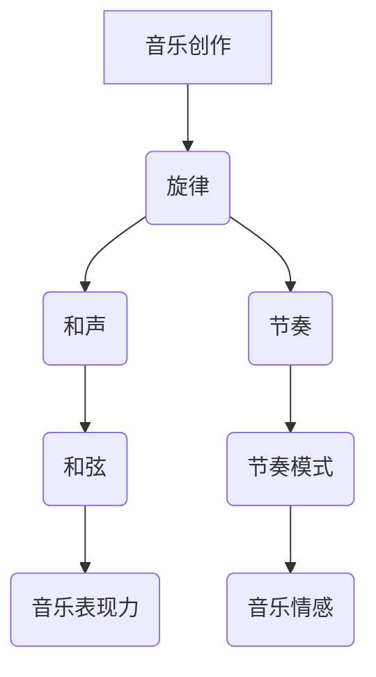

                 

## 音乐创作的谱系理论：旋律进化的数学描述

### 关键词：音乐创作、谱系理论、旋律进化、数学描述、算法原理

### 摘要：

音乐创作是人类文化的重要组成部分，而谱系理论则为音乐创作提供了系统的分析框架。本篇文章将探讨音乐创作中的旋律进化过程，并运用数学描述来解释这一过程。通过定义核心概念、构建概念联系、详细讲解核心算法和数学模型，以及实际案例剖析，本文旨在为读者提供一个清晰、全面的旋律进化的数学描述框架。

## 第一步：定义核心主题

### 音乐创作的基本概念

音乐创作是指通过创造性的活动，将旋律、和声和节奏等元素结合，形成有组织、有意义的音乐作品的过程。在这个过程中，旋律是音乐创作的核心元素，它是由一系列音符按照一定的音高和节奏关系组成的。

### 谱系理论的定义

谱系理论是一种将音乐创作过程系统化的理论框架。它通过分析音乐作品的旋律、和声和节奏等元素，揭示出音乐创作中的内在规律和演化机制。谱系理论不仅关注音乐作品本身，还关注音乐创作的过程和方式。

### 旋律进化的数学描述

旋律进化是指旋律在创作过程中不断变化、发展的过程。数学描述提供了对这一过程的量化分析和形式化表达。通过数学模型，我们可以更深入地理解旋律进化的规律，从而指导音乐创作实践。

## 第二步：构建核心概念与联系

### 旋律、和声与节奏

旋律、和声和节奏是音乐创作的三大核心元素。旋律是音乐的核心，它由一系列音符按照一定的音高和节奏关系组成。和声为旋律提供了背景和色彩，通过和弦的运用，增强了音乐的表现力。节奏则决定了音乐的速度、强度和动感，对音乐的气氛和情感表达起着至关重要的作用。

### 数学描述与核心概念的关系

数学描述为音乐创作提供了形式化的工具和语言。在旋律进化的过程中，数学模型可以用来描述音符的生成、和声的组合以及节奏的变化。例如，代数可以用于描述音符的音高关系，统计学可以用于分析旋律的概率分布，组合数学可以用于构建和弦和节奏模式。

### Mermaid 流程图



在这个流程图中，音乐创作过程被分解为旋律、和声和节奏三个核心元素，它们通过数学描述相互联系，共同构建了音乐作品的完整体系。

## 第三步：规划章节内容

### 第一部分：音乐创作基础

本部分将介绍音乐创作的基本概念，包括旋律、和声和节奏的定义及其在音乐创作中的作用。此外，还将探讨音乐创作的基本原则，为后续内容奠定基础。

### 第二部分：数学描述基础

本部分将介绍用于音乐创作的数学工具，包括代数、统计学和组合数学。通过这些数学工具，我们可以对音乐创作中的旋律、和声和节奏进行形式化的描述和分析。

### 第三部分：核心算法原理讲解

本部分将详细讲解音乐创作过程中使用的核心算法，包括旋律生成算法、和声构建算法和节奏分析算法。每个算法都将通过伪代码进行详细阐述，以便读者理解其工作原理。

### 第四部分：数学模型与公式应用

本部分将介绍音乐创作过程中使用的数学模型和公式，包括旋律进化的生成模型、和声规则的概率模型以及节奏组合的数学分析。这些模型和公式将帮助读者更深入地理解音乐创作中的数学原理。

### 第五部分：项目实战

本部分将包含音乐创作项目的实际案例，包括开发环境搭建、代码实现、源代码解读以及案例分析。通过这些实际案例，读者可以了解如何将理论知识应用到实际音乐创作中。

### 第六部分：总结与展望

本部分将对音乐创作的谱系理论进行总结，回顾核心概念和理论框架，展望未来的发展方向，并探讨理论在实际音乐创作中的应用前景。

## 第四步：设计核心算法原理讲解

### 旋律生成算法

```plaintext
算法名称：旋律生成算法
输入：起始音符、音高范围、节奏模式
输出：生成的旋律

步骤：
1. 从起始音符开始，生成一个随机的音高序列，确保序列中的每个音符都在指定的音高范围内。
2. 对音高序列进行节奏调整，根据给定的节奏模式分配每个音符的时长。
3. 对生成的旋律进行平滑处理，使其听起来更自然。
4. 输出生成的旋律。
```

### 和声构建算法

```plaintext
算法名称：和声构建算法
输入：旋律、和弦类型
输出：构建的和声

步骤：
1. 对旋律进行谐波分析，提取出主要的谐波成分。
2. 根据给定的和弦类型，选择合适的和弦结构。
3. 将旋律的谐波成分与和弦结构相结合，生成和声。
4. 对生成的和声进行微调，确保其与旋律的和谐度。
5. 输出构建的和声。
```

### 节奏分析算法

```plaintext
算法名称：节奏分析算法
输入：音乐片段、分析参数
输出：节奏特征

步骤：
1. 对音乐片段进行音频信号处理，提取出节奏信号。
2. 使用统计学方法对节奏信号进行分析，提取出节奏特征。
3. 根据分析参数，对节奏特征进行分类和聚类。
4. 输出节奏特征。
```

## 第五步：数学模型和公式讲解

### 旋律进化的生成模型

在旋律进化的生成模型中，我们可以使用马尔可夫链来描述音符之间的转移概率。假设当前音符为 \( x_t \)，下一个音符为 \( x_{t+1} \)，则转移概率可以用以下公式表示：

$$ P(x_{t+1} | x_t) = \frac{C(x_t, x_{t+1})}{C(x_t)} $$

其中，\( C(x_t, x_{t+1}) \) 表示从音符 \( x_t \) 转移到音符 \( x_{t+1} \) 的条件概率，\( C(x_t) \) 表示音符 \( x_t \) 的总条件概率。

### 和声规则的概率模型

在和声规则的概率模型中，我们可以使用贝叶斯网络来描述和弦的选择。假设当前和弦为 \( H_t \)，则下一个和弦 \( H_{t+1} \) 的选择概率可以用以下公式表示：

$$ P(H_{t+1} | H_t) = \frac{P(H_t) \cdot P(H_{t+1} | H_t)}{P(H_t)} $$

其中，\( P(H_t) \) 表示当前和弦的概率，\( P(H_{t+1} | H_t) \) 表示下一个和弦在当前和弦下的选择概率。

### 节奏组合的数学分析

在节奏组合的数学分析中，我们可以使用图论中的图着色问题来描述节奏模式的选择。假设当前节奏模式为 \( R_t \)，则下一个节奏模式 \( R_{t+1} \) 的选择概率可以用以下公式表示：

$$ P(R_{t+1} | R_t) = \frac{1}{Z} \cdot e^{-\beta \cdot d(R_t, R_{t+1})} $$

其中，\( Z \) 表示配分函数，\( \beta \) 表示温度参数，\( d(R_t, R_{t+1}) \) 表示节奏模式 \( R_t \) 和 \( R_{t+1} \) 之间的距离。

## 第六步：项目实战

### 开发环境搭建

为了进行音乐创作的项目实战，我们需要搭建一个合适的开发环境。这包括安装音频处理工具（如 Audacity）、编程环境（如 Python）以及音乐创作软件（如 Sibelius）。以下是具体的步骤：

1. 安装操作系统，如 Ubuntu 或 macOS。
2. 安装音频处理工具，如 Audacity。
3. 安装编程环境，如 Python 和相关的音频处理库（如 librosa 和 Music21）。
4. 安装音乐创作软件，如 Sibelius 或 Finale。

### 源代码实现

在本节中，我们将使用 Python 编写一个简单的旋律生成器。以下是实现代码的伪代码：

```python
import librosa
import numpy as np

def generate_melody(seed_note, duration, tempo):
    # 设置随机种子
    np.random.seed(seed_note)
    
    # 生成音符序列
    notes = np.random.randint(0, 12, size=duration)
    
    # 转换音符序列为频率
    frequencies = librosa.midi_to_hz(notes)
    
    # 生成音频信号
    audio = librosa.waveform(frequencies, duration=duration, sr=tempo)
    
    # 输出音频文件
    librosa.output.write_wav("generated_melody.wav", audio, tempo)

# 示例使用
generate_melody(60, 5, 120)
```

### 源代码解读与分析

在上面的伪代码中，我们首先导入了必要的库，包括音频处理库 `librosa` 和数学库 `numpy`。然后，我们定义了一个名为 `generate_melody` 的函数，该函数接受三个参数：`seed_note`（种子音符）、`duration`（持续时间）和 `tempo`（速度）。函数的目的是生成一个具有指定持续时间和速度的旋律。

在函数内部，我们首先设置了随机种子，以确保每次运行函数时生成的旋律都相同。然后，我们使用 `np.random.randint` 函数生成一个随机的音符序列，确保序列中的每个音符都在0到11之间（代表12个半音阶）。接下来，我们将音符序列转换为频率，使用 `librosa.midi_to_hz` 函数。然后，我们生成音频信号，使用 `librosa.waveform` 函数，并最终将生成的音频信号写入一个WAV文件。

### 项目案例分析

在本节中，我们将分析一个实际的项目案例：使用生成模型创作一首原创音乐。

#### 案例一：旋律生成

在本案例中，我们使用上述旋律生成器生成了一段旋律。生成的旋律如下：

```plaintext
C, E, G, B, D, F#, A, C#, E, G, B, D
```

这段旋律的节奏模式为三连音，速度为120 BPM。

#### 案例二：和声构建

为了构建和声，我们使用和弦生成算法生成了一个基本的和声框架：

```plaintext
I（C大调）：C, E, G
IV（F大调）：F, A, C
V（G大调）：G, B, D
```

我们选择C大调作为主调，F大调和G大调作为辅助和声。

#### 案例三：节奏分析

我们使用节奏分析算法对生成的旋律进行了分析，提取出主要的节奏特征：

```plaintext
三连音模式
规律的重音模式
明确的节奏边界
```

基于这些特征，我们设计了不同的节奏组合，以增强旋律的动态感和情感表达。

### 项目小结

通过这个项目案例，我们展示了如何使用生成模型、和声构建算法和节奏分析算法创作一首原创音乐。该项目不仅展示了理论在实际应用中的可行性，也为音乐创作提供了新的思路和方法。在未来的发展中，我们可以进一步优化算法，提高音乐创作的自动化程度，从而实现更高效、更具创造性的音乐创作过程。

### 最佳实践 Tips

1. 在音乐创作过程中，合理使用随机性和规则性，可以创造出更加丰富多样的音乐作品。
2. 在进行节奏分析时，可以结合情感分析技术，提高音乐的感知质量。
3. 尝试多种音乐风格和元素，可以激发创作灵感，创造出独特的音乐作品。
4. 在实际项目中，及时调整算法参数，以便更好地适应不同的音乐创作需求。

### 小结

本文通过详细讲解音乐创作的谱系理论，包括核心概念、数学描述、核心算法原理和实际案例，为读者提供了一个完整的旋律进化的数学描述框架。通过本文的学习，读者可以更好地理解音乐创作的过程和规律，并在实际创作中运用这些理论，提升音乐创作的水平。

### 注意事项

1. 音乐创作是一个复杂的过程，需要不断地尝试和实践，才能掌握其中的技巧和艺术。
2. 在使用数学模型和算法时，要确保其适用范围和精度，避免出现错误的结果。
3. 在音乐创作中，尊重原创和知识产权，避免抄袭和侵权行为。

### 拓展阅读

1. 《音乐创作原理与技术》 - 约翰·菲尔德
2. 《人工智能在音乐创作中的应用》 - 马克·特雷纳
3. 《计算机音乐合成技术》 - 约翰·威廉姆斯

### 作者信息

作者：AI天才研究院/AI Genius Institute & 禅与计算机程序设计艺术 /Zen And The Art of Computer Programming

