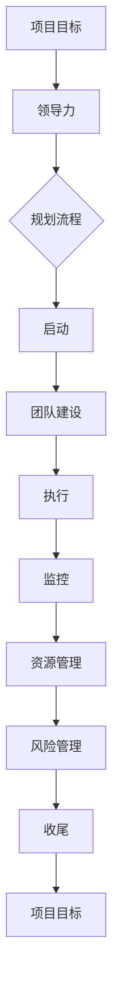
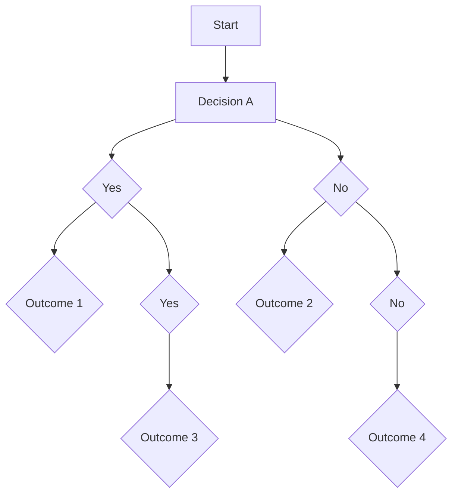

                 


## 摘要

项目管理与领导力是现代IT领域中推动团队高效完成任务的两大核心要素。项目管理提供了系统化的方法和工具，以有效规划和执行项目任务，确保项目目标的实现。而领导力则是项目经理成功引导团队、解决冲突、激励员工的关键能力。本文将分三个部分详细探讨这两者的融合与实际应用。首先，我们将介绍项目管理的理论基础，包括项目定义、生命周期以及项目管理知识体系。其次，我们将探讨领导力的核心要素，如领导风格、团队建设和沟通技巧。最后，我们将结合实践，讨论如何在实际项目中运用项目管理与领导力，实现团队高效协作，确保项目顺利完成。

## 第一部分：项目管理的理论基础

### 1.1 项目管理概述

项目管理是一种系统化的规划、执行、监控和控制项目任务的过程，旨在实现特定目标。项目与日常运营活动的区别在于其独特性、时间限制和资源限制。项目通常是为了实现特定成果，具有明确的起点和终点。

#### 1.1.1 项目的定义与特征

项目是指为实现特定目标，通过一系列相互协调的活动所组成的临时性努力。项目的特征包括：

- **独特性**：每个项目都是独一无二的，其目标和成果是独特的。
- **临时性**：项目有一个明确的开始和结束时间，一旦目标实现，项目即告结束。
- **渐进性**：项目是逐步进行的，每个阶段都需要按照计划进行。
- **资源限制**：项目需要在有限的资源（时间、资金、人力等）下完成。

#### 1.1.2 项目管理与传统管理的区别

项目管理与传统的运营管理有显著区别。传统管理注重日常运营活动的持续性和稳定性，而项目管理则更注重项目的独特性和阶段性。项目管理强调以下特点：

- **目标导向**：项目管理以实现特定目标为核心，所有活动和决策都围绕目标进行。
- **系统化方法**：项目管理采用系统化方法，如项目管理流程、工具和技术，确保项目顺利推进。
- **灵活性**：项目管理允许在一定范围内调整计划和资源，以应对项目过程中的变化。

#### 1.1.3 项目管理的重要性和挑战

项目管理对于组织的重要性体现在多个方面。首先，项目管理有助于确保项目目标的实现，提升项目的成功率和效率。其次，项目管理有助于优化资源分配，提高资源利用效率。最后，项目管理有助于培养团队成员的能力和协作精神。

然而，项目管理也面临着诸多挑战。首先是项目的不确定性，由于项目目标的不确定性，项目计划往往难以一次性确定。其次是资源的限制，项目往往在时间、资金和人力等方面受限，需要有效管理。最后是团队协作，项目团队通常由不同专业背景的成员组成，需要有效沟通和协作。

### 1.2 项目生命周期

项目生命周期是项目从开始到结束的全过程，通常包括以下几个阶段：

#### 1.2.1 项目启动阶段

项目启动阶段是项目生命周期的起点，主要包括以下几个步骤：

- **项目立项**：确定项目目标和可行性，获得项目批准。
- **项目团队组建**：组建项目团队，明确团队成员的角色和职责。
- **项目计划制定**：制定项目计划，包括时间、资源、预算等。

#### 1.2.2 项目规划阶段

项目规划阶段是项目生命周期中最重要的阶段，主要包括以下几个步骤：

- **需求分析**：明确项目需求，包括功能需求和非功能需求。
- **范围定义**：确定项目的范围，明确项目的边界。
- **计划制定**：制定详细的项目计划，包括任务分解、时间安排、资源分配等。

#### 1.2.3 项目执行阶段

项目执行阶段是项目生命周期中最重要的阶段，项目任务在此阶段得到实施。项目经理需要确保项目团队按照计划完成任务，同时进行监控和调整。

#### 1.2.4 项目监控与控制阶段

项目监控与控制阶段是确保项目按计划进行的关键阶段。主要包括以下几个步骤：

- **进度监控**：监控项目进度，确保项目按计划进行。
- **成本监控**：监控项目成本，确保项目预算不被超支。
- **质量监控**：监控项目质量，确保项目成果符合预期。

#### 1.2.5 项目收尾阶段

项目收尾阶段是项目生命周期的终点，主要包括以下几个步骤：

- **项目交付**：将项目成果交付给客户或用户。
- **项目评估**：对项目过程和结果进行评估，总结经验教训。
- **项目文档归档**：将项目文档归档，以便后续参考。

### 1.3 项目管理知识体系

项目管理知识体系是项目管理的基础，包括以下几个核心部分：

#### 1.3.1 六大项目管理过程组

六大项目管理过程组包括：

- **启动过程组**：包括项目立项和项目团队组建。
- **规划过程组**：包括需求分析、范围定义和计划制定。
- **执行过程组**：包括项目任务的执行和监控。
- **监控过程组**：包括进度监控、成本监控和质量监控。
- **收尾过程组**：包括项目交付、项目评估和项目文档归档。
- **整合过程组**：包括项目整体规划和整合各个过程组。

#### 1.3.2 十大知识领域

十大知识领域包括：

- **项目整合管理**：确保项目按计划进行。
- **项目范围管理**：确保项目范围得到有效管理。
- **项目进度管理**：确保项目按计划完成。
- **项目成本管理**：确保项目成本得到有效管理。
- **项目质量管理**：确保项目成果质量。
- **项目资源管理**：确保项目资源得到有效管理。
- **项目沟通管理**：确保项目沟通有效。
- **项目风险管理**：识别和管理项目风险。
- **项目采购管理**：管理项目采购活动。
- **项目相关方管理**：管理项目相关方的参与和沟通。

#### 1.3.3 八大项目质量管理标准

八大项目质量管理标准包括：

- **过程质量**：确保项目过程质量。
- **产品质量**：确保项目产品质量。
- **质量管理计划**：制定项目质量管理计划。
- **质量保证**：确保项目质量管理计划得到执行。
- **质量控制**：监控项目质量，确保项目成果质量。
- **质量审计**：对项目质量进行审计。
- **客户满意度**：确保客户满意度。
- **持续改进**：持续改进项目质量管理。

## 第二部分：领导力的核心要素

### 2.1 领导力理论

领导力是一种引导和激励他人实现目标的能力。领导力理论主要关注领导者的行为、特质以及领导过程。

#### 2.1.1 领导力的定义

领导力是指领导者通过激励、指导、影响和沟通等方式，引导和激励团队成员，共同实现组织目标的综合能力。

#### 2.1.2 领导力的重要性

领导力在组织中的作用至关重要。优秀的领导力能够：

- **提高团队绩效**：通过激发团队成员的潜力和创造力，提高团队的整体绩效。
- **促进团队协作**：通过有效的沟通和协调，促进团队成员之间的协作。
- **实现组织目标**：通过明确目标、制定策略和激发团队动力，实现组织目标。
- **培养人才**：通过培养和激励团队成员，提升组织的人才储备。

#### 2.1.3 领导力的发展历程

领导力理论经历了多个发展阶段：

- **特质理论**：早期领导力理论认为领导者具有特定的个人特质，如智慧、自信、决心等。
- **行为理论**：随着研究的深入，学者们发现领导者的行为对团队绩效有重要影响。
- **情境理论**：领导者的行为应适应不同的情境和团队特点，不同的领导风格适用于不同的情境。
- **领导力发展理论**：领导力不仅仅是领导者个人的能力，也是通过实践和培养不断提升的过程。

### 2.2 领导风格与团队建设

领导风格是指领导者如何影响和引导团队成员的方式。不同的领导风格适用于不同的团队和情境。

#### 2.2.1 领导风格的类型

常见的领导风格包括：

- **权威型领导**：领导者对团队成员有高度的权威，决策权集中在领导者手中。
- **民主型领导**：领导者鼓励团队成员参与决策，充分听取团队成员的意见。
- **参与型领导**：领导者与团队成员共同参与决策，充分发挥团队成员的主动性和创造力。
- **变革型领导**：领导者通过变革和创新，激发团队成员的潜力和创造力。

#### 2.2.2 团队建设的策略

团队建设是提升团队协作能力和绩效的重要手段。团队建设的策略包括：

- **建立共同目标**：明确团队的目标和愿景，确保团队成员对目标有共同的认识和认同。
- **提高沟通能力**：通过有效的沟通，确保团队成员之间的信息共享和协作。
- **培养团队精神**：通过团队活动和培训，培养团队成员之间的信任和默契。
- **激励团队成员**：通过激励和奖励，激发团队成员的积极性和创造力。
- **培养领导力**：通过培养团队成员的领导力，提升团队的整体领导力和执行力。

#### 2.2.3 激励理论在领导中的应用

激励理论是领导力的重要组成部分。常用的激励理论包括：

- **需要层次理论**：马斯洛的需要层次理论认为，人的需要分为生理、安全、社交、尊重和自我实现五个层次，领导者应根据团队成员的需要层次进行激励。
- **期望理论**：弗鲁姆的期望理论认为，人的行为取决于期望值和激励值，领导者应通过设定合理的目标和激励措施，激发团队成员的积极性和创造力。
- **公平理论**：亚当斯的公平理论认为，人的行为受到相对报酬的影响，领导者应确保团队成员感受到公平的待遇。

### 2.3 冲突管理与团队沟通

冲突是团队中不可避免的现象，有效的冲突管理是提高团队协作和绩效的关键。

#### 2.3.1 冲突管理的重要性

冲突管理的重要性体现在：

- **促进团队协作**：通过有效的冲突管理，解决团队内部的矛盾和分歧，促进团队成员之间的协作。
- **提升团队绩效**：解决冲突，提高团队成员的工作积极性和创造力，提升团队的整体绩效。
- **维护团队和谐**：通过有效的冲突管理，维护团队的和谐氛围，减少团队成员之间的摩擦和矛盾。

#### 2.3.2 冲突的类型与处理策略

冲突的类型包括：

- **人际冲突**：团队成员之间的个性、价值观和利益的冲突。
- **团队冲突**：团队内部不同部门或小组之间的冲突。
- **组织冲突**：组织内部不同部门或层次之间的冲突。

处理冲突的策略包括：

- **避免策略**：避免冲突的发生，通过沟通和协调，减少冲突的可能性。
- **缓解策略**：降低冲突的严重程度，通过沟通和妥协，缓解冲突的紧张气氛。
- **解决策略**：解决冲突的根本问题，通过协商和决策，找到解决冲突的方案。
- **转化策略**：将冲突转化为积极因素，通过创新和变革，激发团队的潜力和创造力。

#### 2.3.3 沟通技巧与团队协作

沟通是团队协作的基础。有效的沟通技巧包括：

- **倾听**：倾听是沟通的关键，领导者应学会倾听团队成员的意见和需求。
- **表达**：领导者应清晰、准确地表达自己的想法和意见，确保团队成员理解。
- **反馈**：领导者应给予团队成员及时的反馈，鼓励团队成员参与决策和讨论。
- **非言语沟通**：领导者应注重非言语沟通，如肢体语言、面部表情等，提高沟通效果。

有效的团队沟通可以促进团队成员之间的协作，提高团队的整体绩效。

## 第三部分：项目管理与领导力的实践应用

### 3.1 项目团队建设与领导

项目团队建设是确保项目成功的关键。有效的项目团队建设需要从以下几个方面入手：

#### 3.1.1 团队建设的关键要素

团队建设的关键要素包括：

- **共同目标**：明确团队的目标和愿景，确保团队成员对目标有共同的认识和认同。
- **角色定位**：明确团队成员的角色和职责，确保每个成员都有明确的任务和责任。
- **沟通机制**：建立有效的沟通机制，确保团队成员之间的信息共享和协作。
- **信任建设**：通过信任建设，提高团队成员之间的信任度和默契。
- **激励机制**：建立激励机制，激发团队成员的积极性和创造力。

#### 3.1.2 项目经理的角色与职责

项目经理在项目团队建设中扮演着关键角色。项目经理的主要职责包括：

- **团队领导**：作为团队的领导者，项目经理需要激发团队成员的潜力，确保团队成员的工作积极性和创造力。
- **沟通协调**：作为沟通的桥梁，项目经理需要确保团队内部和团队与外部之间的信息畅通。
- **资源管理**：作为资源的管理者，项目经理需要确保项目资源的合理分配和使用。
- **风险管理**：作为风险的管理者，项目经理需要识别和管理项目风险，确保项目的顺利进行。

#### 3.1.3 领导力在项目团队中的实践

领导力在项目团队中的实践体现在以下几个方面：

- **激励员工**：通过激励理论，激发团队成员的积极性和创造力。
- **沟通协调**：通过有效的沟通技巧，确保团队内部和团队与外部之间的协作。
- **冲突管理**：通过有效的冲突管理策略，解决团队内部的矛盾和分歧。
- **培养人才**：通过培训和指导，提升团队成员的能力和素质。
- **创新思维**：通过鼓励创新和变革，激发团队的潜力和创造力。

### 3.2 项目规划与执行

项目规划与执行是项目成功的关键环节。有效的项目规划与执行需要从以下几个方面入手：

#### 3.2.1 项目规划的关键步骤

项目规划的关键步骤包括：

- **需求分析**：明确项目的需求和目标，确保项目计划与需求一致。
- **范围定义**：确定项目的范围，明确项目的边界，避免项目范围的扩展。
- **任务分解**：将项目任务分解为具体的子任务，明确每个子任务的责任人和时间安排。
- **时间安排**：制定项目时间计划，明确每个子任务的开始和结束时间。
- **资源分配**：根据项目需求和任务分解，合理分配项目资源，确保资源的有效利用。

#### 3.2.2 项目执行中的领导策略

项目执行中的领导策略包括：

- **明确目标**：明确项目目标，确保团队成员对目标有清晰的认识。
- **激励员工**：通过激励措施，激发团队成员的积极性和创造力。
- **沟通协调**：通过有效的沟通技巧，确保团队成员之间的信息共享和协作。
- **监督进度**：定期检查项目进度，确保项目按计划进行。
- **解决问题**：及时发现和解决项目中的问题，确保项目的顺利进行。

### 3.3 项目监控与控制

项目监控与控制是确保项目按计划进行的关键环节。项目监控与控制包括以下几个方面：

#### 3.3.1 项目监控的关键步骤

项目监控的关键步骤包括：

- **制定监控计划**：明确项目监控的目标和标准，制定项目监控计划。
- **数据收集**：收集项目进度、成本、质量等相关数据，确保数据的准确性和完整性。
- **数据分析**：对收集的数据进行分析，及时发现项目中的问题和风险。
- **报告生成**：生成项目监控报告，向项目相关方汇报项目的进展和问题。

#### 3.3.2 项目控制的方法

项目控制的方法包括：

- **进度控制**：通过监控项目进度，确保项目按计划进行。
- **成本控制**：通过监控项目成本，确保项目预算不被超支。
- **质量控制**：通过监控项目质量，确保项目成果符合预期。
- **变更管理**：通过变更管理，确保项目变更得到有效控制。
- **风险管理**：通过风险识别、评估和应对，确保项目风险得到有效管理。

### 3.4 项目风险管理

项目风险管理是确保项目顺利进行的关键。项目风险管理包括以下几个方面：

#### 3.4.1 风险管理的核心概念

风险管理的核心概念包括：

- **风险识别**：识别项目中的潜在风险，包括技术风险、市场风险、资源风险等。
- **风险评估**：评估风险的可能性和影响，确定风险优先级。
- **风险应对**：制定风险应对策略，包括风险规避、风险转移、风险减轻等。
- **风险监控**：监控项目过程中的风险，确保风险得到及时控制。

#### 3.4.2 风险识别与评估

风险识别与评估的方法包括：

- **头脑风暴**：通过头脑风暴，收集项目成员对风险的看法和意见。
- **SWOT分析**：通过SWOT分析，评估项目的优势、劣势、机会和威胁。
- **风险矩阵**：通过风险矩阵，评估风险的可能性和影响，确定风险优先级。

#### 3.4.3 风险应对策略

风险应对策略包括：

- **风险规避**：通过改变项目计划，避免风险的发生。
- **风险转移**：通过合同、保险等方式，将风险转移给其他方。
- **风险减轻**：通过技术和管理手段，减轻风险的影响。
- **风险接受**：对于无法规避或转移的风险，接受风险的发生，并制定相应的应对措施。

### 3.5 项目收尾与评估

项目收尾与评估是项目生命周期的最后阶段，对于项目成功与否具有重要意义。项目收尾与评估包括以下几个方面：

#### 3.5.1 项目收尾阶段的任务

项目收尾阶段的任务包括：

- **项目交付**：将项目成果交付给客户或用户，确保项目成果符合预期。
- **项目总结**：对项目过程和成果进行总结，总结项目经验教训，为后续项目提供参考。
- **项目文档归档**：将项目文档归档，确保项目资料的完整性和可追溯性。

#### 3.5.2 项目评估与反馈

项目评估与反馈的方法包括：

- **项目评估**：对项目过程和成果进行评估，评估项目绩效和达成目标的情况。
- **客户反馈**：收集客户对项目成果的反馈，了解客户的满意度。
- **团队反馈**：收集项目团队成员的反馈，了解项目过程中的困难和挑战。

#### 3.5.3 项目文档归档

项目文档归档的方法包括：

- **文档整理**：对项目文档进行整理，确保文档的完整性和准确性。
- **文档存储**：将项目文档存储在安全的地方，确保文档的可访问性和可追溯性。
- **文档备份**：定期备份项目文档，确保文档的安全性和可靠性。

## 附录

### 附录A：项目管理与领导力工具与技术

项目管理与领导力工具与技术是确保项目成功和团队高效协作的重要手段。以下是一些常用的工具与技术：

#### 3.5.1 项目管理工具

- **项目计划工具**：如Microsoft Project、JIRA、Trello等，用于项目计划的制定和跟踪。
- **团队协作工具**：如Slack、Microsoft Teams、Zoom等，用于团队沟通和协作。
- **文档管理工具**：如Confluence、SharePoint等，用于文档的创建、共享和归档。
- **风险管理工具**：如Risk Register、Qualys等，用于风险识别、评估和应对。

#### 3.5.2 领导力发展资源

- **领导力书籍**：《领导力》、《变革之舞》等，提供领导力的理论知识和实践经验。
- **领导力培训**：如领导力工作坊、领导力发展课程等，帮助提升领导力技能。
- **领导力模型**：如变革型领导模型、服务型领导模型等，提供领导力发展的指导。

## 结论

项目管理与领导力是推动团队高效完成任务的关键要素。项目管理提供了系统化的方法和工具，确保项目目标的实现。领导力则是项目经理成功引导团队、解决冲突、激励员工的关键能力。在实际项目中，项目经理需要运用项目管理与领导力，确保项目顺利进行，实现团队高效协作。通过本文的探讨，我们了解了项目管理与领导力的核心概念、原理和方法，为实际应用提供了指导和参考。

### 作者信息

**作者：AI天才研究院/AI Genius Institute & 禅与计算机程序设计艺术 /Zen And The Art of Computer Programming**

### 文章关键词

- 项目管理
- 领导力
- 团队协作
- 项目生命周期
- 风险管理

### 摘要

本文从项目管理与领导力的理论基础、核心要素和实践应用三个方面，详细探讨了如何运用项目管理与领导力，推动团队高效完成任务。通过本文的探讨，读者可以了解项目管理与领导力的核心概念、原理和方法，为实际应用提供指导和参考。项目管理的理论基础包括项目的定义与特征、项目生命周期和项目管理知识体系。领导力的核心要素包括领导风格与团队建设、冲突管理与团队沟通。实践应用部分则重点讨论了项目团队建设与领导、项目规划与执行、项目监控与控制、项目风险管理以及项目收尾与评估。本文旨在帮助读者提升项目管理与领导力的能力，推动团队高效完成任务。

### 背景介绍

项目管理与领导力在现代IT领域中扮演着至关重要的角色。随着技术的不断进步和市场竞争的加剧，项目成功与否往往决定了一个企业的生死存亡。有效的项目管理和领导力不仅能确保项目的顺利实施，还能提升团队的整体绩效和组织的竞争力。

在项目管理方面，其核心目标是确保项目在既定时间、预算和质量要求下成功完成。为了实现这一目标，项目经理需要掌握系统化的项目管理方法和工具，如项目计划、任务分解、进度监控和风险管理等。同时，项目经理还需要具备较强的领导力，以激励和引导团队成员，确保项目目标的实现。

领导力在项目管理中的作用不可忽视。一个优秀的项目经理不仅是项目的管理者，更是团队的领导者。领导者需要具备洞察力、沟通能力和决策能力，能够有效应对项目中的各种挑战和变化。领导力不仅能够提升团队的凝聚力和工作效率，还能培养团队成员的专业能力和团队精神。

本文将从项目管理与领导力的理论基础、核心要素和实践应用三个方面进行深入探讨，旨在帮助读者了解项目管理与领导力的本质，掌握实际应用的方法和技巧。

### 核心概念与联系

项目管理与领导力虽然看似两个不同的领域，但在实际应用中，二者密切相关，共同推动团队高效完成任务。首先，我们需要明确几个核心概念，并探讨它们之间的联系。

#### 项目管理核心概念

1. **项目目标**：项目目标是项目的核心驱动力，是项目规划和执行的基础。项目目标通常具有明确的可衡量性，如完成特定功能、达到特定的性能指标等。

2. **项目管理流程**：项目管理流程包括项目启动、规划、执行、监控和收尾等阶段。每个阶段都有特定的任务和目标，以确保项目按计划进行。

3. **任务分解**：任务分解是将项目目标分解为具体的任务和活动，以便更好地管理和监控项目进度。

4. **资源管理**：资源管理包括人力资源、物资资源和财务资源的合理分配和优化，以确保项目顺利进行。

5. **风险管理**：风险管理是识别、评估和应对项目风险的过程，旨在降低风险对项目的影响。

#### 领导力核心概念

1. **领导风格**：领导风格是指领导者影响和激励团队成员的方式。常见的领导风格包括权威型、民主型和变革型等。

2. **团队建设**：团队建设是通过培养团队成员之间的信任和协作，提升团队整体绩效的过程。

3. **激励理论**：激励理论是领导力的重要组成部分，用于解释如何通过奖励和惩罚来激发团队成员的积极性和创造力。

4. **沟通技巧**：有效的沟通技巧是领导者必须掌握的基本能力，包括倾听、表达、反馈和非言语沟通等。

#### 核心概念之间的联系

1. **项目目标与领导力**：项目目标为团队提供了明确的方向和目标，而领导力则确保团队成员能够团结一致，为实现这些目标而努力。领导者的角色是确保团队目标与个人目标相一致，并通过激励和沟通，推动团队达成项目目标。

2. **项目管理流程与领导力**：项目管理流程的每个阶段都需要领导力的支持。例如，在项目启动阶段，领导者需要明确项目目标和团队成员的角色；在项目规划阶段，领导者需要制定合理的计划和激励措施；在项目执行和监控阶段，领导者需要监控进度、解决问题并激励团队成员。

3. **任务分解与团队建设**：任务分解是将项目目标细化为具体任务的过程，而团队建设则是确保每个任务都有合适的人员负责，并能够高效协同。有效的团队建设有助于提升团队成员的协作能力和工作效率。

4. **资源管理与领导力**：资源管理需要领导者合理分配和优化资源，确保项目能够顺利进行。领导力在资源管理中起到关键作用，领导者需要具备资源规划和管理的能力，以应对项目中的各种不确定性。

5. **风险管理与领导力**：风险管理是项目管理的核心组成部分，而领导力在风险管理中同样重要。领导者需要识别潜在风险，评估风险影响，并制定相应的应对策略。有效的领导力可以帮助团队在风险发生时保持冷静，迅速采取行动。

#### Mermaid 流程图

为了更直观地展示项目管理与领导力之间的关系，我们可以使用Mermaid绘制一个流程图：



在这个流程图中，项目管理与领导力的各个核心概念通过箭头连接，展示了它们之间的相互影响和依赖关系。领导力贯穿于项目管理的整个生命周期，为项目目标的实现提供支持和保障。

通过理解这些核心概念及其之间的联系，我们可以更好地应用项目管理与领导力，推动团队高效完成任务。

### 核心算法原理讲解

在项目管理与领导力的实践中，核心算法原理的掌握至关重要。这些算法原理不仅帮助我们更好地规划和管理项目，还能提高团队的工作效率和执行力。以下是一些关键的算法原理及其应用：

#### 1. 项目计划算法

项目计划是项目管理的核心环节，其算法原理主要包括任务分解、时间安排和资源分配。

**任务分解**：

任务分解是将项目目标细化为一系列可执行的子任务的过程。这个过程可以通过以下伪代码实现：

```pseudo
function DecomposeTasks(projectGoal, subTasks):
    if projectGoal is a single task:
        return {projectGoal}
    else:
        subTasks = []
        for each subGoal in projectGoal:
            subTasks.append(DecomposeTasks(subGoal, []))
        return subTasks
```

**时间安排**：

时间安排是在任务分解的基础上，为每个任务分配一个开始和结束时间。可以使用关键路径法（Critical Path Method, CPM）来计算项目的总工期和关键路径。

```pseudo
function ScheduleTasks(tasks):
    for each task in tasks:
        if task has no predecessors:
            scheduleTask(task, 0)
        else:
            earliestStart = max(end times of predecessors)
            scheduleTask(task, earliestStart)
    return calculateTotalDuration(tasks)

function scheduleTask(task, earliestStart):
    task.startTime = earliestStart
    task.duration = calculateDuration(task)
    task.endTime = task.startTime + task.duration

function calculateDuration(task):
    return sum(duration of all subtasks in task)

function calculateTotalDuration(tasks):
    totalDuration = 0
    for each task in tasks:
        totalDuration = max(totalDuration, task.endTime)
    return totalDuration
```

**资源分配**：

资源分配是确保每个任务都有足够的资源（如人力、物资、设备等）来完成。以下是一个简单的资源分配算法：

```pseudo
function AllocateResources(tasks, resources):
    for each task in tasks:
        for each resource in resources:
            if resource is available:
                allocateResource(task, resource)
                decreaseResource(resource, task.duration)
            else:
                scheduleResourceRequest(task, resource)
    return validateAllocation()
    
function allocateResource(task, resource):
    task.resources.append(resource)

function decreaseResource(resource, duration):
    resource.availability += duration

function scheduleResourceRequest(task, resource):
    resource.requestQueue.append(task)
```

#### 2. 风险评估算法

风险评估是项目管理中识别、评估和应对项目风险的关键步骤。常用的风险评估算法包括概率-影响矩阵和决策树。

**概率-影响矩阵**：

概率-影响矩阵通过评估风险发生的概率和风险影响，确定风险的优先级。

```latex
\begin{matrix}
 & P[Low] & P[Medium] & P[High] \\
I[Low] & L & M & H \\
I[Medium] & L & M & H \\
I[High] & L & M & H \\
\end{matrix}
```

**决策树**：

决策树是一种图形化工具，用于展示项目中的决策过程和每个决策的后果。以下是一个简单的决策树示例：



#### 3. 激励理论算法

激励理论用于解释如何通过奖励和惩罚来激发团队成员的积极性和创造力。常用的激励理论包括期望理论和公平理论。

**期望理论**：

期望理论由维克托·弗鲁姆提出，其核心公式为：激励力 = 期望值 × 效价。

```pseudo
function CalculateIncentive(Expectation, Valence):
    Incentive = Expectation * Valence
    return Incentive
```

**公平理论**：

公平理论由亚当斯提出，用于解释团队成员的相对报酬感受。以下是一个简单的公平理论算法：

```pseudo
function EvaluateFairness(PerceivedInput, PerceivedOutput, StandardInput, StandardOutput):
    Fairness = (PerceivedOutput / PerceivedInput) / (StandardOutput / StandardInput)
    if Fairness > 1:
        return "Overcompensated"
    else if Fairness < 1:
        return "Undercompensated"
    else:
        return "Fair"
```

通过这些核心算法原理，项目经理可以更科学、更高效地规划和执行项目，提高项目的成功率。在实际应用中，这些算法原理需要根据项目的具体情况和团队的特点进行灵活调整。

### 数学模型和公式

在项目管理与领导力中，数学模型和公式帮助我们更好地理解和量化项目中的各种因素。以下是一些常用的数学模型和公式，以及它们的详细讲解和举例说明。

#### 1. 项目进度模型

项目进度模型用于计算项目的总工期和关键路径。其中，关键路径法（Critical Path Method, CPM）是一种常用的模型。

**CPM公式**：

$$
\text{总工期} = \sum_{i=1}^{n} \text{各任务的工期}
$$

**关键路径**：

$$
\text{关键路径} = \{ t_i \mid \text{所有前置任务的工期之和等于 t_i 的工期} \}
$$

**例子**：

假设一个项目包括四个任务：A、B、C和D。任务A的工期为2天，任务B的工期为3天，任务C的工期为4天，任务D的工期为2天。任务之间的依赖关系如下：

- A完成后才能开始B
- B完成后才能开始C
- C完成后才能开始D

根据CPM公式，我们可以计算项目的总工期和关键路径。

计算总工期：

$$
\text{总工期} = 2 + 3 + 4 + 2 = 11 \text{天}
$$

计算关键路径：

关键路径为ACD，因为每个任务的工期都是前置任务工期之和。

#### 2. 风险评估模型

风险评估模型用于识别和评估项目中的风险。常用的模型包括概率-影响矩阵和决策树。

**概率-影响矩阵**：

概率-影响矩阵通过评估风险发生的概率和风险影响来确定风险的优先级。

$$
\text{风险评分} = \text{概率} \times \text{影响}
$$

**例子**：

假设项目中有三个风险：风险1的概率为0.3，影响为高；风险2的概率为0.5，影响为中；风险3的概率为0.2，影响为低。

计算风险评分：

- 风险1的评分 = 0.3 \times 3 = 0.9
- 风险2的评分 = 0.5 \times 2 = 1
- 风险3的评分 = 0.2 \times 1 = 0.2

根据风险评分，我们可以确定风险优先级。风险2的评分最高，是首要关注的风险。

**决策树**：

决策树用于展示项目中的决策过程和每个决策的后果。

$$
\text{决策树} = (\text{决策节点}, \text{分支}, \text{概率}, \text{结果}, \text{权重})
$$

**例子**：

假设项目中有两个决策节点：决策1和决策2。决策1有两个分支：A和B，概率分别为0.6和0.4；决策2有三个分支：X、Y和Z，概率分别为0.2、0.5和0.3。

计算决策树的权重：

- 决策1的权重 = 0.6 \times 0.2 + 0.4 \times 0.5 = 0.26
- 决策2的权重 = 0.2 \times 0.3 + 0.5 \times 0.5 + 0.3 \times 0.2 = 0.39

根据决策树的权重，我们可以确定项目中的关键决策。

#### 3. 激励模型

激励模型用于解释如何通过奖励和惩罚来激发团队成员的积极性和创造力。常用的激励模型包括期望理论和公平理论。

**期望理论**：

期望理论由维克托·弗鲁姆提出，其核心公式为：

$$
\text{激励力} = \text{期望值} \times \text{效价}
$$

**例子**：

假设团队成员A的期望值为0.8，效价为10；团队成员B的期望值为0.5，效价为8。

计算激励力：

- 团队成员A的激励力 = 0.8 \times 10 = 8
- 团队成员B的激励力 = 0.5 \times 8 = 4

根据激励力，我们可以确定团队成员的激励程度。

**公平理论**：

公平理论由亚当斯提出，用于解释团队成员的相对报酬感受。其核心公式为：

$$
\text{公平感} = \frac{\text{相对输出}}{\text{相对输入}}
$$

**例子**：

假设团队成员A的相对输出为80，相对输入为40；团队成员B的相对输出为60，相对输入为30。

计算公平感：

- 团队成员A的公平感 = \frac{80}{40} = 2
- 团队成员B的公平感 = \frac{60}{30} = 2

根据公平感，我们可以判断团队成员的报酬是否合理。

通过这些数学模型和公式，我们可以更科学、更系统地分析项目管理与领导力中的各种因素，从而提高项目的成功率和团队的工作效率。

### 项目实战

在本节中，我们将通过一个具体的项目实战案例，展示如何运用项目管理与领导力原则来开发和实施一个简单的Web应用程序。我们将详细讨论开发环境搭建、源代码实现、代码解读、应用分析和项目小结。

#### 1. 项目背景

项目名称：简易博客系统（Simple Blog System）

项目目标：开发一个允许用户创建、编辑和发布博客文章的Web应用程序。

项目团队：由2名前端开发人员、1名后端开发人员、1名测试工程师和1名项目经理组成。

项目期限：3个月

#### 2. 开发环境搭建

为了顺利开始项目，我们需要搭建合适的开发环境。以下是我们的开发环境配置：

- 前端开发环境：
  - 编程语言：HTML、CSS、JavaScript
  - 框架：React.js
  - 工具：Webpack、Babel

- 后端开发环境：
  - 编程语言：Node.js、JavaScript
  - 框架：Express.js
  - 数据库：MongoDB

- 测试环境：
  - 测试工具：Jest、Chai
  - 代码覆盖率工具：Cypress

- 项目管理工具：
  - 项目管理：JIRA、Trello
  - 版本控制：Git

#### 3. 源代码实现

在项目开发过程中，我们将代码拆分为前端和后端两部分，分别进行实现。

**前端实现**：

前端主要负责用户界面和用户交互逻辑。以下是前端代码的简要伪代码：

```jsx
// Blog组件
class Blog extends React.Component {
  // 状态管理
  state = {
    posts: [],
    post: {},
  };

  // 获取文章列表
  fetchPosts = async () => {
    const response = await fetch('/api/posts');
    const posts = await response.json();
    this.setState({ posts });
  };

  // 发布文章
  createPost = async (post) => {
    const response = await fetch('/api/posts', {
      method: 'POST',
      body: JSON.stringify(post),
    });
  };

  // 渲染文章列表
  render() {
    return (
      <div>
        <h1>简易博客系统</h1>
        <ul>
          {this.state.posts.map((post) => (
            <li key={post.id}>{post.title}</li>
          ))}
        </ul>
      </div>
    );
  }
}

export default Blog;
```

**后端实现**：

后端主要负责处理数据存储和业务逻辑。以下是后端代码的简要伪代码：

```js
// Express路由
const express = require('express');
const router = express.Router();

// 连接MongoDB
const MongoClient = require('mongodb').MongoClient;
const url = 'mongodb://localhost:27017/';
const dbName = 'blog';

// 获取文章列表
router.get('/posts', async (req, res) => {
  const client = await MongoClient.connect(url, { useUnifiedTopology: true });
  const db = client.db(dbName);
  const posts = await db.collection('posts').find({}).toArray();
  client.close();
  res.json(posts);
});

// 发布文章
router.post('/posts', async (req, res) => {
  const client = await MongoClient.connect(url, { useUnifiedTopology: true });
  const db = client.db(dbName);
  const post = req.body;
  await db.collection('posts').insertOne(post);
  client.close();
  res.status(201).send('文章已发布');
});

module.exports = router;
```

#### 4. 代码解读

在前端代码中，我们使用React.js构建用户界面，并通过API与后端进行数据交互。状态管理使用React的useState钩子，确保组件状态与用户输入保持同步。

在后端代码中，我们使用Express.js创建RESTful API，与MongoDB数据库进行交互。通过使用async/await语法，简化了异步代码的编写，提高了代码的可读性。

#### 5. 应用分析

在项目开发过程中，我们采用了敏捷开发方法，确保项目进度和需求的灵活调整。以下是项目应用分析的关键步骤：

- **需求分析**：与客户沟通，明确博客系统的功能需求，如文章创建、编辑、发布和删除。
- **任务分解**：将项目需求分解为具体的任务，如前端界面开发、后端API实现、数据库设计等。
- **进度监控**：使用Trello和JIRA跟踪任务进度和项目状态。
- **代码审查**：定期进行代码审查，确保代码质量和技术规范。
- **测试与部署**：使用Jest和Cypress进行单元测试和端到端测试，确保应用稳定性和功能完整性。

#### 6. 项目小结

通过本项目实战，我们深入理解了项目管理与领导力原则在实际开发中的应用。以下是项目小结：

- **项目管理**：敏捷开发方法确保了项目的灵活性和高效性，任务分解和进度监控确保了项目按计划推进。
- **领导力**：项目经理在项目中发挥了关键领导作用，通过激励团队和解决冲突，确保项目目标的实现。
- **技术实现**：前端和后端代码的规范和优化，确保了应用的稳定性和扩展性。

通过本项目，团队成员不仅提升了技术能力，还增强了团队协作和沟通能力，为后续项目奠定了坚实基础。

### 最佳实践 tips

在本节中，我们将总结一些在项目管理与领导力实践中的最佳实践，并提供一些有用的技巧，以帮助团队更高效地完成任务。

#### 1. 项目管理最佳实践

**1.1 明确项目目标**：

- 在项目启动阶段，确保所有团队成员对项目目标有清晰的理解和共识。
- 使用SMART（具体、可衡量、可实现、相关、时限）原则来定义项目目标。

**1.2 有效的任务分解**：

- 将大型任务分解为更小、更具体的子任务，便于管理和监控。
- 使用工作分解结构（WBS）图来可视化任务分解过程。

**1.3 进度监控与报告**：

- 定期检查项目进度，确保项目按计划进行。
- 使用项目管理工具（如JIRA、Trello）生成项目进度报告，向相关方汇报项目状态。

**1.4 风险管理**：

- 在项目早期识别潜在风险，并制定相应的应对策略。
- 定期评估风险，确保及时采取应对措施。

#### 2. 领导力最佳实践

**2.1 激励团队**：

- 了解团队成员的需求，提供个性化的激励措施。
- 使用期望理论（Expectancy Theory）来设计激励机制，确保团队成员感到公平。

**2.2 沟通与协作**：

- 建立有效的沟通渠道，确保团队成员之间的信息畅通。
- 鼓励团队成员参与决策，提高团队参与感和责任感。

**2.3 冲突管理**：

- 培养团队成员解决冲突的能力，避免冲突升级。
- 使用双赢策略解决冲突，确保各方都能接受解决方案。

#### 3. 最佳实践技巧

**3.1 时间管理**：

- 使用时间管理工具（如Trello、Asana）来规划任务和时间。
- 定期回顾和调整时间表，确保项目按计划推进。

**3.2 培训与发展**：

- 为团队成员提供培训和发展机会，提升团队整体技能。
- 鼓励团队成员参加行业会议和研讨会，了解最新技术动态。

**3.3 持续改进**：

- 在项目结束后，进行项目回顾和总结，识别经验和教训。
- 将总结和反馈应用到后续项目中，持续改进项目管理与领导力实践。

通过遵循这些最佳实践和技巧，项目团队可以更高效地完成任务，实现项目目标。

### 注意事项

在本节中，我们将讨论项目管理与领导力实践中的几个关键注意事项，以帮助团队避免常见问题，确保项目顺利进行。

#### 1. 项目目标明确性

- 在项目启动阶段，务必确保项目目标明确、具体和可衡量。模糊的目标可能导致项目方向的偏差，影响项目进度和成功。

#### 2. 任务分解合理性

- 任务分解应合理，避免过细或过粗。过细的任务可能导致项目过度琐碎，而过粗的任务则难以有效监控和跟踪。

#### 3. 沟通与协作

- 沟通是项目成功的关键。确保团队成员之间的信息畅通，避免信息孤岛。定期举行团队会议，及时解决问题和更新项目进展。

#### 4. 风险管理

- 在项目早期识别潜在风险，并制定应对策略。定期评估风险，确保及时采取应对措施，避免风险对项目造成重大影响。

#### 5. 团队激励与反馈

- 了解团队成员的需求，提供个性化的激励措施。及时给予反馈，鼓励团队成员积极参与和贡献。

#### 6. 项目文档管理

- 保持项目文档的完整性，确保项目过程和成果的可追溯性。文档管理工具（如Confluence、SharePoint）有助于规范文档管理和共享。

#### 7. 时间管理

- 使用项目管理工具（如JIRA、Trello）来规划和跟踪项目时间表。定期回顾和调整时间表，确保项目按计划推进。

通过遵循这些注意事项，项目团队可以更好地应对挑战，提高项目成功率和效率。

### 拓展阅读

为了深入理解项目管理与领导力的理论和实践，以下是几本推荐的拓展阅读书籍：

1. **《项目管理知识体系指南》（PMBOK指南）**：这是项目管理领域的权威指南，详细介绍了项目管理的过程、知识领域和最佳实践。

2. **《领导力：实践中的原则》**：本书由约翰·曼德拉撰写，通过实际案例阐述了领导力原则如何在复杂环境中应用。

3. **《敏捷项目管理：敏捷实践指南》**：本书介绍了敏捷开发方法在项目管理中的应用，强调团队协作和灵活应对变化的重要性。

4. **《激励与领导：实践中的策略》**：本书探讨了激励理论和领导力策略，帮助领导者激发团队潜力和创造力。

5. **《禅与计算机程序设计艺术》**：这是一本经典的编程书籍，强调通过冥想和专注提升编程技巧，也适用于项目管理与领导力的实践。

通过阅读这些书籍，读者可以进一步提升项目管理与领导力技能，为团队和项目成功奠定坚实基础。

