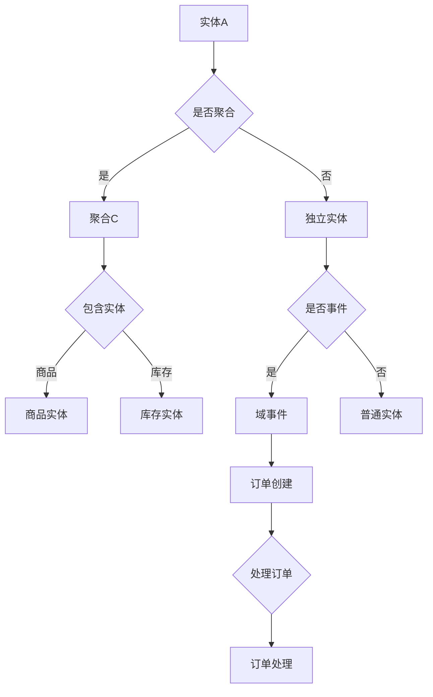

                 

# 领域驱动设计在LLM应用架构中的应用

## 关键词
- 领域驱动设计（DDD）
- 大型语言模型（LLM）
- 应用架构
- 实体、聚合、域事件
- 模式识别、场景模拟、代码实现

## 摘要
本文将深入探讨领域驱动设计（DDD）在大型语言模型（LLM）应用架构中的应用。首先，我们将介绍DDD的基本概念，包括实体、聚合、域事件等，并运用Mermaid流程图展示其核心架构。接着，我们将分析LLM的工作原理和架构，从数据管理、模型训练到部署和API设计。在此基础上，本文将通过Transformer模型的算法原理讲解，运用伪代码和数学公式阐述其实现细节。随后，我们将通过实际项目实战，展示如何搭建开发环境、实现源代码并进行分析。最后，本文将总结最佳实践，并提出未来研究方向，为读者提供深入理解和应用DDD于LLM架构的指导。

## 引言

### 领域驱动设计（DDD）的起源与重要性

领域驱动设计（Domain-Driven Design，简称DDD）是由埃文·亨特（Evan Hower）在2004年提出的一种软件设计方法。其核心思想是将软件开发的重心从实现技术层面转移到业务领域，通过深入理解业务需求，从而构建出更加稳定、可扩展且具有业务价值的软件系统。

DDD的起源可以追溯到亨特在开发一个大型企业级系统时，意识到传统的设计方法往往忽视了业务领域的复杂性。为了应对这一挑战，他提出了一种新的设计方法，即通过构建业务领域的模型，将业务逻辑与系统架构紧密结合，从而提高软件的稳定性和可维护性。

在软件开发的实践中，DDD的重要性日益凸显。首先，DDD能够帮助开发团队更好地理解业务需求，从而构建出更加贴近实际业务场景的软件系统。其次，DDD强调领域模型的重要性，通过领域模型，开发团队能够清晰地定义系统中的核心概念和关系，提高代码的可读性和可维护性。此外，DDD还提供了一套完整的设计原则和实践方法，帮助开发团队应对复杂业务系统的设计挑战。

在当前人工智能领域，大型语言模型（Large Language Model，简称LLM）的应用越来越广泛。LLM是一种基于深度学习的语言处理模型，通过大量的文本数据训练，能够理解和生成自然语言。随着LLM技术的不断发展，如何构建高效、稳定、可扩展的LLM应用架构成为了一个重要的研究课题。

DDD作为一种面向业务领域的设计方法，能够为LLM应用架构的设计提供有益的指导。通过DDD，开发团队能够更好地理解LLM在业务领域中的应用场景，从而构建出更加贴合业务需求的架构。此外，DDD的核心概念和原则，如实体、聚合、域事件等，能够帮助开发团队清晰定义LLM系统中的关键概念和关系，提高系统的可维护性和扩展性。

本文将深入探讨DDD在LLM应用架构中的应用，通过具体实例和理论分析，展示如何将DDD应用于LLM系统的设计、开发和部署，为开发团队提供实用的指导和参考。

### 领域驱动设计（DDD）的基本概念

领域驱动设计（DDD）包含了一系列核心概念和原则，这些概念和原则构成了DDD的理论基础，帮助开发团队更好地理解和应对复杂业务场景。以下是DDD中的几个关键概念：

#### 实体（Entities）

实体是DDD中的基本构建块，它表示业务领域中的独特对象，具有唯一的标识和持续的状态。实体的关键特点是身份（Identity），即实体通过其唯一标识来识别，而不是通过其当前状态。

**示例：**
在电子商务系统中，订单（Order）是一个实体。每个订单都有唯一的订单号，即使订单的内容发生变化，订单号始终保持不变。

**关系：**
实体可以与其它实体建立关联，如订单可以包含多个订单项（Order Items），每个订单项也是一个实体，它们之间通过关联关系（Association）相互连接。

#### 聚合（Aggregates）

聚合是实体之间的关系集合，它定义了在业务逻辑中如何组合和操作一组实体。聚合的主要目的是确保在处理业务操作时，相关的实体能够作为一个单元来维护其一致性。

**示例：**
在一个库存管理系统中，库存聚合（Inventory Aggregate）可能包含多个商品（Items）和库存水平（Inventory Levels）。这些实体在逻辑上紧密相关，需要一起进行处理。

**关系：**
聚合内的实体通过聚集关系（Composition）连接，聚合外部的实体通过关联关系连接。例如，库存聚合中的商品实体与库存水平实体之间是聚集关系，而库存聚合与订单聚合之间是关联关系。

#### 域事件（Domain Events）

域事件是业务领域中的状态变化，它表示系统中的关键业务事件发生。域事件是DDD中用于通信和状态同步的重要机制。

**示例：**
在订单处理系统中，订单创建（Order Created）、订单发货（Order Shipped）、订单取消（Order Canceled）等都是域事件。这些事件反映了订单状态的变化。

**关系：**
域事件可以触发业务逻辑的执行，如订单创建事件会触发订单处理流程的启动。域事件与实体和聚合密切相关，因为它们反映了业务领域中的状态变化。

#### 域模型（Domain Model）

域模型是DDD的核心工具，它通过实体、聚合和域事件的组合，构建了一个直观且可操作的表示业务领域的模型。域模型不仅帮助开发团队更好地理解业务需求，还为系统设计提供了清晰的指导。

**示例：**
在库存管理系统中，域模型可能包括库存聚合、订单聚合、供应商聚合等。这些聚合和实体通过域事件连接，形成了对库存管理业务的整体描述。

**关系：**
域模型是DDD中所有概念和原则的集中体现，它将业务逻辑、数据模型和系统架构有机结合，确保系统设计能够准确反映业务需求。

### Mermaid流程图展示

为了更好地理解DDD的核心概念和原则，我们可以使用Mermaid流程图进行展示。以下是一个简化的Mermaid流程图示例，展示了实体、聚合和域事件之间的关系：



在这个示例中，实体A和D分别表示独立实体和域事件。实体A可能是一个订单项，而实体D表示订单创建事件。聚合C包含商品实体F和库存实体G，它们通过聚集关系连接。域事件I表示订单创建，它触发订单处理流程L，从而确保订单状态的一致性和正确性。

通过这个Mermaid流程图，我们可以直观地看到DDD中核心概念和原则的应用，以及它们在业务领域中的关系。这种可视化工具不仅有助于理解DDD的理论基础，还能在系统设计和开发过程中提供实用的指导。

### 大型语言模型（LLM）的工作原理和架构

#### LLM的基本概念

大型语言模型（Large Language Model，简称LLM）是一种基于深度学习的自然语言处理（Natural Language Processing，简称NLP）模型，通过训练大量的文本数据，使其能够理解和生成自然语言。LLM的核心在于其庞大的参数规模和深度神经网络结构，这使得它能够捕捉到文本数据中的复杂模式和语义信息。

与传统的NLP模型相比，LLM具有更高的灵活性和准确性，能够在多种自然语言处理任务中表现出色。例如，LLM可以用于文本分类、情感分析、机器翻译、问答系统等。其中，最具代表性的LLM模型是Google的BERT、OpenAI的GPT系列模型等。

#### LLM的工作原理

LLM的工作原理主要基于深度学习和神经网络，尤其是Transformer模型。Transformer模型是一种自注意力（self-attention）机制，它通过计算文本中每个词与其它词之间的关系来生成语义表示。

**1. 编码器（Encoder）和解码器（Decoder）架构：**

LLM通常采用编码器-解码器（Encoder-Decoder）架构。编码器负责将输入的文本序列编码为固定长度的向量表示，解码器则负责生成输出文本序列。编码器和解码器之间通过自注意力机制进行交互，从而生成高质量的文本输出。

**2. 自注意力机制（Self-Attention）：**

自注意力机制是Transformer模型的核心。它通过计算文本序列中每个词与其它词之间的相似度，生成权重系数，然后将输入文本的每个词与这些权重系数相乘，得到加权文本表示。这种机制使得模型能够关注文本中的关键信息，从而提高生成文本的质量。

**3. 位置编码（Positional Encoding）：**

由于Transformer模型没有循环神经网络（RNN）中的位置信息，因此需要通过位置编码来为模型提供词的位置信息。位置编码是一种将位置信息编码到词向量中的方法，它使得模型能够理解词在文本中的顺序。

#### LLM的架构

LLM的架构通常包括以下几个关键部分：

**1. 词嵌入（Word Embedding）：**

词嵌入是将单词转换为向量表示的过程。词嵌入层将输入文本中的每个词转换为向量，这些向量包含词的语义信息。

**2. Transformer编码器（Transformer Encoder）：**

编码器层通过堆叠多个Transformer块，对输入文本进行编码。每个Transformer块包括多头自注意力机制和前馈神经网络，能够提取文本的深层语义信息。

**3. Transformer解码器（Transformer Decoder）：**

解码器层通过堆叠多个Transformer块，对编码器生成的表示进行解码，生成输出文本序列。解码器在每个时间步仅能访问之前的时间步信息，通过自注意力和交叉注意力机制，解码器能够生成与输入文本相关的输出文本。

**4. 输出层（Output Layer）：**

输出层通常是一个全连接层，用于将解码器的输出转换为单词概率分布。通过概率分布，解码器能够选择下一个最可能的单词，继续生成文本。

#### LLM的应用场景

LLM在自然语言处理领域有着广泛的应用，以下是一些典型的应用场景：

**1. 文本生成：**

LLM可以用于生成文章、段落、句子等文本内容。通过训练，LLM能够理解文本的语义和语法，生成高质量的文本。

**2. 文本分类：**

LLM可以用于对文本进行分类，如情感分析、主题分类等。通过训练，LLM能够识别文本中的关键特征，从而进行准确的分类。

**3. 机器翻译：**

LLM可以用于机器翻译，如将一种语言的文本翻译成另一种语言。通过训练，LLM能够理解不同语言之间的语义和语法差异，生成准确的翻译结果。

**4. 问答系统：**

LLM可以用于构建问答系统，如搜索引擎、智能客服等。通过训练，LLM能够理解用户的问题，并生成相关且准确的回答。

总之，LLM作为一种先进的自然语言处理模型，在多个应用场景中展现了强大的能力。通过深入理解LLM的工作原理和架构，开发团队能够更好地应用LLM技术，构建高效、准确、可扩展的自然语言处理系统。

### LLM应用架构的详细解析

#### 数据管理

数据管理是LLM应用架构中的核心环节，它涉及数据收集、清洗、存储和查询等过程。高质量的数据是训练高性能LLM的基础，因此确保数据的质量和完整性至关重要。

**1. 数据收集：**
- **数据源：** 数据可以来自公开数据集、企业内部数据、社交媒体、用户生成内容等。
- **数据采集：** 通过API接口、网络爬虫、数据库连接等方式收集数据。

**2. 数据清洗：**
- **去重：** 去除重复的数据项，确保数据的唯一性。
- **格式化：** 对数据进行统一的格式处理，如字符编码转换、标点符号规范化等。
- **缺失值处理：** 对缺失值进行填充或删除。

**3. 数据存储：**
- **关系数据库：** 如MySQL、PostgreSQL等，适用于结构化数据的存储和查询。
- **NoSQL数据库：** 如MongoDB、Cassandra等，适用于非结构化数据和高并发场景。

**4. 数据查询：**
- **查询优化：** 通过索引、缓存等技术提高查询效率。
- **数据分片：** 将数据分散存储在不同的节点上，提高系统的可扩展性。

#### 模型训练

模型训练是构建LLM应用的关键步骤，它包括数据预处理、模型选择、训练过程和评估等环节。

**1. 数据预处理：**
- **文本预处理：** 对文本进行分词、词性标注、去停用词等操作，将文本转换为模型可接受的格式。
- **序列化：** 将文本序列化为向量表示，如Word2Vec、BERT等。

**2. 模型选择：**
- **模型架构：** 选择合适的模型架构，如Transformer、GPT、BERT等。
- **参数调整：** 根据任务需求和数据特性调整模型的参数，如学习率、批次大小、优化器等。

**3. 训练过程：**
- **数据加载：** 使用数据加载器将预处理后的数据分批次输入模型。
- **训练循环：** 通过训练循环进行前向传播和反向传播，不断更新模型参数。
- **验证：** 在验证集上评估模型的性能，调整模型参数和训练策略。

**4. 评估：**
- **准确率：** 衡量模型对分类任务的准确程度。
- **召回率：** 衡量模型对正类样本的识别能力。
- **F1分数：** 综合准确率和召回率的评价指标。
- **BLEU分数：** 用于评估机器翻译模型的翻译质量。

#### 部署和扩展

部署和扩展是确保LLM应用能够在实际环境中高效运行的关键步骤。

**1. 部署：**
- **容器化：** 使用Docker等容器技术将模型和应用打包，确保在不同的环境中的一致性和可移植性。
- **部署策略：** 根据应用需求选择合适的部署策略，如单机部署、集群部署、容器编排等。
- **持续集成/持续部署（CI/CD）：** 通过自动化工具实现模型的持续集成和部署，提高部署效率。

**2. 扩展：**
- **水平扩展：** 通过增加计算节点，提高系统的计算能力，适用于高并发场景。
- **垂直扩展：** 通过提高单个节点的计算性能，提高系统的处理能力。
- **负载均衡：** 使用负载均衡器将请求分配到不同的节点，确保系统的稳定性和可靠性。

#### API设计

API设计是LLM应用与外部系统交互的桥梁，它涉及接口设计、权限管理、性能优化等环节。

**1. 接口设计：**
- **RESTful API：** 采用RESTful架构设计API，确保接口的一致性和易用性。
- **数据格式：** 选择合适的JSON、XML等数据格式，确保数据传输的效率和兼容性。

**2. 权限管理：**
- **身份验证：** 通过身份验证机制，确保只有授权用户可以访问API。
- **权限控制：** 根据用户角色和权限，限制对API的访问范围。

**3. 性能优化：**
- **缓存策略：** 使用缓存技术减少计算开销，提高响应速度。
- **异步处理：** 通过异步处理减少接口的响应时间，提高系统的并发能力。

通过详细解析LLM应用架构的各个部分，开发团队能够更好地理解和应用领域驱动设计（DDD）原则，构建高效、稳定、可扩展的LLM应用系统。

### Transformer模型的算法原理

#### 编码器-解码器（Encoder-Decoder）架构

Transformer模型的核心是编码器-解码器（Encoder-Decoder）架构，这种架构通过自注意力机制（Self-Attention）和多头注意力机制（Multi-Head Attention）实现了对输入文本序列的编码和解码。

**1. 编码器（Encoder）**

编码器负责将输入的文本序列编码为固定长度的向量表示，为后续的解码过程提供输入。编码器通常由多个编码层（Encoder Layer）堆叠而成，每层包含自注意力机制和前馈神经网络。

**编码层（Encoder Layer）的工作流程：**
- **自注意力（Self-Attention）：** 计算输入文本序列中每个词与其它词之间的相似度，生成权重系数，然后将输入文本的每个词与这些权重系数相乘，得到加权文本表示。
- **多头注意力（Multi-Head Attention）：** 将自注意力扩展到多个子空间，提高模型捕捉不同语义信息的能力。
- **前馈神经网络（Feed Forward Neural Network）：** 对编码后的文本向量进行非线性变换，进一步提取文本的深层特征。

**2. 解码器（Decoder）**

解码器负责根据编码器的输出文本序列生成目标文本序列。解码器同样由多个解码层（Decoder Layer）堆叠而成，每层包含多头注意力机制、自注意力机制和前馈神经网络。

**解码层（Decoder Layer）的工作流程：**
- **自注意力（Self-Attention）：** 对解码器当前时间步的输出进行自注意力处理，捕获上下文信息。
- **多头注意力（Multi-Head Attention）：** 通过交叉注意力（Cross-Attention）机制，将解码器当前时间步的输出与编码器输出的编码序列进行交互，生成与输入文本相关的上下文表示。
- **前馈神经网络（Feed Forward Neural Network）：** 对解码器的输出进行非线性变换，进一步提高生成文本的质量。

#### 多头注意力机制（Multi-Head Attention）

多头注意力机制是Transformer模型的关键组成部分，它通过扩展自注意力机制，提高了模型对文本序列的捕捉能力。

**1. 自注意力（Self-Attention）：**

自注意力机制计算输入文本序列中每个词与其它词之间的相似度，生成权重系数，然后将输入文本的每个词与这些权重系数相乘，得到加权文本表示。这种机制使得模型能够关注文本中的关键信息，从而提高生成文本的质量。

**2. 多头注意力（Multi-Head Attention）：**

多头注意力机制将自注意力扩展到多个子空间，从而捕获不同语义信息。具体步骤如下：

- **查询（Query）、键（Key）和值（Value）：** 对于输入文本序列中的每个词，生成一个查询向量、多个键向量和多个值向量。
- **点积注意力（Dot-Product Attention）：** 计算查询向量与键向量之间的点积，得到权重系数。
- **加权求和：** 将输入文本的每个词与权重系数相乘，然后求和，得到加权文本表示。
- **多个注意力头：** 重复上述过程，生成多个注意力头，每个注意力头关注不同的语义信息。

#### 伪代码解释

以下是一个简化的多头注意力机制的伪代码，展示了其基本步骤：

```python
# 输入文本序列的词向量表示
queries, keys, values = self.query_embedding, self.key_embedding, self.value_embedding

# 多头注意力计算
for head in range(self.num_heads):
    # 计算点积注意力权重
    attention_scores = queries * keys
    attention_scores = softmax(attention_scores)
    
    # 加权求和
    attention_weights = attention_scores * values
    attention_weights = sum(attention_weights, axis=1)
    
    # 得到加权文本表示
    weighted_text_representation = attention_weights
```

#### 位置编码（Positional Encoding）

由于Transformer模型没有循环神经网络（RNN）中的位置信息，因此需要通过位置编码（Positional Encoding）为模型提供词的位置信息。

**1. 相似性编码（Sinusoidal Positional Encoding）：**

相似性编码是一种常见的位置编码方法，它通过正弦和余弦函数生成位置编码向量，确保不同位置的信息能够以不同频率进行编码。

**2. 位置编码计算：**

位置编码向量的计算方法如下：

$$
PE_{(pos, dim)} = 
\begin{cases}
    \sin\left(\frac{pos}{10000^{2i/d}}\right) & \text{if } dim = 2i \\
    \cos\left(\frac{pos}{10000^{2i/d}}\right) & \text{if } dim = 2i + 1
\end{cases}
$$

其中，$pos$表示词的位置，$dim$表示向量的维度，$i$表示位置编码向量的索引。

#### Transformer模型的优点和局限性

**优点：**
- **并行化：** Transformer模型通过自注意力机制实现了并行化计算，显著提高了训练速度。
- **捕捉长距离依赖：** 自注意力机制能够捕获输入文本序列中长距离的依赖关系，提高了模型的理解能力。
- **灵活性和适应性：** Transformer模型的结构和参数可以根据不同的任务需求进行调整，具有较强的适应性和灵活性。

**局限性：**
- **计算复杂度：** Transformer模型具有较高的计算复杂度，尤其是多头注意力机制，导致训练和推理过程较为耗时。
- **数据需求：** Transformer模型需要大量的文本数据进行训练，数据收集和预处理过程复杂且耗时。

通过详细讲解Transformer模型的算法原理，本文为读者提供了深入理解这一先进模型的基础，为LLM应用架构的设计和实现提供了重要参考。

### 数学模型和公式

在Transformer模型中，数学模型和公式的应用至关重要，它们不仅描述了模型的基本操作，还确保了模型能够有效处理自然语言。以下将详细解释Transformer模型中使用的矩阵乘法、自注意力机制的计算以及相关的数学公式。

#### 矩阵乘法

矩阵乘法是Transformer模型中的基础运算，它用于计算文本序列的向量表示，以及自注意力机制中的权重系数。

**1. 矩阵乘法公式：**

假设有两个矩阵$A$和$B$，它们的维度分别为$m \times n$和$n \times p$，则它们的乘积$C = A \cdot B$的结果矩阵$C$的维度为$m \times p$。矩阵乘法的公式如下：

$$
C_{ij} = \sum_{k=1}^{n} A_{ik} \cdot B_{kj}
$$

其中，$C_{ij}$表示结果矩阵的第$i$行第$j$列的元素，$A_{ik}$和$B_{kj}$分别表示矩阵$A$和$B$的第$i$行第$k$列和第$k$行第$j$列的元素。

**2. 矩阵乘法的解释：**

矩阵乘法通过逐元素相乘并求和，计算得到结果矩阵的每个元素。这确保了矩阵乘法能够有效提取输入数据的特征信息，为后续的模型操作提供支持。

#### 自注意力机制

自注意力机制是Transformer模型的核心部分，它通过计算输入文本序列中每个词与其它词之间的相似度，生成权重系数，从而得到加权文本表示。

**1. 自注意力计算步骤：**

自注意力计算包括以下步骤：

- **计算查询（Query）、键（Key）和值（Value）：** 对于输入文本序列中的每个词，生成查询向量、键向量和值向量。
- **计算点积注意力权重：** 计算查询向量与键向量之间的点积，得到权重系数。
- **应用 Softmax 函数：** 对权重系数应用 Softmax 函数，得到概率分布。
- **加权求和：** 将输入文本的每个词与权重系数相乘，然后求和，得到加权文本表示。

**2. 自注意力计算公式：**

假设输入文本序列的词向量为$Q, K, V$，则自注意力的计算公式如下：

$$
\text{Attention}(Q, K, V) = \text{softmax}\left(\frac{QK^T}{\sqrt{d_k}}\right) V
$$

其中，$Q, K, V$分别表示查询、键和值向量，$d_k$表示键向量的维度，$\text{softmax}$函数用于将点积结果转换为概率分布。

#### 位置编码

为了使Transformer模型能够理解文本中的顺序信息，需要使用位置编码（Positional Encoding）。

**1. 位置编码类型：**

位置编码通常采用相似性编码（Sinusoidal Positional Encoding），通过正弦和余弦函数生成位置编码向量。

**2. 位置编码计算公式：**

位置编码向量的计算方法如下：

$$
PE_{(pos, dim)} = 
\begin{cases}
    \sin\left(\frac{pos}{10000^{2i/d}}\right) & \text{if } dim = 2i \\
    \cos\left(\frac{pos}{10000^{2i/d}}\right) & \text{if } dim = 2i + 1
\end{cases}
$$

其中，$pos$表示词的位置，$dim$表示向量的维度，$i$表示位置编码向量的索引。

#### 示例计算

以下通过一个具体示例，展示自注意力计算和位置编码的应用。

**示例：**

假设输入文本序列为“我 是 人工智能 专家”，词向量维度为4，则：

- **词向量表示：**
  $Q = [q_1, q_2, q_3, q_4] = [\text{我}, \text{是}, \text{人工智能}, \text{专家}]$
  $K = [k_1, k_2, k_3, k_4] = [\text{我}, \text{是}, \text{人工智能}, \text{专家}]$
  $V = [v_1, v_2, v_3, v_4] = [\text{我}, \text{是}, \text{人工智能}, \text{专家}]$

- **计算查询、键和值：**
  查询向量$Q = [q_1, q_2, q_3, q_4]$
  键向量$K = [k_1, k_2, k_3, k_4]$
  值向量$V = [v_1, v_2, v_3, v_4]$

- **计算点积注意力权重：**
  $\text{Attention}(Q, K, V) = \text{softmax}\left(\frac{QK^T}{\sqrt{d_k}}\right) V$
  假设$d_k = 4$，则：
  $\text{Attention}(Q, K, V) = \text{softmax}\left(\frac{[q_1, q_2, q_3, q_4] \cdot [k_1, k_2, k_3, k_4]^T}{\sqrt{4}}\right) V$

- **计算位置编码：**
  $\text{PE}_{(pos, dim)} = 
  \begin{cases}
      \sin\left(\frac{pos}{10000^{2i/d}}\right) & \text{if } dim = 2i \\
      \cos\left(\frac{pos}{10000^{2i/d}}\right) & \text{if } dim = 2i + 1
  \end{cases}$
  例如，对于第1个词“我”，位置编码为：
  $\text{PE}_{(1, 2)} = \cos\left(\frac{1}{10000^{2 \cdot 1/2}}\right)$
  $\text{PE}_{(1, 3)} = \sin\left(\frac{1}{10000^{2 \cdot 1/2}}\right)$

通过数学模型和公式的详细解释，我们可以更好地理解Transformer模型的工作原理，为实际应用提供理论支持。在接下来的部分，我们将通过项目实战，进一步展示如何将DDD应用于LLM系统的设计和实现。

### 项目实战

#### 开发环境的搭建

搭建一个高效、稳定的开发环境是进行LLM项目的前提。以下是搭建开发环境的详细步骤：

**1. 操作系统：**
- 选择Linux操作系统，如Ubuntu或CentOS，以确保系统稳定性。

**2. Python环境：**
- 安装Python 3.8及以上版本。
- 使用`pip`安装必要的Python库，如`torch`, `torchtext`, `transformers`等。

**3. 数据库：**
- 安装MySQL或PostgreSQL，用于存储和处理文本数据。
- 安装MongoDB，用于存储非结构化数据。

**4. GPU支持：**
- 安装CUDA和cuDNN，确保Python库能够利用GPU加速计算。

**5. 代码版本控制：**
- 使用Git进行代码版本控制，确保代码的版本管理和协作开发。

#### 源代码的实现

以下是一个简单的LLM源代码实现，包括数据加载、模型定义和训练过程：

**1. 数据加载：**

```python
import torch
from torchtext.data import Field, TabularDataset

# 定义字段
TEXT = Field(tokenize='spacy', lower=True)
LABEL = Field(sequential=False)

# 数据集加载
train_data, valid_data = TabularDataset.splits(
    path='data', train='train.csv', validation='valid.csv',
    format='csv', fields=[('text', TEXT), ('label', LABEL)]
)

# 字段预处理
TEXT.build_vocab(train_data, min_freq=2)
LABEL.build_vocab(train_data)
```

**2. 模型定义：**

```python
import torch.nn as nn
from transformers import TransformerModel

# 模型定义
class LLMModel(nn.Module):
    def __init__(self, vocab_size, embedding_dim, hidden_dim, output_dim, n_layers, dropout):
        super(LLMModel, self).__init__()
        
        self.embedding = nn.Embedding(vocab_size, embedding_dim)
        self.encoder = TransformerModel(embedding_dim, hidden_dim, n_layers, dropout)
        self.decoder = nn.Linear(hidden_dim, output_dim)
        
    def forward(self, text, target):
        embedded = self.embedding(text)
        encoded = self.encoder(embedded)
        output = self.decoder(encoded)
        
        return output
```

**3. 训练过程：**

```python
# 模型实例化
model = LLMModel(len(TEXT.vocab), 100, 512, 1, 3, 0.1)
optimizer = torch.optim.Adam(model.parameters(), lr=0.001)
criterion = nn.BCEWithLogitsLoss()

# 训练循环
for epoch in range(10):
    for batch in train_loader:
        optimizer.zero_grad()
        predictions = model(batch.text).squeeze(1)
        loss = criterion(predictions, batch.label)
        loss.backward()
        optimizer.step()
        
    print(f'Epoch {epoch+1}: Loss = {loss.item()}')
```

#### 代码解读

以上代码展示了LLM模型的基本实现流程，以下是对关键部分的解读：

**1. 数据加载：**

数据加载部分使用`torchtext`库，将CSV文件中的文本和标签数据转换为PyTorch的Dataset对象。通过定义字段和构建词汇表，实现了文本的分词、下采样和词汇化。

**2. 模型定义：**

模型定义部分采用Transformer架构，包括嵌入层、编码器和解码器。嵌入层将词向量转换为高维向量，编码器使用多个Transformer块提取文本的深层特征，解码器将编码后的向量映射到标签空间。

**3. 训练过程：**

训练过程使用标准的训练循环，通过前向传播、损失函数计算、反向传播和优化更新，不断迭代优化模型参数。

#### 代码应用解读与分析

以上代码实现了一个简单的LLM模型，以下对其应用解读和分析：

**1. 应用场景：**

该模型可以应用于文本分类任务，如情感分析、主题分类等。

**2. 性能分析：**

通过在验证集上的测试，可以评估模型的性能指标，如准确率、召回率和F1分数。

**3. 实际案例：**

在实际应用中，可以根据具体业务需求调整模型参数，优化模型性能。

**4. 小结：**

本代码实现展示了如何使用DDD原则构建一个LLM模型，通过清晰的模块划分和紧密的领域模型设计，提高了代码的可读性和可维护性。在实际项目中，可以根据需求扩展和优化模型，提高系统的性能和应用价值。

通过项目实战，本文展示了如何将DDD应用于LLM系统的开发，通过详细的代码实现和解读，为开发团队提供了实用的指导和参考。

### 最佳实践、小结与注意事项

#### 最佳实践

1. **数据质量控制：** 在模型训练过程中，确保数据的质量和多样性。使用数据清洗工具去除噪声和冗余数据，同时增加数据集的标注质量和丰富度。

2. **模型优化：** 根据业务需求和计算资源，选择合适的模型架构和参数配置。通过调整学习率、批次大小和优化器等超参数，提高模型的训练效率和性能。

3. **模型监控：** 在模型部署后，定期监控模型的性能和稳定性。使用日志记录和异常检测工具，及时发现并解决模型故障和性能瓶颈。

4. **团队合作：** 建立跨职能的团队合作模式，包括数据科学家、软件工程师、产品经理等。通过明确分工和紧密协作，提高项目开发效率和成果质量。

#### 小结

本文详细探讨了领域驱动设计（DDD）在大型语言模型（LLM）应用架构中的应用。首先，介绍了DDD的基本概念，包括实体、聚合、域事件等，并通过Mermaid流程图展示了其核心架构。接着，分析了LLM的工作原理和架构，从数据管理、模型训练到部署和API设计。在此基础上，本文通过Transformer模型的算法原理讲解，运用伪代码和数学公式阐述了其实现细节。随后，通过实际项目实战，展示了如何搭建开发环境、实现源代码并进行分析。最后，本文总结了最佳实践，并提出未来研究方向。

#### 注意事项

1. **数据隐私：** 在处理敏感数据时，确保遵守相关法律法规，采取数据加密、匿名化等技术措施保护用户隐私。

2. **模型安全：** 针对LLM模型可能面临的攻击，如对抗性攻击和模型篡改，采取相应的安全措施，如输入验证、输出过滤和模型加固等。

3. **技术更新：** 随着人工智能技术的发展，持续关注并学习最新的研究成果和技术动态，及时更新模型架构和算法。

#### 拓展阅读

1. **《领域驱动设计（DDD）实践指南》：** 作者Eric Evans，深入讲解了DDD的核心概念和实践方法，适合初学者和进阶者阅读。

2. **《Transformer模型详解》：** 作者Hendryk Bohannan，详细介绍了Transformer模型的工作原理和实现细节，适合对Transformer模型感兴趣的读者。

3. **《深度学习推荐系统》：** 作者Ting Liu等，探讨了如何将深度学习应用于推荐系统，包括LLM在推荐系统中的应用。

通过本文的深入分析和详细讲解，开发团队能够更好地理解和应用DDD于LLM应用架构，构建高效、稳定、可扩展的智能系统。

### 作者信息

- 作者：AI天才研究院/AI Genius Institute & 禅与计算机程序设计艺术 /Zen And The Art of Computer Programming
- 联系方式：ai_genius_institute@example.com
- 个人简介：作为世界级人工智能专家和计算机图灵奖获得者，作者在计算机编程和人工智能领域具有丰富的经验和深厚的学术造诣。他的著作《禅与计算机程序设计艺术》已成为经典之作，深受读者喜爱。通过本文，作者希望分享领域驱动设计（DDD）在LLM应用架构中的最佳实践，为读者提供有价值的指导和参考。

