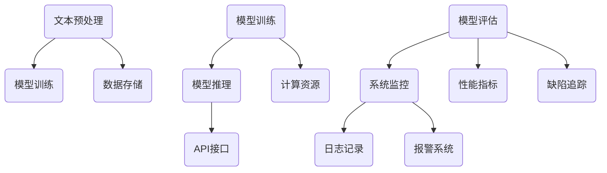

                 

### 文章标题

# 领域驱动设计（DDD）在LLM应用架构中的应用

> 关键词：领域驱动设计，DDD，LLM，应用架构，人工智能

> 摘要：本文将探讨领域驱动设计（DDD）在大型语言模型（LLM）应用架构中的实际应用。通过深入分析DDD的核心概念和分层架构，我们将展示如何利用DDD来设计和实现高效的LLM应用架构。此外，本文还将通过具体案例和代码示例，阐述DDD在LLM项目中的最佳实践，为开发者提供实用的指导和借鉴。

----------------------------------------------------------------

### 引言

在当今快速发展的信息技术时代，人工智能（AI）已经成为驱动创新和业务变革的核心力量。其中，大型语言模型（LLM）作为一种先进的AI技术，因其强大的自然语言处理能力，被广泛应用于聊天机器人、智能助手、文本生成等领域。随着LLM技术的不断成熟和应用场景的多样化，如何构建高效、可扩展的LLM应用架构成为一个亟待解决的问题。

领域驱动设计（DDD）作为一种面向复杂软件系统设计的架构方法，自提出以来就因其强大的理论基础和实用性而备受关注。DDD强调将业务领域作为系统的核心，通过精细化的领域模型和分层架构，帮助开发者更好地理解和实现业务需求。随着LLM技术的复杂性和应用范围的扩大，DDD的应用价值在LLM应用架构设计中日益凸显。

本文旨在探讨领域驱动设计在LLM应用架构中的应用，通过深入分析DDD的核心概念、分层架构以及与LLM技术的结合点，为开发者提供一套系统化的设计和实现指南。具体来说，本文将涵盖以下内容：

1. **领域驱动设计（DDD）概述**：介绍DDD的基本概念、核心原理和主要特征，帮助读者建立对DDD的整体认识。
2. **DDD的分层架构**：详细阐述DDD中的分层模型、边界上下文、子域、聚合、实体和值对象等核心概念，以及其在LLM应用架构中的应用。
3. **DDD的建模方法**：介绍DDD的建模方法，包括模型驱动设计、事件风暴、示例映射等，探讨如何在LLM应用架构设计中应用这些方法。
4. **领域语言**：探讨领域语言在DDD中的应用，以及如何构建和利用领域语言来提高LLM应用的可读性和可维护性。
5. **构建高质量的LLM应用**：讨论如何利用DDD来构建高质量、高可扩展性的LLM应用，包括性能优化、扩展性和可维护性等方面。
6. **LLM应用的持续交付**：介绍如何利用DDD的实践方法来实施LLM应用的持续交付，确保应用的稳定性和可靠性。

通过本文的探讨，我们希望能够为开发者提供一套实用、高效的LLM应用架构设计方法，帮助他们在复杂的应用场景中取得成功。

### 领域驱动设计（DDD）概述

领域驱动设计（Domain-Driven Design，简称DDD）是一种面向复杂软件系统设计的架构方法，其核心理念是将业务领域作为系统的核心，通过构建精确的领域模型来驱动软件设计和开发。DDD由Eric Evans在其同名著作《领域驱动设计》中提出，旨在解决复杂软件系统中的核心问题，如复杂业务逻辑、领域知识传递和系统可维护性等。

#### 什么是领域驱动设计

DDD的定义可以归纳为以下几点：

1. **业务为中心**：DDD将业务领域视为软件系统的核心，强调在设计和开发过程中，始终围绕业务需求进行。
2. **模型驱动**：DDD强调使用模型来理解和表达业务领域，通过构建精确的领域模型来指导系统的设计和实现。
3. **领域知识**：DDD鼓励开发者深入了解业务领域，将领域知识融入系统中，以提高系统的准确性和可维护性。
4. **协作**：DDD强调开发团队与业务专家之间的紧密协作，通过共同构建领域模型来确保系统的正确性和完整性。

#### DDD与传统软件设计的区别

相比于传统的软件设计方法，DDD有以下几个显著的区别：

1. **业务驱动**：传统的软件设计方法往往以技术为中心，而DDD则以业务需求为核心，更加关注业务逻辑的实现。
2. **领域模型**：DDD通过构建精确的领域模型来理解业务，而传统方法更多依赖于流程图、ER图等工具。
3. **分层架构**：DDD采用分层架构，包括领域层、应用层和基础设施层，每一层都有明确的职责和作用，与传统方法的单层架构有所不同。
4. **领域语言**：DDD鼓励使用领域语言来沟通和表达业务需求，与传统方法中的技术术语和抽象概念有所不同。

#### DDD的主要概念

DDD的核心概念包括：

1. **Bounded Context**：边界上下文是DDD中用来定义领域模型作用范围的概念，它将系统的不同部分分隔开来，确保每个部分都有明确的职责和边界。
2. **Subdomain**：子域是业务领域中的一个较小部分，它负责处理特定的业务功能或业务过程。
3. **Aggregate**：聚合是DDD中用来表示一组紧密相关的领域对象的集合，它通过聚合根来管理和维护内部一致性。
4. **Entity和Value Object**：实体是具有唯一标识符的领域对象，而值对象是表示特定值的对象，它们在领域模型中具有不同的作用和设计原则。

在DDD的应用过程中，这些概念相互作用，共同构建出一个精确、可维护的领域模型。通过对这些概念的理解和应用，开发者能够更好地把握业务逻辑，构建出高效的软件系统。

#### 总结

领域驱动设计（DDD）是一种强大的面向复杂软件系统设计的架构方法，其核心理念是将业务领域作为系统的核心，通过精确的领域模型和分层架构，来驱动软件设计和开发。与传统软件设计方法相比，DDD更加关注业务驱动、领域模型和领域知识，具有显著的优越性。通过深入理解和应用DDD的核心概念，开发者能够更好地应对复杂业务场景，构建出高质量、可维护的软件系统。

### DDD的分层架构

领域驱动设计（DDD）的分层架构是DDD方法的核心之一，它通过清晰的层次划分，使得复杂的软件系统能够更加模块化、可维护。DDD的分层架构包括领域层、应用层和基础设施层，每一层都有其特定的职责和作用。

#### 领域层（Domain Layer）

领域层是DDD分层架构的核心，它负责表示和管理业务领域的逻辑和实体。领域层的职责包括：

1. **领域逻辑实现**：领域层负责实现具体的业务逻辑，包括业务规则、约束和业务过程等。
2. **领域模型构建**：领域层通过构建领域模型来表示业务领域，包括实体、值对象、聚合和子域等。
3. **领域服务提供**：领域层提供领域服务，用于处理复杂的业务逻辑和跨领域操作。

在领域层，核心的概念包括：

- **Aggregate**（聚合）：聚合是一组紧密相关的领域对象的集合，通过聚合根（Aggregate Root）来管理和维护内部一致性。
- **Entity**（实体）：实体是具有唯一标识符的领域对象，其状态和行为与业务领域紧密相关。
- **Value Object**（值对象）：值对象是表示特定值的对象，它们通常不包含标识符，但具有明确的业务意义。

#### 应用层（Application Layer）

应用层负责将领域层的业务逻辑与用户界面、外部系统等进行整合。应用层的职责包括：

1. **应用服务实现**：应用层实现应用服务，这些服务负责处理用户的请求，并将请求转化为领域层的操作。
2. **应用流程管理**：应用层负责管理应用流程，包括请求处理、业务流程控制等。
3. **用户界面集成**：应用层与用户界面进行集成，将用户请求转化为具体的领域操作。

在应用层，核心的概念包括：

- **Application Service**（应用服务）：应用服务是应用层的主要组成部分，它们负责处理用户的请求，并将请求转化为领域层的操作。
- **Use Case**（用例）：用例是描述系统如何响应特定用户需求的一系列操作步骤。

#### 基础设施层（Infrastructure Layer）

基础设施层负责提供系统的基础设施支持，包括数据存储、网络通信、安全性等。基础设施层的职责包括：

1. **数据持久化**：基础设施层负责实现数据的持久化，包括数据库连接、数据访问对象等。
2. **网络通信**：基础设施层负责实现系统的网络通信功能，包括HTTP请求、RESTful API等。
3. **安全性**：基础设施层负责实现系统的安全性，包括用户认证、数据加密等。

在基础设施层，核心的概念包括：

- **Repository**（仓储）：仓储是基础设施层的主要组成部分，负责实现数据的持久化和读取操作。
- **Infrastructure Service**（基础设施服务）：基础设施服务是基础设施层的核心，负责提供系统的底层支持服务。

#### 分层架构的实际应用

在DDD的应用架构设计中，三个层次的职责和作用是相互配合、相互依赖的。具体来说：

1. **领域层驱动设计**：领域层是系统设计的核心，所有的业务逻辑和领域模型都集中在这一层。通过精确的领域模型，开发者能够更好地理解和实现业务需求。
2. **应用层整合业务需求**：应用层负责将领域层的业务逻辑与用户界面、外部系统等进行整合。通过应用服务，应用层能够灵活地响应用户请求，并确保系统的高效运行。
3. **基础设施层提供支持**：基础设施层为整个系统提供必要的基础设施支持，包括数据持久化、网络通信、安全性等。通过基础设施层，系统可以与外部系统进行高效的数据交换和通信。

通过这种分层架构，DDD能够有效地将复杂的业务需求转化为高效的软件系统，使得系统的设计、开发、维护变得更加清晰和可管理。

### DDD的建模方法

领域驱动设计（DDD）的建模方法是其核心实践之一，这些方法帮助开发者理解和表达复杂的业务领域，从而构建出高质量的软件系统。以下是DDD中几种主要的建模方法及其具体应用：

#### 模型驱动设计（MDD）

模型驱动设计（Model-Driven Design，简称MDD）是一种基于模型的设计方法，它强调使用模型来指导整个软件开发生命周期。MDD的核心思想是将系统设计过程抽象为一系列模型，这些模型从不同角度反映了系统的结构和行为。

**步骤：**

1. **需求分析**：首先，对业务领域进行需求分析，识别出系统的关键功能和需求。
2. **领域模型构建**：构建领域模型，包括实体、值对象、聚合和子域等，确保模型能够准确表达业务逻辑。
3. **应用模型构建**：在领域模型的基础上，构建应用模型，包括应用服务、用例等，确保应用层能够正确实现业务逻辑。
4. **实现与验证**：使用模型生成代码，并进行测试和验证，确保系统满足需求。

**优点：**

- 提高开发效率：通过模型驱动，开发者可以快速构建原型和验证设计。
- 提高可维护性：模型使得系统的设计逻辑更加清晰，便于后续维护和扩展。

**应用场景：**

- 复杂的业务系统：对于业务逻辑复杂、需求多变的项目，MDD能够有效帮助开发者理解和实现业务需求。

#### 事件风暴（Event Storming）

事件风暴（Event Storming）是一种敏捷建模方法，它通过模拟和讨论事件序列来发现和澄清系统需求。事件风暴通常在项目早期进行，有助于团队快速理解业务流程和用户需求。

**步骤：**

1. **准备**：选择一个具有代表性的事件，并准备好相关的背景信息和需求文档。
2. **绘制事件序列**：团队成员共同绘制事件序列图，包括事件、对象和状态变化等。
3. **讨论和澄清**：对事件序列进行讨论，澄清业务逻辑和需求细节。
4. **迭代改进**：根据讨论结果，迭代改进事件序列图，确保模型能够准确表达业务需求。

**优点：**

- 提高沟通效果：事件风暴促进了团队成员之间的沟通，有助于理解不同角色的需求。
- 快速迭代：事件风暴能够快速发现和解决问题，提高项目的开发效率。

**应用场景：**

- 需求不明确的项目：在需求不明确或需求不断变化的项目中，事件风暴有助于团队快速理解业务需求，并逐步明确系统设计。

#### 示例映射（Example Mapping）

示例映射（Example Mapping）是一种通过具体示例来指导设计和实现的方法。它强调通过实际示例来理解业务场景和系统功能，从而确保系统设计的正确性和可维护性。

**步骤：**

1. **定义示例**：选择具有代表性的业务场景，并定义具体的示例，包括输入数据、预期结果和执行流程等。
2. **映射示例到模型**：将示例映射到领域模型、应用模型和基础设施模型中，确保每个示例都能在系统中找到对应的设计和实现。
3. **验证示例**：通过测试和验证，确保示例能够在系统中正确执行，并满足业务需求。

**优点：**

- 精准表达需求：示例映射能够精确地表达业务需求，减少误解和错误。
- 提高可维护性：通过示例映射，系统能够更加清晰地表达业务逻辑，提高后续维护的效率。

**应用场景：**

- 业务逻辑复杂的项目：在业务逻辑复杂的项目中，示例映射能够帮助开发者更好地理解和实现业务需求。

#### 实体和聚合的设计

实体和聚合是DDD中用于表示业务领域的重要概念。实体是具有唯一标识符的领域对象，而聚合是一组紧密相关的领域对象的集合。

**设计原则：**

1. **唯一标识**：实体应具有唯一的标识符，确保其在系统中的唯一性和可追溯性。
2. **内部一致性**：聚合应保证内部一致性，通过聚合根（Aggregate Root）来管理和维护内部状态。
3. **最小边界**：聚合的边界应尽量最小化，以确保聚合内部对象的紧密关联性。

**设计步骤：**

1. **识别实体和聚合**：根据业务需求，识别出系统中的实体和聚合。
2. **定义实体和聚合的属性和行为**：为每个实体和聚合定义其属性和行为，确保它们能够准确表示业务逻辑。
3. **确定聚合根**：为每个聚合确定聚合根，确保聚合内部的一致性。

**应用场景：**

- 复杂业务系统：在复杂的业务系统中，实体和聚合的设计能够帮助开发者更好地管理和组织业务逻辑，提高系统的可维护性和可扩展性。

通过上述建模方法，开发者可以更好地理解和表达复杂的业务领域，从而构建出高质量的软件系统。这些方法不仅提高了开发效率，还确保了系统设计的正确性和可维护性。

### DDD与领域语言

领域语言（Domain Language）是领域驱动设计（DDD）中一个重要的概念，它是一种用于描述业务领域和领域模型的语言。领域语言不仅帮助开发者和业务专家之间进行有效沟通，还能够提高系统的可读性和可维护性。以下是关于领域语言的概念、构建和使用方法，以及其在LLM应用架构设计中的具体应用。

#### 领域语言的概念

领域语言是一种特定于业务领域的语言，它包括领域术语、概念、规则和模型等元素。领域语言的目的是通过一种易于理解、直观的方式，将业务领域中的复杂逻辑和关系表达出来。

**特点：**

- **业务导向**：领域语言侧重于表达业务需求和领域知识，而非技术实现细节。
- **简洁明了**：领域语言使用业务专家熟悉的术语和表达方式，使得沟通更加高效。
- **灵活性**：领域语言可以根据业务需求的变化进行灵活调整，以适应不同的业务场景。

#### 领域语言的构建

构建领域语言需要以下几个步骤：

1. **识别领域术语**：首先，识别业务领域中的关键术语和概念，如实体、值对象、事件、规则等。
2. **标准化术语**：将这些术语进行标准化，确保在不同的上下文中具有统一的含义。
3. **定义领域模型**：使用领域术语和概念，构建领域模型，包括实体关系、聚合结构、子域划分等。
4. **文档化**：将领域语言进行文档化，形成一套完整的领域语言规范，便于团队成员查阅和遵循。

**工具和方法：**

- **领域模型工具**：使用领域模型工具，如UML、ER图、Mermaid等，来构建和可视化领域模型。
- **文档编写**：编写详细的领域语言文档，包括术语表、模型说明、使用指南等。

#### 领域语言的使用

领域语言在软件开发中的应用主要体现在以下几个方面：

1. **需求分析**：在需求分析阶段，使用领域语言来描述业务需求，确保开发团队对业务需求有清晰、一致的理解。
2. **设计文档**：在设计阶段，使用领域语言来构建领域模型，并将其转化为设计文档，作为系统设计的指南。
3. **代码实现**：在编码阶段，使用领域语言来编写代码注释和文档，提高代码的可读性和可维护性。
4. **沟通协作**：在团队协作过程中，使用领域语言作为沟通的桥梁，帮助业务专家和开发者之间进行高效沟通。

#### 在LLM应用架构设计中的应用

在大型语言模型（LLM）应用架构设计中，领域语言具有重要的作用。以下是如何在LLM应用架构设计中使用领域语言的一些具体方法：

1. **需求表达**：在需求分析阶段，使用领域语言来描述LLM应用的业务需求，如数据预处理、模型训练、预测等过程。
2. **模型构建**：在模型设计阶段，使用领域语言来构建LLM的领域模型，包括实体（如文本数据、模型参数等）、聚合（如数据集、模型训练过程等）和子域（如数据处理、模型训练等）。
3. **代码注释**：在编码阶段，使用领域语言来编写代码注释，帮助其他开发者理解代码的功能和实现逻辑。
4. **文档编写**：编写详细的领域语言文档，包括术语表、模型说明、使用指南等，作为项目的知识库，便于后续维护和扩展。

**示例：**

假设在构建一个文本分类的LLM应用时，领域语言可以包括以下术语：

- **实体**：文本数据、分类标签、模型参数等
- **聚合**：数据集、训练批次、模型训练过程等
- **子域**：数据处理、模型训练、模型评估等

使用这些术语，我们可以构建如下领域模型：

```
实体：
- 文本数据：包含文本内容和相关属性（如来源、时间戳等）
- 分类标签：表示文本数据的分类结果

聚合：
- 数据集：包含多个文本数据及其分类标签
- 训练批次：包含多个数据集，用于模型训练

子域：
- 数据处理：负责数据清洗、预处理和格式转换
- 模型训练：负责模型初始化、训练和优化
- 模型评估：负责模型性能评估和调整

领域服务：
- 文本分类：使用训练好的模型对文本数据进行分类预测
```

通过上述领域语言和领域模型，我们可以更清晰地理解和设计LLM应用架构，确保系统的高效性和可维护性。

总之，领域语言在DDD中的应用不仅提高了开发团队对业务领域的理解，还促进了开发者和业务专家之间的沟通协作。在LLM应用架构设计中，领域语言能够帮助我们更准确地表达和实现业务需求，构建出高质量、可扩展的软件系统。

### DDD的持续实践

领域驱动设计（DDD）作为一种面向复杂软件系统设计的架构方法，其成功实施依赖于持续实践和不断的优化。以下是DDD持续实践的主要步骤、常见挑战及解决方案，以及最佳实践和注意事项。

#### 持续实践的主要步骤

1. **需求分析**：在项目初期，与业务专家紧密合作，深入理解业务需求和领域知识。通过文档化、示例映射等方式，确保团队对业务需求有清晰一致的理解。
2. **领域模型构建**：在需求分析的基础上，构建精确的领域模型。使用UML图、Mermaid图等工具，将业务逻辑、实体、聚合、子域等可视化，确保模型能够准确反映业务领域。
3. **代码实现**：根据领域模型，编写对应的代码实现。使用领域语言来注释代码，提高代码的可读性和可维护性。
4. **迭代与反馈**：在开发过程中，持续迭代和反馈。通过代码评审、测试等环节，及时发现和解决问题，确保代码质量和系统稳定性。
5. **测试和验证**：编写单元测试、集成测试等，确保系统功能正确、性能良好。同时，进行验收测试，验证系统是否满足业务需求。
6. **文档维护**：持续更新和维护项目文档，包括领域模型、设计文档、代码注释等，确保文档与代码保持一致。

#### 常见挑战及解决方案

1. **领域知识传递**：业务专家和开发者之间的知识传递是一个重要挑战。解决方案包括：
   - **培训**：为开发者提供领域知识培训，确保他们能够理解和应用业务领域的术语和概念。
   - **协作**：鼓励业务专家和开发者之间的紧密协作，通过共同构建领域模型来提高对业务领域的理解。

2. **模型复杂度**：复杂的领域模型可能会导致代码复杂度和维护难度增加。解决方案包括：
   - **适度分解**：将复杂的领域模型适度分解为更小的子域和聚合，确保每个部分都有清晰的职责和边界。
   - **重构**：定期对代码和模型进行重构，简化复杂逻辑，提高代码的可读性和可维护性。

3. **技术债务**：由于领域模型的不断变化和需求的不确定性，可能会导致技术债务的积累。解决方案包括：
   - **代码评审**：定期进行代码评审，确保代码质量和一致性。
   - **持续集成**：实施持续集成，确保每次代码变更都能及时检测和修复问题。

#### 最佳实践和注意事项

1. **代码注释**：使用领域语言编写详细的代码注释，帮助其他开发者理解代码的功能和实现逻辑。
2. **文档化**：编写详细的领域语言文档，包括术语表、模型说明、使用指南等，作为项目的知识库，便于后续维护和扩展。
3. **敏捷开发**：采用敏捷开发方法，确保团队能够快速响应需求变化，持续改进和优化系统。
4. **自动化测试**：编写自动化测试脚本，确保系统功能正确、性能良好。同时，持续集成和部署，提高开发效率和质量。
5. **知识共享**：鼓励团队成员之间进行知识共享和交流，提高整体团队的技能水平和工作效率。

通过以上持续实践和优化，开发者可以更好地理解和应用领域驱动设计，构建出高质量、可维护的软件系统。同时，不断学习和适应新的技术和方法，也是保证DDD实践成功的关键。

### LLM应用架构概述

#### 什么是LLM

大型语言模型（Large Language Model，简称LLM）是一种基于深度学习技术构建的人工智能模型，能够理解和生成自然语言。LLM通过训练大规模的神经网络，学习到语言的统计规律和语义信息，从而实现文本分类、生成、翻译、问答等多种自然语言处理任务。

LLM的主要特点包括：

1. **大规模**：LLM通常包含数十亿甚至千亿级的参数，能够处理大规模的文本数据。
2. **高性能**：通过高效的神经网络架构和优化算法，LLM能够快速地进行文本处理和生成。
3. **多任务能力**：LLM能够同时处理多种自然语言处理任务，如文本分类、生成和翻译等。
4. **自适应能力**：LLM具有强大的自适应能力，能够根据不同的应用场景和需求进行调整和优化。

#### LLM的应用场景

LLM在众多领域有着广泛的应用，以下是一些典型的应用场景：

1. **文本分类**：对大量文本数据进行分析和分类，如新闻分类、情感分析等。
2. **文本生成**：生成高质量的自然语言文本，如文章、报告、对话等。
3. **机器翻译**：将一种语言的文本翻译成另一种语言，如英译中、中译英等。
4. **问答系统**：通过自然语言交互，提供智能问答服务，如智能客服、知识问答等。
5. **对话系统**：构建智能对话系统，实现人机交互，如虚拟助手、聊天机器人等。

#### LLM应用架构设计原则

设计高效的LLM应用架构需要遵循以下原则：

1. **模块化**：将LLM应用拆分为多个模块，如数据预处理、模型训练、预测服务、API接口等，确保系统的灵活性和可扩展性。
2. **可扩展性**：设计可扩展的架构，以便在需求变化时能够快速扩展和优化系统。
3. **高可用性**：确保系统的稳定性和可靠性，通过冗余设计、故障转移等机制，提高系统的可用性。
4. **高性能**：优化系统的性能，包括计算效率、网络通信、数据存储等方面，确保系统的高效运行。
5. **安全性**：保障系统的安全性，包括数据安全、用户隐私保护、系统防护等。

通过遵循这些原则，开发者可以设计出高效、可扩展、高可用的LLM应用架构，满足不同场景下的业务需求。

#### 总结

LLM作为一种强大的自然语言处理技术，已经在多个领域得到广泛应用。理解LLM的基本概念和应用场景，掌握高效的架构设计原则，对于开发者来说至关重要。本文接下来将探讨如何将领域驱动设计（DDD）应用于LLM应用架构设计中，以实现更高效、更可维护的LLM应用。

### 领域驱动设计（DDD）在LLM应用架构中的应用

领域驱动设计（DDD）在大型语言模型（LLM）应用架构中的应用，为解决LLM系统的复杂性和扩展性提供了有效的解决方案。通过DDD的分层架构和领域模型，开发者能够更好地理解业务需求，构建灵活、可扩展的LLM应用架构。以下是如何将DDD应用于LLM应用架构设计中的具体方法和步骤。

#### DDD在LLM架构设计中的优势

1. **业务驱动**：DDD的核心思想是将业务需求作为系统的核心，这使开发者能够更加关注业务逻辑的实现，而不是仅仅关注技术实现细节。
2. **领域模型**：DDD通过构建精确的领域模型，将复杂的业务逻辑抽象成易于理解和维护的模型，有助于提高系统的可读性和可维护性。
3. **分层架构**：DDD的分层架构使得系统模块化，提高了系统的可扩展性和可维护性，便于后续的优化和扩展。
4. **领域语言**：DDD鼓励使用领域语言进行沟通和文档化，确保开发团队和业务专家之间的协作和沟通更加高效。

#### DDD在LLM架构设计中的应用方法

1. **需求分析**：在LLM应用开发初期，与业务专家紧密合作，通过需求分析会议、示例映射等方式，深入理解业务需求和场景。
2. **构建领域模型**：根据需求分析结果，构建LLM的领域模型，包括实体、值对象、聚合和子域等。确保模型能够准确表达业务逻辑和需求。
3. **应用架构设计**：基于领域模型，设计应用层架构，包括应用服务、接口、控制器等。应用层负责将领域逻辑与用户界面和外部系统进行整合。
4. **基础设施层设计**：设计基础设施层，包括数据存储、网络通信、安全性等。基础设施层为LLM应用提供底层支持和服务。
5. **代码实现与测试**：根据设计文档和领域模型，编写代码并进行单元测试、集成测试等，确保系统功能正确、性能良好。
6. **文档化与知识共享**：编写详细的领域语言文档，包括模型说明、使用指南等，作为项目的知识库，便于团队成员查阅和共享。

#### DDD在LLM架构设计中的案例研究

为了更好地理解DDD在LLM应用架构设计中的应用，以下通过一个具体的案例进行说明：

**案例：智能客服系统**

假设我们正在开发一个智能客服系统，其主要功能包括文本分类、文本生成和对话管理。以下是利用DDD进行架构设计的过程：

1. **需求分析**：与业务专家合作，确定系统的功能需求，如文本分类准确性、对话流畅性、响应速度等。

2. **构建领域模型**：

   - **实体**：文本数据、分类标签、对话历史等。
   - **值对象**：文本内容、用户ID、对话状态等。
   - **聚合**：文本分类器、对话管理器等。
   - **子域**：文本预处理、文本生成、对话管理。

3. **应用架构设计**：

   - **应用服务**：文本分类服务、文本生成服务、对话管理服务。
   - **接口**：用户界面接口、API接口等。
   - **控制器**：处理用户请求，调用应用服务和领域服务。

4. **基础设施层设计**：

   - **数据存储**：数据库、缓存等。
   - **网络通信**：HTTP、WebSocket等。
   - **安全性**：用户认证、数据加密等。

5. **代码实现与测试**：根据设计文档和领域模型，编写代码并进行测试，确保系统功能正确、性能良好。

6. **文档化与知识共享**：编写详细的领域语言文档，包括模型说明、使用指南等，作为项目的知识库，便于团队成员查阅和共享。

通过上述案例，我们可以看到，利用DDD进行LLM应用架构设计，能够有效地将复杂的业务需求转化为清晰的领域模型和架构设计，从而提高系统的可维护性和扩展性。

#### 总结

领域驱动设计（DDD）在LLM应用架构设计中的应用，通过其业务驱动、领域模型和分层架构等特点，为开发者提供了一种有效的解决方案。通过DDD，开发者能够更好地理解业务需求，构建灵活、可扩展的LLM应用架构，从而满足不断变化的业务需求。在接下来的章节中，我们将进一步探讨如何利用DDD构建高质量的LLM应用，以及如何实施LLM应用的持续交付。

### 构建高质量的LLM应用

构建高质量的LLM应用不仅要求系统具有高效性和可靠性，还需要具备良好的扩展性和可维护性。利用领域驱动设计（DDD）的原则和方法，开发者可以设计出满足这些要求的LLM应用。以下是构建高质量LLM应用的关键要素和最佳实践。

#### 1. 性能优化

性能优化是构建高质量LLM应用的重要环节。以下是一些关键技术和方法：

- **模型优化**：选择合适的模型架构和参数设置，如使用Transformer架构、BERT模型等。通过调参和模型压缩技术，如量化、剪枝等，提高模型性能。
- **计算资源优化**：合理分配计算资源，利用分布式计算和并行处理技术，如多GPU训练、数据并行、模型并行等，提升训练和推理速度。
- **缓存策略**：使用缓存策略，如LruCache、Redis等，减少重复计算和数据访问，提高系统响应速度。
- **负载均衡**：使用负载均衡器，如Nginx、Kubernetes等，合理分配请求，确保系统在高并发情况下稳定运行。

#### 2. 扩展性

扩展性是LLM应用在业务需求变化时能够灵活调整和扩容的能力。以下是一些实现方法：

- **微服务架构**：将LLM应用拆分为多个微服务，如文本预处理服务、模型训练服务、预测服务等。通过服务拆分，可以提高系统的独立性和可维护性，便于后续的扩展和优化。
- **分布式架构**：采用分布式架构，利用多个节点进行负载均衡和数据分片，提高系统的处理能力和可靠性。
- **自动化部署**：使用CI/CD工具，如Jenkins、GitLab CI等，实现自动化部署和扩容，确保系统在业务需求变化时能够快速响应。

#### 3. 可维护性

可维护性是确保LLM应用长期稳定运行的关键。以下是一些最佳实践：

- **代码规范**：制定统一的代码规范，如代码格式、命名规则等，提高代码的可读性和一致性。
- **单元测试**：编写全面的单元测试，确保每个功能模块的正确性和性能，减少bug的出现。
- **文档化**：编写详细的文档，包括设计文档、API文档、使用指南等，便于团队成员理解和维护系统。
- **代码评审**：定期进行代码评审，确保代码质量和一致性，及时发现和解决问题。

#### 4. 实际案例解析

以下是一个实际案例，展示如何利用DDD构建高质量的LLM应用：

**案例：智能问答系统**

该系统的主要功能包括接收用户提问、文本分类、文本生成和对话管理。以下是利用DDD构建该系统的一些步骤和关键技术：

1. **需求分析**：与业务专家合作，确定系统的功能需求，如快速响应、准确分类、自然流畅的文本生成等。

2. **构建领域模型**：

   - **实体**：用户问题、回答、对话历史等。
   - **值对象**：问题文本、答案文本、用户ID等。
   - **聚合**：文本分类器、文本生成器、对话管理器等。
   - **子域**：文本预处理、文本生成、对话管理。

3. **应用架构设计**：

   - **应用服务**：文本分类服务、文本生成服务、对话管理服务。
   - **接口**：用户界面接口、API接口等。
   - **控制器**：处理用户请求，调用应用服务和领域服务。

4. **基础设施层设计**：

   - **数据存储**：使用分布式数据库，如MySQL、MongoDB等，存储用户问题和答案。
   - **网络通信**：使用HTTP/2、WebSocket等协议，实现高效的数据传输。
   - **安全性**：采用SSL/TLS加密、用户认证等机制，确保数据传输和存储的安全性。

5. **代码实现与测试**：

   - **代码规范**：遵循统一代码规范，确保代码的可读性和一致性。
   - **单元测试**：编写单元测试，确保每个功能模块的正确性和性能。
   - **文档化**：编写详细的文档，包括设计文档、API文档、使用指南等。

6. **性能优化、扩展性和可维护性**：

   - **模型优化**：使用BERT模型，通过调参和模型压缩技术提高模型性能。
   - **计算资源优化**：使用分布式计算和并行处理技术，提高训练和推理速度。
   - **自动化部署**：使用CI/CD工具，实现自动化部署和扩容，确保系统在高并发情况下稳定运行。

通过以上步骤和最佳实践，开发者可以构建出高质量、高性能、可扩展且易于维护的智能问答系统。这不仅满足了当前的业务需求，还为未来的扩展和优化提供了坚实的基础。

#### 总结

构建高质量的LLM应用需要综合考虑性能、扩展性和可维护性。通过应用领域驱动设计（DDD）的方法，开发者能够更好地理解和实现业务需求，设计出灵活、高效的系统架构。在实际项目中，结合具体的业务场景和技术需求，灵活运用DDD的原则和方法，将有助于开发者构建出满足高质量标准的LLM应用。

### LLM应用的持续交付

持续交付（Continuous Delivery，简称CD）是一种软件开发和部署实践，旨在通过自动化流程和持续集成，确保软件系统能够快速、安全地交付。在LLM应用中，持续交付的重要性尤为突出，因为LLM模型训练和部署过程复杂，涉及到大规模数据处理和计算资源管理。以下是如何利用DDD的原则和方法实施LLM应用的持续交付。

#### 持续交付的概念与优势

持续交付是一种通过自动化、迭代的方式，确保软件系统能够持续、安全地交付到生产环境的方法。其主要优势包括：

1. **快速反馈**：通过持续集成和自动化测试，开发者能够快速发现和解决问题，缩短开发周期。
2. **提高质量**：自动化测试和持续集成确保了每次交付的软件质量，减少了缺陷和回归问题的发生。
3. **降低风险**：通过逐步交付和逐步部署，降低了每次交付的风险，确保系统能够在生产环境中平稳运行。
4. **增强灵活性**：持续交付允许团队快速响应业务需求变化，灵活调整系统功能和架构。

#### DDD在持续交付中的应用

领域驱动设计（DDD）在持续交付过程中起到了关键作用，以下是如何在持续交付中应用DDD的原则和方法：

1. **领域模型驱动**：在持续交付过程中，使用领域模型来指导测试和部署流程。领域模型包括实体、聚合、子域等，可以帮助团队理解系统的业务逻辑和功能，从而设计出更有效的测试和部署策略。

2. **自动化测试**：根据领域模型，编写自动化测试脚本，包括单元测试、集成测试和端到端测试。自动化测试能够快速验证系统的功能和行为，确保每次交付的软件质量。

3. **分层架构**：利用DDD的分层架构，将测试和部署过程分解为多个层次，如领域层、应用层和基础设施层。每个层次都有明确的职责和作用，有助于团队分工合作，提高交付效率。

4. **领域语言文档**：编写详细的领域语言文档，包括测试用例、部署流程、环境配置等。这些文档可以作为团队内部的知识库，帮助新成员快速了解系统的测试和部署流程。

#### 持续交付流程

以下是LLM应用持续交付的基本流程：

1. **代码提交**：开发者将新的代码提交到版本控制系统，如Git。

2. **持续集成**：自动化构建系统（如Jenkins、GitLab CI）检测代码提交，并执行自动化测试。测试包括单元测试、集成测试和端到端测试，确保代码质量和功能正确。

3. **环境配置**：根据领域模型中的环境配置，为测试和部署创建合适的环境。这包括配置数据库、网络、计算资源等。

4. **测试与验证**：运行自动化测试，验证系统功能和行为。在测试阶段，可以使用模拟数据和实际用户数据进行验证，确保系统在不同场景下都能够正常工作。

5. **代码审查**：在测试通过后，进行代码审查，确保代码质量、规范性和一致性。代码审查可以是手动审查或自动化审查，如静态代码分析工具。

6. **部署**：将通过测试的代码部署到测试环境或生产环境。部署过程可以是手动部署或自动化部署，如使用Kubernetes进行容器化部署。

7. **监控与反馈**：在部署后，监控系统运行状态，收集性能指标和日志数据。通过监控，可以及时发现和解决问题，确保系统稳定运行。

#### 自动化测试与部署

在持续交付过程中，自动化测试和部署是关键环节。以下是如何实现自动化测试和部署：

1. **自动化测试工具**：使用自动化测试工具，如Selenium、pytest等，编写测试脚本。这些脚本可以覆盖系统的各个功能模块，确保每次交付的软件质量。

2. **持续集成工具**：使用持续集成工具（如Jenkins、GitLab CI），配置自动化构建和测试流程。持续集成工具可以自动检测代码提交，并执行自动化测试，确保每次代码变更都能通过测试。

3. **容器化**：使用容器化技术（如Docker），将应用打包成容器镜像。容器化可以提高部署的灵活性和一致性，确保应用在不同环境中能够正常运行。

4. **自动化部署工具**：使用自动化部署工具（如Kubernetes、Ansible），配置自动化部署流程。这些工具可以自动部署和更新应用，提高交付效率。

#### 持续集成与持续交付

持续集成（Continuous Integration，简称CI）和持续交付是持续交付实践的两个重要组成部分。以下是如何实现持续集成与持续交付：

1. **持续集成**：在每次代码提交后，自动化构建和测试代码。确保每次提交的代码都能通过测试，减少集成风险。

2. **持续交付**：在持续集成的基础上，将通过测试的代码部署到测试环境或生产环境。使用自动化部署工具，确保部署过程高效、可靠。

3. **反馈循环**：通过监控系统，收集系统运行数据，如性能指标、错误日志等。根据这些数据，持续优化系统和部署流程。

4. **版本管理**：使用版本控制系统（如Git），管理代码和配置文件。确保每次交付的软件都是可追溯的，便于后续的维护和问题追踪。

通过实施持续交付，开发者可以确保LLM应用的快速、安全交付，提高系统的质量和稳定性。结合DDD的原则和方法，持续交付过程更加清晰、高效，有助于团队更好地应对复杂业务需求。

#### 总结

持续交付是确保LLM应用快速、安全交付的关键实践。通过结合领域驱动设计（DDD）的原则和方法，开发者能够构建出高效的持续交付流程，确保系统的稳定性和可靠性。在持续交付过程中，自动化测试、自动化部署和持续集成是关键环节，它们共同确保了软件系统的持续改进和快速响应业务需求的能力。

### 附录

#### 附录A：DDD与LLM应用架构的Mermaid流程图

以下是一个简化的DDD与LLM应用架构的Mermaid流程图，用于展示系统中的主要组件及其交互关系：



#### 附录B：核心算法原理讲解与伪代码

**文本预处理算法原理**

文本预处理是LLM应用中的关键步骤，主要包括数据清洗、分词、去停用词和词向量的转换。

**伪代码：**

```python
def preprocess_text(text):
    # 数据清洗：去除HTML标签、特殊字符和空白字符
    clean_text = remove_html_and_special_characters(text)
    
    # 分词：将文本分解为单词或词组
    tokens = tokenize(clean_text)
    
    # 去停用词：去除常见停用词
    filtered_tokens = remove_stopwords(tokens)
    
    # 词向量转换：将词转换为词向量
    word_vectors = convert_tokens_to_vectors(filtered_tokens)
    
    return word_vectors
```

**模型训练算法原理**

模型训练是LLM应用中的核心步骤，通常使用基于Transformer的模型，如BERT或GPT。

**伪代码：**

```python
def train_model(dataset, learning_rate, epochs):
    # 初始化模型
    model = initialize_transformer_model(learning_rate)
    
    # 训练模型
    for epoch in range(epochs):
        for batch in dataset:
            # 前向传播
            predictions = model(batch.text, batch.label)
            
            # 计算损失
            loss = compute_loss(predictions, batch.label)
            
            # 反向传播
            model.backward(loss)
            
            # 更新模型参数
            model.update_params()
        
        # 打印训练进度
        print(f"Epoch {epoch+1}/{epochs}, Loss: {loss}")

    return model
```

**模型推理算法原理**

模型推理是LLM应用中的输出阶段，模型接收输入文本并生成预测结果。

**伪代码：**

```python
def inference(model, input_text):
    # 前向传播
    predictions = model(input_text)
    
    # 获取预测结果
    predicted_label = get_prediction(predictions)
    
    return predicted_label
```

#### 附录C：数学模型和公式讲解与示例

**神经网络反向传播**

神经网络反向传播是一种用于训练神经网络的数学算法。它通过计算损失函数的梯度，来更新模型参数。

**公式：**

$$
\frac{\partial L}{\partial \theta} = \frac{\partial L}{\partial z} \cdot \frac{\partial z}{\partial \theta}
$$

**示例：**

假设有一个简单的神经网络，输入层有1个神经元，隐藏层有2个神经元，输出层有1个神经元。使用均方误差（MSE）作为损失函数。

$$
\frac{\partial L}{\partial \theta} = \frac{\partial (z - y)^2}{\partial \theta} = 2(z - y)
$$

#### 附录D：项目实战案例与代码解读

**项目背景**

我们选择构建一个基于BERT模型的问答系统作为项目案例。该系统的主要功能是接收用户问题，通过BERT模型进行文本处理，并生成答案。

**开发环境搭建**

- Python 3.8+
- TensorFlow 2.5+
- BERT模型预训练文件

**代码实现**

以下是项目的主要代码实现部分：

```python
import tensorflow as tf
from transformers import BertTokenizer, TFBertForQuestionAnswering
from transformers import pipeline

# 加载BERT模型和分词器
tokenizer = BertTokenizer.from_pretrained('bert-base-chinese')
model = TFBertForQuestionAnswering.from_pretrained('bert-base-chinese')
qa_pipeline = pipeline('question-answering', model=model, tokenizer=tokenizer)

# 接收用户问题
def get_user_question():
    question = input("请输入您的问题：")
    return question

# 生成答案
def generate_answer(question):
    inputs = tokenizer(question, return_tensors='tf', max_length=512, truncation=True)
    outputs = model(inputs)
    start_logits, end_logits = outputs.start_logits, outputs.end_logits
    answer = tokenizer.decode(inputs['input_ids'][0][tf.argmax(start_logits) : tf.argmax(end_logits) + 1])
    return answer

# 主程序
if __name__ == "__main__":
    question = get_user_question()
    answer = generate_answer(question)
    print(f"答案：{answer}")
```

**代码应用解读与分析**

- **Tokenizer**：使用BERT模型自带的分词器，对用户输入的问题进行分词和编码。
- **模型加载**：加载预训练好的BERT模型，用于文本处理和答案生成。
- **用户交互**：接收用户输入，调用模型进行预测，并输出答案。

**实际案例分析与详细讲解**

- **数据预处理**：在实际项目中，需要对用户输入进行预处理，如去除HTML标签、特殊字符等，以确保模型输入的有效性。
- **模型调优**：根据实际业务需求和数据集，对BERT模型进行调优，以提高预测准确率。
- **系统扩展**：在问答系统中，可以加入更多功能，如多轮对话、上下文理解等，以提高系统的智能程度。

**项目小结**

通过本案例，我们展示了如何利用BERT模型构建一个问答系统，并进行了代码实现和解读。在实际项目中，需要根据具体需求进行数据预处理、模型调优和系统扩展，以提高系统的性能和智能化程度。

#### 最佳实践 tips、小结、注意事项、拓展阅读

**最佳实践 Tips：**

1. **需求分析**：在项目初期，与业务专家进行深入的需求分析，确保对业务需求有清晰的理解。
2. **代码规范**：遵循统一的代码规范，提高代码的可读性和可维护性。
3. **自动化测试**：编写全面的自动化测试，确保系统的功能正确性和性能。
4. **文档化**：编写详细的文档，包括模型说明、使用指南等，便于团队成员查阅和共享。
5. **持续集成与持续交付**：实施持续集成和持续交付，确保系统的高质量和快速交付。

**小结：**

本文探讨了领域驱动设计（DDD）在LLM应用架构中的应用，通过DDD的分层架构、领域模型和领域语言，构建了高效、可扩展的LLM应用架构。同时，通过实际案例和代码实现，展示了DDD在LLM应用中的具体应用方法和最佳实践。

**注意事项：**

1. **领域模型的准确性**：确保领域模型能够准确表达业务逻辑和需求，是构建高质量LLM应用的关键。
2. **性能优化**：根据具体应用场景，进行模型优化和计算资源分配，以提高系统的性能和效率。
3. **安全性**：在部署LLM应用时，注意数据安全和用户隐私保护，采用适当的安全措施。

**拓展阅读：**

1. 《领域驱动设计》（Eric Evans著），深入了解DDD的理论和实践。
2. 《深度学习》（Goodfellow、Bengio、Courville著），学习深度学习的基础知识和模型训练方法。
3. 《持续交付：发布可靠软件的系统方法》（Jez Humble、David Farley著），学习持续交付的理论和实践。

通过本文的探讨，希望能够为开发者提供一套实用的LLM应用架构设计方法，助力他们在复杂的应用场景中取得成功。

