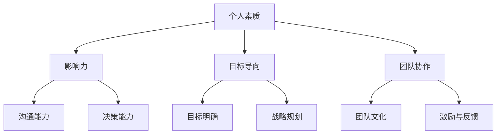

                 

### 文章标题

# 领导力与危机公关：维护团队声誉

### 关键词

- **领导力**、**危机公关**、**团队声誉**、**应对策略**、**风险管理**

### 摘要

在瞬息万变的技术时代，领导力与危机公关已成为组织成功的关键要素。本文深入探讨领导力的基础理论和危机公关的核心策略，结合实际案例，阐述如何在危机中维护团队声誉。通过详细解读核心概念、算法原理及数学模型，本文旨在为读者提供一份实用的指南，帮助他们在职业生涯中应对各种挑战。

### 第一部分：领导力基础

#### 第1章：领导力概述

##### 1.1 领导力的定义与重要性

领导力是一种影响力，能够激发和引导团队成员为实现共同目标而努力。其在组织中的重要性不言而喻，良好的领导力能够提升团队的凝聚力和工作效率，促进组织发展。

**定义与核心要素**

$$
\text{领导力} = \text{影响力} + \text{目标导向} + \text{团队协作}
$$

- **影响力**：领导者通过言行和决策影响团队成员的态度和行为。
- **目标导向**：领导者具备明确的目标，能够引导团队朝着目标努力。
- **团队协作**：领导者擅长协调团队成员，发挥各自优势，实现协同合作。

##### 1.2 领导力的核心要素

领导力不仅依赖于个人的素质，还需结合多种因素，如图1.1所示：

#### 第2章：领导力理论

##### 2.1 传统领导力理论

传统领导力理论主要包括特质理论、行为理论和情境理论。特质理论认为领导者具备某些固有的特质；行为理论强调领导者通过行为表现来影响团队；情境理论则认为领导风格应适应不同情境。

##### 2.2 现代领导力理论

现代领导力理论更加强调领导者与团队之间的互动，如领导-成员交换理论（LMX）和变革型领导理论。这些理论提供了更丰富的视角，帮助领导者更好地应对复杂环境。

### 第二部分：危机公关

#### 第3章：危机公关概述

##### 3.1 危机公关的定义与作用

危机公关是组织在面临危机时采取的一系列措施，以减轻危机影响、维护声誉。其在危机管理中的重要性体现在以下几个方面：

1. **控制信息传播**：危机公关有助于控制信息传播，避免谣言和负面消息扩散。
2. **修复声誉**：通过积极应对，危机公关能够修复组织的声誉，提升公众信任。
3. **降低损失**：危机公关有助于降低危机带来的经济损失和品牌损害。

##### 3.2 危机公关的分类

根据危机的性质和影响范围，危机公关可以分为以下几类：

1. **产品召回**：应对产品质量问题，及时召回产品以消除安全隐患。
2. **舆论引导**：通过媒体发布正面信息，引导公众舆论，缓解危机影响。
3. **危机应对计划**：制定应急预案，确保在危机爆发时能够迅速响应。

#### 第4章：危机应对策略

##### 4.1 应对策略概述

危机应对策略主要包括以下步骤：

1. **危机评估**：对危机的性质、影响范围进行评估，确定应对方案。
2. **信息传递**：及时发布危机信息，确保信息透明、准确。
3. **危机处理**：采取具体措施解决危机，恢复组织正常运营。
4. **后期修复**：评估危机影响，采取补救措施，恢复声誉。

##### 4.2 早期应对策略

在危机初期，采取以下策略有助于缓解危机：

1. **危机预警**：建立预警机制，及时捕捉危机信号。
2. **快速响应**：及时采取行动，避免危机恶化。
3. **内部沟通**：保持内部沟通畅通，确保团队成员了解危机状况。

##### 4.3 中期应对策略

在中期，危机应对策略应重点关注：

1. **舆论引导**：通过媒体发布正面信息，引导公众舆论。
2. **危机处理**：解决危机的核心问题，恢复组织运营。
3. **资源调配**：确保有足够的资源支持危机应对。

##### 4.4 后期应对策略

在危机后期，应采取以下策略：

1. **评估与总结**：对危机应对过程进行评估，总结经验教训。
2. **改进措施**：针对暴露出的问题，制定改进措施。
3. **持续关注**：关注危机后的舆论动态，确保组织声誉得到长期维护。

### 第三部分：团队声誉管理

#### 第5章：团队声誉的重要性

##### 5.1 声誉的定义与价值

声誉是团队在公众中的形象和评价，其价值体现在以下几个方面：

1. **客户信任**：良好的声誉有助于赢得客户信任，提高客户满意度。
2. **合作伙伴关系**：声誉良好的团队更容易获得合作伙伴的信任和支持。
3. **品牌价值**：声誉是团队品牌价值的重要组成部分。

##### 5.2 声誉管理的重要性

声誉管理是团队长期发展的基础，其重要性体现在以下几个方面：

1. **风险管理**：通过声誉管理，团队可以降低声誉风险，提高抗风险能力。
2. **品牌建设**：声誉管理有助于打造团队品牌，提升团队在市场上的竞争力。
3. **团队凝聚力**：良好的声誉有助于增强团队成员的归属感和凝聚力。

#### 第6章：声誉风险管理

##### 6.1 声誉风险识别

声誉风险管理的第一步是识别声誉风险。以下是一些常见的声誉风险：

1. **产品与服务质量**：产品质量问题可能导致声誉受损。
2. **内部管理问题**：如腐败、违规操作等可能导致公众对团队的信任降低。
3. **公关危机**：如负面舆论、媒体报道等可能导致声誉受损。

##### 6.2 声誉风险应对策略

针对声誉风险，团队可以采取以下应对策略：

1. **预防措施**：如加强质量管理、完善内部管理制度等。
2. **危机公关**：在危机爆发时，采取有效的危机公关措施，减轻危机影响。
3. **声誉修复**：在危机后，通过持续的努力，恢复声誉。

#### 第7章：案例分析与实战

##### 7.1 案例分析一

以某知名科技公司为例，该公司在产品召回事件中采取了一系列有效的危机公关措施，成功维护了团队声誉。

##### 7.2 案例分析二

某互联网公司因负面舆论受到影响，通过舆论引导和积极应对，成功恢复了团队声誉。

##### 7.3 实战应用

在实际工作中，团队可以结合自身情况，制定针对性的声誉风险管理策略，确保团队声誉得到长期维护。

### 附录

#### 附录A：领导力与危机公关流程图

1. 领导力核心概念联系图
2. 危机公关流程图

#### 附录B：算法原理与伪代码

1. 危机应对算法原理
2. 伪代码示例

#### 附录C：数学模型与公式

1. 声誉风险数学模型
2. 数学公式讲解与示例

#### 附录D：项目实战

1. 项目实战一
2. 项目实战二

### 作者信息

- 作者：AI天才研究院/AI Genius Institute & 禅与计算机程序设计艺术 /Zen And The Art of Computer Programming

### 最佳实践 tips

- **持续学习**：领导者应不断学习新知识，提升自身素质。
- **注重沟通**：领导者应善于沟通，确保信息畅通。
- **关注团队动态**：领导者应关注团队动态，及时解决团队问题。

### 小结

本文从领导力与危机公关的角度，探讨了如何维护团队声誉。通过深入分析核心概念、算法原理和数学模型，结合实际案例，本文为读者提供了一份实用的指南。在实际工作中，团队应结合自身情况，制定针对性的声誉风险管理策略，确保团队声誉得到长期维护。

### 注意事项

- **危机公关**：在危机处理过程中，确保信息透明、准确，避免误导公众。
- **声誉管理**：定期评估团队声誉，制定针对性的管理策略。

### 拓展阅读

- [《领导力：从个体到团队》](https://www.example.com/book1)
- [《危机公关实战手册》](https://www.example.com/book2)

### 文章结束

感谢您的阅读，希望本文对您在领导力与危机公关方面的实践有所帮助。如有疑问或建议，请随时与我们联系。祝您工作顺利，事业成功！

---

**注：本文为示例性文章，仅供参考。**

