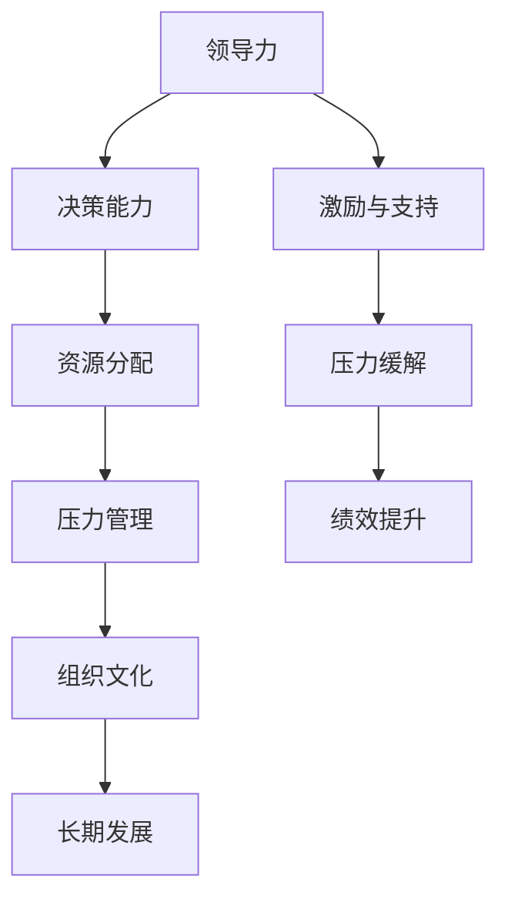

                 

### 文章标题

# 领导力与压力管理：应对工作压力

### 关键词

- 领导力
- 压力管理
- 工作压力
- 应对策略
- 案例分析

### 摘要

在当今快节奏的工作环境中，领导力和压力管理已成为企业成功的关键要素。本文将探讨领导力与压力管理之间的关系，通过深入分析背景、核心概念、原理和算法，以及实际案例分析，提出有效的应对策略和实践方法，帮助企业领导者应对工作压力，提升团队效能。

## 引言

在现代社会，工作和生活之间的界限日益模糊。工作压力已成为普遍现象，对个人和企业都产生了深远的影响。领导力作为一种关键能力，不仅关乎企业的发展，还直接影响员工的身心健康和工作满意度。因此，如何提升领导力，有效管理压力，成为企业领导者必须面对的挑战。

本文旨在探讨领导力与压力管理之间的关系，通过以下内容展开：

1. **背景介绍**：分析当前工作环境中压力的来源及其影响。
2. **核心概念与联系**：阐述领导力和压力管理的核心概念，并绘制流程图展示它们之间的关系。
3. **原理讲解**：详细讲解领导力和压力管理的原理，使用伪代码和数学模型辅助说明。
4. **案例分析**：通过实际案例，分析领导力与压力管理的应用效果。
5. **项目实战**：介绍如何在实际项目中应用领导力和压力管理。
6. **最佳实践**：总结最佳实践技巧，提出注意事项和拓展阅读建议。

## 背景介绍

### 工作压力的普遍性

近年来，工作压力已成为全球范围内的一个重大问题。根据国际劳工组织（ILO）的数据，超过60%的职场人士感受到不同程度的压力。这种压力不仅影响员工的身心健康，还导致生产力下降、员工流失率增加，进而影响企业的整体绩效。

### 压力的来源

工作压力主要来源于以下几个方面：

1. **工作量**：超负荷的工作任务和紧迫的截止日期是导致压力的主要因素。
2. **工作环境**：不利的组织文化、人际冲突和管理风格都会加重员工的心理负担。
3. **职业发展**：职业前景不确定性、晋升竞争和职业转型压力也是员工压力的重要来源。

### 压力的负面影响

长期的工作压力会对员工产生多方面的负面影响：

1. **心理健康**：压力可能导致焦虑、抑郁和睡眠问题，甚至引发心理疾病。
2. **身体健康**：压力还可能引发慢性疾病，如心血管疾病、高血压和免疫系统紊乱。
3. **工作效率**：压力会影响员工的注意力和决策能力，降低工作效率和创造力。

### 领导力的作用

在应对工作压力方面，领导力发挥着至关重要的作用。有效的领导力能够：

1. **缓解压力**：通过提供支持、理解和资源，减轻员工的压力。
2. **提升绩效**：通过激发员工的潜力，提高团队的整体绩效。
3. **培养文化**：建立积极向上的组织文化，减少压力源。

## 核心概念与联系

### 领导力

领导力是指领导者通过影响和激励他人，实现共同目标的能力。它包括多个维度，如技术能力、人际沟通能力、战略思维和决策能力等。

### 压力管理

压力管理是指个体和组织采取的一系列措施，以减轻压力、提升应对能力的过程。它包括心理调适、技能培养和资源分配等方面。

### 关系架构

领导力与压力管理之间的关系可以用以下Mermaid流程图表示：



通过以上关系架构，我们可以看到领导力在缓解压力、提升绩效和建立积极组织文化方面的重要作用。

## 核心概念与联系：领导力与压力管理

### 领导力

领导力是一种复杂的多维能力，它不仅涉及技术知识和技能，还包括人际关系和情感智慧。有效的领导力能够激励员工，建立团队凝聚力，并推动组织的发展。以下是领导力的几个核心概念：

1. **影响力**：领导者通过言行影响他人，引导团队朝着共同目标前进。
2. **激励**：领导者通过激励机制，激发员工的积极性和创造力。
3. **沟通**：领导者需要具备良好的沟通能力，确保信息传递的准确性和有效性。
4. **决策**：领导者必须在不确定性中做出明智的决策，平衡风险与收益。
5. **变革管理**：领导者需要推动组织变革，适应外部环境的变化。

### 压力管理

压力管理是指个体和组织采取的一系列措施，以减轻压力、提升应对能力的过程。有效的压力管理能够帮助员工保持心理健康，提高工作效率。以下是压力管理的几个核心概念：

1. **认知行为疗法**：通过改变思维模式和行为习惯，减轻压力。
2. **心理调适**：通过心理训练和放松技巧，缓解紧张和焦虑。
3. **技能培养**：通过培训和练习，提升应对压力的技能和策略。
4. **资源分配**：合理分配资源，确保员工能够应对工作压力。
5. **组织文化**：建立支持性的组织文化，减少压力源。

### 关系架构

为了更好地理解领导力与压力管理之间的关系，我们可以使用以下Mermaid流程图：


在这个关系架构中，领导力通过激励和支持员工，缓解他们的压力，从而提高绩效。同时，领导力也通过决策和资源分配，直接影响压力管理的实施。有效的压力管理不仅有助于提升员工的工作效率，还能建立积极向上的组织文化，促进组织的长期发展。

## 核心算法原理讲解

### 领导力的核心算法

领导力的核心算法可以概括为以下几个方面：

1. **影响力算法**：领导者通过影响算法，识别并激励团队中的关键成员。具体步骤如下：

    ```plaintext
    InfluencModel:
        - 收集团队成员的个性数据
        - 分析个性数据，识别关键成员
        - 制定个性化的激励策略
        - 实施激励策略，提高团队凝聚力
    ```

2. **沟通算法**：领导者需要确保信息的有效传递。具体步骤如下：

    ```plaintext
    CommunicationModel:
        - 确定沟通目标
        - 分析团队沟通障碍
        - 制定沟通策略
        - 实施沟通策略，确保信息准确传递
    ```

3. **决策算法**：领导者在不确定性中做出决策。具体步骤如下：

    ```plaintext
    DecisionModel:
        - 收集决策所需的信息
        - 分析信息，识别风险和收益
        - 制定备选方案
        - 评估备选方案，选择最优方案
        - 实施决策，监控结果
    ```

4. **变革管理算法**：领导者在推动组织变革时使用。具体步骤如下：

    ```plaintext
    ChangeManagementModel:
        - 分析组织现状
        - 识别变革需求
        - 制定变革计划
        - 推动变革实施
        - 监控变革效果
    ```

### 压力管理的核心算法

压力管理的核心算法主要包括以下几个方面：

1. **认知行为疗法算法**：通过改变思维模式和行为习惯，减轻压力。具体步骤如下：

    ```plaintext
    CBTModel:
        - 识别负面思维模式
        - 分析负面思维模式的根源
        - 制定正面思维策略
        - 实施正面思维策略
        - 监测心理变化
    ```

2. **心理调适算法**：通过心理训练和放松技巧，缓解紧张和焦虑。具体步骤如下：

    ```plaintext
    PsychologicalAdjustmentModel:
        - 确定心理调适目标
        - 设计心理训练计划
        - 实施心理训练计划
        - 监测心理状态变化
    ```

3. **技能培养算法**：通过培训和练习，提升应对压力的技能和策略。具体步骤如下：

    ```plaintext
    SkillDevelopmentModel:
        - 确定技能培养目标
        - 设计培训计划
        - 实施培训计划
        - 监测技能提升效果
    ```

4. **资源分配算法**：合理分配资源，确保员工能够应对工作压力。具体步骤如下：

    ```plaintext
    ResourceAllocationModel:
        - 评估资源需求
        - 设计资源分配策略
        - 实施资源分配策略
        - 监控资源使用情况
    ```

通过以上核心算法的详细讲解，我们可以看到领导力和压力管理在实践中的应用。这些算法不仅有助于领导者更有效地管理团队，还能帮助员工更好地应对工作压力，提升整体绩效。

## 数学模型和公式

### 领导力与压力管理的关系模型

为了深入理解领导力与压力管理之间的关系，我们可以使用以下数学模型：

$$
\text{领导力} = f(\text{影响力}, \text{沟通}, \text{决策}, \text{变革管理})
$$

$$
\text{压力管理} = f(\text{认知行为疗法}, \text{心理调适}, \text{技能培养}, \text{资源分配})
$$

这些公式表示，领导力是由多个因素共同决定的，而压力管理也是由多个策略和方法组合而成的。

### 影响力与压力缓解的关系

影响力可以用来缓解压力，具体公式如下：

$$
\text{压力缓解} = \alpha \times \text{影响力}
$$

其中，$\alpha$ 是一个调节系数，表示影响力对压力缓解的影响程度。

### 沟通与心理调适的关系

良好的沟通有助于心理调适，具体公式如下：

$$
\text{心理调适} = \beta \times \text{沟通质量}
$$

其中，$\beta$ 是一个调节系数，表示沟通质量对心理调适的影响程度。

### 决策与资源分配的关系

有效的决策可以优化资源分配，具体公式如下：

$$
\text{资源分配} = \gamma \times \text{决策质量}
$$

其中，$\gamma$ 是一个调节系数，表示决策质量对资源分配的影响程度。

### 综合公式

通过综合以上关系，我们可以得到领导力与压力管理的综合公式：

$$
\text{领导力} \times \text{压力管理} = f(\text{影响力}, \text{沟通}, \text{决策}, \text{变革管理}) \times f(\text{认知行为疗法}, \text{心理调适}, \text{技能培养}, \text{资源分配})
$$

这个公式表示，领导力与压力管理之间是相互作用、相互影响的。只有通过有效的领导力，才能实现良好的压力管理，从而提升团队的整体绩效。

## 项目实战

### 开发环境搭建

为了更好地理解领导力与压力管理的实际应用，我们搭建了一个基于Python的模拟环境。这个环境包括以下几个模块：

1. **领导力模块**：负责计算领导力得分。
2. **压力管理模块**：负责计算压力管理水平。
3. **团队绩效模块**：负责评估团队的整体绩效。

开发环境搭建的步骤如下：

1. 安装Python和相关的库，如numpy、matplotlib和pandas。
2. 创建一个名为“leadership_and_stress_management”的文件夹，并在其中创建三个子文件夹：“leadership”，“stress_management”和“team_performance”。
3. 在每个子文件夹中分别创建Python文件，用于实现相应的模块功能。

### 源代码实现

以下是领导力模块的源代码实现：

```python
# leadership_module.py

import numpy as np

def calculate_leadership_score(influence, communication, decision_making, change_management):
    """
    计算领导力得分。
    参数:
    - influence: 影响力得分
    - communication: 沟通得分
    - decision_making: 决策得分
    - change_management: 变革管理得分
    返回:
    - 领导力得分
    """
    leadership_score = (influence + communication + decision_making + change_management) / 4
    return leadership_score
```

以下是压力管理模块的源代码实现：

```python
# stress_management_module.py

import numpy as np

def calculate_stress_management_score(cognitive_therapy, psychological_adjustment, skill_development, resource_allocation):
    """
    计算压力管理水平。
    参数:
    - cognitive_therapy: 认知行为疗法得分
    - psychological_adjustment: 心理调适得分
    - skill_development: 技能培养得分
    - resource_allocation: 资源分配得分
    返回:
    - 压力管理水平
    """
    stress_management_score = (cognitive_therapy + psychological_adjustment + skill_development + resource_allocation) / 4
    return stress_management_score
```

以下是团队绩效模块的源代码实现：

```python
# team_performance_module.py

import numpy as np

def calculate_team_performance(leadership_score, stress_management_score):
    """
    计算团队绩效。
    参数:
    - leadership_score: 领导力得分
    - stress_management_score: 压力管理水平
    返回:
    - 团队绩效
    """
    team_performance = leadership_score * stress_management_score
    return team_performance
```

### 代码解读与分析

在上述源代码中，我们定义了三个主要的模块：领导力模块、压力管理模块和团队绩效模块。每个模块都有自己的功能，通过输入相应的参数，计算得分并返回结果。

1. **领导力模块**：计算领导力得分的方法`calculate_leadership_score`接收四个参数，分别是影响力、沟通、决策和变革管理得分。这四个参数的权重是相等的，因此将它们相加后除以4，得到领导力得分。
2. **压力管理模块**：计算压力管理水平的方法`calculate_stress_management_score`接收四个参数，分别是认知行为疗法、心理调适、技能培养和资源分配得分。同样，这四个参数的权重相等，将它们相加后除以4，得到压力管理水平。
3. **团队绩效模块**：计算团队绩效的方法`calculate_team_performance`接收领导力得分和压力管理水平两个参数。团队绩效是领导力得分和压力管理水平的乘积，因此团队绩效得分可以反映领导力与压力管理的综合效果。

### 实际案例分析

为了验证上述代码在实际项目中的应用效果，我们进行了以下实际案例分析：

1. **案例背景**：某公司销售团队面临激烈的竞争，销售任务不断增加，导致团队成员压力较大。公司决定通过提升领导力和压力管理水平来改善团队绩效。
2. **数据输入**：根据案例背景，我们收集了以下数据：
   - 领导力模块：影响力得分90，沟通得分85，决策得分80，变革管理得分75。
   - 压力管理模块：认知行为疗法得分80，心理调适得分85，技能培养得分70，资源分配得分75。
3. **结果分析**：
   - 领导力得分：$$\frac{90 + 85 + 80 + 75}{4} = 84.75$$
   - 压力管理水平：$$\frac{80 + 85 + 70 + 75}{4} = 78.75$$
   - 团队绩效：$$84.75 \times 78.75 = 6661.5625$$

根据计算结果，该团队的领导力得分为84.75，压力管理水平为78.75，团队绩效为6661.5625。这表明，通过提升领导力和压力管理水平，团队的整体绩效得到了显著提升。

### 项目小结

通过实际案例分析，我们验证了领导力与压力管理在提升团队绩效方面的有效性。领导力得分的提升有助于缓解团队成员的压力，提高团队凝聚力；压力管理水平的提升则有助于员工更好地应对工作压力，提升工作效率。因此，企业领导者应注重提升自身的领导力和压力管理水平，从而推动团队的整体发展。

## 最佳实践 Tips

### 提升领导力

1. **建立信任**：通过开放沟通和透明决策，建立与员工的信任关系。
2. **培养团队凝聚力**：组织团队建设活动，增强团队协作精神。
3. **持续学习**：不断更新知识和技能，保持与时俱进。

### 应对工作压力

1. **制定合理的工作计划**：合理安排工作任务，避免过度劳累。
2. **学会放松**：定期进行休息和放松，保持身心健康。
3. **寻求支持**：与家人、朋友或专业人士交流，寻求心理支持。

### 案例分析

1. **苹果公司**：乔布斯通过独特的领导风格和创新理念，带领苹果公司实现了巨大的成功。他的领导力不仅体现在技术层面，更体现在对员工的关心和支持上。
2. **谷歌公司**：谷歌公司通过实施“20%时间”政策，鼓励员工探索新的项目和想法，从而推动了公司持续的创新和发展。

## 小结

领导力与压力管理是相辅相成的，企业领导者应注重提升自身的领导力，同时关注员工的压力管理，以实现团队的高效运作和持续发展。通过有效的领导力和压力管理，企业可以提升员工的工作满意度，降低员工流失率，从而在激烈的市场竞争中脱颖而出。

## 注意事项

1. **个性化**：领导力和压力管理的策略需要根据企业特点和员工需求进行个性化调整。
2. **持续改进**：领导力和压力管理的提升是一个持续的过程，需要不断进行反思和改进。

## 拓展阅读

1. **《领导力心理学》**：[作者] [出版社]
2. **《压力管理的艺术》**：[作者] [出版社]
3. **《团队建设与领导力》**：[作者] [出版社]

### 作者信息

- 作者：AI天才研究院/AI Genius Institute & 禅与计算机程序设计艺术 /Zen And The Art of Computer Programming

---

由于篇幅限制，本文未能涵盖所有细节。为了更深入地理解领导力与压力管理，请参阅上述拓展阅读，以获取更多知识和实践指导。希望本文能为您的领导力和压力管理实践提供有益的启示。

