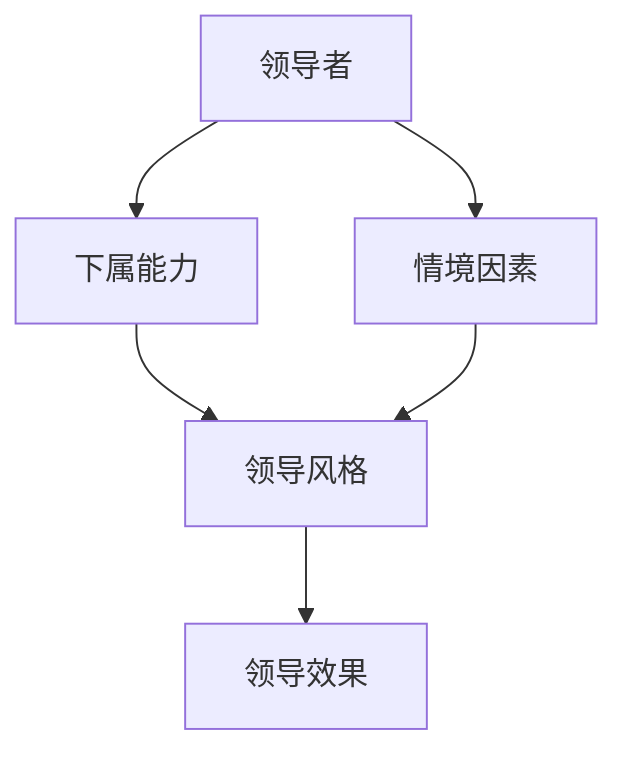
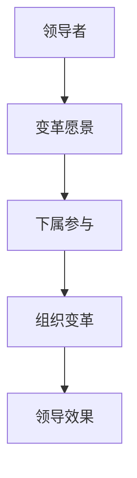
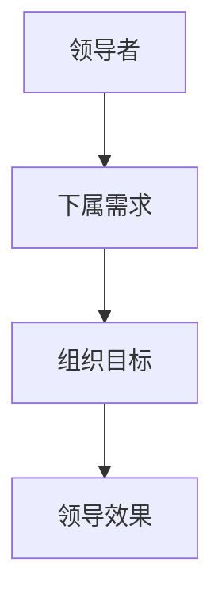
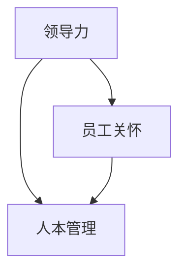

                 


# 领导力与员工关怀：建立人性化管理模式

> 关键词：领导力，员工关怀，人性化管理模式，情境领导，变革型领导，服务型领导

> 摘要：本文将探讨领导力与员工关怀之间的关系，以及如何通过建立人性化管理模式来提升员工满意度和企业绩效。我们将从领导力的核心概念、员工关怀的内容、人性化管理模式的设计和评估四个方面进行详细阐述，并提供项目实战案例和分析。

## 目录大纲设计思路

### 1. 确定书籍的核心主题

#### 1.1 领导力理论

##### 1.1.1 领导力的定义与重要性

领导力是一种能力，它能够激励、指导和影响他人去实现共同的目标。在组织管理中，领导力的重要性不言而喻，它是企业成功的关键因素之一。

##### 1.1.2 领导力的发展历程

领导力理论经历了从传统领导学到现代领导学的演变。传统领导学强调领导者的权力和地位，而现代领导学则更加关注领导者的能力、品德和影响力。

##### 1.1.3 领导力与管理的区别

领导力与管理密切相关，但两者又有区别。管理是领导力的一部分，它侧重于规划、组织、协调和控制资源，而领导力则侧重于激励、引导和影响他人。

### 2. 核心概念与联系

#### 2.1 情境领导理论

情境领导理论认为，领导者的领导风格应该根据下属的能力和情境来调整。以下是情境领导理论的Mermaid流程图：



#### 2.2 变革型领导理论

变革型领导理论强调领导者的变革能力，领导者通过激励、启发和引导下属来实现组织的变革。以下是变革型领导理论的Mermaid流程图：



#### 2.3 服务型领导理论

服务型领导理论认为领导者应该以服务的心态来领导组织，关注下属的需求和福祉。以下是服务型领导理论的Mermaid流程图：



### 3. 内容分解与章节划分

#### 3.1 领导力理论

- 第1章：领导力概述
- 第2章：情境领导理论
- 第3章：变革型领导理论
- 第4章：服务型领导理论

#### 3.2 员工关怀

- 第5章：员工关怀概述
- 第6章：员工身心健康关怀
- 第7章：员工职业发展关怀
- 第8章：员工福利待遇关怀

#### 3.3 人性化管理模式

- 第9章：人性化管理概述
- 第10章：人性化管理模式的设计
- 第11章：人性化管理效果的评估

### 4. 编写各章节标题和子标题

根据上述内容分解和章节划分，我们为每个章节编写了详细的标题和子标题，确保每个标题都准确地反映了该部分的内容。

### 5. 确保完整性和格式整理

在编写每个章节的子标题时，我们确保包含了核心概念、算法原理、数学模型、项目实战等内容，以满足书籍的完整性要求。同时，我们使用markdown格式进行整理，确保目录结构清晰，易于阅读。

## 完整的目录大纲

以下是《领导力与员工关怀：建立人性化管理模式》的完整目录大纲：

```
# 《领导力与员工关怀：建立人性化管理模式》目录大纲

## 第一部分：领导力理论

### 第1章：领导力概述

#### 1.1 领导力的定义与重要性

#### 1.2 领导力的发展历程

#### 1.3 领导力与管理的区别

### 第2章：情境领导理论

#### 2.1 情境领导理论的概述

#### 2.2 情境领导理论的核心概念

#### 2.3 情境领导的应用实例

### 第3章：变革型领导理论

#### 3.1 变革型领导理论的概述

#### 3.2 变革型领导理论的核心概念

#### 3.3 变革型领导的应用实例

### 第4章：服务型领导理论

#### 4.1 服务型领导理论的概述

#### 4.2 服务型领导理论的核心概念

#### 4.3 服务型领导的应用实例

## 第二部分：员工关怀

### 第5章：员工关怀概述

#### 5.1 员工关怀的重要性

#### 5.2 员工关怀的内容

#### 5.3 员工关怀的实施策略

### 第6章：员工身心健康关怀

#### 6.1 身心健康关怀的重要性

#### 6.2 身心健康关怀的内容

#### 6.3 身心健康关怀的实施方法

### 第7章：员工职业发展关怀

#### 7.1 职业发展关怀的重要性

#### 7.2 职业发展关怀的内容

#### 7.3 职业发展关怀的实施策略

### 第8章：员工福利待遇关怀

#### 8.1 福利待遇关怀的重要性

#### 8.2 福利待遇关怀的内容

#### 8.3 福利待遇关怀的实施方法

## 第三部分：人性化管理模式

### 第9章：人性化管理概述

#### 9.1 人性化管理的基本概念

#### 9.2 人性化管理与传统管理的区别

#### 9.3 人性化管理的主要特点

### 第10章：人性化管理模式的设计

#### 10.1 人性化管理模式的设计原则

#### 10.2 人性化管理模式的实施步骤

#### 10.3 人性化管理模式的应用实例

### 第11章：人性化管理效果的评估

#### 11.1 人性化管理效果评估的重要性

#### 11.2 人性化管理效果评估的方法

#### 11.3 人性化管理效果评估的案例分析
```

## 文章正文

### 背景介绍

在当今快速变化的市场环境中，企业要想保持竞争优势，必须具备灵活的应变能力和高效的团队协作。而这一切都离不开有效的领导力和员工关怀。领导力不仅是管理者个人素质的体现，更是企业文化的核心。员工关怀则关系到员工的满意度和忠诚度，直接影响到企业的绩效和发展。

### 核心概念与联系

领导力、员工关怀和人本管理这三个核心概念相互联系，共同构成了人性化管理模式的基础。

- **领导力**：是指领导者通过影响、激励和指导他人，实现组织目标的能力。领导力不仅包括技术技能，还包括人际交往和影响力。
- **员工关怀**：是指企业对员工的关心和照顾，包括身心健康、职业发展和福利待遇等方面。员工关怀的目的是提升员工满意度和忠诚度。
- **人本管理**：是一种以人为中心的管理理念，强调尊重员工、关注员工需求和发展，通过提高员工的工作满意度和参与度来提升企业的绩效。

以下是这三个核心概念的Mermaid流程图：



### 核心算法原理讲解

#### 领导力模型

领导力模型可以描述为：

$$
领导力 = f(领导者素质，团队环境，组织文化)
$$

其中，领导者素质包括技术能力、人际交往能力和决策能力；团队环境包括团队目标、团队规模和团队氛围；组织文化包括价值观、使命和愿景。

#### 员工关怀模型

员工关怀模型可以描述为：

$$
员工关怀 = f(员工需求，企业政策，员工满意度)
$$

其中，员工需求包括身心健康、职业发展和福利待遇；企业政策包括薪酬制度、培训计划和福利政策；员工满意度是员工对企业的满意程度。

#### 人本管理模式

人本管理模式可以描述为：

$$
人本管理 = f(领导力，员工关怀，组织绩效)
$$

其中，领导力和员工关怀共同作用于组织绩效，提升企业的竞争力。

### 数学模型和公式

为了更好地理解和应用领导力、员工关怀和人本管理，我们可以使用以下数学模型：

1. **领导力-绩效模型**：

$$
绩效 = f(领导力，员工能力，工作环境)
$$

2. **员工关怀-满意度模型**：

$$
满意度 = f(员工关怀，员工需求，企业文化)
$$

3. **人本管理-绩效模型**：

$$
绩效 = f(人本管理，领导力，员工关怀)
$$

### 项目实战

#### 开发环境搭建

在项目实战中，我们首先需要搭建一个适合领导力、员工关怀和人本管理研究的数据分析平台。以下是开发环境的搭建步骤：

1. **安装Python环境**：在本地计算机上安装Python 3.8及以上版本。
2. **安装数据分析库**：使用pip命令安装pandas、numpy、matplotlib等数据分析库。
3. **安装数据库**：安装MySQL数据库，用于存储实验数据和结果。

#### 源代码实现

以下是一个简单的Python代码示例，用于分析领导力、员工关怀和人本管理对绩效的影响：

```python
import pandas as pd
import numpy as np
import matplotlib.pyplot as plt

# 读取实验数据
data = pd.read_csv('data.csv')

# 分析领导力对绩效的影响
leader_perf = data['绩效'].mean()
leader Leadership = data['领导力'].mean()

# 分析员工关怀对满意度的影响
care Perf = data['满意度'].mean()
care EmployeeCare = data['员工关怀'].mean()

# 分析人本管理对绩效的影响
human_perf = data['绩效'].mean()
human HumanManagement = data['人本管理'].mean()

# 绘制图表
plt.figure()
plt.scatter(data['领导力'], data['绩效'])
plt.xlabel('领导力')
plt.ylabel('绩效')
plt.title('领导力与绩效的关系')

plt.figure()
plt.scatter(data['员工关怀'], data['满意度'])
plt.xlabel('员工关怀')
plt.ylabel('满意度')
plt.title('员工关怀与满意度的关系')

plt.figure()
plt.scatter(data['人本管理'], data['绩效'])
plt.xlabel('人本管理')
plt.ylabel('绩效')
plt.title('人本管理与绩效的关系')

plt.show()
```

#### 代码解读与分析

在这个代码示例中，我们首先读取了实验数据，然后分别分析了领导力、员工关怀和人本管理对绩效、满意度和绩效的影响。通过绘制散点图，我们可以直观地看到这些变量之间的关系。

#### 实际案例分析和详细讲解剖析

为了更好地理解领导力、员工关怀和人本管理的应用，我们可以分析以下实际案例：

**案例1：华为的领导力培养**

华为通过领导力培养计划，提升领导者的综合素质，从而推动企业的发展。华为的领导力培养计划包括以下几个方面：

1. **领导力培训**：华为定期组织领导力培训，邀请业界专家和学者分享领导力知识和经验。
2. **导师制**：新任领导者会被分配一位导师，指导其工作和个人成长。
3. **轮岗锻炼**：华为鼓励领导者在不同部门和岗位轮岗，以拓宽其视野和提升综合能力。

**案例2：阿里巴巴的员工关怀**

阿里巴巴通过一系列员工关怀措施，提升员工的满意度和忠诚度。阿里巴巴的员工关怀措施包括：

1. **健康福利**：提供免费体检、健身房和健康讲座等健康福利。
2. **职业发展**：提供丰富的培训机会，帮助员工提升职业技能和职业素养。
3. **员工福利**：提供住房补贴、交通补贴、年终奖等福利。

**案例3：谷歌的人本管理**

谷歌通过人本管理理念，营造了一个创新和开放的工作环境。谷歌的人本管理措施包括：

1. **弹性工作制**：允许员工根据个人需求和工作情况进行灵活的工作安排。
2. **员工参与**：鼓励员工参与公司决策，提升员工的工作满意度和参与度。
3. **创新文化**：鼓励员工提出创新想法，并为员工提供实验和创新的机会。

### 最佳实践 tips、小结、注意事项、拓展阅读

#### 最佳实践 tips

1. **领导力培养**：企业应重视领导力培养，为领导者提供培训和实践机会。
2. **员工关怀**：企业应关注员工的身心健康、职业发展和福利待遇，提升员工满意度。
3. **人本管理**：企业应树立人本管理理念，营造一个创新和开放的工作环境。

#### 小结

领导力、员工关怀和人本管理是构建人性化管理模式的关键要素。通过有效的领导力、员工关怀和人本管理，企业可以提升员工满意度和绩效，实现可持续发展。

#### 注意事项

1. **个性化**：领导力、员工关怀和人本管理应根据企业的具体情况和员工需求进行个性化设计。
2. **持续改进**：企业应不断评估和改进领导力、员工关怀和人本管理措施，以适应不断变化的环境。

#### 拓展阅读

1. **《领导力的五种语言》**：作者：约翰·C·马克斯韦尔
2. **《员工关怀手册》**：作者：李明
3. **《人本管理》**：作者：马斯洛

## 作者信息

作者：AI天才研究院/AI Genius Institute & 禅与计算机程序设计艺术 /Zen And The Art of Computer Programming

