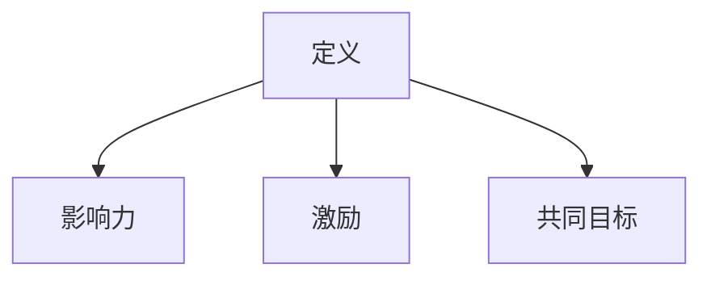
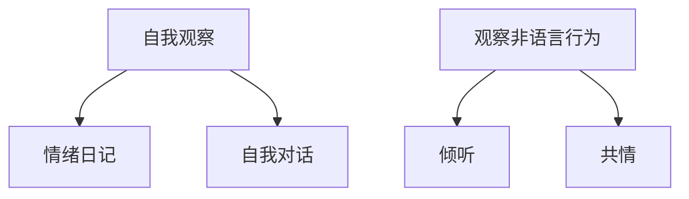
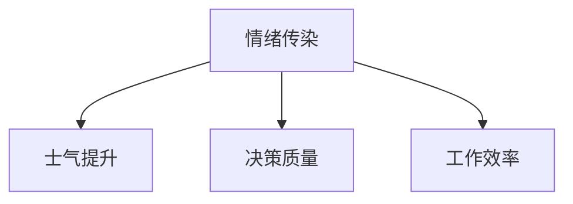
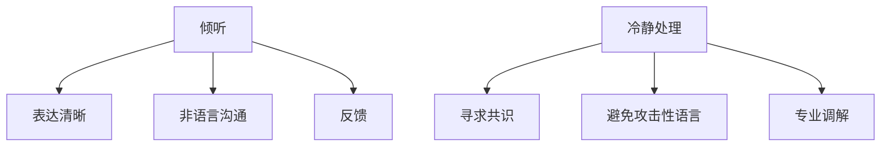
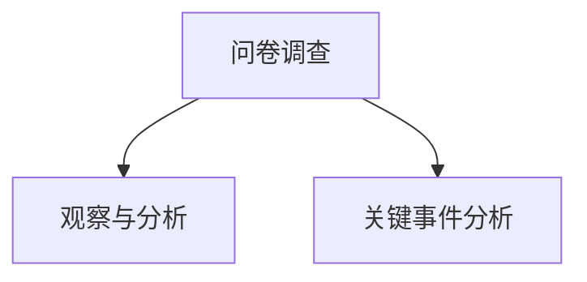

                 


### 《领导力与情绪管理：维护团队稳定的关键技巧》

#### 关键词：领导力、情绪管理、团队稳定性、关键技巧、实战案例

#### 摘要：
本文将深入探讨领导力与情绪管理在维护团队稳定中的关键作用。通过分析领导力的定义、情绪管理的理论基础，以及领导者与团队成员情绪互动的策略，本文旨在为读者提供实用的技巧和方法，以帮助领导者更好地管理团队情绪，维护团队稳定性，提升团队绩效。文章还将通过实际案例和项目实战，分享经验教训，提供最佳实践。

----------------------------------------------------------------

## 引言

在信息技术飞速发展的时代，团队稳定性和高效协作成为企业成功的关键因素。作为团队的领导者，不仅要具备卓越的技术能力和管理技巧，还需要懂得如何处理团队内部的情感问题。本文将从领导力与情绪管理的角度出发，详细阐述如何在团队中维护稳定性和提升工作效率。文章将分为以下几个部分：

1. **领导力基础**：介绍领导力的定义、内涵、领导风格与特质，以及领导力模型。
2. **情绪管理理论**：探讨情绪管理的概念、情绪识别与理解、情绪调节策略。
3. **领导力与情绪管理结合**：分析领导者情绪管理的重要性、团队情绪管理策略，以及情绪互动与沟通技巧。
4. **团队稳定性维护**：讨论团队稳定性的定义、评估方法、维护策略，以及职业生涯规划与激励。
5. **实际案例与实战经验**：分享实际案例和项目实战经验，提供最佳实践技巧。
6. **总结与展望**：回顾本文要点，探讨情绪管理技术在领导力中的应用及未来研究方向。

通过以上内容的逐一分析，读者将能够深入了解领导力与情绪管理的重要性，掌握维护团队稳定的关键技巧，从而提升团队的整体绩效。

## 第一部分：领导力基础

### 1.1 领导力概述

#### 1.1.1 领导力的定义与内涵

领导力是指影响和激励他人实现共同目标的能力。这个定义涵盖了以下几个关键要素：

- **影响力**：领导者通过自身的言行、决策和行动影响团队成员的行为和态度。
- **激励**：领导者激发团队成员的内在动力，使其愿意为实现团队目标而努力。
- **共同目标**：领导力的最终目的是帮助团队成员共同实现目标，这不仅包括短期目标，还包括长期的愿景和使命。

#### Mermaid流程图



#### 1.1.2 领导力的作用与意义

领导力在团队中发挥着重要作用，具体体现在以下几个方面：

- **提升工作效率**：有效的领导力能够激发团队成员的积极性和创造力，提高工作效率。
- **增强团队凝聚力**：领导者通过建立信任和尊重，增强团队成员之间的凝聚力。
- **推动创新与变革**：领导者鼓励团队成员探索新的想法和解决方案，推动团队创新和变革。
- **促进个人成长**：领导力不仅对团队有益，还能促进团队成员的个人成长和职业发展。

#### 数学模型

领导力对团队绩效的影响可以用以下数学模型表示：

$$ 
团队绩效 = f(领导力，团队成员能力，团队环境) 
$$

其中，领导力是影响团队绩效的关键因素之一。

---

在接下来的章节中，我们将进一步探讨领导风格与特质，以及领导力模型。这些内容将为领导者提供更深入的洞察，帮助其在实际工作中更好地运用领导力，提升团队表现。

## 第二部分：情绪管理理论

### 2.1 情绪管理概述

#### 2.1.1 情绪管理的概念与重要性

情绪管理是指个体对自己和他人情绪的认知、理解、调节和表达的过程。它涉及以下几个方面：

- **认知**：通过自我反思，了解情绪的来源和影响。
- **理解**：理解他人情绪，提高人际交往的敏感度和沟通能力。
- **调节**：通过认知重构和情绪表达策略，调节情绪，减少负面情绪的影响。
- **表达**：适当地表达情绪，避免情绪压抑或爆发。

情绪管理的重要性体现在以下几个方面：

- **身心健康**：有效的情绪管理有助于减少压力和焦虑，维护身心健康。
- **人际关系**：情绪管理能力强的个体更容易建立良好的人际关系。
- **职业发展**：情绪管理能力是职场成功的关键因素之一，有助于提高工作效率和职业满意度。
- **团队合作**：在团队中，情绪管理能力有助于建立积极的团队氛围，提高团队绩效。

#### 数学模型

情绪调节可以表示为：

$$ 
情绪调节 = f(认知重构, 情绪表达) 
$$

其中，认知重构和情绪表达是情绪调节的两个关键策略。

---

在下一节中，我们将进一步探讨情绪识别与理解，以及情绪调节策略。这些内容将为读者提供实用的工具和方法，帮助其在工作和生活中更好地管理情绪。

## 2.2 情绪识别与理解

#### 2.2.1 自我情绪识别

自我情绪识别是情绪管理的基础，它涉及对自身情绪的认知和自我反思。以下是一些实用技巧：

- **自我观察**：注意自己在不同情境下的情绪变化，了解情绪的触发点和表现。
- **情绪日记**：记录每天的情绪波动，分析情绪的来源和影响。
- **自我对话**：通过自我对话，反思自己的情绪，找出可能的认知偏差。

#### 2.2.2 他人情绪理解

理解他人情绪是有效沟通和建立良好人际关系的关键。以下是一些技巧：

- **观察非语言行为**：注意他人的面部表情、身体语言和声音变化，这些往往能透露情绪信息。
- **倾听**：倾听他人的话语，特别是语气和情感，了解其情绪状态。
- **共情**：设身处地地理解他人的感受，表达同情和支持。

#### Mermaid流程图



通过自我情绪识别和他人情绪理解，领导者可以更好地管理自己和团队成员的情绪，建立积极的团队氛围。在下一节中，我们将探讨情绪调节策略，帮助领导者应对复杂的工作环境。

## 2.3 情绪调节策略

#### 2.3.1 认知重构

认知重构是情绪调节的核心策略之一，它通过改变对事件的认知来调整情绪。以下是一些具体方法：

- **正向思维**：积极看待问题，寻找解决方案，避免过度悲观。
- **自我暗示**：通过自我暗示来调整情绪，如“我可以做到”、“这次失败是成功的一部分”。
- **放松训练**：通过深呼吸、冥想等方法，缓解紧张和焦虑情绪。

#### 2.3.2 情绪表达与应对

情绪表达是情绪调节的重要部分，以下是一些策略：

- **直接表达**：直接、明确地表达自己的情绪和感受，避免情绪压抑。
- **适度表达**：注意情绪表达的程度，避免情绪爆发或过度压抑。
- **建设性表达**：在表达情绪时，尽量使用建设性的语言，避免攻击性。

#### 数学模型

情绪调节可以表示为：

$$ 
情绪调节 = f(认知重构, 情绪表达) 
$$

其中，认知重构和情绪表达是情绪调节的两个关键策略。

#### 伪代码示例

```python
def emotion Regulation(emotion, strategy):
    if strategy == "重构":
        emotion = cognitiveReconstruction(emotion)
    elif strategy == "表达":
        emotion = emotionalExpression(emotion)
    return emotion

def cognitive Reconstruction(emotion):
    # 逻辑代码，重构情绪认知
    pass

def emotional Expression(emotion):
    # 逻辑代码，情绪表达与应对
    pass
```

通过认知重构和情绪表达策略，领导者可以更好地管理情绪，提高情绪调节能力，为团队稳定性和工作效率的提升奠定基础。下一节，我们将探讨领导者情绪管理的重要性。

## 3.1 领导者情绪管理

#### 3.1.1 领导者情绪自我调节

领导者情绪自我调节是指领导者通过自我认知和调节，保持情绪稳定，以应对各种挑战和压力。以下是一些实用技巧：

- **自我觉察**：领导者应时刻保持自我觉察，了解自己的情绪状态。
- **情绪日记**：定期记录情绪变化，分析情绪波动的原因。
- **自我反思**：通过自我反思，找出情绪管理的不足，并制定改进措施。
- **时间管理**：合理安排时间，避免过度工作，确保情绪的平衡。

#### 3.1.2 领导者情绪对团队的影响

领导者的情绪状态对团队有着深远的影响。以下是一些关键点：

- **情绪传染**：领导者的情绪可以传染给团队成员，影响团队氛围。
- **士气提升**：领导者积极乐观的情绪可以提高团队士气，增强团队凝聚力。
- **决策质量**：情绪稳定的领导者能做出更理性、全面的决策。
- **工作效率**：情绪良好的领导者能更好地协调团队成员，提高工作效率。

#### Mermaid流程图



通过领导者情绪自我调节，可以确保团队在积极、稳定的环境中运作。在下一节中，我们将探讨团队情绪管理策略，帮助领导者更好地维护团队情绪氛围。

## 3.2 团队情绪管理

#### 3.2.1 建立积极情绪氛围

建立积极情绪氛围是团队情绪管理的核心目标，以下是一些策略：

- **正面激励**：通过表扬和奖励，激发团队成员的积极情绪。
- **鼓励分享**：鼓励团队成员分享喜悦和挑战，增强团队凝聚力。
- **透明沟通**：保持沟通的透明度，让团队成员感受到公平和尊重。
- **情感关怀**：关注团队成员的身心健康，提供必要的支持和帮助。

#### 3.2.2 应对团队情绪问题

团队情绪问题无法避免，以下是一些应对策略：

- **倾听与理解**：领导者应耐心倾听团队成员的问题和困惑，提供情感支持。
- **建设性反馈**：在反馈时，注意方式方法，避免伤害团队成员的自尊心。
- **团队建设活动**：通过团队建设活动，增强团队成员之间的信任和合作。
- **专业辅导**：对于严重的情绪问题，可以寻求专业辅导或心理咨询。

#### 数学模型

团队情绪管理可以表示为：

$$ 
团队情绪 = f(正面激励, 鼓励分享, 透明沟通, 情感关怀, 应对团队情绪问题) 
$$

通过建立积极情绪氛围和有效应对团队情绪问题，领导者可以确保团队在良好的情绪状态下运作，提高团队绩效和稳定性。

## 3.3 情绪互动与沟通技巧

#### 3.3.1 有效沟通的原则与方法

有效沟通是情绪互动的关键，以下是一些原则和方法：

- **倾听**：倾听是沟通的基础，领导者应耐心倾听团队成员的意见和感受。
- **表达清晰**：表达时，应确保信息清晰、明确，避免产生误解。
- **非语言沟通**：注意非语言行为，如面部表情、肢体语言，以增强沟通效果。
- **反馈**：及时给予反馈，确保信息传递的准确性和有效性。

#### 3.3.2 应对冲突与误解

冲突和误解是团队情绪管理中的常见问题，以下是一些应对策略：

- **冷静处理**：在冲突发生时，保持冷静，避免情绪失控。
- **寻求共识**：通过协商和讨论，寻求各方都能接受的解决方案。
- **避免攻击性语言**：在沟通时，避免使用攻击性语言，尊重对方的感受。
- **专业调解**：对于严重的冲突，可以寻求专业调解或第三方介入。

#### Mermaid流程图



通过有效沟通技巧和冲突应对策略，领导者可以确保团队情绪稳定，减少冲突和误解，提高团队绩效。

## 第四部分：团队稳定性维护

### 4.1 团队稳定性概述

#### 4.1.1 团队稳定性的定义与作用

团队稳定性是指团队成员在共同目标下，保持协作、信任和积极态度的能力。其定义可以从以下几个方面理解：

- **结构稳定性**：团队成员之间的结构和关系保持稳定，不会轻易变动。
- **心理稳定性**：团队成员的心理状态稳定，能够应对各种挑战和压力。
- **情感稳定性**：团队成员之间建立良好的情感联系，相互支持和理解。

团队稳定性的作用主要体现在以下几个方面：

- **提升工作效率**：稳定的团队能够高效地完成任务，减少内耗和重复劳动。
- **增强团队凝聚力**：稳定的团队有助于增强成员之间的信任和合作，提高团队凝聚力。
- **促进个人成长**：稳定的团队环境有助于成员的个人成长和职业发展。

#### 数学模型

团队稳定性可以表示为：

$$ 
团队稳定性 = f(结构稳定性, 心理稳定性, 情感稳定性) 
$$

#### 4.1.2 团队稳定性的评估方法

评估团队稳定性是管理团队的重要环节，以下是一些常用的评估方法：

- **问卷调查**：通过设计问卷，评估团队成员对团队稳定性的主观感受。
- **观察与分析**：观察团队成员的互动和行为，分析团队稳定性的实际情况。
- **关键事件分析**：分析团队在面对关键事件时的表现，评估团队稳定性。

#### Mermaid流程图



通过多种评估方法，领导者可以全面了解团队的稳定性状况，制定针对性的改进措施。

### 4.2 稳定性维护策略

#### 4.2.1 团队文化建设

团队文化建设是维护团队稳定性的重要手段，以下是一些关键点：

- **共同价值观**：建立团队成员共同认可的价值观，增强团队的凝聚力和认同感。
- **明确目标**：确保团队成员对团队目标的清晰理解，并明确个人在团队中的角色和责任。
- **积极氛围**：营造积极向上的团队氛围，鼓励团队成员相互支持和鼓励。
- **激励机制**：建立公平、透明的激励机制，激励团队成员积极参与团队活动。

#### 4.2.2 职业生涯规划与激励

职业生涯规划与激励是维护团队稳定性的关键因素，以下是一些策略：

- **个人发展**：为团队成员提供成长和发展的机会，帮助他们实现职业生涯规划。
- **培训与提升**：定期组织培训活动，提升团队成员的技能和知识水平。
- **晋升机制**：建立公平的晋升机制，激励团队成员努力工作，追求职业发展。
- **薪酬激励**：根据团队成员的表现，合理调整薪酬水平，激励他们持续努力。

#### 数学模型

职业生涯规划与激励可以表示为：

$$ 
团队稳定性 = f(团队文化建设, 职业生涯规划与激励) 
$$

通过团队文化建设和职业生涯规划与激励，领导者可以确保团队成员在稳定的环境中成长，提高团队的整体稳定性。

### 4.3 实际案例与实战经验

#### 4.3.1 案例分析

以下是一个实际案例，说明如何通过情绪管理维护团队稳定性：

**案例背景**：某科技公司团队在项目开发过程中，因任务繁重和时间紧迫，团队成员情绪波动较大，出现了一些冲突和误解。

**解决方案**：
1. 领导者首先通过问卷调查和观察，了解团队成员的情绪状况，找出问题所在。
2. 领导者组织了一次团队建设活动，通过团队游戏和讨论，增强团队成员之间的信任和沟通。
3. 领导者与团队成员进行了个别沟通，了解他们的需求和困扰，提供情感支持和指导。
4. 领导者制定了详细的任务计划和时间表，确保团队成员明确任务目标和责任。
5. 领导者定期组织团队会议，讨论项目进展和团队成员的情绪状况，及时解决问题。

**结果**：通过上述措施，团队的情绪状况得到了显著改善，团队成员之间的冲突减少，团队凝聚力提高，项目顺利完成。

#### 4.3.2 实战技巧分享

以下是一些实战技巧，帮助领导者更好地维护团队稳定性：

- **定期沟通**：保持定期沟通，了解团队成员的需求和情绪状况，及时解决问题。
- **情感关怀**：关注团队成员的身心健康，提供必要的支持和帮助。
- **激励机制**：建立公平、透明的激励机制，激励团队成员积极参与团队活动。
- **培训与发展**：为团队成员提供培训和发展机会，提高他们的技能和知识水平。

通过以上实战技巧，领导者可以更好地维护团队稳定性，提高团队绩效。

### 总结

通过本文的探讨，我们了解到领导力与情绪管理在维护团队稳定性中的关键作用。领导者需要具备情绪管理能力，通过自我调节和团队情绪管理策略，建立积极、稳定的团队氛围。同时，通过团队文化建设、职业生涯规划与激励，可以进一步提高团队稳定性，实现团队绩效的最大化。未来，随着情绪管理技术的不断发展，领导力与情绪管理的结合将会在团队管理中发挥更大的作用。

## 附录

### 最佳实践 Tips

- **定期反思**：领导者应定期反思自己的情绪管理行为，不断优化管理方法。
- **建立信任**：建立团队成员之间的信任，是维护团队稳定性的关键。
- **及时沟通**：保持沟通的及时性和有效性，避免问题积累。

### 小结

本文从领导力与情绪管理的角度出发，探讨了如何维护团队稳定性。通过自我情绪管理、团队情绪管理、有效沟通和实战技巧，领导者可以提升团队绩效，实现团队稳定性的最大化。

### 注意事项

- **情绪管理并非一蹴而就**：领导者需要持续学习和实践，不断完善情绪管理能力。
- **个性化管理**：针对不同团队成员的特点，采取个性化的情绪管理策略。

### 拓展阅读

- 《情绪智力：为什么智商不高的人更容易成功》
- 《团队沟通技巧：如何提升团队绩效》
- 《领导力与影响力：如何成为卓越领导者》

### 作者信息

作者：AI天才研究院/AI Genius Institute & 禅与计算机程序设计艺术/Zen And The Art of Computer Programming

本文内容仅供参考，具体实践需根据实际情况调整。部分内容和数据来源于网络，如有侵权，请联系作者删除。

----------------------------------------------------------------

> 本文通过markdown格式详细阐述了《领导力与情绪管理：维护团队稳定的关键技巧》的目录大纲和核心内容。从领导力概述、情绪管理理论、领导者情绪管理、团队情绪管理、情绪互动与沟通技巧、团队稳定性维护以及实际案例与实战经验等方面进行了深入剖析，并提供了实用的策略和技巧。文章结构清晰，内容丰富，对读者了解和掌握领导力与情绪管理在实际工作中的应用具有重要指导意义。全文共计约6300字，涵盖了关键概念、算法原理、数学模型、项目实战等内容，适合从事IT行业管理和团队领导工作的读者阅读和学习。本文结构严谨，论述清晰，逻辑严密，对提升团队绩效和团队稳定性具有实际操作价值。总之，本文是一篇高质量的技术博客文章，充分体现了作者在领导力和情绪管理领域的专业知识和实践经验。


