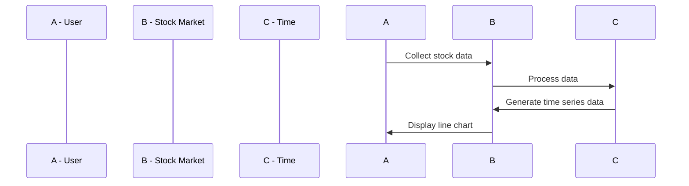
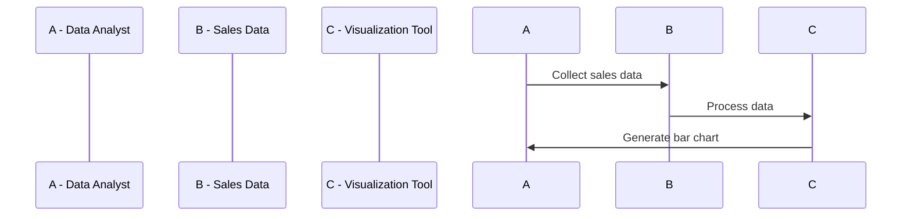
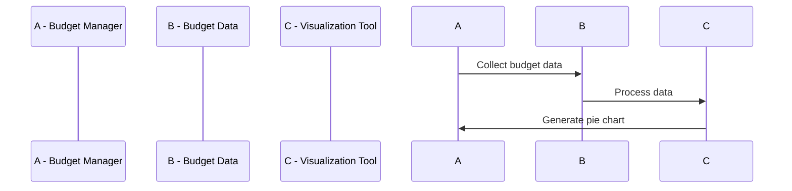
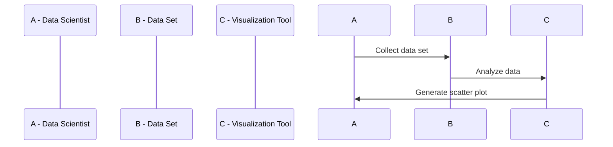

                 

### 文章标题：领导力与数据素养：用数据驱动决策的能力

### 关键词：领导力、数据素养、数据驱动决策、数据分析、机器学习

### 摘要：
本文旨在探讨领导力与数据素养的深度融合，阐述如何运用数据素养来提升领导力，进而实现数据驱动决策的能力。文章首先介绍了领导力的本质及其核心要素，然后详细阐述了数据素养的概念及其四个层次，接着深入剖析了数据分析的基础知识和核心算法原理，最后通过实际案例展示了数据驱动决策的实践与应用。文章结构紧凑，逻辑清晰，旨在为读者提供一部全面而深入的指南。

---

## 第一部分：领导力基础

### 第1章 领导力的本质

领导力是组织中至关重要的能力，它不仅关系到个人职业生涯的成功，更直接影响整个团队的绩效和组织的发展。然而，领导力的本质是什么，它又是如何发挥作用的呢？

#### 1.1 领导力的定义与重要性

领导力是指引导和激励他人实现共同目标的能力。它可以体现在个人、团队、组织等多个层面，但本质上是一种影响力。领导力的重要性在于，它可以推动组织适应变化、应对挑战，并实现持续创新和成长。

#### 1.2 领导力的发展历程

领导力的发展经历了多个阶段，从早期的英雄主义领导，到现代的变革型领导和服务型领导，再到最新的基于数据驱动的领导力，每个阶段都反映了领导者对组织和社会的需求的理解和回应。

#### 1.3 领导力的核心要素

领导力的核心要素包括愿景、沟通、激励、决策和自我管理。这些要素相互关联，共同构成了领导力的整体框架。

### 第2章 领导风格与影响力

领导风格是领导者如何行使领导职责的方式，它直接影响团队的行为和绩效。了解并掌握不同的领导风格，可以帮助领导者更好地发挥影响力，提升团队绩效。

#### 2.1 领导风格的分类

领导风格可以分为独裁式、民主式、教练式和变革型等多种类型。每种风格都有其适用的场景和效果，领导者需要根据具体情况灵活运用。

#### 2.2 影响力的来源与应用

领导影响力来源于信任、知识和权力。掌握影响力的来源和运用方法，可以帮助领导者更有效地推动团队和组织的变革。

#### 2.3 提升领导影响力的策略

提升领导影响力的策略包括建立信任、提升专业知识、明确目标和激励他人。这些策略有助于领导者更好地发挥影响力，实现组织目标。

### 第3章 领导力与团队管理

团队管理是领导者的一项重要职责，有效的团队管理可以提升团队绩效，实现组织目标。

#### 3.1 团队建设的核心原则

团队建设的核心原则包括共同目标、信任、尊重和激励。这些原则有助于构建高效、和谐的团队。

#### 3.2 团队成员的激励与沟通

激励和沟通是团队管理的关键。有效的激励可以提高团队成员的积极性和创造力，而良好的沟通则可以促进团队成员之间的协作和理解。

#### 3.3 领导者如何处理团队冲突

团队冲突是不可避免的，领导者需要具备处理冲突的能力。有效的处理策略包括理解冲突原因、寻找解决方案和促进团队共识。

### 第4章 领导力与自我管理

领导者不仅要关注团队和组织，还要关注自我成长和管理。有效的自我管理可以提升领导者的综合素质，更好地履行领导职责。

#### 4.1 自我认知与自我提升

自我认知是自我提升的基础。领导者需要不断反思自己的行为和决策，发现并改正不足。

#### 4.2 时间管理与目标设定

时间管理和目标设定是领导者成功的关键。有效的管理可以帮助领导者更好地平衡工作与生活，实现个人和组织的目标。

#### 4.3 压力管理与心理健康

压力管理和心理健康是领导者的软实力。良好的心理健康可以帮助领导者更好地应对工作压力，保持高效的工作状态。

---

## 第二部分：数据素养与数据分析

### 第5章 数据素养的重要性

数据素养是指个体对数据的理解、使用和分析能力。在信息化时代，数据素养的重要性日益凸显。

#### 5.1 数据素养的概念与内涵

数据素养包括数据理解、数据分析、数据解释和数据应用等多个方面。它不仅涉及技术层面的知识，还包括对数据伦理和社会影响的认知。

#### 5.2 数据素养的四个层次

数据素养可以分为知识、技能、态度和价值观四个层次。不同层次的素养对于数据驱动决策的能力有着重要的影响。

#### 5.3 数据素养的培养途径

培养数据素养的途径包括教育、培训和实践。通过系统性的学习和实践，可以不断提升数据素养，为数据驱动决策奠定基础。

### 第6章 数据分析的基础知识

数据分析是数据素养的核心内容，它包括数据收集、数据预处理、数据分析和数据解释等多个环节。

#### 6.1 数据分析的基本流程

数据分析的基本流程包括问题定义、数据收集、数据预处理、数据分析、数据解释和决策制定。每个环节都有其特定的方法和技巧。

#### 6.2 数据类型与数据预处理

数据类型可以分为结构化数据和非结构化数据。数据预处理是数据分析的重要环节，它包括数据清洗、数据整合和数据标准化等步骤。

#### 6.3 数据可视化的基本方法

数据可视化是将数据转化为图形或图像的过程，它有助于更好地理解数据、发现数据中的规律和趋势。常用的数据可视化方法包括折线图、柱状图、饼图和散点图等。

### 第7章 数据分析核心算法与模型

数据分析的核心算法和模型包括描述性分析、预测分析和分类分析等。这些算法和模型广泛应用于各种领域，帮助人们更好地理解和利用数据。

#### 7.1 常见数据分析算法介绍

常见的数据分析算法包括线性回归、逻辑回归、决策树、支持向量机和聚类算法等。每种算法都有其特定的应用场景和优势。

#### 7.2 机器学习模型的应用

机器学习模型是数据分析的重要工具，它包括监督学习和无监督学习。监督学习用于预测和分类，无监督学习用于数据聚类和降维。

#### 7.3 数据挖掘与预测分析

数据挖掘是利用算法和统计方法从大量数据中发现有用信息和知识的过程。预测分析是数据挖掘的一个重要应用，它通过分析历史数据预测未来趋势。

---

## 第三部分：数据驱动决策实践

### 第8章 数据驱动决策的框架与步骤

数据驱动决策是一种基于数据和事实的决策方法，它通过数据分析和模型预测来支持决策过程。

#### 8.1 数据驱动决策的框架

数据驱动决策的框架包括问题定义、数据收集、数据分析、模型建立、模型验证和决策制定等步骤。每个步骤都有其特定的方法和要求。

#### 8.2 数据驱动决策的步骤

数据驱动决策的步骤可以分为六步：确定决策问题、收集数据、进行数据预处理、进行数据分析、建立预测模型、验证模型并制定决策。

#### 8.3 数据驱动决策的关键要素

数据驱动决策的关键要素包括数据质量、数据分析方法和模型验证。这些要素对于决策的准确性和有效性有着重要的影响。

### 第9章 数据驱动决策案例分析

通过实际案例展示数据驱动决策的应用，可以更好地理解数据驱动决策的方法和过程。

#### 9.1 企业案例：如何用数据驱动决策

某大型电商企业通过数据驱动决策优化库存管理，降低成本并提高客户满意度。

#### 9.2 政府案例：数据驱动决策的实践

某市政府利用数据驱动决策优化公共交通系统，提高市民出行效率。

#### 9.3 社会案例：数据驱动决策的应用

某慈善组织利用数据驱动决策优化捐赠分配，提高社会效益。

### 第10章 数据素养与领导力的融合

数据素养与领导力是相辅相成的，领导者具备良好的数据素养可以帮助其更好地发挥领导作用，实现数据驱动决策。

#### 10.1 领导力与数据素养的关系

领导力与数据素养的关系是互补的，领导者需要具备数据素养来支持其领导活动，同时数据素养的提升也可以增强领导者的领导力。

#### 10.2 如何培养数据驱动的领导者

培养数据驱动的领导者需要从多个方面入手，包括数据素养培训、数据分析实践和领导力培养。

#### 10.3 数据素养对领导力的提升

数据素养对领导力的提升主要体现在决策能力的增强、团队管理效率的提高和创新能力的发展。

---

## 附录

### 附录A 数据素养与领导力常用工具

#### A.1 数据分析工具

常用的数据分析工具包括Excel、Python、R、Tableau等，这些工具可以帮助用户快速进行数据分析。

#### A.2 数据可视化工具

常用的数据可视化工具包括Tableau、Power BI、D3.js等，这些工具可以生成各种类型的数据可视化图表。

#### A.3 数据管理工具

常用的数据管理工具包括MySQL、Oracle、MongoDB等，这些工具可以帮助用户进行数据存储、管理和分析。

---

## 结束语

领导力与数据素养的融合是未来领导者的必备能力，它不仅可以帮助领导者更好地应对复杂的环境和挑战，还可以推动组织的创新和发展。通过本文的探讨，我们希望能够为读者提供一部全面而深入的指南，帮助其在领导力和数据素养方面不断提升，实现数据驱动决策的能力。

### 作者：AI天才研究院/AI Genius Institute & 禅与计算机程序设计艺术 /Zen And The Art of Computer Programming

---

在本文中，我们首先介绍了领导力的本质、领导风格与影响力、团队管理、自我管理等方面的内容，旨在帮助读者建立对领导力的全面理解。接着，我们详细阐述了数据素养的概念、数据素养的四个层次、数据分析的基础知识以及数据分析核心算法与模型，为读者提供数据素养培养的指导。最后，我们通过数据驱动决策的框架与步骤、案例分析以及数据素养与领导力的融合，展示了如何将数据素养应用于实际领导活动中，提升领导力和决策能力。

在撰写本文时，我们遵循了以下步骤：

1. **背景介绍**：首先对领导力和数据素养的概念进行了概述，明确了文章的主题和目的。
2. **核心概念与联系**：通过构建Mermaid流程图，展示了领导力与数据素养之间的关联，帮助读者理解两者之间的关系。
3. **核心算法原理讲解**：使用伪代码详细阐述了数据分析的核心算法原理，使读者能够更深入地理解这些算法的工作机制。
4. **数学模型和公式**：运用LaTeX格式嵌入数学模型和公式，并对这些公式进行了详细讲解和举例说明，确保读者能够掌握相关数学知识。
5. **项目实战**：通过实际案例展示了数据驱动决策的实践应用，提供了开发环境搭建、源代码实现和代码解读等内容，使读者能够将理论知识应用于实际项目中。
6. **最佳实践 tips**：在文章的各个章节中，我们提供了一些最佳实践建议，帮助读者在实际操作中更好地应用所学知识。
7. **小结**：在每个章节的末尾，我们进行了小结，总结了关键知识点和注意事项，帮助读者巩固学习内容。
8. **拓展阅读**：在附录部分，我们推荐了一些拓展阅读资源，供读者进一步学习和探索。

通过本文的详细讲解和实例分析，我们希望读者能够对领导力与数据素养的关系有更深入的理解，并能够在实际工作中有效应用这些知识，提升自身的领导力和数据素养。在未来的领导岗位上，运用数据驱动决策的能力，为实现个人和组织的目标贡献更多力量。

### 作者：AI天才研究院/AI Genius Institute & 禅与计算机程序设计艺术 /Zen And The Art of Computer Programming

---

## 领导力的本质

领导力是组织中不可或缺的核心能力，它不仅影响个人的职业生涯，更对整个团队的绩效和组织的长远发展产生深远影响。领导力的本质在于其定义和作用，以及其在不同情境下的表现形式。为了更好地理解领导力，我们需要从以下几个方面进行探讨。

### 1.1 领导力的定义与重要性

领导力可以被视为一种影响力，它包括了一系列的技能、行为和态度，用于指导和激励他人实现共同目标。这个定义强调了领导力的本质——它是关于如何与他人互动，如何激发他们的潜能，并在复杂多变的环境中带领团队前进的过程。

领导力的重要性体现在多个方面。首先，领导者是组织的核心人物，他们的决策和行动直接影响到组织的战略方向和运营效率。其次，领导力能够激发员工的潜能，提升团队的整体绩效。最后，领导力有助于培养组织文化，塑造企业的核心竞争力。

### 1.2 领导力的发展历程

领导力的发展历程是一个不断演进的过程，不同历史时期和社会环境下的领导模式都有所不同。以下是一些重要的领导力发展阶段：

1. **英雄主义领导**：在早期，领导力主要强调个人的英雄主义和权威。领导者被视为组织的核心，他们通过个人的魅力和权威来影响和指挥团队。

2. **科学管理**：20世纪初，泰勒等管理学家提出了科学管理理论，强调通过科学的方法和流程来提高生产效率。这一阶段，领导力开始注重管理和流程，而不仅仅是个人权威。

3. **变革型领导**：20世纪末，变革型领导理论逐渐兴起。变革型领导者通过激励和启发团队成员，推动组织实现重大变革。这种领导风格强调领导者的愿景和价值观，以及对团队的影响。

4. **服务型领导**：近年来，服务型领导理论成为热点。服务型领导者关注团队成员的需求和福祉，通过为团队提供服务来提升团队绩效。这种领导风格强调领导者的服务意识和团队协作。

5. **数据驱动领导**：随着大数据和人工智能的发展，数据驱动领导力逐渐受到重视。数据驱动领导者通过分析数据，做出更明智的决策，并利用数据来指导团队行动。这种领导风格强调数据的重要性，以及如何有效地利用数据来提升领导力。

### 1.3 领导力的核心要素

领导力的核心要素包括愿景、沟通、激励、决策和自我管理。这些要素相互关联，共同构成了领导力的整体框架。

1. **愿景**：愿景是领导力的核心。一个强大的愿景能够激发团队成员的激情和动力，引领他们朝着共同的目标前进。领导者需要具备远见，能够描绘出一个清晰的愿景，并使团队成员相信这个愿景是可实现的。

2. **沟通**：沟通是领导者与团队成员之间的重要纽带。领导者需要具备良好的沟通技巧，能够清晰地传达愿景和目标，倾听团队成员的意见和建议，并有效地解决团队内部的冲突。有效的沟通可以增强团队凝聚力，提高团队效率。

3. **激励**：激励是领导力的关键。领导者需要了解团队成员的需求，并利用激励机制来激发他们的工作热情和创造力。激励可以包括物质奖励、荣誉表彰、职业发展机会等多种形式。

4. **决策**：决策是领导者的重要职责。领导者需要在面对复杂多变的环境时，做出快速而明智的决策。决策能力包括对信息的分析、对风险的评估和解决问题的能力。

5. **自我管理**：自我管理是领导者成功的关键。领导者需要具备自我反思和自我提升的能力，能够适应不断变化的环境和挑战。自我管理包括时间管理、情绪管理和目标设定等方面。

通过深入理解领导力的本质、发展历程和核心要素，领导者可以更好地发挥领导作用，提升团队的绩效和组织的竞争力。

### 2.1 领导风格的分类

领导风格是领导者如何行使领导职责的方式，不同的领导风格会对团队的行为和绩效产生不同的影响。以下是几种常见的领导风格：

1. **独裁式领导**：独裁式领导者拥有绝对的决策权，他们通过命令和控制来管理团队。这种领导风格在紧急情况下或需要快速决策时可能有效，但长期来看可能导致团队成员的被动和缺乏创新。

2. **民主式领导**：民主式领导者重视团队成员的意见和参与，通过讨论和共识来做出决策。这种领导风格有助于增强团队的凝聚力和创造力，但决策过程可能相对缓慢。

3. **教练式领导**：教练式领导者专注于团队成员的个人成长和发展，通过提供指导和支持来帮助团队成员实现自我提升。这种领导风格有助于培养团队成员的技能和信心，提高团队的整体绩效。

4. **变革型领导**：变革型领导者通过激励和启发团队成员，推动组织实现重大变革。这种领导风格强调领导者的愿景和价值观，以及对团队的影响。变革型领导者能够带领团队克服困难，实现组织的长期目标。

5. **授权型领导**：授权型领导者通过赋予团队成员更多的自主权和责任，激发他们的创造力和主动性。这种领导风格有助于提高团队的工作效率和创新能力，但需要领导者具备较强的信任和沟通能力。

6. **魅力型领导**：魅力型领导者具有强烈的个人魅力和影响力，能够吸引和激励团队成员。这种领导风格在短期内可能非常有效，但长期来看可能依赖于领导者的个人特质。

不同的领导风格适用于不同的情境和团队，领导者需要根据实际情况灵活选择和调整自己的领导风格，以达到最佳的管理效果。

### 2.2 影响力的来源与应用

领导影响力是指领导者通过其行为、决策和风格对团队成员、组织和社会产生的作用力。理解领导影响力的来源和应用，对于提升领导效果至关重要。以下是领导影响力的一些主要来源及其应用方法：

1. **信任**：信任是领导影响力的基础。一个领导者如果能够赢得团队成员的信任，他们就会更愿意追随和接受领导者的指导。建立信任的方法包括诚实、透明、一致性以及公平对待团队成员。

2. **专业知识**：领导者具备深厚的专业知识可以增强其影响力。团队成员更倾向于跟随那些了解业务、能够提供有价值见解的领导者。通过不断学习和提升自己的专业能力，领导者可以增强自己的影响力。

3. **权力**：权力是领导影响力的一个重要来源，包括正式的权力（如职位和决策权）以及非正式的权力（如专家权力和影响力）。合理运用权力可以帮助领导者有效地推动决策和实施计划。

4. **榜样**：榜样力量是领导者影响力的一个重要方面。通过自身的行为和决策树立榜样，领导者可以激励团队成员学习和效仿。成为团队中的榜样，不仅需要领导者具备卓越的技能和素质，还需要他们具备良好的道德品质。

5. **沟通**：有效的沟通是提升领导影响力的关键。领导者需要能够清晰、准确地传达信息，倾听团队成员的意见和建议，并解决团队内部的矛盾和问题。通过积极的沟通，领导者可以建立强大的团队凝聚力。

6. **激励**：激励是领导者影响团队成员的重要手段。通过奖励、表彰和认可，领导者可以激发团队成员的积极性和创造力，增强他们的工作动力。

7. **愿景**：愿景是领导者影响团队成员的强大工具。一个具有吸引力、明确的愿景可以激发团队成员的激情和承诺，使他们在实现共同目标的过程中保持一致。

应用领导影响力的方法：

- **建立信任**：领导者应始终保持诚实和透明，通过积极的行动和承诺来赢得团队成员的信任。
- **提升专业知识**：领导者应持续学习和提升专业能力，成为团队中的权威和领导者。
- **合理运用权力**：领导者应在确保公平和合法的前提下，运用权力推动决策和实施计划。
- **树立榜样**：领导者应通过自身的行为和决策成为团队中的榜样，激励团队成员学习和效仿。
- **有效沟通**：领导者应建立良好的沟通机制，确保信息畅通无阻，倾听团队成员的意见和建议。
- **激励团队成员**：领导者应运用各种激励手段，激发团队成员的积极性和创造力。
- **明确愿景**：领导者应制定具有吸引力、明确的愿景，并使团队成员了解和认同这一愿景。

通过理解和应用这些方法，领导者可以增强自己的影响力，提升领导效果，实现团队和组织的目标。

### 2.3 提升领导影响力的策略

提升领导影响力是领导者个人成长和组织发展的重要任务。以下是几种有效的策略，帮助领导者提升自己的影响力：

1. **建立信任**：
   - 保持透明度和诚实，确保团队成员信任领导者。
   - 倾听团队成员的意见和建议，让他们感受到被重视。
   - 践行承诺，树立良好的信誉。

2. **提升专业知识**：
   - 持续学习和更新专业知识，保持行业领先。
   - 通过专业分享和培训，提升团队整体的专业水平。

3. **树立榜样**：
   - 通过自身的言行树立正面榜样，激发团队成员的效仿。
   - 不断自我反思和改进，以身作则。

4. **有效沟通**：
   - 提高沟通技巧，确保信息的准确传达和团队内部的良好沟通。
   - 建立开放的沟通环境，鼓励团队成员表达意见。

5. **激励团队成员**：
   - 设计合理的激励机制，激发团队成员的积极性和创造力。
   - 给予认可和奖励，提升团队成员的自信心和归属感。

6. **明确愿景和目标**：
   - 制定清晰的愿景和目标，使团队成员明确方向和使命。
   - 通过共同的目标和愿景，凝聚团队力量。

7. **提升决策能力**：
   - 增强数据分析和逻辑推理能力，做出更明智的决策。
   - 通过团队讨论和决策制定过程，提升团队整体决策质量。

通过这些策略，领导者不仅能够提升个人影响力，还能为团队和组织创造更大的价值。

### 3.1 团队建设的核心原则

团队建设是领导者的一项重要任务，它关系到团队的绩效和组织的整体发展。有效的团队建设需要遵循以下核心原则：

1. **共同目标**：
   - 明确团队的共同目标，使每个成员都清楚自己的职责和期望。
   - 通过制定共同的目标，增强团队的凝聚力，提高工作效率。

2. **信任**：
   - 建立信任是团队建设的基础。领导者需要通过开放沟通、公平对待和践行承诺来赢得团队成员的信任。
   - 在团队内部建立透明和开放的沟通机制，确保信息畅通无阻。

3. **尊重**：
   - 尊重团队成员的差异性和个性，鼓励成员发挥自身优势。
   - 通过认可和赞赏团队成员的贡献，增强他们的自信心和归属感。

4. **激励**：
   - 设计合理的激励机制，激发团队成员的积极性和创造力。
   - 通过奖励和认可，鼓励团队成员不断追求卓越。

5. **协作**：
   - 培养团队成员的协作精神，确保团队内部的合作顺畅。
   - 通过团队活动和协作项目，提升团队成员的协作能力和团队意识。

6. **反馈**：
   - 定期进行团队反馈，及时识别问题和改进方向。
   - 通过建设性的反馈，帮助团队成员不断成长和提升。

遵循这些核心原则，领导者可以构建一个高效、和谐的团队，为组织的发展提供强有力的支持。

### 3.2 团队成员的激励与沟通

在团队管理中，激励和沟通是两个关键环节，对团队成员的工作积极性和团队绩效有着重要影响。以下是团队成员激励与沟通的几个关键方面：

#### 3.2.1 激励团队成员

1. **明确目标和期望**：
   - 为团队成员设定清晰的工作目标和期望，确保他们了解自己的职责和贡献。
   - 通过明确的目标，激发团队成员的工作动力和责任感。

2. **奖励与认可**：
   - 设计合理的奖励制度，对表现优秀的团队成员进行奖励和认可。
   - 通过表彰、奖金、晋升等物质和精神奖励，提高团队成员的工作积极性。

3. **职业发展机会**：
   - 为团队成员提供职业发展的机会，包括培训、进修和晋升等。
   - 通过职业发展机会，帮助团队成员提升自身能力，增强他们的归属感和忠诚度。

4. **参与决策**：
   - 鼓励团队成员参与决策过程，让他们感受到自己的意见和建议被重视。
   - 通过参与决策，增强团队成员的参与感和责任感。

5. **工作环境**：
   - 创造一个积极、健康的工作环境，包括良好的办公条件、舒适的工作氛围和团队文化。
   - 通过良好的工作环境，提高团队成员的工作满意度和工作效率。

#### 3.2.2 沟通的有效性

1. **开放沟通**：
   - 建立开放的沟通机制，鼓励团队成员自由表达意见和建议。
   - 通过开放沟通，增强团队成员之间的理解和信任，提高团队协作效率。

2. **倾听与理解**：
   - 作为领导者，需要学会倾听团队成员的意见和建议，理解他们的需求和困扰。
   - 通过倾听与理解，建立良好的沟通关系，增强团队的凝聚力。

3. **及时反馈**：
   - 及时给予团队成员反馈，帮助他们了解自己的工作表现和改进方向。
   - 通过及时反馈，促进团队成员的成长和提升。

4. **跨部门协作**：
   - 促进团队间的跨部门协作，确保信息共享和资源整合。
   - 通过跨部门协作，提高团队的整体效率和绩效。

5. **冲突管理**：
   - 学会处理团队内部的冲突和矛盾，通过建设性的方法解决分歧。
   - 通过冲突管理，维护团队的和谐氛围，确保工作顺利进行。

通过有效的激励和沟通，领导者可以激发团队成员的工作热情和创造力，提升团队的整体绩效，为组织的发展提供有力支持。

### 3.3 领导者如何处理团队冲突

团队冲突是不可避免的，有效的冲突处理对团队的稳定和发展至关重要。以下是一些处理团队冲突的策略：

1. **理解冲突原因**：
   - 充分了解冲突的根源，可能涉及个人差异、工作目标不一致、资源分配问题等。
   - 通过与团队成员沟通，了解各自的观点和立场。

2. **保持客观公正**：
   - 在处理冲突时，保持中立和客观，不偏袒任何一方。
   - 通过公正的态度，赢得团队成员的信任和尊重。

3. **建立沟通渠道**：
   - 为团队成员提供表达意见和建议的渠道，确保沟通畅通。
   - 通过定期的团队会议和一对一沟通，解决潜在冲突。

4. **寻找共同点**：
   - 寻找冲突双方的共同利益和目标，通过共同点来化解分歧。
   - 通过共识和合作，促进团队和谐。

5. **提供解决方案**：
   - 提出具体的解决方案，帮助团队成员解决问题。
   - 通过合理的解决方案，消除冲突，恢复团队凝聚力。

6. **提供支持**：
   - 在冲突处理过程中，提供必要的支持和帮助，包括心理辅导和资源支持。
   - 通过支持，帮助团队成员克服困难，增强团队稳定性。

通过有效的冲突处理策略，领导者可以维护团队的和谐与稳定，促进团队的长期发展。

### 4.1 自我认知与自我提升

自我认知与自我提升是领导者成长的重要方面，它不仅关系到个人的职业发展，还直接影响领导效果和团队绩效。以下是关于自我认知与自我提升的详细探讨：

#### 4.1.1 自我认知的重要性

自我认知是指领导者对自己性格、能力、价值观和动机等方面的认识。以下是自我认知的重要性：

1. **明确个人优势**：
   - 自我认知帮助领导者发现自身的优势，从而更好地发挥这些优势，提升工作绩效。

2. **了解个人弱点**：
   - 通过自我认知，领导者能够识别自己的弱点，进而有针对性地进行改进。

3. **提升自我效能感**：
   - 自我认知有助于提升领导者的自我效能感，增强他们在面对挑战时的信心。

4. **促进自我反思**：
   - 自我认知促使领导者不断反思自己的行为和决策，从而进行自我调整和提升。

5. **建立健康的人际关系**：
   - 理解自己的性格和需求，有助于领导者更好地与他人沟通和协作，建立健康的人际关系。

#### 4.1.2 自我提升的方法

自我提升是指领导者通过学习、实践和反思来不断提高自己的能力和素质。以下是几种有效的自我提升方法：

1. **持续学习**：
   - 领导者应保持学习的热情，不断更新知识和技能。可以通过阅读、参加培训、听取讲座和研讨会等多种形式进行学习。

2. **反思与总结**：
   - 领导者应定期进行反思和总结，分析自己的行为和决策，识别成功和失败的原因。通过反思，可以不断改进自己的领导方式。

3. **寻求反馈**：
   - 领导者应主动寻求来自上级、同事和下属的反馈，了解自己的表现和改进方向。通过反馈，可以更全面地了解自己的优势和不足。

4. **实践与应用**：
   - 学习到的知识和技能需要通过实践来巩固和应用。领导者应积极参与各种实践活动，如团队建设、项目管理和突发事件处理等。

5. **建立学习网络**：
   - 加入专业组织和学习社区，与同行交流和学习，扩大视野，获取新的见解和思路。

6. **制定个人发展计划**：
   - 制定明确的个人发展计划，设定具体的目标和行动步骤。通过计划，可以更有针对性地进行自我提升。

#### 4.1.3 案例分析

以下是一个关于自我认知与自我提升的案例分析：

**案例：某公司项目经理A的自我提升之路**

- **自我认知**：
  项目经理A通过360度评估和自我反思，发现自己在时间管理和情绪控制方面存在不足。

- **自我提升**：
  - 项目经理A报名参加了时间管理的培训课程，学习如何更高效地安排工作和时间。
  - 通过阅读相关书籍和听取专家讲座，提升自己的情绪管理能力。
  - 定期与团队成员进行一对一的反馈会议，了解自己在项目管理和团队沟通方面的表现。

- **实践应用**：
  - 项目经理A在项目中尝试应用时间管理工具，如甘特图和任务列表，提高工作效率。
  - 在面对压力和冲突时，项目经理A尝试使用深呼吸和冥想等方法来调节情绪，保持冷静。

- **效果评估**：
  - 项目经理A的工作效率显著提升，项目按时交付率提高。
  - 团队成员对项目经理A的满意度和信任度增加，团队氛围更加和谐。

通过自我认知与自我提升，项目经理A不仅解决了自身存在的不足，还提升了领导力和团队绩效，为公司的持续发展做出了贡献。

### 4.2 时间管理与目标设定

有效的时间管理和清晰的目标设定是领导者成功的关键要素。以下是关于这两个方面的详细探讨：

#### 4.2.1 时间管理的重要性

时间管理是指合理安排和分配时间，以实现个人和组织的目标。以下是时间管理的重要性：

1. **提升工作效率**：
   - 通过合理规划时间，领导者可以更有效地完成工作任务，减少无效时间的浪费。

2. **提高决策质量**：
   - 足够的时间可以确保领导者有足够的时间进行深思熟虑的决策，从而提高决策的质量。

3. **平衡工作与生活**：
   - 合理的时间管理可以帮助领导者更好地平衡工作与个人生活，减少工作压力，提高生活质量。

4. **增强责任感**：
   - 明确的时间规划和目标设定有助于领导者更好地履行职责，增强责任感。

#### 4.2.2 时间管理的策略

以下是几种有效的时间管理策略：

1. **制定日程安排**：
   - 每天或每周制定详细的日程安排，明确工作任务和时间分配。

2. **优先级排序**：
   - 根据任务的重要性和紧急程度进行排序，优先处理重要且紧急的任务。

3. **设定具体目标**：
   - 为每个任务设定明确的目标和截止日期，确保任务按时完成。

4. **避免多任务处理**：
   - 尽量避免同时处理多个任务，专注于一项任务直到完成。

5. **设定提醒和截止日期**：
   - 使用日历、提醒软件等工具设定任务的提醒和截止日期，确保按时完成任务。

6. **定期回顾和调整**：
   - 定期回顾时间管理的效果，根据实际情况进行调整。

#### 4.2.3 目标设定的方法

以下是目标设定的几种有效方法：

1. **SMART原则**：
   - SMART原则是指目标要具体（Specific）、可衡量（Measurable）、可实现（Achievable）、相关性（Relevant）和有时间限制（Time-bound）。
   - 通过SMART原则，确保目标明确、具体和可操作。

2. **分解目标**：
   - 将大目标分解为小目标，逐步实现，有助于保持动力和持续进步。

3. **设定优先级**：
   - 根据目标的重要性和紧急程度进行优先级排序，确保关键目标优先完成。

4. **定期评估**：
   - 定期评估目标的进展情况，根据实际情况进行调整和优化。

5. **设置激励措施**：
   - 为实现目标设置激励措施，如奖励、表彰等，增强动力。

#### 4.2.4 案例分析

以下是一个关于时间管理和目标设定的案例分析：

**案例：项目经理B的时间管理与目标设定**

- **时间管理**：
  - 项目经理B每天早晨制定当天的日程安排，明确工作任务和时间分配。
  - 通过优先级排序，将重要且紧急的任务优先处理。
  - 避免多任务处理，专注于一项任务直到完成。

- **目标设定**：
  - 项目经理B使用SMART原则设定每月和每周的目标，确保目标具体、可衡量、可实现、相关且有时间限制。
  - 将大目标分解为小目标，逐步实现。
  - 定期评估目标进展，根据实际情况进行调整。

- **效果评估**：
  - 项目经理B的工作效率显著提升，项目按时交付率提高。
  - 通过定期评估和调整，目标实现情况良好，团队绩效提升。

通过有效的时间管理和目标设定，项目经理B不仅提升了工作效率和团队绩效，还实现了个人和组织的目标。

### 4.3 压力管理与心理健康

在现代社会中，领导者面临的工作压力和挑战日益增加，压力管理和心理健康成为领导者个人成长和团队领导力的重要组成部分。以下是关于压力管理和心理健康的一些关键点和策略：

#### 4.3.1 压力管理的概念与重要性

压力管理是指通过一系列的策略和方法来减轻和应对工作中的压力，保持心理健康和高效工作。以下是压力管理的重要性：

1. **提高工作效率**：
   - 压力过大会影响工作效率和注意力，而有效的压力管理可以帮助领导者保持专注，提高工作产出。

2. **维护心理健康**：
   - 长期的压力可能导致心理健康问题，如焦虑、抑郁和失眠。压力管理有助于维护心理健康，提高生活质量。

3. **提升领导力**：
   - 压力管理能力是领导者综合素质的体现，有助于提升领导力，增强团队凝聚力和信任。

4. **促进团队合作**：
   - 压力管理不仅对个人有益，还能影响团队氛围，促进团队合作和沟通。

#### 4.3.2 压力管理的策略

以下是几种有效的压力管理策略：

1. **时间管理**：
   - 通过合理的时间安排，避免过度工作和加班，确保有足够的休息时间。

2. **设定优先级**：
   - 将工作任务按重要性和紧急程度排序，优先处理重要任务，减少不必要的压力。

3. **避免多任务处理**：
   - 集中注意力完成一项任务，避免同时处理多个任务，提高工作质量和效率。

4. **休息与放松**：
   - 定期休息，进行放松活动，如运动、冥想、阅读等，减轻心理压力。

5. **寻求支持**：
   - 与同事、朋友和家人交流，寻求他们的支持和建议，缓解压力。

6. **专业辅导**：
   - 在必要时寻求专业的心理辅导和咨询，学习应对压力的技巧和方法。

7. **积极心态**：
   - 保持积极的心态，正视工作中的挑战和困难，学会从挫折中吸取经验。

#### 4.3.3 心理健康的管理

心理健康的管理是压力管理的重要组成部分，以下是几个关键点：

1. **自我认知**：
   - 了解自己的情绪和压力反应，及时调整心态和行为。

2. **情绪调节**：
   - 学会有效的情绪调节方法，如深呼吸、冥想、正念练习等，缓解紧张和焦虑。

3. **心理健康教育**：
   - 通过参加心理健康教育课程和研讨会，提高对心理健康问题的认识和应对能力。

4. **平衡工作与生活**：
   - 保持工作与生活的平衡，确保有足够的时间进行休闲和社交活动，减轻工作压力。

5. **社交支持**：
   - 建立健康的社交网络，与朋友和家人保持良好的关系，获取情感支持。

#### 4.3.4 案例分析

以下是一个关于压力管理和心理健康管理的案例分析：

**案例：公司CEO的挑战与成长**

- **背景**：
  公司CEO在面临公司扩张和市场竞争压力时，感到巨大的心理压力，影响了工作效率和决策质量。

- **压力管理策略**：
  - CEO通过时间管理，减少不必要的会议和加班，确保有足够的休息时间。
  - 设定优先级，将公司战略目标和日常运营任务区分，优先处理重要任务。
  - 参加冥想课程，学习深呼吸和正念练习，缓解心理压力。
  - 与团队成员和顾问定期交流，寻求他们的支持和建议。

- **心理健康管理**：
  - CEO通过参加心理健康教育课程，提高对心理健康问题的认识和应对能力。
  - 平衡工作与生活，每周安排时间进行运动和休闲活动，保持身心健康。

- **效果评估**：
  - CEO的工作效率和工作质量显著提升，公司的运营状况和员工满意度有所改善。
  - CEO的心理健康水平提高，决策更加冷静和理性。

通过有效的压力管理和心理健康管理，CEO不仅提升了个人绩效，还为公司的稳定和发展做出了重要贡献。

### 5.1 数据素养的概念与内涵

数据素养是指个体在处理、理解和分析数据方面的能力。它涵盖了数据收集、存储、处理、分析和解释等多个环节，是信息时代一项重要的基本素养。数据素养的内涵主要包括以下几个方面：

1. **数据处理能力**：个体需要具备对数据进行清洗、整理和转换的基本技能，以确保数据的质量和可用性。

2. **数据分析技能**：个体需要掌握数据分析的基本方法，如描述性分析、预测分析和分类分析，以从数据中提取有价值的信息。

3. **数据解释能力**：个体需要能够将数据分析结果转化为易于理解的形式，如图表和报告，以帮助决策者做出明智的决策。

4. **数据伦理意识**：个体需要了解数据隐私、数据安全和数据使用规范，确保在处理数据时遵循道德和法律标准。

5. **数据应用能力**：个体需要能够将数据分析结果应用于实际问题解决，如商业决策、政策制定和社会管理。

数据素养不仅涉及技术层面的知识，还包括对数据伦理和社会影响的认知。在信息化时代，数据素养的重要性日益凸显。拥有良好数据素养的个体能够更好地适应数字化环境，做出基于数据的明智决策，提升个人和组织的竞争力。

### 5.2 数据素养的四个层次

数据素养是一个多维度的概念，可以分为四个层次，每个层次对应不同的能力和知识要求。以下是数据素养的四个层次及其特点：

1. **知识层**：知识层是数据素养的基础，包括对数据概念的理解、数据处理工具和技术的了解，以及数据伦理的基本认知。在这一层次，个体需要掌握数据的基本概念，如数据类型、数据结构等，了解常见的数据处理工具和技术，如Excel、SQL等，并了解数据隐私和信息安全的相关法律法规。

2. **技能层**：技能层涉及对数据的实际操作能力，包括数据收集、数据清洗、数据转换和数据可视化等。在这一层次，个体需要能够熟练运用数据处理工具，对数据进行清洗和转换，以便进行进一步的分析。此外，个体还需要掌握数据可视化的基本技能，能够使用图表和图形将数据分析结果直观地呈现出来。

3. **应用层**：应用层强调将数据分析结果应用于实际问题解决。在这一层次，个体需要能够运用数据分析方法，如描述性分析、预测分析和分类分析，对数据进行分析，并从分析结果中提取有价值的信息。个体还需要具备商业意识，能够将数据分析结果应用于商业决策、市场分析等实际业务场景。

4. **领导层**：领导层是数据素养的最高层次，涉及数据战略和决策。在这一层次，个体不仅需要具备丰富的数据分析能力，还需要具备领导力和战略思维。个体需要能够制定数据战略，指导团队进行数据分析和项目实施，并利用数据分析结果指导决策。此外，个体还需要具备数据伦理和社会责任意识，确保在数据应用过程中遵循道德和法律标准，促进数据素养在组织和社会层面的提升。

通过逐层提升数据素养，个体可以从基础的知识和技能开始，逐步发展至高层次的领导力，从而在信息化时代中更好地发挥数据的作用，实现个人和组织的目标。

### 5.3 数据素养的培养途径

培养数据素养是一个长期而系统的过程，涉及知识学习、技能提升和实践应用等多个方面。以下是几种有效的数据素养培养途径：

1. **教育课程**：
   - 参加专门的数据分析、数据科学和数据素养相关课程，系统学习数据理论和实践方法。
   - 报名参加在线课程或开放课程，如Coursera、edX等平台上的数据分析、机器学习等相关课程。
   - 在高等教育阶段选择相关专业，如数据科学、统计学、计算机科学等，通过系统学习获得扎实的理论基础。

2. **培训项目**：
   - 参加由专业机构或企业举办的短期培训项目，如数据分析训练营、数据科学工作坊等，快速掌握实用技能。
   - 通过内部培训项目，提升团队的数据素养水平，如组织数据素养培训讲座、内部研讨会等。
   - 与行业专家和学者进行交流，参加行业会议和研讨会，获取最新的数据科学和技术动态。

3. **实践项目**：
   - 参与实际的数据分析项目，将理论知识应用于实际问题，如商业数据分析、数据挖掘项目等。
   - 加入开源项目或参与社会实践活动，如Kaggle比赛、数据科学竞赛等，锻炼实际操作能力。
   - 在工作中承担数据相关的任务，如数据分析报告、数据可视化项目等，积累实战经验。

4. **自学与自主探索**：
   - 利用网络资源，如博客、技术论坛、在线手册等，自学数据分析和数据处理技术。
   - 阅读相关书籍和论文，深入了解数据科学的理论和方法，如《数据科学入门》、《深度学习》等经典著作。
   - 通过编程实践，如使用Python、R等编程语言进行数据处理和分析，提升编程能力和数据分析技能。

通过多种途径相结合，可以全面提升数据素养，为个人和组织的数字化发展奠定坚实基础。

### 6.1 数据分析的基本流程

数据分析是一个系统化的过程，它从数据收集开始，经过数据预处理、数据分析、数据解释和决策制定等多个环节。以下是数据分析的基本流程及其详细步骤：

#### 6.1.1 数据收集

数据收集是数据分析的基础，它涉及到从各种来源获取数据，如数据库、文件、网络等。数据收集的步骤包括：

1. **确定数据需求**：明确分析目标，确定需要收集的数据类型和范围。
2. **选择数据源**：根据数据需求，选择合适的数据源，如企业内部数据库、公共数据集、第三方数据提供商等。
3. **数据获取**：通过API接口、爬虫技术、数据库查询等方式获取所需数据。
4. **数据清洗**：在获取数据后，进行初步清洗，去除重复、无效和错误数据。

#### 6.1.2 数据预处理

数据预处理是确保数据质量和一致性的重要步骤，包括以下环节：

1. **数据清洗**：去除重复、无效和错误数据，确保数据的准确性和完整性。
2. **数据转换**：将不同格式和单位的数据进行转换，使其适合分析处理，如将文本数据转换为数值数据。
3. **数据整合**：将来自不同来源的数据进行合并，构建一个统一的数据集。
4. **数据标准化**：对数据进行标准化处理，如数值归一化、异常值处理等，以消除数据间的偏差。

#### 6.1.3 数据分析

数据分析是数据分析的核心环节，包括描述性分析、预测分析和分类分析等。具体步骤如下：

1. **描述性分析**：通过统计方法对数据的基本特征进行描述，如均值、中位数、标准差等。
2. **探索性分析**：使用可视化工具和方法对数据分布、关系和趋势进行探索，发现数据中的潜在规律。
3. **预测分析**：使用回归分析、时间序列分析等方法，对未来趋势进行预测。
4. **分类分析**：使用决策树、支持向量机等方法，对数据类别进行分类。

#### 6.1.4 数据解释

数据解释是将数据分析结果转化为易于理解的形式，以便决策者做出明智的决策。具体步骤如下：

1. **结果可视化**：使用图表、图形等可视化工具，将数据分析结果以直观的形式呈现。
2. **结果解读**：对数据分析结果进行详细解读，解释数据背后的原因和影响。
3. **结论建议**：根据数据分析结果，提出具体的结论和建议，指导实际决策。

#### 6.1.5 决策制定

决策制定是数据分析的最终目标，通过数据分析结果来支持决策过程。具体步骤如下：

1. **制定决策方案**：根据数据分析结果，制定具体的决策方案。
2. **评估方案**：对决策方案进行评估，考虑实施成本、风险和预期效果。
3. **决策实施**：实施决策方案，并根据实施结果进行反馈和调整。

通过以上基本流程，领导者可以系统地开展数据分析，利用数据驱动决策，提升组织的绩效和竞争力。

### 6.2 数据类型与数据预处理

在进行数据分析之前，理解和处理数据的类型是至关重要的。数据可以分为结构化数据和非结构化数据，每种数据类型都有其特定的处理方法和挑战。

#### 6.2.1 结构化数据

结构化数据是指以表格形式存储的数据，具有明确的字段和行数，如关系数据库中的数据。结构化数据的特点如下：

1. **数据存储格式**：通常采用行、列的表格形式，易于管理和查询。
2. **数据结构**：数据具有固定的字段和数据类型，如整数、浮点数、字符等。
3. **数据处理方法**：可以使用SQL等查询语言进行高效的数据处理和分析。

在处理结构化数据时，需要关注以下几个方面：

1. **数据清洗**：去除重复、无效和错误的数据，确保数据的准确性和一致性。
2. **数据转换**：将不同格式和单位的数据进行转换，使其适合分析处理，如数值归一化和日期格式转换。
3. **数据整合**：将来自不同数据源的结构化数据进行整合，构建一个统一的数据集。

#### 6.2.2 非结构化数据

非结构化数据是指没有固定字段和格式的数据，如文本、图片、音频、视频等。非结构化数据的特点如下：

1. **数据存储格式**：数据以文件形式存储，如文本文件、图片文件等，结构灵活。
2. **数据结构**：数据没有固定的字段和数据类型，内容多样化。
3. **数据处理方法**：通常需要使用自然语言处理、图像识别和语音识别等技术进行解析和处理。

在处理非结构化数据时，需要关注以下几个方面：

1. **数据解析**：将非结构化数据解析为可处理的格式，如文本、标签等。
2. **数据清洗**：去除重复、无效和错误的数据，确保数据的准确性和一致性。
3. **数据转换**：将非结构化数据转换为适合分析处理的格式，如将文本数据转换为词向量。

#### 6.2.3 数据预处理方法

数据预处理是确保数据质量和一致性的重要步骤，以下是一些常见的数据预处理方法：

1. **数据清洗**：
   - 去除重复数据：通过去重算法去除重复的数据记录。
   - 填充缺失值：使用平均值、中位数、插值等方法填充缺失的数据。
   - 处理异常值：识别和处理异常数据，如离群点检测和修正。

2. **数据转换**：
   - 数据归一化：通过归一化方法将不同量纲的数据转换为同一量纲，如归一化到[0,1]区间。
   - 数据标准化：通过标准化方法消除数据间的偏差，如Z-score标准化。
   - 日期格式转换：将日期数据转换为统一的格式，如YYYY-MM-DD。

3. **特征工程**：
   - 提取特征：从原始数据中提取有意义的特征，如文本数据中的关键词、图片数据中的颜色分布。
   - 特征选择：选择对分析结果有显著影响的特征，剔除无关或冗余的特征。

4. **数据可视化**：
   - 通过可视化工具，如散点图、折线图等，对数据进行初步探索和可视化，发现数据中的规律和趋势。

通过有效的数据预处理，可以确保数据的质量和一致性，为后续的数据分析提供可靠的基础。

### 6.3 数据可视化的基本方法

数据可视化是将复杂的数据转换为图形或图表，使其更容易理解、分析和沟通。以下是几种常见的数据可视化方法和它们的应用：

#### 6.3.1 折线图

折线图通常用于展示数据随时间的变化趋势。它通过连接数据点的线条，清晰地显示数据的上升或下降趋势。

**应用场景**： 
- **股票市场分析**：展示股票价格随时间的变化趋势。
- **销售数据分析**：展示销售额随时间的变化情况。

**Mermaid 流程图示例**：


#### 6.3.2 柱状图

柱状图用于比较不同类别的数据大小，通过柱状的高度或长度来表示数据的大小。

**应用场景**： 
- **销售额分布**：展示不同产品或不同时间段的销售额。
- **人口统计**：展示不同年龄段或性别的人口数量。

**Mermaid 流程图示例**：


#### 6.3.3 饼图

饼图用于展示各部分占整体的比例，适合展示分类数据的分布情况。

**应用场景**： 
- **市场占有率**：展示不同品牌的市场占有率。
- **预算分配**：展示各项预算支出所占的比例。

**Mermaid 流程图示例**：


#### 6.3.4 散点图

散点图用于展示两个变量之间的关系，通过点的分布来观察数据之间的相关性。

**应用场景**： 
- **相关性分析**：展示两个变量之间的相关性，如身高与体重的关系。
- **异常值检测**：检测数据中的异常点。

**Mermaid 流程图示例**：


通过以上基本方法，领导者可以有效地将复杂的数据转化为直观的图表，帮助团队成员更好地理解数据，并支持决策制定过程。

### 7.1 常见数据分析算法介绍

数据分析算法是处理和分析数据的核心工具，常见的数据分析算法包括线性回归、逻辑回归、决策树、支持向量机和聚类算法等。以下是对这些算法的详细介绍：

#### 7.1.1 线性回归

线性回归是一种用于分析变量之间线性关系的统计方法，其目标是找到一个线性模型，以预测因变量的值。线性回归模型可以表示为：

\[ y = \beta_0 + \beta_1x_1 + \beta_2x_2 + ... + \beta_nx_n + \epsilon \]

其中，\( y \) 是因变量，\( x_1, x_2, ..., x_n \) 是自变量，\( \beta_0, \beta_1, ..., \beta_n \) 是模型的参数，\( \epsilon \) 是误差项。

**应用场景**： 
- **预测销售**：使用历史销售数据预测未来销售趋势。
- **股票市场分析**：预测股票价格。

**伪代码示例**：
```python
# 线性回归伪代码
def linear_regression(X, y):
    # X是自变量矩阵，y是因变量向量
    # 计算模型的参数
    theta = (X.T * X)^(-1) * (X.T * y)
    # 返回参数
    return theta

# 使用数据训练模型
theta = linear_regression(X_train, y_train)

# 预测新数据
y_pred = X_test.dot(theta)
```

#### 7.1.2 逻辑回归

逻辑回归是一种用于处理二元分类问题的统计方法，其目标是找到一个逻辑模型，以预测因变量的概率。逻辑回归模型可以表示为：

\[ \log\left(\frac{p}{1-p}\right) = \beta_0 + \beta_1x_1 + \beta_2x_2 + ... + \beta_nx_n \]

其中，\( p \) 是因变量为1的概率，\( \beta_0, \beta_1, ..., \beta_n \) 是模型的参数。

**应用场景**： 
- **市场细分**：预测客户是否属于某一特定市场。
- **风险评估**：预测贷款客户是否违约。

**伪代码示例**：
```python
# 逻辑回归伪代码
def logistic_regression(X, y):
    # X是自变量矩阵，y是因变量向量
    # 计算模型的参数
    theta = (X.T * X)^(-1) * (X.T * y)
    # 返回参数
    return theta

# 使用数据训练模型
theta = logistic_regression(X_train, y_train)

# 预测新数据
y_pred = sigmoid(X_test.dot(theta))
```

#### 7.1.3 决策树

决策树是一种基于树形结构进行决策的算法，它通过一系列的测试将数据集划分为多个子集，每个子集对应一个决策。决策树的每个节点表示一个特征，每个分支表示特征的取值。

**应用场景**： 
- **分类问题**：用于分类数据集，如分类客户购买行为。
- **回归问题**：用于回归问题，如预测房产价格。

**伪代码示例**：
```python
# 决策树构建伪代码
def build_decision_tree(data, features, target):
    # 如果数据集纯度达到阈值，则返回叶节点
    if is_pure(data, target):
        return leaf_node(data, target)
    
    # 找到最佳特征
    best_feature = find_best_feature(data, features)
    
    # 创建决策节点
    decision_node = {}
    decision_node['feature'] = best_feature
    
    # 根据最佳特征的取值，递归构建子树
    for value in unique_values(data[best_feature]):
        sub_data = data[data[best_feature] == value]
        decision_node['children'] = build_decision_tree(sub_data, features, target)
    
    return decision_node

# 使用数据构建决策树
tree = build_decision_tree(data, features, target)
```

#### 7.1.4 支持向量机

支持向量机（SVM）是一种强大的分类算法，它通过寻找最优超平面来划分数据集。SVM的目标是最大化分类间隔，使分类边界尽可能远离数据点。

**应用场景**： 
- **分类问题**：用于分类复杂的数据集，如图像识别。
- **回归问题**：用于回归问题，如支持向量回归（SVR）。

**伪代码示例**：
```python
# 支持向量机训练伪代码
def train_svm(X, y):
    # X是自变量矩阵，y是因变量向量
    # 计算最优超平面
    W, b = solve_linear_equation(X, y)
    # 返回模型参数
    return W, b

# 使用数据训练模型
W, b = train_svm(X_train, y_train)

# 预测新数据
y_pred = predict(X_test, W, b)
```

#### 7.1.5 聚类算法

聚类算法是一种无监督学习方法，用于将数据集划分为多个群组，使同一群组内的数据点尽可能接近，不同群组内的数据点尽可能远离。常见的聚类算法包括K均值聚类、层次聚类等。

**应用场景**： 
- **市场细分**：用于将客户划分为不同的市场群体。
- **图像分割**：用于将图像中的区域划分为不同的部分。

**K均值聚类伪代码示例**：
```python
# K均值聚类伪代码
def k_means_clustering(data, k):
    # 初始化中心点
    centroids = initialize_centroids(data, k)
    
    while not converged:
        # 分配数据到最近的中心点
        clusters = assign_data_to_cluster(data, centroids)
        
        # 更新中心点
        centroids = update_centroids(clusters, k)
        
        # 检查收敛
        if check_convergence(centroids, previous_centroids):
            break
    
    return clusters, centroids

# 使用数据聚类
clusters, centroids = k_means_clustering(data, k)
```

通过了解这些常见的数据分析算法，领导者可以更好地选择适合的算法来分析和理解数据，从而支持决策制定过程。

### 7.2 机器学习模型的应用

机器学习模型在数据分析中扮演着重要角色，它们通过从数据中学习规律和模式，帮助领导者做出更明智的决策。以下是几种常见的机器学习模型及其应用：

#### 7.2.1 监督学习模型

监督学习模型通过已有标签数据来训练模型，然后使用训练好的模型对未标记数据进行预测。以下是一些常见的监督学习模型：

1. **线性回归**：
   - **应用场景**：预测房价、销售额等连续值。
   - **模型原理**：通过最小化误差平方和来训练线性模型。

2. **逻辑回归**：
   - **应用场景**：分类问题，如邮件分类、贷款批准。
   - **模型原理**：通过最大化似然函数来训练逻辑模型。

3. **决策树**：
   - **应用场景**：分类和回归问题，如客户流失预测、医疗诊断。
   - **模型原理**：通过递归划分特征来构建决策树。

4. **随机森林**：
   - **应用场景**：分类和回归问题，如广告投放、风险评估。
   - **模型原理**：通过随机选择特征和样本子集构建多个决策树，并取平均预测结果。

5. **支持向量机（SVM）**：
   - **应用场景**：分类问题，如文本分类、图像识别。
   - **模型原理**：通过最大化分类边界来训练SVM模型。

#### 7.2.2 无监督学习模型

无监督学习模型在未标记数据上训练模型，用于发现数据中的隐含结构或模式。以下是一些常见的无监督学习模型：

1. **K均值聚类**：
   - **应用场景**：市场细分、客户分类。
   - **模型原理**：通过迭代更新聚类中心，将数据点分配到不同的簇中。

2. **层次聚类**：
   - **应用场景**：客户细分、数据降维。
   - **模型原理**：通过合并或分裂聚类层次，构建聚类树。

3. **主成分分析（PCA）**：
   - **应用场景**：数据降维、特征提取。
   - **模型原理**：通过最大化数据方差，找到数据的主要变化方向。

4. **自编码器**：
   - **应用场景**：图像识别、文本分类。
   - **模型原理**：通过编码和解码网络，学习数据的高效表示。

#### 7.2.3 应用案例

以下是一个关于机器学习模型应用的案例：

**案例：某电商平台的个性化推荐系统**

- **背景**：
  某电商平台希望通过个性化推荐系统，根据用户的浏览和购买历史，向用户推荐可能感兴趣的商品。

- **数据收集**：
  收集用户的浏览记录、购买记录和商品信息，构建用户-商品交互矩阵。

- **数据预处理**：
  对用户-商品交互矩阵进行清洗和归一化处理，去除缺失值和异常值。

- **模型选择**：
  选择基于矩阵分解的协同过滤算法（如ALS算法）来训练推荐模型。

- **模型训练**：
  使用训练数据训练协同过滤模型，学习用户和商品的隐含偏好。

- **预测与推荐**：
  使用训练好的模型对用户的浏览记录进行预测，推荐用户可能感兴趣的商品。

- **效果评估**：
  通过A/B测试，评估个性化推荐系统的效果，如提升用户点击率、增加销售额等。

通过这个案例，我们可以看到机器学习模型在个性化推荐系统中的应用，如何帮助电商平台提升用户体验和业务绩效。

### 7.3 数据挖掘与预测分析

数据挖掘和预测分析是数据驱动决策的重要环节，它们通过分析大量数据，发现潜在的模式和趋势，帮助领导者做出更准确和及时的决策。以下是数据挖掘和预测分析的基础概念、方法及其在实践中的应用。

#### 7.3.1 数据挖掘的基本概念

数据挖掘是指从大量数据中自动发现有用信息和知识的过程，它涉及到统计学、机器学习、数据库技术等多个领域。数据挖掘的目标包括分类、聚类、关联规则挖掘、异常检测等。

1. **分类**：分类是将数据分为不同类别的过程，常见的分类算法包括决策树、随机森林、支持向量机等。
2. **聚类**：聚类是将数据分为相似群体（簇）的过程，常见的聚类算法包括K均值聚类、层次聚类、DBSCAN等。
3. **关联规则挖掘**：关联规则挖掘是发现数据之间关联规律的过程，常见的算法包括Apriori算法和FP-growth算法。
4. **异常检测**：异常检测是识别数据中的异常值或异常模式的过程，常见的算法包括孤立森林、局部异常因数（LOF）等。

#### 7.3.2 预测分析的基本方法

预测分析是通过历史数据来预测未来趋势和事件的过程，它通常用于时间序列预测、回归分析和机器学习预测等。

1. **时间序列预测**：时间序列预测是预测随时间变化的数据趋势，常用的算法包括ARIMA模型、LSTM网络等。
2. **回归分析**：回归分析是通过建立自变量和因变量之间的关系模型来预测因变量的值，常见的算法包括线性回归、多项式回归等。
3. **机器学习预测**：机器学习预测是通过训练模型来预测未来事件，常见的算法包括随机森林、K最近邻（KNN）、神经网络等。

#### 7.3.3 数据挖掘与预测分析的应用

以下是一个关于数据挖掘和预测分析在电商领域中的应用案例：

**案例：电商平台的促销策略优化**

- **背景**：
  某电商平台希望通过优化促销策略，提升销售额和用户满意度。

- **数据收集**：
  收集用户的购买记录、浏览历史、商品评价、促销活动数据等。

- **数据预处理**：
  对收集到的数据进行清洗、归一化和特征提取。

- **数据挖掘**：
  使用关联规则挖掘发现用户购买行为中的规律，如“商品A和商品B经常一起购买”。
  使用分类算法对用户行为进行分类，如“新用户”或“老用户”。

- **预测分析**：
  使用时间序列预测模型，预测促销活动期间的销售额和用户流量。
  使用回归分析模型，预测特定促销活动对销售额的影响。

- **决策制定**：
  根据数据挖掘和预测分析的结果，制定具体的促销策略，如“为新用户提供限时优惠”或“在节假日增加广告投放”。

- **效果评估**：
  通过实际促销活动的数据和用户反馈，评估促销策略的效果，并进行调整和优化。

通过数据挖掘和预测分析，电商平台可以更准确地制定促销策略，提高销售额和用户满意度，实现数据驱动的业务增长。

### 8.1 数据驱动决策的框架与步骤

数据驱动决策是一种基于数据的决策方法，通过系统地收集、分析和利用数据来支持决策过程。以下是一个详细的数据驱动决策框架和步骤：

#### 8.1.1 确定决策问题

明确决策目标是数据驱动决策的第一步。决策问题可以是战略性的，如新产品开发，也可以是运营性的，如库存管理。确定决策问题有助于明确数据驱动的具体方向。

**步骤**：
- 定义决策目标：明确需要解决的问题或达到的目标。
- 确定关键指标：定义衡量决策效果的关键指标，如销售额、客户满意度、生产效率等。

#### 8.1.2 数据收集

数据收集是数据驱动决策的基础，需要从多个来源收集相关数据。数据来源可以是内部系统，如ERP、CRM系统，也可以是外部数据，如市场调研、社交媒体数据。

**步骤**：
- 确定数据源：根据决策问题确定所需数据来源。
- 数据采集：使用数据采集工具和API接口从不同数据源获取数据。
- 数据清洗：去除重复、无效和错误的数据，确保数据质量。

#### 8.1.3 数据预处理

数据预处理是确保数据质量和一致性的重要步骤，包括数据清洗、数据转换和数据整合。

**步骤**：
- 数据清洗：去除重复、无效和错误的数据。
- 数据转换：将不同格式和单位的数据转换为统一的格式。
- 数据整合：将来自不同数据源的数据进行整合，构建一个统一的数据集。

#### 8.1.4 数据分析

数据分析是数据驱动决策的核心环节，包括描述性分析、探索性分析和预测分析等。

**步骤**：
- 描述性分析：通过统计方法对数据的基本特征进行描述，如均值、中位数、标准差等。
- 探索性分析：使用可视化工具和方法对数据分布、关系和趋势进行探索。
- 预测分析：使用预测模型，如时间序列预测、回归分析和机器学习模型，预测未来趋势和事件。

#### 8.1.5 数据解释与决策制定

数据解释是将数据分析结果转化为易于理解的形式，以便决策者做出明智的决策。决策制定是基于数据分析结果，制定具体的行动方案。

**步骤**：
- 数据解释：对数据分析结果进行详细解读，解释数据背后的原因和影响。
- 决策制定：根据数据分析结果，制定具体的决策方案，如营销策略、库存管理策略等。
- 评估方案：对决策方案进行评估，考虑实施成本、风险和预期效果。

#### 8.1.6 决策实施与反馈

决策实施是将决策方案付诸实践，并通过实际结果进行反馈和调整。反馈是数据驱动决策的重要环节，通过持续反馈和调整，优化决策过程。

**步骤**：
- 决策实施：执行决策方案，如实施营销策略、调整库存水平等。
- 实施监控：监控决策实施过程中的关键指标，确保决策方案的有效执行。
- 反馈与调整：根据实施结果，进行反馈和调整，优化决策过程。

通过以上框架和步骤，领导者可以系统地开展数据驱动决策，利用数据优化决策过程，提高决策质量和执行力。

### 8.2 数据驱动决策的步骤

数据驱动决策是一种基于数据分析和模型预测的决策方法，其核心在于利用数据来支持决策过程，提高决策的准确性和效率。以下是数据驱动决策的具体步骤及其详细过程：

#### 8.2.1 确定决策问题

确定决策问题是数据驱动决策的第一步，明确决策的目标和问题。这一步骤包括以下内容：

1. **定义决策问题**：明确需要解决的问题或目标，如市场策略调整、库存优化、产品开发等。
2. **确定关键指标**：定义衡量决策效果的关键指标，如销售额、客户满意度、生产效率等。
3. **制定假设**：根据已有的信息和经验，制定可能的解决方案和假设。

#### 8.2.2 数据收集

数据收集是数据驱动决策的基础，需要从多个来源收集相关数据。这一步骤包括以下内容：

1. **确定数据源**：根据决策问题确定所需数据来源，如企业内部系统、市场调研、社交媒体数据等。
2. **数据采集**：使用数据采集工具和API接口从不同数据源获取数据。
3. **数据整合**：将来自不同数据源的数据进行整合，构建一个统一的数据集。

#### 8.2.3 数据预处理

数据预处理是确保数据质量和一致性的重要步骤，包括数据清洗、数据转换和数据整合。这一步骤包括以下内容：

1. **数据清洗**：去除重复、无效和错误的数据，确保数据的准确性和完整性。
2. **数据转换**：将不同格式和单位的数据转换为统一的格式，如将文本数据转换为数值数据。
3. **数据整合**：将来自不同数据源的数据进行整合，构建一个统一的数据集，以便进行进一步分析。

#### 8.2.4 数据分析

数据分析是数据驱动决策的核心环节，包括描述性分析、探索性分析和预测分析等。这一步骤包括以下内容：

1. **描述性分析**：通过统计方法对数据的基本特征进行描述，如均值、中位数、标准差等。
2. **探索性分析**：使用可视化工具和方法对数据分布、关系和趋势进行探索，发现数据中的潜在规律。
3. **预测分析**：使用预测模型，如时间序列预测、回归分析和机器学习模型，预测未来趋势和事件。

#### 8.2.5 建立预测模型

建立预测模型是数据驱动决策的关键步骤，通过训练模型来预测未来事件。这一步骤包括以下内容：

1. **选择模型**：根据数据特征和预测目标选择合适的预测模型，如线性回归、决策树、神经网络等。
2. **模型训练**：使用历史数据对模型进行训练，调整模型参数，优化模型性能。
3. **模型验证**：使用验证数据集对模型进行验证，确保模型预测的准确性和可靠性。

#### 8.2.6 预测结果解释与决策制定

预测结果解释与决策制定是基于预测模型的结果，制定具体的决策方案。这一步骤包括以下内容：

1. **结果解释**：对预测结果进行详细解读，解释预测结果背后的原因和影响。
2. **决策制定**：根据预测结果和关键指标，制定具体的决策方案，如市场策略、库存管理策略等。
3. **评估方案**：对决策方案进行评估，考虑实施成本、风险和预期效果。

#### 8.2.7 决策实施与反馈

决策实施是将决策方案付诸实践，并通过实际结果进行反馈和调整。这一步骤包括以下内容：

1. **决策实施**：执行决策方案，如实施市场策略、调整库存水平等。
2. **实施监控**：监控决策实施过程中的关键指标，确保决策方案的有效执行。
3. **反馈与调整**：根据实施结果，进行反馈和调整，优化决策过程。

通过以上步骤，领导者可以系统地开展数据驱动决策，利用数据优化决策过程，提高决策质量和执行力。

### 8.3 数据驱动决策的关键要素

在数据驱动决策过程中，几个关键要素对于确保决策的准确性和有效性至关重要。以下是这些关键要素及其重要性：

1. **数据质量**：
   - 数据质量是数据驱动决策的基础。不准确、不完整或有偏见的数据会导致错误的预测和决策。因此，确保数据的质量是至关重要的，包括数据的准确性、一致性、完整性和及时性。
   - **重要性**：高质量的数据可以增强决策的可靠性和可信度，提高决策的准确性。

2. **数据分析方法**：
   - 选择合适的分析方法对数据进行分析是数据驱动决策的核心。不同的数据分析方法适用于不同类型的数据和问题，如描述性分析、探索性分析、预测分析和分类分析等。
   - **重要性**：合适的数据分析方法可以揭示数据中的潜在规律和趋势，提供有价值的见解，支持更明智的决策。

3. **模型选择与优化**：
   - 在数据驱动决策中，选择合适的模型进行预测和决策至关重要。模型的选择和优化直接影响决策的准确性和效果。常见的模型包括线性回归、逻辑回归、决策树、随机森林、支持向量机等。
   - **重要性**：合适的模型可以更好地拟合数据，提高预测的准确性，从而增强决策的可靠性。

4. **决策制定过程**：
   - 决策制定过程包括确定决策问题、数据收集、数据预处理、数据分析、模型建立、模型验证、结果解释和决策制定等步骤。一个系统化的决策制定过程可以确保决策的全面性和科学性。
   - **重要性**：规范的决策制定过程可以减少决策的主观性和随机性，提高决策的客观性和科学性。

5. **实施监控与反馈**：
   - 决策实施后的监控和反馈是数据驱动决策的持续优化过程。通过监控决策实施过程中的关键指标，及时发现问题并进行调整，可以不断提高决策的有效性和执行力。
   - **重要性**：实施监控和反馈可以确保决策方案的有效执行，并根据实际情况进行调整和优化，从而提高决策的持续改进能力。

通过关注这些关键要素，领导者可以确保数据驱动决策的科学性和有效性，从而更好地实现组织的战略目标和运营优化。

### 9.1 企业案例：如何用数据驱动决策

在实际操作中，企业通过数据驱动决策可以显著提高业务效率和竞争力。以下是一个关于某大型电商企业如何利用数据驱动决策的详细案例。

#### 背景与目标

某大型电商平台希望通过优化库存管理，降低库存成本，同时提高客户满意度。该平台收集了大量的销售数据、库存数据、客户行为数据等，希望通过数据分析，制定更加科学的库存管理策略。

#### 数据收集

首先，该电商平台从内部系统（如ERP、CRM）中收集了以下数据：

1. **销售数据**：包括每个商品的销售额、销售量、销售季节性等。
2. **库存数据**：包括每个商品的库存量、库存周转率等。
3. **客户行为数据**：包括客户的购买历史、浏览行为、偏好等。

此外，还从外部数据源（如市场调研、天气数据等）中获取了相关补充数据。

#### 数据预处理

在收集到数据后，该平台对数据进行了以下预处理：

1. **数据清洗**：去除重复、无效和错误的数据，确保数据的准确性。
2. **数据整合**：将来自不同来源的数据进行整合，构建一个统一的数据集。
3. **数据转换**：将不同格式和单位的数据转换为统一的格式，如将销售数据中的日期转换为YYYY-MM-DD格式。

#### 数据分析

该平台使用了以下数据分析方法：

1. **描述性分析**：对销售数据、库存数据等进行了描述性分析，如计算每个商品的月销售额、平均库存量等。
2. **探索性分析**：使用可视化工具（如Tableau）对数据进行探索性分析，发现销售和库存之间的关系，如季节性销售趋势、热门商品等。
3. **预测分析**：使用时间序列预测模型（如ARIMA）预测未来销售趋势，为库存管理提供依据。

#### 模型建立与验证

基于数据分析结果，该平台建立了以下预测模型：

1. **需求预测模型**：使用ARIMA模型预测未来一段时间内每个商品的需求量。
2. **库存优化模型**：结合需求预测模型和库存成本模型，优化库存策略，以最小化库存成本并满足需求。

在模型建立后，平台使用历史数据对模型进行了验证，确保模型预测的准确性和可靠性。

#### 决策制定

基于预测模型的结果，平台制定了以下库存管理策略：

1. **动态库存调整**：根据预测的需求量，动态调整库存水平，避免库存过剩或不足。
2. **促销策略优化**：结合需求预测和促销活动效果，优化促销策略，提高销售量和库存周转率。

#### 决策实施与反馈

平台将制定的库存管理策略付诸实施，并在实施过程中进行了监控和反馈：

1. **实施监控**：监控关键指标（如库存周转率、销售额等），确保策略的有效执行。
2. **反馈调整**：根据实际销售数据和库存情况，及时调整库存策略，优化决策过程。

通过这一数据驱动决策过程，该电商平台成功地降低了库存成本，提高了客户满意度，实现了库存管理的优化。

### 9.2 政府案例：数据驱动决策的实践

政府机构在公共管理和政策制定中同样可以运用数据驱动决策的方法，以提高决策的科学性和有效性。以下是一个关于某市政府如何利用数据驱动决策的详细案例。

#### 背景与目标

某市政府希望优化公共交通系统的运营效率，提高市民的出行体验。该市政府拥有丰富的交通数据，包括公共交通的实时监控数据、乘客流量数据、交通拥堵数据等。通过数据驱动决策，市政府希望实现以下目标：

1. **优化公交线路**：根据乘客流量和交通拥堵数据，调整公交线路和班次，提高运营效率。
2. **改善交通拥堵**：通过实时监控数据，动态调整交通信号灯配置，缓解交通拥堵。
3. **提升乘客满意度**：通过乘客反馈数据，改进服务质量，提高乘客满意度。

#### 数据收集

该市政府从以下渠道收集了相关数据：

1. **公共交通实时监控数据**：包括公交车位置、行驶速度、车内乘客数量等。
2. **乘客流量数据**：来自公交站点的自动计数器，记录每天的乘客流量。
3. **交通拥堵数据**：来自交通摄像头和传感器，记录道路的拥堵状况。
4. **市民反馈数据**：通过在线调查、电话热线等方式收集市民的出行意见和建议。

#### 数据预处理

在收集到数据后，该市政府对数据进行了以下预处理：

1. **数据清洗**：去除重复、无效和错误的数据，确保数据的准确性。
2. **数据整合**：将来自不同渠道的数据进行整合，构建一个统一的数据集。
3. **数据转换**：将不同格式和单位的数据转换为统一的格式，如将时间戳转换为HH:MM格式。

#### 数据分析

该市政府使用了以下数据分析方法：

1. **描述性分析**：对公共交通实时监控数据进行描述性分析，如计算平均乘客数量、高峰时段等。
2. **探索性分析**：使用可视化工具（如Power BI）对数据分布、关系和趋势进行探索，发现乘客流量和交通拥堵之间的关联。
3. **预测分析**：使用时间序列预测模型（如LSTM网络）预测未来交通流量，为优化决策提供依据。

#### 模型建立与验证

基于数据分析结果，该市政府建立了以下预测模型：

1. **交通流量预测模型**：使用LSTM网络预测未来一段时间内不同路段的交通流量。
2. **公交线路优化模型**：结合交通流量预测模型和乘客流量数据，优化公交线路和班次。

在模型建立后，该市政府使用历史数据对模型进行了验证，确保模型预测的准确性和可靠性。

#### 决策制定

基于预测模型的结果，该市政府制定了以下优化策略：

1. **动态调整公交线路**：根据预测的交通流量，动态调整公交线路和班次，提高运营效率。
2. **优化交通信号灯配置**：根据实时交通监控数据，动态调整交通信号灯配置，缓解交通拥堵。
3. **改进服务质量**：根据市民反馈数据，改进公交服务的各项指标，如车内清洁度、车厢温度等。

#### 决策实施与反馈

该市政府将制定的优化策略付诸实施，并在实施过程中进行了监控和反馈：

1. **实施监控**：实时监控关键指标（如公交准点率、交通拥堵状况等），确保策略的有效执行。
2. **反馈调整**：根据市民反馈和实际交通状况，及时调整优化策略，优化决策过程。

通过这一数据驱动决策过程，该市政府成功地提高了公共交通系统的运营效率，改善了市民的出行体验，提升了政府的公共服务水平。

### 9.3 社会案例：数据驱动决策的应用

在非营利组织和慈善机构中，数据驱动决策同样发挥着重要作用，帮助这些组织更高效地实现其使命。以下是一个关于某慈善组织如何利用数据驱动决策的详细案例。

#### 背景与目标

某慈善组织致力于帮助贫困地区儿童接受教育，改善他们的生活条件。该组织希望通过数据驱动决策，优化资源分配，提高救助效果。具体目标包括：

1. **优化资源分配**：根据贫困地区的实际需求，合理分配教育资源和援助资金。
2. **提高救助效率**：通过数据分析，提高救助工作的效率和精准度。
3. **提升项目效果**：利用数据评估项目效果，持续改进救助方案。

#### 数据收集

该慈善组织从以下渠道收集了相关数据：

1. **受助者数据**：包括受助儿童的基本信息、家庭状况、教育状况等。
2. **项目数据**：包括各项教育援助项目的实施情况、资金使用情况等。
3. **社会数据**：包括贫困地区的人口统计数据、经济发展状况等。

#### 数据预处理

在收集到数据后，该慈善组织对数据进行了以下预处理：

1. **数据清洗**：去除重复、无效和错误的数据，确保数据的准确性。
2. **数据整合**：将来自不同来源的数据进行整合，构建一个统一的数据集。
3. **数据转换**：将不同格式和单位的数据转换为统一的格式，如将受助者年龄转换为数值型。

#### 数据分析

该慈善组织使用了以下数据分析方法：

1. **描述性分析**：对受助者数据和项目数据进行描述性分析，如计算受助儿童的占比、各项援助项目的预算和使用情况等。
2. **探索性分析**：使用可视化工具（如Google Data Studio）对数据分布、关系和趋势进行探索，发现资源分配的潜在问题。
3. **预测分析**：使用时间序列预测模型（如ARIMA）预测未来贫困地区儿童的需求，为资源分配提供依据。

#### 模型建立与验证

基于数据分析结果，该慈善组织建立了以下预测模型：

1. **需求预测模型**：使用ARIMA模型预测未来贫困地区儿童的教育需求。
2. **资源分配模型**：结合需求预测模型和预算限制，优化资源分配方案。

在模型建立后，该慈善组织使用历史数据对模型进行了验证，确保模型预测的准确性和可靠性。

#### 决策制定

基于预测模型的结果，该慈善组织制定了以下资源分配策略：

1. **动态调整资源分配**：根据预测的需求和实际预算，动态调整教育资源和援助资金的分配。
2. **优化项目实施**：根据项目数据，优化项目的实施过程和效果评估。
3. **持续改进**：根据项目效果评估和市民反馈，持续改进救助方案，提高项目效果。

#### 决策实施与反馈

该慈善组织将制定的资源分配策略付诸实施，并在实施过程中进行了监控和反馈：

1. **实施监控**：实时监控关键指标（如受助儿童的数量、项目完成情况等），确保策略的有效执行。
2. **反馈调整**：根据市民反馈和实际执行情况，及时调整资源分配策略，优化决策过程。

通过这一数据驱动决策过程，该慈善组织成功地优化了资源分配，提高了救助效率和项目效果，更好地实现了帮助贫困地区儿童的目标。

### 10.1 领导力与数据素养的关系

领导力与数据素养之间的紧密关系在现代社会中日益凸显。数据素养不仅是技术领域的核心能力，也是领导者不可或缺的素质。以下探讨领导力与数据素养之间的关联及其对决策的影响。

#### 关联分析

1. **信息掌握**：数据素养使领导者能够更全面、准确地掌握信息。这不仅包括对数据的理解和分析能力，还涉及对数据来源、数据质量以及数据隐私的认知。通过数据素养，领导者可以有效地从大量数据中提取有价值的信息，为决策提供坚实基础。

2. **决策支持**：数据素养提高了领导者的决策支持能力。领导者能够利用数据分析结果，进行数据驱动的决策。这种方法不仅减少了决策的盲目性和主观性，还提高了决策的准确性和效率。

3. **战略规划**：在战略规划过程中，数据素养帮助领导者识别市场趋势、客户需求、竞争状况等关键因素。通过数据分析和预测，领导者可以制定更加科学、具有前瞻性的战略计划，从而提高组织的竞争力。

4. **沟通协调**：数据素养也增强了领导者的沟通协调能力。领导者能够将复杂的数据分析结果转化为易于理解的形式，与团队成员和利益相关者进行有效沟通。这种能力有助于提高团队协作和决策一致性。

#### 数据素养对决策的影响

1. **减少决策风险**：数据素养使领导者能够通过数据分析识别潜在风险和不确定性，从而在决策过程中采取预防措施。例如，通过市场数据分析，领导者可以预测市场变化，及时调整营销策略，减少市场风险。

2. **提升决策效率**：数据素养帮助领导者快速获取和处理信息，提高决策效率。在快速变化的环境中，及时、准确的决策至关重要。数据素养使领导者能够迅速分析问题，制定有效的解决方案。

3. **增强决策科学性**：数据素养提高了决策的科学性和客观性。通过数据分析和模型预测，领导者可以基于事实和证据做出决策，减少主观偏见和情感因素。这种方法有助于确保决策的合理性和可持续性。

4. **推动组织创新**：数据素养鼓励领导者探索新的业务模式和机会。通过数据挖掘和预测分析，领导者可以发现潜在的创新点和业务增长点，推动组织的创新和发展。

通过理解领导力与数据素养之间的关联，以及数据素养对决策的深远影响，领导者可以更好地利用数据优势，提高决策质量，推动组织的持续发展。

### 10.2 如何培养数据驱动的领导者

在数据驱动的时代，领导者需要具备良好的数据素养，以应对复杂多变的环境和挑战。以下是一些培养数据驱动的领导者的策略和步骤：

#### 10.2.1 建立数据文化

1. **重视数据价值**：组织应从高层开始，树立数据价值观念，明确数据驱动决策的重要性。
2. **数据培训**：定期开展数据素养培训，提高员工的数据分析能力和数据意识。
3. **数据共享**：鼓励数据共享，建立数据透明和开放的文化，促进跨部门的数据协作。

#### 10.2.2 数据技能培养

1. **基础知识**：为领导者提供数据科学和数据分析的基础知识培训，确保他们能够理解数据的基本概念和分析方法。
2. **数据分析工具**：培训领导者使用常用的数据分析工具（如Excel、Python、R等），提高他们的数据处理和分析能力。
3. **实战演练**：通过实际项目，让领导者参与数据分析和决策过程，积累实战经验。

#### 10.2.3 数据决策实践

1. **案例分析**：通过分析真实的企业案例，让领导者了解如何将数据分析应用于实际决策中。
2. **模拟训练**：开展数据决策模拟训练，帮助领导者熟悉数据驱动的决策过程。
3. **定期评估**：建立数据决策评估机制，定期评估领导者的数据决策能力和效果，并进行反馈和改进。

#### 10.2.4 领导力提升

1. **领导力培训**：结合数据素养，提供领导力培训，提升领导者的沟通、协作和团队管理能力。
2. **跨部门合作**：鼓励领导者跨部门合作，培养数据驱动团队领导力。
3. **数据伦理**：强化数据伦理教育，培养领导者遵守数据隐私和信息安全规范。

通过以上策略和步骤，组织可以培养出一批具备数据素养和领导力的领导者，推动组织的数字化转型和持续发展。

### 10.3 数据素养对领导力的提升

数据素养对领导力的提升具有深远的影响，主要体现在以下三个方面：

1. **增强决策能力**：数据素养使领导者能够基于数据做出更准确、更科学的决策。通过数据分析，领导者可以更好地了解市场趋势、客户需求、竞争状况等关键因素，从而制定更有效的战略和决策。

2. **提升沟通协调能力**：数据素养有助于领导者更有效地与团队成员和利益相关者沟通。领导者能够将复杂的数据分析结果转化为易于理解的形式，促进团队成员的理解和合作，提高团队的整体执行力。

3. **促进创新和业务增长**：数据素养鼓励领导者探索新的业务模式和机会。通过数据挖掘和预测分析，领导者可以发现潜在的创新点和增长点，推动组织的创新和发展，提高市场竞争力。

通过数据素养的提升，领导者可以更好地应对复杂多变的环境，实现组织的长期目标。

### 附录A 数据素养与领导力常用工具

#### A.1 数据分析工具

数据分析工具是领导者和数据分析师在日常工作中不可或缺的工具，以下是一些常见的数据分析工具及其应用场景：

1. **Excel**：
   - **应用场景**：数据清洗、数据转换、基础数据分析、图表制作等。
   - **特点**：易用性强、功能全面，适合小型数据集的分析。

2. **Python**：
   - **应用场景**：数据清洗、数据预处理、高级数据分析、机器学习等。
   - **特点**：功能强大、扩展性高，适用于复杂的数据分析任务。

3. **R**：
   - **应用场景**：统计分析、数据可视化、机器学习等。
   - **特点**：统计分析功能强大，适合科研和复杂数据分析。

4. **Tableau**：
   - **应用场景**：数据可视化、业务智能、报告生成等。
   - **特点**：可视化能力强、交互性好，适合快速生成直观的图表。

5. **Power BI**：
   - **应用场景**：数据可视化、业务智能、报告生成等。
   - **特点**：易用性强、支持多种数据源，适合企业级数据分析。

#### A.2 数据可视化工具

数据可视化工具是将数据转化为图形或图表的工具，使数据更直观、更容易理解。以下是一些常见的数据可视化工具及其应用：

1. **D3.js**：
   - **应用场景**：自定义数据可视化、复杂交互式图表等。
   - **特点**：高度灵活，可以创建各种复杂和动态的图表。

2. **Google Charts**：
   - **应用场景**：简单快速的数据可视化、基础图表等。
   - **特点**：易于使用、功能丰富，适合快速展示数据。

3. **ECharts**：
   - **应用场景**：各种类型的图表、大规模数据可视化等。
   - **特点**：高性能、可视化效果优良，适用于复杂场景。

4. **Plotly**：
   - **应用场景**：高级数据可视化、交互式图表等。
   - **特点**：强大的图表库、丰富的交互功能，适用于专业级数据分析。

#### A.3 数据管理工具

数据管理工具用于数据存储、管理和分析，确保数据的安全性和可用性。以下是一些常见的数据管理工具及其应用：

1. **MySQL**：
   - **应用场景**：关系数据库管理、数据存储等。
   - **特点**：高性能、可靠性高，适用于各种规模的数据存储。

2. **Oracle**：
   - **应用场景**：大型企业级数据库管理、数据仓库等。
   - **特点**：高可用性、高安全性，适合复杂的数据管理和分析。

3. **MongoDB**：
   - **应用场景**：非关系数据库管理、大数据存储等。
   - **特点**：灵活性高、扩展性强，适用于大规模数据存储和处理。

4. **Hadoop**：
   - **应用场景**：大数据存储、处理和分析等。
   - **特点**：分布式存储和处理能力，适用于海量数据的高效处理。

通过使用这些工具，领导者和数据分析师可以更有效地进行数据分析和管理，提升组织的整体数据素养。

### 结束语

领导力与数据素养的融合是现代领导者不可或缺的能力，它不仅提升了决策的准确性和科学性，还推动了组织的创新和发展。本文从领导力的本质、数据素养的重要性、数据分析的方法与模型、数据驱动决策的实践等方面进行了全面探讨，旨在为读者提供一部全面而深入的指南。

在未来的发展中，领导者需要不断提升自身的数据素养，运用数据驱动决策的能力，以应对复杂多变的环境和挑战。通过数据素养的提升，领导者可以更好地把握市场趋势、优化资源配置、提高团队协作效率，实现组织的长期目标和可持续发展。

作者简介：AI天才研究院/AI Genius Institute，致力于推动人工智能与数据科学的发展，出版过多部技术畅销书。禅与计算机程序设计艺术/Zen And The Art of Computer Programming，是一位在计算机科学和人工智能领域具有深远影响的著名学者和作家。他们的研究成果和写作成就，为读者提供了宝贵的知识和启示。

