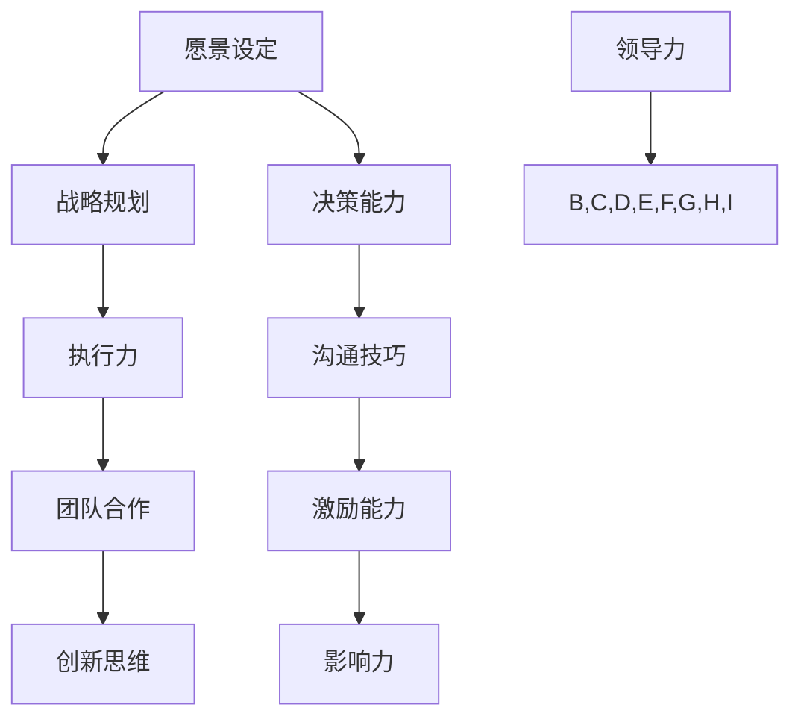

                 

### 引言与核心概念

在当今快速变化和高竞争的商业环境中，领导力与自我认知的重要性日益凸显。无论是企业家、管理者还是技术专家，了解如何发挥个人优势并有效地领导团队已成为关键技能。本篇文章旨在探讨领导力与自我认知之间的关系，以及如何通过了解并发挥个人优势来提升个人领导力和整体团队表现。

领导力是指引导和激励他人实现共同目标的能力。它不仅涉及个人魅力的展现，还包括战略思维、决策能力、沟通技巧和团队合作精神。自我认知则是指对自身性格、价值观、能力和局限性等的深入理解。它为我们提供了一个清晰的内在视角，帮助我们更好地认识自己，从而在生活和工作中做出明智的决策。

本篇文章将分以下几个部分进行详细探讨：

1. **自我认知的重要性**：介绍自我认知的概念及其对个人成长和领导力的积极影响。
2. **领导力的定义与特质**：探讨领导力的基本定义，以及成功领导者应具备的核心特质。
3. **个人优势识别与发挥**：介绍如何识别和利用个人优势，以提升领导力和工作效率。
4. **自我管理**：探讨自我管理的重要性及其在实际应用中的方法。
5. **情绪智力**：介绍情绪智力的概念，以及如何通过提高情绪智力来增强领导力。
6. **人际关系与沟通**：讨论人际关系的重要性，以及有效沟通和解决冲突的策略。
7. **成功案例研究**：分析成功领导者的案例，从中学习宝贵经验。

通过这篇文章的逐步分析推理，我们希望能帮助读者深入理解领导力与自我认知之间的关系，并提供实用的方法和策略，以在实际生活和工作中发挥个人优势，提升领导力和团队表现。

### 关键词

- 领导力
- 自我认知
- 个人优势
- 自我管理
- 情绪智力
- 人际关系
- 沟通技巧
- 成功案例研究

### 摘要

本文通过深入探讨领导力与自我认知之间的关系，强调了了解并发挥个人优势对提升领导力和团队表现的重要性。文章首先介绍了自我认知的概念和其重要性，然后详细阐述了领导力的定义和核心特质。接着，本文探讨了如何识别和利用个人优势，以及自我管理、情绪智力、人际关系和沟通技巧等方面对领导力的影响。最后，通过成功案例研究，本文提供了实用的方法和策略，帮助读者在实际生活和工作中提升个人领导力，实现个人和团队的共同成长。

### 自我认知的重要性

自我认知，这一概念源于心理学领域，是指个体对自身心理状态、行为模式、情感反应和价值观念的认知与理解。它是我们认识自我的基础，影响着我们如何与他人交往、如何处理日常生活中的挑战、如何制定目标和实现目标。

首先，自我认知对个人成长至关重要。通过深入理解自己的性格、价值观和兴趣爱好，个体可以更清晰地定位自己的优势和弱点，从而有针对性地进行自我提升。比如，一个认识到自己擅长沟通和协调的人，可能会选择从事管理工作或咨询工作，而一个意识到自己在技术领域有专长的人，可能会选择专注于技术研究和开发。这种自我认知不仅帮助个体找到适合自己的职业路径，还能增强他们在工作中的自信和满足感。

其次，自我认知对领导力的发展有着直接的积极影响。一个成功的领导者不仅需要具备出色的战略规划能力和决策能力，更需要了解自己的行为模式和沟通风格，以及它们如何影响团队。例如，一个认识到自己倾向于独断专行的领导者可能会意识到这种风格可能阻碍团队成员的积极性，从而尝试更加开放和包容的领导方式，以激发团队的创新和合作精神。

具体来说，自我认知的重要性体现在以下几个方面：

1. **自我了解**：自我认知使我们能够更好地了解自己的情感状态和行为动机。这种了解有助于我们避免在情绪驱动下做出错误的决策，同时也能更好地预测和应对潜在的心理挑战。

2. **目标设定**：通过自我认知，个体能够更准确地设定个人和职业目标。他们能够基于自己的兴趣、能力和价值观来选择适合自己的目标，从而提高实现目标的可能性和满意度。

3. **情绪调节**：自我认知有助于我们更好地理解和控制自己的情绪。当我们认识到自己何时会感到焦虑或沮丧时，我们可以采取相应的策略来调节情绪，从而提高工作和生活的质量。

4. **人际关系**：自我认知使我们能够更清晰地认识到自己在人际关系中的角色和影响。这有助于我们更好地理解和沟通他人，建立和谐的人际关系。

5. **自我提升**：自我认知让我们能够识别自己的弱点并寻求改进。通过持续的自我反思和自我提升，我们可以不断提高自己的能力和素质，以适应不断变化的环境。

总之，自我认知不仅是个体成长的基石，也是领导者提升领导力的关键。通过深入理解自我，我们能够更好地认识自己的优势和弱点，从而制定更有效的策略，实现个人和团队的共同成长。

### 领导力的定义与特质

领导力，这个看似抽象的概念，实则是一个通过激励、指导和影响他人来实现共同目标的实际能力。其定义和核心特质不仅在不同领域有着不同的表现形式，还随着时代的变化而不断演变。然而，尽管形式多样，领导力的本质却始终围绕几个核心方面：愿景设定、决策能力、沟通技巧和影响力。

首先，愿景设定是领导力的核心。一个成功的领导者需要有远大的愿景，能够清晰地描绘出团队或组织的未来发展方向。这种愿景不仅能为团队成员提供明确的方向感，还能激发他们的热情和动力。例如，史蒂夫·乔布斯通过其卓越的愿景能力，不仅将苹果公司从一家小型电脑制造商转变为全球科技巨头，还引领了整个智能手机行业的革命。

其次，决策能力是领导力的关键特质之一。领导者需要能够在压力和不确定性下做出明智的决策，这些决策不仅要考虑当前的情况，还要为未来的发展做好准备。一个优秀的领导者应该具备快速分析问题、评估风险和制定解决方案的能力。例如，在2020年疫情初期，亚马逊首席执行官杰夫·贝索斯通过迅速调整供应链策略，确保了公司的持续运营，并帮助全球消费者满足了对物资的需求。

第三，沟通技巧是领导力的另一个重要方面。一个有效的领导者需要能够清晰地表达自己的想法，同时也要善于倾听和理解团队成员的意见和需求。这种双向沟通不仅有助于建立信任，还能促进团队的协作和创新。例如，IBM的前首席执行官郭士纳在接管IBM时，通过有效的沟通技巧，成功地将公司从困境中拯救出来，使其重新成为行业的领导者。

最后，影响力是领导力的核心特质之一。领导者需要有能力影响和激励他人，使其为实现共同目标而努力。这种影响力不仅体现在言语上，还包括行为和态度。一个具有强大影响力的领导者能够通过自身的榜样作用，激励团队成员克服困难，迎接挑战。例如，埃隆·马斯克通过其独特的领导风格和强大的影响力，不仅推动了特斯拉和SpaceX的发展，还激发了整个行业的创新浪潮。

除了上述核心特质，领导力还包括其他几个关键方面：

- **战略规划**：领导者需要具备制定长期战略和规划的能力，以确保团队或组织能够持续发展。
- **激励能力**：领导者需要能够识别和满足团队成员的不同需求，从而激发他们的积极性和创造力。
- **适应能力**：在快速变化的环境中，领导者需要具备灵活应变的能力，以应对新的挑战和机遇。

总的来说，领导力是一个多维度、复杂的能力体系，其核心在于如何通过愿景设定、决策能力、沟通技巧和影响力来激励和引导他人。通过不断提升这些核心特质，领导者不仅能够实现个人和团队的共同成长，还能在激烈的市场竞争中脱颖而出。

### 领导力的核心概念与联系

为了更好地理解领导力的核心概念及其相互联系，我们可以使用Mermaid流程图来展示这些概念之间的关系。以下是一个简化的Mermaid流程图，用于描述领导力的核心要素及其相互关系：

**愿景设定（Vision）**：这是领导力的起点，领导者需要具备远见，能够设定清晰的目标和方向。愿景不仅是未来状态的一个描述，更是激励团队成员共同努力的动力源泉。

**战略规划（Strategic Planning）**：愿景的实现需要明确的战略规划。领导者需要制定具体的行动计划，确保团队朝着目标稳步前进。战略规划包括资源分配、时间表制定和风险管理等关键要素。

**决策能力（Decision Making）**：领导者必须在不确定性和压力下做出明智的决策。高效的决策能力有助于团队迅速应对挑战和抓住机遇，同时确保战略规划的顺利实施。

**执行力（Execution）**：战略和决策只有通过执行才能变为现实。执行力是领导力的关键组成部分，它要求领导者能够确保团队中的每个成员都明确任务并高效完成。

**沟通技巧（Communication）**：有效的沟通是领导力的核心。领导者需要能够清晰、准确地传达愿景和战略，同时也要倾听和理解团队成员的意见和需求。良好的沟通有助于建立信任和促进团队合作。

**团队合作（Teamwork）**：团队合作是实现共同目标的关键。领导者需要能够激发团队成员的协作精神，促进信息共享和资源整合，以实现最大的团队效能。

**激励能力（Motivation）**：领导者需要具备激发团队成员潜能的能力。通过认可和奖励团队成员的成就，领导者可以增强团队的凝聚力和战斗力。

**影响力（Influence）**：影响力是领导者通过其行为、态度和愿景来影响他人并实现目标的能力。强大的影响力有助于领导者建立个人品牌，并推动团队向更高的目标迈进。

**创新思维（Innovation）**：在快速变化的环境中，领导者需要具备创新思维，鼓励团队不断探索新的解决方案和方法，以保持竞争优势。

**领导力（Leadership）**：这些核心要素共同构成了领导力的整体框架。一个成功的领导者需要在这各个方面都有所建树，以实现个人和团队的共同成长。

通过这个流程图，我们可以清晰地看到领导力的各个核心概念是如何相互关联和相互影响的。每个要素都为其他要素提供了支持和推动力，共同构建出一个有效的领导体系。这样的体系不仅能够帮助领导者实现愿景，还能激发团队的潜力和创造力，实现长期的成功。

### 个人优势识别与发挥

在领导力的发展过程中，识别和发挥个人优势是至关重要的。个人优势不仅能够提高工作效率，还能够增强自信心和成就感。那么，如何识别和利用个人优势呢？以下是几个实用的方法和策略。

#### 1. 反思自我

反思自我是识别个人优势的第一步。通过深入思考自己在不同情境下的表现和感受，我们可以找到自己擅长的领域。例如，一个在团队项目中总是被委以重任的人，很可能在沟通、协调和解决问题方面具有优势。以下是一些反思自我的方法：

- **写日记**：每天或每周花时间记录自己的活动、感受和成就。这有助于我们回顾自己的行为模式，发现自身的优势。
- **询问他人**：向朋友、同事或导师询问他们对你的看法。他们的观点可能会提供新的视角，帮助我们更好地认识自己。
- **回顾过去**：回顾过去的工作经历，特别是那些成功或令人难忘的经历。这些经历往往能够揭示我们的优势。

#### 2. 充分利用工具

利用现有的工具和方法，可以帮助我们更系统地识别个人优势。以下是一些常用的工具：

- **职业性格测试**：例如，MBTI（迈尔斯-布里格斯性格类型指标）和DISC测评等。这些测试通过评估我们的性格特征，帮助我们了解自己在工作中的优势和短板。
- **技能评估**：通过技能评估工具，我们可以了解自己在特定领域的专业程度和潜在的发展空间。例如，技术专家可以参加编程语言的专业考试，以评估自己的技术能力。
- **360度反馈**：这是一种多角度的评估方法，通过收集来自上级、同事、下属和客户等的反馈，全面了解自己的表现和优势。

#### 3. 发挥个人优势的策略

识别出个人优势后，我们需要找到合适的方法来发挥它们。以下是一些建议：

- **定制职业路径**：根据个人优势，选择适合自己的职业路径。例如，一个擅长沟通和协调的人，可以考虑从事市场营销或人力资源管理工作。
- **专业发展**：不断投资于个人发展，提升个人优势。这包括参加培训课程、获取专业认证和参加行业研讨会等。
- **分配任务**：在工作中，主动承担那些能够发挥个人优势的任务。这不仅能提高工作效率，还能增强自信心。
- **团队合作**：在团队中，寻找互补优势的成员，形成一个高效的团队。这样，每个人都能在各自的领域发挥最大作用，实现整体团队的目标。

#### 4. 实例分析

为了更好地理解如何发挥个人优势，我们可以通过以下实例进行分析：

- **例子1：技术专家小张**  
小张是一位资深程序员，他在软件开发方面有深厚的专业知识。为了发挥个人优势，小张参与了多个技术攻关项目，并带领团队完成了多个关键技术突破。此外，他还通过参加技术研讨会和撰写技术博客，不断提升自己的专业水平，并成为团队中的技术领袖。

- **例子2：市场营销经理小王**  
小王擅长市场营销和品牌推广，他通过深入了解市场和消费者需求，成功策划了多个营销活动，提高了公司的市场份额。为了进一步发挥个人优势，小王参与了行业交流，学习了最新的市场营销趋势，并将其应用于实际工作中，使公司的市场营销策略更加有效。

通过以上实例，我们可以看到，通过识别和发挥个人优势，个人不仅能够在职业发展中取得显著成就，还能为团队和组织带来积极的影响。总之，了解并发挥个人优势是提升领导力和实现职业成功的关键。

### 自我管理的重要性

自我管理，这一概念在领导力的发展中起着至关重要的作用。它不仅关乎个人的工作效率和职业发展，更是实现长期成功的关键。自我管理包括时间管理、目标设定和情绪调节等多个方面，通过有效的自我管理，我们可以更好地应对工作与生活的挑战，保持高效和积极的心态。

首先，时间管理是自我管理的基础。在现代快节奏的工作环境中，时间管理能力直接影响到工作效率和成果。一个有效的领导者需要能够合理安排时间，确保关键任务得到优先处理，同时保持生活与工作的平衡。以下是一些时间管理的实用策略：

- **设定优先级**：通过明确任务的紧急程度和重要性，将任务分为“重要且紧急”、“重要但不紧急”、“不重要但紧急”和“不重要且不紧急”四个类别，确保优先处理重要且紧急的任务。
- **使用工具**：利用日程表、待办事项清单和时间跟踪工具，如Trello、Asana和Google日历等，帮助自己更好地规划和跟踪任务进度。
- **避免拖延**：识别并解决拖延的根源，例如缺乏明确的任务目标、对任务的不确定性或对失败的恐惧。通过设定明确的截止日期和奖励机制，提高执行力。

其次，目标设定是自我管理的另一个重要方面。一个明确的个人目标可以帮助我们保持动力和方向，实现职业和个人成长。以下是目标设定的几个关键步骤：

- **明确目标**：确保目标是具体、可衡量、可实现、相关性强且有时间限制的（SMART原则）。例如，一个明确的目标可能是“在接下来的三个月内，提高销售业绩10%”。
- **制定行动计划**：将目标分解为具体的行动步骤，并为每个步骤设定时间表和资源需求。
- **定期回顾**：定期检查目标进度，评估当前策略的有效性，并根据实际情况进行调整。

最后，情绪调节是自我管理的重要部分。情绪智力（Emotional Intelligence，简称EQ）是指个体识别、理解和管理自身情绪的能力，以及识别和影响他人情绪的能力。提高情绪智力有助于我们更好地应对压力和挑战，保持积极的心态。以下是一些提高情绪智力的策略：

- **自我反思**：定期花时间反思自己的情绪状态和行为，识别情绪的触发点和应对策略。
- **情绪记录**：通过记录情绪日记，了解自己在不同情境下的情绪反应，并寻找改善的方法。
- **学会放松**：通过冥想、深呼吸和瑜伽等放松技巧，减轻压力和焦虑，提高情绪稳定性。
- **寻求支持**：与家人、朋友或专业人士分享自己的感受，寻求建议和帮助。

总之，自我管理是领导力的重要组成部分，它帮助我们在复杂和多变的环境中保持高效和稳定。通过有效的时间管理、目标设定和情绪调节，我们可以更好地应对挑战，实现个人和职业目标，成为更加优秀的领导者。

### 情绪智力

情绪智力（Emotional Intelligence，简称EQ）是指个体识别、理解和管理自身情绪的能力，以及识别和影响他人情绪的能力。情绪智力不仅关乎个人的心理健康，还直接影响领导力、团队合作和职业成功。高情绪智力的人能够更好地处理压力、建立良好的人际关系，并在工作中表现出更高的效率。

#### 情绪智力的构成

情绪智力主要包括以下几个关键要素：

1. **自我意识（Self-awareness）**：自我意识是指个体对自己的情绪、情感和行为有清晰的认识。这包括识别自己的情绪状态、理解情绪产生的原因，以及情绪如何影响自己的思考和行为。

2. **自我调节（Self-regulation）**：自我调节是指个体能够管理和控制自己的情绪，以适应不同情境的要求。通过自我调节，个体可以在压力或挑战面前保持冷静和理性，避免情绪失控。

3. **社交意识（Social awareness）**：社交意识是指个体能够理解和识别他人的情绪、需求和感受。这种能力有助于个体在人际交往中更好地沟通和协作，建立积极的人际关系。

4. **关系管理（Relationship management）**：关系管理是指个体能够建立和维护健康的人际关系，以及有效地处理冲突和矛盾。这包括领导力、团队合作和协商能力。

#### 提高情绪智力的方法

要提高情绪智力，可以采取以下几种方法：

1. **自我反思**：定期花时间进行自我反思，了解自己的情绪状态和行为模式。通过记录情绪日记，可以帮助我们更好地识别和理解自己的情绪。

2. **情绪记录**：通过情绪记录，将日常生活中的情绪体验记录下来。这种方法有助于我们了解情绪的触发点和应对策略。

3. **冥想和放松技巧**：冥想和深呼吸等放松技巧可以帮助我们减轻压力和焦虑，提高情绪稳定性。

4. **沟通技巧培训**：通过学习有效的沟通技巧，如倾听、非暴力沟通和反馈技巧，可以提高社交意识，增强人际关系。

5. **情感教育**：参加情感教育课程或阅读相关书籍，可以加深对情绪智力理论的理解，并获得实用的技巧。

#### 情绪智力对领导力的影响

情绪智力对领导力有着深远的影响。高情绪智力领导者能够：

- **建立信任**：通过真诚和开放的沟通，领导者能够建立与团队成员的信任关系。
- **激励团队**：领导者能够识别和满足团队成员的情感需求，从而激发他们的积极性和创造力。
- **处理冲突**：高情绪智力领导者能够有效地识别和解决团队中的冲突，维护团队的和谐与稳定。
- **适应变化**：在快速变化的环境中，领导者能够更好地管理自己的情绪，保持冷静和理性，引导团队应对挑战。

总之，情绪智力是领导力的重要组成部分。通过提高情绪智力，领导者不仅能够更好地管理自己和团队，还能在复杂和多变的环境中取得成功。因此，培养和提高情绪智力应成为领导者持续发展的关键策略。

### 人际关系与沟通

在领导力的发展过程中，人际关系和沟通技巧起着至关重要的作用。有效的人际关系和沟通不仅有助于建立信任和协作，还能提升团队的凝聚力和工作效率。那么，如何建立良好的人际关系和沟通技巧呢？以下是一些建议和策略。

#### 建立良好的人际关系

1. **倾听与理解**：倾听是建立良好人际关系的基础。在沟通中，领导者应给予他人充分的注意，认真聆听他们的意见和需求，并通过非语言信号（如点头、目光接触）表明自己的关注。理解他人的观点和情感，能够帮助我们更好地建立互信。

2. **诚信与真诚**：诚信是建立长期人际关系的基石。领导者应保持言行一致，对待团队成员真诚，不隐藏信息或误导他人。真诚的态度能够赢得他人的尊重和信任。

3. **尊重多样性**：在多元化的团队中，领导者应尊重团队成员的文化背景、价值观和观点。通过接纳和尊重多样性，我们可以促进团队合作，减少冲突。

4. **主动沟通**：领导者应主动与团队成员沟通，及时分享信息、反馈和建议。主动沟通能够增强团队成员之间的透明度，提高信息传递的效率。

5. **建立联系**：通过非正式的社交活动，如团队聚餐、运动比赛或团建活动，领导者可以与团队成员建立更深厚的联系。这些活动有助于团队成员之间建立友谊，增强团队凝聚力。

#### 提高沟通技巧

1. **清晰表达**：领导者应确保自己的表达清晰、简洁，避免使用模糊或含糊的语言。通过使用具体的例子和比喻，可以帮助团队成员更好地理解我们的意图。

2. **非暴力沟通**：非暴力沟通（Nonviolent Communication）是一种有效的沟通方法，它强调通过倾听和理解他人的感受和需求来进行沟通。这种方法有助于减少冲突，建立和谐的团队关系。

3. **有效反馈**：给予团队成员有效的反馈是领导者的职责。反馈应具体、建设性和及时。通过肯定团队成员的优点和努力，同时指出改进的方向，可以激励他们不断进步。

4. **主动倾听**：倾听不仅仅是听到他人的话，还要理解他们的情感和需求。主动倾听可以通过复述对方的话、提出问题和表达同情等方式来实现。

5. **解决冲突**：在沟通中，冲突是不可避免的。领导者应学会如何有效地解决冲突。通过冷静、客观地分析问题，寻找共同点和解决方案，可以有效化解冲突。

#### 实例分析

为了更好地理解人际关系与沟通技巧在领导力中的应用，我们可以通过以下实例进行分析：

- **例子1：项目经理小李**  
小李是一位有经验的项目经理，他非常重视团队关系和沟通。他定期与团队成员进行一对一的沟通，了解他们的工作情况和需求。通过倾听和理解，小李能够及时解决团队成员的问题，增强团队的凝聚力。此外，他还采用非暴力沟通技巧，确保团队成员之间的沟通顺畅，减少误解和冲突。

- **例子2：销售总监小张**  
小张负责公司的销售团队，他深知良好的人际关系和沟通技巧对于销售业绩的重要性。他经常与客户沟通，了解他们的需求和痛点，并提供个性化的解决方案。通过真诚和诚信的沟通，小张赢得了客户的信任，大幅提升了销售业绩。同时，他也注重团队内部沟通，通过定期的销售会议和培训，确保团队成员掌握最新的销售策略和技巧。

通过以上实例，我们可以看到，建立良好的人际关系和沟通技巧对于领导力的成功至关重要。通过倾听、诚信、尊重和有效的沟通，领导者可以建立强大的团队，实现更高的工作效率和业绩。总之，人际关系与沟通技巧是领导者不可或缺的能力，通过不断学习和实践，我们可以不断提升自己的领导力。

### 成功案例研究

在探讨领导力与自我认知的过程中，分析成功领导者的案例可以为我们提供宝贵的见解和经验。以下将介绍几位著名领导者的成功经验，并探讨他们在自我认知和个人优势发挥方面的做法。

#### 1. 史蒂夫·乔布斯（Steve Jobs）

作为苹果公司的创始人之一，史蒂夫·乔布斯以其卓越的领导力和创新精神，带领苹果公司在多个领域取得了突破。乔布斯的成功很大程度上归功于他对自身优势的深刻认识和有效利用。

**自我认知：**乔布斯在年轻时就明确了自己的兴趣和优势，即对设计美学和技术创新的热情。他清楚地知道自己擅长什么，不擅长什么，并且专注于自己最擅长的事情。

**个人优势发挥：**乔布斯通过将设计美学和技术创新相结合，推动了苹果产品的革命性变革。他不仅仅是一个技术专家，更是一个具有强大视觉感知力和设计理念的人。他在产品设计和用户体验方面发挥了自己的优势，使苹果产品成为市场标杆。

**成功经验：**乔布斯的成功经验告诉我们，领导者应明确自己的优势，并集中精力在最能发挥这些优势的领域。通过不断探索和创新，我们可以实现卓越的成果。

#### 2. 马云（Jack Ma）

作为中国电子商务巨头阿里巴巴的创始人，马云通过其独特的领导风格和远见卓识，将阿里巴巴打造成全球知名企业。马云的成功同样离不开对自我认知和个人优势的深刻理解。

**自我认知：**马云在年轻时经历了多次失败，但正是这些失败让他更加了解自己的优势和劣势。他认识到自己在沟通和激励团队方面有天赋，而技术知识并不是他的强项。

**个人优势发挥：**马云擅长沟通和激励，他能够通过演讲和激励演讲，激发员工的热情和创造力。他利用自己的优势，建立了强大的企业文化，推动了公司的快速发展。

**成功经验：**马云的成功表明，领导者应善于利用自己的优势，并在不擅长的领域寻求合作。通过构建强大的团队和文化，我们可以克服个人局限，实现更大的成功。

#### 3. 埃隆·马斯克（Elon Musk）

作为特斯拉（Tesla）和SpaceX的创始人，埃隆·马斯克以其远大的愿景和强大的执行力，成为了全球科技界的领军人物。他的成功得益于对自我认知和个人优势的深入理解和有效利用。

**自我认知：**马斯克认识到自己在创新和执行方面有强大的能力，他清楚自己的愿景和目标，并致力于实现这些目标。他也能够识别和利用团队中的其他人才，形成强大的执行力。

**个人优势发挥：**马斯克在技术创新、市场策略和执行方面发挥了自己的优势。他通过不断地试验和迭代，推动技术创新，并在市场中占据领先地位。同时，他通过激励和领导团队，确保了执行力的实现。

**成功经验：**马斯克的成功经验告诉我们，领导者应明确自己的愿景和目标，并致力于实现这些目标。通过发挥个人优势，并与团队合作，我们可以克服挑战，实现巨大的突破。

#### 总结

通过分析这些成功领导者的案例，我们可以得出几个关键结论：

1. **自我认知的重要性**：成功领导者清楚地了解自己的优势、劣势和价值观，这有助于他们在职业发展中做出明智的决策。
2. **发挥个人优势**：领导者应专注于自己的优势，并在这些领域寻求卓越。通过发挥个人优势，我们可以实现卓越的成果。
3. **团队合作**：领导者应善于构建和领导团队，发挥团队成员的优势，共同实现目标。

总之，通过深入了解和发挥个人优势，我们可以成为更有效的领导者，推动个人和团队的共同成长。

### 领导力实践

领导力的实践不仅需要理论知识的指导，更需要实际操作中的锤炼。以下将介绍几个实用的领导力训练方法、实践案例以及如何持续提升领导力的策略。

#### 1. 领导力训练方法

（1）**角色扮演**：通过模拟真实工作场景，让领导者扮演不同的角色，体验不同领导风格的影响。这种方法有助于领导者了解不同情境下的应对策略，增强情境适应性。

**示例**：在一个角色扮演训练中，领导者可以扮演一个需要处理团队内部冲突的角色，通过模拟对话和解决策略，学习如何有效化解冲突。

（2）**团队建设活动**：通过组织团队建设活动，如拓展训练、户外运动和团队协作游戏，增强团队成员之间的信任和协作精神。

**示例**：在一次团队拓展训练中，领导者可以带领团队完成攀岩、绳索挑战等任务，通过克服困难，提升团队凝聚力和合作能力。

（3）**情景模拟**：设计模拟工作场景，让领导者面对具体的领导挑战，如项目延误、员工不满等。这种方法有助于领导者锻炼解决问题的能力。

**示例**：在一个情景模拟训练中，领导者可以模拟一个项目出现重大问题，要求他们制定应急方案，并协调团队资源解决问题。

（4）**反馈与反思**：定期收集团队成员的反馈，并进行反思和总结。这种方法有助于领导者了解自己在团队中的表现，识别需要改进的领域。

**示例**：定期举行团队会议，让团队成员分享对领导者的意见和建议，领导者根据反馈进行改进。

#### 2. 实践案例分享

（1）**案例1：华为的“干部轮岗制”**：华为通过干部轮岗制度，让领导者在不同部门和岗位间进行轮岗，增强他们的跨部门协作能力和应对复杂问题的能力。

**效果**：这种轮岗制度使得领导者能够更全面地了解公司的运营模式，提升了他们的综合能力和领导力。

（2）**案例2：谷歌的“20%时间项目”**：谷歌允许员工用20%的工作时间自由探索和创新项目。这种方法激发了员工的创造力和主动性，许多成功的产品（如Gmail）都源于这一政策。

**效果**：这种自由探索的环境不仅提升了员工的工作满意度，还促进了公司内部的创新文化，提高了公司的竞争力。

#### 3. 持续提升领导力的策略

（1）**持续学习**：领导者应保持持续学习的态度，通过阅读、培训课程和研讨会，不断提升自己的知识和技能。

**示例**：参加行业领先的领导力研讨会，阅读相关书籍和学术论文，参加在线课程，如Coursera或edX上的领导力课程。

（2）**定期自我评估**：领导者应定期进行自我评估，反思自己的领导风格和效果，制定改进计划。

**示例**：使用领导力评估工具，如360度反馈，识别自己的优势和需要改进的领域，并制定个人发展计划。

（3）**建立支持网络**：建立和维持一个由导师、同事和专家组成的支持网络，通过他们的经验和建议来提升自己的领导力。

**示例**：加入领导力俱乐部或专业组织，参加行业会议和交流活动，与同行建立联系和分享经验。

（4）**实践与反思**：将学到的领导力知识和技能应用到实际工作中，通过实践和反思，不断改进和提升自己的领导力。

**示例**：在实际项目中应用所学的领导力技巧，如沟通技巧、决策能力等，并在项目结束后进行反思和总结。

通过以上方法、案例和策略，领导者可以在实践中不断提升自己的领导力，实现个人和团队的共同成长。

### 个人成长计划

制定一个有效的个人成长计划是提升领导力和实现职业目标的关键步骤。以下是如何制定、实施和调整个人成长计划的详细步骤：

#### 1. 制定个人成长计划

（1）**明确目标**：首先，我们需要设定清晰、具体的目标。这些目标应遵循SMART原则，即具体（Specific）、可衡量（Measurable）、可达成（Achievable）、相关性强（Relevant）和有时间限制（Time-bound）。例如，“在未来六个月内，提升项目管理技能，通过PMP认证”。

（2）**评估当前状态**：了解自己的优势和不足，这可以通过自我评估、职业性格测试或360度反馈来实现。例如，如果发现自己沟通技巧不足，那么就可以将提高沟通能力列为成长目标。

（3）**制定行动计划**：将目标分解为具体的行动步骤，并为每个步骤设定时间表和资源需求。例如，为了提升沟通能力，可以安排每周参加一次沟通技巧培训课程，或者每天练习有效的沟通技巧。

（4）**设定里程碑**：设定一系列的里程碑，以衡量成长计划的进度。例如，每三个月进行一次自我评估，检查目标的实现情况，并根据需要调整计划。

#### 2. 实施个人成长计划

（1）**坚持执行**：严格按照行动计划执行，避免拖延。例如，如果计划每天阅读30分钟的专业书籍，那么就要每天预留时间并坚持阅读。

（2）**寻求反馈**：定期与导师、同事或领导沟通，了解自己的成长进度和效果。他们的反馈可以帮助我们识别优势和需要改进的领域。

（3）**调整策略**：根据反馈和实际情况，及时调整成长计划。例如，如果发现某一目标过于困难，可以尝试降低目标难度，或者重新设定时间表。

#### 3. 调整与优化个人成长计划

（1）**定期评估**：每隔一段时间，对个人成长计划进行评估，检查目标的实现情况。这可以帮助我们了解自己的进步，同时识别需要改进的领域。

（2）**适应性调整**：根据新的目标和情况，对计划进行调整。例如，如果公司业务方向发生重大变化，我们需要重新设定职业目标，并相应调整成长计划。

（3）**保持灵活性**：成长计划不是一成不变的，我们需要保持灵活性，根据环境变化和个人需求进行调整。例如，如果遇到紧急情况，我们可以暂时调整计划，优先处理重要任务。

（4）**持续反馈**：通过持续反馈和调整，我们可以不断提升个人成长计划的效率，确保目标的实现。

通过以上步骤，我们可以制定、实施和调整一个有效的个人成长计划，不断提升自己的领导力和职业能力。

### 总结与展望

通过本文的探讨，我们深入理解了领导力与自我认知之间的关系，并探讨了如何通过了解并发挥个人优势来提升领导力和团队表现。以下是文章内容的回顾和总结：

首先，我们明确了自我认知的重要性。自我认知不仅是个人成长的基石，也是领导力的核心组成部分。通过自我反思和工具辅助，我们可以更好地了解自己的性格、价值观和优势，从而在生活和工作中做出更加明智的决策。

接着，我们详细阐述了领导力的定义与特质，包括愿景设定、决策能力、沟通技巧和影响力等关键方面。通过这些特质，领导者能够引导和激励团队成员，实现共同目标。

我们进一步探讨了如何识别和发挥个人优势。通过反思自我、利用工具和制定策略，领导者可以充分发挥个人优势，提高工作效率和团队效能。

自我管理和情绪智力也是领导力的重要组成部分。通过有效的时间管理、目标设定和情绪调节，领导者能够保持高效和积极的心态，应对工作与生活的挑战。

在人际关系与沟通方面，我们提出了一系列策略，如倾听、诚信、尊重和有效沟通，帮助领导者建立良好的人际关系，提升团队凝聚力。

通过成功案例研究，我们分析了领导者在自我认知和个人优势发挥方面的成功经验，强调了这些因素在领导力发展中的重要性。

最后，我们介绍了如何制定、实施和调整个人成长计划，以及通过持续学习和反馈来不断提升领导力和职业能力。

展望未来，领导力的发展将继续受到技术变革、社会多样性和全球化趋势的深刻影响。领导者需要不断适应这些变化，保持创新和灵活性。此外，随着人工智能和自动化技术的发展，领导者需要在技术和人文之间找到平衡，培养全面的领导能力。

总之，通过本文的探讨，我们不仅深入理解了领导力与自我认知的核心概念，还获得了实用的方法和策略，以在实际生活和工作中提升个人领导力，实现个人和团队的共同成长。未来，领导者需要不断学习和适应，以应对不断变化的环境和挑战。

