                 

### 背景介绍

在当今快速变革的社会和技术环境中，领导力的作用变得愈发重要。无论是在企业组织、政府机构，还是非营利组织，领导力都是推动变革、实现目标、提升团队凝聚力和促进创新的关键因素。然而，领导力并不是一种与生俱来的能力，它需要通过系统的学习和实践来培养和发展。

《领导力思维：改变命运的领导力修炼秘籍》旨在为读者提供一套全面、系统的领导力培养方法，帮助他们在不同的环境中发挥领导力，实现个人和团队的成长与成功。本书将围绕领导力的基本概念、思维模式、实践应用、修炼技巧以及特殊场景下的策略等方面进行深入探讨，力求为读者呈现一幅全方位的领导力修炼图谱。

为了确保内容的逻辑性和实用性，本书采用了逐步推理的方式（Reasoning Step by Step），从基础概念出发，逐步深入到具体的实践策略，使读者能够循序渐进地理解和掌握领导力的核心要义。本文将首先介绍领导力的基本概念和原理，帮助读者建立起对领导力的初步认识，为后续章节的深入探讨奠定基础。

### 领导力的基本概念和原理

#### 领导力的定义

领导力是一种复杂的能力和过程，它涉及到激励、影响、指导和组织他人的能力，以实现特定的目标或愿景。领导力不仅仅是一种职位或角色的特权，更是一种可以培养和发展的能力。简而言之，领导力是关于如何影响和引导他人，共同实现共同的目标。

领导力与影响力、管理、权威等概念有所重叠，但它们之间也存在着明显的区别。影响力是指通过非正式的、个人的方式影响他人的能力，而领导力则更侧重于正式的、组织层面的影响。管理通常涉及到组织资源、制定计划和监控执行，而领导力则强调激励、愿景和价值观的传递。

为了更好地理解领导力，我们可以借助Mermaid流程图来展示其核心概念与联系：

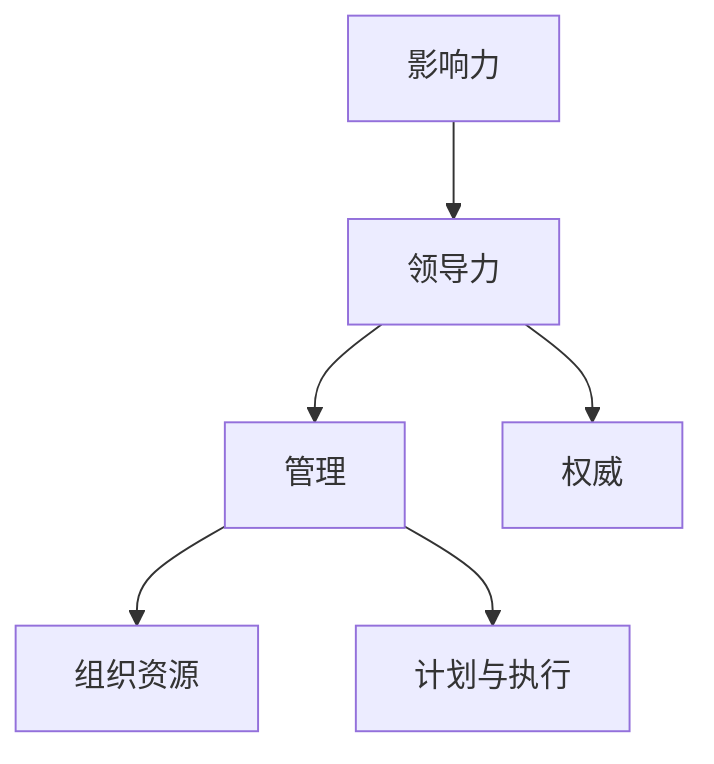

在这个流程图中，我们可以看到领导力与其他概念的关系。领导力不仅包含了影响力，还包括了管理和权威的元素，同时它还涉及组织资源的管理和计划的执行。

#### 领导力的演变历程

领导力的概念和实践经历了长期的演变。在传统领导力中，领导通常被视为一种权威和权力的象征，领导者通过命令和控制来确保组织的稳定和效率。这种领导风格通常被称为“交易型领导力”，它依赖于明确的规则和制度来维持秩序。

随着时间的推移，领导力理念逐渐从传统走向现代。现代领导力强调与团队成员的互动和合作，注重个人发展和自我实现。变革型领导力、服务型领导力等新概念逐渐兴起，强调领导者不仅要具备技术和策略，还需要拥有高尚的品德和愿景。

现代领导力的演变过程可以借助以下Mermaid流程图来展示：

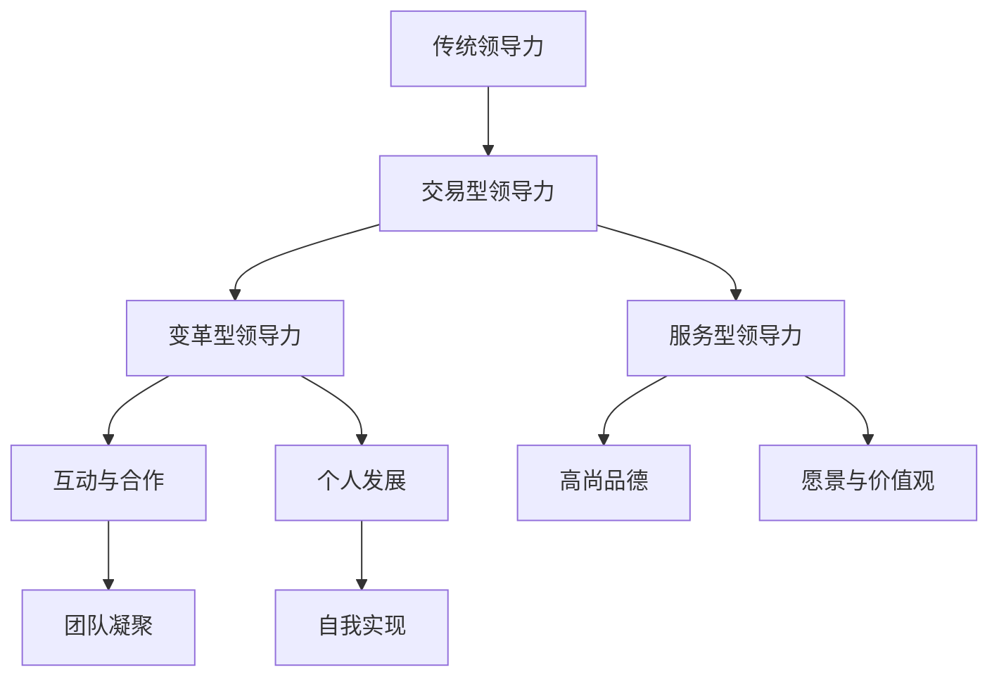

在这个流程图中，我们可以看到从传统领导力到现代领导力的演变路径。每一个阶段的领导力都强调了不同的核心要素，反映了社会和组织的进步。

#### 领导力的类型与特点

领导力有多种类型，每种类型都有其独特的特点和适用场景。以下是几种常见的领导力类型及其特点：

1. **变革型领导力**

   变革型领导力强调创新和变革，领导者通过激发团队成员的潜力，推动组织实现重大变革。这种领导力通常在组织面临重大挑战或需要创新时发挥作用。

   - **特点**：鼓励创新、激发潜力、推动变革
   - **适用场景**：组织变革、技术创新、市场开拓

2. **服务型领导力**

   服务型领导力强调领导者要关注团队成员的需求，并提供支持。这种领导风格有助于建立信任和团队合作，提高组织的整体效能。

   - **特点**：关注需求、提供支持、建立信任
   - **适用场景**：团队建设、人才培养、组织文化塑造

3. **授权型领导力**

   授权型领导力强调领导者要赋予团队成员自主权和责任感，鼓励他们发挥创造力。这种领导力有助于培养团队成员的独立性和创新精神。

   - **特点**：赋予自主权、鼓励创新、培养责任感
   - **适用场景**：项目管理、创新实践、团队管理

4. **指挥型领导力**

   指挥型领导力强调领导者通过明确的指令和严格的控制来确保任务的完成。这种领导力通常在紧急情况或需要高效执行时使用。

   - **特点**：明确指令、严格控制、高效执行
   - **适用场景**：紧急任务、危机管理、项目执行

通过了解不同类型的领导力，我们可以根据实际情况选择最合适的领导风格，以达到最佳的管理效果。以下是各种领导力的特点及其适用场景的Mermaid流程图：

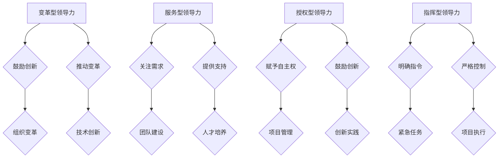

在这个流程图中，每种领导力类型的特点和适用场景被清晰地展示出来，有助于读者在实际应用中选择合适的领导风格。

#### 领导力与组织发展的关系

领导力在组织发展中起着至关重要的作用。优秀的领导力能够推动组织实现长期目标和战略规划，提升组织的整体绩效和竞争力。

首先，领导力对组织绩效有着直接影响。通过有效的领导，领导者可以激发团队成员的潜力，提高团队的工作效率和创新能力，从而实现更高的组织绩效。

其次，领导力对组织文化有着深远的影响。领导者通过自己的行为和价值观来塑造组织文化，影响团队成员的态度和行为。一个积极向上的组织文化能够增强团队的凝聚力，促进成员之间的合作与信任。

最后，领导力还影响着组织的创新能力和文化。领导者需要具备前瞻性的思维和创新精神，能够推动组织在技术和商业模式上不断创新，以适应快速变化的市场环境。

以下是一个Mermaid流程图，展示了领导力与组织绩效、文化、创新之间的关系：

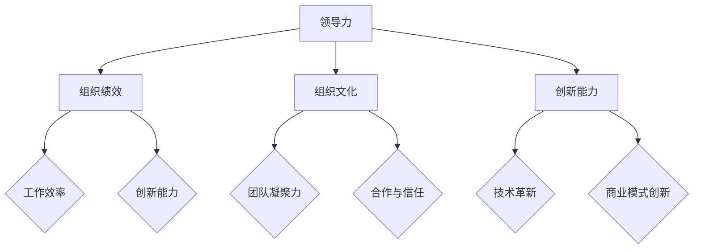

在这个流程图中，我们可以看到领导力如何通过不同的路径影响组织的发展，从而实现长期的战略目标。

### 总结

领导力是一种复杂的、多维度的能力，它不仅包括影响力的传递，还涉及到组织管理、团队建设和战略规划等多个方面。通过理解领导力的基本概念、演变历程和不同类型，我们可以更好地应用领导力，实现个人和团队的成长与成功。

在接下来的章节中，我们将进一步探讨领导力的思维模式、实践应用和修炼技巧，帮助读者在理论和实践中不断提升自己的领导力水平。敬请期待。

## 文章关键词

领导力、变革型领导力、服务型领导力、授权型领导力、指挥型领导力、组织绩效、组织文化、创新能力、思维模式、实践应用、修炼技巧。

### 文章摘要

《领导力思维：改变命运的领导力修炼秘籍》旨在为读者提供一套全面、系统的领导力培养方法。本书首先介绍了领导力的基本概念和原理，帮助读者理解领导力的本质和演变历程。接着，书中探讨了领导力的多种类型及其特点，使读者能够根据实际情况选择最合适的领导风格。文章通过具体的思维模式和方法，如系统思维、人本思维、创新思维和情境思维，阐述了领导力的核心要素。此外，书中还深入分析了领导力在组织管理、个人成长和特殊场景中的应用，提供了实用的技巧和策略。最后，文章总结了领导力对组织绩效、文化和创新的重要影响，并展望了领导力思维的拓展与前瞻。通过本书，读者将能够系统地掌握领导力的核心要义，提升自己的领导力水平，实现个人和团队的成长与成功。

----------------------------------------------------------------

### 第一部分：领导力的基本概念和原理

#### 第1章：领导力的定义与重要性

##### 1.1 领导力的定义

领导力是一种复杂的能力和过程，它涉及到激励、影响、指导和组织他人的能力，以实现特定的目标或愿景。领导力不仅仅是职位或角色的特权，更是一种可以通过学习和实践来培养和发展的能力。在组织中，领导力起着至关重要的作用，它不仅能够推动组织的发展，还能够影响团队成员的行为和态度，从而实现更高的组织绩效和团队凝聚力。

首先，我们需要明确领导力与影响力、管理、权威等概念之间的区别与联系。影响力是指通过非正式的、个人的方式影响他人的能力，而领导力则更侧重于正式的、组织层面的影响。管理通常涉及到组织资源、制定计划和监控执行，而领导力则强调激励、愿景和价值观的传递。权威则是领导力的一个重要组成部分，它赋予领导者合法的权力和地位，但领导力并不仅仅依赖于权威。

为了更好地理解这些概念之间的关系，我们可以借助Mermaid流程图来展示它们的核心概念与联系：


在这个流程图中，我们可以看到领导力与其他概念的关系。领导力不仅包含了影响力，还包括了管理和权威的元素，同时它还涉及组织资源的管理和计划的执行。

##### 1.2 领导力的演变历程

领导力的概念和实践经历了长期的演变。在传统领导力中，领导通常被视为一种权威和权力的象征，领导者通过命令和控制来确保组织的稳定和效率。这种领导风格通常被称为“交易型领导力”，它依赖于明确的规则和制度来维持秩序。

随着时间的推移，领导力理念逐渐从传统走向现代。现代领导力强调与团队成员的互动和合作，注重个人发展和自我实现。变革型领导力、服务型领导力等新概念逐渐兴起，强调领导者不仅要具备技术和策略，还需要拥有高尚的品德和愿景。

现代领导力的演变过程可以借助以下Mermaid流程图来展示：


在这个流程图中，我们可以看到从传统领导力到现代领导力的演变路径。每一个阶段的领导力都强调了不同的核心要素，反映了社会和组织的进步。

在现代领导力中，变革型领导力和服务型领导力尤为突出。变革型领导力强调领导者要具备前瞻性和创新精神，能够激发团队成员的潜力，推动组织实现重大变革。服务型领导力则强调领导者要关注团队成员的需求，并提供支持，以建立信任和团队合作。

为了更深入地理解这些领导力类型，我们可以借助伪代码来阐述它们的核心特征：

```python
# 变革型领导力
def transformational_leadership():
    # 激发团队潜力
    inspire_team_potential()
    # 推动创新
    drive_innovation()
    # 实现组织变革
    achieve_organizational_transformation()

# 服务型领导力
def servant_leadership():
    # 关注团队成员需求
    care_for_team_needs()
    # 提供支持
    provide_support()
    # 建立信任
    build_trust()
```

通过这个伪代码，我们可以看到变革型领导力和服务型领导力的核心方法。变革型领导力注重激发团队潜力、推动创新和实现组织变革，而服务型领导力则注重关注团队成员需求、提供支持和建立信任。

##### 1.3 领导力的类型与特点

领导力有多种类型，每种类型都有其独特的特点和适用场景。以下是几种常见的领导力类型及其特点：

1. **变革型领导力**

   变革型领导力强调创新和变革，领导者通过激发团队成员的潜力，推动组织实现重大变革。这种领导力通常在组织面临重大挑战或需要创新时发挥作用。

   - **特点**：鼓励创新、激发潜力、推动变革
   - **适用场景**：组织变革、技术创新、市场开拓

2. **服务型领导力**

   服务型领导力强调领导者要关注团队成员的需求，并提供支持。这种领导风格有助于建立信任和团队合作，提高组织的整体效能。

   - **特点**：关注需求、提供支持、建立信任
   - **适用场景**：团队建设、人才培养、组织文化塑造

3. **授权型领导力**

   授权型领导力强调领导者要赋予团队成员自主权和责任感，鼓励他们发挥创造力。这种领导力有助于培养团队成员的独立性和创新精神。

   - **特点**：赋予自主权、鼓励创新、培养责任感
   - **适用场景**：项目管理、创新实践、团队管理

4. **指挥型领导力**

   指挥型领导力强调领导者通过明确的指令和严格的控制来确保任务的完成。这种领导力通常在紧急情况或需要高效执行时使用。

   - **特点**：明确指令、严格控制、高效执行
   - **适用场景**：紧急任务、危机管理、项目执行

每种领导力类型都有其独特的优势和适用场景。在实际应用中，领导者需要根据具体情况选择合适的领导风格，以实现最佳的管理效果。以下是一个Mermaid流程图，展示了不同领导力类型的特点及其适用场景：


在这个流程图中，每种领导力类型的特点和适用场景被清晰地展示出来，有助于读者在实际应用中选择合适的领导风格。

##### 1.4 领导力与组织发展的关系

领导力在组织发展中起着至关重要的作用。优秀的领导力能够推动组织实现长期目标和战略规划，提升组织的整体绩效和竞争力。

首先，领导力对组织绩效有着直接影响。通过有效的领导，领导者可以激发团队成员的潜力，提高团队的工作效率和创新能力，从而实现更高的组织绩效。以下是一个简单的数学模型，用来描述领导力对组织绩效的影响：

$$
绩效 = f(领导力, 团队成员潜力, 工作环境)
$$

其中，领导力是影响绩效的关键因素之一。通过改进领导力，可以显著提高组织的整体绩效。

其次，领导力对组织文化有着深远的影响。领导者通过自己的行为和价值观来塑造组织文化，影响团队成员的态度和行为。一个积极向上的组织文化能够增强团队的凝聚力，促进成员之间的合作与信任。以下是一个简化的模型，用来描述领导力对组织文化的影响：

$$
组织文化 = 领导者行为 \times 团队成员反馈
$$

在这个模型中，领导者的行为和团队成员的反馈是影响组织文化的两个主要因素。优秀的领导者能够通过正面的行为和有效的沟通，建立积极向上的组织文化。

最后，领导力还影响着组织的创新能力。领导者需要具备前瞻性的思维和创新精神，能够推动组织在技术和商业模式上不断创新，以适应快速变化的市场环境。以下是一个简化的模型，用来描述领导力对组织创新能力的影响：

$$
创新能力 = 领导者创新精神 \times 团队成员创新潜力
$$

在这个模型中，领导者的创新精神和团队成员的创新潜力是影响组织创新能力的两个主要因素。通过培养和激发团队成员的创新潜力，领导者可以推动组织的创新能力。

为了更好地理解这些关系，我们可以借助以下Mermaid流程图来展示领导力与组织绩效、文化、创新之间的关系：


在这个流程图中，我们可以看到领导力如何通过不同的路径影响组织的发展，从而实现长期的战略目标。

### 总结

通过本章的讨论，我们了解了领导力的基本概念和原理，包括领导力的定义、演变历程、类型与特点，以及领导力与组织发展的关系。领导力不仅是一种影响和激励他人的能力，更是一种可以通过学习和实践来培养和发展的能力。在组织管理中，领导力起着至关重要的作用，它能够推动组织实现长期目标和战略规划，提升组织的整体绩效和竞争力。

在接下来的章节中，我们将进一步探讨领导力的思维模式和方法，帮助读者在理论和实践中不断提升自己的领导力水平。敬请期待。

----------------------------------------------------------------

### 第二部分：领导力的思维模式和方法

#### 第2章：领导力思维的基础

领导力的核心在于思维。有效的领导力思维不仅能够帮助领导者更好地理解自己和他人，还能够提升决策质量和领导效能。在这一章中，我们将探讨几种关键的领导力思维模式，包括系统思维、人本思维、创新思维和情境思维。这些思维模式为领导者提供了全面的视角，以应对复杂多变的组织环境。

##### 2.1 系统思维

系统思维是领导者理解和分析复杂问题的重要工具。它强调将组织视为一个相互关联的动态系统，而不仅仅是各个独立部分的简单叠加。系统思维关注系统的整体行为，以及组成部分之间的相互作用和反馈机制。

**核心概念与联系**：

- **整体性**：系统思维认为，整体大于部分之和。领导者需要从整体的角度出发，理解各个部分之间的关系和影响。
- **反馈机制**：系统思维关注系统内部的各种反馈机制，如正反馈和负反馈，这些机制会影响系统的稳定性和发展。

为了更直观地展示系统思维的核心概念，我们可以使用Mermaid流程图来表示系统中的关键要素和关系：

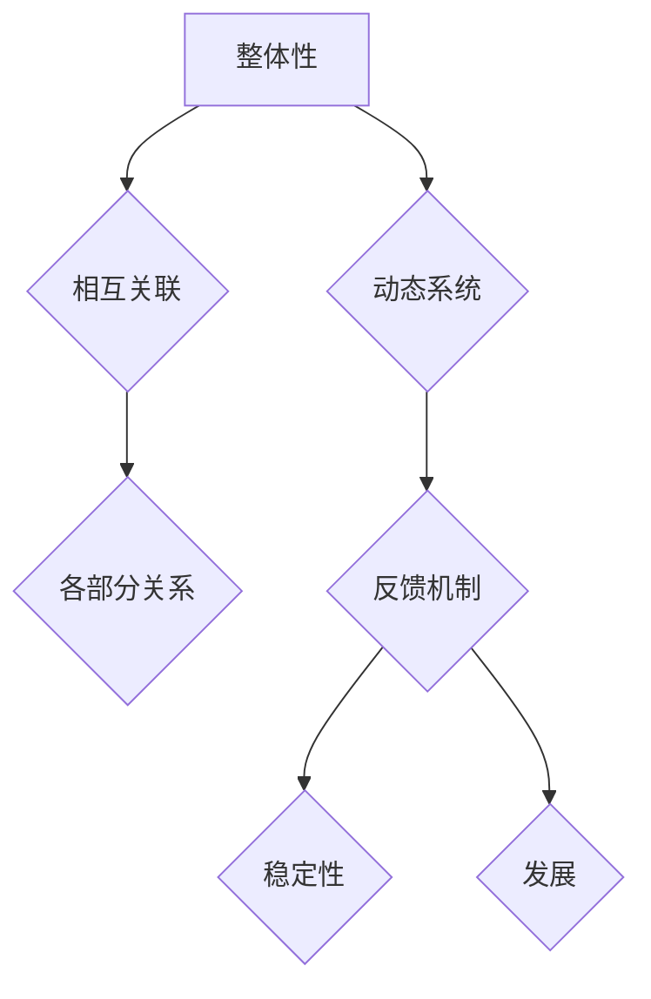

**核心算法原理讲解**：

在系统思维中，一个关键的算法原理是“系统分析”。该算法包括以下步骤：

1. **识别系统组成部分**：明确系统的各个组成部分及其相互关系。
2. **分析反馈机制**：识别系统中存在的正反馈和负反馈机制。
3. **模拟系统行为**：通过模型或模拟来预测系统的行为和变化。
4. **调整策略**：基于系统分析的结果，调整组织策略以应对潜在的问题。

以下是一个简化的伪代码，描述系统分析的过程：

```python
def system_analysis(components, feedback_loops):
    # 识别系统组成部分
    identify_components(components)
    # 分析反馈机制
    analyze_feedback_loops(feedback_loops)
    # 模拟系统行为
    simulate_system_behavior(components, feedback_loops)
    # 调整策略
    adjust_strategy_based_on_simulation()
```

通过系统思维，领导者能够更全面地理解组织的复杂性和动态性，从而做出更明智的决策。

##### 2.2 人本思维

人本思维强调领导者应以人为中心，关注团队成员的需求、情感和成长。这种思维方式认为，团队成员是组织最宝贵的资源，他们的满意度和参与度对组织的成功至关重要。

**核心概念与联系**：

- **以人为本**：人本思维强调领导者应关注团队成员的需求和福祉，创造一个积极的工作环境。
- **情感管理**：领导者需要具备情感管理能力，能够识别和应对团队成员的情感变化，提高团队的凝聚力。

为了更直观地展示人本思维的核心概念，我们可以使用以下Mermaid流程图：

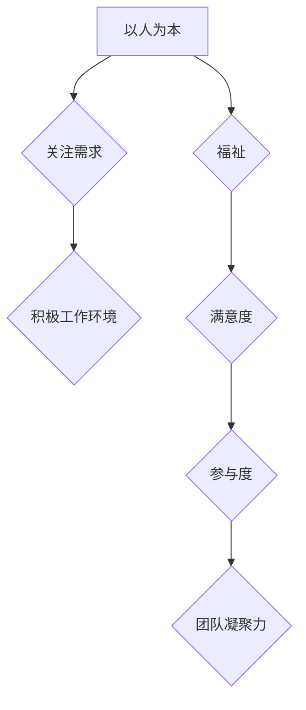

**核心算法原理讲解**：

在领导力中，一个关键的人本思维算法原理是“员工满意度分析”。该算法包括以下步骤：

1. **收集员工反馈**：通过调查、面谈等方式收集员工的意见和建议。
2. **分析反馈数据**：对收集到的反馈进行定量和定性分析，识别问题和工作改进点。
3. **制定改进措施**：根据分析结果，制定具体的改进措施，提高员工的满意度和参与度。
4. **实施与监控**：实施改进措施，并持续监控其效果，确保持续改进。

以下是一个简化的伪代码，描述员工满意度分析的过程：

```python
def employee_satisfaction_analysis(feedback):
    # 收集员工反馈
    collect_employee_feedback(feedback)
    # 分析反馈数据
    analyze_feedback_data(feedback)
    # 制定改进措施
    create_improvement_actions()
    # 实施与监控
    implement_and_monitor_actions()
```

通过人本思维，领导者能够更好地理解和满足团队成员的需求，从而提升团队的士气和绩效。

##### 2.3 创新思维

创新思维是领导者推动组织进步和持续发展的重要能力。它鼓励领导者跳出传统思维框架，寻找新的解决方案和机会。

**核心概念与联系**：

- **开放性**：创新思维强调开放的心态，愿意接受新的观点和想法。
- **创造性**：领导者需要具备创造性思维，能够提出新颖的想法和解决方案。

为了更直观地展示创新思维的核心概念，我们可以使用以下Mermaid流程图：

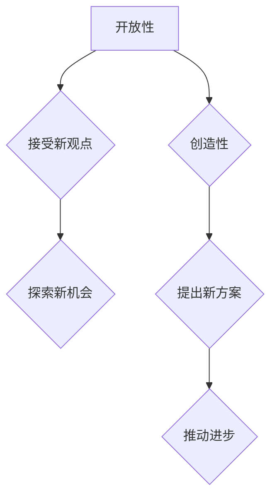

**核心算法原理讲解**：

在领导力中，一个关键的创新思维算法原理是“头脑风暴”。该算法包括以下步骤：

1. **准备**：确定头脑风暴的主题和目标，准备相关资料和工具。
2. **自由思考**：鼓励参与者无限制地提出想法，不考虑其可行性。
3. **筛选与改进**：对提出的想法进行筛选和改进，识别最具潜力的方案。
4. **实施与反馈**：实施选定的方案，并根据反馈进行调整和优化。

以下是一个简化的伪代码，描述头脑风暴的过程：

```python
def brainstorming(topic, goals):
    # 准备
    prepare_for_brainstorming(topic, goals)
    # 自由思考
    generate_ideas()
    # 筛选与改进
    filter_and_improve_ideas()
    # 实施与反馈
    implement_ideas_and_collect_feedback()
```

通过创新思维，领导者能够激发团队的创造力，推动组织的创新和发展。

##### 2.4 情境思维

情境思维是指领导者根据不同的情境和情况，灵活调整领导策略和方法。这种思维方式强调领导者要具备适应性和灵活性，能够应对复杂多变的环境。

**核心概念与联系**：

- **适应性**：情境思维强调领导者应根据不同情境调整策略，以应对变化。
- **灵活性**：领导者需要具备灵活性，能够在不同情境下快速做出反应。

为了更直观地展示情境思维的核心概念，我们可以使用以下Mermaid流程图：

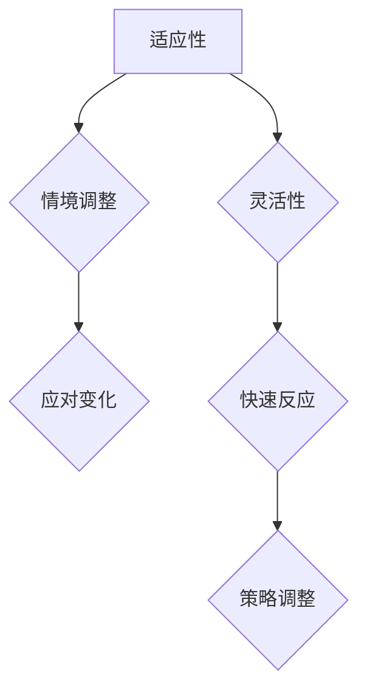

**核心算法原理讲解**：

在领导力中，一个关键的情境思维算法原理是“情境分析”。该算法包括以下步骤：

1. **识别情境因素**：分析当前情境中的关键因素，如组织环境、团队状态、外部压力等。
2. **评估情境影响**：评估不同情境因素对组织的影响，识别潜在的风险和机会。
3. **制定适应策略**：根据情境分析的结果，制定相应的适应策略，以应对不同情境。
4. **调整与优化**：根据实施效果，不断调整和优化策略，以适应不断变化的环境。

以下是一个简化的伪代码，描述情境分析的过程：

```python
def situational_analysis(factors):
    # 识别情境因素
    identify_situation_factors(factors)
    # 评估情境影响
    assess_impact_of_factors(factors)
    # 制定适应策略
    create_adaptation_strategies()
    # 调整与优化
    adjust_and_optimize_strategies()
```

通过情境思维，领导者能够更好地应对复杂多变的环境，提高组织的灵活性和适应性。

### 总结

通过本章的讨论，我们介绍了领导力的基础思维模式，包括系统思维、人本思维、创新思维和情境思维。这些思维模式为领导者提供了全面的视角，帮助他们在复杂多变的组织环境中做出明智的决策和有效的领导。在下一章中，我们将探讨领导力在组织管理中的具体应用，帮助读者将领导力思维转化为实际的领导行动。

----------------------------------------------------------------

### 第三部分：领导力的实践与应用

#### 第3章：领导力在组织管理中的应用

在组织管理中，领导力不仅仅是理论上的概念，它需要通过实践和具体的行动来体现。有效的领导力实践能够提升组织的整体效能，推动组织实现战略目标。在这一章中，我们将深入探讨领导力在组织管理中的应用，包括领导力与组织结构设计、团队建设、战略规划以及变革管理等方面的具体实践。

##### 3.1 领导力与组织结构设计

组织结构是领导力得以实施的基础。合理的组织结构能够支持领导力的有效发挥，提高组织的协同效应和效率。领导者在组织结构设计中的角色至关重要，他们需要根据组织的战略目标和实际情况，设计出既符合组织发展需求，又能促进领导力发挥的组织结构。

**核心概念与联系**：

- **组织结构类型**：组织结构包括职能型、矩阵型、网络型等多种类型，每种类型都有其独特的优势和应用场景。
- **领导力支持**：合理的组织结构设计应支持领导力的发挥，如明确领导层次、优化沟通渠道、增强团队协作等。

为了更直观地展示组织结构设计对领导力的支持，我们可以使用以下Mermaid流程图：

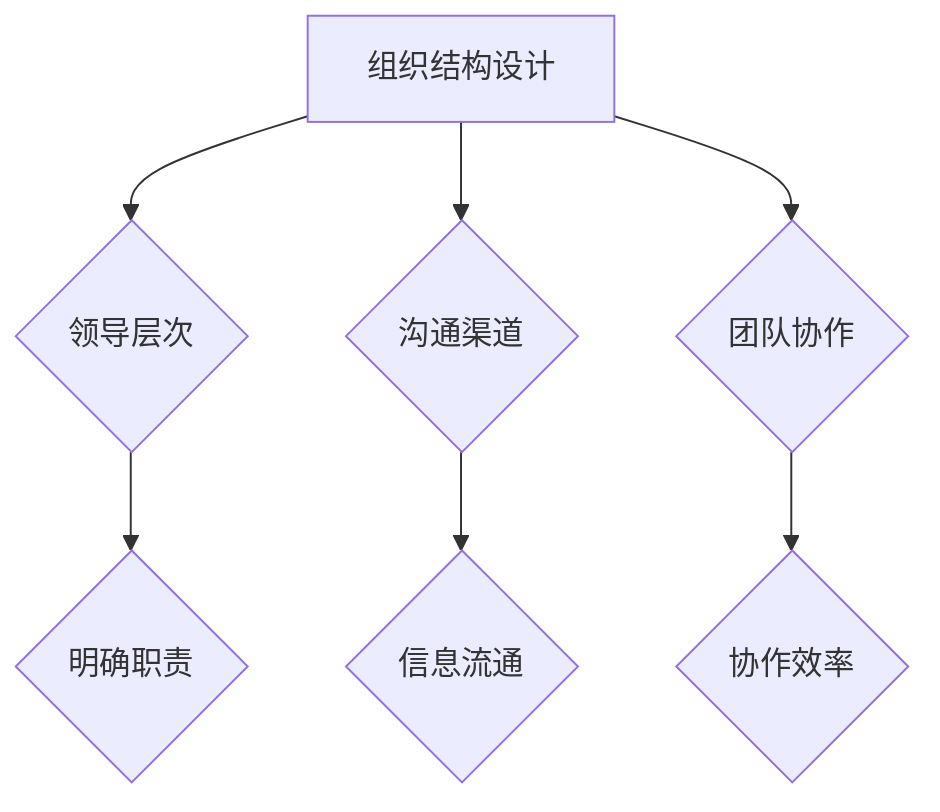

**核心算法原理讲解**：

在组织结构设计中，一个关键的概念是“领导层级优化”。该算法包括以下步骤：

1. **确定战略目标**：根据组织的战略目标，明确领导层级的设计方向。
2. **分析领导需求**：分析不同领导层次的需求，如管理幅度、管理深度等。
3. **设计领导层级**：根据分析结果，设计合理的领导层级，确保领导力的有效传递。
4. **评估与调整**：根据实际情况，对领导层级进行评估和调整，确保其符合组织发展需求。

以下是一个简化的伪代码，描述领导层级优化的过程：

```python
def optimize Leadership_hierarchy(strategic_goals, leadership需求的分析结果):
    # 确定战略目标
    determine_strategic_goals(strategic_goals)
    # 分析领导需求
    analyze_leadership_needs()
    # 设计领导层级
    design_leadership_hierarchy()
    # 评估与调整
    assess_and_adjust_leadership_hierarchy()
```

通过优化组织结构设计，领导者能够更好地发挥领导力，提高组织的协同效应和效率。

##### 3.2 领导力与团队建设

团队建设是领导力在组织管理中的核心应用之一。一个高效的团队能够推动组织实现战略目标，提升整体绩效。领导者需要通过有效的团队建设策略，培养团队成员的凝聚力、协作能力和创新能力。

**核心概念与联系**：

- **团队文化**：团队文化是团队建设的重要基石，它包括价值观、行为规范、共同目标等。
- **团队协作**：团队协作是团队建设的关键，它涉及到团队成员之间的沟通、协调和合作。

为了更直观地展示团队建设对领导力的支持，我们可以使用以下Mermaid流程图：

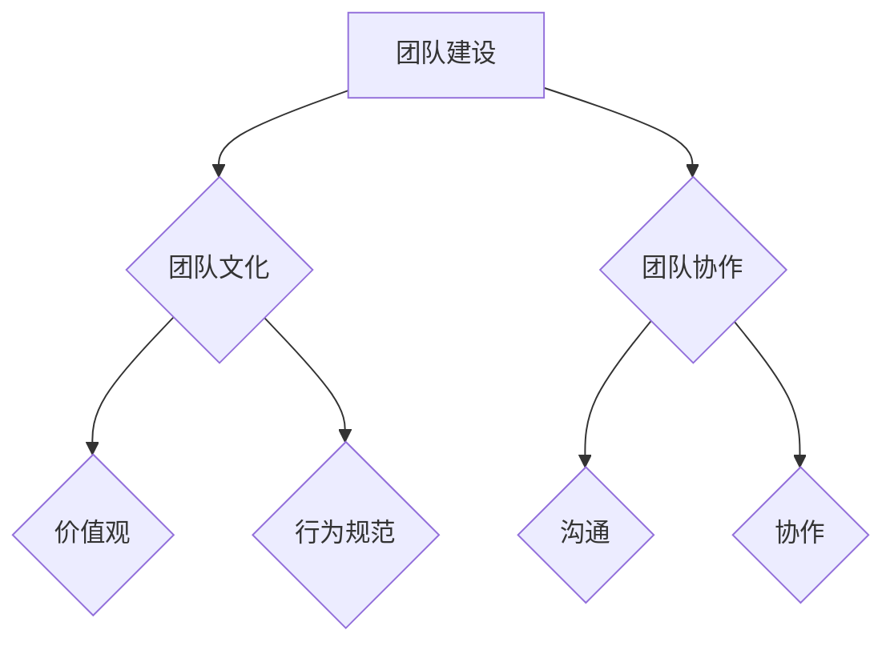

**核心算法原理讲解**：

在团队建设过程中，一个关键的概念是“团队文化塑造”。该算法包括以下步骤：

1. **确立共同目标**：明确团队的目标，确保团队成员对目标有共同的理解和认同。
2. **培养价值观**：通过培训和日常沟通，培养团队成员的共同价值观，增强团队凝聚力。
3. **制定行为规范**：制定明确的行为规范，规范团队成员的行为，确保团队内部的合作和协作。
4. **激励与反馈**：通过激励机制和反馈机制，激励团队成员积极参与团队建设，提升团队整体绩效。

以下是一个简化的伪代码，描述团队文化塑造的过程：

```python
def team_culture_shape(common_goals, shared_values, behavior_standards):
    # 确立共同目标
    establish_common_goals(common_goals)
    # 培养价值观
    cultivate_shared_values(shared_values)
    # 制定行为规范
    set_behavior_standards(behavior_standards)
    # 激励与反馈
    implement_incentives_and_feedback()
```

通过团队建设，领导者能够培养出高效、有凝聚力的团队，提高组织的整体绩效。

##### 3.3 领导力与战略规划

战略规划是组织发展的关键，而领导力在战略规划中起着至关重要的作用。有效的领导力能够推动组织制定明确的目标和策略，并确保这些目标和策略得到有效执行。

**核心概念与联系**：

- **战略目标**：战略目标是组织长期发展的方向和目标，是领导力战略规划的核心。
- **战略执行**：战略执行是确保战略目标得到实现的过程，需要领导力的有效推动。

为了更直观地展示领导力在战略规划中的应用，我们可以使用以下Mermaid流程图：

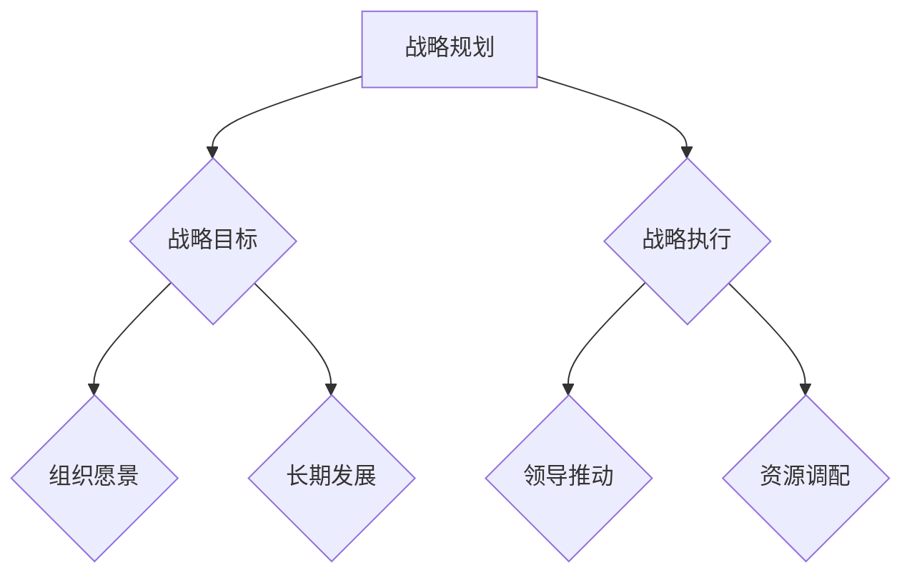

**核心算法原理讲解**：

在战略规划中，一个关键的概念是“目标管理”。该算法包括以下步骤：

1. **确立战略目标**：明确组织的长期战略目标，确保目标与组织愿景一致。
2. **制定策略**：根据战略目标，制定具体的策略和行动计划。
3. **资源调配**：根据策略需要，合理调配组织资源，确保策略得到有效执行。
4. **监控与调整**：建立监控机制，对战略执行过程进行监控，根据实际情况进行调整。

以下是一个简化的伪代码，描述目标管理的过程：

```python
def strategic_goals_management(strategic_goals, strategies, resources):
    # 确立战略目标
    establish_strategic_goals(strategic_goals)
    # 制定策略
    create_strategies(strategies)
    # 调配资源
    allocate_resources(resources)
    # 监控与调整
    monitor_and_adjust_strategies()
```

通过战略规划，领导者能够确保组织长期发展目标的实现，推动组织持续成长。

##### 3.4 领导力与变革管理

在快速变化的市场环境中，变革管理成为组织生存和发展的关键。领导力在变革管理中起着至关重要的作用，它能够推动组织积极应对变革，抓住市场机遇。

**核心概念与联系**：

- **变革需求**：变革需求是组织变革的驱动力，可能来自外部环境的变化或内部管理的需要。
- **变革执行**：变革执行是变革管理的关键环节，需要领导力的有效推动和协调。

为了更直观地展示领导力在变革管理中的应用，我们可以使用以下Mermaid流程图：

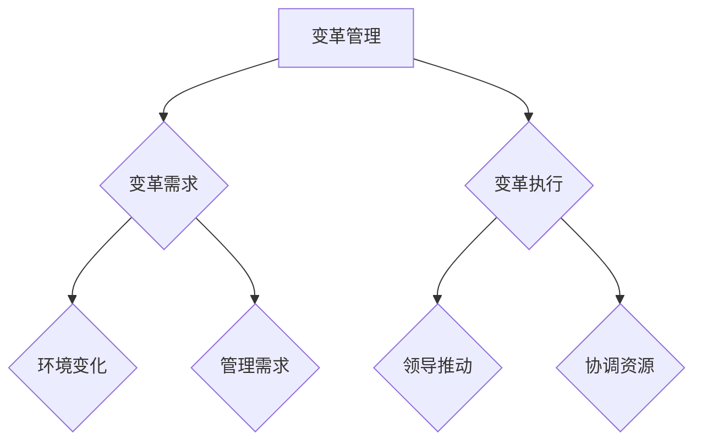

**核心算法原理讲解**：

在变革管理中，一个关键的概念是“变革计划”。该算法包括以下步骤：

1. **识别变革需求**：分析外部环境和内部管理需求，明确变革的必要性和目标。
2. **制定变革计划**：根据变革需求，制定详细的变革计划，包括变革的目标、步骤、时间表等。
3. **动员与沟通**：动员全体员工参与变革，通过有效的沟通确保员工理解变革的意义和目标。
4. **执行与监控**：执行变革计划，并建立监控机制，对变革过程进行监控和调整。

以下是一个简化的伪代码，描述变革计划的过程：

```python
def change_management(change Needs, change_plan):
    # 识别变革需求
    identify_change_needs(change_Needs)
    # 制定变革计划
    create_change_plan(change_plan)
    # 动员与沟通
    mobilize_and_communicate()
    # 执行与监控
    execute_and_monitor_changes()
```

通过变革管理，领导者能够推动组织积极应对变革，保持组织的活力和竞争力。

### 总结

通过本章的讨论，我们深入探讨了领导力在组织管理中的具体应用，包括组织结构设计、团队建设、战略规划和变革管理。领导力不仅是一种理论，更是一种实践。领导者需要通过有效的领导力实践，推动组织实现战略目标，提升整体绩效和竞争力。在下一章中，我们将进一步探讨领导力修炼的技巧和策略，帮助领导者不断提升自己的领导力水平。

----------------------------------------------------------------

### 第四部分：领导力修炼的技巧和策略

#### 第4章：提升个人领导力技能

领导力并非一蹴而就，它需要通过不断的修炼和积累来提升。在这一章中，我们将探讨提升个人领导力技能的几种关键技巧和策略，包括自我认知与自我提升、沟通技巧、决策能力以及时间管理。这些技能对于领导者来说至关重要，能够帮助他们更好地应对各种挑战，实现个人和团队的成长。

##### 4.1 自我认知与自我提升

自我认知是领导力修炼的基础。一个优秀的领导者首先需要了解自己，包括自己的优点、缺点、价值观和信念。自我提升则是通过不断的自我反思和学习，不断提高自己的能力和素质。

**核心概念与联系**：

- **自我认知**：自我认知是指领导者了解自己的个性特点、价值观和信念。
- **自我提升**：自我提升是指领导者通过学习和实践，不断提升自己的能力和素质。

为了更直观地展示自我认知与自我提升的核心概念，我们可以使用以下Mermaid流程图：

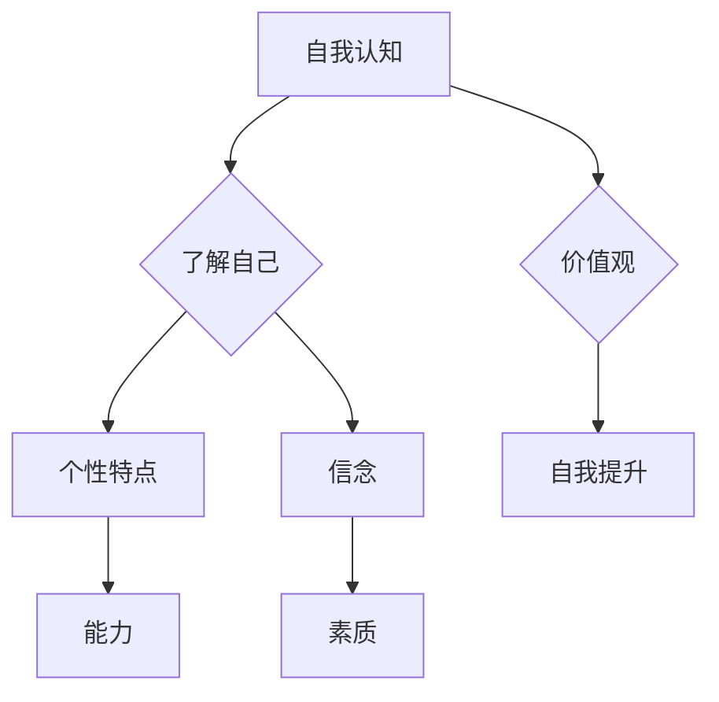

**核心算法原理讲解**：

在自我认知和自我提升中，一个关键的概念是“自我反思”。自我反思是指领导者通过回顾自己的行为和经历，识别自己的优点和不足，从而进行改进。以下是一个简化的伪代码，描述自我反思的过程：

```python
def self_reflection():
    # 回顾行为
    review_behaviors()
    # 识别优点
    identify_strong_points()
    # 识别不足
    identify_weak_points()
    # 制定改进计划
    create_improvement_plan()
    # 实施改进
    implement_improvements()
```

通过自我反思和持续的自我提升，领导者能够更好地认识自己，不断提升自己的领导力。

##### 4.2 沟通技巧

沟通技巧是领导者必备的能力之一。有效的沟通能够帮助领导者更好地传达信息、理解他人、建立信任和促进合作。领导者需要掌握多种沟通技巧，包括倾听、表达、反馈和谈判等。

**核心概念与联系**：

- **倾听**：倾听是有效沟通的关键，它有助于领导者理解他人的观点和需求。
- **表达**：表达技巧是领导者清晰传达自己观点和想法的能力。
- **反馈**：反馈技巧是领导者给予他人评价和建议的能力。
- **谈判**：谈判技巧是领导者解决冲突、达成共识的能力。

为了更直观地展示沟通技巧的核心概念，我们可以使用以下Mermaid流程图：

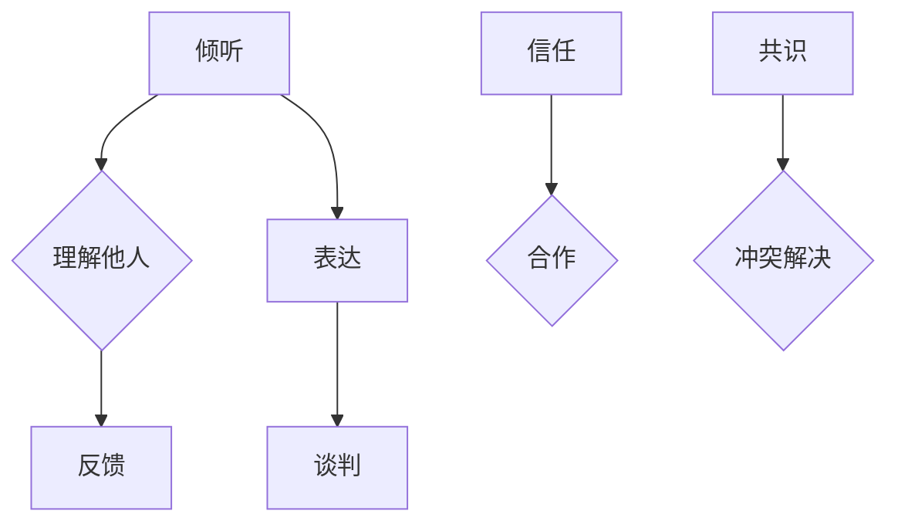

**核心算法原理讲解**：

在沟通技巧中，一个关键的概念是“有效沟通模型”。该模型包括以下步骤：

1. **明确沟通目标**：确定沟通的目标和意图。
2. **选择合适的方式**：根据沟通内容和目标，选择最合适的沟通方式，如面对面沟通、书面沟通等。
3. **有效表达**：清晰、准确地表达自己的观点和想法。
4. **积极倾听**：倾听他人的观点，理解他们的需求和意见。
5. **给予反馈**：及时给予他人反馈，帮助他们改进。
6. **谈判与解决**：在出现分歧时，通过谈判和协商解决问题。

以下是一个简化的伪代码，描述有效沟通的过程：

```python
def effective_communication kommunikationsziel, communication_channel, message, listener, feedback, negotiation):
    # 明确沟通目标
    define_communication_goal(kommunikationsziel)
    # 选择合适的方式
    select_appropriate_channel(communication_channel)
    # 有效表达
    express_clearly(message)
    # 积极倾听
    actively_listen(listener)
    # 给予反馈
    provide_feedback(feedback)
    # 谈判与解决
    negotiate_and_solve_conflicts(negotiation)
```

通过掌握沟通技巧，领导者能够更好地传达信息、理解他人、建立信任和促进合作。

##### 4.3 决策能力

决策能力是领导者的一项核心能力。领导者需要能够在各种复杂和不确定的情况下做出明智的决策，以推动组织向前发展。有效的决策能力包括明确目标、分析选项、评估风险和选择最佳方案等。

**核心概念与联系**：

- **目标明确**：明确目标是决策的前提，它有助于领导者确定决策的方向和目标。
- **分析选项**：分析选项是指领导者对各种可能的决策方案进行评估和分析。
- **评估风险**：评估风险是指领导者对决策可能带来的风险进行识别和评估。
- **选择最佳方案**：选择最佳方案是指领导者根据目标和风险评估，选择最优的决策方案。

为了更直观地展示决策能力的核心概念，我们可以使用以下Mermaid流程图：

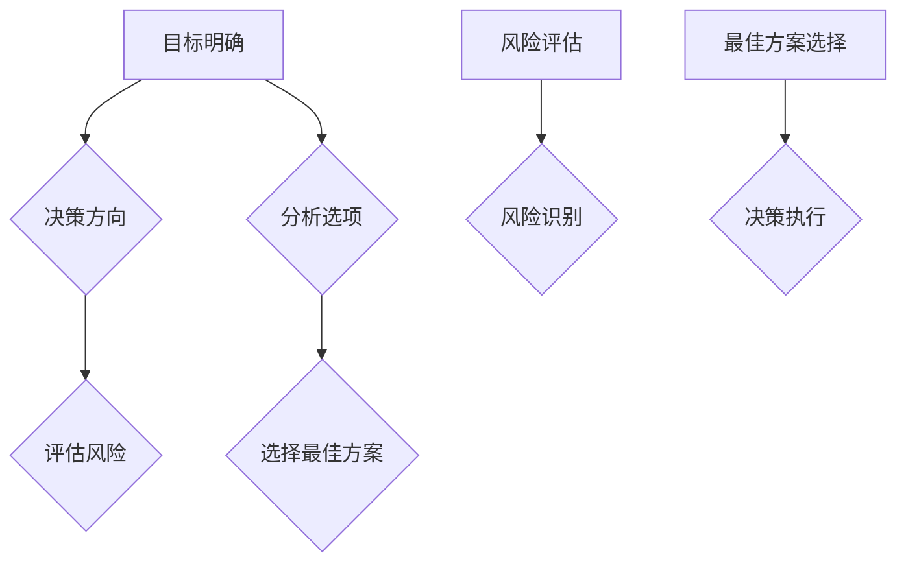

**核心算法原理讲解**：

在决策能力中，一个关键的概念是“决策模型”。该模型包括以下步骤：

1. **明确决策目标**：确定决策的目标和所需解决的问题。
2. **收集信息**：收集与决策相关的各种信息，包括数据、分析报告等。
3. **分析选项**：根据收集的信息，分析各种可能的决策选项。
4. **评估风险**：对每个选项可能带来的风险进行评估和比较。
5. **选择最佳方案**：根据目标和风险评估，选择最优的决策方案。
6. **决策执行**：实施决策方案，并监控决策效果，确保决策目标的实现。

以下是一个简化的伪代码，描述决策模型的过程：

```python
def decision_model(decision_goal, information, options, risk_evaluation, best_choice):
    # 明确决策目标
    define_decision_goal(decision_goal)
    # 收集信息
    collect_information(information)
    # 分析选项
    analyze_options(options)
    # 评估风险
    evaluate_risks(risk_evaluation)
    # 选择最佳方案
    choose_best_option(best_choice)
    # 决策执行
    implement_decision()
```

通过掌握决策能力，领导者能够更有效地解决问题，推动组织的发展。

##### 4.4 时间管理

时间管理是领导者提升效率的关键技能之一。有效的领导者能够合理安排时间，提高工作效率，确保重要任务得到及时完成。时间管理包括优先级设定、时间规划、时间跟踪和避免时间浪费等。

**核心概念与联系**：

- **优先级设定**：优先级设定是指领导者根据任务的重要性和紧急性，确定任务的优先顺序。
- **时间规划**：时间规划是指领导者合理安排每天、每周和每月的工作时间，确保任务的按时完成。
- **时间跟踪**：时间跟踪是指领导者记录和监控自己的工作时间，确保时间得到充分利用。
- **避免时间浪费**：避免时间浪费是指领导者识别和避免时间浪费的行为和活动。

为了更直观地展示时间管理的核心概念，我们可以使用以下Mermaid流程图：

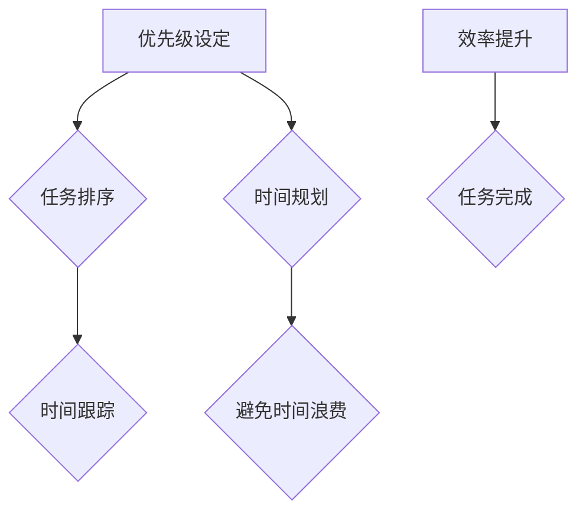

**核心算法原理讲解**：

在时间管理中，一个关键的概念是“优先级矩阵”。该矩阵根据任务的重要性和紧急性，将任务分为四个象限，帮助领导者合理安排时间。以下是一个简化的优先级矩阵：

```
       | 重要 | 不重要
--------------|----------|----------
 紧急   | A    | D
 不紧急 | B    | C
```

在优先级矩阵中，A代表重要且紧急的任务，需要立即处理；B代表重要但不紧急的任务，需要优先处理；C代表不重要但紧急的任务，可以适当处理；D代表不重要且不紧急的任务，可以暂时搁置。

以下是一个简化的伪代码，描述优先级矩阵的应用：

```python
def prioritize_tasks(tasks, importance, urgency):
    # 创建优先级矩阵
    create_priority_matrix(importance, urgency)
    # 分配任务到矩阵
    assign_tasks_to_matrix(tasks, importance, urgency)
    # 处理任务
    process_tasks_based_on_matrix()
```

通过时间管理，领导者能够更高效地工作，确保重要任务得到及时完成。

### 总结

通过本章的讨论，我们探讨了提升个人领导力技能的几种关键技巧和策略，包括自我认知与自我提升、沟通技巧、决策能力和时间管理。这些技能对于领导者来说至关重要，能够帮助他们更好地应对各种挑战，实现个人和团队的成长。在下一章中，我们将进一步探讨领导力在个人成长和团队建设中的应用，帮助领导者更好地理解和培养团队成员，推动组织的发展。

----------------------------------------------------------------

### 第五部分：领导力的个人成长和团队建设

#### 第5章：领导力的个人成长

领导力的个人成长是一个持续的过程，它要求领导者不仅要不断提升自己的技能和知识，还需要在心理和情感层面进行深度修炼。在这一章中，我们将探讨领导力个人成长的核心要素，包括成长心态、领导力心理学以及自我反思与持续改进。

##### 5.1 成长心态与成长路径

成长心态是指领导者对学习和发展的持续渴望，以及对挑战和失败持开放态度的心态。拥有成长心态的领导者能够从每次经历中学习，不断进步，而不是因为失败而止步不前。这种心态是领导力成长的重要基石。

**核心概念与联系**：

- **成长心态**：指领导者对学习和发展的持续渴望和开放态度。
- **成长路径**：领导者通过不断学习、实践和反思，逐步提升自己的领导力水平。

为了更直观地展示成长心态与成长路径的核心概念，我们可以使用以下Mermaid流程图：

```mermaid
graph TD
    A[成长心态] --> B{持续学习}
    A --> C{开放态度}
    B --> D[实践]
    C --> E[反思]
    D --> F[进步]
    E --> G[改进]
```

**核心算法原理讲解**：

在成长心态的培养中，一个关键的概念是“持续学习循环”。该循环包括以下步骤：

1. **识别学习需求**：领导者通过自我评估和反馈，识别自己在知识和技能方面的需求。
2. **制定学习计划**：根据学习需求，制定详细的学习计划，包括学习内容、方法和时间安排。
3. **实施学习计划**：按照学习计划，进行实际的学习和实践。
4. **反思与调整**：在学习结束后，通过反思和评估，了解学习效果，并根据反馈进行调整。
5. **持续改进**：根据反思结果，不断调整学习策略和方法，实现持续进步。

以下是一个简化的伪代码，描述持续学习循环的过程：

```python
def continuous_learning_loop(learning_needs, learning_plan, reflection, adjustment):
    # 识别学习需求
    identify_learning_needs(learning_needs)
    # 制定学习计划
    create_learning_plan(learning_plan)
    # 实施学习计划
    implement_learning_plan()
    # 反思与调整
    reflect_and_adjust(reflection, adjustment)
    # 持续改进
    continue_improvement()
```

通过培养成长心态，领导者能够不断提升自己的能力，实现个人成长。

##### 5.2 领导力心理学

领导力心理学研究领导者如何通过心理和行为方式影响他人。了解领导力心理学有助于领导者更好地理解团队成员的心理状态和行为模式，从而更有效地进行领导。

**核心概念与联系**：

- **领导行为**：领导行为是指领导者通过语言、行动和态度来影响团队成员的过程。
- **心理影响**：心理影响是指领导者的行为如何影响团队成员的心理状态和行为。

为了更直观地展示领导力心理学，我们可以使用以下Mermaid流程图：

```mermaid
graph TD
    A[领导行为] --> B{语言}
    A --> C{行动}
    A --> D{态度}
    B --> E{沟通}
    C --> F{决策}
    D --> G{激励}
    E --> H{团队建设}
    F --> I{管理}
    G --> J{合作}
```

**核心算法原理讲解**：

在领导力心理学中，一个关键的概念是“领导影响力模型”。该模型包括以下步骤：

1. **了解团队成员**：领导者通过沟通和观察，了解团队成员的心理特征、需求和期望。
2. **建立信任**：通过诚信和透明度，建立与团队成员的信任关系。
3. **激励与鼓励**：领导者通过正面的激励和鼓励，提升团队成员的积极性和工作动力。
4. **反馈与支持**：领导者通过及时、具体的反馈和支持，帮助团队成员改进和提高。
5. **持续沟通**：领导者与团队成员保持持续沟通，确保信息的畅通和问题的及时解决。

以下是一个简化的伪代码，描述领导影响力模型的过程：

```python
def leadership_influence_model(team_members, trust, motivation, feedback, communication):
    # 了解团队成员
    understand_team_members(team_members)
    # 建立信任
    build_trust()
    # 激励与鼓励
    motivate_and_encourage()
    # 反馈与支持
    provide_feedback_and_support()
    # 持续沟通
    maintain_continuity_in_communication()
```

通过掌握领导力心理学，领导者能够更好地影响和激励团队成员，实现团队目标。

##### 5.3 自我反思与持续改进

自我反思是领导力成长的重要环节。通过反思，领导者可以识别自己的优点和不足，从而进行改进。持续改进则是领导者通过不断学习和实践，不断提升自己的能力和素质。

**核心概念与联系**：

- **自我反思**：自我反思是指领导者通过回顾自己的行为和决策，识别自己的优点和不足。
- **持续改进**：持续改进是指领导者通过持续的学习和实践，不断提升自己的能力和素质。

为了更直观地展示自我反思与持续改进的核心概念，我们可以使用以下Mermaid流程图：

```mermaid
graph TD
    A[自我反思] --> B{识别优点}
    A --> C{识别不足}
    B --> D[持续改进]
    C --> E{改进计划}
    D --> F{能力提升}
```

**核心算法原理讲解**：

在自我反思与持续改进中，一个关键的概念是“反思循环”。该循环包括以下步骤：

1. **回顾行为**：领导者回顾自己的行为和决策，识别成功和失败的原因。
2. **识别优点**：从回顾中识别自己的优点，了解自己在哪些方面做得好。
3. **识别不足**：从回顾中识别自己的不足，了解自己在哪些方面需要改进。
4. **制定改进计划**：根据识别的不足，制定具体的改进计划。
5. **实施改进**：按照改进计划，进行实际的学习和实践。
6. **反思与调整**：在实施改进后，进行反思和评估，了解改进效果，并根据反馈进行调整。

以下是一个简化的伪代码，描述反思循环的过程：

```python
def reflection_loop(reviewed_actions, identified_advantages, identified_shortcomings, improvement_plan, implementation, reflection):
    # 回顾行为
    review_actions.reviewed_actions)
    # 识别优点
    identify_advantages(identified_advantages)
    # 识别不足
    identify_shortcomings(identified_shortcomings)
    # 制定改进计划
    create_improvement_plan(improvement_plan)
    # 实施改进
    implement_improvements(implementation)
    # 反思与调整
    reflect_and_adjust(reflection)
```

通过自我反思与持续改进，领导者能够不断提升自己的能力和素质，实现个人成长。

### 第五部分：团队建设与领导力发展

#### 第5章：团队建设与领导力发展

团队建设是领导力发展的重要组成部分。一个高效的团队不仅能够提升组织的整体绩效，还能够为领导者提供支持和挑战，促进个人成长。在这一章中，我们将探讨团队建设与领导力发展的关键要素，包括团队文化、团队协作和领导力传承。

##### 5.1 团队文化

团队文化是团队建设和领导力发展的基石。团队文化不仅影响着团队成员的态度和行为，还影响着团队的整体表现和凝聚力。一个积极向上的团队文化能够激发团队成员的潜力，提高团队的整体效能。

**核心概念与联系**：

- **团队文化**：团队文化是指团队成员共同遵循的价值观、行为规范和共同目标。
- **团队凝聚力**：团队凝聚力是指团队成员之间的紧密联系和相互支持。

为了更直观地展示团队文化的核心概念，我们可以使用以下Mermaid流程图：

```mermaid
graph TD
    A[团队文化] --> B{价值观}
    A --> C{行为规范}
    A --> D{共同目标}
    B --> E{凝聚力}
    C --> F{合作}
    D --> G{效能}
```

**核心算法原理讲解**：

在团队文化建设中，一个关键的概念是“文化塑造”。该算法包括以下步骤：

1. **确立共同价值观**：领导者与团队成员共同确立团队的价值观，确保团队成员对价值观有共同的理解和认同。
2. **制定行为规范**：根据共同价值观，制定具体的行为规范，规范团队成员的行为。
3. **培养共同目标**：通过设定共同的目标和愿景，激发团队成员的积极性和归属感。
4. **持续传播和强化**：通过日常的沟通和活动，持续传播和强化团队文化，确保文化深入人心。

以下是一个简化的伪代码，描述文化塑造的过程：

```python
def culture_shape(shared_values, behavior_standards, common_goals):
    # 确立共同价值观
    establish_shared_values(shared_values)
    # 制定行为规范
    set_behavior_standards(behavior_standards)
    # 培养共同目标
    cultivate_common_goals(common_goals)
    # 持续传播和强化
    continue_spreading_and_strengthening()
```

通过塑造积极的团队文化，领导者能够提升团队的凝聚力和效能，促进团队建设。

##### 5.2 团队协作

团队协作是团队建设的关键要素之一。一个高效的团队协作能够提高团队的工作效率和创新力，实现团队的目标。领导者需要通过有效的团队协作策略，激发团队成员的潜力，推动团队的发展。

**核心概念与联系**：

- **团队协作**：团队协作是指团队成员之间的紧密合作和互相支持，共同实现团队目标。
- **沟通与协调**：沟通与协调是团队协作的基础，它确保团队成员之间的信息畅通和协作效率。

为了更直观地展示团队协作的核心概念，我们可以使用以下Mermaid流程图：

```mermaid
graph TD
    A[团队协作] --> B{紧密合作}
    A --> C{互相支持}
    B --> D{工作效率}
    C --> E{创新能力}
    D --> F{目标实现}
    E --> G{团队发展}
```

**核心算法原理讲解**：

在团队协作中，一个关键的概念是“协作框架”。该框架包括以下步骤：

1. **明确协作目标**：确定团队的协作目标和任务，确保团队成员对目标有清晰的认识。
2. **分配任务和责任**：根据团队成员的能力和特长，合理分配任务和责任，确保任务的高效完成。
3. **建立沟通渠道**：建立畅通的沟通渠道，确保团队成员之间的信息畅通和协作顺畅。
4. **协调与支持**：在协作过程中，领导者需要协调团队成员之间的关系，提供必要的支持和帮助。
5. **评估与改进**：对协作过程进行评估和反馈，识别问题并不断改进，提高团队协作的效能。

以下是一个简化的伪代码，描述协作框架的过程：

```python
def collaboration_framework(collaboration_goals, task分配，communication_channels, coordination, improvement):
    # 明确协作目标
    define_collaboration_goals(collaboration_goals)
    # 分配任务和责任
    allocate_tasks_and_responsibilities()
    # 建立沟通渠道
    establish_communication_channels()
    # 协调与支持
    coordinate_and_support()
    # 评估与改进
    evaluate_and_improve()
```

通过有效的团队协作，领导者能够激发团队的潜力，实现团队的目标。

##### 5.3 领导力传承

领导力传承是团队建设和领导力发展的重要环节。通过有效的领导力传承，领导者可以将自己的经验和知识传递给下一代领导者，确保领导力的持续发展。领导力传承不仅有助于培养新一代领导者，还能够提升组织的整体领导力水平。

**核心概念与联系**：

- **领导力传承**：领导力传承是指领导者将领导知识和经验传递给下一代领导者。
- **培养接班人**：培养接班人是指领导者通过培训和指导，培养新一代领导者，确保领导力的持续发展。

为了更直观地展示领导力传承的核心概念，我们可以使用以下Mermaid流程图：

```mermaid
graph TD
    A[领导力传承] --> B{经验传递}
    A --> C{知识传承}
    B --> D[培养接班人]
    C --> E{领导力发展}
    D --> F[团队建设]
```

**核心算法原理讲解**：

在领导力传承中，一个关键的概念是“领导力培养模型”。该模型包括以下步骤：

1. **确定培养目标**：明确培养接班人的目标和要求，确保培养过程有明确的方向。
2. **制定培养计划**：根据培养目标，制定具体的培养计划，包括培训内容、培训方式和培训时间安排。
3. **提供实践机会**：为接班人提供实际的工作机会和挑战，让他们在实践中学习和成长。
4. **持续指导和反馈**：领导者通过持续的指导和反馈，帮助接班人改进和提高。
5. **评估与调整**：对培养过程进行评估和反馈，识别问题并不断调整，确保培养效果。

以下是一个简化的伪代码，描述领导力培养模型的过程：

```python
def leadership_training_model(cultivation_goals, training_plan, practical_opportunities, guidance, evaluation):
    # 确定培养目标
    define_cultivation_goals(cultivation_goals)
    # 制定培养计划
    create_training_plan(training_plan)
    # 提供实践机会
    provide_practical_opportunities()
    # 持续指导和反馈
    provide_continuous_guidance_and_feedback()
    # 评估与调整
    evaluate_and_adjust()
```

通过有效的领导力传承，领导者能够确保领导力的持续发展，为组织的未来打下坚实的基础。

### 总结

通过本章的讨论，我们深入探讨了领导力在个人成长和团队建设中的应用。领导力的个人成长是一个持续的过程，需要领导者不断提升自己的能力、心理素质和认知水平。团队建设则是领导力发展的重要环节，通过塑造积极的团队文化、促进团队协作和传承领导力，领导者能够提升团队的整体效能和竞争力。在下一章中，我们将探讨特殊场景下的领导力策略，帮助领导者应对不同情境下的挑战。

----------------------------------------------------------------

### 第六部分：特殊场景下的领导力策略

#### 第7章：危机管理中的领导力

在快速变化和竞争激烈的环境中，危机管理成为领导者必须面对的重要挑战。危机管理不仅关乎组织的生存，还关系到团队的士气和组织的长期发展。有效的危机管理需要领导者具备快速反应、冷静判断和果断行动的能力。在这一章中，我们将探讨危机管理中的领导力策略，包括危机管理的原则与方法、应对突发事件的领导力以及复兴与转机的领导力。

##### 7.1 危机管理的原则与方法

危机管理是一个系统性、多层次的过程，它不仅涉及应对危机的紧急措施，还包括预防危机的发生和危机后的恢复与重建。领导者需要遵循一系列原则和方法，以有效地管理危机。

**核心概念与联系**：

- **预防为主**：预防是危机管理的首要原则，通过预见和预防减少危机的发生。
- **快速反应**：快速反应是危机管理的关键，及时采取行动可以减轻危机的影响。
- **有效沟通**：有效沟通是危机管理的保障，通过透明、及时的沟通，增强团队的凝聚力。
- **协同合作**：协同合作是危机管理的基础，领导者需要协调各方力量，形成合力。

为了更直观地展示危机管理的原则与方法，我们可以使用以下Mermaid流程图：

```mermaid
graph TD
    A[预防为主] --> B{减少危机发生}
    A --> C{快速反应}
    A --> D{有效沟通}
    A --> E{协同合作}
    B --> F{危机影响减轻}
    C --> G{危机影响减轻}
    D --> H{团队凝聚力增强}
    E --> I{合力形成}
```

**核心算法原理讲解**：

在危机管理中，一个关键的概念是“危机应对策略”。该策略包括以下步骤：

1. **识别危机信号**：通过监测和分析，及时发现和识别危机的早期信号。
2. **制定危机应对计划**：根据危机的类型和影响，制定详细的危机应对计划。
3. **快速反应**：在危机爆发时，迅速采取行动，启动危机应对计划。
4. **沟通与协调**：通过透明、及时的沟通，确保团队成员了解危机状况，协调各方力量共同应对。
5. **评估与调整**：在危机过程中，不断评估应对措施的效果，并根据实际情况进行调整。

以下是一个简化的伪代码，描述危机应对策略的过程：

```python
def crisis_response_strategy(crisis_signals, crisis_response_plan, rapid_response, communication, assessment):
    # 识别危机信号
    identify_crisis_signals(crisis_signals)
    # 制定危机应对计划
    create_crisis_response_plan(crisis_response_plan)
    # 快速反应
    execute_rapid_response()
    # 沟通与协调
    maintain_ongoing_communication()
    # 评估与调整
    continuously_assess_and_adjust()
```

通过遵循危机管理的原则和方法，领导者可以有效地预防和应对危机，减轻危机的影响，确保组织的稳定和发展。

##### 7.2 应对突发事件的领导力

突发事件是领导者必须面对的另一大挑战。突发事件往往具有不可预测性和紧急性，需要领导者迅速做出决策和行动。有效的应对突发事件需要领导者具备以下能力：

**核心概念与联系**：

- **迅速决策**：迅速决策是应对突发事件的关键，领导者需要在短时间内做出明智的决策。
- **冷静判断**：冷静判断是应对突发事件的基础，领导者需要保持冷静，避免恐慌和混乱。
- **灵活调整**：灵活调整是应对突发事件的重要策略，领导者需要根据实际情况灵活调整应对措施。

为了更直观地展示应对突发事件的领导力，我们可以使用以下Mermaid流程图：

```mermaid
graph TD
    A[迅速决策] --> B{有效应对}
    A --> C{冷静判断}
    A --> D{灵活调整}
    B --> E{危机减轻}
    C --> F{稳定局势}
    D --> G{策略调整}
```

**核心算法原理讲解**：

在应对突发事件中，一个关键的概念是“突发事件应对模型”。该模型包括以下步骤：

1. **快速识别**：在突发事件发生时，迅速识别危机的类型和影响。
2. **迅速决策**：基于快速识别的结果，迅速做出决策，制定应对方案。
3. **行动实施**：立即采取行动，实施应对方案，控制事态发展。
4. **沟通与协调**：通过透明、及时的沟通，确保团队成员了解危机状况，协调各方力量共同应对。
5. **评估与反馈**：在事件结束后，对应对过程进行评估和反馈，总结经验教训。

以下是一个简化的伪代码，描述突发事件应对模型的过程：

```python
def emergency_response_model(identification, decision, action, communication, assessment):
    # 快速识别
    quickly_identify()
    # 迅速决策
    make_rapid_decisions()
    # 行动实施
    execute_actions()
    # 沟通与协调
    maintain_communication()
    # 评估与反馈
    evaluate_and_offer_feedback()
```

通过遵循突发事件应对模型，领导者可以有效地应对突发事件，确保组织的稳定和安全。

##### 7.3 复兴与转机的领导力

危机过后，领导者不仅要恢复组织的正常运营，还需要把握转机的时机，推动组织实现复兴和发展。复兴与转机的领导力要求领导者具备前瞻性、创新精神和坚定信念。

**核心概念与联系**：

- **前瞻性**：前瞻性是指领导者能够预见未来趋势，提前布局，为组织创造新的发展机遇。
- **创新精神**：创新精神是指领导者敢于突破传统思维，寻找新的解决方案，推动组织的创新和发展。
- **坚定信念**：坚定信念是指领导者在面对困难和挑战时，保持坚定的信心和决心，引领团队走向成功。

为了更直观地展示复兴与转机的领导力，我们可以使用以下Mermaid流程图：

```mermaid
graph TD
    A[前瞻性] --> B{预见趋势}
    A --> C{布局未来}
    B --> D{发展机遇}
    C --> E{创新精神}
    D --> F{创新发展}
    E --> G{突破传统}
    F --> H{解决方案}
    G --> I{创新思维}
    H --> J{组织发展}
```

**核心算法原理讲解**：

在复兴与转机中，一个关键的概念是“复兴策略”。该策略包括以下步骤：

1. **评估损失**：对危机带来的损失进行评估，明确恢复和发展的优先顺序。
2. **制定复兴计划**：根据评估结果，制定详细的复兴计划，包括恢复运营、重建团队、开拓市场等。
3. **实施复兴计划**：按照复兴计划，逐步实施各项措施，推动组织恢复和发展。
4. **创新与转型**：在复兴过程中，寻找创新和转型的新机会，推动组织的持续发展。
5. **评估与优化**：对复兴过程进行评估和反馈，不断优化复兴策略，确保复兴目标的实现。

以下是一个简化的伪代码，描述复兴策略的过程：

```python
def revival_strategy(assessment, revival_plan, implementation, innovation, evaluation):
    # 评估损失
    assess_losses()
    # 制定复兴计划
    create_re revival_plan()
    # 实施复兴计划
    execute_re revival_plan()
    # 创新与转型
    pursue_innovation_and_transformation()
    # 评估与优化
    evaluate_and_optimize()
```

通过遵循复兴策略，领导者可以带领组织走出困境，实现复兴和持续发展。

### 总结

通过本章的讨论，我们深入探讨了特殊场景下的领导力策略，包括危机管理中的原则与方法、应对突发事件的领导力以及复兴与转机的领导力。领导者需要在不同场景下灵活运用这些策略，以应对各种挑战，确保组织的稳定和发展。在下一章中，我们将探讨领导力思维的拓展与前瞻，帮助领导者预见未来、引领变革。

----------------------------------------------------------------

### 第七部分：领导力思维的拓展与前瞻

#### 第8章：领导力思维的拓展与前瞻

领导力思维是领导者理解和应对复杂问题的核心能力。在不断变化和竞争激烈的环境中，领导者需要不断拓展思维，以适应新的挑战和机遇。在这一章中，我们将探讨领导力思维的拓展与前瞻，包括未来领导力的趋势、跨领域合作与创新，以及领导力的全球视野。

##### 8.1 未来领导力的趋势

未来领导力将面临前所未有的挑战和机遇。随着技术的不断进步和全球化的加速，领导力也将发生深刻的变化。以下是未来领导力可能呈现的几大趋势：

**核心概念与联系**：

- **技术驱动**：技术的迅猛发展将深刻改变领导方式，领导者需要具备技术敏感性和创新能力，以适应数字化时代。
- **全球视野**：全球化使领导力不再局限于特定地区或文化，领导者需要具备全球视野，理解不同文化和市场的差异。
- **可持续性**：可持续性成为未来领导力的核心，领导者需要关注环境和社会责任，推动组织的可持续发展。

为了更直观地展示未来领导力的趋势，我们可以使用以下Mermaid流程图：

```mermaid
graph TD
    A[技术驱动] --> B{数字化领导}
    A --> C{创新能力}
    B --> D{数据驱动决策}
    C --> E{数字化转型}
    F[全球视野] --> G{跨文化领导}
    F --> H{全球市场洞察}
    G --> I{国际化策略}
    H --> J{多元文化团队}
    K[可持续性] --> L{环境责任}
    K --> M{社会责任}
    L --> N{可持续领导}
    M --> O{社会价值创造}
```

**核心算法原理讲解**：

在探讨未来领导力的趋势中，一个关键的概念是“未来领导力模型”。该模型包括以下步骤：

1. **技术敏感度**：领导者需要保持对新技术的高度敏感，了解其潜在影响和应用场景。
2. **全球视野**：领导者需要具备全球视野，理解不同国家和地区的文化、经济和政治环境。
3. **创新能力**：领导者需要具备持续创新能力，能够引领组织在技术和商业模式上不断创新。
4. **可持续领导**：领导者需要关注环境和社会责任，推动组织的可持续发展。

以下是一个简化的伪代码，描述未来领导力模型的过程：

```python
def future_leadership_model(technological_sensitivity, global_vision, innovation_ability, sustainable_leadership):
    # 技术敏感度
    maintain_technological_sensitivity()
    # 全球视野
    cultivate_global_vision()
    # 创新能力
    foster_innovation_ability()
    # 可持续领导
    promote_sustainable_leadership()
```

通过拓展思维，领导者可以更好地适应未来领导力的趋势，引领组织走向成功。

##### 8.2 跨领域合作与创新

跨领域合作与创新是未来领导力的重要组成部分。随着各领域之间的交叉和融合，领导者需要具备跨领域思维，推动不同领域之间的合作和创新。

**核心概念与联系**：

- **跨领域合作**：跨领域合作是指不同领域之间的合作，通过共享资源和知识，实现协同创新。
- **创新思维**：创新思维是指领导者具备跳出传统思维框架，寻找新解决方案和机会的能力。

为了更直观地展示跨领域合作与创新，我们可以使用以下Mermaid流程图：

```mermaid
graph TD
    A[跨领域合作] --> B{资源共享}
    A --> C{知识融合}
    B --> D{协同创新}
    C --> E{跨界思维}
    D --> F{创新成果}
    E --> G{思维拓展}
    F --> H{商业价值}
```

**核心算法原理讲解**：

在跨领域合作与创新中，一个关键的概念是“跨界思维模型”。该模型包括以下步骤：

1. **识别跨领域需求**：分析不同领域之间的需求和合作机会。
2. **建立合作网络**：通过建立合作网络，促进不同领域之间的沟通和合作。
3. **共享资源和知识**：共享不同领域的资源和知识，实现协同创新。
4. **跨界思维培养**：通过培训和交流，培养领导者的跨界思维，促进创新。
5. **评估与创新**：对跨领域合作和创新进行评估，持续优化和创新。

以下是一个简化的伪代码，描述跨界思维模型的过程：

```python
def cross_domain_innovation_model(domain_needs, cooperation_network, resource_sharing, innovative_thinking, evaluation):
    # 识别跨领域需求
    identify_cross_domain_needs(domain_needs)
    # 建立合作网络
    establish_cooperation_network()
    # 共享资源和知识
    share_resources_and_knowledge()
    # 跨界思维培养
    cultivate_innovative_thinking()
    # 评估与创新
    evaluate_and_innovate()
```

通过跨领域合作与创新，领导者可以推动组织实现跨越式发展。

##### 8.3 领导力的全球视野

全球化使领导力面临新的挑战和机遇。领导者需要具备全球视野，理解不同国家和地区的文化、经济和政治环境，以有效应对全球市场。

**核心概念与联系**：

- **全球视野**：全球视野是指领导者能够理解不同国家和地区的文化、经济和政治环境，以有效应对全球市场。
- **跨文化领导**：跨文化领导是指领导者具备处理多元文化团队的能力，促进跨文化合作与沟通。

为了更直观地展示领导力的全球视野，我们可以使用以下Mermaid流程图：

```mermaid
graph TD
    A[全球视野] --> B{跨文化理解}
    A --> C{市场洞察}
    B --> D{文化适应}
    B --> E{管理多元文化团队}
    C --> F{国际化策略}
    D --> G{文化融合}
    E --> H{跨文化沟通}
    F --> I{全球市场拓展}
    G --> J{文化创新}
    H --> K{团队协作}
    I --> L{国际化发展}
```

**核心算法原理讲解**：

在探讨领导力的全球视野中，一个关键的概念是“全球领导力模型”。该模型包括以下步骤：

1. **了解全球市场**：领导者需要了解全球市场的动态，包括市场需求、竞争格局等。
2. **培养跨文化理解**：领导者需要通过学习和实践，培养跨文化理解，促进跨文化合作与沟通。
3. **制定国际化策略**：根据全球市场的需求，制定具体的国际化策略，推动组织的国际化发展。
4. **管理多元文化团队**：领导者需要具备管理多元文化团队的能力，促进团队协作和沟通。
5. **持续创新**：领导者需要不断探索和创新，以适应全球市场的变化。

以下是一个简化的伪代码，描述全球领导力模型的过程：

```python
def global_leadership_model(global_market_understanding, cross-cultural_understanding, international_strategy, management_of_diverse_teams, continuous_innovation):
    # 了解全球市场
    understand_global_market()
    # 培养跨文化理解
    cultivate_cross-cultural_understanding()
    # 制定国际化策略
    create_an_international_strategy()
    # 管理多元文化团队
    manage_diverse_teams()
    # 持续创新
    pursue_continuous_innovation()
```

通过拓展全球视野，领导者可以更好地应对全球市场的挑战和机遇。

### 总结

通过本章的讨论，我们探讨了领导力思维的拓展与前瞻，包括未来领导力的趋势、跨领域合作与创新以及领导力的全球视野。领导者需要不断拓展思维，以适应未来领导力的趋势，推动组织的持续创新和发展。在下一章中，我们将回顾全书的主要观点，并展望未来的研究方向，以期为读者提供更深层次的思考和启示。

## 作者信息

作者：AI天才研究院/AI Genius Institute & 禅与计算机程序设计艺术 /Zen And The Art of Computer Programming

