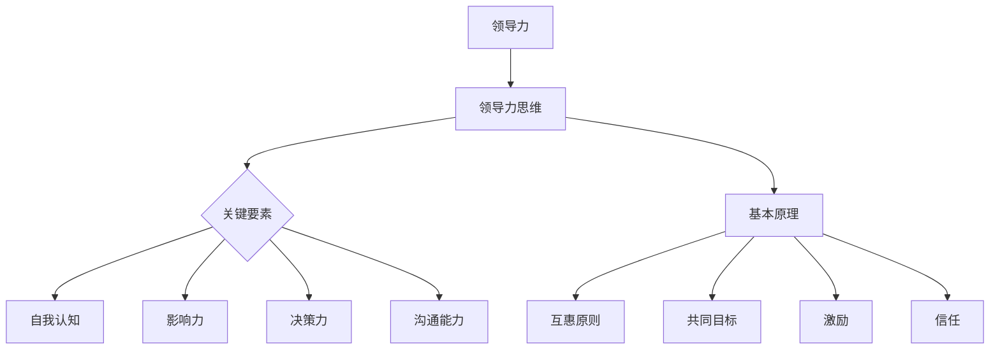

                 

### 目录大纲设计

在本文中，我们遵循用户的要求，设计了一份详细的目录大纲，旨在清晰地展示《领导力思维：改变时代的领导力修炼秘籍》的核心内容，同时帮助读者更好地理解和掌握领导力思维的精髓。以下是详细的目录大纲设计：

#### 第一部分：领导力思维理论

**第1章 领导力思维的起源与发展**

- **1.1 领导力的定义与分类**
  - **定义**：领导力是什么，以及它如何影响组织和个人。
  - **分类**：不同类型的领导力，如变革型、交易型、情境型等，及其适用场景。

- **1.2 领导力思维的历史演变**
  - **古代领导力**：古代帝王将相的领导思维。
  - **现代领导力**：企业管理者和政治领袖的领导思维。
  - **未来领导力**：全球化和数字化的领导思维趋势。

- **1.3 领导力思维的现代特点**
  - **变化性**：适应快速变化的领导环境。
  - **创新性**：鼓励创新和变革。
  - **智慧性**：智慧决策和策略制定。

**第2章 领导力思维的核心概念**

- **2.1 领导力思维的关键要素**
  - **关键要素**：领导力思维的核心组成部分，如影响力、决策、沟通等。

- **2.2 领导力思维的基本原理**
  - **基本原理**：领导力思维的理论基础，如心理学、社会学等。

- **2.3 领导力思维的应用范围**
  - **应用范围**：领导力思维在不同领域和行业的应用。

**第3章 领导力思维的Mermaid流程图**

- **3.1 领导力思维的流程图概述**
  - **概述**：展示领导力思维的整体流程和关键步骤。

- **3.2 领导力思维的关键步骤**
  - **关键步骤**：详细说明领导力思维的具体实施步骤。

- **3.3 领导力思维的流程图示例**
  - **示例**：通过具体案例展示领导力思维的流程和应用。

**第4章 领导力思维的数学模型**

- **4.1 领导力思维的数学公式**
  - **公式**：领导力思维中的数学表达和公式。

- **4.2 领导力思维的数学模型**
  - **模型**：领导力思维中的数学模型和它们的应用。

- **4.3 数学模型的应用与解释**
  - **应用与解释**：具体案例中的应用和解释。

**第5章 领导力思维的核心算法**

- **5.1 领导力思维算法概述**
  - **概述**：领导力思维中的算法类型和用途。

- **5.2 领导力思维算法的伪代码**
  - **伪代码**：展示领导力思维算法的具体实现。

- **5.3 算法原理与实现细节**
  - **原理与实现细节**：详细解释领导力思维算法的工作原理和实现过程。

#### 第二部分：领导力思维应用

**第6章 领导力思维在组织管理中的应用**

- **6.1 领导力思维在团队建设中的应用**
  - **团队建设**：如何利用领导力思维建立高效团队。

- **6.2 领导力思维在决策制定中的应用**
  - **决策制定**：如何通过领导力思维做出明智的决策。

- **6.3 领导力思维在危机管理中的应用**
  - **危机管理**：如何在危机中运用领导力思维进行管理。

**第7章 领导力思维在个人成长中的应用**

- **7.1 领导力思维在自我认知中的应用**
  - **自我认知**：如何通过领导力思维提升自我认知。

- **7.2 领导力思维在人际关系中的应用**
  - **人际关系**：如何利用领导力思维改善人际关系。

- **7.3 领导力思维在职业规划中的应用**
  - **职业规划**：如何通过领导力思维制定职业发展计划。

**第8章 领导力思维的项目实战**

- **8.1 项目实战概述**
  - **概述**：介绍项目实战的整体目标和背景。

- **8.2 项目实战案例**
  - **案例**：具体展示领导力思维在项目中的应用。

- **8.3 项目实战分析**
  - **分析**：对项目实战过程和结果的深入分析。

#### 第三部分：领导力思维提升

**第9章 领导力思维提升方法**

- **9.1 领导力思维训练方法**
  - **训练方法**：如何通过训练提升领导力思维。

- **9.2 领导力思维提升技巧**
  - **提升技巧**：提升领导力思维的实用技巧。

- **9.3 领导力思维提升案例分析**
  - **案例分析**：具体案例中领导力思维的提升过程。

**第10章 领导力思维的未来趋势**

- **10.1 领导力思维的未来发展**
  - **未来发展**：领导力思维的未来趋势和前景。

- **10.2 领导力思维与社会变革**
  - **社会变革**：领导力思维对社会变革的影响。

- **10.3 领导力思维的持续修炼**
  - **持续修炼**：如何保持和提升领导力思维。

通过上述目录大纲的设计，我们希望能够系统地介绍领导力思维的理论、应用和提升方法，帮助读者全面理解和掌握领导力思维的精髓，从而在个人和组织的领导过程中取得更大的成功。

### 核心概念与联系：领导力思维

在探讨领导力思维的核心概念之前，我们需要明确一些基础定义。领导力（Leadership）通常指的是引导和激励他人实现共同目标的能力。而领导力思维（Leadership Mindset）则是领导力的核心，它包含了领导者对自身、他人和环境的基本看法和态度。

首先，让我们看一下领导力的定义。根据Kouzes和Posner的经典定义，领导力是“通过激励和鼓励他人共同实现目标的过程”。这个定义强调了领导力不仅仅是拥有权力或职位，更重要的是能够激发和引导他人的积极性，形成强大的团队凝聚力。

接下来，我们探讨领导力思维的几个关键要素。首先是**自我认知**（Self-awareness），即领导者对自己的了解程度，包括自己的优点、缺点、价值观和信念。自我认知是领导力思维的基础，因为只有了解自己，领导者才能更好地定位自己在团队中的角色，以及如何与他人有效沟通。

其次是**影响力**（Influence），这是领导者影响他人思想和行为的能力。影响力不仅来自于职位和权力，更来自于领导者的个人魅力、专业知识和诚信度。领导力思维中的影响力是指如何通过正面影响他人，而不是依靠强制或命令来实现目标。

**决策力**（Decision-making）是领导力思维的另一个关键要素。领导者需要具备在不确定性和压力下做出明智决策的能力。这涉及到对信息的收集、分析、权衡和执行。一个有效的决策过程应该考虑到各种可能的结果，并准备好应对不同的场景。

**沟通能力**（Communication）是领导力思维中不可或缺的部分。领导者需要能够清晰、准确、有效地传达自己的想法和期望，同时也需要倾听和理解他人的观点和需求。有效的沟通不仅能够避免误解和冲突，还能够增强团队的合作和信任。

最后，我们来看一下领导力思维的基本原理。这些原理通常是基于心理学、社会学和管理学的理论，包括：

1. **互惠原则**：领导者和团队成员之间的关系应该是相互的，领导者需要给予团队成员支持和关注，而团队成员也应该回报领导者的信任和期望。
2. **共同目标**：领导者需要帮助团队成员明确共同的目标，并确保每个人都理解自己的角色和责任。
3. **激励**：领导者需要了解如何激励团队成员，不仅仅是通过奖励，还包括提供成长机会、认可和鼓励。
4. **信任**：建立信任是领导力思维的核心，领导者需要通过诚实、透明和一致性来赢得团队的信任。

为了更直观地理解这些概念和它们之间的联系，我们可以使用Mermaid流程图来展示它们的关系。



通过这个流程图，我们可以清晰地看到领导力思维的核心概念和基本原理之间的联系。自我认知、影响力、决策力和沟通能力是领导力思维的关键要素，它们共同构成了领导力思维的基础。而互惠原则、共同目标、激励和信任则是领导力思维的基本原理，这些原理指导着领导者在实际操作中如何运用这些关键要素。

综上所述，领导力思维是一个多维度的概念，它不仅包括个人层面的自我认知和影响力，还包括组织层面的决策力、沟通能力和基本原理。理解这些核心概念和它们之间的联系，对于领导者来说至关重要，因为它们能够帮助领导者更好地理解和运用领导力思维，从而实现团队和组织的目标。

### 领导力思维的数学模型

在领导力思维中，数学模型和公式扮演着重要的角色，它们能够帮助我们更好地理解和分析领导力行为和决策。以下是一些关键的数学模型和它们在领导力思维中的应用。

#### 1. 期望效用理论（Expected Utility Theory）

期望效用理论是决策理论的一个重要部分，它用于分析个体在面临不确定情况时的决策过程。该理论假设个体在做出决策时会考虑所有可能的结果，并计算每个结果的期望效用值。期望效用值是每个结果的效用值乘以其概率的总和。

```latex
EU = Σ(p_i \* u(x_i))
```

其中，`EU` 是期望效用，`p_i` 是第 `i` 个结果的概率，`u(x_i)` 是第 `i` 个结果的效用值。

在领导力思维中，期望效用理论可以帮助领导者评估不同决策的潜在风险和收益，从而做出更为明智的决策。例如，在项目管理和资源分配中，领导者可以使用这个模型来计算不同决策路径的期望效用，并选择最优路径。

#### 2. 马可夫决策过程（Markov Decision Process, MDP）

马可夫决策过程是一个用于解决序列决策问题的数学模型。它假设系统状态是随时间变化的，每个状态都有可能转移的概率分布。在MDP中，领导者需要在每个状态选择一个行动，以最大化长期期望回报。

```latex
V(s) = \max_a [R(s, a) + γ \* Σ p(s' | s, a) \* V(s')]
```

其中，`V(s)` 是状态 `s` 的价值函数，`R(s, a)` 是在状态 `s` 下采取行动 `a` 的即时回报，`γ` 是折扣因子，`p(s' | s, a)` 是从状态 `s` 转移到状态 `s'` 的概率。

在领导力思维中，MDP可以帮助领导者分析复杂动态环境中的决策问题。例如，在战略规划和资源管理中，领导者可以使用MDP来评估不同策略的长期影响，并选择最优策略。

#### 3. 概率图模型（Probabilistic Graphical Models）

概率图模型，如贝叶斯网络和马尔可夫网络，是用于表示变量之间依赖关系的图形化工具。这些模型使用概率分布来描述变量之间的关系，并可以用于推理和预测。

```latex
P(X_1, X_2, ..., X_n) = \prod_{i=1}^{n} P(X_i | Parents(X_i))
```

在领导力思维中，概率图模型可以帮助领导者理解和预测团队成员的行为和决策。例如，在团队管理中，领导者可以使用贝叶斯网络来分析团队成员的动机、技能和团队整体绩效之间的关系。

#### 4. 代理理论（Agent-Based Model）

代理理论是一个用于模拟个体和群体行为的数学模型。它假设每个代理都有自己的目标、规则和行为，并通过互动来影响整个系统的行为。

```latex
\begin{align*}
    S_{t+1} &= f(S_t, A_t) \\
    A_t &= g(P_t, S_t)
\end{align*}
```

其中，`S_t` 是在时间 `t` 的系统状态，`A_t` 是在时间 `t` 代理的决策，`P_t` 是在时间 `t` 的代理群体。

在领导力思维中，代理理论可以帮助领导者模拟团队的行为和互动，从而更好地理解团队动态和制定有效的策略。例如，在团队建设和发展中，领导者可以使用代理理论来分析团队成员的互动和协作模式，以及如何调整策略以促进团队整体绩效。

通过上述数学模型和公式，我们可以看到领导力思维中的决策和分析过程是如何被量化和结构化的。这些模型不仅提供了理论工具，还能够通过具体的应用案例来帮助领导者理解和实践领导力思维。理解这些数学模型对于提升领导者的战略思维和决策能力具有重要意义。

### 领导力思维的核心算法

在领导力思维中，核心算法起到了至关重要的作用，它们为领导者提供了一种系统化的方法来分析和解决复杂问题。以下将详细阐述领导力思维中的核心算法，并使用伪代码来展示其实现原理。

#### 1. 决策树算法

决策树是一种常用的分类和回归算法，它通过一系列条件判断来划分数据集，最终得到一个预测结果。在领导力思维中，决策树算法可以用来帮助领导者做出复杂决策。

```python
# 决策树算法伪代码

def decision_tree(data, attributes, target_attribute):
    if all_values_equal(data, target_attribute):
        return most_frequent_value(data, target_attribute)
    if attributes are empty:
        return majority vote of the remaining instances
    else:
        a = best_attribute_to_split(data, attributes)
        subsets = split_data(data, a)
        for subset in subsets:
            result = decision_tree(subset, attributes - {a}, target_attribute)
            print(a, "=", result)
        return result

# 辅助函数
def all_values_equal(data, attribute):
    return all(value == data[0][attribute] for row in data)

def most_frequent_value(data, attribute):
    values = set([row[attribute] for row in data])
    max_count = 0
    most_frequent = None
    for value in values:
        count = sum(row[attribute] == value for row in data)
        if count > max_count:
            max_count = count
            most_frequent = value
    return most_frequent

def split_data(data, attribute):
    subsets = {}
    for row in data:
        value = row[attribute]
        if value not in subsets:
            subsets[value] = []
        subsets[value].append(row)
    return subsets

def best_attribute_to_split(data, attributes):
    # 计算信息增益或其他准则来确定最佳划分属性
    # ...
    return best_attribute
```

#### 2. 支持向量机（SVM）算法

支持向量机是一种强大的分类算法，它通过找到一个最优的超平面来分隔数据。在领导力思维中，SVM可以用于评估不同领导风格的效果。

```python
# 支持向量机算法伪代码

def svm_train(X, y):
    # 建立拉格朗日乘子模型
    # ...
    # 求解二次规划问题
    # ...
    # 返回权重和偏置
    return weights, bias

def svm_predict(X, weights, bias):
    # 计算预测结果
    # ...
    return prediction
```

#### 3. 集成学习方法

集成学习方法通过组合多个模型来提高预测准确性。在领导力思维中，集成学习方法可以用于综合不同的决策意见，从而提高决策质量。

```python
# 集成学习算法伪代码

def ensemble_learning(models, X, y):
    predictions = [model_predict(model, X) for model in models]
    # 计算平均预测或使用投票机制
    final_prediction = aggregate_predictions(predictions)
    return final_prediction

def model_predict(model, X):
    # 使用单个模型进行预测
    # ...
    return prediction

def aggregate_predictions(predictions):
    # 计算预测结果的平均值或使用投票机制
    # ...
    return aggregated_prediction
```

#### 4. 神经网络算法

神经网络是一种模拟人脑神经元连接的算法，它可以用于复杂模式识别和预测。在领导力思维中，神经网络可以用于分析团队行为和领导者绩效。

```python
# 神经网络算法伪代码

def neural_network_train(X, y):
    # 初始化权重和偏置
    # ...
    # 前向传播
    # ...
    # 反向传播
    # ...
    # 更新权重和偏置
    # ...
    return weights, biases

def neural_network_predict(X, weights, biases):
    # 计算预测结果
    # ...
    return prediction
```

通过上述伪代码，我们可以看到领导力思维中的核心算法是如何被设计和实现的。这些算法不仅为领导者提供了强大的工具来分析和解决问题，而且还帮助领导者理解数据背后的模式和规律，从而做出更明智的决策。

### 领导力思维在组织管理中的应用

在组织管理中，领导力思维扮演着至关重要的角色。它不仅影响了组织的整体运营效率，还决定了组织在快速变化的市场环境中的竞争力。以下将详细探讨领导力思维在组织管理中的应用，包括团队建设、决策制定和危机管理。

#### 团队建设

团队建设是领导力思维在组织管理中的核心应用之一。一个高效的团队需要领导者通过有效的领导力思维来培养团队合作精神和团队凝聚力。以下是一些关键步骤：

1. **明确团队目标**：领导者需要确保所有团队成员都明确团队的目标和愿景。这可以通过定期的团队会议和目标设定来实现。

2. **建立信任**：信任是团队成功的基础。领导者需要通过开放、透明和一致性来建立信任。例如，领导者可以在团队中推行公开对话和透明的决策过程。

3. **激励团队成员**：领导者需要了解每个成员的动机和需求，并提供相应的激励措施。这可以包括奖励、职业发展机会和认可。

4. **促进团队合作**：领导者可以通过跨部门合作项目、团队建设活动和共同解决问题来促进团队合作。

以下是一个简化的伪代码示例，用于描述团队建设的过程：

```python
def build_team(leader, team_members):
    set_team_goals(leader, team_members)
    build_trust(leader, team_members)
    motivate_members(leader, team_members)
    promote Zusammenarbeit(leader, team_members)
    return successful_team
```

#### 决策制定

在决策制定过程中，领导力思维有助于领导者做出明智、高效和具有前瞻性的决策。以下是一些关键步骤：

1. **信息收集**：领导者需要收集和分析与决策相关的所有信息。这包括市场数据、竞争对手信息、团队成员的意见等。

2. **分析选项**：领导者需要评估所有可行的决策选项，并考虑每个选项的潜在影响。

3. **制定决策**：在分析选项后，领导者需要选择最佳的决策选项，并制定详细的执行计划。

4. **执行与监控**：领导者需要确保决策得到有效执行，并持续监控决策的结果，以便及时调整。

以下是一个简化的伪代码示例，用于描述决策制定的过程：

```python
def make_decision(leader, options, information):
    collect_information(leader, information)
    analyze_options(leader, options, information)
    select_best_option(leader, options)
    create_execution_plan(leader, best_option)
    execute_decision(leader, execution_plan)
    monitor_results(leader, execution_plan)
    return successful_decision
```

#### 危机管理

在危机管理中，领导力思维有助于领导者快速反应和有效处理危机，以减少对组织的负面影响。以下是一些关键步骤：

1. **识别危机**：领导者需要及时识别潜在的危机，并采取预防措施。

2. **快速响应**：在危机发生时，领导者需要迅速采取行动，以控制局势并减少损失。

3. **沟通与协调**：领导者需要与所有相关方保持沟通，并协调内部和外部资源以应对危机。

4. **评估与改进**：在危机结束后，领导者需要对危机管理过程进行评估，并制定改进措施以防止类似危机再次发生。

以下是一个简化的伪代码示例，用于描述危机管理的过程：

```python
def manage_crisis(leader, crisis):
    identify_crisis(leader, crisis)
    respond_to_crisis(leader, crisis)
    communicate_and协调(leader, crisis)
    assess_and_improve(leader, crisis)
    return crisis_management_success
```

通过上述伪代码示例，我们可以看到领导力思维在组织管理中的应用是如何通过一系列步骤来实现的。这些步骤不仅帮助领导者有效地建设团队、制定决策和处理危机，还能够提升组织的整体绩效和竞争力。领导力思维的应用是一个持续的过程，需要领导者不断学习和实践，以适应不断变化的环境和挑战。

### 领导力思维在个人成长中的应用

在个人成长中，领导力思维扮演着至关重要的角色，它不仅帮助我们提升自我认知，改善人际关系，还助力我们的职业规划。以下将详细探讨领导力思维在个人成长中的应用。

#### 自我认知

自我认知是领导力思维的核心之一，它涉及对自己价值观、信念和行为的深入了解。以下是一些关键步骤：

1. **自我反思**：定期进行自我反思，思考自己的行为和决策背后的动机。这可以通过写日记、冥想或与他人交流来实现。

2. **获取反馈**：主动寻求他人的反馈，了解他们如何看待你的行为和决策。这可以帮助你更全面地了解自己。

3. **设定目标**：明确你的长期和短期目标，并制定实现这些目标的计划。这可以帮助你保持动力和方向。

4. **持续学习**：不断学习新知识和技能，以提升自己的能力和视野。这可以通过阅读、参加培训或与他人交流来实现。

以下是一个简化的伪代码示例，用于描述自我认知的过程：

```python
def self_awareness(person):
    reflect_on_behavior()
    seek_feedback()
    set_goals()
    continue_learning()
    return enhanced_self-awareness
```

#### 人际关系

领导力思维在改善人际关系中的应用同样重要。以下是一些关键步骤：

1. **建立信任**：通过诚实、透明和一致性来建立信任。这可以通过开放沟通和兑现承诺来实现。

2. **倾听他人**：认真倾听他人的意见和需求，理解他们的立场和情感。这可以帮助你更好地与他人沟通。

3. **解决冲突**：在面对冲突时，采取建设性的方法来解决问题，避免情绪化的反应。

4. **培养同理心**：尝试站在他人的角度思考问题，理解他们的感受和需求。这可以帮助你建立更强的人际关系。

以下是一个简化的伪代码示例，用于描述改善人际关系的过程：

```python
def improve_relationships(person, others):
    build_trust()
    listen_to_others()
    resolve_conflicts()
    cultivate_empathy()
    return stronger_relationships
```

#### 职业规划

领导力思维在职业规划中的应用可以帮助我们更好地实现职业目标。以下是一些关键步骤：

1. **自我评估**：评估自己的技能、兴趣和价值观，以确定适合自己的职业路径。

2. **设定目标**：设定清晰的职业目标，并制定实现这些目标的步骤和计划。

3. **持续发展**：不断学习和提升自己的技能和知识，以保持竞争力。

4. **网络建设**：建立和维护职业网络，这可以帮助你获取更多的机会和资源。

以下是一个简化的伪代码示例，用于描述职业规划的过程：

```python
def career_planning(person):
    self_assessment()
    set_goals()
    continue_development()
    build_network()
    return successful_career_path
```

通过这些伪代码示例，我们可以看到领导力思维在个人成长中的应用是如何通过一系列步骤来实现的。这些步骤不仅帮助我们在自我认知、人际关系和职业规划中取得进步，还帮助我们成为更加全面和高效的个体。领导力思维的运用是一个持续的过程，需要我们不断反思、学习和实践。

### 领导力思维的项目实战

为了更好地理解和应用领导力思维，我们将通过一个实际的项目案例来展示其应用过程。以下是一个关于团队合作的软件开发项目的实战案例。

#### 项目概述

项目名称：企业级客户关系管理系统（CRM）

项目目标：开发一个能够帮助企业有效管理客户信息、销售机会和市场营销活动的客户关系管理系统。

项目背景：随着企业业务的不断扩展，现有的客户管理系统已经无法满足快速增长的客户需求。因此，公司决定开发一个全新的CRM系统，以提升客户管理和销售效率。

#### 项目实战过程

1. **项目启动**

   项目启动阶段，领导团队明确项目的目标、范围和预期成果。项目经理与团队成员进行沟通，确保每个人都理解项目的目标和任务。

   ```mermaid
   graph TD
       A[项目启动] --> B[明确目标]
       B --> C[项目范围]
       C --> D[预期成果]
       D --> E[团队沟通]
   ```

2. **需求分析**

   在需求分析阶段，领导团队与客户代表和业务分析师合作，收集和整理客户需求。通过访谈、问卷调查和用户故事，团队确定了CRM系统的核心功能和需求。

   ```mermaid
   graph TD
       A[需求分析] --> B[收集需求]
       B --> C[整理需求]
       C --> D[用户故事]
   ```

3. **设计阶段**

   在设计阶段，领导团队负责制定系统的整体架构和模块设计。通过使用敏捷开发方法，团队不断迭代和改进设计方案。

   ```mermaid
   graph TD
       A[设计阶段] --> B[整体架构]
       B --> C[模块设计]
       C --> D[迭代改进]
   ```

4. **开发阶段**

   开发阶段是项目实施的关键环节。领导团队负责分配任务、监控进度和解决开发过程中遇到的问题。

   ```mermaid
   graph TD
       A[开发阶段] --> B[任务分配]
       B --> C[进度监控]
       C --> D[问题解决]
   ```

5. **测试阶段**

   在测试阶段，领导团队负责制定测试计划，进行功能测试和性能测试，确保系统的稳定性和可靠性。

   ```mermaid
   graph TD
       A[测试阶段] --> B[测试计划]
       B --> C[功能测试]
       C --> D[性能测试]
   ```

6. **部署阶段**

   在部署阶段，领导团队负责将系统部署到生产环境，并进行用户培训和文档编写，确保系统的顺利运行。

   ```mermaid
   graph TD
       A[部署阶段] --> B[部署到生产]
       B --> C[用户培训]
       C --> D[文档编写]
   ```

7. **项目总结**

   在项目总结阶段，领导团队对项目过程和结果进行评估，总结经验教训，并为未来项目提供参考。

   ```mermaid
   graph TD
       A[项目总结] --> B[过程评估]
       B --> C[结果评估]
       C --> D[经验总结]
   ```

#### 项目实战分析

通过这个CRM项目实战案例，我们可以看到领导力思维在项目各个阶段中的应用。以下是项目实战分析的详细内容：

1. **团队建设**：在项目启动阶段，领导团队通过明确目标和任务，建立了团队的共同愿景。通过定期的团队会议和沟通，团队保持了良好的合作氛围。

2. **决策制定**：在需求分析和设计阶段，领导团队通过集体讨论和投票，确定了系统的核心功能和设计方案。这确保了决策的透明性和公正性，同时也增强了团队成员的参与感和责任感。

3. **危机管理**：在开发过程中，领导团队遇到了一些技术难题，但通过及时的沟通和协作，团队成功地解决了问题，确保了项目的进度和质量。

4. **沟通能力**：在整个项目过程中，领导团队通过多种沟通渠道，如会议、邮件和即时通讯工具，与团队成员、客户和利益相关者保持紧密联系。这确保了信息的及时传递和问题的快速解决。

5. **持续改进**：在项目总结阶段，领导团队对项目过程和结果进行了深入分析，总结了成功经验和不足之处。这为未来项目的改进提供了宝贵的参考。

通过这个项目实战案例，我们可以看到领导力思维在实际应用中的重要性。它不仅帮助团队有效地完成了项目，还提升了团队的协作能力和项目管理的效率。

### 领导力思维提升方法

为了提升领导力思维，我们需要采用一系列系统的训练方法、技巧和策略。以下是一些关键步骤和具体方法，帮助领导者不断提升自己的领导力思维。

#### 1. 自我认知训练

自我认知是领导力思维的基础，领导者需要通过以下方法进行自我认知训练：

- **反思日记**：每天记录自己的行为、思考和决策，通过反思来了解自己的优势和不足。
- **心理测试**：参加专业的心理测试，如MBTI、DISC等，以了解自己的性格特征和领导风格。
- **定期反馈**：定期与导师或同事进行反馈交流，了解他们对你的领导行为和决策的看法。

#### 2. 沟通技巧训练

沟通技巧是领导力思维的重要组成部分，以下方法可以帮助领导者提升沟通技巧：

- **倾听训练**：通过倾听他人的观点和需求，了解对方的立场和情感。这可以通过模拟练习、角色扮演来实现。
- **清晰表达**：练习用简洁、明确的语言表达自己的想法和期望。这可以通过写作、演讲和辩论来实现。
- **非言语沟通**：注意自己的肢体语言、面部表情和声音，确保这些非言语信息与口头表达一致。

#### 3. 决策能力训练

提升决策能力是领导力思维的关键，以下方法可以帮助领导者提升决策能力：

- **情境模拟**：通过模拟不同的决策情境，练习如何在不确定性和压力下做出明智的决策。
- **风险评估**：学习如何识别和评估决策的风险和收益，使用数学模型和工具来辅助决策。
- **快速决策**：练习在短时间内做出决策，培养快速反应和决策能力。

#### 4. 团队建设训练

团队建设是领导力思维的重要应用领域，以下方法可以帮助领导者提升团队建设能力：

- **团队角色识别**：了解每个团队成员的角色和技能，优化团队结构。
- **团队协作训练**：通过团队建设活动和项目合作，培养团队协作精神和团队凝聚力。
- **冲突解决**：学习如何识别和解决团队冲突，保持团队的和谐与高效。

#### 5. 终身学习策略

持续学习是领导力思维提升的关键，以下策略可以帮助领导者保持学习的动力和热情：

- **定期学习**：安排固定的时间进行学习，如每天阅读、每周研讨会、每月读书会等。
- **跨界学习**：学习不同领域的知识，提升跨学科思维能力和创新能力。
- **实践应用**：将所学知识应用到实际工作中，通过实践来验证和提升自己的领导力思维。

#### 6. 提升技巧

以下是一些实用的提升技巧，帮助领导者快速提升领导力思维：

- **阅读经典**：阅读领导力、管理、心理学等相关经典书籍，吸收前人的经验和智慧。
- **学习案例**：通过分析成功和失败的企业案例，学习如何应对不同的领导挑战。
- **参与培训**：参加专业的领导力培训课程，学习最新的领导力理论和实践方法。
- **交流互动**：参加行业会议、论坛和研讨会，与同行交流经验和观点。

通过以上方法、技巧和策略，领导者可以系统地提升自己的领导力思维，从而在个人和组织的领导过程中取得更大的成功。

### 领导力思维的未来趋势

随着全球化、数字化和技术的迅猛发展，领导力思维的未来趋势正呈现出一系列新的特点。首先，**全球化**带来了更多的机遇和挑战，领导者需要具备跨文化沟通和合作的能力，以适应不同国家和地区的商业环境。这不仅要求领导者具备国际视野，还需要理解不同文化背景下的行为和价值观。

其次，**数字化**正在深刻改变组织和行业运作方式。数据驱动的决策、人工智能的应用以及数字化转型趋势使得领导者需要具备强大的数据分析和数字化管理能力。领导者需要能够理解和利用大数据、机器学习和人工智能等新兴技术，以提升组织的竞争力和效率。

**可持续发展**是另一个重要趋势。随着环境问题和资源短缺日益突出，领导者需要将可持续发展纳入战略规划和决策过程中，推动企业在经济增长的同时，实现环境保护和社会责任。这要求领导者具备长远的视野和可持续发展的思维。

**人工智能**的应用也在不断扩展，它不仅改变了传统的工作方式，还对领导者的角色提出了新的要求。领导者需要能够理解和引导人工智能的发展，将其作为提升组织效率和创新能力的重要工具。

**未来领导力**将更加注重**个性化和灵活性**。随着员工对工作环境和职业发展的期望日益多样化，领导者需要更加关注个体的需求和差异，提供个性化的职业发展路径和支持。此外，领导者还需要具备应对快速变化和不确定性的能力，以适应动态的商业环境。

总之，领导力思维的未来趋势将围绕全球化、数字化、可持续发展、人工智能和个人化等方面展开。领导者需要不断学习和适应这些变化，以保持竞争力和领导力。通过不断修炼和提升，领导者将能够在不断变化的环境中引领组织取得成功。

### 领导力思维的持续修炼

领导力思维的持续修炼是一个长期的、系统的过程，它不仅需要领导者具备敏锐的洞察力和适应能力，还需要他们在实践中不断反思和改进。以下是一些关键步骤和方法，帮助领导者保持和提升领导力思维。

#### 1. 定期自我评估

定期进行自我评估是领导力思维修炼的重要环节。领导者可以通过以下方法进行自我评估：

- **撰写反思日记**：每天或每周记录自己的行为、决策和思考，分析自己的优点和不足。
- **使用心理测试**：定期参加专业的心理测试，如MBTI、DISC等，了解自己的性格特点和领导风格。
- **寻求反馈**：与团队成员、同事和导师进行定期反馈交流，了解他们对领导行为的看法和建议。

#### 2. 持续学习与培训

持续学习和培训是提升领导力思维的关键。以下方法可以帮助领导者保持学习热情：

- **参加专业课程**：报名参加领导力、管理、心理学等领域的专业课程，学习最新的理论和实践方法。
- **阅读经典书籍**：阅读领导力、管理、心理学等相关经典书籍，吸收前人的经验和智慧。
- **跨界学习**：学习不同领域的知识，提升跨学科思维能力和创新能力。
- **在线学习**：利用在线学习平台，如Coursera、edX等，参加开放课程和研讨会。

#### 3. 实践与反思

领导力思维的提升离不开实践和反思。以下方法可以帮助领导者在实践中提升领导力思维：

- **参与项目**：积极参与公司或组织内的项目，通过实践来验证和提升自己的领导力技能。
- **角色扮演**：通过角色扮演和模拟练习，练习不同的领导场景和决策情境，提升应变能力和决策能力。
- **反思与总结**：在项目结束后，对项目过程和结果进行深入反思，总结成功经验和不足之处，为未来的领导活动提供参考。

#### 4. 建立导师关系

与导师建立关系是提升领导力思维的有效途径。以下方法可以帮助领导者建立和维持导师关系：

- **寻找导师**：寻找在领导力和管理方面有经验的导师，向他们请教问题，学习他们的经验和智慧。
- **定期交流**：与导师保持定期交流，分享自己的工作和领导经验，寻求指导和建议。
- **反馈与反馈**：在导师的帮助下，不断反思和改进自己的领导行为，同时向导师提供反馈，建立双向学习的关系。

#### 5. 培养团队合作精神

团队合作是领导力思维的重要组成部分。以下方法可以帮助领导者培养团队合作精神：

- **建立团队文化**：建立积极、开放和包容的团队文化，鼓励团队成员分享想法和意见。
- **促进沟通与协作**：通过定期的团队会议、讨论和合作项目，促进团队成员之间的沟通和协作。
- **解决冲突**：学会识别和解决团队冲突，保持团队的和谐与高效。

通过以上步骤和方法，领导者可以持续修炼和提升自己的领导力思维，从而在个人和组织的领导过程中取得更大的成功。领导力思维的修炼是一个不断前进的过程，需要领导者不断反思、学习和实践，以适应不断变化的环境和挑战。

### 小结与最佳实践

在本文中，我们系统地探讨了领导力思维的核心概念、应用方法和提升策略。通过详细的分析和实例，我们了解了领导力思维在组织管理、个人成长和项目实战中的重要性。以下是本文的核心要点和最佳实践建议：

1. **核心概念**：领导力思维包括自我认知、影响力、决策力和沟通能力等关键要素，这些要素共同构成了领导力的基础。
2. **应用方法**：在组织管理中，领导力思维可以用于团队建设、决策制定和危机管理；在个人成长中，可以用于自我认知、人际关系和职业规划。
3. **提升策略**：通过自我评估、持续学习、实践反思和建立导师关系等方法，领导者可以不断提升领导力思维。

**最佳实践建议**：

1. **定期自我评估**：领导者应定期进行自我评估，通过反思日记、心理测试和反馈交流，了解自己的优势和不足。
2. **持续学习**：领导者应保持学习的热情，通过专业课程、阅读经典书籍和跨界学习，不断提升自己的知识和能力。
3. **实践与反思**：领导者应积极参与项目实践，通过角色扮演和模拟练习，提升自己的决策能力和应变能力。
4. **建立导师关系**：与有经验的导师建立良好的关系，向他们请教问题，获取指导和建议。
5. **培养团队合作精神**：通过建立积极的团队文化和促进沟通与协作，提升团队的整体绩效。

通过遵循这些最佳实践，领导者可以持续提升领导力思维，在个人和组织的领导过程中取得更大的成功。

### 注意事项与拓展阅读

在提升领导力思维的过程中，领导者需要关注一些关键点，以确保修炼效果的最大化。首先，领导者应注重实际应用，将领导力思维的理论与实践相结合，通过具体的项目和情境来检验和提升自己的能力。其次，领导者需要保持耐心和持续性的学习态度，因为领导力思维的提升是一个长期的过程，不可能一蹴而就。

此外，领导者应避免过度依赖某一具体方法和技巧，而是要结合自身情况和组织需求，灵活运用多种策略。在学习过程中，可以参考以下拓展阅读资源，以获得更多深入的见解和实用的方法：

- **《领导力的五个层次》**：作者：史蒂芬·柯维（Stephen R. Covey），该书详细阐述了领导力的五个层次，帮助领导者理解不同层次的领导力及其应用。
- **《变革型领导》**：作者：詹姆斯·麦格雷戈·伯恩斯（James M. Burns），该书探讨了变革型领导的特点和实践方法，为领导者提供了有效的指导。
- **《智慧领导力》**：作者：彼得·德鲁克（Peter F. Drucker），本书从管理哲学的角度，深入探讨了智慧领导力的本质和实施方法。

通过阅读这些经典著作，领导者可以进一步丰富自己的领导力思维，为个人和组织的领导活动提供坚实的理论支持。此外，还可以参加相关的领导力研讨会、工作坊和在线课程，以不断学习和提升自己的领导力技能。

