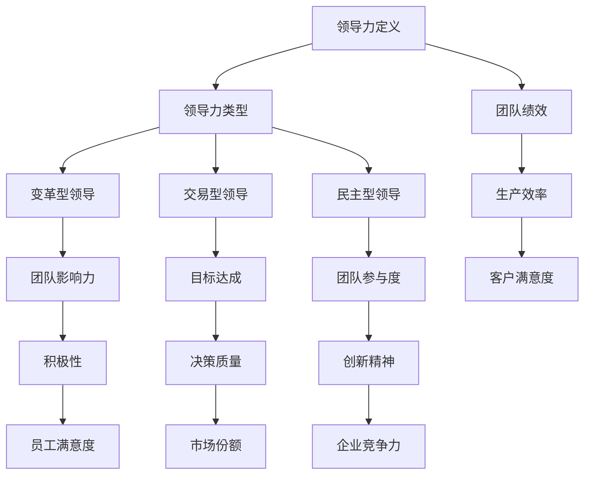

                 

### 1. 设计大纲

为了确保文章的全面性和逻辑清晰，我们首先需要设计出整体的目录结构。根据书籍的标题《领导力法则：打造超级团队的领导力秘笈》，我们可以将文章分为以下几个主要部分：

- **引言**：介绍领导力在团队管理中的重要性，为后续内容打下基础。
- **领导力的核心概念与联系**：阐述领导力的定义、类型及其与团队绩效之间的关系。
- **领导力法则介绍**：详细介绍书中将要介绍的领导力法则。
- **领导力法则案例分析**：通过实际案例展示领导力法则的应用和效果。
- **团队建设与领导力**：讨论领导力在团队建设中的关键作用。
- **领导力发展与实践**：介绍领导力发展的路径和策略。
- **领导力法则的持续优化**：探讨如何持续优化领导力法则。
- **结尾与总结**：对全书内容进行总结，并强调领导力法则的重要性。

通过这样的结构，我们可以确保文章内容全面且逻辑清晰，同时便于读者逐步理解和掌握领导力的核心概念和应用。

### 2. 核心概念与联系

领导力是一种影响力，它能够激发团队成员的积极性、引导团队向着共同的目标前进。领导力可以分为多种类型，如变革型领导、交易型领导、民主型领导等，每种类型都有其独特的特点和适用场景。领导力与团队绩效之间的关系是密不可分的，高效的领导力能够显著提升团队的绩效和生产力。

为了更直观地展示领导力的核心概念与联系，我们可以使用Mermaid流程图。以下是领导力核心概念之间的联系流程图：

通过这个流程图，我们可以清晰地看到领导力的各个核心概念及其相互之间的联系。例如，领导力能够通过提升团队的影响力和积极性，进而促进团队绩效和生产效率的提升。

### 3. 领导力法则介绍

在《领导力法则：打造超级团队的领导力秘笈》中，作者详细介绍了以下几个重要的领导力法则：

#### 3.1 信任法则

信任是领导力的基石。一个团队只有建立了信任，才能协同合作，共同面对挑战。信任法则强调领导者需要通过透明沟通、履行承诺和建立共同价值观来建立信任。以下是建立信任的实践方法：

- **透明沟通**：领导者需要保持信息的透明度，及时向团队成员传达重要信息，避免信息不对称。
- **履行承诺**：领导者要言行一致，做到自己承诺的事情，从而赢得团队成员的信任。
- **建立共同价值观**：领导者要引导团队形成共同的价值观，使团队成员在价值观上保持一致，从而增强团队的凝聚力。

#### 3.2 激励法则

激励法则认为，领导者需要通过激发团队成员的内在动机和外部奖励来提升团队的整体绩效。以下是实践中的激励策略：

- **内在动机激励**：领导者可以通过赋予团队成员更多的责任和自主权，激发他们的内在动机。
- **外部奖励激励**：领导者可以通过薪酬、晋升和其他形式的奖励来激励团队成员。

#### 3.3 沟通法则

沟通法则强调高效的沟通是领导力的重要组成部分。领导者需要掌握有效的沟通技巧，确保信息准确传达，避免误解和冲突。以下是高效沟通的实践方法：

- **主动倾听**：领导者要主动倾听团队成员的意见和反馈，尊重他们的观点。
- **明确表达**：领导者需要清晰、明确地表达自己的想法和指令，避免产生歧义。
- **建立反馈机制**：领导者要建立有效的反馈机制，确保团队成员的意见和建议能够得到及时反馈和回应。

### 4. 领导力法则案例分析

为了更深入地理解领导力法则的应用，我们可以通过以下三个实际案例来探讨领导力法则在团队管理中的具体实施和效果。

#### 4.1 案例一：如何在团队中建立信任

某科技公司的新产品开发团队在项目初期遇到了沟通不畅、协作不力的问题。为了解决这个问题，团队领导决定实施信任法则。首先，领导通过定期团队会议和一对一沟通，确保信息的透明度。其次，领导积极履行承诺，确保项目进度按时完成。最后，领导引导团队形成共同的价值观，如“客户至上”和“持续创新”。通过这些措施，团队逐渐建立了信任，项目进度明显加快，团队成员之间的协作更加顺畅。

#### 4.2 案例二：激励团队创造力

某创意广告公司在一次重要项目竞标中，需要提出独特的创意方案。为了激发团队的创造力，公司领导实施了激励法则。领导首先赋予团队成员更多的责任和自主权，让他们有更多机会提出创新的想法。其次，领导通过项目奖金和晋升机会等外部奖励，激励团队成员积极参与。最终，团队提出了一个独特的创意方案，赢得了竞标，为公司赢得了重要的客户。

#### 4.3 案例三：提升团队沟通效率

某大型制造企业的生产部门在项目实施过程中，频繁出现沟通不畅的问题，导致项目进度延误。为了解决这个问题，部门领导决定实施沟通法则。首先，领导组织了沟通培训，提升团队成员的沟通技巧。其次，领导建立了反馈机制，鼓励团队成员提出意见和建议。最后，领导通过定期团队会议和邮件报告等方式，确保信息能够及时、准确传达。通过这些措施，团队沟通效率显著提升，项目进度恢复正常。

### 5. 团队建设与领导力

领导力在团队建设中起着关键作用。一个优秀的领导者不仅能够提升团队的绩效，还能促进团队成员的个人成长和发展。以下是从三个方面讨论领导力在团队建设中的关键作用：

#### 5.1 团队沟通的技巧

高效的沟通是团队成功的关键。领导者需要掌握以下沟通技巧：

- **主动倾听**：领导者要主动倾听团队成员的意见和反馈，尊重他们的观点。
- **明确表达**：领导者需要清晰、明确地表达自己的想法和指令，避免产生歧义。
- **建立反馈机制**：领导者要建立有效的反馈机制，确保团队成员的意见和建议能够得到及时反馈和回应。

#### 5.2 团队成员积极性的激发

领导者需要通过多种方式激发团队成员的积极性：

- **赋予责任**：领导者可以赋予团队成员更多的责任和自主权，让他们有更多机会展示自己的能力和潜力。
- **激励奖励**：领导者可以通过薪酬、晋升和其他形式的奖励，激励团队成员积极参与。
- **提供成长机会**：领导者可以提供培训和学习机会，帮助团队成员不断提升自己的技能和知识。

#### 5.3 团队协作的提升

领导者需要通过以下方式提升团队的协作能力：

- **明确目标**：领导者要确保团队成员明确共同的目标和愿景，增强团队的凝聚力。
- **优化流程**：领导者可以优化团队的工作流程，减少不必要的环节和等待时间。
- **建立信任**：领导者要建立团队成员之间的信任，鼓励他们相互支持和合作。

### 6. 领导力发展与实践

领导力是一种可以通过学习和实践不断提升的能力。以下是从三个方面介绍领导力发展的路径和策略：

#### 6.1 自我提升的策略

领导者可以通过以下方式自我提升：

- **阅读学习**：领导者可以通过阅读领导力相关的书籍和文章，了解最新的领导力理论和实践。
- **参加培训**：领导者可以参加领导力培训课程，学习领导力技能和策略。
- **实践反思**：领导者需要通过实践来检验自己的领导力，并在实践中不断反思和改进。

#### 6.2 领导力培训

领导力培训是提升领导力的重要途径。以下是一些有效的领导力培训方法：

- **工作坊**：通过角色扮演、案例分析等方式，让领导者体验不同的领导场景，提升他们的领导技能。
- **研讨会**：组织领导力研讨会，邀请专家分享领导力经验，让领导者学习借鉴。
- **在线课程**：利用在线平台，提供多样化的领导力课程，让领导者随时随地学习。

#### 6.3 实践中的领导力提升

领导者需要在实践中不断提升自己的领导力：

- **参与项目**：领导者可以参与不同类型的项目，锻炼自己的领导能力。
- **反馈与指导**：领导者需要接受团队成员的反馈，并在团队中提供指导和支持。
- **反思与总结**：领导者需要定期反思自己的领导实践，总结经验教训，不断提升自己的领导水平。

### 7. 领导力法则的持续优化

领导力不是一成不变的，它需要根据团队和市场变化不断优化。以下是从三个方面探讨如何持续优化领导力法则：

#### 7.1 领导力评估

领导者需要定期评估自己的领导力，识别优势和不足，制定改进计划。以下是一些常用的领导力评估方法：

- **360度评估**：通过团队成员、上级和下级的反馈，全面评估领导者的领导力。
- **行为观察**：通过观察领导者的行为，评估其领导风格和效果。
- **绩效考核**：通过领导者的绩效考核结果，评估其领导力对团队绩效的影响。

#### 7.2 团队和市场变化

领导者需要关注团队和市场变化，及时调整领导力策略：

- **团队变化**：当团队人员变动或团队结构发生变化时，领导者需要调整领导策略，以适应新的团队环境。
- **市场变化**：当市场环境发生变化时，领导者需要根据市场需求和竞争态势，调整领导力策略，保持团队的竞争力。

#### 7.3 领导力法则的调整与优化

领导者需要根据评估结果和团队市场变化，持续优化领导力法则：

- **更新知识**：领导者需要不断更新自己的知识和技能，掌握最新的领导力理论和实践。
- **改进实践**：领导者需要在实践中不断改进自己的领导方式，提升领导效果。
- **反馈与迭代**：领导者需要接受团队成员的反馈，持续优化领导力法则，实现领导力的不断提升。

### 8. 结尾与总结

领导力是团队管理中至关重要的一环。通过《领导力法则：打造超级团队的领导力秘笈》，我们了解了领导力的核心概念、类型和法则。领导力不仅能够提升团队的绩效，还能促进团队成员的个人成长和发展。在团队建设中，领导者需要掌握有效的沟通技巧、激发团队成员的积极性和提升团队协作能力。通过自我提升、领导力培训和实践，领导者可以不断提升自己的领导水平。同时，领导者还需要根据团队和市场变化，持续优化领导力法则，实现领导力的不断提升。

### 9. 附录

#### A. 领导力工具和资源

- **领导力评估工具**：如360度评估表、领导力行为观察表等。
- **领导力培训资源**：如在线课程平台、领导力书籍等。
- **团队建设工具**：如团队沟通平台、协作工具等。

#### B. 实用的领导力模型和框架

- **变革型领导模型**：如赫塞与布兰查德的情境领导模型。
- **团队建设模型**：如贝尔宾的团队角色模型、五要素团队建设模型等。
- **激励理论模型**：如马斯洛的需求层次理论、赫茨伯格的双因素理论等。

### 作者信息

作者：AI天才研究院/AI Genius Institute & 禅与计算机程序设计艺术 /Zen And The Art of Computer Programming

---

通过这篇博客文章，我们希望读者能够对领导力法则有更深入的理解，并在实际工作中能够灵活运用这些法则，打造出高效的超级团队。领导力不是一蹴而就的，它需要持续的学习和实践。让我们共同努力，不断提升自己的领导力，为团队和组织的发展贡献自己的力量。

