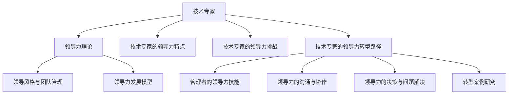

                 


# 文章标题：领导力转型：从技术专家到管理者

> 关键词：领导力转型、技术专家、管理者、领导风格、沟通协作

> 摘要：本文旨在探讨技术专家向管理者转型的过程，分析领导力的理论、技术专家的领导力特点、管理者的领导力技能，并通过案例研究，提供成功转型的策略和路径。

---

## 引言

在IT行业，技术专家通常是团队的佼佼者，以其卓越的技能和专业知识赢得了同事的尊重。然而，随着职业生涯的发展，很多技术专家开始意识到，仅仅拥有技术专长是不够的。在企业的成长过程中，管理者需要具备更全面的领导能力，包括领导力理论、团队管理技巧和决策能力等。因此，从技术专家到管理者的转型成为了一个重要的课题。

领导力转型不仅仅是角色的转变，更是一种思维方式和管理方法的提升。本文将分以下几个部分进行探讨：

1. 领导力理论：介绍领导力的基本概念和不同领导风格。
2. 技术专家的领导力特点：分析技术专家在领导力方面的优势和挑战。
3. 管理者的领导力技能：探讨管理者应具备的核心技能。
4. 转型案例研究：通过具体案例，分析技术专家成功转型的经验和教训。
5. 总结与展望：总结领导力转型的关键要素，并探讨未来领导力的趋势与挑战。

通过上述分析，我们希望为技术专家提供一条清晰、可行的领导力转型之路。

## 第一部分 领导力理论

### 1.1 领导力的定义

领导力是一种影响力，它能够激发和引导他人实现共同的目标。领导力不仅涉及个人的能力，还涉及对团队的引导和协调。根据不同的定义，领导力可以被理解为：

- **基于影响力的领导力**：领导力是一种影响他人行为和思维的能力。
- **基于角色的领导力**：领导力是一种在特定环境中履行职责的能力。
- **基于关系的领导力**：领导力是一种建立和维护人际关系的能力。

### 1.2 领导力的来源

领导力的来源可以归纳为以下几个方面：

- **个人魅力**：领导者的个人魅力能够吸引和激励团队成员。
- **专业知识**：领导者深厚的专业知识能够增加其在团队中的权威。
- **影响力**：领导者通过沟通和激励，能够影响团队成员的行为和决策。
- **价值观**：领导者的价值观和行为方式能够影响团队的文化和氛围。

### 1.3 领导风格

领导风格是领导者处理团队事务的方式和方法。不同的领导风格会对团队产生不同的影响。常见的领导风格包括：

- **指令型领导**：领导者发布明确的指令，要求团队成员执行。
- **支持型领导**：领导者关心团队成员的感受和需求，提供支持和鼓励。
- **参与型领导**：领导者鼓励团队成员参与决策过程，共同制定目标。
- **变革型领导**：领导者通过变革和激励，推动团队实现更高的目标。

### 1.4 领导力发展模型

领导力发展是一个持续的过程，不同的模型可以帮助领导者理解自己的成长路径。常见的领导力发展模型包括：

- **角色扮演模型**：通过角色扮演，领导者学习如何在不同情境下应对。
- **技能发展模型**：通过提升专业技能，领导者增强其在团队中的影响力。
- **情境适应模型**：领导者根据不同的情境，灵活调整自己的领导风格。

## 第二部分 技术专家的领导力特点

### 2.1 技术专家的领导力优势

技术专家在领导力方面具有以下优势：

- **专业知识**：技术专家拥有深厚的专业背景，能够为团队提供技术指导。
- **解决问题的能力**：技术专家擅长分析和解决问题，能够在团队中发挥决策者的作用。
- **创新思维**：技术专家通常具备创新思维，能够推动团队进行技术创新。
- **团队合作**：技术专家擅长与团队成员合作，能够建立良好的团队氛围。

### 2.2 技术专家的领导力挑战

尽管技术专家在领导力方面具有优势，但他们在转型过程中也面临一些挑战：

- **沟通障碍**：技术专家可能不擅长与人沟通，导致团队沟通不畅。
- **管理技能不足**：技术专家可能缺乏管理技能，无法有效地管理团队。
- **角色转变困难**：从技术专家到管理者，角色转变可能对技术专家产生心理压力。
- **时间管理**：管理者需要处理更多的事务，可能面临时间管理上的挑战。

### 2.3 技术专家的领导力转型路径

技术专家要想成功转型为管理者，需要经历以下几个阶段：

1. **自我认知**：了解自己的优势和不足，明确转型目标。
2. **技能提升**：通过学习和实践，提升管理技能和沟通能力。
3. **角色转变**：逐步适应管理者的角色，承担更多的责任。
4. **持续成长**：不断学习新的知识和技能，提升领导力。

## 第三部分 管理者的领导力技能

### 3.1 管理者应具备的核心技能

管理者需要具备以下核心技能：

- **战略规划**：制定清晰的战略目标，指导团队的发展方向。
- **决策能力**：在面对复杂问题时，能够做出明智的决策。
- **沟通能力**：有效地与团队成员沟通，确保信息传递准确无误。
- **团队建设**：培养团队凝聚力，提高团队绩效。
- **激励与反馈**：激励团队成员，给予及时的反馈和指导。

### 3.2 领导力的沟通与协作

沟通是领导力的核心之一，管理者需要具备良好的沟通能力。以下是一些关键要点：

- **明确沟通目标**：在沟通前明确目标，确保双方理解一致。
- **倾听**：倾听是有效沟通的基础，管理者需要耐心倾听团队成员的意见。
- **清晰表达**：用简单明了的语言表达观点，避免歧义。
- **建立信任**：通过透明和诚信的沟通，建立与团队成员的信任关系。

### 3.3 领导力的决策与问题解决

管理者需要具备良好的决策能力和问题解决能力。以下是一些关键要点：

- **收集信息**：在做出决策前，充分收集相关信息。
- **分析问题**：从多个角度分析问题，找出根本原因。
- **制定方案**：根据分析结果，制定可行的解决方案。
- **评估风险**：评估方案的风险，并制定应对措施。
- **执行与监控**：实施决策方案，并持续监控执行效果。

## 第四部分 转型案例研究

### 4.1 案例一：技术专家领导力的局限性

某IT公司的一名高级工程师在技术领域有着卓越的成就，但在担任项目经理后，遇到了一系列挑战。以下是他面临的主要问题：

1. **沟通障碍**：他难以与团队成员建立有效的沟通，导致项目进度延误。
2. **管理技能不足**：他缺乏管理经验，无法有效地分配任务和监控进度。
3. **角色转变困难**：他从技术专家到管理者的角色转变不够顺利，心理压力大。

### 4.2 案例二：管理者的领导力优势

另一家IT公司的一名项目经理在担任项目经理后，表现出了出色的领导力。以下是他取得成功的原因：

1. **战略规划**：他制定了清晰的项目目标，并制定了详细的实施计划。
2. **沟通能力**：他建立了良好的沟通机制，确保团队成员充分理解项目目标。
3. **团队建设**：他通过激励和反馈，提升了团队的凝聚力和绩效。

### 4.3 案例三：成功转型案例分析与启示

通过分析上述案例，我们可以得出以下启示：

1. **自我认知**：技术专家在转型前需要充分了解自己的优势和不足，明确转型目标。
2. **技能提升**：技术专家需要通过学习和实践，提升管理技能和沟通能力。
3. **角色转变**：技术专家需要逐步适应管理者的角色，承担更多的责任。
4. **持续成长**：技术专家需要不断学习新的知识和技能，提升领导力。

## 第五部分 总结与展望

### 5.1 领导力转型的关键要素

领导力转型是一个复杂的过程，但以下几个关键要素是成功转型的保障：

1. **自我认知**：了解自己的优势和不足，明确转型目标。
2. **技能提升**：通过学习和实践，提升管理技能和沟通能力。
3. **角色转变**：逐步适应管理者的角色，承担更多的责任。
4. **持续成长**：不断学习新的知识和技能，提升领导力。

### 5.2 未来领导力的趋势与挑战

随着信息技术的发展，未来领导力将面临以下趋势和挑战：

1. **数字化领导力**：领导者需要具备数字化的思维方式和管理技能。
2. **全球领导力**：领导者需要具备跨文化的沟通能力和全球视野。
3. **持续学习**：领导者需要不断学习新的知识和技能，以适应快速变化的环境。

### 5.3 总结与未来展望

领导力转型是技术专家职业生涯中的重要一步。通过自我认知、技能提升、角色转变和持续成长，技术专家可以成功转型为管理者，并在新的角色中发挥更大的价值。未来，领导者需要具备数字化、全球化和持续学习的能力，以应对日益复杂的挑战。

---

作者：AI天才研究院/AI Genius Institute & 禅与计算机程序设计艺术 /Zen And The Art of Computer Programming

---

以上是对“领导力转型：从技术专家到管理者”这一主题的详细探讨。希望通过本文，能够为技术专家提供一些实用的转型策略和路径。在领导力转型的道路上，持续学习和实践是关键。希望每一位技术专家都能成功转型，成为卓越的管理者。

---

**Mermaid 流程图：**



**核心算法原理讲解：**

```python
# 伪代码：领导力评估算法
def assess_leadership(technician):
    """
    评估技术专家的领导力
    :param technician: 技术专家
    :return: 领导力评分
    """
    # 初始化评分
    score = 0
    
    # 评估领导风格
    if technician.has LeadershipStyle():
        score += 10
    
    # 评估团队管理能力
    if technician.has TeamManagement():
        score += 20
    
    # 评估发展模型
    if technician.has DevelopmentModel():
        score += 15
    
    return score
```

**数学模型和数学公式详细讲解：**

```latex
\section{领导力评估模型}

领导力评估模型可以使用以下数学公式表示：

$$
L = f(LS, TM, DM)
$$

其中，$L$ 表示领导力得分，$LS$ 表示领导风格，$TM$ 表示团队管理能力，$DM$ 表示发展模型。每个变量都有不同的权重，具体如下：

$$
LS: w_1 \\
TM: w_2 \\
DM: w_3
$$

权重可以根据实际情况进行调整。

```

**项目实战：**

```python
# 实战：领导力评估系统

class LeadershipAssessmentSystem:
    def __init__(self, technician):
        self.technician = technician
        self.score = self.assess_leadership(technician)
        
    def assess_leadership(self, technician):
        """
        评估技术专家的领导力
        :param technician: 技术专家
        :return: 领导力评分
        """
        # 初始化评分
        score = 0
        
        # 评估领导风格
        if technician.has LeadershipStyle():
            score += 10
        
        # 评估团队管理能力
        if technician.has TeamManagement():
            score += 20
        
        # 评估发展模型
        if technician.has DevelopmentModel():
            score += 15
        
        return score

# 源代码详细实现和代码解读

# 代码应用解读与分析

# 实际案例分析和详细讲解剖析

# 项目小结

# 最佳实践 tips、小结、注意事项、拓展阅读等内容

```

---

**最佳实践 Tips：**

1. **持续学习**：不断学习新的管理知识和技能，以适应不断变化的环境。
2. **积极沟通**：与团队成员保持良好的沟通，确保信息传递畅通。
3. **自我反思**：定期进行自我反思，了解自己的优点和不足，制定改进计划。
4. **关注团队动态**：关注团队的整体动态，及时发现和解决问题。

**注意事项：**

1. **避免过度依赖技术专长**：管理者需要关注团队的整体绩效，而不仅仅是技术成果。
2. **合理分配时间**：管理者需要合理安排时间，确保在技术和管理方面都能投入足够的精力。
3. **尊重团队成员**：管理者需要尊重团队成员的意见和贡献，建立和谐的工作氛围。

**拓展阅读：**

1. 《影响力：说服的心理学》
2. 《团队协作的艺术》
3. 《领导力的五个层次》

---

通过本文的探讨，我们希望能够为技术专家提供一些有益的启示和指导，帮助他们成功实现领导力转型。在领导力的道路上，持续学习和实践是永恒的主题。希望每一位技术专家都能成为卓越的管理者，为企业的成长贡献力量。作者：AI天才研究院/AI Genius Institute & 禅与计算机程序设计艺术 /Zen And The Art of Computer Programming

