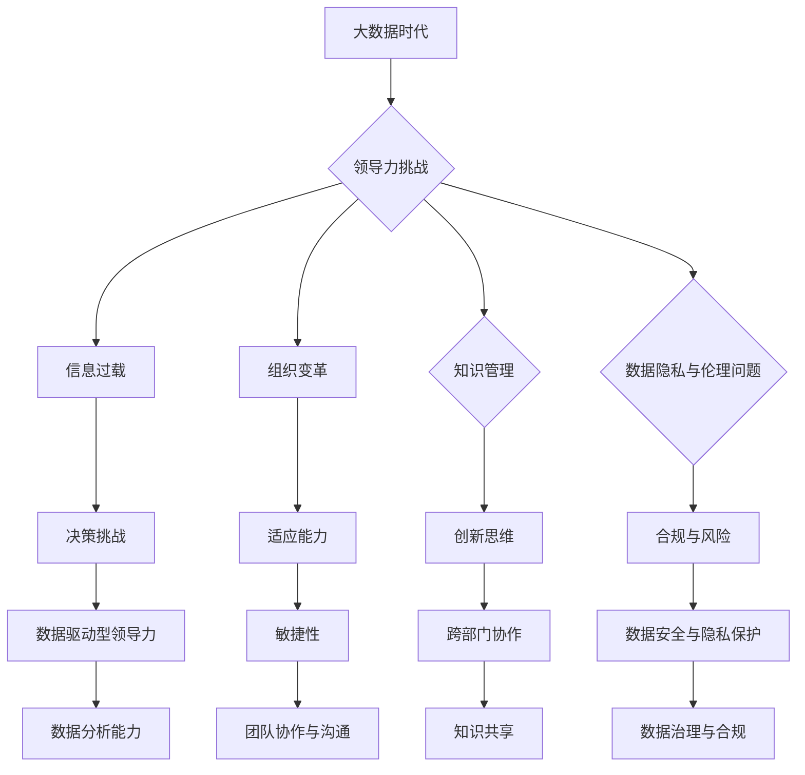

                 

### 《领导力进化论：大数据时代管理者的领导力修炼》

#### 关键词：

- 大数据时代
- 领导力
- 管理者
- 数据驱动型决策
- 领导力发展

#### 摘要：

本文旨在探讨大数据时代管理者的领导力修炼。随着大数据技术的飞速发展，领导者面临着前所未有的挑战和机遇。本文将首先介绍大数据时代的背景与挑战，随后深入分析领导力的基本概念、模型与理论。在此基础上，探讨大数据时代领导力所面临的挑战，如信息过载、组织变革和数据隐私等。文章还将探讨数据驱动型领导力的核心要素，如数据分析能力、团队协作和创新思维。最后，本文将提供实用的领导力发展路径、持续学习方法和成功案例，以期为大数据时代的管理者提供有价值的指导。

## 第一部分：引言

### 1. 引言

#### 1.1 大数据时代的背景与挑战

大数据时代已经到来，它不仅改变了我们的生活方式，也深刻影响着企业的运营模式。大数据是指那些规模巨大、类型繁多、价值密度较低但潜在价值极高的数据集合。这些数据来源于各种渠道，包括社交媒体、物联网设备、传感器、交易记录等。大数据技术的核心在于如何高效地存储、管理和分析这些数据，以提取有价值的信息和洞察。

在大数据时代，企业面临着诸多挑战。首先，信息过载成为了一个普遍问题。数据量的急剧增长使得管理者难以从海量的数据中提取有用的信息。其次，组织变革成为了一个迫切需要解决的问题。在大数据环境下，组织需要迅速适应新的技术和市场变化，这要求领导者具备更高的适应能力和创新精神。此外，数据隐私和伦理问题也日益凸显，如何在保护用户隐私的同时利用数据创造价值，成为管理者面临的一大难题。

#### 1.2 管理者的领导力面临的变革

大数据时代的到来对管理者的领导力提出了新的要求。传统的领导力模型和理论已经不足以应对复杂多变的环境。首先，领导者需要具备更强的数据分析和解读能力。随着数据的爆炸性增长，管理者需要能够从海量数据中提取有价值的信息，从而做出更加明智的决策。其次，领导者需要具备更高的团队协作和沟通能力。在大数据时代，团队之间的协作和知识共享变得尤为重要，领导者需要能够有效地激励和协调团队成员，实现共同的目标。此外，领导者还需要具备创新思维和变革能力。面对快速变化的市场环境，领导者需要勇于尝试新的方法和思路，推动组织的持续创新和发展。

#### 1.3 书籍目的与结构安排

本书旨在探讨大数据时代管理者的领导力修炼，帮助读者理解大数据时代领导力的核心要素和应对策略。本书共分为五个部分：

- 第一部分：引言，介绍大数据时代的背景与挑战，以及管理者的领导力面临的变革。
- 第二部分：领导力基础，探讨领导力的基本概念、模型与理论。
- 第三部分：大数据时代领导力的挑战，分析大数据时代领导力所面临的挑战。
- 第四部分：培养大数据时代领导力的能力，讨论如何增强数据分析能力、团队协作与沟通能力以及创新思维和适应变革能力。
- 第五部分：领导力修炼，提供自我领导力发展、领导力发展的路径和持续学习的方法。

通过本书的阅读，读者将能够深入了解大数据时代领导力的本质和内涵，掌握有效的领导力发展策略，从而成为更加优秀的大数据时代领导者。

## 第二部分：领导力基础

### 2. 领导力的基本概念

#### 2.1 领导力的定义

领导力是一种能力，是指通过影响和激励他人来实现共同目标的过程。领导力不仅仅是管理，它涉及到领导者如何与团队成员建立关系，如何制定愿景和战略，以及如何动员和指导团队去实现这些目标。领导力不仅仅是关于指挥和控制，更重要的是关于影响和引领。

在组织管理中，领导力具有至关重要的意义。首先，领导力能够激励团队成员，提升团队的士气和动力。一个优秀的领导者能够激发团队成员的潜能，使他们更加积极地投入到工作中。其次，领导力有助于制定和实施有效的策略。领导者通过制定明确的愿景和目标，并引导团队共同实现这些目标，从而推动组织的发展。最后，领导力能够促进团队的协作和知识共享。一个优秀的领导者能够建立一个开放、协作和共享的文化，从而提升团队的整体效能。

#### 2.2 领导力的重要性

领导力在组织管理中的重要性不言而喻。首先，领导力是组织发展的关键。一个组织的发展离不开优秀的领导者。领导者能够为组织制定清晰的愿景和目标，并引导团队共同实现这些目标。其次，领导力能够提升团队的绩效。一个优秀的领导者能够激发团队成员的潜力，使他们更加积极地投入到工作中，从而提升团队的绩效。此外，领导力还能够促进组织的创新和发展。一个具有创新精神的领导者能够推动组织不断进行创新，从而在激烈的市场竞争中保持优势。

#### 2.3 领导力的核心要素

领导力包括多个核心要素，这些要素共同构成了一个优秀的领导者。以下是一些关键的领导力核心要素：

1. **愿景和目标设定**：一个优秀的领导者能够清晰地描述组织的愿景和目标，并使团队成员理解和认同这些目标。通过设定明确的愿景和目标，领导者能够为团队提供方向和动力。

2. **影响力**：领导力不仅仅是关于权力和控制，更重要的是关于影响力。一个优秀的领导者能够通过影响力来激励和引导团队成员，使他们朝着共同的目标努力。

3. **沟通能力**：沟通是领导力的关键要素。一个优秀的领导者需要具备良好的沟通能力，能够有效地与团队成员进行沟通，理解他们的需求和期望，并传递组织的愿景和目标。

4. **团队建设**：领导力涉及到团队的建设和管理。一个优秀的领导者需要能够建立一支高效的团队，通过合理的分工和协作，实现团队的目标。

5. **决策能力**：领导力还涉及到决策能力。一个优秀的领导者需要能够在复杂多变的环境中做出明智的决策，从而推动组织的发展。

6. **变革管理**：在快速变化的市场环境中，领导力还需要涉及到变革管理。一个优秀的领导者需要能够推动组织进行变革，以适应新的市场和技术环境。

#### 2.4 领导力的模型与理论

领导力有多个模型和理论，以下介绍几个主要的模型和理论：

1. **领导力行为模型**：领导力行为模型认为领导力是通过领导者的行为表现来体现的。这种模型将领导力分为两个维度：任务行为和关系行为。任务行为关注领导者的任务导向行为，如设定目标、分配任务等；关系行为关注领导者与团队成员之间的关系，如提供支持、建立信任等。

2. **路径-目标理论**：路径-目标理论认为领导者的作用是帮助团队成员明确目标，并为他们提供实现目标的路径和支持。领导者通过调整自己的领导行为，以适应团队成员的需要和环境的变化，从而提高团队绩效。

3. **情境领导理论**：情境领导理论认为领导者的风格需要根据团队成员的能力和环境的变化进行调整。这种理论将领导者的风格分为四种：指导型、支持型、参与型和授权型。领导者需要根据团队成员的能力和环境的变化，选择合适的领导风格。

4. **变革领导理论**：变革领导理论关注领导者在推动组织变革中的作用。领导者需要具备变革思维和变革能力，通过制定清晰的变革愿景、建立变革联盟、推动变革实施等方式，推动组织实现变革。

#### 2.4.1 走向成功的领导者特征

一个成功的领导者通常具备以下特征：

1. **自信和决心**：成功的领导者充满自信，对自己的决策和领导能力充满信心。他们具有坚定的决心，能够克服困难和挑战，推动组织向前发展。

2. **敏锐的洞察力**：成功的领导者具备敏锐的洞察力，能够快速理解复杂的问题，并找到有效的解决方案。

3. **良好的沟通能力**：成功的领导者具备出色的沟通能力，能够清晰地表达自己的想法，理解团队成员的需求和期望，并建立良好的合作关系。

4. **灵活性和适应性**：成功的领导者能够灵活应对变化，快速适应新的环境和挑战，推动组织的持续创新和发展。

5. **高度的责任感**：成功的领导者具备高度的责任感，对自己的行为和决策负责，对组织的成功和发展负责。

6. **团队合作精神**：成功的领导者具备团队合作精神，能够与团队成员建立良好的合作关系，共同实现组织的目标。

#### 2.4.2 领导风格与领导效能

领导风格对领导效能有重要影响。不同的领导风格适用于不同的情境和团队。以下介绍几种常见的领导风格及其特点：

1. **权威型领导风格**：权威型领导者倾向于集中决策和控制，由领导者独自制定决策和指导团队。这种风格适用于任务明确、团队需要强有力领导的情境。

2. **民主型领导风格**：民主型领导者鼓励团队成员参与决策过程，尊重团队成员的意见和反馈。这种风格适用于团队需要高度协作、成员具备自主性和创造性的情境。

3. **参与型领导风格**：参与型领导者注重与团队成员建立密切的关系，提供支持和指导，帮助团队成员发展技能和实现个人目标。这种风格适用于团队成员需要心理支持、自我实现的情境。

4. **变革型领导风格**：变革型领导者通过激励和启发团队成员，推动组织实现变革和创新发展。这种风格适用于组织需要变革、创新和适应新环境的情境。

#### 2.4.3 领导力发展路径

领导力的发展是一个持续的过程，需要不断学习和实践。以下是一些领导力发展的路径：

1. **自我反思和自我提升**：领导者需要通过自我反思，了解自己的优点和不足，并制定提升计划。通过阅读书籍、参加培训、反思工作经历等方式，不断提升自己的领导能力。

2. **实践和经验积累**：领导者需要通过实际工作经历，不断实践和验证自己的领导理论。在实际工作中，领导者需要面对各种挑战和问题，通过解决这些问题，不断提升自己的领导能力。

3. **学习和借鉴**：领导者需要学习和借鉴其他成功领导者的经验和方法。通过研究成功案例、参加行业会议和研讨会、与优秀领导者交流等方式，获取宝贵的经验和启示。

4. **建立人际关系网络**：领导者需要建立广泛的人际关系网络，与不同背景和领域的人建立联系。通过人际关系网络，领导者可以获取资源和信息，提高自己的领导效能。

5. **参与变革和领导项目**：领导者需要积极参与变革和领导项目，通过这些项目，锻炼自己的领导能力和实践能力。在变革项目中，领导者需要面对复杂的问题和挑战，通过实践，不断提升自己的领导力。

## 第三部分：大数据时代领导力的挑战

### 3. 大数据时代领导力面临的挑战

#### 3.1 信息过载与决策挑战

大数据时代的显著特征之一是数据量的爆炸性增长。这种增长带来了信息过载的问题，对管理者的决策能力提出了严峻的挑战。管理者需要从海量的数据中提取有用的信息，以便做出明智的决策。然而，信息的过量可能导致以下问题：

1. **注意力分散**：在处理大量数据时，管理者可能会陷入细节，而忽略了关键信息，从而分散注意力，影响决策质量。
2. **误判风险**：海量数据中可能包含噪音和错误信息，这些信息可能会误导管理者，导致错误的决策。
3. **时间压力**：决策所需的时间可能会因为数据的复杂性而延长，这可能导致管理者在压力下做出仓促的决定。

为了应对信息过载和决策挑战，管理者可以采取以下策略：

1. **数据筛选与预处理**：在处理数据之前，先对数据进行筛选和预处理，去除冗余和无用的信息，以便更高效地分析关键数据。
2. **使用数据分析工具**：利用先进的数据分析工具，如数据挖掘、机器学习算法等，帮助管理者从海量数据中提取有价值的信息。
3. **建立数据驱动型决策流程**：制定系统化的决策流程，确保决策过程的透明度和可追溯性，从而减少误判的风险。
4. **团队协作**：鼓励团队成员参与决策过程，利用团队的集体智慧，提高决策的质量。

#### 3.2 组织变革与适应能力

大数据时代要求组织具备快速适应变化的能力。随着新技术的不断涌现和市场环境的快速变化，组织需要不断调整其战略和运营模式，以保持竞争力。这要求领导者具备以下能力：

1. **敏捷性**：领导者需要具备敏捷性，能够快速响应市场变化，调整组织的战略和运营模式。
2. **持续学习**：领导者需要不断学习新知识和技能，以适应不断变化的环境。这包括学习新技术、新管理方法等。
3. **文化变革**：领导者需要推动组织文化的变革，鼓励创新和开放，为员工提供支持和激励，以适应新的工作环境。

为了实现组织变革和适应能力，管理者可以采取以下措施：

1. **建立学习型组织**：通过培训、研讨会和内部交流等方式，建立学习型组织，鼓励员工不断学习和成长。
2. **建立敏捷团队**：将组织划分为小团队，每个团队负责特定的任务和项目，以实现快速响应和高效执行。
3. **推动文化变革**：通过制定明确的价值观和行为准则，推动组织文化的变革，鼓励员工创新和开放。

#### 3.3 知识管理的重要性

在大数据时代，知识管理成为领导力的重要组成部分。知识管理不仅涉及到数据的收集、存储和分析，还包括知识的共享和应用。有效的知识管理可以帮助组织：

1. **提升竞争力**：通过共享和应用知识，组织可以更快地解决问题，提高决策质量，从而在市场竞争中占据优势。
2. **促进创新**：知识共享可以激发员工的创新思维，促进新产品的开发和市场扩展。
3. **降低风险**：通过知识管理，组织可以更好地应对市场变化和风险，提高抗风险能力。

为了实现有效的知识管理，管理者可以采取以下策略：

1. **建立知识共享平台**：建立一个集中的知识共享平台，方便员工访问和分享知识。
2. **制定知识管理政策**：明确知识管理的目标和政策，确保知识共享和应用的有序进行。
3. **培养知识管理文化**：鼓励员工积极参与知识共享，建立知识管理文化，将知识管理融入组织的日常运营。

#### 3.4 数据隐私与伦理问题

随着大数据技术的发展，数据隐私和伦理问题日益突出。管理者在利用数据创造价值的同时，必须确保用户的隐私和数据安全。以下是一些关键问题：

1. **用户隐私保护**：管理者需要确保用户数据的隐私，不得未经用户同意收集、使用和共享用户数据。
2. **数据安全**：管理者需要采取有效的数据安全措施，防止数据泄露、篡改和滥用。
3. **伦理责任**：管理者需要承担伦理责任，确保数据的使用符合道德和法律规范。

为了解决数据隐私和伦理问题，管理者可以采取以下措施：

1. **制定数据隐私政策**：明确数据收集、使用和共享的规则，确保用户知情并同意。
2. **加强数据安全防护**：采用先进的数据加密、防火墙和网络安全技术，确保数据的安全。
3. **加强伦理培训**：对员工进行数据伦理培训，提高员工的伦理意识和责任感。
4. **建立监管机制**：建立内部监管机制，确保数据的使用符合伦理和法律规范。

通过上述策略，管理者可以在大数据时代有效地应对信息过载、组织变革、知识管理和数据隐私等挑战，提升领导力，推动组织的持续发展。

## 4. 数据驱动型领导力

#### 4.1 数据驱动型决策

数据驱动型领导力强调通过数据分析和决策来指导组织的行为和战略。这种领导力模式要求领导者不仅具备数据解读能力，还要能够将数据转化为实际的决策行动。以下是数据驱动型决策的几个关键步骤：

1. **明确决策目标**：在开始数据驱动型决策之前，领导者需要明确决策的目标和关键指标。这有助于确定哪些数据是相关的，从而提高决策的有效性。

2. **收集数据**：根据决策目标，领导者需要收集相关的数据。这些数据可以来自内部系统、外部市场研究、竞争对手分析等。确保数据的质量和完整性是关键。

3. **数据清洗和预处理**：收集到的数据可能包含错误、冗余或不一致的信息。领导者需要对数据进行清洗和预处理，以确保数据的质量。

4. **数据分析**：利用数据分析工具和技术，如数据挖掘、机器学习和统计分析，对预处理后的数据进行分析。这一步骤的目的是提取数据中的有价值信息，为决策提供依据。

5. **可视化与解释**：将分析结果通过图表、报表等形式进行可视化，并对其进行解释。这有助于领导者更好地理解数据，从而做出更明智的决策。

6. **决策实施**：根据数据分析结果，领导者需要制定具体的行动计划，并确保决策得到有效实施。这包括资源分配、任务分配和时间表制定等。

7. **监控与反馈**：在决策实施过程中，领导者需要持续监控决策的效果，并根据实际情况进行反馈和调整。这有助于确保决策的有效性和适应性。

#### 4.2 数据分析与可视化

数据分析是数据驱动型领导力的核心。通过数据分析，领导者可以从海量数据中提取有价值的信息，为决策提供支持。以下是数据分析的关键步骤：

1. **数据探索**：在数据分析的初期，领导者需要对数据进行探索，了解数据的分布、异常值和趋势。这有助于确定哪些变量是重要的，从而为后续分析提供方向。

2. **数据预处理**：对数据集进行清洗、归一化和特征选择等预处理步骤，以提高数据分析的质量和效率。这一步骤的目的是去除噪声和冗余信息，确保数据的质量。

3. **统计分析**：利用统计方法，如均值、中位数、标准差等，对数据进行描述性分析。这有助于领导者了解数据的整体特征和趋势。

4. **关联分析**：通过关联分析，领导者可以探索不同变量之间的关系。这有助于发现数据中的潜在模式和规律。

5. **预测分析**：利用预测模型，如回归分析、时间序列分析等，领导者可以预测未来的趋势和结果。这有助于制定长远的战略和计划。

6. **可视化**：将数据分析结果通过图表、报表等形式进行可视化。这有助于领导者更好地理解数据，从而做出更明智的决策。

数据分析的可视化尤为重要，因为它能够直观地展示数据，使领导者更容易发现数据中的模式、趋势和异常。以下是一些常用的数据可视化工具和技术：

- **图表类型**：包括柱状图、折线图、饼图、散点图等。每种图表都有其特定的用途和优势。
- **交互式可视化**：使用交互式可视化工具，如Tableau、Power BI等，领导者可以动态地探索数据，进行实时分析和决策。
- **地理信息系统（GIS）**：用于可视化地理数据，如地图、热点图等，有助于领导者理解数据的空间分布和地理趋势。
- **热力图**：用于显示数据集中的热力分布，有助于领导者识别数据中的关键区域和异常值。
- **词云**：用于可视化文本数据中的关键词频率，有助于领导者理解文本数据的主旨和重点。

#### 4.3 利用数据优化决策过程

利用数据优化决策过程是数据驱动型领导力的关键。以下是一些策略和方法，帮助领导者通过数据优化决策过程：

1. **数据驱动的优先级设置**：通过数据分析，领导者可以确定哪些决策和行动具有最高的优先级。这有助于领导者集中资源，优先处理关键问题。

2. **情景分析**：通过情景分析，领导者可以模拟不同决策方案在不同情景下的表现。这有助于领导者评估不同决策的风险和收益，从而做出更明智的选择。

3. **动态决策支持系统**：建立动态决策支持系统，领导者可以实时监控数据和决策结果，及时调整决策策略。这种系统能够为领导者提供即时的反馈和指导。

4. **跨部门协作**：通过数据共享和跨部门协作，领导者可以整合不同部门和团队的数据和信息，实现更全面的决策支持。

5. **持续学习和改进**：领导者需要持续学习和改进数据驱动型决策方法。通过不断的实践和反馈，领导者可以优化决策过程，提高决策质量。

通过数据驱动型决策，领导者可以更加科学和有效地指导组织的运营和发展，从而在激烈的市场竞争中保持优势。

## 5. 培养大数据时代领导力的能力

#### 5.1 增强数据分析能力

在大数据时代，数据分析能力成为领导者不可或缺的技能。为了有效地培养数据分析能力，领导者可以采取以下策略：

1. **基础数学和统计学知识**：领导者应具备基础的数学和统计学知识，包括概率论、线性代数、回归分析等，这些知识有助于理解和应用数据分析方法。

2. **学习数据分析工具**：掌握常用的数据分析工具，如Python、R、SQL等，这些工具能够帮助领导者高效地进行数据清洗、分析和可视化。

3. **数据挖掘和机器学习**：了解数据挖掘和机器学习的基本概念和方法，如聚类、分类、关联规则挖掘等，这些技术可以帮助领导者从海量数据中提取有价值的信息。

4. **实践和案例研究**：通过实际项目和案例研究，领导者可以将理论知识应用到实际场景中，不断积累经验和技能。

5. **持续学习**：数据分析领域不断发展，领导者需要持续学习最新的技术和方法，保持自身的竞争力。

#### 5.2 提升团队协作与沟通能力

大数据时代要求领导者具备出色的团队协作和沟通能力。以下是一些提升团队协作和沟通能力的策略：

1. **建立明确的沟通机制**：制定清晰的沟通计划和流程，确保团队成员之间能够及时、有效地传递信息。

2. **培养协作文化**：鼓励团队成员之间的合作和知识共享，建立开放和信任的工作氛围。

3. **有效沟通技巧**：领导者应掌握有效的沟通技巧，包括倾听、表达、提问和反馈等，这些技巧有助于提升沟通的效果和效率。

4. **跨职能团队协作**：在大数据项目中，通常需要跨部门的协作。领导者应促进不同职能部门之间的沟通和合作，确保项目的顺利进行。

5. **培训和发展**：提供团队协作和沟通的培训，帮助团队成员提高相关技能，增强团队协作能力。

#### 5.3 培养创新思维与适应变革的能力

在快速变化的大数据时代，领导者需要具备创新思维和适应变革的能力。以下是一些培养这些能力的策略：

1. **鼓励创新思维**：领导者应鼓励团队成员提出新的想法和解决方案，建立创新的文化和机制，支持创新实践。

2. **建立实验文化**：鼓励团队成员进行小规模实验，通过快速迭代和反馈，不断优化和创新。

3. **适应变化**：领导者应具备快速适应变化的能力，能够灵活调整策略和决策，以应对不断变化的市场和环境。

4. **持续学习和反思**：领导者应不断学习和反思，从过去的经验和失败中汲取教训，不断提升自身的适应能力和创新思维。

5. **领导力发展**：参加领导力发展课程和研讨会，与其他领导者交流和学习，获取新的思路和观点，提升领导力水平。

通过增强数据分析能力、提升团队协作与沟通能力、培养创新思维与适应变革的能力，领导者可以更好地应对大数据时代的挑战，推动组织的持续发展和成功。

## 6. 成功的领导力实践案例

#### 6.1 案例一：数字化转型中的领导力实践

**背景**：随着技术的快速发展，企业逐渐意识到数字化转型的重要性。一家传统制造业企业决定进行数字化转型，以提升生产效率和客户满意度。

**领导力实践**：

1. **愿景和目标设定**：企业领导者首先明确了数字化转型的愿景和目标，即通过数字化转型实现生产线的智能化和客户体验的提升。

2. **团队建设**：领导者组建了一支跨部门的数字化团队，包括技术人员、市场人员和运营人员，确保各个部门协同工作。

3. **沟通与协作**：领导者建立了定期的沟通会议，确保团队成员之间信息畅通，及时解决问题和调整策略。

4. **数据驱动型决策**：领导者利用数据分析工具，对生产流程和客户需求进行深入分析，制定数据驱动的决策，提高生产效率和客户满意度。

5. **持续学习与改进**：领导者鼓励团队成员不断学习新技术和工具，通过实验和反馈不断优化数字化解决方案。

**结果**：通过数字化转型，企业显著提高了生产效率和客户满意度，市场份额也得到了提升。

#### 6.2 案例二：大数据驱动型企业的领导力策略

**背景**：一家新兴互联网企业致力于通过大数据技术提升用户体验和业务效率。

**领导力实践**：

1. **数据驱动型文化**：企业领导者倡导数据驱动型文化，强调数据在决策中的重要性，鼓励员工利用数据进行分析和优化。

2. **数据治理与隐私保护**：领导者制定严格的数据治理政策和隐私保护措施，确保数据的安全和合规。

3. **数据分析团队建设**：领导者组建了一支专业的数据分析团队，负责数据收集、分析和可视化，为决策提供支持。

4. **创新激励机制**：领导者通过设立创新奖金和项目支持，鼓励员工提出新的想法和解决方案。

5. **跨部门协作**：领导者推动不同部门之间的数据共享和协作，确保整个组织能够充分利用数据资源。

**结果**：通过大数据驱动型策略，企业成功推出了多个创新产品，用户满意度大幅提升，业务收入实现了快速增长。

#### 6.3 案例三：跨职能团队协作的领导力实践

**背景**：一家大型科技企业为了推动一项复杂的研发项目，决定组建一个跨职能团队。

**领导力实践**：

1. **明确团队目标**：领导者明确了团队的目标和期望，确保所有团队成员都理解项目的重要性和目标。

2. **团队角色分工**：领导者根据团队成员的技能和专长，合理分工，确保每个成员都能在项目中发挥最大的作用。

3. **沟通与协作**：领导者建立了高效的沟通机制，定期召开会议，确保团队成员之间信息畅通，及时解决问题。

4. **冲突管理**：领导者善于处理团队成员之间的冲突，通过调解和协商，确保团队和谐，提高工作效率。

5. **激励与认可**：领导者通过激励和认可，提升团队成员的积极性和满意度，推动项目顺利进行。

**结果**：通过跨职能团队协作，项目在规定时间内成功完成，企业成功推出了具有市场竞争力的新产品。

这些案例展示了在数字化转型、大数据驱动型和跨职能团队协作中的领导力实践，为大数据时代的管理者提供了宝贵的经验和启示。通过有效的领导力实践，企业能够更好地应对挑战，实现持续发展和成功。

## 7. 自我领导力发展

#### 7.1 自我认知与自我反思

自我领导力的发展始于自我认知和自我反思。自我认知是指了解自己的价值观、信念、优势和不足的过程。领导者需要通过不断的自我反思，认识到自己的行为模式、思维方式和情感反应，从而更好地理解自己。以下是一些自我认知和自我反思的方法：

1. **日记写作**：每天花时间记录自己的想法、感受和经历，有助于领导者更好地理解自己的内心世界。通过日记写作，领导者可以反思自己的行为，发现自己的不足，并制定改进计划。

2. **心理测试**：参加一些专业的心理测试，如MBTI、DISC等，可以帮助领导者了解自己的性格特点和倾向，从而更好地应对不同的工作情境。

3. **寻求反馈**：定期向同事、下属或导师寻求反馈，了解他们在工作中的观察和评价。这些反馈可以帮助领导者发现自己的盲点和改进空间。

4. **自我评估**：制定自我评估表，定期评估自己在不同领域的表现和成长。这包括领导能力、沟通能力、决策能力等，通过自我评估，领导者可以明确自己的优势和需要改进的方面。

5. **冥想与放松**：通过冥想和放松练习，领导者可以培养内心的平静和专注力，从而更好地进行自我反思和自我认知。

#### 7.2 情绪管理与压力应对

情绪管理和压力应对是领导力发展的重要部分。领导者需要学会管理自己的情绪，保持冷静和理性，以应对工作压力和挑战。以下是一些情绪管理和压力应对的策略：

1. **认识情绪**：领导者需要了解自己的情绪反应，学会识别和理解自己的情绪，包括愤怒、焦虑、沮丧等。通过认识情绪，领导者可以更好地控制自己的情绪，避免情绪失控。

2. **情绪调节**：通过深呼吸、放松练习、运动等方式，领导者可以调节情绪，缓解压力。这些方法有助于领导者保持冷静和集中精力。

3. **积极思维**：领导者需要培养积极思维，关注问题的解决而不是问题的困扰。通过积极思维，领导者可以更加乐观地面对挑战，提高应对压力的能力。

4. **时间管理**：合理安排时间，确保工作和休息的平衡，有助于减轻压力。领导者可以通过优先级设置、任务分解和时间规划，提高工作效率，减少不必要的压力。

5. **寻求支持**：当领导者面临压力和挑战时，可以向同事、家人或专业顾问寻求支持。通过寻求支持，领导者可以缓解压力，获得新的视角和建议。

#### 7.3 时间管理与优先级设置

时间管理和优先级设置是领导力发展的重要组成部分。有效的时间管理和优先级设置可以帮助领导者更高效地工作，减少时间浪费，从而更好地实现个人和团队的目标。以下是一些时间管理和优先级设置的策略：

1. **制定目标和计划**：领导者需要明确自己的工作目标和计划，制定详细的日程安排。这有助于领导者合理安排时间，确保工作的连续性和高效性。

2. **优先级设置**：领导者需要根据工作的重要性和紧急性，对任务进行优先级设置。重要且紧急的任务应优先处理，而重要但不紧急的任务也需要及时安排，以防止积压。

3. **时间块管理**：将时间分为不同的块，每个块专注于一项任务。这种方法有助于领导者集中注意力，提高工作效率。例如，将上午时间用于处理紧急任务，下午时间用于处理重要但不紧急的任务。

4. **避免多任务处理**：领导者应避免多任务处理，因为这会分散注意力，降低工作效率。相反，领导者应专注于一项任务，直到完成，然后再切换到下一项任务。

5. **定期回顾和调整**：领导者需要定期回顾自己的日程安排和优先级设置，根据实际情况进行调整。这有助于领导者保持灵活性和适应性，确保时间管理和优先级设置的实效性。

通过自我认知与自我反思、情绪管理与压力应对以及时间管理与优先级设置，领导者可以不断提升自我领导力，更好地应对大数据时代的挑战，推动组织的持续发展和成功。

## 8. 领导力发展与持续学习

#### 8.1 领导力发展的路径

领导力发展是一个持续的过程，需要领导者不断学习和实践。以下是一些领导力发展的路径：

1. **自我评估**：领导者需要定期进行自我评估，了解自己的优势和不足。通过自我评估，领导者可以明确自己的发展方向和改进目标。

2. **学习与培训**：参加各种领导力培训和研讨会，学习最新的领导力理论和实践方法。这包括在线课程、工作坊和领导力发展项目等。

3. **实践与反思**：在实际工作中，领导者需要不断实践所学的领导力方法，并在实践中进行反思和总结。通过实践和反思，领导者可以不断优化自己的领导能力。

4. **角色扮演**：通过角色扮演和模拟训练，领导者可以在安全的环境中练习领导力技能，提高应对实际挑战的能力。

5. **导师与教练**：寻找经验丰富的导师或教练，向他们请教领导力问题，并获得他们的指导和建议。

6. **团队建设**：通过参与团队建设和团队活动，领导者可以提升团队合作和沟通能力，培养团队精神和协作文化。

#### 8.2 持续学习的重要性

在快速变化的大数据时代，持续学习对领导者的成功至关重要。以下是一些持续学习的重要性：

1. **适应变化**：持续学习使领导者能够适应快速变化的市场和环境，保持竞争力。

2. **提升能力**：通过不断学习，领导者可以提升自己的领导力、管理技能和技术知识，从而更好地应对各种挑战。

3. **创新思维**：持续学习激发领导者的创新思维，推动组织的持续创新和进步。

4. **团队发展**：领导者通过持续学习，可以更好地指导和支持团队成员，促进团队的发展和成长。

5. **个人成长**：持续学习不仅有助于领导者职业发展，还可以提升个人素养和幸福感。

#### 8.3 学习资源与学习方法

为了有效地进行持续学习，领导者可以充分利用以下资源和方法：

1. **书籍与文章**：阅读相关的领导力、管理、技术和趋势的书籍和文章，获取丰富的知识和见解。

2. **在线课程**：参加各种在线课程，如Coursera、edX、Udemy等，学习最新的理论和实践方法。

3. **研讨会与会议**：参加行业会议、研讨会和工作坊，与其他专业人士交流和分享经验。

4. **专业协会**：加入专业协会和组织，参加会议、研讨会和培训，扩展人脉，获取资源。

5. **网络课程**：利用MOOC（大规模开放在线课程），学习各种领域的知识和技能。

6. **实践与反思**：将所学知识应用到实际工作中，通过实践和反思，不断提升自己的能力。

7. **社交媒体**：通过社交媒体平台，如LinkedIn、Twitter等，关注行业动态和专家见解，保持对最新趋势的了解。

通过领导力发展的路径、持续学习的重要性和学习资源与学习方法，领导者可以不断提升自己的领导能力，适应大数据时代的需求，推动组织的持续发展和成功。

## 9. 总结与展望

#### 9.1 领导力在大数据时代的角色与意义

在大数据时代，领导力扮演着至关重要的角色。首先，领导力是组织在复杂环境中保持竞争优势的关键因素。有效的领导力能够激发团队的潜能，推动创新和变革，从而在数据驱动的市场中取得成功。其次，领导力有助于应对信息过载和数据隐私等挑战，确保数据的有效利用和合规性。此外，领导力还促进了知识共享和团队协作，提高了组织的整体效能。

#### 9.2 未来领导力的发展趋势

未来领导力的发展将呈现以下趋势：

1. **数据驱动型领导**：领导者将更加依赖于数据分析来指导决策，通过数据洞察来发现机会和解决问题。

2. **敏捷领导**：领导者需要具备敏捷性，能够快速适应市场和技术变化，推动组织的敏捷转型。

3. **创新导向**：领导者将更加重视创新，推动组织的持续创新和进步，以应对不断变化的环境。

4. **多元化与包容性**：领导者将更加注重多元化和包容性，建立一个多元文化和包容性的组织环境，吸引和保留多样化的人才。

5. **终身学习**：领导者将认识到终身学习的重要性，不断更新知识和技能，保持对最新趋势的了解和掌握。

#### 9.3 对管理者的启示与建议

针对大数据时代的领导力挑战，管理者可以采取以下启示和建议：

1. **提升数据分析能力**：学习数据分析工具和技术，通过数据洞察来指导决策。

2. **培养团队协作与沟通**：建立高效的团队协作机制，促进团队成员之间的沟通和知识共享。

3. **推动创新思维**：鼓励创新和实验，建立创新文化和激励机制，激发团队的创造力。

4. **注重知识管理**：建立有效的知识管理体系，促进知识的共享和应用。

5. **强化数据隐私与伦理**：制定严格的数据隐私政策，确保数据的安全和合规。

6. **持续学习与自我提升**：不断学习新知识和技能，通过实践和反思不断提升领导能力。

通过这些启示和建议，管理者可以更好地应对大数据时代的领导力挑战，推动组织的持续发展和成功。

## 附录

### 附录 A：领导力相关工具与资源

#### A.1 常用领导力评估工具

1. **360度反馈**：通过收集同事、下属和上级的反馈，评估领导者的能力和发展需求。
2. **行为事件访谈**：通过询问领导者过去的行为事件，评估其领导风格和效能。
3. **领导力问卷**：如MLQ（Multifactor Leadership Questionnaire），用于评估领导者的多种领导特质。

#### A.2 领导力发展课程与培训资源

1. **Coursera**：提供多种领导力课程，如“领导力与影响力”、“领导力与团队管理”等。
2. **edX**：提供由知名大学和机构开设的领导力课程，如“组织行为学”、“领导力心理学”等。
3. **IBM Learning**：提供各种领导力课程和认证，涵盖数据分析、敏捷领导等主题。

#### A.3 数据分析工具推荐

1. **Python**：广泛用于数据清洗、分析和可视化，具有丰富的库和社区支持。
2. **R**：强大的统计分析工具，特别适用于复杂数据分析。
3. **Tableau**：数据可视化工具，适用于创建交互式报表和图表。
4. **Power BI**：微软提供的数据分析工具，易于集成和共享。

通过这些工具和资源，领导者可以不断提升自己的领导能力和数据分析技能，更好地应对大数据时代的挑战。

# Mermaid 流程图



# 伪代码示例

```python
# 假设我们有一个数据分析的算法

def data_analysis(data):
    # 数据预处理
    cleaned_data = preprocess_data(data)

    # 数据分析
    insights = analyze_data(cleaned_data)

    # 可视化
    visualize_insights(insights)

    # 决策
    decision = make_decision(insights)

    return decision

# 数据预处理
def preprocess_data(data):
    # 去除缺失值
    data = remove_missing_values(data)
    # 数据标准化
    data = standardize_data(data)
    # 特征选择
    data = feature_selection(data)
    return data

# 数据分析
def analyze_data(cleaned_data):
    # 聚类分析
    clusters = clustering_analysis(cleaned_data)
    # 回归分析
    model = regression_analysis(cleaned_data)
    # 关联分析
    relationships = association_analysis(cleaned_data)
    return insights

# 可视化
def visualize_insights(insights):
    # 绘制散点图
    scatter_plot(insights)
    # 绘制柱状图
    bar_chart(insights)
    # 绘制词云
    word_cloud(insights)

# 决策
def make_decision(insights):
    # 根据分析结果制定决策
    decision = decision_maker(insights)
    return decision
```

# 数学模型与公式

$$
决策质量 = f(数据质量, 分析能力, 领导风格)
$$

# 项目实战

### 7.1. 数据驱动型决策项目

#### 7.1.1 项目背景

在一家大型零售企业中，管理者希望通过数据驱动型决策优化库存管理和营销策略，以提升销售额和客户满意度。

#### 7.1.2 开发环境

- **编程语言**：Python
- **数据分析库**：Pandas, NumPy, Matplotlib, Scikit-learn
- **数据库**：MySQL

#### 7.1.3 源代码实现

```python
import pandas as pd
import numpy as np
import matplotlib.pyplot as plt
from sklearn.model_selection import train_test_split
from sklearn.linear_model import LinearRegression
from sklearn.metrics import mean_squared_error

# 读取数据
data = pd.read_csv('sales_data.csv')

# 数据预处理
cleaned_data = preprocess_data(data)

# 数据分析
X = cleaned_data[['customer_age', 'average_purchase_value']]
y = cleaned_data['sales']

X_train, X_test, y_train, y_test = train_test_split(X, y, test_size=0.2, random_state=42)

model = LinearRegression()
model.fit(X_train, y_train)

# 预测
y_pred = model.predict(X_test)

# 评估
mse = mean_squared_error(y_test, y_pred)
print(f'Mean Squared Error: {mse}')

# 可视化
plt.scatter(X_test['customer_age'], y_test, color='blue', label='Actual')
plt.scatter(X_test['customer_age'], y_pred, color='red', label='Predicted')
plt.xlabel('Customer Age')
plt.ylabel('Sales')
plt.legend()
plt.show()

# 决策
# 根据预测结果调整库存和营销策略
decision = adjust_strategy(y_pred)
print(f'Decision: {decision}')
```

#### 7.1.4 代码解读与分析

此项目通过Python实现了一个简单的数据驱动型决策模型。以下是代码的详细解读：

1. **数据读取与预处理**：首先，使用Pandas读取销售数据。预处理步骤包括去除缺失值、数据标准化和特征选择，以提高模型的准确性和稳健性。
2. **数据分割**：将数据分为训练集和测试集，以评估模型的性能。
3. **模型训练**：使用线性回归模型对训练集数据进行拟合。
4. **预测与评估**：使用训练好的模型对测试集进行预测，并计算均方误差（MSE），以评估模型的预测准确性。
5. **可视化**：绘制散点图，展示实际销售额与预测销售额之间的关系。
6. **决策**：根据预测结果，调整库存和营销策略，以提高销售额。

#### 7.1.5 实际案例分析与详细讲解剖析

该项目在一家大型零售企业中实施，通过以下步骤进行了实际案例分析和详细讲解：

1. **数据收集**：收集了过去一年的销售数据，包括客户年龄、平均购买价值和销售额等。
2. **数据预处理**：数据清洗后，对数据进行标准化处理，以消除不同特征之间的尺度差异。
3. **模型选择**：选择线性回归模型，因为它简单且易于实现。在实际应用中，还可以考虑更复杂的模型，如决策树、随机森林等。
4. **模型训练与评估**：使用训练集数据训练模型，并在测试集上评估模型性能。通过MSE评估模型准确性，以确定是否需要调整模型参数或选择更复杂的模型。
5. **预测与决策**：根据模型预测结果，调整库存水平，以确保能够满足市场需求，同时避免库存过剩。此外，根据不同客户群体的购买行为，调整营销策略，以提高销售额。

#### 7.1.6 项目小结

通过数据驱动型决策项目，零售企业能够更加准确地预测销售额，优化库存管理和营销策略。以下是一些最佳实践和注意事项：

- **数据质量**：确保数据质量是成功的关键。在项目实施前，对数据进行充分的清洗和预处理。
- **模型选择**：根据数据特征和业务需求，选择合适的模型。对于复杂的业务问题，可以尝试多种模型，并比较它们的性能。
- **持续监控与调整**：在项目实施过程中，持续监控模型性能，并根据实际情况进行调整和优化。
- **团队协作**：数据驱动型决策需要跨部门协作。建立有效的沟通机制，确保团队成员之间的信息畅通。

通过上述项目实战，零售企业能够更好地利用数据，提升运营效率和客户满意度，从而在激烈的市场竞争中取得优势。

## 最佳实践 Tips、小结、注意事项、拓展阅读

### 最佳实践 Tips：

1. **数据驱动型决策**：在制定决策时，优先考虑数据驱动的分析结果，确保决策的客观性和有效性。
2. **团队协作**：建立跨职能团队，鼓励团队成员之间的沟通和知识共享，以提升整体效能。
3. **持续学习**：定期参加培训和学习新技能，保持对行业动态和技术发展的了解。
4. **数据治理**：建立完善的数据治理体系，确保数据的质量和安全，遵循相关的隐私和伦理规范。

### 小结：

本文探讨了大数据时代管理者的领导力修炼，分析了领导力的基础概念、大数据时代领导力面临的挑战、数据驱动型领导力、培养大数据时代领导力的能力、成功的领导力实践案例、自我领导力发展和领导力发展的路径。通过这些分析，我们可以看到，在大数据时代，领导者需要具备数据分析能力、团队协作和沟通能力、创新思维和适应变革的能力，才能有效地应对挑战，推动组织的持续发展和成功。

### 注意事项：

1. **数据隐私与伦理**：在利用大数据进行决策时，必须严格遵守数据隐私和伦理规范，确保用户数据的安全和隐私。
2. **持续学习与适应**：领导者需要不断学习新知识和技能，以适应快速变化的市场环境。
3. **沟通与协作**：建立有效的沟通机制，促进团队成员之间的协作和知识共享。

### 拓展阅读：

1. **《大数据时代：生活、工作与思维的大变革》**：作者：维克托·迈尔-舍恩伯格
2. **《数据驱动的领导力》**：作者：约翰·哈蒙德
3. **《领导力五项修炼》**：作者：斯蒂芬·R·罗宾斯

通过阅读这些书籍，读者可以进一步了解大数据时代领导力的理论和实践，提升自己的领导能力。

