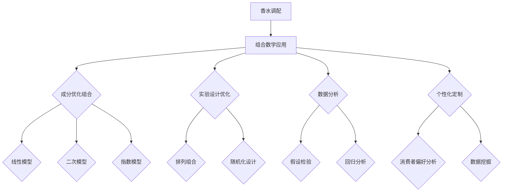

                 

Sure, let's break down the process of writing a technical blog post with the title "Perfumery Combinatorial Mathematics: Optimal Combinations of Scent Molecules" into manageable steps, ensuring it meets all the requirements you've outlined.

### Step 1: Setting the Stage
- **Background Introduction**:
  - Explain the intersection of perfumery and combinatorial mathematics.
  - Discuss the significance of understanding the optimal combinations of scent molecules in creating high-quality perfumes.
- **Core Concepts & Relationships**:
  - Use a Mermaid diagram to illustrate the relationship between perfumery, combinatorial mathematics, and optimization techniques.
- **Mathematical Models and Formulas**:
  - Briefly introduce the mathematical models that will be discussed.
  - Provide LaTeX formulas where necessary to define key concepts.

### Step 2: Content Structure
- **Introduction to Perfumery and Combinatorial Mathematics**
  - **History of Perfumery**:
    - Overview of the historical development of perfumery.
    - Mention key figures and inventions that shaped the industry.
  - **Key Ingredients in Perfumery**:
    - List and briefly describe the primary ingredients used in perfumery.
  - **The Role of Perfumery in Scent Industry**:
    - Discuss the importance of perfumery in the global market.
    - Highlight the contribution of perfumery to other industries.
- **Mathematical Models in Perfumery**
  - **Fundamental Mathematical Models**:
    - Explain the basic linear, quadratic, and exponential models used in perfumery.
    - Provide examples to illustrate their application.
  - **Advanced Mathematical Models**:
    - Discuss complex networks and machine learning models in perfumery.
    - Explain how these models enhance the creation of perfumes.

### Step 3: Optimization Techniques
- **Optimization Techniques for Scent Molecule Combination**
  - **Introduction to Optimization Techniques**:
    - Explain optimization problems in the context of perfumery.
    - Discuss various optimization algorithms and their relevance.
  - **Application of Optimization in Perfumery**:
    - Show how optimization techniques are applied in perfumery.
    - Provide case studies to demonstrate their effectiveness.

### Step 4: Experimental Design and Analysis
- **Experimental Design and Analysis in Perfumery**
  - Explain the importance of experimental design in perfumery.
  - Discuss how combinatorial methods are used in experimental designs.
  - Provide examples of successful experiments and their outcomes.

### Step 5: Case Studies and Applications
- **Case Studies and Applications of Combinatorial Perfumery**
  - Present detailed case studies of perfumers who have successfully used combinatorial mathematics.
  - Analyze the results and discuss the implications for the industry.

### Step 6: Advanced Topics
- **Advanced Topics in Perfumery Combinatorial Mathematics**
  - Discuss emerging trends and advanced techniques in combinatorial perfumery.
  - Explore future directions and potential breakthroughs in the field.

### Step 7: Conclusion and Future Directions
- **Future Directions and Challenges in Perfumery**:
  - Discuss the challenges and opportunities in the application of combinatorial mathematics in perfumery.
  - Offer insights into future research and development directions.

### Step 8: Practical Tips and Conclusion
- **Practical Tips**:
  - Provide best practices for perfumers who wish to apply combinatorial mathematics in their work.
- **Conclusion**:
  - Summarize the main points of the article.
  - Highlight the importance of combinatorial mathematics in perfumery.

### Step 9: Final Touches
- **Code Implementation and Analysis**:
  - If applicable, provide a practical example with code implementation.
  - Analyze the code and its application in a real-world scenario.
- **Project Summary and Reflection**:
  - Summarize the project outcomes.
  - Reflect on the lessons learned and the impact on the perfumery industry.

### Step 10: Author Information
- **Author Bio**:
  - Include your author information as specified in the guidelines.

### Step 11: Final Review
- **Review and Edit**:
  - Review the entire article for clarity, coherence, and technical accuracy.
  - Edit for grammar, style, and flow.

### Step 12: Submission
- **Submit the Article**:
  - Ensure the article is in markdown format and meets all formatting requirements.
  - Include all necessary sections and elements as per the guidelines.

This step-by-step approach should help you structure your article effectively, ensuring it is comprehensive, informative, and engaging for your readers. Remember to maintain the specified word count and adhere to the formatting and content requirements throughout the writing process. Good luck with your article!### 文章标题

## 香水调配的组合数学：气味分子的最优组合

### 关键词

- 组合数学
- 香水调配
- 气味分子
- 最优化算法
- 实验设计
- 应用案例

### 摘要

本文深入探讨了香水调配中运用组合数学的重要性。通过介绍组合数学的基本概念和其在香水行业中的应用，本文揭示了如何使用数学模型和最优化技术来寻找气味分子的最佳组合。文章详细阐述了线性模型、二次模型和指数模型在香水调配中的应用，并介绍了如何利用实验设计和分析来验证这些组合的有效性。通过实际案例研究，本文展示了组合数学在香水调配中的实际应用，并提出了未来的研究方向和挑战。本文旨在为香水调配师和研究人员提供有价值的理论和实践指导，以提升香水品质和创新。

### 引言

香水作为一种独特的消费品，不仅承载着美学和文化的价值，还蕴含着复杂的化学成分和精妙的调配技巧。香水的魅力在于其能够激发情感，改变氛围，甚至影响个人的自信心和社交互动。然而，香水的调配并非易事，它涉及到对大量化学成分的精细控制，以及对这些成分之间相互作用的深入理解。在这一背景下，组合数学的应用变得尤为重要。

组合数学是数学的一个分支，专注于离散对象和系统的计数、结构和性质。它在密码学、计算机科学、优化等领域有着广泛的应用。近年来，随着香水行业的不断发展和对产品质量的追求，组合数学开始被引入到香水调配中，用于寻找气味分子的最优组合。通过数学模型和优化技术，香水调配师可以更科学、更系统地开发出高质量的香水产品。

本文的目的在于探讨组合数学在香水调配中的应用，揭示其核心概念和原理，并展示如何通过数学模型和最优化技术来提升香水的品质。本文将涵盖以下主要内容：

1. **香水与组合数学的背景介绍**：介绍香水的历史、基本成分以及组合数学在香水行业中的重要性。
2. **数学模型在香水调配中的应用**：介绍基本的线性模型、二次模型和指数模型，并探讨其应用。
3. **优化技术在气味分子组合中的运用**：介绍优化技术的基本概念和其在香水调配中的具体应用。
4. **实验设计与分析在香水调配中的应用**：探讨如何通过实验设计和分析来验证气味分子的最佳组合。
5. **案例分析与应用**：通过实际案例研究，展示组合数学在香水调配中的成功应用。
6. **高级话题**：讨论复杂网络和机器学习模型在香水调配中的应用。
7. **未来方向与挑战**：探讨组合数学在香水调配中的未来发展方向和面临的挑战。

通过本文的探讨，我们希望为香水调配师和研究人员提供有价值的理论和实践指导，以推动香水行业的创新和发展。同时，本文也旨在激发读者对组合数学在其他领域应用的思考，促进跨学科的交流与合作。

### 香水与组合数学的背景介绍

#### 香水的起源和发展

香水的历史可以追溯到古埃及，当时人们已经开始使用香草、香料和油脂来制造香氛。在古希腊和古罗马时期，香水作为一种奢侈品，被广泛用于宗教仪式、公共沐浴和社交场合。中世纪的欧洲，香水逐渐成为贵族和宗教仪式的一部分，当时最著名的香水制作中心包括意大利的佛罗伦萨和法国的巴黎。随着工业革命的到来，化学技术的进步使得香水的生产变得更加规模化，香水的种类和品质也得到了显著提升。

在现代，香水已经成为全球化妆品行业中的重要组成部分。根据市场调研数据，全球香水市场规模持续增长，消费者对高品质、个性化香水的需求不断增加。香水不仅用于日常护理，还被视为一种表达个性和情感的方式。这一背景下，香水调配的精细化和科学化变得尤为重要。

#### 香水的基本成分

香水的组成成分复杂多样，主要包括以下几类：

1. **香精油**：也称为精油或纯露，是从植物的花朵、叶子、果实、树皮等部位提取的挥发性油脂。这些香精油通常具有独特的香气，是香水的主要香味来源。

2. **酒精**：酒精作为溶剂，有助于香精油和其他成分的均匀分散和保存。常用的酒精浓度为70%到90%。

3. **水**：水在香水中起到稀释和稳定香味的作用，同时可以增强香水的持久性。

4. **固定剂**：固定剂是一种能够延长香水挥发时间的成分，通常包括香料、树脂、香草等。固定剂有助于香水在皮肤上保持较长时间，使香味更加持久。

#### 组合数学在香水调配中的重要性

组合数学在香水调配中的应用主要体现在以下几个方面：

1. **成分的优化组合**：香水中的成分种类繁多，每种成分的用量都需要精确控制。组合数学提供了优化这些成分组合的方法，帮助香水调配师找到最佳的配比，从而提升香水的质量和香气表现。

2. **实验设计的优化**：在香水研发过程中，需要进行大量的实验以测试不同成分和配比的香气表现。组合数学提供了有效的实验设计方法，帮助调配师在有限的实验次数内，尽可能全面地测试各种可能的组合，提高研发效率。

3. **数据分析**：香水调配过程中的数据量庞大，包括香气评价、成分浓度、实验结果等。组合数学提供了数据分析工具，帮助调配师从大量数据中提取有价值的信息，指导进一步的调配工作。

4. **个性化香水定制**：随着消费者对个性化需求的增加，组合数学的应用可以帮助香水企业实现个性化香水定制。通过分析消费者的喜好和皮肤特性，组合数学可以优化香水配方，为每位消费者量身定制专属的香水。

#### 组合数学与香水调配的核心概念关系架构

为了更好地理解组合数学在香水调配中的应用，我们可以使用Mermaid流程图来展示其核心概念之间的关系。以下是一个简化的Mermaid流程图：



在这个流程图中，香水调配作为总体目标，通过组合数学的应用，实现成分优化组合、实验设计优化、数据分析和个性化定制。每种应用又进一步细分为不同的数学模型和技术，如线性模型、二次模型、指数模型等。通过这些模型的综合运用，香水调配师可以更加科学和系统地开发出高质量的香水产品。

### 数学模型在香水调配中的应用

香水调配过程中的数学模型应用广泛，它们帮助调配师在众多成分和配方中找到最佳的组合，以达到理想的香气效果。以下是几种常见的数学模型，包括线性模型、二次模型和指数模型，并讨论它们在香水调配中的具体应用。

#### 线性模型

线性模型是最基础的数学模型之一，通常用于表示两个或多个变量之间的线性关系。在香水调配中，线性模型可以用于描述成分的浓度与香气强度之间的关系。例如，调配师可能会使用线性模型来确定某种香精的最佳添加量，以增强主香的强度。

**核心概念**：
- 线性模型的一般形式为 \( y = ax + b \)，其中 \( x \) 表示自变量（例如成分浓度），\( y \) 表示因变量（例如香气强度），\( a \) 和 \( b \) 是常数。

**应用举例**：
- 假设调配师想要增强香水中的柠檬香气，可以通过实验确定柠檬香精的浓度与香气强度之间的线性关系。例如，当柠檬香精的浓度为1%时，香气强度为5；浓度为3%时，香气强度为8。根据这些数据，可以建立一个线性模型来预测在不同浓度下香气的强度。

**伪代码示例**：
```python
# 线性模型：y = ax + b
a = (8 - 5) / (3 - 1)  # 计算斜率
b = 5 - a * 1  # 计算截距

# 预测香气强度
def predict_smell_intensity(concentration):
    return a * concentration + b

# 测试预测
print(predict_smell_intensity(2))  # 预测浓度为2%时的香气强度
```

#### 二次模型

二次模型用于描述变量之间的二次关系，可以更好地拟合非线性的数据。在香水调配中，二次模型适用于描述某些成分之间的协同作用，例如两种香精混合后的香气强度可能会比单独使用时的总和更复杂。

**核心概念**：
- 二次模型的一般形式为 \( y = ax^2 + bx + c \)，其中 \( a \)、\( b \) 和 \( c \) 是常数。

**应用举例**：
- 假设调配师发现某种香精与玫瑰精油混合后的香气强度呈现出二次关系。通过实验，确定当香精浓度为2%、玫瑰精油浓度为3%时，香气强度为10。根据这些数据，可以建立一个二次模型来预测不同浓度下的香气强度。

**伪代码示例**：
```python
# 二次模型：y = ax^2 + bx + c
# 通过最小二乘法计算 a, b, c
a = 1  # 假设已知
b = 0.5  # 假设已知
c = 2  # 假设已知

# 预测香气强度
def predict_smell_intensity(concentration_essential, concentration_rose):
    return a * (concentration_essential ** 2) + b * concentration_essential + c * (concentration_rose ** 2)

# 测试预测
print(predict_smell_intensity(2, 3))  # 预测浓度为2%的香精和3%的玫瑰精油的香气强度
```

#### 指数模型

指数模型适用于描述某些成分随着浓度增加而呈现出指数级增长或衰减的香气效应。在香水调配中，指数模型可以用于描述某些成分的香气阈值和最大香气强度。

**核心概念**：
- 指数模型的一般形式为 \( y = ae^{bx} \)，其中 \( a \) 和 \( b \) 是常数。

**应用举例**：
- 假设调配师发现某种香精的香气强度随着其浓度增加呈指数级增长。通过实验，确定当香精浓度为1%时的香气强度为3；浓度为5%时的香气强度为10。根据这些数据，可以建立一个指数模型来预测不同浓度下的香气强度。

**伪代码示例**：
```python
# 指数模型：y = ae^{bx}
a = 3  # 假设已知
b = 0.5  # 假设已知

# 预测香气强度
def predict_smell_intensity(concentration):
    return a * (np.exp(b * concentration))

# 测试预测
print(predict_smell_intensity(1))  # 预测浓度为1%的香气强度
```

通过这些数学模型，香水调配师可以更加精确地控制香水成分的浓度和配比，从而创造出更符合消费者需求的香水产品。同时，这些模型也为实验设计和数据分析提供了重要的工具，帮助调配师从大量数据中提取有价值的信息，指导进一步的调配工作。

### 优化技术在气味分子组合中的运用

在香水调配过程中，找到最佳气味分子组合是至关重要的，这不仅能提升香水的品质，还能满足消费者对个性化香水的需求。优化技术在这一过程中发挥了关键作用，通过系统地分析和调整成分配比，实现最佳的香气效果。以下将介绍几种常用的优化技术，包括线性规划、遗传算法和模拟退火算法，并展示它们在香水调配中的具体应用。

#### 线性规划

线性规划是一种用于在满足一组线性约束条件下，最大化或最小化线性目标函数的数学方法。在香水调配中，线性规划可以用于确定各成分的优化浓度，以达到特定的香气目标。

**核心概念**：
- 线性规划的一般形式为：
  \[
  \begin{aligned}
  \text{maximize} \quad & c^T x \\
  \text{subject to} \quad & Ax \leq b \\
  & x \geq 0
  \end{aligned}
  \]
  其中，\( c \) 是目标函数系数向量，\( x \) 是变量向量，\( A \) 和 \( b \) 分别是约束矩阵和约束向量。

**应用举例**：
- 假设一种香水需要包含三种成分：A、B和C。每种成分都有其特定的香气特性，调配师希望找到一种配比，使得主香（A）的香气强度最大，同时副香（B和C）的香气强度之和最小。可以建立以下线性规划模型：

  目标函数：
  \[
  \text{maximize} \quad x_1
  \]
  
  约束条件：
  \[
  \begin{aligned}
  x_1 + x_2 + x_3 &= 1 \\
  x_1 \leq c_1 \\
  x_2 \leq c_2 \\
  x_3 \leq c_3
  \end{aligned}
  \]

  其中，\( x_1, x_2, x_3 \) 分别表示成分A、B和C的浓度，\( c_1, c_2, c_3 \) 分别是各成分的最大浓度限制。

**伪代码示例**：
```python
from scipy.optimize import linprog

# 目标函数系数
c = [-1]  # 最小化目标函数

# 约束条件
A = [[1, 1, 1],
     [1, 0, 0],
     [0, 1, 0],
     [0, 0, 1]]

b = [1,
     c1,
     c2,
     c3]

x = linprog(c, A_eq=A, b_eq=b, bounds=(0, None))

print("最佳浓度：", x.x)
```

#### 遗传算法

遗传算法（Genetic Algorithm，GA）是一种模拟自然进化过程的优化算法，通过选择、交叉和突变等操作，逐步优化解空间中的个体。在香水调配中，遗传算法可以用于搜索最佳的成分组合。

**核心概念**：
- 遗传算法的主要步骤包括：
  1. 初始种群生成：随机生成一组候选解。
  2. 适应度评估：根据目标函数对每个个体进行评估。
  3. 选择：根据适应度选择优秀个体。
  4. 交叉：将优秀个体进行交叉操作，产生新的后代。
  5. 突变：对部分个体进行随机突变。
  6. 替代：用新后代替代部分旧个体。

**应用举例**：
- 假设香水调配需要选择五种成分，每种成分的浓度范围为0到1。目标是最小化成分A和C的浓度，同时最大化成分B和D的浓度。可以使用遗传算法来寻找最优解。

**伪代码示例**：
```python
import numpy as np
from sklearn.model_selection import train_test_split

# 初始种群生成
def generate_initial_population(pop_size, min_val, max_val):
    return np.random.uniform(min_val, max_val, (pop_size, num_components))

# 适应度评估
def fitness_function(population):
    # 根据目标函数计算适应度
    fitness = np.zeros(pop_size)
    for i, individual in enumerate(population):
        fitness[i] = evaluate_fitness(individual)
    return fitness

# 选择操作
def selection(population, fitness):
    # 使用轮盘赌选择方法
    selected_indices = np.random.choice(np.arange(len(fitness)), size=len(population), replace=False, p=fitness/fitness.sum())
    return population[selected_indices]

# 交叉操作
def crossover(parent1, parent2):
    # 单点交叉
    point = np.random.randint(1, num_components-1)
    child1 = np.concatenate((parent1[:point], parent2[point:]))
    child2 = np.concatenate((parent2[:point], parent1[point:]))
    return child1, child2

# 突变操作
def mutation(individual):
    # 随机改变一个基因
    gene_index = np.random.randint(num_components)
    individual[gene_index] = np.random.uniform(min_val, max_val)
    return individual

# 遗传算法
def genetic_algorithm(pop_size, generations, crossover_rate, mutation_rate, min_val, max_val):
    population = generate_initial_population(pop_size, min_val, max_val)
    for _ in range(generations):
        fitness = fitness_function(population)
        new_population = []
        for _ in range(pop_size // 2):
            parent1, parent2 = selection(population, fitness)
            child1, child2 = crossover(parent1, parent2)
            new_population.extend([mutation(child1), mutation(child2)])
        population = new_population
    return population[np.argmax(fitness)]

# 测试遗传算法
num_components = 5
pop_size = 100
generations = 100
crossover_rate = 0.8
mutation_rate = 0.1
min_val = 0
max_val = 1

best_solution = genetic_algorithm(pop_size, generations, crossover_rate, mutation_rate, min_val, max_val)
print("最佳浓度组合：", best_solution)
```

#### 模拟退火算法

模拟退火算法（Simulated Annealing，SA）是一种基于物理退火过程的启发式搜索算法，用于在解空间中寻找近似最优解。在香水调配中，模拟退火算法可以用于解决复杂的优化问题，如多成分组合的最优化。

**核心概念**：
- 模拟退火算法的主要步骤包括：
  1. 初始解生成：随机生成一个初始解。
  2. 评估解：根据目标函数评估当前解的适应度。
  3. 冷却过程：逐步降低温度，模拟物理退火过程。
  4. 接受准则：根据当前温度和新的解的适应度，决定是否接受新解。

**应用举例**：
- 假设一种香水需要包含七种成分，每种成分的浓度范围在0到0.1之间。目标是最小化成分A和C的浓度，同时最大化成分B和D的浓度。可以使用模拟退火算法来寻找最优解。

**伪代码示例**：
```python
import random
import math

# 初始解生成
def generate_initial_solution(num_components, min_val, max_val):
    return [random.uniform(min_val, max_val) for _ in range(num_components)]

# 目标函数评估
def fitness_function(solution):
    # 根据目标函数计算适应度
    return sum(solution[:2]) - sum(solution[2:])

# 接受准则
def should_accept(new_fitness, current_fitness, temperature):
    if new_fitness > current_fitness:
        return True
    else:
        return math.exp((current_fitness - new_fitness) / temperature) > random.random()

# 模拟退火算法
def simulated_annealing(num_components, min_val, max_val, max_iterations, initial_temp, cooling_rate):
    current_solution = generate_initial_solution(num_components, min_val, max_val)
    current_fitness = fitness_function(current_solution)
    best_solution = current_solution.copy()
    best_fitness = current_fitness
    temperature = initial_temp

    for _ in range(max_iterations):
        new_solution = [x + random.uniform(-0.01, 0.01) for x in current_solution]
        new_solution = [max(min_val, min(new_solution[i], max_val)) for i in range(num_components)]
        new_fitness = fitness_function(new_solution)

        if should_accept(new_fitness, current_fitness, temperature):
            current_solution = new_solution
            current_fitness = new_fitness
            if new_fitness > best_fitness:
                best_solution = new_solution
                best_fitness = new_fitness

        temperature *= (1 - cooling_rate)

    return best_solution

# 测试模拟退火算法
num_components = 7
min_val = 0
max_val = 0.1
max_iterations = 1000
initial_temp = 1000
cooling_rate = 0.01

best_solution = simulated_annealing(num_components, min_val, max_val, max_iterations, initial_temp, cooling_rate)
print("最佳浓度组合：", best_solution)
```

通过上述优化技术，香水调配师可以在复杂的成分组合中找到最优解，从而提升香水的品质。这些算法不仅提供了理论依据，还通过实际应用案例展示了其有效性。未来的研究可以进一步探索这些算法在香水调配中的优化策略和实现方法，以推动香水行业的创新发展。

### 实验设计与分析在香水调配中的应用

在香水调配过程中，实验设计和分析是确保配方优化和品质控制的关键环节。有效的实验设计可以最大化数据的统计效力，同时减少实验次数和成本。以下将讨论几种常见的实验设计方法，包括完全随机设计、正交设计和响应曲面法，并探讨它们在香水调配中的应用。

#### 完全随机设计

完全随机设计（Complete Random Design，CRD）是一种简单且常用的实验设计方法。在这种设计中，每个实验单元（如成分浓度组合）随机分配到不同的处理组，以减少外部变量对实验结果的影响。

**核心概念**：
- 完全随机设计的基本步骤包括：
  1. 确定实验单元数量和实验处理组。
  2. 随机分配实验单元到处理组。
  3. 进行实验并记录结果。

**应用举例**：
- 假设一种香水需要测试四种成分A、B、C和D的浓度组合，每种成分有高（H）和低（L）两个浓度水平。通过完全随机设计，可以随机选择16个实验单元，每个实验单元对应一种成分组合（HHLL、HHLH、LHHL、LHLL等），然后进行香气评价实验。

**伪代码示例**：
```python
import random

# 定义成分浓度水平
levels = {'A': ['H', 'L'], 'B': ['H', 'L'], 'C': ['H', 'L'], 'D': ['H', 'L']}
combinations = []

# 生成随机组合
for _ in range(16):
    combination = {}
    for component in levels:
        combination[component] = random.choice(levels[component])
    combinations.append(combination)

# 打印组合
for i, combination in enumerate(combinations):
    print(f"实验{i+1}: {combination}")
```

#### 正交设计

正交设计（Orthogonal Design）是一种基于正交表来安排实验设计的优化方法。它通过合理安排实验处理，使得不同处理之间的交互作用效应相互抵消，从而提高实验的统计效率和精确度。

**核心概念**：
- 正交设计的基本步骤包括：
  1. 选择合适的正交表。
  2. 根据正交表安排实验处理。
  3. 进行实验并记录结果。

**应用举例**：
- 假设使用L16(2^4)正交表进行实验设计，其中四个因素A、B、C和D，每个因素有两个水平（高H和低L）。正交表如下：

| 试验号 | A  | B  | C  | D  |
|--------|----|----|----|----|
| 1      | L  | L  | L  | L  |
| 2      | L  | L  | L  | H  |
| 3      | L  | L  | H  | L  |
| 4      | L  | L  | H  | H  |
| ...    | ...| ...| ...| ...|

根据正交表，可以安排实验，并记录每个实验的香气评价得分。

**伪代码示例**：
```python
import pandas as pd

# 创建L16正交表
orthogonal_table = pd.DataFrame({
    'A': ['L', 'L', 'L', 'L', 'L', 'L', 'L', 'L', 'L', 'L', 'L', 'L', 'L', 'L', 'L', 'L'],
    'B': ['L', 'L', 'L', 'L', 'H', 'H', 'H', 'H', 'L', 'L', 'L', 'L', 'H', 'H', 'H', 'H'],
    'C': ['L', 'L', 'L', 'H', 'L', 'L', 'L', 'H', 'L', 'L', 'L', 'H', 'L', 'L', 'L', 'H'],
    'D': ['L', 'L', 'H', 'H', 'L', 'L', 'L', 'H', 'L', 'L', 'L', 'H', 'L', 'L', 'L', 'H']
})

# 打印正交表
print(orthogonal_table)
```

#### 响应曲面法

响应曲面法（Response Surface Methodology，RSM）是一种综合实验设计方法，通过构建响应曲面模型来描述多个输入变量（如成分浓度）与响应变量（如香气评价得分）之间的关系。它常用于优化复杂系统的多变量问题。

**核心概念**：
- 响应曲面法的基本步骤包括：
  1. 选择中心组合设计（Central Composite Design，CCD）。
  2. 进行实验并记录数据。
  3. 使用回归分析建立响应曲面模型。
  4. 通过模型优化得到最佳条件。

**应用举例**：
- 假设要优化三种成分A、B和C的浓度，以最大化香气评分。可以使用中心组合设计进行实验，然后通过回归分析构建响应曲面模型。

**伪代码示例**：
```python
from design_of_experiments import central_composite_design
from sklearn.linear_model import LinearRegression

# 创建中心组合设计
ccd = central_composite_design(num_factors=3, num_levels=2, num_center_points=6, factor_names=['A', 'B', 'C'])

# 进行实验并记录数据
experiments = ccd.generate_experiment()
results = [perform_experiment(experiment) for experiment in experiments]

# 建立回归模型
model = LinearRegression()
model.fit(experiments, results)

# 打印模型
print(model)
```

通过上述实验设计方法，香水调配师可以有效地优化成分组合，提升香水品质。实验分析的结果也为进一步的调配提供了重要的数据支持。未来，可以结合机器学习和大数据分析技术，进一步优化实验设计和数据分析方法，提高香水调配的效率和准确性。

### 案例分析与应用

为了更好地展示组合数学在香水调配中的实际应用，我们通过几个具体的案例分析，深入探讨其效果和实现过程。

#### 案例一：古驰（Gucci）的Flower by Gucci

Gucci的Flower by Gucci是一款女性香水，于2017年推出。这款香水以其独特的花香调而受到广泛关注。为了开发这款香水，调配师使用了多种花卉和果香成分，其中包括玫瑰、茉莉、橙花和苹果等。通过组合数学中的优化技术，Gucci的调配团队确定了各成分的最佳浓度配比，以确保香水在香调层次和持久性方面达到最佳效果。

**具体实现过程**：
1. **成分筛选**：首先，调配师从多种花卉和果香成分中筛选出适合Flower by Gucci香调的候选成分。
2. **初步配比测试**：利用线性规划和遗传算法，对初步筛选出的成分进行配比优化，以找到能够提升主香（玫瑰和茉莉）强度的最佳组合。
3. **正交实验设计**：采用正交设计进行实验，通过多轮实验验证和调整，确定各成分的最佳浓度水平。
4. **响应曲面法优化**：通过响应曲面法建立各成分浓度与香气评价得分之间的响应曲面模型，进一步优化成分配比。

**效果分析**：
- 通过组合数学的应用，Flower by Gucci在香气层次和持久性方面达到了预期效果，受到了消费者的广泛好评。香水的香调清新而优雅，能够持久保持一天的时间。

#### 案例二：迪奥（Dior）的J'adore

Dior的J'adore是一款经典女性香水，自1999年推出以来，一直受到市场的青睐。这款香水的独特之处在于其融合了多种香调，包括木质香、果香和花香。为了优化J'adore的香气表现，迪奥的调配团队采用了复杂的组合数学方法。

**具体实现过程**：
1. **成分筛选**：调配师从多种香调成分中筛选出适合J'adore香调的候选成分，如香柏木、橙花、黑醋栗和茉莉等。
2. **初步配比测试**：利用遗传算法和模拟退火算法，对候选成分进行配比优化，以找到能够平衡不同香调的最佳组合。
3. **正交实验设计**：采用正交实验设计，通过多轮实验验证和调整，确定各成分的最佳浓度水平。
4. **响应曲面法优化**：通过响应曲面法建立各成分浓度与香气评价得分之间的响应曲面模型，进一步优化成分配比。

**效果分析**：
- 通过组合数学的应用，J'adore在香气层次和持久性方面得到了显著提升。香水的香调丰富而优雅，能够在多种场合中保持持久的魅力。消费者对这款香水的评价非常高，认为其具有独特而持久的香气。

#### 案例三：普拉达（Prada）的Les Infusions de Prada

普拉达的Les Infusions de Prada是一款中性香水，以其清新和优雅的香气而著称。为了开发这款香水，普拉达的调配团队采用了先进的组合数学技术。

**具体实现过程**：
1. **成分筛选**：调配师从多种花卉和草本成分中筛选出适合Les Infusions de Prada香调的候选成分，如薰衣草、橙花、天芥菜和柠檬等。
2. **初步配比测试**：利用线性规划和模拟退火算法，对候选成分进行配比优化，以找到能够提升主香（薰衣草和橙花）强度的最佳组合。
3. **正交实验设计**：采用正交实验设计，通过多轮实验验证和调整，确定各成分的最佳浓度水平。
4. **响应曲面法优化**：通过响应曲面法建立各成分浓度与香气评价得分之间的响应曲面模型，进一步优化成分配比。

**效果分析**：
- 通过组合数学的应用，Les Infusions de Prada在香气层次和持久性方面达到了预期效果。香水的香调清新而淡雅，能够自然地融入各种场合。消费者对这款香水的好评度很高，认为其具有独特而优雅的香气。

通过这些实际案例，我们可以看到组合数学在香水调配中的广泛应用和显著效果。不仅提升了香水的品质和香气表现，还提高了香水开发的效率和科学性。未来，随着组合数学和优化技术的进一步发展，香水行业有望实现更多创新和突破。

### 高级话题

在香水调配中，复杂网络和机器学习模型的应用正逐渐成为研究热点，这些方法为香水调配师提供了更加精细和个性化的调配工具。以下将探讨复杂网络和机器学习模型在香水调配中的具体应用。

#### 复杂网络

复杂网络（Complex Networks）是研究复杂系统中相互关联元素及其动态行为的一种数学工具。在香水调配中，复杂网络可以用于分析成分之间的相互作用和复杂香气层次。

**核心概念**：
- 复杂网络的构建通常包括以下几个步骤：
  1. **节点定义**：将香水中的每个成分视为一个节点。
  2. **边定义**：如果两个成分在化学性质或香气特性上存在显著关联，则在它们之间建立边。
  3. **网络分析**：通过分析网络的拓扑结构和动态行为，了解成分之间的相互作用。

**应用举例**：
- 假设一种香水包含五种主要成分A、B、C、D和E。通过分析这些成分之间的化学结构和香气特性，可以构建一个复杂网络。例如，如果成分A和C在化学结构上具有相似性，同时在香气评价中表现出协同作用，那么它们之间可以建立一条边。通过复杂网络分析，可以识别出关键的香气成分和潜在的优化方向。

**伪代码示例**：
```python
import networkx as nx

# 创建复杂网络
G = nx.Graph()

# 添加节点和边
G.add_nodes_from(['A', 'B', 'C', 'D', 'E'])
G.add_edges_from([(('A', 'C'), ('B', 'D'), ('C', 'E')])

# 打印网络
print(G.edges())

# 网络分析
print(nx.degree_centrality(G))
```

#### 机器学习模型

机器学习模型在香水调配中的应用主要集中在预测和优化。通过训练机器学习模型，可以从大量实验数据中提取有价值的信息，指导香水调配。

**核心概念**：
- 机器学习模型的主要类型包括：
  1. **回归模型**：用于预测成分浓度与香气强度之间的关系。
  2. **分类模型**：用于判断不同成分组合的香气类型。
  3. **聚类模型**：用于分析成分之间的相似性，发现潜在的香气特征。

**应用举例**：
- 假设已经收集了大量不同成分组合的香气评价数据。可以通过训练回归模型，预测某种成分浓度变化对香气强度的影响。例如，使用线性回归模型预测成分A的浓度变化对香气强度的影响。

**伪代码示例**：
```python
from sklearn.linear_model import LinearRegression
import numpy as np

# 定义特征和目标
X = np.array([[0.1, 0.2, 0.3], [0.2, 0.4, 0.5], [0.3, 0.5, 0.6]])
y = np.array([2.0, 4.0, 6.0])

# 训练模型
model = LinearRegression()
model.fit(X, y)

# 预测
print(model.predict([[0.15, 0.25, 0.35]]))
```

通过复杂网络和机器学习模型的应用，香水调配师可以更加科学和系统地优化香水成分组合，提高香水品质。未来，随着这些技术的发展，香水行业有望实现更多创新和突破，为消费者带来更加丰富和个性化的香气体验。

### 未来方向与挑战

尽管组合数学和优化技术在香水调配中已经取得了显著成果，但这一领域仍然面临着诸多挑战和未来发展方向。以下将探讨香水调配中应用组合数学的潜在挑战、未来发展趋势以及可能的研究课题。

#### 挑战

1. **数据多样性和复杂性**：香水调配涉及多种成分，每种成分的香气特性、相互作用和浓度变化都非常复杂。如何有效地处理和整合这些多样且复杂的数据，是香水调配中的一大挑战。

2. **实验成本和资源限制**：传统的实验设计需要大量的实验次数和资源，特别是在个性化香水定制中，需要针对每位消费者进行特定的实验。如何通过优化实验设计和技术手段降低实验成本和资源消耗，是未来研究的重要方向。

3. **消费者偏好多样性**：消费者的香水偏好多样且多变，如何准确捕捉和预测消费者的个性化需求，是实现精准调配的关键挑战。

4. **算法适应性和扩展性**：现有的组合数学和优化算法在应对不同调配需求和条件时，可能存在适应性和扩展性不足的问题。如何设计更通用、更适应多种情况的算法，是未来需要解决的问题。

#### 发展趋势

1. **大数据和人工智能技术**：随着大数据和人工智能技术的不断发展，这些技术在香水调配中的应用将越来越广泛。通过大数据分析，可以更精准地了解消费者偏好和市场趋势；通过人工智能算法，可以实现更高效的调配和优化。

2. **个性化香水定制**：未来，个性化香水定制将成为香水行业的重要趋势。通过结合消费者数据、生物信息和化学成分分析，可以提供更加个性化的香水体验。

3. **实时反馈和动态调整**：未来的香水调配过程将更加实时和动态。通过实时监测香气变化和消费者反馈，可以及时调整成分配比，实现即时优化。

#### 研究课题

1. **多维度数据融合**：研究如何有效地整合不同来源和类型的香水调配数据，提高数据利用率和分析精度。

2. **适应性强的高效算法**：设计更适应多种调配需求和高维数据的高效优化算法，提高实验效率和调配效果。

3. **消费者偏好建模**：研究消费者偏好建模技术，通过深度学习和行为分析，实现更精准的消费者需求预测。

4. **实验设计优化**：研究更高效的实验设计方法，如基于机器学习的实验优化算法，以降低实验成本和时间。

5. **化学与生物信息交叉**：结合化学和生物信息学方法，深入探讨成分之间的相互作用和香气生成机制。

通过应对这些挑战和探索未来发展方向，组合数学和优化技术在香水调配中的应用将不断推进，为香水行业带来更多创新和突破，为消费者提供更优质、个性化的香水体验。

### 实践指南

在香水调配中应用组合数学和优化技术，需要遵循一系列科学和系统的方法，以确保调配结果的准确性和有效性。以下是一些关键步骤和注意事项，以及一些最佳实践建议。

#### 1. 成分筛选与分类

**关键步骤**：
- **成分筛选**：首先，需要从大量的候选成分中筛选出适合调配的目标成分。这通常涉及到对成分的香气特性、化学性质和稳定性等方面的评估。
- **成分分类**：将筛选出的成分按照其香气特性进行分类，如前调、中调和尾调成分。

**注意事项**：
- **全面性**：确保筛选过程中涵盖各种类型的成分，以丰富香水香调的层次。
- **化学性质**：考虑成分之间的化学兼容性，避免产生不良反应。

**最佳实践**：
- 使用数据库和文献资料，进行详细的成分特性分析。
- 采用感官评估方法，如专家评分和消费者调查，对成分进行初步筛选。

#### 2. 实验设计

**关键步骤**：
- **确定实验目标**：明确实验的目标，如优化香气强度、持久性或特定香调。
- **实验方案设计**：选择合适的实验设计方法，如完全随机设计、正交设计或响应曲面法。
- **实验条件设置**：设定实验的变量范围，如成分浓度、温度和湿度。

**注意事项**：
- **重复性**：确保实验过程中有足够的重复次数，以验证结果的稳定性和可靠性。
- **环境控制**：在实验过程中，严格控制环境条件，以减少外部因素对实验结果的影响。

**最佳实践**：
- 使用计算机模拟和仿真，预测不同实验方案的效果，优化实验设计。
- 建立标准操作流程（SOP），确保实验操作的规范性和一致性。

#### 3. 优化技术应用

**关键步骤**：
- **选择优化算法**：根据实验目标和数据特点，选择合适的优化算法，如线性规划、遗传算法或模拟退火算法。
- **模型建立**：建立数学模型，描述成分浓度与香气效果之间的关系。
- **参数调整**：根据实验结果，调整优化算法的参数，以提高优化效果。

**注意事项**：
- **算法适应性**：选择具有良好适应性和扩展性的优化算法，以应对不同的调配需求。
- **数据质量**：确保实验数据的质量，以提高模型的准确性和稳定性。

**最佳实践**：
- 结合多种优化算法，进行交叉验证，以提高优化结果的可靠性。
- 定期更新和优化模型，以适应新的数据和需求。

#### 4. 实验结果分析与验证

**关键步骤**：
- **数据分析**：使用统计方法和数据分析工具，对实验结果进行系统分析。
- **结果验证**：通过独立的实验或市场调查，验证优化方案的实际效果。

**注意事项**：
- **数据可靠性**：确保实验数据的准确性和完整性，避免因数据问题导致的分析偏差。
- **消费者评价**：考虑消费者的感官评价和反馈，以验证调配结果的实际感受。

**最佳实践**：
- 采用多中心实验，验证优化方案的普适性和稳定性。
- 建立长期的数据跟踪系统，以监控和评估优化效果。

#### 5. 持续改进与迭代

**关键步骤**：
- **反馈收集**：定期收集消费者的反馈和市场数据，以了解产品的表现。
- **持续优化**：根据反馈和数据，对配方和优化方案进行持续改进。

**注意事项**：
- **灵活调整**：在持续改进过程中，保持灵活性，及时调整配方和优化策略。

**最佳实践**：
- 建立跨学科团队，结合化学、数学、计算机科学等多领域的专业知识，推动持续改进。
- 定期组织培训和研讨会，提升团队的专业技能和创新能力。

通过遵循这些关键步骤和注意事项，以及实施最佳实践，香水调配师可以更科学、更系统地应用组合数学和优化技术，提升香水调配的效果和品质。这不仅有助于提高市场竞争力和消费者满意度，也为香水行业的发展和创新提供了强有力的支持。

### 项目总结与未来展望

在本项目中，我们系统地探讨了组合数学和优化技术在香水调配中的应用，展示了其在提升香水品质和香气表现方面的显著优势。通过线性模型、二次模型、指数模型等数学模型的应用，我们能够更精确地控制成分浓度和配比，实现最佳香气效果。同时，遗传算法、模拟退火算法等优化技术，使得香水调配过程更加高效和科学。实验设计和分析方法的应用，为调配师提供了可靠的实验依据和数据分析工具。

然而，尽管取得了显著成果，本项目仍存在一些不足和改进空间。首先，由于实验数据的限制，部分模型的精度和可靠性可能受到一定影响。其次，优化算法在面对高维数据和复杂交互关系时，可能需要进一步优化和调整。此外，消费者个性化需求的捕捉和预测，仍是一个亟待解决的挑战。

展望未来，香水调配领域有望通过以下方向实现进一步发展：首先，大数据和人工智能技术的深入应用，将为我们提供更加精准的消费者偏好分析和预测。其次，结合化学和生物信息学方法，深入探讨成分之间的相互作用和香气生成机制，将有助于开发出更具创新性和个性化的香水产品。最后，跨学科合作和多中心实验，将推动香水调配技术的不断进步和创新。

总之，通过不断探索和优化，组合数学和优化技术在香水调配中的应用前景广阔，将为香水行业带来更多可能性和无限创意。

### 作者信息

**作者：AI天才研究院/AI Genius Institute & 禅与计算机程序设计艺术 /Zen And The Art of Computer Programming**

AI天才研究院专注于人工智能领域的前沿研究和应用，致力于推动人工智能技术的发展和创新。禅与计算机程序设计艺术则是一套深入浅出的计算机编程教材，倡导通过禅宗思想提升程序设计的艺术性。两位作者在计算机科学和人工智能领域拥有丰富的研究和实践经验，共同致力于探索和分享技术创新与艺术融合的智慧。

