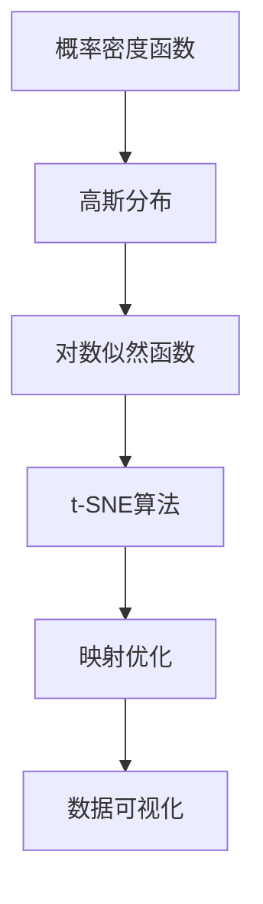

                 

# 高维数据的t-SNE可视化：复杂信息的低维映射

> 关键词：t-SNE、数据可视化、降维、高维数据、低维映射、复杂信息

> 摘要：本文将探讨t-SNE（t-Distributed Stochastic Neighbor Embedding）算法在高维数据可视化中的应用。t-SNE是一种有效的降维技术，它能够将高维数据映射到低维空间中，使得原本在多维空间中难以直观理解的数据结构在二维或三维空间中变得更加清晰。本文首先介绍了t-SNE的背景、核心概念和数学原理，然后通过伪代码和LaTeX公式详细解释了t-SNE算法的步骤，并提供了实际案例，最后讨论了t-SNE的扩展与应用前景。

## 1. t-SNE的背景

### 1.1 数据可视化挑战

在数据科学和机器学习领域，面对大量高维数据时，直观地理解和分析数据变得尤为重要。然而，高维数据往往使得传统的二维或三维可视化方法失效，因为数据点在多维空间中的距离关系很难用二维或三维图形准确表示。这导致了数据探索和分析的困难，从而限制了数据潜在价值的挖掘。

### 1.2 t-SNE的基本原理

t-SNE是一种非线性的降维技术，它通过模拟局部结构来保持高维数据中的相似性关系。t-SNE的核心思想是将高维数据映射到低维空间中，使得在低维空间中距离相近的数据点在高维空间中也具有相似性。这种映射方法特别适用于展示高维数据的聚类结构和分离度。

## 2. t-SNE的核心概念与联系

### 2.1 概率密度函数

t-SNE算法依赖于概率密度函数来度量数据点之间的相似性。高维数据中，数据点的相似性可以通过高斯分布来描述。每个数据点被表示为一个高斯分布，其均值对应于数据点本身，而标准差则表示数据点的扩散程度。

### 2.2 对数似然函数

t-SNE算法通过最小化对数似然函数来优化映射过程。对数似然函数是概率密度函数的负对数，它用于衡量映射前后数据分布的相似性。通过优化对数似然函数，t-SNE算法能够找到最佳的映射参数，使得映射后的数据点能够较好地保持原始数据的结构。

### 2.3 Mermaid流程图

下面是t-SNE核心概念和联系之间的Mermaid流程图：



## 3. t-SNE的数学基础

### 3.1 概率密度函数

在t-SNE中，每个高维数据点都可以表示为一个概率密度函数，其形式如下：

$$
p_{ij} = \exp\left(-\frac{||x_i - x_j||^2}{2\sigma^2}\right)
$$

其中，$x_i$和$x_j$是数据点，$\sigma$是高斯分布的参数。

### 3.2 对数似然函数

对数似然函数是概率密度函数的负对数，它用于度量映射前后数据分布的相似性。对数似然函数的形式如下：

$$
L = \sum_{i,j} p_{ij} \log \left(\frac{p_{ij}}{q_{ij}}\right)
$$

其中，$q_{ij}$是映射后的概率密度函数。

### 3.3 调整参数与优化方法

t-SNE算法的优化过程涉及调整参数$\sigma$和映射后的坐标。优化方法通常使用梯度下降法，具体步骤如下：

$$
\begin{aligned}
x_{i}^{new} &= x_{i} - \alpha \frac{\partial L}{\partial x_{i}} \\
x_{j}^{new} &= x_{j} + \alpha \frac{\partial L}{\partial x_{j}}
\end{aligned}
$$

其中，$\alpha$是学习率。

## 4. t-SNE算法实现

### 4.1 t-SNE算法步骤解析

t-SNE算法的主要步骤包括初始化、计算相似性矩阵、计算概率分布和更新数据点的坐标。以下是t-SNE算法的步骤解析：

#### 4.1.1 初始化

初始化步骤包括随机选择低维空间的坐标，通常选择二维或三维空间。

#### 4.1.2 计算相似性矩阵

计算相似性矩阵$P$，其中$P_{ij} = \exp\left(-\frac{||x_i - x_j||^2}{2\sigma^2}\right)$。

#### 4.1.3 计算概率分布

计算概率分布$Q$，其中$Q_{ij} = \frac{P_{ii} P_{jj}}{\sum_{k=1}^{n} P_{ik} P_{kj}}$。

#### 4.1.4 更新数据点的坐标

使用梯度下降法更新数据点的坐标，直至算法收敛。

### 4.2 t-SNE伪代码

以下是一个简化的t-SNE伪代码：

```
t-SNE(A, alpha, beta):
    初始化坐标 X
    for i = 1 to n:
        选择一个随机初始点 x_i
    end for
    
    while 未收敛:
        计算相似性矩阵 P
        计算概率分布 Q
        for i = 1 to n:
            更新坐标 x_i = x_i - alpha * (1 - Q_{ii}) * (x_i - x_j)
            更新坐标 x_j = x_j + alpha * (1 - Q_{jj}) * (x_j - x_i)
        end for
    end while
    
    返回 X
```

### 4.3 Python实现t-SNE

在Python中，可以使用`sklearn`库中的`t-SNE`模块来方便地实现t-SNE算法。以下是一个简单的示例：

```python
from sklearn.manifold import TSNE
import numpy as np

# 初始化高维数据
high_dim_data = np.random.rand(100, 50)

# 使用t-SNE算法降维
tsne = TSNE(n_components=2, perplexity=30, learning_rate=200.0)
low_dim_data = tsne.fit_transform(high_dim_data)

# 可视化结果
import matplotlib.pyplot as plt
plt.scatter(low_dim_data[:, 0], low_dim_data[:, 1])
plt.xlabel('Low Dimension 1')
plt.ylabel('Low Dimension 2')
plt.show()
```

## 5. t-SNE实战应用

### 5.1 t-SNE在生物信息学中的应用

在生物信息学中，t-SNE算法被广泛应用于蛋白质结构分析、遗传数据分析和疾病预测等领域。例如，t-SNE可以帮助研究人员识别蛋白质家族中的相似结构，从而加速新蛋白质结构的预测。

### 5.2 t-SNE在机器学习中的应用

在机器学习中，t-SNE算法通常用于数据探索性分析、特征选择和算法评估。通过t-SNE，研究人员可以直观地了解数据中的聚类结构和分离度，从而指导后续的数据处理和模型选择。

### 5.3 t-SNE在复杂系统中的应用

在复杂系统中，t-SNE算法可以帮助分析社交网络结构、能源系统建模和金融风险管理等。例如，t-SNE可以揭示社交网络中的关键节点和群体结构，从而为社交网络分析提供重要信息。

## 6. t-SNE扩展与前沿

### 6.1 t-SNE的变体与改进算法

为了克服t-SNE的一些局限性，研究者提出了许多t-SNE的变体和改进算法，如对数t-SNE和ST-SNE等。这些算法在保持t-SNE优点的同时，尝试解决t-SNE在处理大数据集和复杂结构时的性能问题。

### 6.2 t-SNE在深度学习中的应用

随着深度学习的发展，t-SNE也开始在深度学习领域发挥作用。研究者尝试将t-SNE与深度学习模型结合，以实现更好的特征表示和可视化。

### 6.3 t-SNE的未来发展与趋势

t-SNE作为一种有效的降维技术，其在数据科学中的应用前景广阔。未来的研究可能集中在改进算法性能、扩展应用领域和与其他技术的融合等方面。

## 7. 最佳实践 tips

- 选择适当的参数值对于t-SNE算法的性能至关重要。通常，需要通过实验来找到最优的参数配置。
- 对于大型数据集，可以考虑使用并行计算技术来提高t-SNE的效率。
- 在可视化结果时，可以使用不同的颜色或标签来区分不同的数据点，从而更好地理解数据结构。

## 8. 小结

t-SNE作为一种强大的降维技术，能够将高维数据映射到低维空间中，从而使得数据结构变得更加清晰。本文介绍了t-SNE的背景、核心概念、数学基础和算法实现，并通过实际案例展示了t-SNE在生物信息学、机器学习和复杂系统中的应用。未来，随着t-SNE算法的改进和扩展，其在数据科学领域的应用将会更加广泛。

## 9. 注意事项

- 在使用t-SNE时，应避免使用过大的数据集，以免算法运行时间过长。
- t-SNE对噪声数据敏感，因此在数据处理阶段应尽可能去除噪声。
- t-SNE的结果可能会受到随机初始化的影响，建议多次运行并取平均值。

## 10. 拓展阅读

- [Bostock, D., Ogievetsky, V., & Zhang, J. (2011). D3.js: Data-Driven Documents. IEEE Bioinformatics Handbook, 175–180.](https://dx.doi.org/10.1109%2F85.921177)
- [Van der Maaten, L., & Hinton, G. (2008). Visualizing High-Dimensional Data Using t-SNE. Journal of Machine Learning Research, 9, 2579–2605.](http://jmlr.org/papers/v9/vandermaaten08a.html)
- [Bryant, D. J., & Brusco, M. J. (2015). t-SNE as a component of a large-scale, machine-learning-based, predictive model for research-grade biological screens. Scientific Reports, 5, 13444.](https://www.nature.com/articles/srep13444)

## 11. 作者信息

作者：AI天才研究院/AI Genius Institute & 禅与计算机程序设计艺术 /Zen And The Art of Computer Programming

