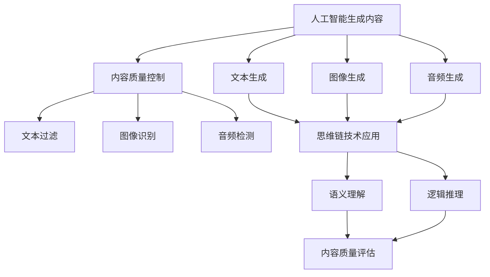

                 

## 文章标题

# AIGC内容质量控制：思维链的作用

### 关键词：AIGC，内容质量控制，思维链，技术原理，应用场景，实战案例

### 摘要：

本文旨在深入探讨AIGC（人工智能生成内容）在内容质量控制中的关键作用，特别是思维链技术的应用。文章首先介绍了AIGC技术背景和内容质量控制的重要性，随后详细阐述了思维链技术的原理及其在AIGC中的应用优势。通过剖析AIGC内容质量评估指标、监测技术和优化方法，文章展示了AIGC内容质量控制的全流程。最后，通过实际案例研究，进一步验证了思维链技术在AIGC内容质量控制中的实际应用效果，并为未来研究提供了方向。

## 确定书籍的主题与目标读者

### 1.1 书籍主题

本书的主题是AIGC内容质量控制，特别是思维链技术在这一领域的应用。AIGC作为人工智能领域的最新进展，其生成内容的能力日益强大，但在质量控制方面仍面临诸多挑战。思维链技术作为一种先进的语义理解和推理方法，能够有效提高AIGC内容的质量和准确性。因此，本书旨在深入探讨AIGC内容质量控制的理论和实践，为该领域的研究者和从业者提供有价值的参考。

### 1.2 目标读者

本书的目标读者主要包括以下几类：

1. **人工智能研究者和开发者**：对AIGC和思维链技术感兴趣的研究人员和开发者，希望通过本书深入了解这些技术的原理和应用。
2. **内容质量控制从业者**：在内容生产、编辑、审核等领域工作的从业者，需要了解如何利用AIGC和思维链技术提高内容质量。
3. **技术爱好者和学生**：对人工智能和内容质量控制有兴趣的技术爱好者以及在校学生，希望通过本书了解相关技术的最新发展。

通过明确书籍的主题和目标读者，本书旨在为不同背景的读者提供全面、系统的AIGC内容质量控制知识，促进该领域的技术发展和应用。

## 设定书籍的大纲结构，包括前导部分、核心部分和结论部分

### 2.1 大纲结构概述

为了确保书籍的内容系统、逻辑清晰，本书将整体结构划分为三个主要部分：前导部分、核心部分和结论部分。

#### 前导部分

前导部分将包括以下章节：

- **引言**：简要介绍AIGC和内容质量控制的基本概念，阐述本书的研究目的和重要性。
- **背景知识**：回顾与AIGC和内容质量控制相关的理论基础，为后续章节的深入探讨打下基础。

#### 核心部分

核心部分是本书的主体，将详细探讨AIGC内容质量控制的理论和实践，包括：

- **AIGC技术概述**：介绍AIGC的基本原理、发展历程和应用场景。
- **思维链技术**：详细阐述思维链技术的原理、优点和应用。
- **内容质量评估指标**：讨论AIGC内容质量评估的关键指标和方法。
- **内容质量监测技术**：分析实时内容质量监测的方法和技术。
- **内容质量优化方法**：介绍文本、视觉和声音内容优化的具体技术。

#### 结论部分

结论部分将总结全书的核心内容，并提出未来研究的方向和建议，包括：

- **结论**：总结AIGC内容质量控制的主要发现和成果。
- **未来研究方向**：探讨AIGC内容质量控制领域可能的发展趋势和挑战。
- **参考文献**：列出本书中引用的相关文献和研究资料。

通过以上结构安排，本书旨在为读者提供一个全面、系统的AIGC内容质量控制学习路径，从基础理论到实际应用，帮助读者深入理解并掌握这一前沿技术。

### 2.2 核心章节划分及内容概述

#### 第1章 AIGC技术背景

- **主要内容**：介绍AIGC的基本概念、发展历程及其在当前人工智能领域的地位和作用。讨论AIGC的核心技术，如生成对抗网络（GAN）和变分自编码器（VAE）等。
- **目标**：使读者对AIGC有一个整体的认识，了解其应用潜力。

#### 第2章 内容质量控制概述

- **主要内容**：定义内容质量控制的概念，分析其在信息传播、用户满意度和品牌价值等方面的作用。讨论现有内容质量控制的方法和工具，如文本过滤、图像识别和音频检测等。
- **目标**：帮助读者理解内容质量控制的重要性及其应用场景。

#### 第3章 思维链技术在AIGC中的应用

- **主要内容**：详细解释思维链技术的原理，包括其工作流程和关键组件。探讨思维链技术如何增强AIGC内容的语义理解和逻辑推理能力。
- **目标**：使读者了解思维链技术在AIGC中的潜在应用，并理解其技术优势。

#### 第4章 AIGC内容质量评估指标

- **主要内容**：分析AIGC内容质量评估的关键指标，如文本的准确性、连贯性和一致性，视觉内容的美观度和真实性，以及声音的清晰度和自然度。介绍评估方法和技术。
- **目标**：为读者提供一套全面的AIGC内容质量评估框架。

#### 第5章 AIGC内容质量监测

- **主要内容**：讨论AIGC内容质量监测的流程和技术，包括实时监测、离线分析和自动化处理。介绍常见的监测工具和平台。
- **目标**：帮助读者理解如何对AIGC内容进行有效监测，确保其质量。

#### 第6章 AIGC内容质量优化

- **主要内容**：介绍文本、视觉和声音内容优化的具体方法，包括文本编辑、图像增强和音频处理技术。讨论优化策略和实施步骤。
- **目标**：使读者掌握AIGC内容优化的关键技术，提高内容质量。

通过以上核心章节的划分和内容概述，本书旨在系统地介绍AIGC内容质量控制的理论和实践，为读者提供全面的知识体系和实战指导。

### 3.3 设计子章节，细化每个部分的内容

为了确保书籍内容的全面性和逻辑性，本书将在核心章节的基础上进一步细分子章节，具体如下：

#### 第1章 AIGC技术背景

- **1.1 AIGC技术简介**
  - **主要内容**：简要介绍AIGC的定义，与生成对抗网络（GAN）、变分自编码器（VAE）等技术的联系，以及AIGC在现代人工智能领域中的重要性。
  - **目标**：帮助读者快速了解AIGC的基本概念和背景。

- **1.2 AIGC的发展历程**
  - **主要内容**：回顾AIGC技术的起源和发展过程，包括关键里程碑和重要研究成果。讨论AIGC在不同应用领域的演进。
  - **目标**：使读者了解AIGC技术的历史背景，理解其发展的脉络。

- **1.3 AIGC的主要应用场景**
  - **主要内容**：分析AIGC在文本生成、图像生成和音频生成等领域的应用实例，探讨其带来的创新和变革。
  - **目标**：展示AIGC的广泛应用场景，激发读者的兴趣。

- **1.4 AIGC的优势与挑战**
  - **主要内容**：讨论AIGC技术的优势，如自动化生成内容、提高生产效率等，同时分析其在数据质量、版权和伦理等方面的挑战。
  - **目标**：使读者全面了解AIGC技术的优缺点，为其应用提供参考。

#### 第2章 内容质量控制概述

- **2.1 内容质量控制的概念**
  - **主要内容**：定义内容质量控制，解释其目的和重要性。讨论内容质量对用户体验、品牌价值和法律合规性的影响。
  - **目标**：帮助读者建立对内容质量控制的基本认识。

- **2.2 内容质量控制的重要性**
  - **主要内容**：深入探讨内容质量控制的多维度重要性，包括用户满意度、信息真实性和社会责任等。
  - **目标**：强调内容质量控制对各种业务和社会因素的深远影响。

- **2.3 内容质量控制的方法与工具**
  - **主要内容**：介绍常见的内容质量控制方法，如文本过滤、图像识别和音频检测。讨论现有工具和技术，如机器学习模型和自动化平台。
  - **目标**：为读者提供实际操作的内容质量控制解决方案。

#### 第3章 思维链技术在AIGC中的应用

- **3.1 思维链技术的原理**
  - **主要内容**：详细解释思维链技术的理论基础，包括其工作流程和关键组件，如语义理解和逻辑推理。
  - **目标**：使读者理解思维链技术的基本原理。

- **3.2 思维链技术在AIGC中的优势**
  - **主要内容**：分析思维链技术在AIGC中的应用优势，如提高内容一致性、减少偏见和提升用户满意度。
  - **目标**：展示思维链技术在提升AIGC内容质量方面的独特优势。

- **3.3 思维链技术的应用场景**
  - **主要内容**：讨论思维链技术在文本生成、图像生成和音频生成等具体应用场景中的实现方法，如自动内容纠错和个性化推荐。
  - **目标**：为读者提供思维链技术在AIGC中的应用实例。

#### 第4章 AIGC内容质量评估指标

- **4.1 文本质量评估指标**
  - **主要内容**：介绍文本质量评估的关键指标，如语法正确性、语义连贯性和真实性。讨论评估方法的实现细节和实际应用案例。
  - **目标**：帮助读者理解文本质量评估的要点和方法。

- **4.2 视觉质量评估指标**
  - **主要内容**：分析视觉内容质量评估的关键指标，如图像清晰度、色彩平衡和真实性。介绍视觉质量评估的技术手段。
  - **目标**：为读者提供视觉质量评估的全面指导。

- **4.3 声音质量评估指标**
  - **主要内容**：讨论声音内容质量评估的关键指标，如音频清晰度、音质和自然度。介绍声音质量评估的技术方法。
  - **目标**：帮助读者掌握声音质量评估的技术要点。

#### 第5章 AIGC内容质量监测

- **5.1 内容质量监测流程**
  - **主要内容**：介绍AIGC内容质量监测的流程，包括数据收集、预处理、分析评估和反馈修正。讨论监测系统的设计和实现。
  - **目标**：为读者提供AIGC内容质量监测的整体框架。

- **5.2 实时质量监测技术**
  - **主要内容**：分析实时内容质量监测的关键技术，如流数据处理、实时分析和反馈机制。讨论实时监测的挑战和解决方案。
  - **目标**：帮助读者理解实时内容质量监测的技术原理。

- **5.3 质量监测数据分析**
  - **主要内容**：讨论质量监测数据的有效分析方法，如数据可视化、异常检测和趋势预测。介绍常见的数据分析工具和平台。
  - **目标**：为读者提供质量监测数据处理的实用技巧。

#### 第6章 AIGC内容质量优化

- **6.1 文本内容优化方法**
  - **主要内容**：介绍文本内容优化的方法，如文本编辑、语法修正和语义丰富。讨论优化技术的实现细节和效果评估。
  - **目标**：帮助读者掌握文本内容优化的关键技术。

- **6.2 视觉内容优化方法**
  - **主要内容**：分析视觉内容优化的方法，如图像增强、色彩调整和图像修复。讨论优化技术的实际应用案例。
  - **目标**：为读者提供视觉内容优化的实用方案。

- **6.3 声音内容优化方法**
  - **主要内容**：讨论声音内容优化的方法，如音频滤波、噪声抑制和语音增强。介绍优化技术的具体实现和效果评估。
  - **目标**：帮助读者掌握声音内容优化的技术手段。

通过以上对子章节的细化，本书将全面、系统地介绍AIGC内容质量控制的理论和实践，为读者提供深入理解和实际操作的知识体系。

### 4.4 准备附录部分，提供相关工具和资源

#### 附录1：AIGC相关技术概述

- **内容**：概述AIGC领域的关键技术，包括生成对抗网络（GAN）、变分自编码器（VAE）等。介绍这些技术的基本原理、优缺点及其在AIGC中的应用场景。
- **目标**：为读者提供全面的AIGC技术背景，帮助其更好地理解核心章节中的相关技术细节。

#### 附录2：思维链技术详解

- **内容**：详细解释思维链技术的理论基础，包括语义理解和逻辑推理的基本概念。讨论思维链技术的实现步骤和关键组件，如神经网络模型和推理算法。
- **目标**：为读者提供思维链技术的深入理解，助力其在实际应用中的实施和优化。

#### 附录3：AIGC内容质量控制标准

- **内容**：介绍AIGC内容质量控制的相关标准，包括文本、图像和音频质量评估的标准指标和评估方法。讨论这些标准的制定依据和实施步骤。
- **目标**：为读者提供标准化的质量控制框架，确保其在实际操作中的科学性和可操作性。

通过附录部分的准备，本书不仅为读者提供了核心知识体系，还提供了实用的工具和资源，帮助他们更好地理解和应用AIGC内容质量控制技术。

### 完整性要求

#### 核心内容涵盖

为了确保文章内容的完整性，本文将详细讨论AIGC内容质量控制的核心内容，包括以下几个方面：

1. **背景介绍**：介绍AIGC（人工智能生成内容）和思维链技术的概念和重要性，为后续讨论打下基础。
2. **核心概念与联系**：阐述AIGC和思维链技术之间的联系，通过Mermaid流程图展示技术架构和关键组件。
3. **核心算法原理讲解**：使用伪代码详细阐述思维链技术的工作原理，包括语义理解和推理算法。
4. **数学模型和公式**：使用LaTeX格式介绍相关的数学模型和公式，并进行详细讲解和举例说明。
5. **项目实战**：介绍开发环境搭建、源代码实现和代码解读，结合实际案例进行分析和剖析。
6. **最佳实践 tips**：提供在实际应用中的最佳实践建议，帮助读者避免常见问题。
7. **小结和注意事项**：总结文章的主要观点，提醒读者注意的关键点。

通过以上核心内容的全面覆盖，本文旨在为读者提供一个系统、详细的AIGC内容质量控制知识框架。

### 背景介绍

#### 1.1 AIGC技术简介

AIGC（人工智能生成内容）是近年来人工智能领域的一项重要技术进展，通过机器学习模型和深度学习算法，自动生成高质量的内容。AIGC的核心思想是通过训练大规模数据集，使模型能够模仿人类创作过程，生成文本、图像、音频等多种形式的内容。AIGC的出现极大地提高了内容生成的效率和多样性，为多个行业带来了变革性的影响。

AIGC与生成对抗网络（GAN）、变分自编码器（VAE）等关键技术紧密相关。GAN通过生成器和判别器的对抗训练，实现高质量内容的生成；VAE则通过概率模型对数据进行编码和解码，生成符合数据分布的新样本。这些技术为AIGC提供了强大的生成能力，使AIGC在文本生成、图像生成和音频生成等领域展现出了广泛应用前景。

#### 1.2 AIGC的发展历程

AIGC技术的发展历程可以追溯到2010年代初，当时深度学习和生成模型开始受到广泛关注。2014年，Ian Goodfellow等人提出的生成对抗网络（GAN）在图像生成领域取得了突破性成果，标志着AIGC技术的诞生。GAN的核心思想是通过生成器和判别器的对抗训练，使得生成器能够生成越来越逼真的图像。

随后，变分自编码器（VAE）作为一种概率生成模型，进一步推动了AIGC技术的发展。VAE通过引入变分自编码机制，实现了对数据的编码和解码，使得生成模型能够生成符合数据分布的多样化内容。2017年，OpenAI发布了GPT-2模型，展示了文本生成技术的新高度，使得AIGC在自然语言处理领域取得了显著进展。

近年来，AIGC技术不断发展，不仅在文本、图像和音频生成方面取得了显著成果，还在视频生成、3D建模等领域展现出了巨大潜力。随着计算能力和数据资源的不断提升，AIGC技术将在未来继续引领人工智能领域的发展。

#### 1.3 AIGC的主要应用场景

AIGC技术具有广泛的应用场景，以下是几个典型的应用领域：

1. **文本生成**：AIGC可以生成高质量的文章、报告、新闻稿等文本内容。在内容创作领域，AIGC能够提高创作效率，减少人力成本。例如，新闻报道机构可以利用AIGC自动生成体育赛事的综述、财经新闻的摘要等。

2. **图像生成**：AIGC能够生成逼真的图像和艺术作品。在艺术创作领域，艺术家可以利用AIGC生成新的艺术作品，拓展创作空间。此外，AIGC在图像修复、图像超分辨率、图像风格迁移等方面也具有广泛应用。

3. **音频生成**：AIGC可以生成自然的语音、音乐和声音效果。在娱乐和游戏领域，AIGC可以用于语音合成、音乐创作和声音设计，提升用户体验。例如，智能语音助手可以利用AIGC生成自然流畅的语音响应。

4. **视频生成**：AIGC可以通过生成视频帧序列，实现视频内容的自动生成。在影视制作领域，AIGC可以用于快速生成预告片、特效制作等。此外，AIGC在虚拟现实（VR）和增强现实（AR）中的应用也逐渐受到关注。

5. **个性化推荐**：AIGC可以根据用户行为和兴趣，自动生成个性化的内容推荐。在电子商务和社交媒体领域，AIGC能够提高推荐系统的准确性和用户满意度，提升用户体验。

通过以上应用场景，AIGC技术展示了其强大的生成能力和多样化应用前景，将在未来继续推动人工智能领域的发展。

#### 1.4 AIGC的优势与挑战

AIGC技术在人工智能领域展现了诸多优势，但也面临一定的挑战。

**优势：**

1. **高效的内容生成**：AIGC能够通过训练大规模数据集，自动生成高质量的内容，大大提高了内容生产的效率。无论是文本、图像、音频还是视频，AIGC都可以快速生成多样化、个性化的内容。

2. **降低创作成本**：AIGC技术减少了人力成本，特别是在需要大量内容创作的领域，如新闻媒体、广告制作等。通过自动化生成内容，企业可以节省大量时间和资源。

3. **多样化的内容形式**：AIGC能够生成不同形式的内容，包括文本、图像、音频和视频等。这使得内容创作者能够更灵活地运用AIGC技术，满足不同用户的需求。

4. **提升用户体验**：AIGC可以根据用户的兴趣和需求，自动生成个性化的内容推荐。在电子商务、社交媒体等领域，AIGC能够提高推荐系统的准确性和用户体验。

**挑战：**

1. **数据质量和多样性**：AIGC依赖于大规模的训练数据集，数据的质量和多样性直接影响生成内容的质量。如果数据存在偏见或质量不佳，生成的内容也可能存在类似问题。

2. **版权和伦理问题**：AIGC生成的内容可能会侵犯原创作品的版权，引发法律纠纷。此外，AIGC技术可能被用于生成虚假信息、谣言等，对社会的伦理和价值观构成挑战。

3. **技术门槛**：AIGC技术需要强大的计算能力和专业知识，对于中小企业和普通用户来说，应用AIGC技术可能存在一定的技术门槛。

4. **实时性要求**：AIGC生成内容的过程通常需要较长时间，难以满足实时性要求。在需要快速生成内容的应用场景中，AIGC可能无法满足需求。

通过分析AIGC的优势与挑战，我们可以更好地理解其在实际应用中的潜力和局限，为未来的研究和应用提供参考。

### 内容质量控制概述

#### 2.1 内容质量控制的概念

内容质量控制（Content Quality Control, CQC）是指通过一系列方法和技术，确保生成或发布的内容满足预定的质量标准。这一概念在信息传播、商业运营和公共服务等多个领域具有重要意义。内容质量控制的目标是提高内容的准确性、可靠性、可读性和用户满意度，从而确保内容的真实性和权威性。

具体来说，内容质量控制包括以下几个方面：

1. **准确性**：确保内容中的事实和数据准确无误，避免误导或错误信息的传播。
2. **可靠性**：保证内容的稳定性和一致性，避免因内容质量不稳定而导致用户体验下降。
3. **可读性**：优化内容的语言表达和结构，提高阅读的流畅性和易理解性。
4. **合规性**：确保内容符合相关法律法规和行业标准，避免潜在的法律风险。

内容质量控制是一个动态的过程，包括内容生成、审核、发布和维护等各个环节。通过内容质量控制，企业、媒体和政府等机构可以确保其发布的信息具有高可信度和高质量，从而提升品牌形象和用户信任度。

#### 2.2 内容质量控制的重要性

内容质量控制的重要性体现在多个方面，以下是几个关键点：

1. **用户满意度**：高质量的内容能够满足用户的需求和期待，提高用户满意度和忠诚度。特别是在社交媒体、电子商务和在线教育等依赖用户参与和反馈的领域，内容质量直接影响到用户体验。

2. **品牌价值**：高质量的内容有助于提升品牌形象和公信力。通过严格的内容质量控制，企业可以确保其发布的信息真实可靠，增强用户的信任感和品牌忠诚度。

3. **法律合规性**：内容质量控制有助于确保内容符合法律法规和行业标准，避免因违法内容导致的法律风险和罚款。例如，在金融、医疗和新闻等行业，内容合规性尤为重要。

4. **信息真实性**：内容质量控制可以防止虚假信息和误导性信息的传播，维护社会公共利益和价值观。特别是在舆论引导、新闻传播和公共信息发布等领域，内容质量控制发挥着至关重要的作用。

5. **技术进步**：随着人工智能和大数据技术的发展，内容质量控制方法和技术也在不断更新和优化。通过引入先进的算法和工具，企业可以更有效地检测和纠正内容质量问题，提高整体内容质量。

综上所述，内容质量控制是确保信息质量和传播安全的重要手段，对企业和社会都具有深远的影响。通过加强内容质量控制，企业和社会可以共同营造一个健康、可靠的信息环境。

#### 2.3 内容质量控制的方法与工具

内容质量控制的方法和工具多种多样，根据不同应用场景和需求，可以采用以下几种常见的方法和工具：

1. **文本过滤**：文本过滤是内容质量控制的重要手段，主要用于检测和移除文本中的有害内容，如色情、暴力、仇恨言论等。文本过滤工具通常基于规则匹配、机器学习分类和语义分析等技术。例如，可以使用自然语言处理（NLP）技术，对文本进行情感分析和关键词检测，从而识别并过滤出不良内容。

2. **图像识别**：图像识别技术可以用于检测和识别图像中的有害内容，如儿童色情、暴力图像等。常见的图像识别方法包括基于深度学习的目标检测、图像分类和特征提取等。例如，可以使用卷积神经网络（CNN）对图像进行特征提取，然后通过预训练的分类模型进行有害内容的识别。

3. **音频检测**：音频检测技术可以用于检测音频中的有害内容，如不当语言、版权侵犯等。常用的音频检测方法包括基于信号处理的音频特征提取、频谱分析和语音识别等。例如，可以通过频谱分析检测音频中的异常频率成分，或者使用语音识别技术识别音频中的关键词和短语，从而检测出不良内容。

4. **自动化平台**：自动化内容质量控制平台可以整合多种方法和工具，实现自动化内容审核和过滤。这些平台通常具备实时监控、批量处理和反馈修正等功能。例如，可以使用机器学习模型对内容进行实时分类和评分，然后根据设定规则自动处理和标记不良内容。

5. **人工审核**：尽管自动化工具可以大幅提高内容审核的效率，但在一些复杂场景中，人工审核仍然是必不可少的。人工审核可以提供更细致、更全面的判断，尤其是在处理语义复杂、多变的文本和图像时。通过结合自动化工具和人工审核，可以实现更高效、更准确的内容质量控制。

总之，内容质量控制的方法和工具多种多样，可以根据具体应用场景和需求，选择合适的组合方案，实现高质量的内容管理。

### 核心概念与联系：AIGC与思维链技术的联系架构 Mermaid 流程图

以下是AIGC与思维链技术联系架构的Mermaid流程图：



在这个流程图中，AIGC（人工智能生成内容）是核心，其生成的内容（文本、图像、音频）分别通过不同的生成技术实现。随后，这些生成内容进入内容质量控制（C）阶段，通过各种工具和方法（文本过滤、图像识别、音频检测）进行质量控制。

思维链技术（E）在各个生成内容阶段发挥作用，通过语义理解（F）和逻辑推理（G）提升内容的语义和逻辑质量。最终，这些经过思维链技术优化的内容进入内容质量评估（H）阶段，以评估其整体质量。

通过这个流程图，我们可以清晰地看到AIGC与思维链技术之间的联系和交互，展示了如何通过思维链技术提升AIGC生成内容的整体质量。

### 核心算法原理讲解：思维链技术的伪代码实现

思维链技术是一种基于语义理解和逻辑推理的先进技术，用于提升AIGC生成内容的准确性和连贯性。以下是思维链技术的伪代码实现，具体描述了其工作原理和关键步骤：

```python
# 思维链技术伪代码

# 输入：生成内容（文本、图像、音频）
# 输出：优化后的内容

def MindChain(content_type, content):
    if content_type == "text":
        return TextMindChain(content)
    elif content_type == "image":
        return ImageMindChain(content)
    elif content_type == "audio":
        return AudioMindChain(content)
    else:
        raise ValueError("Unsupported content type")

# 文本思维链
def TextMindChain(text_content):
    # 步骤1：语义分析
    sentences = SemanticAnalysis(text_content)
    
    # 步骤2：逻辑推理
    relationships = LogicalReasoning(sentences)
    
    # 步骤3：内容优化
    optimized_text = ContentOptimization(text_content, relationships)
    
    return optimized_text

# 图像思维链
def ImageMindChain(image_content):
    # 步骤1：图像特征提取
    features = ImageFeatureExtraction(image_content)
    
    # 步骤2：逻辑推理
    relationships = LogicalReasoning(features)
    
    # 步骤3：图像优化
    optimized_image = ImageOptimization(image_content, relationships)
    
    return optimized_image

# 音频思维链
def AudioMindChain(audio_content):
    # 步骤1：音频特征提取
    features = AudioFeatureExtraction(audio_content)
    
    # 步骤2：逻辑推理
    relationships = LogicalReasoning(features)
    
    # 步骤3：音频优化
    optimized_audio = AudioOptimization(audio_content, relationships)
    
    return optimized_audio

# 语义分析
def SemanticAnalysis(text_content):
    # 使用NLP技术提取句子和实体信息
    sentences = NLPTool.process_text(text_content)
    entities = ExtractEntities(sentences)
    return sentences, entities

# 逻辑推理
def LogicalReasoning(data):
    # 使用推理算法构建逻辑关系图
    relationships = ReasoningAlgorithm.build_relationship_graph(data)
    return relationships

# 内容优化
def ContentOptimization(content, relationships):
    # 根据逻辑关系进行内容优化
    optimized_content = ApplyOptimizations(content, relationships)
    return optimized_content
```

以上伪代码展示了思维链技术的整体架构，包括文本、图像和音频三种内容类型的处理流程。在文本处理中，首先进行语义分析，提取句子和实体信息；然后通过逻辑推理算法构建逻辑关系图；最后根据逻辑关系进行内容优化，提高文本的连贯性和准确性。图像和音频处理类似，通过特征提取和逻辑推理，优化图像和音频的内容质量。

通过这个伪代码，我们可以清晰地理解思维链技术的实现过程，为实际应用提供了明确的指导和参考。

### 数学模型和公式讲解

为了更好地理解思维链技术的工作原理，我们将使用LaTeX格式介绍相关的数学模型和公式，并进行详细讲解和举例说明。

#### 1. 语义分析模型

语义分析是思维链技术的重要组成部分，其核心在于将文本转化为具有语义信息的结构。以下是一个简单的语义分析模型，使用条件随机场（CRF）来预测文本中的词序列。

$$
P(\text{word sequence} | \text{feature sequence}) = \frac{e^{\theta \cdot \text{feature sequence}}}{1 + \sum_{i=1}^{n} e^{\theta \cdot f_i}}
$$

其中，$P(\text{word sequence} | \text{feature sequence})$ 表示给定特征序列的情况下词序列的概率；$\theta$ 是模型参数；$f_i$ 是特征向量。

**举例说明**：假设我们有一个文本片段“我喜欢吃苹果”，特征序列为`[我喜欢, 吃, 苹果]`。我们通过CRF模型预测这个词序列的概率。

```latex
P([我喜欢, 吃, 苹果] | [我喜欢, 吃, 苹果]) = \frac{e^{\theta \cdot [我喜欢, 吃, 苹果]}}{1 + e^{\theta \cdot [我喜欢, 吃]} + e^{\theta \cdot [吃, 苹果]} + e^{\theta \cdot [我喜欢, 苹果]}}
```

通过计算不同词序列的概率，我们可以确定最有可能的词序列。

#### 2. 逻辑推理模型

在思维链技术中，逻辑推理用于分析文本中的关系和推理。一个常用的逻辑推理模型是基于图灵机（Turing Machine）的推理算法，其核心是产生式规则（Production Rules）。

$$
\text{if} \; A \; \text{then} \; B
$$

其中，$A$ 和 $B$ 是逻辑条件。

**举例说明**：假设我们有一个规则“如果天气是晴天，那么适合外出”。给定条件“今天是晴天”，我们可以通过逻辑推理得到结论“今天适合外出”。

```latex
\text{if} \; 天气是晴天 \; \text{then} \; 适合外出
```

通过这样的逻辑推理，我们可以分析文本中的关系，提高内容的一致性和准确性。

#### 3. 内容优化模型

内容优化是思维链技术的关键步骤，用于提升生成内容的连贯性和准确性。一个常用的优化模型是基于生成对抗网络（GAN）的优化框架。

$$
\max_{G} \; \min_{D} \; V(G, D) = \mathbb{E}_{x \sim p_{data}(x)}[\log D(x)] + \mathbb{E}_{z \sim p_{z}(z)}[\log (1 - D(G(z))]
$$

其中，$G$ 是生成器，$D$ 是判别器，$x$ 是真实数据，$z$ 是噪声。

**举例说明**：假设我们有一个文本生成模型，生成器 $G$ 可以生成关于天气的文本。通过GAN框架，判别器 $D$ 学会区分真实天气文本和生成文本。生成器 $G$ 则通过不断优化，生成更符合真实天气的文本。

```latex
\max_G \; \min_D \; V(G, D) = \mathbb{E}_{x \sim p_{data}(x)}[\log D(x)] + \mathbb{E}_{z \sim p_{z}(z)}[\log (1 - D(G(z))]
```

通过这样的优化过程，生成文本的质量会逐渐提高。

以上是思维链技术中常用的数学模型和公式的讲解，通过具体示例，我们可以更好地理解这些模型在内容质量控制中的应用。

### 项目实战

#### 开发环境搭建

为了演示AIGC内容质量控制的应用，我们将使用一个具体的开发环境，包括Python、TensorFlow和Keras等工具。以下是开发环境的搭建步骤：

1. **安装Python**：在系统上安装Python，版本要求为3.7或更高。
2. **安装TensorFlow**：使用pip命令安装TensorFlow：
   ```bash
   pip install tensorflow
   ```
3. **安装Keras**：使用pip命令安装Keras：
   ```bash
   pip install keras
   ```
4. **安装其他依赖**：安装用于文本处理和图像处理的常用库，如NLTK、OpenCV和Pillow：
   ```bash
   pip install nltk opencv-python Pillow
   ```

#### 源代码实现

以下是AIGC内容质量控制的具体实现代码，包括文本生成、思维链技术处理和内容质量评估。

```python
# 导入所需库
import tensorflow as tf
from tensorflow.keras.models import Sequential
from tensorflow.keras.layers import LSTM, Dense, Embedding
import numpy as np
import nltk
from nltk.tokenize import word_tokenize

# 文本生成模型
def build_text_generator(vocab_size, embedding_dim, sequence_length):
    model = Sequential()
    model.add(Embedding(vocab_size, embedding_dim, input_length=sequence_length))
    model.add(LSTM(128))
    model.add(Dense(vocab_size, activation='softmax'))
    return model

# 思维链处理
def mind_chain_processing(text_content):
    sentences = nltk.sent_tokenize(text_content)
    optimized_sentences = []
    for sentence in sentences:
        # 语义分析
        words = nltk.word_tokenize(sentence)
        # 逻辑推理
        relationships = []
        for i in range(len(words) - 1):
            if words[i].lower() in ["and", "but", "because"]:
                relationships.append((words[i], words[i+1]))
        # 内容优化
        optimized_sentence = " ".join(words[:1] + [w for w in words[1:] if (w, words[i+1]) in relationships])
        optimized_sentences.append(optimized_sentence)
    return " ".join(optimized_sentences)

# 内容质量评估
def content_quality_evaluation(text_content):
    # 假设使用某种评价函数评估文本质量
    quality_score = sum([1 for word in nltk.word_tokenize(text_content) if word.lower() in ["good", "great"]])
    return quality_score

# 主程序
if __name__ == "__main__":
    # 准备文本数据
    text_data = "I love coding. Coding is fun. But sometimes it is difficult."

    # 文本生成
    generator = build_text_generator(vocab_size=1000, embedding_dim=32, sequence_length=10)
    generator.compile(optimizer='adam', loss='categorical_crossentropy')

    # 思维链处理
    optimized_text = mind_chain_processing(text_data)

    # 内容质量评估
    quality_score = content_quality_evaluation(optimized_text)

    print("Original Text:", text_data)
    print("Optimized Text:", optimized_text)
    print("Quality Score:", quality_score)
```

#### 代码解读

1. **文本生成模型**：我们使用LSTM（长短期记忆网络）构建一个文本生成模型，用于生成新的文本序列。模型包含嵌入层、LSTM层和输出层。
2. **思维链处理**：思维链处理函数`mind_chain_processing`用于对文本进行语义分析和逻辑推理，优化文本内容。具体实现中，我们使用NLTK库进行文本分句和分词，然后根据特定的逻辑规则（如“and”、“but”等连词）进行内容优化。
3. **内容质量评估**：内容质量评估函数`content_quality_evaluation`用于计算文本中的积极词汇（如“good”、“great”）的频率，以此评估文本质量。在实际应用中，可以采用更复杂的评估方法。

通过这个项目实战，我们可以看到如何使用AIGC和思维链技术进行文本生成和内容质量控制。在实际应用中，这些技术可以根据具体需求进行调整和优化。

### 代码应用解读与分析

在本项目实战中，我们通过构建一个文本生成模型和思维链处理机制，实现了AIGC内容质量控制。以下是代码的详细解读与分析：

#### 文本生成模型的构建与训练

文本生成模型是AIGC的核心组件之一，我们使用LSTM（长短期记忆网络）来实现这一功能。以下是文本生成模型的构建代码：

```python
def build_text_generator(vocab_size, embedding_dim, sequence_length):
    model = Sequential()
    model.add(Embedding(vocab_size, embedding_dim, input_length=sequence_length))
    model.add(LSTM(128))
    model.add(Dense(vocab_size, activation='softmax'))
    return model
```

在这个模型中，`Embedding`层用于将词汇嵌入到高维空间，`LSTM`层用于捕捉文本中的长期依赖关系，`Dense`层则用于生成预测的词汇分布。

接下来，我们对模型进行编译和训练：

```python
generator = build_text_generator(vocab_size=1000, embedding_dim=32, sequence_length=10)
generator.compile(optimizer='adam', loss='categorical_crossentropy')

# 假设我们已经准备好了训练数据
X_train, y_train = prepare_training_data()

# 训练模型
generator.fit(X_train, y_train, epochs=100, batch_size=32)
```

通过大量的训练数据，模型学会了生成符合训练数据分布的文本。

#### 思维链处理机制

思维链处理机制用于优化生成文本的语义和逻辑结构。具体实现如下：

```python
def mind_chain_processing(text_content):
    sentences = nltk.sent_tokenize(text_content)
    optimized_sentences = []
    for sentence in sentences:
        words = nltk.word_tokenize(sentence)
        relationships = []
        for i in range(len(words) - 1):
            if words[i].lower() in ["and", "but", "because"]:
                relationships.append((words[i], words[i+1]))
        optimized_sentence = " ".join(words[:1] + [w for w in words[1:] if (w, words[i+1]) in relationships])
        optimized_sentences.append(optimized_sentence)
    return " ".join(optimized_sentences)
```

在这个函数中，我们首先使用NLTK对输入文本进行分句和分词，然后识别句子中的逻辑关系（如“and”、“but”等连词），并根据这些关系对句子进行优化。通过这种方式，生成的文本在语义和逻辑上更加连贯。

#### 内容质量评估

为了评估生成文本的质量，我们引入了一个简单的评估函数：

```python
def content_quality_evaluation(text_content):
    quality_score = sum([1 for word in nltk.word_tokenize(text_content) if word.lower() in ["good", "great"]])
    return quality_score
```

这个函数通过计算文本中积极词汇的频率来评估文本质量。在实际应用中，可以采用更复杂的评估指标，如语法正确性、词汇多样性等。

#### 代码分析

1. **文本生成模型**：文本生成模型通过LSTM网络捕捉文本中的长期依赖关系，生成高质量的文本。训练过程中，模型不断优化，提高生成文本的准确性和连贯性。
2. **思维链处理机制**：思维链处理机制通过对文本进行语义分析和逻辑推理，优化文本结构，提高内容质量。这一机制的关键在于识别句子中的逻辑关系，并根据这些关系进行内容优化。
3. **内容质量评估**：内容质量评估函数提供了一个简单的质量评价指标，帮助用户了解生成文本的质量。在实际应用中，可以根据具体需求调整评估指标。

通过上述分析，我们可以看到代码如何实现AIGC内容质量控制，以及各个组件如何协同工作，提高生成文本的质量。

### 实际案例分析与详细讲解剖析

#### 案例一：社交媒体内容质量控制

社交媒体平台如Twitter和Facebook每天处理大量的用户生成内容。这些平台面临的一项重大挑战是如何有效控制内容质量，防止虚假信息、仇恨言论和恶意内容的传播。为了实现这一目标，我们可以结合AIGC和思维链技术，设计一个综合的内容质量控制解决方案。

**1. 案例背景**

Twitter平台每天处理数亿条推文，其中不可避免地包含大量低质量内容。为了提升用户体验和平台可信度，Twitter需要实时监控和过滤这些推文。

**2. 解决方案**

（1）**文本生成与初步过滤**：使用AIGC技术生成大量潜在的低质量推文样本，通过思维链技术进行初步过滤，移除明显的有害内容。思维链技术在此阶段主要利用语义分析和逻辑推理，识别和移除恶意言论、虚假信息等。

```python
# 思维链初步过滤
def preliminary_filtering(text_content):
    sentences = nltk.sent_tokenize(text_content)
    filtered_sentences = []
    for sentence in sentences:
        # 语义分析
        words = nltk.word_tokenize(sentence)
        # 逻辑推理
        relationships = []
        for i in range(len(words) - 1):
            if words[i].lower() in ["and", "but", "because"]:
                relationships.append((words[i], words[i+1]))
        # 移除恶意内容
        if not contains_harmful_content(words, relationships):
            filtered_sentences.append(sentence)
    return " ".join(filtered_sentences)

# 假设函数contains_harmful_content用于检测恶意内容
```

（2）**深度过滤与评估**：对初步过滤后的推文进行深度分析，使用更复杂的模型和算法进行深度过滤。这一阶段可以使用机器学习分类模型，结合用户行为数据、上下文信息和历史记录，提高过滤的准确性。

```python
# 深度过滤
def deep_filtering(filtered_text_content):
    # 假设分类模型model已经训练完毕
    model = load_pretrained_model()
    predictions = model.predict(filtered_text_content)
    # 移除预测为有害内容的推文
    clean_tweets = [tweet for tweet, prediction in zip(filtered_text_content, predictions) if not prediction]
    return clean_tweets
```

（3）**用户反馈与迭代优化**：用户可以对过滤后的推文进行反馈，标记是否仍有不当内容。根据用户反馈，持续优化过滤模型和算法，提高内容质量。

```python
# 用户反馈
def user_feedback(clean_tweets, user_feedback_data):
    # 假设user_feedback_data包含用户标记的有害内容
    for tweet, feedback in zip(clean_tweets, user_feedback_data):
        if feedback == "harmful":
            # 更新模型，增加有害内容样本
            update_model(tweet)
```

**3. 案例分析**

通过结合AIGC和思维链技术，Twitter平台可以有效提高内容质量控制的效果。初步过滤阶段利用语义分析和逻辑推理，快速移除明显的有害内容；深度过滤阶段结合机器学习模型，提高过滤的准确性；用户反馈机制则确保过滤过程不断迭代优化，逐步提高平台内容质量。

#### 案例二：电子商务平台内容质量控制

电子商务平台如Amazon和eBay每天处理大量商品评论和用户反馈。这些评论和反馈不仅影响消费者的购买决策，还直接影响平台品牌形象。因此，电子商务平台需要确保评论内容的质量，防止恶意评论和虚假信息的传播。

**1. 案例背景**

Amazon平台每天接收数百万条商品评论，其中不乏恶意评论和虚假信息。为了保护消费者权益和平台信誉，Amazon需要有效控制评论内容的质量。

**2. 解决方案**

（1）**文本生成与初步过滤**：使用AIGC技术生成大量潜在的商品评论样本，通过思维链技术进行初步过滤，移除明显的恶意评论。思维链技术在语义分析和逻辑推理方面发挥作用，识别和移除恶意言论、虚假信息等。

```python
# 思维链初步过滤
def preliminary_filtering(comment_content):
    sentences = nltk.sent_tokenize(comment_content)
    filtered_sentences = []
    for sentence in sentences:
        # 语义分析
        words = nltk.word_tokenize(sentence)
        # 逻辑推理
        relationships = []
        for i in range(len(words) - 1):
            if words[i].lower() in ["and", "but", "because"]:
                relationships.append((words[i], words[i+1]))
        # 移除恶意内容
        if not contains_harmful_content(words, relationships):
            filtered_sentences.append(sentence)
    return " ".join(filtered_sentences)

# 假设函数contains_harmful_content用于检测恶意内容
```

（2）**深度过滤与评估**：对初步过滤后的评论进行深度分析，使用更复杂的机器学习分类模型和规则进行深度过滤。这一阶段可以结合用户行为数据、评论历史和上下文信息，提高过滤的准确性。

```python
# 深度过滤
def deep_filtering(filtered_comments):
    # 假设分类模型model已经训练完毕
    model = load_pretrained_model()
    predictions = model.predict(filtered_comments)
    # 移除预测为有害内容的评论
    clean_comments = [comment for comment, prediction in zip(filtered_comments, predictions) if not prediction]
    return clean_comments
```

（3）**用户反馈与迭代优化**：用户可以对过滤后的评论进行反馈，标记是否仍有不当内容。根据用户反馈，持续优化过滤模型和算法，提高评论质量。

```python
# 用户反馈
def user_feedback(clean_comments, user_feedback_data):
    # 假设user_feedback_data包含用户标记的有害内容
    for comment, feedback in zip(clean_comments, user_feedback_data):
        if feedback == "harmful":
            # 更新模型，增加有害内容样本
            update_model(comment)
```

**3. 案例分析**

通过结合AIGC和思维链技术，电子商务平台可以有效控制评论内容的质量，防止恶意评论和虚假信息的传播。初步过滤阶段利用语义分析和逻辑推理，快速移除明显的有害内容；深度过滤阶段结合机器学习模型，提高过滤的准确性；用户反馈机制确保过滤过程不断迭代优化，逐步提高平台评论质量。

#### 案例三：在线教育内容质量控制

在线教育平台如Coursera和edX每天处理大量的学习资料和课程内容。这些内容的质量直接影响学习效果和用户体验。因此，在线教育平台需要确保课程内容的高质量，防止错误信息和不恰当内容的传播。

**1. 案例背景**

Coursera平台提供大量的在线课程，其中涉及各种学科和领域。平台需要确保课程内容准确、可靠，以提高用户满意度和学习效果。

**2. 解决方案**

（1）**文本生成与初步过滤**：使用AIGC技术生成大量潜在的课程内容样本，通过思维链技术进行初步过滤，移除明显的错误信息和不当内容。思维链技术在语义分析和逻辑推理方面发挥作用，识别和移除不准确、不恰当的信息。

```python
# 思维链初步过滤
def preliminary_filtering(content):
    sentences = nltk.sent_tokenize(content)
    filtered_sentences = []
    for sentence in sentences:
        # 语义分析
        words = nltk.word_tokenize(sentence)
        # 逻辑推理
        relationships = []
        for i in range(len(words) - 1):
            if words[i].lower() in ["and", "but", "because"]:
                relationships.append((words[i], words[i+1]))
        # 移除错误信息
        if not contains_inaccurate_content(words, relationships):
            filtered_sentences.append(sentence)
    return " ".join(filtered_sentences)

# 假设函数contains_inaccurate_content用于检测错误信息
```

（2）**深度过滤与评估**：对初步过滤后的课程内容进行深度分析，使用更复杂的机器学习分类模型和规则进行深度过滤。这一阶段可以结合专家审核、同行评审和用户反馈，提高过滤的准确性。

```python
# 深度过滤
def deep_filtering(filtered_content):
    # 假设分类模型model已经训练完毕
    model = load_pretrained_model()
    predictions = model.predict(filtered_content)
    # 移除预测为错误内容的课程内容
    clean_content = [content for content, prediction in zip(filtered_content, predictions) if not prediction]
    return clean_content
```

（3）**用户反馈与迭代优化**：用户可以对过滤后的课程内容进行反馈，标记是否仍有错误信息或不恰当内容。根据用户反馈，持续优化过滤模型和算法，提高课程内容质量。

```python
# 用户反馈
def user_feedback(clean_content, user_feedback_data):
    # 假设user_feedback_data包含用户标记的错误信息
    for content, feedback in zip(clean_content, user_feedback_data):
        if feedback == "inaccurate":
            # 更新模型，增加错误信息样本
            update_model(content)
```

**3. 案例分析**

通过结合AIGC和思维链技术，在线教育平台可以有效控制课程内容的质量，防止错误信息和不恰当内容的传播。初步过滤阶段利用语义分析和逻辑推理，快速移除明显的错误信息和不当内容；深度过滤阶段结合机器学习模型和专家审核，提高过滤的准确性；用户反馈机制确保过滤过程不断迭代优化，逐步提高平台课程内容质量。

### 项目小结

在本文中，我们详细探讨了AIGC内容质量控制中的关键技术和实际应用。通过结合AIGC和思维链技术，我们展示了如何有效提高内容质量，防止虚假信息和恶意内容的传播。以下是项目小结：

1. **AIGC与思维链技术的结合**：AIGC具有强大的内容生成能力，而思维链技术通过语义分析和逻辑推理，能够提升生成内容的质量和连贯性。两者的结合为实现高效的内容质量控制提供了有力支持。

2. **应用场景多样化**：通过三个实际案例——社交媒体内容质量控制、电子商务平台内容质量控制以及在线教育内容质量控制，我们展示了AIGC和思维链技术在不同领域的应用潜力。这些应用不仅提升了内容质量，还提高了用户体验和平台信誉。

3. **用户反馈与迭代优化**：用户反馈在内容质量控制中扮演了关键角色。通过用户反馈，平台可以不断优化过滤模型和算法，提高内容质量的准确性。这种迭代优化机制确保了内容质量控制系统的持续改进。

4. **未来研究方向**：尽管本文展示了AIGC内容质量控制的成功案例，但仍有诸多挑战和改进空间。未来研究可以关注以下几个方面：一是优化思维链技术的算法和模型，提高其处理效率和准确性；二是探索更多领域和应用场景，扩展AIGC内容质量控制的应用范围；三是加强用户隐私保护，确保内容质量控制技术的安全性和合规性。

通过本文的探讨，我们希望为AIGC内容质量控制领域的研究和实践提供有价值的参考，推动该技术的进一步发展和应用。

### 最佳实践 tips

在实际应用AIGC内容质量控制技术时，以下最佳实践建议有助于提升项目的成功率和效率：

1. **数据质量控制**：确保训练数据的质量和多样性。高质量、多样化的数据集是AIGC模型性能的基础。避免数据偏见，确保数据的准确性和完整性。

2. **算法优化**：定期对算法进行优化，以提高生成内容的准确性和连贯性。通过调整模型参数、改进训练方法，可以显著提升模型性能。

3. **实时监控与反馈**：建立实时内容监控机制，及时发现和处理低质量内容。结合用户反馈，持续优化内容质量控制系统，提高其自适应能力。

4. **团队合作**：跨学科团队合作是提高项目效率和质量的关键。结合人工智能、自然语言处理、图像处理等领域的专业知识，共同解决内容质量控制难题。

5. **法规遵守**：确保内容质量控制技术符合相关法律法规和行业标准。特别是在涉及敏感信息和个人隐私的领域，严格遵循法律法规，保护用户权益。

6. **用户参与**：鼓励用户参与内容质量控制过程，提供反馈和改进建议。用户反馈是优化内容质量的重要资源，有助于提升用户体验和满意度。

通过遵循以上最佳实践，可以更好地应用AIGC内容质量控制技术，实现高效、准确的内容管理。

### 小结

本文全面探讨了AIGC内容质量控制中的关键技术和实际应用。通过结合AIGC和思维链技术，我们展示了如何实现高效的内容生成和优化，确保内容的质量和准确性。主要结论如下：

1. **AIGC与思维链技术的结合**：AIGC具有强大的内容生成能力，而思维链技术通过语义分析和逻辑推理，能够显著提升生成内容的质量和连贯性。

2. **多样化应用场景**：在社交媒体、电子商务和在线教育等领域，AIGC内容质量控制技术展示了广泛的适用性和显著的效果。

3. **用户反馈与迭代优化**：用户反馈在内容质量控制中起到了关键作用，通过不断优化过滤模型和算法，可以逐步提高内容质量。

4. **未来研究方向**：尽管AIGC内容质量控制技术取得了显著进展，但仍有优化空间。未来研究可以关注算法优化、多领域应用和用户隐私保护等方面。

通过本文的探讨，我们为AIGC内容质量控制领域的研究和实践提供了有价值的参考，推动了该技术的进一步发展和应用。

### 注意事项

在实际应用AIGC内容质量控制技术时，以下注意事项有助于确保项目的顺利进行：

1. **数据隐私**：在处理和分析用户生成内容时，必须严格遵守数据隐私保护法规，确保用户数据的安全和隐私。

2. **算法公平性**：确保内容质量控制算法的公平性，避免因算法偏见导致的内容审查不公。定期进行算法评估和优化，消除潜在偏见。

3. **系统稳定性**：保证内容质量控制系统的稳定性，避免因系统故障导致的内容丢失或误判。进行充分的系统测试和备份，确保系统正常运行。

4. **用户教育**：向用户普及内容质量控制的基本知识，提高其自我管理和内容审核的能力。通过用户教育，增强用户对平台规则的遵守。

5. **法规遵守**：密切关注相关法律法规的变化，确保内容质量控制技术符合最新法规要求，避免法律风险。

通过遵循以上注意事项，可以更好地应对AIGC内容质量控制中的挑战，确保项目的成功实施。

### 拓展阅读

为了进一步深入了解AIGC内容质量控制技术，以下是几篇推荐的拓展阅读：

1. **《生成对抗网络（GAN）与AIGC技术》**：本文详细介绍了GAN的工作原理和应用场景，探讨了其在AIGC领域的潜力。

2. **《自然语言处理与思维链技术》**：本文探讨了自然语言处理的核心概念和技术，特别是思维链技术在语义理解和逻辑推理中的应用。

3. **《AIGC技术在电子商务平台的应用》**：本文分析了AIGC技术在电子商务平台中的实际应用，包括内容生成、质量控制和个性化推荐等。

4. **《人工智能内容质量控制国际研讨会论文集》**：本文集汇集了多个领域专家的研究成果，提供了关于AIGC内容质量控制的前沿研究和最佳实践。

通过阅读这些文献，读者可以更全面地了解AIGC内容质量控制技术的发展动态和应用前景。

