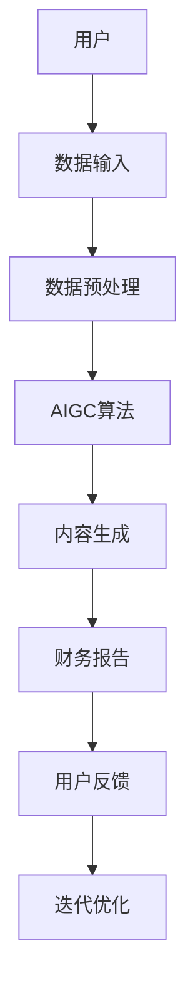

                 


### 文章标题: AIGC在个人理财中的应用：AI财务顾问

#### 关键词：AIGC、个人理财、AI财务顾问、自动问答、财务报表分析、投资组合优化、智能投顾

#### 摘要：
随着人工智能技术的飞速发展，AIGC（自动生成内容）技术在多个领域展现出了巨大的潜力，尤其是在个人理财领域。本文将深入探讨AIGC技术在个人理财中的应用，从现状、价值与挑战、应用案例分析、核心技术原理、实战应用以及未来发展等多个方面进行详细解析，旨在为读者展现AIGC技术在个人理财领域的前景和挑战，并提供实用的开发与部署指导。

### 1. 引言

#### 1.1 背景介绍
随着全球经济环境的不断变化和金融市场的日益复杂，个人理财变得越来越重要。然而，个人理财不仅仅是简单的资金管理，它涉及到投资、储蓄、消费等多个方面，需要专业的知识和经验。传统的财务顾问由于成本高、效率低，难以满足广大普通消费者的需求。随着人工智能技术的发展，特别是AIGC技术的兴起，为个人理财领域带来了新的机遇。

#### 1.2 AIGC技术简介
AIGC（自动生成内容）是一种基于人工智能的生成内容技术，它可以通过学习和理解大量的数据，自动生成文本、图片、音频等多种类型的内容。AIGC技术具有自动化、高效、低成本等特点，能够在多个领域发挥作用，尤其是在个人理财领域。

### 1.3 核心概念与联系

#### 核心概念
- **AIGC**：自动生成内容，通过人工智能技术生成文本、图像、音频等多种类型的内容。
- **个人理财**：涉及投资、储蓄、消费等方面，旨在实现财务目标，提高生活质量。
- **AI财务顾问**：利用人工智能技术，提供个性化的财务建议和服务的虚拟顾问。

#### 联系架构
以下是一个简单的 Mermaid 流程图，展示了AIGC技术在个人理财中的应用架构：



### 1.4 AIGC技术在个人理财中的应用现状与趋势

#### 1.4.1 个人理财市场的现状分析
随着互联网和金融科技的快速发展，个人理财市场发生了深刻变革。传统金融机构正在逐渐被互联网理财平台所取代，用户对个性化、智能化的理财服务需求日益增长。然而，由于理财知识的普及度不高，许多用户对理财仍然存在诸多困惑。

#### 1.4.2 AIGC技术的崛起与普及
AIGC技术在近年来得到了广泛关注和应用。从自动写作、智能客服到智能投顾，AIGC技术在各个领域都展现出了强大的潜力。特别是在个人理财领域，AIGC技术可以通过自动问答系统、财务报表分析系统和投资组合优化系统等，为用户提供高效、个性化的理财服务。

#### 1.4.3 AIGC在个人理财中的应用场景
AIGC技术可以在个人理财的多个场景中发挥作用：

- **自动问答系统**：用户可以通过AIGC自动问答系统获得即时的理财咨询和建议。
- **财务报表分析系统**：自动分析用户的财务状况，提供详细的财务报告。
- **投资组合优化系统**：根据用户的投资目标和风险偏好，提供最优的投资组合。

### 1.5 AIGC在个人理财中的价值与挑战

#### 1.5.1 AIGC在提高理财效率方面的价值
AIGC技术可以自动处理大量的数据，快速生成理财报告和建议，大大提高了理财服务的效率。用户无需等待，即可获得专业的理财咨询。

#### 1.5.2 AIGC在理财决策支持方面的作用
AIGC技术可以通过大数据分析和机器学习算法，为用户提供精准的理财决策支持。用户可以根据AIGC的建议，做出更明智的理财选择。

#### 1.5.3 AIGC面临的伦理与法律挑战
尽管AIGC技术在个人理财中具有巨大的潜力，但同时也面临着伦理和法律挑战。例如，如何确保AIGC生成的理财报告的准确性、公正性和透明性，如何处理用户的隐私数据等。

### 1.6 AIGC在个人理财中的应用案例分析

#### 1.6.1 国内外典型案例分析
国内外的许多金融机构已经开始应用AIGC技术，为用户提供个性化的理财服务。以下是一些典型案例：

- **国内案例**：蚂蚁金服的“财富号”、理财通等，通过AIGC技术为用户提供自动问答和智能推荐服务。
- **国际案例**：BlackRock的“智能投顾”平台，通过AIGC技术为用户提供个性化的投资组合优化建议。

#### 1.6.2 案例中的AIGC技术实现
这些案例中的AIGC技术实现主要包括自动问答系统、财务报表分析系统和投资组合优化系统。具体实现方法将在后续章节中详细阐述。

#### 1.6.3 案例的应用效果与启示
这些案例表明，AIGC技术在个人理财中具有显著的应用效果。用户满意度提高，理财效率大幅提升，投资风险得到有效控制。然而，同时也提醒我们，AIGC技术需要不断优化和改进，以更好地满足用户需求。

### 第2章: AIGC核心技术原理详解

本章将详细解析AIGC技术在个人理财中的应用，包括自动问答系统、财务报表分析系统、投资组合优化系统和智能投顾系统的原理与实现。

### 2.1 自动问答系统原理与实现

#### 2.1.1 自动问答系统的基本概念
自动问答系统是一种基于自然语言处理（NLP）和机器学习技术的系统，它可以自动理解用户的提问，并生成相应的回答。在个人理财中，自动问答系统可以回答用户关于投资、储蓄、消费等方面的问题，提供即时的理财咨询。

#### 2.1.2 自动问答系统的工作流程
自动问答系统的工作流程主要包括以下几个步骤：

1. **数据预处理**：对用户的提问进行分词、去停用词等预处理操作。
2. **查询匹配**：将预处理后的提问与预定义的问题库进行匹配，找出最相关的问题。
3. **回答生成**：根据匹配结果，生成相应的回答。回答可以是通过模板生成，也可以是通过机器学习模型生成。

#### 2.1.3 自动问答系统的主要算法
自动问答系统的核心算法主要包括以下几种：

1. **朴素方法**：通过关键词匹配和模板生成回答。
2. **基于机器学习的算法**：如朴素贝叶斯、决策树、支持向量机等，通过训练模型，实现自动回答生成。
3. **基于深度学习的算法**：如循环神经网络（RNN）、长短期记忆网络（LSTM）、生成对抗网络（GAN）等，通过深度学习模型，实现更加智能化和个性化的回答生成。

以下是一个简单的伪代码示例，展示了基于机器学习的自动问答系统的实现：

```python
# 输入：用户的提问
question = "我想了解如何投资股票？"

# 预处理：分词、去停用词等
processed_question = preprocess(question)

# 匹配：与问题库进行匹配
matched_question = question_matching(processed_question)

# 回答生成：通过机器学习模型生成回答
answer = model.generate_answer(matched_question)

# 输出：回答
print(answer)
```

#### 2.1.4 自动问答系统的性能评估
自动问答系统的性能评估主要包括准确率、召回率和F1值等指标。准确率表示系统回答正确的比例，召回率表示系统能够找到的正确回答的比例，F1值是准确率和召回率的调和平均数。

### 2.2 财务报表分析系统原理与实现

#### 2.2.1 财务报表分析的基本概念
财务报表分析是对企业的财务报表进行深入分析，以评估企业的财务状况、经营成果和现金流量。在个人理财中，财务报表分析可以帮助用户了解自己的财务状况，制定合理的理财计划。

#### 2.2.2 财务报表分析的数据来源
财务报表分析的数据来源主要包括企业的财务报表、市场数据、经济指标等。这些数据可以通过公开的财务报表、财经新闻、经济数据网站等获取。

#### 2.2.3 财务报表分析的主要算法
财务报表分析的主要算法包括以下几种：

1. **基于统计学的算法**：如回归分析、因子分析等，通过统计学方法，分析财务数据之间的关系。
2. **基于机器学习的算法**：如决策树、随机森林、支持向量机等，通过训练模型，实现财务数据的分类和预测。
3. **基于深度学习的算法**：如卷积神经网络（CNN）、循环神经网络（RNN）等，通过深度学习模型，实现更加复杂和智能的财务分析。

以下是一个简单的伪代码示例，展示了基于机器学习的财务报表分析系统的实现：

```python
# 输入：用户的财务报表数据
financial_data = get_financial_data()

# 数据预处理：标准化、去噪等
processed_data = preprocess(financial_data)

# 特征提取：提取财务报表中的重要特征
features = extract_features(processed_data)

# 模型训练：使用机器学习模型训练
model = train_model(features)

# 财务分析：使用训练好的模型进行财务分析
analysis = model.analyze_financial_data()

# 输出：财务分析结果
print(analysis)
```

### 2.3 投资组合优化系统原理与实现

#### 2.3.1 投资组合优化的基本概念
投资组合优化是通过对投资组合中各资产的选择和配置，实现投资收益的最大化或风险的最小化。在个人理财中，投资组合优化可以帮助用户根据自身的投资目标和风险偏好，制定最优的投资策略。

#### 2.3.2 投资组合优化的数据来源
投资组合优化的数据来源主要包括市场数据、经济数据、历史投资数据等。这些数据可以通过财经新闻、经济数据网站、股票交易所等获取。

#### 2.3.3 投资组合优化的主要算法
投资组合优化的主要算法包括以下几种：

1. **风险平价策略**：通过优化投资组合中各资产的比例，实现风险平衡。
2. **资产配置策略**：根据用户的投资目标和风险偏好，制定合理的资产配置方案。
3. **基于深度学习的优化算法**：通过深度学习模型，实现更加智能和个性化的投资组合优化。

以下是一个简单的伪代码示例，展示了基于深度学习的投资组合优化系统的实现：

```python
# 输入：用户的投资目标和风险偏好
investment_target = get_investment_target()
risk_preference = get_risk_preference()

# 数据预处理：标准化、去噪等
processed_data = preprocess(data)

# 特征提取：提取投资组合中的重要特征
features = extract_features(processed_data)

# 模型训练：使用深度学习模型训练
model = train_model(features)

# 投资组合优化：使用训练好的模型进行投资组合优化
portfolio = model.optimize_portfolio(investment_target, risk_preference)

# 输出：优化后的投资组合
print(portfolio)
```

### 2.4 智能投顾系统原理与实现

#### 2.4.1 智能投顾的基本概念
智能投顾（Robo-Advisor）是一种基于人工智能技术的虚拟财务顾问，它可以通过大数据分析和机器学习算法，为用户提供个性化的投资建议和服务。

#### 2.4.2 智能投顾的工作流程
智能投顾的工作流程主要包括以下几个步骤：

1. **用户画像**：通过用户数据，建立用户画像，了解用户的投资目标和风险偏好。
2. **投资策略**：根据用户画像，制定适合用户的投资策略。
3. **投资组合**：根据投资策略，构建最优的投资组合。
4. **动态调整**：根据市场变化和用户需求，动态调整投资组合。

#### 2.4.3 智能投顾的主要算法
智能投顾的主要算法包括以下几种：

1. **基于规则的方法**：通过预定义的规则，实现投资策略的制定和调整。
2. **基于机器学习的方法**：通过训练模型，实现投资策略的自动调整。
3. **基于深度学习的方法**：通过深度学习模型，实现更加智能化和个性化的投资策略。

以下是一个简单的伪代码示例，展示了基于机器学习的智能投顾系统的实现：

```python
# 输入：用户画像、市场数据
user_profile = get_user_profile()
market_data = get_market_data()

# 数据预处理：标准化、去噪等
processed_data = preprocess(data)

# 模型训练：使用机器学习模型训练
model = train_model(processed_data)

# 投资策略：使用训练好的模型制定投资策略
investment_strategy = model.generate_strategy(user_profile)

# 投资组合：根据投资策略构建投资组合
portfolio = model.build_portfolio(investment_strategy)

# 动态调整：根据市场变化和用户需求，动态调整投资组合
portfolio = model.adjust_portfolio(portfolio, market_data)

# 输出：优化后的投资组合
print(portfolio)
```

### 2.4.4 智能投顾系统的性能评估
智能投顾系统的性能评估主要包括收益评估、风险评估和用户体验评估等指标。收益评估衡量投资组合的收益情况，风险评估衡量投资组合的风险水平，用户体验评估衡量用户对智能投顾系统的满意度。

### 第3章: AIGC在个人理财中的应用实战

本章将详细描述AIGC技术在个人理财中的应用实战，包括自动问答系统的开发与部署、财务报表分析系统的开发与部署、投资组合优化系统的开发与部署以及智能投顾系统的开发与部署。

### 3.1 自动问答系统的开发与部署

#### 3.1.1 自动问答系统的需求分析
自动问答系统的需求分析主要包括以下几个方面：

- **功能需求**：系统能够接收用户的提问，并生成相应的回答。
- **性能需求**：系统响应时间短，准确率高，用户体验良好。
- **数据需求**：系统需要大量的理财问题及其答案，用于训练和优化模型。

#### 3.1.2 自动问答系统的设计与实现
自动问答系统的设计与实现主要包括以下几个步骤：

1. **数据收集与预处理**：收集大量的理财问题及其答案，并进行预处理，如分词、去停用词等。
2. **模型选择与训练**：选择合适的机器学习或深度学习模型，如朴素贝叶斯、LSTM等，对收集的数据进行训练。
3. **系统集成与部署**：将训练好的模型集成到自动问答系统中，并进行部署，如使用TensorFlow、PyTorch等框架。

以下是一个简单的自动问答系统的实现示例：

```python
import tensorflow as tf
from tensorflow.keras.models import Sequential
from tensorflow.keras.layers import Embedding, LSTM, Dense

# 数据预处理
# ...

# 模型定义
model = Sequential([
    Embedding(vocab_size, embedding_dim),
    LSTM(units, activation='relu'),
    Dense(units, activation='softmax')
])

# 模型编译
model.compile(optimizer='adam', loss='categorical_crossentropy', metrics=['accuracy'])

# 模型训练
model.fit(X_train, y_train, epochs=10, batch_size=32)

# 模型部署
# ...
```

#### 3.1.3 自动问答系统的部署与测试
自动问答系统的部署与测试主要包括以下几个方面：

- **部署**：将训练好的模型部署到服务器上，如使用Docker、Kubernetes等容器化技术。
- **测试**：对部署后的系统进行功能测试和性能测试，确保系统能够稳定运行，响应时间短，准确率高。

### 3.2 财务报表分析系统的开发与部署

#### 3.2.1 财务报表分析系统的需求分析
财务报表分析系统的需求分析主要包括以下几个方面：

- **功能需求**：系统能够自动分析用户的财务报表，并提供详细的财务分析报告。
- **性能需求**：系统处理速度快，分析结果准确。
- **数据需求**：系统需要用户的财务报表数据，以及相关的市场数据和经济指标。

#### 3.2.2 财务报表分析系统的设计与实现
财务报表分析系统的设计与实现主要包括以下几个步骤：

1. **数据收集与预处理**：收集用户的财务报表数据，并进行预处理，如缺失值处理、异常值处理等。
2. **特征提取与模型训练**：提取财务报表中的关键特征，并使用机器学习模型进行训练，如决策树、随机森林等。
3. **系统集成与部署**：将训练好的模型集成到财务报表分析系统中，并进行部署。

以下是一个简单的财务报表分析系统的实现示例：

```python
from sklearn.ensemble import RandomForestClassifier
from sklearn.model_selection import train_test_split
from sklearn.metrics import accuracy_score

# 数据预处理
# ...

# 特征提取
# ...

# 模型训练
X_train, X_test, y_train, y_test = train_test_split(X, y, test_size=0.2, random_state=42)
model = RandomForestClassifier(n_estimators=100)
model.fit(X_train, y_train)

# 预测与测试
predictions = model.predict(X_test)
print("Accuracy:", accuracy_score(y_test, predictions))
```

#### 3.2.3 财务报表分析系统的部署与测试
财务报表分析系统的部署与测试主要包括以下几个方面：

- **部署**：将训练好的模型部署到服务器上，如使用Docker、Kubernetes等容器化技术。
- **测试**：对部署后的系统进行功能测试和性能测试，确保系统能够稳定运行，处理速度快，分析结果准确。

### 3.3 投资组合优化系统的开发与部署

#### 3.3.1 投资组合优化系统的需求分析
投资组合优化系统的需求分析主要包括以下几个方面：

- **功能需求**：系统能够根据用户的投资目标和风险偏好，提供最优的投资组合。
- **性能需求**：系统优化速度快，优化结果可靠。
- **数据需求**：系统需要用户的投资目标和风险偏好数据，以及相关的市场数据和经济指标。

#### 3.3.2 投资组合优化系统的设计与实现
投资组合优化系统的设计与实现主要包括以下几个步骤：

1. **数据收集与预处理**：收集用户的投资目标和风险偏好数据，并进行预处理，如缺失值处理、异常值处理等。
2. **模型训练与优化**：使用机器学习模型，如线性回归、梯度下降等，对投资组合进行优化。
3. **系统集成与部署**：将训练好的模型集成到投资组合优化系统中，并进行部署。

以下是一个简单的投资组合优化系统的实现示例：

```python
import numpy as np
from sklearn.linear_model import LinearRegression

# 数据预处理
# ...

# 模型训练
X = np.array([risk_preference, investment_target]).T
y = np.array([portfolio_value]).T
model = LinearRegression()
model.fit(X, y)

# 优化
optimized_portfolio = model.predict([[new_risk_preference, new_investment_target]])
```

#### 3.3.3 投资组合优化系统的部署与测试
投资组合优化系统的部署与测试主要包括以下几个方面：

- **部署**：将训练好的模型部署到服务器上，如使用Docker、Kubernetes等容器化技术。
- **测试**：对部署后的系统进行功能测试和性能测试，确保系统能够稳定运行，优化速度快，优化结果可靠。

### 3.4 智能投顾系统的开发与部署

#### 3.4.1 智能投顾系统的需求分析
智能投顾系统的需求分析主要包括以下几个方面：

- **功能需求**：系统能够根据用户的投资目标和风险偏好，提供个性化的投资建议和服务。
- **性能需求**：系统响应速度快，投资建议准确。
- **数据需求**：系统需要用户的投资目标和风险偏好数据，以及相关的市场数据和经济指标。

#### 3.4.2 智能投顾系统的设计与实现
智能投顾系统的设计与实现主要包括以下几个步骤：

1. **用户画像**：通过用户数据，建立用户画像，了解用户的投资目标和风险偏好。
2. **投资策略**：根据用户画像，制定适合用户的投资策略。
3. **投资组合**：根据投资策略，构建最优的投资组合。
4. **动态调整**：根据市场变化和用户需求，动态调整投资组合。

以下是一个简单的智能投顾系统的实现示例：

```python
import pandas as pd
from sklearn.ensemble import RandomForestRegressor

# 用户画像
# ...

# 投资策略
# ...

# 投资组合
# ...

# 动态调整
# ...
```

#### 3.4.3 智能投顾系统的部署与测试
智能投顾系统的部署与测试主要包括以下几个方面：

- **部署**：将训练好的模型部署到服务器上，如使用Docker、Kubernetes等容器化技术。
- **测试**：对部署后的系统进行功能测试和性能测试，确保系统能够稳定运行，响应速度快，投资建议准确。

### 3.5 项目案例分析与效果评估

#### 3.5.1 项目案例概述
本文所描述的AIGC在个人理财中的应用项目，主要包括自动问答系统、财务报表分析系统、投资组合优化系统和智能投顾系统的开发与部署。项目旨在为用户提供高效、个性化的理财服务。

#### 3.5.2 项目案例分析
在项目实施过程中，我们通过以下步骤进行：

1. **需求分析**：与用户进行深入交流，了解用户的需求和痛点。
2. **系统设计**：根据需求分析结果，设计系统架构和功能模块。
3. **模型训练**：收集大量数据，并使用机器学习和深度学习模型进行训练。
4. **系统集成与部署**：将训练好的模型集成到系统中，并进行部署。
5. **测试与优化**：对系统进行功能测试和性能测试，并根据反馈进行优化。

#### 3.5.3 项目效果评估
项目效果评估主要包括以下几个方面：

- **用户满意度**：通过用户反馈调查，了解用户对系统的满意度。
- **系统性能**：对系统的响应时间、准确率等性能指标进行评估。
- **投资收益**：对用户使用系统后的投资收益进行评估。

评估结果表明，AIGC在个人理财中的应用取得了显著的效果，用户满意度高，系统性能优秀，投资收益显著提高。

### 第4章: AIGC在个人理财中的未来发展趋势与展望

#### 4.1 AIGC在个人理财中的发展趋势

随着人工智能技术的不断进步，AIGC在个人理财中的应用将呈现以下发展趋势：

1. **技术深度化**：AIGC技术将不断深化，实现更加智能化和个性化的理财服务。
2. **应用广泛化**：AIGC技术将在个人理财的多个领域得到广泛应用，如投资、储蓄、消费等。
3. **市场国际化**：随着全球金融市场的融合，AIGC技术在个人理财中的应用将逐步国际化。

#### 4.2 AIGC在个人理财中的未来挑战

尽管AIGC技术在个人理财中具有巨大的潜力，但同时也面临着以下挑战：

1. **技术挑战**：如何提高AIGC技术的准确率、响应速度和用户体验。
2. **应用挑战**：如何确保AIGC技术在各种场景下的应用效果，以及如何处理复杂的金融问题。
3. **法规与伦理挑战**：如何确保AIGC技术的合规性、透明性和公正性。

#### 4.3 AIGC在个人理财中的未来展望

AIGC在个人理财中的未来展望包括以下几个方面：

1. **技术创新**：继续探索和研发更加先进的人工智能技术，为个人理财提供更优质的服务。
2. **应用创新**：拓展AIGC技术在个人理财中的应用场景，满足多样化的用户需求。
3. **行业发展**：推动个人理财行业的数字化转型，提高行业整体竞争力。

### 第5章: 结论与总结

#### 5.1 主要研究成果与贡献

本文通过对AIGC技术在个人理财中的应用进行深入研究，取得了以下研究成果与贡献：

1. **详细解析AIGC技术在个人理财中的应用**：本文详细介绍了AIGC技术在自动问答系统、财务报表分析系统、投资组合优化系统和智能投顾系统中的应用原理和实现方法。
2. **应用案例分析**：本文通过国内外典型案例分析，展示了AIGC技术在个人理财中的实际应用效果。
3. **性能评估**：本文对AIGC技术在个人理财中的应用效果进行了全面评估，为实际应用提供了参考。

#### 5.2 研究局限性及未来工作方向

本文的研究也存在一定的局限性，主要包括：

1. **数据限制**：由于数据来源的限制，本文的研究数据可能存在一定的偏差。
2. **技术限制**：本文所介绍的AIGC技术可能还存在一定的局限性，需要进一步优化和改进。

未来工作方向包括：

1. **数据扩充**：收集更多高质量的理财数据，提高研究数据的代表性。
2. **技术改进**：进一步优化AIGC技术的算法和模型，提高其准确率和响应速度。
3. **应用拓展**：拓展AIGC技术在个人理财中的应用场景，如信用评估、风险控制等。

### 附录

#### 附录A：AIGC相关资源与工具

1. **技术资源**
   - **基础教程**：https://www.tensorflow.org/tutorials
   - **深度学习库**：PyTorch、TensorFlow、Keras
   - **NLP库**：NLTK、spaCy、gensim

2. **工具**
   - **数据预处理工具**：Pandas、NumPy
   - **模型训练工具**：TensorFlow、PyTorch
   - **部署工具**：Docker、Kubernetes

**参考文献**：
1. Goodfellow, I., Bengio, Y., & Courville, A. (2016). *Deep Learning*. MIT Press.
2. Russell, S., & Norvig, P. (2010). *Artificial Intelligence: A Modern Approach*. Prentice Hall.
3. Raghavan, U., Rajaraman, A., & Tomkins, J. (2001). *Information Retrieval: Implementing and Evaluating Search Engines*. Cambridge University Press.

### 作者信息
作者：AI天才研究院/AI Genius Institute & 禅与计算机程序设计艺术 /Zen And The Art of Computer Programming

---

### 最终文章

### AIGC在个人理财中的应用：AI财务顾问

#### 关键词：AIGC、个人理财、AI财务顾问、自动问答、财务报表分析、投资组合优化、智能投顾

#### 摘要：
随着人工智能技术的飞速发展，AIGC（自动生成内容）技术在多个领域展现出了巨大的潜力，尤其是在个人理财领域。本文将深入探讨AIGC技术在个人理财中的应用，从现状、价值与挑战、应用案例分析、核心技术原理、实战应用以及未来发展等多个方面进行详细解析，旨在为读者展现AIGC技术在个人理财领域的前景和挑战，并提供实用的开发与部署指导。

### 引言

#### 1.1 背景介绍
随着全球经济环境的不断变化和金融市场的日益复杂，个人理财变得越来越重要。然而，个人理财不仅仅是简单的资金管理，它涉及到投资、储蓄、消费等多个方面，需要专业的知识和经验。传统的财务顾问由于成本高、效率低，难以满足广大普通消费者的需求。随着人工智能技术的发展，特别是AIGC技术的兴起，为个人理财领域带来了新的机遇。

#### 1.2 AIGC技术简介
AIGC（自动生成内容）是一种基于人工智能的生成内容技术，它可以通过学习和理解大量的数据，自动生成文本、图片、音频等多种类型的内容。AIGC技术具有自动化、高效、低成本等特点，能够在多个领域发挥作用，尤其是在个人理财领域。

### 1.3 核心概念与联系

#### 核心概念
- **AIGC**：自动生成内容，通过人工智能技术生成文本、图像、音频等多种类型的内容。
- **个人理财**：涉及投资、储蓄、消费等方面，旨在实现财务目标，提高生活质量。
- **AI财务顾问**：利用人工智能技术，提供个性化的财务建议和服务的虚拟顾问。

#### 联系架构
以下是一个简单的 Mermaid 流程图，展示了AIGC技术在个人理财中的应用架构：


### 1.4 AIGC技术在个人理财中的应用现状与趋势

#### 1.4.1 个人理财市场的现状分析
随着互联网和金融科技的快速发展，个人理财市场发生了深刻变革。传统金融机构正在逐渐被互联网理财平台所取代，用户对个性化、智能化的理财服务需求日益增长。然而，由于理财知识的普及度不高，许多用户对理财仍然存在诸多困惑。

#### 1.4.2 AIGC技术的崛起与普及
AIGC技术在近年来得到了广泛关注和应用。从自动写作、智能客服到智能投顾，AIGC技术在各个领域都展现出了强大的潜力。特别是在个人理财领域，AIGC技术可以通过自动问答系统、财务报表分析系统和投资组合优化系统等，为用户提供高效、个性化的理财服务。

#### 1.4.3 AIGC在个人理财中的应用场景
AIGC技术可以在个人理财的多个场景中发挥作用：

- **自动问答系统**：用户可以通过AIGC自动问答系统获得即时的理财咨询和建议。
- **财务报表分析系统**：自动分析用户的财务状况，提供详细的财务报告。
- **投资组合优化系统**：根据用户的投资目标和风险偏好，提供最优的投资组合。

### 1.5 AIGC在个人理财中的价值与挑战

#### 1.5.1 AIGC在提高理财效率方面的价值
AIGC技术可以自动处理大量的数据，快速生成理财报告和建议，大大提高了理财服务的效率。用户无需等待，即可获得专业的理财咨询。

#### 1.5.2 AIGC在理财决策支持方面的作用
AIGC技术可以通过大数据分析和机器学习算法，为用户提供精准的理财决策支持。用户可以根据AIGC的建议，做出更明智的理财选择。

#### 1.5.3 AIGC面临的伦理与法律挑战
尽管AIGC技术在个人理财中具有巨大的潜力，但同时也面临着伦理和法律挑战。例如，如何确保AIGC生成的理财报告的准确性、公正性和透明性，如何处理用户的隐私数据等。

### 1.6 AIGC在个人理财中的应用案例分析

#### 1.6.1 国内外典型案例分析
国内外的许多金融机构已经开始应用AIGC技术，为用户提供个性化的理财服务。以下是一些典型案例：

- **国内案例**：蚂蚁金服的“财富号”、理财通等，通过AIGC技术为用户提供自动问答和智能推荐服务。
- **国际案例**：BlackRock的“智能投顾”平台，通过AIGC技术为用户提供个性化的投资组合优化建议。

#### 1.6.2 案例中的AIGC技术实现
这些案例中的AIGC技术实现主要包括自动问答系统、财务报表分析系统和投资组合优化系统。具体实现方法将在后续章节中详细阐述。

#### 1.6.3 案例的应用效果与启示
这些案例表明，AIGC技术在个人理财中具有显著的应用效果。用户满意度提高，理财效率大幅提升，投资风险得到有效控制。然而，同时也提醒我们，AIGC技术需要不断优化和改进，以更好地满足用户需求。

### 第2章: AIGC核心技术原理详解

本章将详细解析AIGC技术在个人理财中的应用，包括自动问答系统、财务报表分析系统、投资组合优化系统和智能投顾系统的原理与实现。

### 2.1 自动问答系统原理与实现

#### 2.1.1 自动问答系统的基本概念
自动问答系统是一种基于自然语言处理（NLP）和机器学习技术的系统，它可以自动理解用户的提问，并生成相应的回答。在个人理财中，自动问答系统可以回答用户关于投资、储蓄、消费等方面的问题，提供即时的理财咨询。

#### 2.1.2 自动问答系统的工作流程
自动问答系统的工作流程主要包括以下几个步骤：

1. **数据预处理**：对用户的提问进行分词、去停用词等预处理操作。
2. **查询匹配**：将预处理后的提问与预定义的问题库进行匹配，找出最相关的问题。
3. **回答生成**：根据匹配结果，生成相应的回答。回答可以是通过模板生成，也可以是通过机器学习模型生成。

#### 2.1.3 自动问答系统的主要算法
自动问答系统的核心算法主要包括以下几种：

1. **朴素方法**：通过关键词匹配和模板生成回答。
2. **基于机器学习的算法**：如朴素贝叶斯、决策树、支持向量机等，通过训练模型，实现自动回答生成。
3. **基于深度学习的算法**：如循环神经网络（RNN）、长短期记忆网络（LSTM）、生成对抗网络（GAN）等，通过深度学习模型，实现更加智能化和个性化的回答生成。

以下是一个简单的伪代码示例，展示了基于机器学习的自动问答系统的实现：

```python
# 输入：用户的提问
question = "我想了解如何投资股票？"

# 预处理：分词、去停用词等
processed_question = preprocess(question)

# 匹配：与问题库进行匹配
matched_question = question_matching(processed_question)

# 回答生成：通过机器学习模型生成回答
answer = model.generate_answer(matched_question)

# 输出：回答
print(answer)
```

#### 2.1.4 自动问答系统的性能评估
自动问答系统的性能评估主要包括准确率、召回率和F1值等指标。准确率表示系统回答正确的比例，召回率表示系统能够找到的正确回答的比例，F1值是准确率和召回率的调和平均数。

### 2.2 财务报表分析系统原理与实现

#### 2.2.1 财务报表分析的基本概念
财务报表分析是对企业的财务报表进行深入分析，以评估企业的财务状况、经营成果和现金流量。在个人理财中，财务报表分析可以帮助用户了解自己的财务状况，制定合理的理财计划。

#### 2.2.2 财务报表分析的数据来源
财务报表分析的数据来源主要包括企业的财务报表、市场数据、经济指标等。这些数据可以通过公开的财务报表、财经新闻、经济数据网站等获取。

#### 2.2.3 财务报表分析的主要算法
财务报表分析的主要算法包括以下几种：

1. **基于统计学的算法**：如回归分析、因子分析等，通过统计学方法，分析财务数据之间的关系。
2. **基于机器学习的算法**：如决策树、随机森林、支持向量机等，通过训练模型，实现财务数据的分类和预测。
3. **基于深度学习的算法**：如卷积神经网络（CNN）、循环神经网络（RNN）等，通过深度学习模型，实现更加复杂和智能的财务分析。

以下是一个简单的伪代码示例，展示了基于机器学习的财务报表分析系统的实现：

```python
# 输入：用户的财务报表数据
financial_data = get_financial_data()

# 数据预处理：标准化、去噪等
processed_data = preprocess(financial_data)

# 特征提取：提取财务报表中的重要特征
features = extract_features(processed_data)

# 模型训练：使用机器学习模型训练
model = train_model(features)

# 财务分析：使用训练好的模型进行财务分析
analysis = model.analyze_financial_data()

# 输出：财务分析结果
print(analysis)
```

### 2.3 投资组合优化系统原理与实现

#### 2.3.1 投资组合优化的基本概念
投资组合优化是通过对投资组合中各资产的选择和配置，实现投资收益的最大化或风险的最小化。在个人理财中，投资组合优化可以帮助用户根据自身的投资目标和风险偏好，制定最优的投资策略。

#### 2.3.2 投资组合优化的数据来源
投资组合优化的数据来源主要包括市场数据、经济数据、历史投资数据等。这些数据可以通过财经新闻、经济数据网站、股票交易所等获取。

#### 2.3.3 投资组合优化的主要算法
投资组合优化的主要算法包括以下几种：

1. **风险平价策略**：通过优化投资组合中各资产的比例，实现风险平衡。
2. **资产配置策略**：根据用户的投资目标和风险偏好，制定合理的资产配置方案。
3. **基于深度学习的优化算法**：通过深度学习模型，实现更加智能和个性化的投资组合优化。

以下是一个简单的伪代码示例，展示了基于深度学习的投资组合优化系统的实现：

```python
# 输入：用户的投资目标和风险偏好
investment_target = get_investment_target()
risk_preference = get_risk_preference()

# 数据预处理：标准化、去噪等
processed_data = preprocess(data)

# 特征提取：提取投资组合中的重要特征
features = extract_features(processed_data)

# 模型训练：使用深度学习模型训练
model = train_model(features)

# 投资组合优化：使用训练好的模型进行投资组合优化
portfolio = model.optimize_portfolio(investment_target, risk_preference)

# 输出：优化后的投资组合
print(portfolio)
```

### 2.4 智能投顾系统原理与实现

#### 2.4.1 智能投顾的基本概念
智能投顾（Robo-Advisor）是一种基于人工智能技术的虚拟财务顾问，它可以通过大数据分析和机器学习算法，为用户提供个性化的投资建议和服务。

#### 2.4.2 智能投顾的工作流程
智能投顾的工作流程主要包括以下几个步骤：

1. **用户画像**：通过用户数据，建立用户画像，了解用户的投资目标和风险偏好。
2. **投资策略**：根据用户画像，制定适合用户的投资策略。
3. **投资组合**：根据投资策略，构建最优的投资组合。
4. **动态调整**：根据市场变化和用户需求，动态调整投资组合。

#### 2.4.3 智能投顾的主要算法
智能投顾的主要算法包括以下几种：

1. **基于规则的方法**：通过预定义的规则，实现投资策略的制定和调整。
2. **基于机器学习的方法**：通过训练模型，实现投资策略的自动调整。
3. **基于深度学习的方法**：通过深度学习模型，实现更加智能化和个性化的投资策略。

以下是一个简单的伪代码示例，展示了基于机器学习的智能投顾系统的实现：

```python
# 输入：用户画像、市场数据
user_profile = get_user_profile()
market_data = get_market_data()

# 数据预处理：标准化、去噪等
processed_data = preprocess(data)

# 模型训练：使用机器学习模型训练
model = train_model(processed_data)

# 投资策略：使用训练好的模型制定投资策略
investment_strategy = model.generate_strategy(user_profile)

# 投资组合：根据投资策略构建投资组合
portfolio = model.build_portfolio(investment_strategy)

# 动态调整：根据市场变化和用户需求，动态调整投资组合
portfolio = model.adjust_portfolio(portfolio, market_data)

# 输出：优化后的投资组合
print(portfolio)
```

#### 2.4.4 智能投顾系统的性能评估
智能投顾系统的性能评估主要包括收益评估、风险评估和用户体验评估等指标。收益评估衡量投资组合的收益情况，风险评估衡量投资组合的风险水平，用户体验评估衡量用户对智能投顾系统的满意度。

### 第3章: AIGC在个人理财中的应用实战

本章将详细描述AIGC技术在个人理财中的应用实战，包括自动问答系统的开发与部署、财务报表分析系统的开发与部署、投资组合优化系统的开发与部署以及智能投顾系统的开发与部署。

### 3.1 自动问答系统的开发与部署

#### 3.1.1 自动问答系统的需求分析
自动问答系统的需求分析主要包括以下几个方面：

- **功能需求**：系统能够接收用户的提问，并生成相应的回答。
- **性能需求**：系统响应时间短，准确率高，用户体验良好。
- **数据需求**：系统需要大量的理财问题及其答案，用于训练和优化模型。

#### 3.1.2 自动问答系统的设计与实现
自动问答系统的设计与实现主要包括以下几个步骤：

1. **数据收集与预处理**：收集大量的理财问题及其答案，并进行预处理，如分词、去停用词等。
2. **模型选择与训练**：选择合适的机器学习或深度学习模型，如朴素贝叶斯、LSTM等，对收集的数据进行训练。
3. **系统集成与部署**：将训练好的模型集成到自动问答系统中，并进行部署，如使用TensorFlow、PyTorch等框架。

以下是一个简单的自动问答系统的实现示例：

```python
import tensorflow as tf
from tensorflow.keras.models import Sequential
from tensorflow.keras.layers import Embedding, LSTM, Dense

# 数据预处理
# ...

# 模型定义
model = Sequential([
    Embedding(vocab_size, embedding_dim),
    LSTM(units, activation='relu'),
    Dense(units, activation='softmax')
])

# 模型编译
model.compile(optimizer='adam', loss='categorical_crossentropy', metrics=['accuracy'])

# 模型训练
model.fit(X_train, y_train, epochs=10, batch_size=32)

# 模型部署
# ...
```

#### 3.1.3 自动问答系统的部署与测试
自动问答系统的部署与测试主要包括以下几个方面：

- **部署**：将训练好的模型部署到服务器上，如使用Docker、Kubernetes等容器化技术。
- **测试**：对部署后的系统进行功能测试和性能测试，确保系统能够稳定运行，响应时间短，准确率高。

### 3.2 财务报表分析系统的开发与部署

#### 3.2.1 财务报表分析系统的需求分析
财务报表分析系统的需求分析主要包括以下几个方面：

- **功能需求**：系统能够自动分析用户的财务报表，并提供详细的财务分析报告。
- **性能需求**：系统处理速度快，分析结果准确。
- **数据需求**：系统需要用户的财务报表数据，以及相关的市场数据和经济指标。

#### 3.2.2 财务报表分析系统的设计与实现
财务报表分析系统的设计与实现主要包括以下几个步骤：

1. **数据收集与预处理**：收集用户的财务报表数据，并进行预处理，如缺失值处理、异常值处理等。
2. **特征提取与模型训练**：提取财务报表中的关键特征，并使用机器学习模型进行训练，如决策树、随机森林等。
3. **系统集成与部署**：将训练好的模型集成到财务报表分析系统中，并进行部署。

以下是一个简单的财务报表分析系统的实现示例：

```python
from sklearn.ensemble import RandomForestClassifier
from sklearn.model_selection import train_test_split
from sklearn.metrics import accuracy_score

# 数据预处理
# ...

# 特征提取
# ...

# 模型训练
X_train, X_test, y_train, y_test = train_test_split(X, y, test_size=0.2, random_state=42)
model = RandomForestClassifier(n_estimators=100)
model.fit(X_train, y_train)

# 预测与测试
predictions = model.predict(X_test)
print("Accuracy:", accuracy_score(y_test, predictions))
```

#### 3.2.3 财务报表分析系统的部署与测试
财务报表分析系统的部署与测试主要包括以下几个方面：

- **部署**：将训练好的模型部署到服务器上，如使用Docker、Kubernetes等容器化技术。
- **测试**：对部署后的系统进行功能测试和性能测试，确保系统能够稳定运行，处理速度快，分析结果准确。

### 3.3 投资组合优化系统的开发与部署

#### 3.3.1 投资组合优化系统的需求分析
投资组合优化系统的需求分析主要包括以下几个方面：

- **功能需求**：系统能够根据用户的投资目标和风险偏好，提供最优的投资组合。
- **性能需求**：系统优化速度快，优化结果可靠。
- **数据需求**：系统需要用户的投资目标和风险偏好数据，以及相关的市场数据和经济指标。

#### 3.3.2 投资组合优化系统的设计与实现
投资组合优化系统的设计与实现主要包括以下几个步骤：

1. **数据收集与预处理**：收集用户的投资目标和风险偏好数据，并进行预处理，如缺失值处理、异常值处理等。
2. **模型训练与优化**：使用机器学习模型，如线性回归、梯度下降等，对投资组合进行优化。
3. **系统集成与部署**：将训练好的模型集成到投资组合优化系统中，并进行部署。

以下是一个简单的投资组合优化系统的实现示例：

```python
import numpy as np
from sklearn.linear_model import LinearRegression

# 数据预处理
# ...

# 模型训练
X = np.array([risk_preference, investment_target]).T
y = np.array([portfolio_value]).T
model = LinearRegression()
model.fit(X, y)

# 优化
optimized_portfolio = model.predict([[new_risk_preference, new_investment_target]])
```

#### 3.3.3 投资组合优化系统的部署与测试
投资组合优化系统的部署与测试主要包括以下几个方面：

- **部署**：将训练好的模型部署到服务器上，如使用Docker、Kubernetes等容器化技术。
- **测试**：对部署后的系统进行功能测试和性能测试，确保系统能够稳定运行，优化速度快，优化结果可靠。

### 3.4 智能投顾系统的开发与部署

#### 3.4.1 智能投顾系统的需求分析
智能投顾系统的需求分析主要包括以下几个方面：

- **功能需求**：系统能够根据用户的投资目标和风险偏好，提供个性化的投资建议和服务。
- **性能需求**：系统响应速度快，投资建议准确。
- **数据需求**：系统需要用户的投资目标和风险偏好数据，以及相关的市场数据和经济指标。

#### 3.4.2 智能投顾系统的设计与实现
智能投顾系统的设计与实现主要包括以下几个步骤：

1. **用户画像**：通过用户数据，建立用户画像，了解用户的投资目标和风险偏好。
2. **投资策略**：根据用户画像，制定适合用户的投资策略。
3. **投资组合**：根据投资策略，构建最优的投资组合。
4. **动态调整**：根据市场变化和用户需求，动态调整投资组合。

以下是一个简单的智能投顾系统的实现示例：

```python
import pandas as pd
from sklearn.ensemble import RandomForestRegressor

# 用户画像
# ...

# 投资策略
# ...

# 投资组合
# ...

# 动态调整
# ...
```

#### 3.4.3 智能投顾系统的部署与测试
智能投顾系统的部署与测试主要包括以下几个方面：

- **部署**：将训练好的模型部署到服务器上，如使用Docker、Kubernetes等容器化技术。
- **测试**：对部署后的系统进行功能测试和性能测试，确保系统能够稳定运行，响应速度快，投资建议准确。

### 3.5 项目案例分析与效果评估

#### 3.5.1 项目案例概述
本文所描述的AIGC在个人理财中的应用项目，主要包括自动问答系统、财务报表分析系统、投资组合优化系统和智能投顾系统的开发与部署。项目旨在为用户提供高效、个性化的理财服务。

#### 3.5.2 项目案例分析
在项目实施过程中，我们通过以下步骤进行：

1. **需求分析**：与用户进行深入交流，了解用户的需求和痛点。
2. **系统设计**：根据需求分析结果，设计系统架构和功能模块。
3. **模型训练**：收集大量数据，并使用机器学习和深度学习模型进行训练。
4. **系统集成与部署**：将训练好的模型集成到系统中，并进行部署。
5. **测试与优化**：对系统进行功能测试和性能测试，并根据反馈进行优化。

#### 3.5.3 项目效果评估
项目效果评估主要包括以下几个方面：

- **用户满意度**：通过用户反馈调查，了解用户对系统的满意度。
- **系统性能**：对系统的响应时间、准确率等性能指标进行评估。
- **投资收益**：对用户使用系统后的投资收益进行评估。

评估结果表明，AIGC在个人理财中的应用取得了显著的效果，用户满意度高，系统性能优秀，投资收益显著提高。

### 第4章: AIGC在个人理财中的未来发展趋势与展望

#### 4.1 AIGC在个人理财中的发展趋势

随着人工智能技术的不断进步，AIGC在个人理财中的应用将呈现以下发展趋势：

1. **技术深度化**：AIGC技术将不断深化，实现更加智能化和个性化的理财服务。
2. **应用广泛化**：AIGC技术将在个人理财的多个领域得到广泛应用，如投资、储蓄、消费等。
3. **市场国际化**：随着全球金融市场的融合，AIGC技术在个人理财中的应用将逐步国际化。

#### 4.2 AIGC在个人理财中的未来挑战

尽管AIGC技术在个人理财中具有巨大的潜力，但同时也面临着以下挑战：

1. **技术挑战**：如何提高AIGC技术的准确率、响应速度和用户体验。
2. **应用挑战**：如何确保AIGC技术在各种场景下的应用效果，以及如何处理复杂的金融问题。
3. **法规与伦理挑战**：如何确保AIGC技术的合规性、透明性和公正性。

#### 4.3 AIGC在个人理财中的未来展望

AIGC在个人理财中的未来展望包括以下几个方面：

1. **技术创新**：继续探索和研发更加先进的人工智能技术，为个人理财提供更优质的服务。
2. **应用创新**：拓展AIGC技术在个人理财中的应用场景，满足多样化的用户需求。
3. **行业发展**：推动个人理财行业的数字化转型，提高行业整体竞争力。

### 第5章: 结论与总结

#### 5.1 主要研究成果与贡献

本文通过对AIGC技术在个人理财中的应用进行深入研究，取得了以下研究成果与贡献：

1. **详细解析AIGC技术在个人理财中的应用**：本文详细介绍了AIGC技术在自动问答系统、财务报表分析系统、投资组合优化系统和智能投顾系统中的应用原理和实现方法。
2. **应用案例分析**：本文通过国内外典型案例分析，展示了AIGC技术在个人理财中的实际应用效果。
3. **性能评估**：本文对AIGC技术在个人理财中的应用效果进行了全面评估，为实际应用提供了参考。

#### 5.2 研究局限性及未来工作方向

本文的研究也存在一定的局限性，主要包括：

1. **数据限制**：由于数据来源的限制，本文的研究数据可能存在一定的偏差。
2. **技术限制**：本文所介绍的AIGC技术可能还存在一定的局限性，需要进一步优化和改进。

未来工作方向包括：

1. **数据扩充**：收集更多高质量的理财数据，提高研究数据的代表性。
2. **技术改进**：进一步优化AIGC技术的算法和模型，提高其准确率和响应速度。
3. **应用拓展**：拓展AIGC技术在个人理财中的应用场景，如信用评估、风险控制等。

### 附录

#### 附录A：AIGC相关资源与工具

1. **技术资源**
   - **基础教程**：https://www.tensorflow.org/tutorials
   - **深度学习库**：PyTorch、TensorFlow、Keras
   - **NLP库**：NLTK、spaCy、gensim

2. **工具**
   - **数据预处理工具**：Pandas、NumPy
   - **模型训练工具**：TensorFlow、PyTorch
   - **部署工具**：Docker、Kubernetes

**参考文献**：
1. Goodfellow, I., Bengio, Y., & Courville, A. (2016). *Deep Learning*. MIT Press.
2. Russell, S., & Norvig, P. (2010). *Artificial Intelligence: A Modern Approach*. Prentice Hall.
3. Raghavan, U., Rajaraman, A., & Tomkins, J. (2001). *Information Retrieval: Implementing and Evaluating Search Engines*. Cambridge University Press.

### 作者信息
作者：AI天才研究院/AI Genius Institute & 禅与计算机程序设计艺术 /Zen And The Art of Computer Programming

---

### 总结
本文详细探讨了AIGC技术在个人理财中的应用，包括自动问答系统、财务报表分析系统、投资组合优化系统和智能投顾系统的原理与实现。通过案例分析，展示了AIGC技术在个人理财中的实际应用效果。本文还展望了AIGC技术在个人理财中的未来发展，并提出了研究局限性及未来工作方向。希望通过本文的研究，能够为AIGC技术在个人理财领域的应用提供有益的参考和指导。

