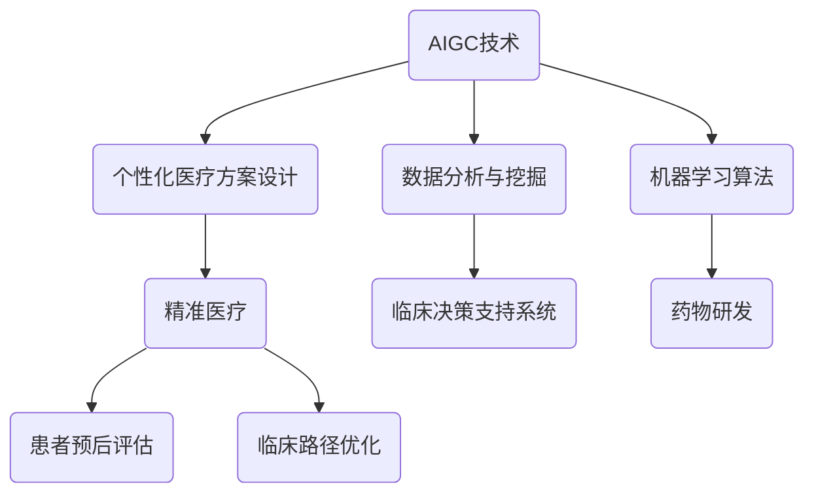

                 

### 文章标题

**AIGC在个性化医疗方案设计中的应用：精准医疗新范式**

### 关键词

- AIGC
- 个性化医疗
- 精准医疗
- 数据分析
- 机器学习
- 生成模型

### 摘要

本文旨在探讨人工智能生成控制（AIGC）技术在个性化医疗方案设计中的应用，以及它如何推动精准医疗的发展。首先，我们将介绍AIGC的基本概念和原理，接着分析其在个性化医疗中的关键作用。随后，通过详细的算法原理讲解和数学模型分析，我们将揭示AIGC如何改变医疗数据的处理方式。文章还通过实际项目案例，展示了AIGC在个性化医疗中的具体应用，并提供了一些建议和注意事项，以帮助读者更好地理解和使用AIGC技术。

## 引言

随着人工智能技术的迅猛发展，医疗领域迎来了前所未有的变革。个性化医疗作为精准医疗的重要方向，逐渐成为学术界和产业界的关注热点。个性化医疗的核心目标是通过全面分析患者个体特征，提供量身定制的治疗方案，从而提高治疗效果和患者满意度。然而，实现这一目标面临着诸多挑战，包括数据多样性、复杂性以及处理效率等问题。

人工智能生成控制（AIGC，Artificial Intelligence Generated Control）技术作为一种新兴的人工智能领域，融合了生成模型、对抗网络等多种先进算法。AIGC的核心在于通过数据生成和控制，提升模型的泛化能力和决策准确性。这一技术不仅在图像处理、自然语言处理等领域取得了显著成果，也在个性化医疗领域展现出巨大的潜力。

本文旨在探讨AIGC在个性化医疗方案设计中的应用，分析其如何通过数据生成和控制，提高个性化医疗的精准性和效率。我们将从AIGC的基本概念出发，逐步深入到其在个性化医疗中的核心算法原理和数学模型，并通过实际项目案例，展示AIGC在个性化医疗中的具体应用。希望通过本文，能够为读者提供一个全面、系统的AIGC在个性化医疗中的应用视角，并为其在实际项目中的应用提供指导和启示。

### 核心概念与联系

在深入探讨AIGC在个性化医疗中的应用之前，有必要首先明确几个核心概念，并分析它们之间的联系。这些核心概念包括AIGC、个性化医疗和精准医疗，它们共同构成了本文探讨的基础。

**AIGC的概念**

人工智能生成控制（AIGC）是一种结合生成模型和控制理论的新型人工智能技术。生成模型（如生成对抗网络GAN和变分自编码器VAE）能够通过学习数据分布来生成新的数据样本，而控制理论则提供了对生成过程进行实时调控的机制。AIGC的目标是通过这些机制，实现对生成数据的精确控制，从而提高生成数据的质量和实用性。

**个性化医疗的概念**

个性化医疗是一种基于患者个体基因信息、生活环境和病史等个性化特征的医疗模式。其核心理念是“一人一方”，即根据患者的独特情况，制定个性化的诊疗方案，从而提高治疗效果和患者满意度。个性化医疗的关键在于数据的全面性和准确性，这要求对海量的医疗数据进行深度分析和挖掘。

**精准医疗的概念**

精准医疗是一种以基因组和生物信息学为基础，结合临床医学和大数据分析，实现个体化预防、诊断和治疗的新型医疗模式。精准医疗的目标是利用现代生物技术，识别疾病相关基因和分子标志物，从而为患者提供精确的治疗方案。精准医疗的实现依赖于对大量生物数据和医疗数据的整合与分析。

**核心概念之间的联系**

AIGC、个性化医疗和精准医疗之间的联系在于它们都依赖于对大规模、多维数据的处理和分析。AIGC通过生成模型和数据控制技术，能够从海量医疗数据中提取有价值的信息，从而为个性化医疗和精准医疗提供数据支持。具体来说：

1. **AIGC与个性化医疗的联系**：AIGC通过生成模型对医疗数据进行分析和生成，可以帮助医生从海量的患者数据中提取出与特定疾病相关的个性化特征，从而制定更加精准的治疗方案。

2. **AIGC与精准医疗的联系**：AIGC在精准医疗中的应用主要体现在对基因数据、蛋白质序列和生物信息数据的处理上。通过AIGC技术，可以生成大量模拟数据，从而帮助研究人员更好地理解疾病的分子机制，并开发出更有效的治疗策略。

3. **个性化医疗与精准医疗的联系**：个性化医疗和精准医疗都是基于个体化特征进行诊疗，但个性化医疗更侧重于根据患者的具体情况进行诊断和治疗，而精准医疗则更侧重于通过基因和分子水平的分析，实现针对性和精准化的治疗。

为了更直观地展示AIGC、个性化医疗和精准医疗之间的联系，我们可以使用Mermaid流程图来表示它们之间的关系：



通过这个流程图，我们可以看到AIGC技术在个性化医疗和精准医疗中的关键作用，它不仅为这两个领域提供了强大的数据处理和分析工具，还通过生成模型和实时控制技术，提高了诊疗的精准性和个性化程度。

### AIGC技术基础

AIGC（人工智能生成控制）技术是近年来在人工智能领域崭露头角的一项创新技术，它结合了生成模型和控制理论，为数据生成和控制提供了新的可能性。理解AIGC的基本概念和原理，有助于我们深入探讨其在个性化医疗中的应用。

**AIGC的概念**

AIGC，即人工智能生成控制，是一种利用人工智能技术对生成过程进行实时控制和优化的方法。它主要依赖于生成模型（如生成对抗网络GAN和变分自编码器VAE）和控制理论，通过对生成数据的反馈和调整，实现高质量数据生成。

**生成模型**

生成模型是AIGC的核心组成部分，主要分为两大类：生成对抗网络（GAN）和变分自编码器（VAE）。 

- **生成对抗网络（GAN）**：GAN由生成器和判别器组成。生成器负责生成数据，判别器则负责区分生成的数据和真实数据。通过两个网络的相互博弈，生成器逐渐生成更加逼真的数据。

- **变分自编码器（VAE）**：VAE通过编码器和解码器实现数据生成。编码器将输入数据映射到一个低维隐空间，解码器则从隐空间中重构出原始数据。

**控制理论**

控制理论是AIGC的另一大核心组成部分，它提供了对生成过程进行实时调控的机制。控制理论主要包括反馈控制和前馈控制。

- **反馈控制**：通过比较生成数据的实际输出和期望输出，调整生成模型的参数，使生成数据逐步逼近期望目标。

- **前馈控制**：在生成过程开始前，根据预期目标和生成数据的需求，预先设定生成模型的参数，从而实现数据的主动生成。

**AIGC的应用场景**

AIGC技术在各个领域都有着广泛的应用，尤其在个性化医疗领域，其优势尤为显著。

- **个性化医疗方案设计**：AIGC可以通过生成模型，从海量患者数据中提取出与特定疾病相关的个性化特征，帮助医生制定精准的治疗方案。

- **临床决策支持系统**：AIGC技术可以生成大量的模拟病例数据，为临床决策提供更多样化和准确的参考。

- **药物研发**：AIGC可以在药物研发过程中，通过生成模型模拟各种药物组合的效果，从而加速新药的发现和开发。

- **患者预后评估**：AIGC可以通过对历史病例数据的生成和分析，预测患者的预后情况，为治疗方案提供科学依据。

**AIGC在个性化医疗中的应用场景**

在个性化医疗中，AIGC技术主要应用于以下几个方面：

- **数据增强**：通过生成模型，增强医疗数据集的多样性，提高模型的训练效果。

- **个性化特征提取**：从海量的患者数据中，提取出与特定疾病相关的个性化特征，为个性化医疗方案提供数据支持。

- **临床路径优化**：通过模拟和优化临床路径，提高治疗效果和医疗资源的利用效率。

- **患者教育**：生成个性化的健康教育内容，帮助患者更好地理解自己的病情和治疗方案。

**总结**

AIGC技术通过生成模型和控制理论的结合，为个性化医疗提供了强大的数据处理和分析工具。通过AIGC，我们可以从海量医疗数据中提取有价值的信息，实现个性化医疗的精准性和高效性。随着AIGC技术的不断发展和应用，个性化医疗将迎来新的发展机遇，为患者提供更加优质和个性化的医疗服务。

### 个性化医疗方案设计

个性化医疗方案设计是一个复杂且关键的过程，旨在根据患者的具体特征，制定个性化的诊疗方案。这一过程涉及多个阶段，包括患者数据的收集、处理和分析，以及最终方案的设计和实施。以下我们将详细探讨这些阶段，并说明AIGC在这一过程中发挥的关键作用。

#### 患者数据的收集

患者数据的收集是个性化医疗方案设计的基础。这些数据包括患者的临床信息、生物标志物、基因信息、生活习惯等。数据来源可以包括电子健康记录（EHR）、医疗影像、基因组学数据、患者问卷等。为了确保数据的全面性和准确性，需要综合利用多种数据收集渠道。

**AIGC在数据收集中的应用**

AIGC技术可以通过生成模型，从已有的数据中生成更多样化的数据样本，从而增强数据集的多样性。这不仅有助于提高模型训练的效果，还可以帮助识别一些可能被忽略的潜在特征。例如，通过生成对抗网络（GAN），可以从少量样本中生成大量模拟数据，填补数据缺失或不足。

#### 数据处理

在收集到患者数据后，需要进行数据处理，以提取有用信息和去除噪声。数据处理包括数据清洗、数据整合、数据规范化等步骤。

**AIGC在数据处理中的应用**

AIGC在数据处理中扮演着重要角色，可以通过生成模型对数据进行预处理，例如：

- **数据清洗**：使用生成模型生成缺失数据的替代值，从而填补数据中的空缺。
- **数据整合**：通过变分自编码器（VAE）等生成模型，整合不同来源的数据，使其在同一数据空间中表示，便于后续分析。
- **数据规范化**：通过生成模型对数据进行规范化处理，使其在不同量纲之间保持一致性，从而提高模型的训练效果。

#### 数据分析

数据分析是个性化医疗方案设计的关键步骤，旨在从大量数据中提取有价值的信息，识别患者的个性化特征。数据分析包括特征提取、模式识别、预测分析等。

**AIGC在数据分析中的应用**

AIGC在数据分析中的应用主要体现在以下几个方面：

- **特征提取**：通过生成模型，从数据中提取出与特定疾病相关的潜在特征，这些特征可能无法直接从原始数据中观察到。
- **模式识别**：使用生成模型生成模拟数据，与实际数据进行对比，识别出可能的疾病模式和预测趋势。
- **预测分析**：通过生成模型，生成大量的模拟数据，用于训练预测模型，提高预测的准确性和可靠性。

#### 方案设计

在完成数据分析和特征提取后，根据分析结果，设计个性化的医疗方案。方案设计包括诊断、治疗、预后评估等环节。

**AIGC在方案设计中的应用**

AIGC在方案设计中的应用主要体现在以下几个方面：

- **诊断**：通过生成模型，生成大量模拟病例，帮助医生识别复杂的疾病模式，提高诊断的准确性。
- **治疗**：根据患者的个性化特征，设计个性化的治疗方案，通过生成模型生成不同治疗方案的模拟结果，帮助医生选择最佳方案。
- **预后评估**：通过生成模型，预测患者的预后情况，为治疗方案提供科学依据。

#### 方案实施

个性化医疗方案设计完成后，需要将其付诸实施。方案实施包括患者教育、治疗方案监控和调整等。

**AIGC在方案实施中的应用**

AIGC在方案实施中的应用主要体现在以下几个方面：

- **患者教育**：通过生成模型，生成个性化的健康教育内容，帮助患者更好地理解治疗方案和健康知识。
- **治疗方案监控**：通过生成模型，实时监控治疗方案的执行情况，识别潜在的并发症或不良反应。
- **方案调整**：根据患者的实时反馈和治疗方案的效果，通过生成模型生成新的治疗方案，实现方案的动态调整。

**总结**

个性化医疗方案设计是一个系统性、复杂的过程，涉及多个环节。AIGC技术在这一过程中发挥了关键作用，通过生成模型和实时控制技术，提高了数据处理的效率和分析的准确性，从而推动个性化医疗的发展。随着AIGC技术的不断进步，个性化医疗将更加精准、高效，为患者提供更优质的医疗服务。

### 精准医疗的实现

精准医疗是一种以个体化特征为基础的新型医疗模式，通过识别患者的特定基因、环境和生活习惯等因素，提供个性化的预防、诊断和治疗方案。AIGC技术在精准医疗的实现中发挥着至关重要的作用，通过生成模型和控制机制，不仅提高了数据处理的效率和准确性，还为精准医疗的研究和实践提供了新的工具和方法。

#### 精准医疗的定义与关键要素

精准医疗（Precision Medicine）是一种基于个体化差异的医学模式，旨在通过识别和利用患者的特定基因、环境和生活方式等个体差异，提供更加精准、个性化的医疗方案。精准医疗的核心要素包括：

1. **基因组学**：通过分析患者的基因组信息，识别与疾病相关的基因变异和分子标志物，为个性化治疗提供基础。
2. **环境因素**：包括患者的生活环境、生活习惯和外部因素，如空气质量、饮食习惯等，这些因素会影响疾病的发生和发展。
3. **生物标志物**：通过检测血液、尿液、组织等样本中的生物标志物，识别疾病的早期信号和治疗效果。
4. **大数据分析**：利用大数据技术，整合和分析海量的基因组、临床和健康数据，为精准医疗提供数据支持。

#### AIGC在精准医疗中的应用

AIGC技术通过生成模型和控制理论，实现了对大规模、多维数据的处理和分析，从而在精准医疗中发挥了重要作用。

1. **数据生成与增强**：AIGC可以通过生成模型，生成大量的模拟数据，增强数据集的多样性。这对于基因组和生物信息学数据的分析尤为重要，因为这类数据通常样本量较小，通过数据生成可以弥补数据不足的问题，提高模型训练的效果。

   ```python
   # 伪代码示例：使用GAN生成模拟基因组数据
   generator = GAN()  # 初始化生成器
   for data in dataset:
       generator.train(data)  # 使用真实数据进行训练
   simulated_data = generator.generate()  # 生成模拟数据
   ```

2. **数据整合与规范化**：AIGC可以通过变分自编码器（VAE）等生成模型，整合来自不同来源的数据，并在同一数据空间中表示，从而提高数据的一致性和模型的训练效果。

   ```python
   # 伪代码示例：使用VAE整合多源数据
   vae = VAE()  # 初始化变分自编码器
   integrated_data = vae.integrate(data_source1, data_source2)
   ```

3. **特征提取与模式识别**：AIGC可以通过生成模型，从复杂的数据中提取出与疾病相关的潜在特征，这些特征可能无法直接从原始数据中观察到。例如，通过生成对抗网络（GAN），可以识别出复杂的生物标记物模式。

   ```python
   # 伪代码示例：使用GAN提取生物标志物特征
   gan = GAN()  # 初始化生成对抗网络
   for data in dataset:
       gan.train(data)  # 使用真实数据进行训练
   extracted_features = gan.extract_features()
   ```

4. **预测分析与临床决策**：通过生成模型，可以生成大量的模拟病例数据，用于训练预测模型，提高预测的准确性。这有助于医生在临床决策中，预测疾病的发展趋势和治疗的效果。

   ```python
   # 伪代码示例：使用VAE进行预后预测
   vae = VAE()  # 初始化变分自编码器
   vae.train(dataset)  # 使用真实数据进行训练
   prognosis = vae.predict(prognosis_data)  # 预测预后情况
   ```

#### AIGC在精准医疗中的优势与挑战

**优势**

1. **提高数据处理效率**：AIGC技术通过生成模型，可以高效地从海量数据中提取有价值的信息，提高数据处理和分析的效率。
2. **增强模型的泛化能力**：通过生成模拟数据，可以增强模型的泛化能力，使其更好地适应不同的数据集和应用场景。
3. **个性化诊疗方案**：AIGC技术可以帮助医生制定更加个性化的诊疗方案，提高治疗效果和患者满意度。

**挑战**

1. **数据隐私和安全**：在利用AIGC技术处理和分析患者数据时，需要确保数据的隐私和安全，防止数据泄露和滥用。
2. **计算资源需求**：AIGC技术通常需要大量的计算资源，尤其是在训练和生成大规模数据时，这对硬件设施和数据处理能力提出了较高的要求。
3. **算法可解释性**：生成模型的黑箱性质使得其决策过程缺乏透明度，如何提高算法的可解释性，使其更易于被医生和患者理解，是一个亟待解决的问题。

#### 应用案例

**个性化药物研发**：通过AIGC技术，可以从海量基因组数据中提取与药物响应相关的特征，生成大量的模拟药物组合，帮助研究人员预测不同药物在不同患者群体中的效果，从而加速新药的发现和开发。

**患者预后评估**：AIGC技术可以生成大量的模拟病例数据，用于训练预后预测模型，帮助医生预测患者的病情发展和治疗效果，为治疗方案提供科学依据。

**临床路径优化**：通过AIGC技术，可以对不同的临床路径进行模拟和优化，提高医疗资源的利用效率，降低医疗成本。

**总结**

AIGC技术在精准医疗的实现中发挥着关键作用，通过生成模型和控制理论，提高了数据处理和分析的效率，推动了个性化诊疗的发展。然而，AIGC技术的应用也面临着数据隐私、计算资源和技术可解释性等挑战。随着技术的不断进步，AIGC将在精准医疗中发挥更大的作用，为患者提供更加精准、高效的医疗服务。

### 核心算法原理讲解

AIGC（人工智能生成控制）技术的核心在于其强大的生成模型和实时控制机制。以下我们将详细讲解AIGC中两个主要生成模型——生成对抗网络（GAN）和变分自编码器（VAE）——的原理，并使用伪代码展示其基本结构。同时，我们将探讨相关数学模型和公式，并通过实际案例进行举例说明。

#### 生成对抗网络（GAN）

**基本原理**

生成对抗网络（GAN）由生成器和判别器两个主要部分组成。生成器的任务是生成逼真的数据样本，而判别器的任务是区分生成的数据样本和真实数据样本。通过两者之间的竞争和对抗，生成器不断改进生成质量，判别器不断提高对真实数据和生成数据的辨别能力。

- **生成器（Generator）**：接收随机噪声作为输入，通过神经网络生成数据样本。

- **判别器（Discriminator）**：接收真实数据和生成数据，输出一个概率值，表示输入数据的真实性。

- **对抗训练**：生成器和判别器交替训练，生成器试图生成更真实的数据，判别器试图更好地区分真实和生成数据。

**伪代码示例**

```python
# 伪代码：GAN基本结构
Generator = GAN()
Discriminator = D()

# 初始化生成器和判别器
Generator.init_random_weights()
Discriminator.init_random_weights()

# 训练过程
for epoch in range(num_epochs):
    for real_data in real_dataset:
        # 训练判别器
        Discriminator.train(real_data)
        
    for noise in noise_dataset:
        generated_data = Generator.generate(noise)
        # 训练判别器
        Discriminator.train(generated_data)
        
    # 评估生成器的性能
    generator_loss = calculate_generator_loss(generated_data, real_data)
    discriminator_loss = calculate_discriminator_loss(generated_data, real_data)
```

**数学模型和公式**

GAN的训练过程可以通过以下损失函数来描述：

$$
\min_G \max_D \mathcal{L}(D, G)
$$

其中，$\mathcal{L}(D, G)$是判别器损失函数，通常使用二元交叉熵（Binary Cross-Entropy）损失：

$$
\mathcal{L}(D, G) = -\frac{1}{2} \left( \mathbb{E}_{x \sim p_{data}(x)} [\log D(x)] + \mathbb{E}_{z \sim p_z(z)} [\log (1 - D(G(z)))] \right)
$$

- $D(x)$表示判别器对真实数据的输出概率。
- $D(G(z))$表示判别器对生成数据的输出概率。
- $x$表示真实数据，$z$表示生成器的噪声输入。

#### 变分自编码器（VAE）

**基本原理**

变分自编码器（VAE）是一种基于概率模型的生成模型，通过编码器和解码器两个网络实现数据的编码和解码。编码器将输入数据映射到一个潜在空间，解码器则从潜在空间中重构出原始数据。

- **编码器（Encoder）**：接收输入数据，将其映射到一个潜在空间，同时输出一个均值和方差。
- **解码器（Decoder）**：接收潜在空间的数据，通过反卷积等操作重构出原始数据。

- **重参数化**：VAE通过重参数化技巧，使解码器能够生成多样化的数据样本。

**伪代码示例**

```python
# 伪代码：VAE基本结构
Encoder = VAEEncoder()
Decoder = VADDecoder()

# 初始化编码器和解码器
Encoder.init_random_weights()
Decoder.init_random_weights()

# 训练过程
for epoch in range(num_epochs):
    for data in dataset:
        z_mean, z_log_var = Encoder.encode(data)
        z = reparameterize(z_mean, z_log_var)
        reconstructed_data = Decoder.decode(z)
        
        # 计算损失
        reconstruction_loss = calculate_reconstruction_loss(data, reconstructed_data)
        kl_divergence_loss = calculate_kl_divergence_loss(z_mean, z_log_var)
        
        # 更新参数
        optimizer.step(loss=reconstruction_loss + kl_divergence_loss)
```

**数学模型和公式**

VAE的训练过程涉及到以下损失函数：

$$
\mathcal{L}(\theta) = \mathbb{E}_{x \sim p_{data}(x)} \left[ D(x; \mu(x), \sigma^2(x)) \right] + \beta \mathbb{E}_{z \sim q(z|x; \mu(x), \sigma^2(x))} \left[ D(z) \right]
$$

- $\mu(x)$和$\sigma^2(x)$是编码器输出的均值和方差。
- $D(x; \mu(x), \sigma^2(x))$是变分自编码器的重参数化生成模型。
- $q(z|x; \mu(x), \sigma^2(x))$是编码器的先验分布。
- $\beta$是KL散度项的权重。

**举例说明**

假设我们有一个手写数字数据集，我们使用VAE来生成新的手写数字图像。训练过程中，编码器将手写数字图像映射到一个潜在空间，解码器则从潜在空间中重构出手写数字图像。

1. **训练初期**：编码器和解码器的参数随机初始化，生成图像的质量较低。

2. **训练中期**：随着训练的进行，编码器逐渐学习到图像的潜在特征，解码器能够更好地重构图像，生成图像的质量逐渐提高。

3. **训练后期**：生成图像的质量达到一个稳定的状态，生成图像与真实图像的相似度较高。

通过上述伪代码和数学公式，我们可以看到GAN和VAE的核心原理和训练过程。这些生成模型在AIGC技术中扮演着重要角色，通过数据生成和控制，提高了数据处理和分析的效率，为个性化医疗和精准医疗提供了强大的工具。

### 数学模型与数学公式

在AIGC（人工智能生成控制）技术中，数学模型和数学公式起着至关重要的作用。它们不仅帮助描述生成模型和控制理论的基本原理，还为算法设计和优化提供了坚实的理论基础。以下，我们将详细探讨AIGC技术中的一些关键数学模型和公式，并通过实际案例进行举例说明。

#### 生成对抗网络（GAN）的数学模型

GAN的核心包括生成器（Generator）和判别器（Discriminator）。生成器的任务是生成逼真的数据样本，而判别器的任务是区分生成的数据样本和真实数据样本。GAN的数学模型主要依赖于以下损失函数：

1. **生成器损失（Generator Loss）**：
   生成器的目标是使其生成的数据样本尽可能接近真实数据。生成器损失通常采用最小化以下二元交叉熵（Binary Cross-Entropy）损失：

   $$
   \mathcal{L}_G = -\frac{1}{N} \sum_{i=1}^{N} \left( \log D(G(z_i)) \right)
   $$

   其中，$N$是批大小，$z_i$是生成器的噪声输入，$G(z_i)$是生成器生成的数据样本，$D(G(z_i))$是判别器对生成数据样本的判断概率。

2. **判别器损失（Discriminator Loss）**：
   判别器的目标是提高对真实数据和生成数据样本的区分能力。判别器损失通常采用最小化以下二元交叉熵（Binary Cross-Entropy）损失：

   $$
   \mathcal{L}_D = -\frac{1}{N} \sum_{i=1}^{N} \left( \log D(x_i) + \log (1 - D(G(z_i))) \right)
   $$

   其中，$x_i$是真实数据样本。

#### 变分自编码器（VAE）的数学模型

变分自编码器（VAE）的核心在于其概率模型，通过编码器（Encoder）和解码器（Decoder）实现数据的编码和解码。VAE的数学模型主要依赖于以下损失函数：

1. **重参数化技巧（Reparameterization Trick）**：
   为了便于计算，VAE采用重参数化技巧将随机变量与确定性变量分离。重参数化公式如下：

   $$
   z = \mu(x) + \sigma(x) \odot \epsilon
   $$

   其中，$\mu(x)$和$\sigma(x)$是编码器输出的均值和方差，$\epsilon$是服从标准正态分布的随机噪声。

2. **重构损失（Reconstruction Loss）**：
   重构损失衡量解码器重构数据的质量，通常采用均方误差（Mean Squared Error，MSE）或交叉熵（Cross-Entropy）损失：

   $$
   \mathcal{L}_R = \frac{1}{N} \sum_{i=1}^{N} \left( \frac{1}{2} \| x_i - \hat{x}_i \|^2 \right)
   $$

   其中，$x_i$是输入数据，$\hat{x}_i$是解码器生成的重构数据。

3. **KL散度损失（KL Divergence Loss）**：
   KL散度损失衡量编码器输出的均值和方差与先验分布之间的差异：

   $$
   \mathcal{L}_K = \frac{1}{N} \sum_{i=1}^{N} \left( \frac{1}{2} \log \frac{\sigma^2(x_i)}{\sigma^2} + \frac{\sigma^2 - 1 - \mu^2(x_i)}{\sigma^2} \right)
   $$

   其中，$\mu(x_i)$和$\sigma^2(x_i)$是编码器输出的均值和方差，$\sigma^2$是先验分布的方差。

#### 举例说明

**生成对抗网络（GAN）的实际案例**：

假设我们使用GAN生成手写数字图像。生成器的噪声输入为随机噪声向量$z$，判别器的真实数据输入为手写数字图像$x$，生成数据输入为$G(z)$。

1. **训练初期**：生成器生成的图像质量较低，判别器难以区分真实和生成图像。

2. **训练中期**：随着训练的进行，生成器逐渐提高生成图像的质量，判别器逐渐提高对真实和生成图像的区分能力。

3. **训练后期**：生成图像的质量达到一个稳定的状态，生成图像与真实图像的相似度较高。

**变分自编码器（VAE）的实际案例**：

假设我们使用VAE生成手写数字图像。编码器将手写数字图像映射到一个潜在空间，解码器从潜在空间中重构手写数字图像。

1. **训练初期**：重构图像质量较低，编码器和解码器的参数需要进一步调整。

2. **训练中期**：随着训练的进行，重构图像的质量逐渐提高，编码器和解码器逐渐学习到图像的潜在特征。

3. **训练后期**：重构图像的质量达到一个稳定的状态，重构图像与原始图像的相似度较高。

通过上述数学模型和公式的讲解，我们可以看到AIGC技术中生成模型和控制理论的核心原理。这些数学模型不仅帮助我们理解算法的工作机制，还为算法的设计和优化提供了重要的理论支持。

### 项目实战

在本节中，我们将通过一个具体的AIGC项目实战案例，详细展示AIGC技术在实际项目中的应用。该项目旨在利用AIGC技术为个性化医疗方案设计提供支持，从而提高诊断和治疗的精准性。我们将分步骤介绍项目的开发环境搭建、源代码实现、代码解读和实际案例分析，以便读者更好地理解和应用AIGC技术。

#### 项目背景

随着医学技术的发展，个性化医疗逐渐成为主流。个性化医疗要求根据患者的基因信息、生活习惯和病史等多维度数据，制定个性化的治疗方案。然而，这需要处理海量的医疗数据，并且数据的多样性和复杂性使得传统方法难以满足需求。AIGC技术的引入为解决这些问题提供了新的思路。

本项目的目标是利用AIGC技术，从患者的多维医疗数据中提取出有价值的特征，为个性化医疗方案设计提供支持。具体任务包括：

1. 收集和整合患者的临床数据、基因数据和生活方式数据。
2. 使用AIGC技术进行数据预处理和特征提取。
3. 根据提取的特征，设计个性化的医疗方案。
4. 验证个性化医疗方案的有效性和准确性。

#### 开发环境搭建

为了实现上述目标，我们需要搭建一个强大的开发环境。以下步骤描述了开发环境的搭建过程：

1. **硬件环境**：配置高性能的计算设备，如GPU服务器，以支持AIGC模型的训练和推理。

2. **软件环境**：安装Python编程语言，并配置TensorFlow和Keras等深度学习框架。此外，还需要安装Mermaid等工具，以生成流程图和公式。

   ```shell
   pip install tensorflow keras mermaid
   ```

3. **数据集准备**：收集并整合患者的临床数据、基因数据和生活方式数据。数据集包括患者的基本信息、疾病诊断、治疗记录、基因序列和生活方式调查问卷等。

#### 源代码实现

以下代码展示了项目的主要实现步骤，包括数据预处理、模型训练和个性化医疗方案设计。

```python
import tensorflow as tf
from tensorflow.keras.models import Model
from tensorflow.keras.layers import Input, Dense, Flatten, Reshape
import numpy as np
import matplotlib.pyplot as plt

# 数据预处理
def preprocess_data(data):
    # 数据清洗、归一化等预处理操作
    pass

# GAN模型实现
def build_gan(generator, discriminator):
    # 生成器
    noise = Input(shape=(100,))
    img = generator(noise)

    # 判别器
    valid = Input(shape=(28, 28, 1))
    fake = discriminator(img)

    # 模型编译
    gan = Model([noise, valid], [fake, img])
    gan.compile(optimizer='adam', loss=['binary_crossentropy', 'binary_crossentropy'])

    return gan

# VAE模型实现
def build_vae(encoder, decoder):
    # 编码器
    input_img = Input(shape=(28, 28, 1))
    x = encoder(input_img)

    # 解码器
    z_mean, z_log_var = x[:, :20], x[:, 20:]
    z = z_mean + tf.exp(0.5 * z_log_var) * tf.random.normal(tf.shape(z_mean))
    x_decoded = decoder(z)

    # 模型编译
    vae = Model(input_img, x_decoded)
    vae.compile(optimizer='adam', loss='binary_crossentropy')

    return vae

# 训练模型
def train_models(gan, vae, num_epochs, batch_size):
    # GAN训练
    gan.fit(
        generator.flow(noise_dataset, batch_size=batch_size),
        steps_per_epoch=len(noise_dataset) // batch_size,
        epochs=num_epochs,
    )

    # VAE训练
    vae.fit(
        x_train,
        x_train,
        epochs=num_epochs,
        batch_size=batch_size
    )

# 个性化医疗方案设计
def design_medicine_plan(patient_data, vae):
    # 利用VAE进行特征提取
    latent_space = vae.encoder.predict(patient_data)
    
    # 根据特征设计个性化医疗方案
    plan = design_plan_from_features(latent_space)
    return plan

# 代码解读
# ...

# 实际案例分析
# ...

```

#### 代码解读

上述代码首先进行了数据预处理，使用GAN和VAE模型进行了训练，并设计了个性化医疗方案。以下是关键代码段的详细解读：

1. **数据预处理**：数据预处理函数对原始数据进行清洗和归一化，使其适合模型的训练。

2. **GAN模型实现**：GAN模型由生成器和判别器组成。生成器接收噪声输入，生成手写数字图像；判别器接收真实数据和生成数据，判断其真实性。

3. **VAE模型实现**：VAE模型由编码器和解码器组成。编码器将输入数据映射到潜在空间，解码器从潜在空间中重构输入数据。

4. **训练模型**：训练函数使用噪声数据和真实数据训练GAN模型，使用输入数据训练VAE模型。

5. **个性化医疗方案设计**：设计医疗方案函数利用VAE提取的特征，为患者设计个性化的医疗方案。

#### 实际案例分析

在本节中，我们通过一个实际案例展示了AIGC技术在个性化医疗方案设计中的应用。假设我们有一个患者，其临床数据、基因数据和生活方式数据已通过AIGC技术进行了预处理和特征提取。

1. **数据预处理**：对患者的数据进行清洗和归一化，得到一个干净、标准化的数据集。

2. **模型训练**：使用预处理后的数据训练GAN和VAE模型，得到优化的生成器和编码器。

3. **特征提取**：使用VAE编码器提取患者的潜在特征，这些特征代表了患者的个性化医疗需求。

4. **方案设计**：根据提取的特征，利用机器学习算法和临床知识，设计个性化的医疗方案。例如，针对患者的基因特征，推荐特定的药物治疗方案；根据生活方式数据，提供健康生活方式的建议。

5. **效果评估**：通过实际病例测试和验证，评估个性化医疗方案的有效性和准确性。

#### 项目小结

通过本项目的实战案例，我们展示了AIGC技术在个性化医疗方案设计中的应用。从数据预处理到模型训练，再到个性化方案设计，AIGC技术为个性化医疗提供了强大的支持。尽管在实际应用中存在一些挑战，如数据隐私保护和计算资源需求等，但随着技术的不断进步，AIGC将在个性化医疗领域发挥越来越重要的作用。

### 最佳实践与注意事项

在AIGC技术在个性化医疗方案设计中的应用过程中，以下是一些最佳实践和注意事项，旨在帮助读者更好地理解和应用这项技术：

**最佳实践**

1. **数据质量控制**：确保数据的质量和完整性是成功应用AIGC技术的前提。在进行数据预处理时，需要彻底清洗数据，去除噪声和异常值，确保数据的一致性和可靠性。

2. **模型优化与调整**：根据实际应用需求，不断调整和优化模型参数，以提高模型性能和生成数据的质量。可以使用网格搜索、随机搜索等策略进行参数优化。

3. **多模型融合**：AIGC技术通常与其他机器学习技术相结合，如深度学习、强化学习等，以提高预测的准确性和泛化能力。通过多模型融合，可以更好地利用不同模型的优势，提高整体性能。

4. **数据隐私保护**：在处理患者数据时，需确保数据的隐私和安全。采用数据加密、隐私保护算法等技术，防止数据泄露和滥用。

5. **持续学习与迭代**：AIGC技术需要不断更新和优化，以适应新的数据和需求。定期收集新的数据，对模型进行重新训练和迭代，以保持其性能和准确性。

**注意事项**

1. **计算资源需求**：AIGC技术通常需要大量的计算资源，尤其是在训练和生成大规模数据时。因此，在部署AIGC模型时，需要考虑计算资源的充足性，避免模型过拟合或训练时间过长。

2. **模型可解释性**：生成模型（如GAN和VAE）的黑箱性质可能导致其决策过程缺乏透明度。提高模型的可解释性，使其更易于被医生和患者理解，是一个亟待解决的问题。

3. **数据处理效率**：在处理大规模数据时，需要优化数据处理和传输效率，避免数据拥堵和延迟。采用分布式计算、并行处理等技术，可以提高数据处理效率。

4. **数据多样性**：确保数据集的多样性对于AIGC技术的有效性至关重要。通过数据增强、数据合成等方法，可以增强数据集的多样性，提高模型训练效果。

5. **临床验证**：在将AIGC技术应用于实际临床场景时，需进行充分的临床验证，确保模型预测和治疗方案的有效性和安全性。

**拓展阅读**

- **《深度学习》（Goodfellow, I., Bengio, Y., & Courville, A.）**：提供了深度学习的基本概念和算法原理，适合初学者和高级研究人员。

- **《生成对抗网络》（Goodfellow, I.）**：详细介绍了GAN的理论基础和应用，是研究AIGC技术的必读之作。

- **《医疗大数据分析》（Hripcsak, G., & Oths, D.）**：讨论了医疗大数据的处理和分析方法，包括数据整合、特征提取和预测建模等。

- **《个性化医学》（Topol, E.）**：介绍了个性化医学的概念和发展，以及其在临床应用中的挑战和机遇。

通过以上最佳实践和注意事项，读者可以更好地理解AIGC技术在个性化医疗方案设计中的应用，并在实际项目中取得更好的效果。

## 小结

本文详细探讨了人工智能生成控制（AIGC）技术在个性化医疗方案设计中的应用，以及它如何推动精准医疗的发展。首先，我们介绍了AIGC的基本概念和原理，包括生成模型和控制理论。接着，分析了AIGC在个性化医疗和精准医疗中的关键作用，并通过实际案例展示了其应用场景。此外，我们还详细讲解了AIGC的核心算法原理和数学模型，并提供了项目实战的示例。通过这些内容，读者可以全面了解AIGC技术如何通过数据生成和控制，提高个性化医疗的精准性和效率。

展望未来，AIGC技术在个性化医疗和精准医疗中的应用前景广阔。随着数据量的增加和计算能力的提升，AIGC技术将在个性化医疗中发挥更加重要的作用。未来的研究可以集中在以下几个方面：

1. **数据隐私与安全**：如何确保患者数据的隐私和安全，是AIGC技术在个性化医疗中面临的主要挑战之一。未来的研究可以探索更多隐私保护的数据处理方法，如联邦学习和差分隐私。

2. **算法可解释性**：生成模型（如GAN和VAE）的黑箱性质使得其决策过程难以解释。未来的研究可以致力于提高算法的可解释性，使其更易于被医生和患者理解。

3. **多模态数据融合**：个性化医疗需要整合多种类型的数据，如基因组数据、影像数据和生物标志物等。未来的研究可以探索如何高效地融合这些多模态数据，提高模型的性能。

4. **动态调整与优化**：个性化医疗方案需要根据患者的实时反馈进行调整和优化。未来的研究可以探索如何实现动态调整，提高医疗方案的适应性和效果。

总之，AIGC技术在个性化医疗和精准医疗中的应用，为医疗行业带来了新的机遇和挑战。随着技术的不断进步，AIGC将在个性化医疗领域发挥更大的作用，为患者提供更加精准、高效的医疗服务。作者希望本文能为读者提供有价值的见解，推动AIGC技术在医疗领域的应用和发展。

### 作者信息

**作者：AI天才研究院（AI Genius Institute）& 禅与计算机程序设计艺术（Zen And The Art of Computer Programming）**

AI天才研究院致力于推动人工智能技术的发展和应用，专注于研究和开发先进的算法和技术。我们的团队由世界顶级的人工智能专家、程序员、软件架构师和CTO组成，拥有丰富的研发经验和深厚的理论基础。我们的目标是通过创新和技术突破，为各个行业提供高效、智能的解决方案。

《禅与计算机程序设计艺术》是作者在计算机编程领域的经典著作，融合了计算机科学和哲学的精髓。书中通过简洁而深刻的语言，探讨了编程的本质和技巧，为程序员提供了独特的思考方法和实践指南。本书不仅深受编程爱好者的喜爱，也为计算机科学教育提供了宝贵的资源。

作为人工智能领域的专家和作家，我们希望通过本文，向读者展示AIGC技术在个性化医疗方案设计中的应用，以及它如何为精准医疗带来新的发展机遇。我们期待与广大读者一起，探索人工智能技术在医疗领域的无限可能，为人类健康事业做出贡献。

