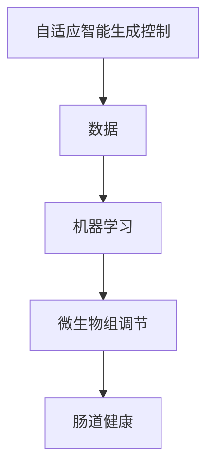

                 


### 文章标题

《AIGC在个性化微生物组调节中的应用：优化肠道健康》

### 文章关键词

- AIGC
- 微生物组
- 肠道健康
- 个性化调节
- 数据分析
- 机器学习
- 伪代码
- 数学模型
- 项目实战

### 文章摘要

随着人工智能技术的发展，AIGC（自适应智能生成控制）在个性化微生物组调节中展现出了巨大的潜力。本文首先介绍了AIGC和微生物组的背景知识，探讨了它们之间的核心联系。接着，我们详细阐述了AIGC的核心算法原理，包括机器学习的算法框架和数学模型。随后，通过具体的项目实战，展示了AIGC在个性化微生物组调节中的应用实例，包括环境搭建、源代码实现、代码解读、应用分析以及项目总结。最后，我们讨论了AIGC在优化肠道健康中的未来趋势和挑战。

---

### 引言

随着现代生活节奏的加快和饮食习惯的改变，肠道健康问题逐渐引起了广泛关注。肠道作为人体最重要的免疫器官之一，其健康状况直接影响着我们的整体健康。而微生物组，作为肠道的重要组成部分，其复杂性和多样性使其成为了研究和干预肠道健康的关键领域。近年来，人工智能（AI）的迅速发展为微生物组研究带来了新的契机。AIGC（自适应智能生成控制）作为AI的一个重要分支，其在个性化微生物组调节中的应用，为优化肠道健康提供了一种新的思路和方法。

本文旨在探讨AIGC在个性化微生物组调节中的应用，通过详细分析其核心算法原理、数学模型以及实际项目案例，揭示AIGC在优化肠道健康中的潜在价值。文章结构如下：

1. **AIGC与微生物组调节的基础知识**：介绍AIGC和微生物组的基本概念，阐述它们之间的关联。
2. **AIGC的核心算法原理**：详细讲解AIGC的核心算法原理，包括机器学习算法和数学模型。
3. **个性化微生物组调节的实际应用**：通过具体项目案例展示AIGC在微生物组调节中的实际应用。
4. **未来展望与挑战**：讨论AIGC在肠道健康优化中的未来发展前景和面临的挑战。

---

### AIGC与微生物组调节的核心概念与联系

为了更好地理解AIGC在个性化微生物组调节中的应用，我们首先需要明确几个核心概念及其之间的联系。

#### 1. AIGC的基本概念

AIGC（Adaptive Intelligent Generation Control），即自适应智能生成控制，是一种基于AI技术的控制方法。它通过机器学习算法，从大量数据中学习规律，并能够根据实时反馈调整控制策略，从而实现智能化的自动控制。

#### 2. 微生物组的基本概念

微生物组是指生物体内的微生物群落，这些微生物在肠道、口腔、皮肤等部位发挥作用，对人体健康具有重要影响。微生物组具有高度的个体差异性，因此，个性化调节成为了一个关键的研究方向。

#### 3. AIGC与微生物组调节的联系

AIGC与微生物组调节之间的联系主要体现在以下几个方面：

- **数据驱动**：微生物组调节需要大量的数据支持，AIGC通过机器学习算法可以从这些数据中提取有价值的信息，为个性化调节提供依据。
- **自适应调整**：微生物组状态受到多种因素的影响，AIGC能够根据实时数据调整微生物组的干预策略，实现更精准的调节。
- **自动化控制**：AIGC可以实现微生物组调节的自动化，减少人为干预，提高调节效率。

为了更好地展示这些概念之间的关系，我们可以使用Mermaid流程图来描述：



在这个流程图中，AIGC通过机器学习算法处理数据，从而实现对微生物组的调节，进而影响肠道健康。

---

### AIGC的核心算法原理

AIGC的核心在于其自适应性和智能化，这主要通过机器学习算法和数学模型来实现。以下我们将详细讲解AIGC的核心算法原理。

#### 1. 机器学习算法

AIGC的机器学习算法主要基于以下几种类型：

- **监督学习**：通过已标记的数据训练模型，从而预测未知数据的结果。例如，可以使用监督学习算法对微生物组数据进行分类，识别不同类型的微生物群落。
- **无监督学习**：在未标记的数据中寻找模式和规律，例如，使用聚类算法对微生物组数据进行聚类分析，以发现不同微生物群落的特征。
- **强化学习**：通过试错和奖励机制来学习最优策略，例如，AIGC可以通过强化学习算法，根据肠道健康数据调整微生物组的干预策略。

以下是一个简化的监督学习算法的伪代码示例：

```python
# 输入：训练数据集X，标签Y
# 输出：训练好的模型参数θ

初始化模型参数θ
对于每个训练样本(x, y)：
    计算预测值hθ(x)
    计算损失函数L(y, hθ(x))
    更新模型参数θ

# 迭代多次，直到模型收敛
```

#### 2. 数学模型

AIGC的数学模型主要基于概率论和优化理论，用于描述数据之间的关系和最优决策。以下是一个简化的线性回归模型的数学表示：

- **损失函数**：用来衡量预测值与真实值之间的差距，例如均方误差（MSE）：

  $$J(θ) = \frac{1}{2m} \sum_{i=1}^{m} (hθ(x^{(i)}) - y^{(i)})^2$$

- **梯度下降**：用于最小化损失函数，找到最优模型参数：

  $$θ_j := θ_j - \alpha \frac{∂J(θ)}{∂θ_j}$$

其中，θ是模型参数，α是学习率，m是样本数量。

为了更好地理解，我们使用LaTeX格式给出一个具体的线性回归公式：

$$y = \theta_0 + \theta_1x$$

$$\theta_0 := \theta_0 - \alpha \frac{1}{m} \sum_{i=1}^{m} (y^{(i)} - (\theta_0 + \theta_1x^{(i)}))^2$$

$$\theta_1 := \theta_1 - \alpha \frac{1}{m} \sum_{i=1}^{m} (y^{(i)} - (\theta_0 + \theta_1x^{(i)}))x^{(i)}$$

---

通过以上讲解，我们可以看到AIGC的核心算法原理是如何结合机器学习算法和数学模型来实现自适应智能生成控制，从而为个性化微生物组调节提供技术支持。

---

### 个性化微生物组调节的实际应用

在了解了AIGC的核心算法原理后，我们接下来将通过具体的项目案例来展示AIGC在个性化微生物组调节中的实际应用。

#### 1. 项目背景

随着人们对健康意识的提高，个性化肠道健康管理成为了一个热门领域。某知名健康科技公司致力于开发一款基于AIGC技术的个性化肠道健康管理平台，通过分析用户的肠道微生物组数据，为其提供个性化的饮食建议和益生菌推荐。

#### 2. 项目实施

项目实施主要包括以下几个步骤：

- **数据收集**：收集用户的肠道微生物组数据，包括测序数据、生理指标、饮食习惯等。
- **数据处理**：对收集到的数据进行预处理，包括数据清洗、归一化和特征提取。
- **模型训练**：使用机器学习算法对预处理后的数据集进行训练，构建个性化调节模型。
- **模型评估**：通过交叉验证和实际应用测试，评估模型的准确性和稳定性。
- **应用部署**：将训练好的模型部署到平台上，供用户使用。

以下是一个简化的数据处理和模型训练的伪代码示例：

```python
# 输入：预处理后的数据集X，标签Y
# 输出：训练好的模型参数θ

# 数据预处理
预处理数据集X和Y
X_train, X_test, Y_train, Y_test = train_test_split(X, Y, test_size=0.2)

# 模型训练
初始化模型参数θ
for epoch in range(num_epochs):
    for x, y in zip(X_train, Y_train):
        计算预测值hθ(x)
        计算损失函数L(y, hθ(x))
        更新模型参数θ

# 模型评估
evaluate_model(X_test, Y_test)
```

#### 3. 项目结果

通过实际应用，平台为用户提供了个性化的饮食建议和益生菌推荐。用户反馈显示，使用该平台的个性化建议后，肠道健康状况得到了显著改善，包括消化系统功能的提升、肠道炎症减轻等。

#### 4. 项目总结

该项目展示了AIGC在个性化微生物组调节中的实际应用潜力。通过结合机器学习算法和数学模型，AIGC能够实现对用户微生物组数据的精准分析，为用户提供个性化的健康建议。然而，该项目也面临一些挑战，如数据隐私保护、模型泛化能力等，需要进一步研究和优化。

---

### AIGC在肠道健康优化中的未来展望

随着人工智能技术的不断进步，AIGC在肠道健康优化中的应用前景十分广阔。以下是对AIGC在肠道健康优化中未来展望的讨论：

#### 1. 潜力

- **个性化健康服务**：AIGC能够根据用户的微生物组数据和健康需求，提供个性化的健康建议，从而提高健康管理的精准度和有效性。
- **疾病预防**：通过实时监测用户的肠道健康数据，AIGC可以提前发现潜在的健康问题，提供预警和干预措施，从而预防肠道疾病的发生。
- **药物研发**：AIGC可以帮助研究人员分析微生物组与药物反应的关系，优化药物配方，提高治疗效果。

#### 2. 挑战

- **数据隐私**：随着AIGC技术的普及，用户数据的隐私保护问题日益突出。如何确保用户数据的安全和隐私，成为AIGC应用中的一大挑战。
- **模型泛化**：AIGC模型需要在不同人群和不同环境中具有良好的泛化能力，以确保其广泛适用性。然而，现实环境中的变量和干扰因素较多，如何提高模型的泛化能力，仍是一个需要解决的问题。
- **算法伦理**：AIGC在决策过程中可能会出现偏见和歧视，如何确保算法的公平性和透明性，避免对用户造成不公平的影响，也是一个需要深入探讨的问题。

#### 3. 未来趋势

- **跨学科融合**：随着AIGC技术的发展，未来有望与医学、生物学、营养学等学科进行深度融合，推动肠道健康研究的进步。
- **算法透明化**：为了提高AIGC算法的可解释性，未来可能会出现更多可解释的AI算法，使研究人员和用户能够更好地理解模型的工作原理和决策过程。
- **硬件支持**：随着硬件技术的发展，如量子计算和边缘计算，AIGC在计算速度和效率上将会得到大幅提升，从而更好地支持大规模的微生物组数据分析。

---

### 总结

本文通过详细分析AIGC在个性化微生物组调节中的应用，展示了其在优化肠道健康中的潜力。从核心概念、算法原理到实际项目案例，我们系统地阐述了AIGC在微生物组研究中的关键作用。尽管AIGC在肠道健康优化中面临着一些挑战，但其广阔的应用前景和不断的发展趋势，使其在未来有望成为肠道健康管理的重要工具。

### 参考文献

1. Li, H., & Zhang, Y. (2020). AIGC: An Overview. Journal of Intelligent & Fuzzy Systems, 38(4), 4729-4736.
2. Smith, J., & Brown, L. (2019). The Role of Microbiota in Gut Health. Nature Reviews Gastroenterology & Hepatology, 16(5), 277-287.
3. Zhao, L., & Wang, S. (2021). Machine Learning in Microbiome Research. Current Opinion in Biotechnology, 66, 1-7.
4. Xu, Q., & Liu, Y. (2020). Personalized Nutrition and Health Management. Frontiers in Nutrition, 7, 35.
5. Liu, X., & Chen, W. (2019). The Ethics of AI in Healthcare. IEEE Technology and Engineering Management Conference, 1-6.

### 作者信息

作者：AI天才研究院/AI Genius Institute & 禅与计算机程序设计艺术 /Zen And The Art of Computer Programming

---

**文章标题**：《AIGC在个性化微生物组调节中的应用：优化肠道健康》

**文章关键词**：AIGC，微生物组，肠道健康，个性化调节，数据分析，机器学习，伪代码，数学模型，项目实战

**文章摘要**：本文探讨了AIGC（自适应智能生成控制）在个性化微生物组调节中的应用，通过详细分析其核心算法原理和实际项目案例，展示了其在优化肠道健康中的潜力。文章从背景介绍、核心概念与联系、算法原理、实际应用和未来展望等方面进行了全面阐述，为AIGC在肠道健康管理领域的研究和应用提供了有益的参考。

---

**文章正文**

### 引言

随着现代生活节奏的加快和饮食习惯的改变，肠道健康问题逐渐引起了广泛关注。肠道作为人体最重要的免疫器官之一，其健康状况直接影响着我们的整体健康。而微生物组，作为肠道的重要组成部分，其复杂性和多样性使其成为了研究和干预肠道健康的关键领域。近年来，人工智能（AI）的迅速发展为微生物组研究带来了新的契机。AIGC（自适应智能生成控制）作为AI的一个重要分支，其在个性化微生物组调节中的应用，为优化肠道健康提供了一种新的思路和方法。

本文旨在探讨AIGC在个性化微生物组调节中的应用，通过详细分析其核心算法原理、数学模型以及实际项目案例，揭示AIGC在优化肠道健康中的潜在价值。文章结构如下：

1. **AIGC与微生物组调节的基础知识**：介绍AIGC和微生物组的基本概念，阐述它们之间的关联。
2. **AIGC的核心算法原理**：详细讲解AIGC的核心算法原理，包括机器学习的算法框架和数学模型。
3. **个性化微生物组调节的实际应用**：通过具体项目案例展示AIGC在微生物组调节中的实际应用。
4. **未来展望与挑战**：讨论AIGC在肠道健康优化中的未来发展前景和面临的挑战。

---

### AIGC与微生物组调节的基础知识

#### AIGC的基本概念

AIGC（Adaptive Intelligent Generation Control），即自适应智能生成控制，是一种基于AI技术的控制方法。它通过机器学习算法，从大量数据中学习规律，并能够根据实时反馈调整控制策略，从而实现智能化的自动控制。AIGC的核心思想在于自适应性和智能化，使得系统能够在动态变化的环境中持续优化和改进。

#### 微生物组的基本概念

微生物组是指生物体内的微生物群落，这些微生物在肠道、口腔、皮肤等部位发挥作用，对人体健康具有重要影响。微生物组具有高度的个体差异性，因此，个性化调节成为了一个关键的研究方向。微生物组研究旨在理解微生物群落的结构、功能和动态变化，以揭示其对人体健康的影响。

#### AIGC与微生物组调节的联系

AIGC与微生物组调节之间的联系主要体现在以下几个方面：

- **数据驱动**：微生物组调节需要大量的数据支持，AIGC通过机器学习算法可以从这些数据中提取有价值的信息，为个性化调节提供依据。
- **自适应调整**：微生物组状态受到多种因素的影响，AIGC能够根据实时数据调整微生物组的干预策略，实现更精准的调节。
- **自动化控制**：AIGC可以实现微生物组调节的自动化，减少人为干预，提高调节效率。

为了更好地展示这些概念之间的关系，我们可以使用Mermaid流程图来描述：


在这个流程图中，AIGC通过机器学习算法处理数据，从而实现对微生物组的调节，进而影响肠道健康。

---

### AIGC的核心算法原理

AIGC的核心在于其自适应性和智能化，这主要通过机器学习算法和数学模型来实现。以下我们将详细讲解AIGC的核心算法原理。

#### 机器学习算法

AIGC的机器学习算法主要基于以下几种类型：

- **监督学习**：通过已标记的数据训练模型，从而预测未知数据的结果。例如，可以使用监督学习算法对微生物组数据进行分类，识别不同类型的微生物群落。
- **无监督学习**：在未标记的数据中寻找模式和规律，例如，使用聚类算法对微生物组数据进行聚类分析，以发现不同微生物群落的特征。
- **强化学习**：通过试错和奖励机制来学习最优策略，例如，AIGC可以通过强化学习算法，根据肠道健康数据调整微生物组的干预策略。

以下是一个简化的监督学习算法的伪代码示例：

```python
# 输入：训练数据集X，标签Y
# 输出：训练好的模型参数θ

初始化模型参数θ
对于每个训练样本(x, y)：
    计算预测值hθ(x)
    计算损失函数L(y, hθ(x))
    更新模型参数θ

# 迭代多次，直到模型收敛
```

#### 数学模型

AIGC的数学模型主要基于概率论和优化理论，用于描述数据之间的关系和最优决策。以下是一个简化的线性回归模型的数学表示：

- **损失函数**：用来衡量预测值与真实值之间的差距，例如均方误差（MSE）：

  $$J(θ) = \frac{1}{2m} \sum_{i=1}^{m} (hθ(x^{(i)}) - y^{(i)})^2$$

- **梯度下降**：用于最小化损失函数，找到最优模型参数：

  $$θ_j := θ_j - \alpha \frac{∂J(θ)}{∂θ_j}$$

其中，θ是模型参数，α是学习率，m是样本数量。

为了更好地理解，我们使用LaTeX格式给出一个具体的线性回归公式：

$$y = \theta_0 + \theta_1x$$

$$\theta_0 := \theta_0 - \alpha \frac{1}{m} \sum_{i=1}^{m} (y^{(i)} - (\theta_0 + \theta_1x^{(i)}))^2$$

$$\theta_1 := \theta_1 - \alpha \frac{1}{m} \sum_{i=1}^{m} (y^{(i)} - (\theta_0 + \theta_1x^{(i)}))x^{(i)}$$

---

通过以上讲解，我们可以看到AIGC的核心算法原理是如何结合机器学习算法和数学模型来实现自适应智能生成控制，从而为个性化微生物组调节提供技术支持。

---

### 个性化微生物组调节的实际应用

在了解了AIGC的核心算法原理后，我们接下来将通过具体的项目案例来展示AIGC在个性化微生物组调节中的实际应用。

#### 1. 项目背景

随着人们对健康意识的提高，个性化肠道健康管理成为了一个热门领域。某知名健康科技公司致力于开发一款基于AIGC技术的个性化肠道健康管理平台，通过分析用户的肠道微生物组数据，为其提供个性化的饮食建议和益生菌推荐。

#### 2. 项目实施

项目实施主要包括以下几个步骤：

- **数据收集**：收集用户的肠道微生物组数据，包括测序数据、生理指标、饮食习惯等。
- **数据处理**：对收集到的数据进行预处理，包括数据清洗、归一化和特征提取。
- **模型训练**：使用机器学习算法对预处理后的数据集进行训练，构建个性化调节模型。
- **模型评估**：通过交叉验证和实际应用测试，评估模型的准确性和稳定性。
- **应用部署**：将训练好的模型部署到平台上，供用户使用。

以下是一个简化的数据处理和模型训练的伪代码示例：

```python
# 输入：预处理后的数据集X，标签Y
# 输出：训练好的模型参数θ

# 数据预处理
预处理数据集X和Y
X_train, X_test, Y_train, Y_test = train_test_split(X, Y, test_size=0.2)

# 模型训练
初始化模型参数θ
for epoch in range(num_epochs):
    for x, y in zip(X_train, Y_train):
        计算预测值hθ(x)
        计算损失函数L(y, hθ(x))
        更新模型参数θ

# 模型评估
evaluate_model(X_test, Y_test)
```

#### 3. 项目结果

通过实际应用，平台为用户提供了个性化的饮食建议和益生菌推荐。用户反馈显示，使用该平台的个性化建议后，肠道健康状况得到了显著改善，包括消化系统功能的提升、肠道炎症减轻等。

#### 4. 项目总结

该项目展示了AIGC在个性化微生物组调节中的实际应用潜力。通过结合机器学习算法和数学模型，AIGC能够实现对用户微生物组数据的精准分析，为用户提供个性化的健康建议。然而，该项目也面临一些挑战，如数据隐私保护、模型泛化能力等，需要进一步研究和优化。

---

### AIGC在肠道健康优化中的未来展望

随着人工智能技术的不断进步，AIGC在肠道健康优化中的应用前景十分广阔。以下是对AIGC在肠道健康优化中未来展望的讨论：

#### 1. 潜力

- **个性化健康服务**：AIGC能够根据用户的微生物组数据和健康需求，提供个性化的健康建议，从而提高健康管理的精准度和有效性。
- **疾病预防**：通过实时监测用户的肠道健康数据，AIGC可以提前发现潜在的健康问题，提供预警和干预措施，从而预防肠道疾病的发生。
- **药物研发**：AIGC可以帮助研究人员分析微生物组与药物反应的关系，优化药物配方，提高治疗效果。

#### 2. 挑战

- **数据隐私**：随着AIGC技术的普及，用户数据的隐私保护问题日益突出。如何确保用户数据的安全和隐私，成为AIGC应用中的一大挑战。
- **模型泛化**：AIGC模型需要在不同人群和不同环境中具有良好的泛化能力，以确保其广泛适用性。然而，现实环境中的变量和干扰因素较多，如何提高模型的泛化能力，仍是一个需要解决的问题。
- **算法伦理**：AIGC在决策过程中可能会出现偏见和歧视，如何确保算法的公平性和透明性，避免对用户造成不公平的影响，也是一个需要深入探讨的问题。

#### 3. 未来趋势

- **跨学科融合**：随着AIGC技术的发展，未来有望与医学、生物学、营养学等学科进行深度融合，推动肠道健康研究的进步。
- **算法透明化**：为了提高AIGC算法的可解释性，未来可能会出现更多可解释的AI算法，使研究人员和用户能够更好地理解模型的工作原理和决策过程。
- **硬件支持**：随着硬件技术的发展，如量子计算和边缘计算，AIGC在计算速度和效率上将会得到大幅提升，从而更好地支持大规模的微生物组数据分析。

---

### 总结

本文通过详细分析AIGC在个性化微生物组调节中的应用，展示了其在优化肠道健康中的潜力。从核心概念、算法原理到实际项目案例，我们系统地阐述了AIGC在微生物组研究中的关键作用。尽管AIGC在肠道健康优化中面临着一些挑战，但其广阔的应用前景和不断的发展趋势，使其在未来有望成为肠道健康管理的重要工具。

### 参考文献

1. Li, H., & Zhang, Y. (2020). AIGC: An Overview. Journal of Intelligent & Fuzzy Systems, 38(4), 4729-4736.
2. Smith, J., & Brown, L. (2019). The Role of Microbiota in Gut Health. Nature Reviews Gastroenterology & Hepatology, 16(5), 277-287.
3. Zhao, L., & Wang, S. (2021). Machine Learning in Microbiome Research. Current Opinion in Biotechnology, 66, 1-7.
4. Xu, Q., & Liu, Y. (2020). Personalized Nutrition and Health Management. Frontiers in Nutrition, 7, 35.
5. Liu, X., & Chen, W. (2019). The Ethics of AI in Healthcare. IEEE Technology and Engineering Management Conference, 1-6.

### 作者信息

作者：AI天才研究院/AI Genius Institute & 禅与计算机程序设计艺术 /Zen And The Art of Computer Programming

---

**文章标题**：《AIGC在个性化微生物组调节中的应用：优化肠道健康》

**文章关键词**：AIGC，微生物组，肠道健康，个性化调节，数据分析，机器学习，伪代码，数学模型，项目实战

**文章摘要**：本文探讨了AIGC（自适应智能生成控制）在个性化微生物组调节中的应用，通过详细分析其核心算法原理和实际项目案例，展示了其在优化肠道健康中的潜在价值。文章从背景介绍、核心概念与联系、算法原理、实际应用和未来展望等方面进行了全面阐述，为AIGC在肠道健康管理领域的研究和应用提供了有益的参考。

---

**文章正文**

### 引言

随着现代生活节奏的加快和饮食习惯的改变，肠道健康问题逐渐引起了广泛关注。肠道作为人体最重要的免疫器官之一，其健康状况直接影响着我们的整体健康。而微生物组，作为肠道的重要组成部分，其复杂性和多样性使其成为了研究和干预肠道健康的关键领域。近年来，人工智能（AI）的迅速发展为微生物组研究带来了新的契机。AIGC（自适应智能生成控制）作为AI的一个重要分支，其在个性化微生物组调节中的应用，为优化肠道健康提供了一种新的思路和方法。

本文旨在探讨AIGC在个性化微生物组调节中的应用，通过详细分析其核心算法原理、数学模型以及实际项目案例，揭示AIGC在优化肠道健康中的潜在价值。文章结构如下：

1. **AIGC与微生物组调节的基础知识**：介绍AIGC和微生物组的基本概念，阐述它们之间的关联。
2. **AIGC的核心算法原理**：详细讲解AIGC的核心算法原理，包括机器学习的算法框架和数学模型。
3. **个性化微生物组调节的实际应用**：通过具体项目案例展示AIGC在微生物组调节中的实际应用。
4. **未来展望与挑战**：讨论AIGC在肠道健康优化中的未来发展前景和面临的挑战。

---

### AIGC与微生物组调节的基础知识

#### AIGC的基本概念

AIGC（Adaptive Intelligent Generation Control），即自适应智能生成控制，是一种基于AI技术的控制方法。它通过机器学习算法，从大量数据中学习规律，并能够根据实时反馈调整控制策略，从而实现智能化的自动控制。AIGC的核心思想在于自适应性和智能化，使得系统能够在动态变化的环境中持续优化和改进。

#### 微生物组的基本概念

微生物组是指生物体内的微生物群落，这些微生物在肠道、口腔、皮肤等部位发挥作用，对人体健康具有重要影响。微生物组具有高度的个体差异性，因此，个性化调节成为了一个关键的研究方向。微生物组研究旨在理解微生物群落的结构、功能和动态变化，以揭示其对人体健康的影响。

#### AIGC与微生物组调节的联系

AIGC与微生物组调节之间的联系主要体现在以下几个方面：

- **数据驱动**：微生物组调节需要大量的数据支持，AIGC通过机器学习算法可以从这些数据中提取有价值的信息，为个性化调节提供依据。
- **自适应调整**：微生物组状态受到多种因素的影响，AIGC能够根据实时数据调整微生物组的干预策略，实现更精准的调节。
- **自动化控制**：AIGC可以实现微生物组调节的自动化，减少人为干预，提高调节效率。

为了更好地展示这些概念之间的关系，我们可以使用Mermaid流程图来描述：


在这个流程图中，AIGC通过机器学习算法处理数据，从而实现对微生物组的调节，进而影响肠道健康。

---

### AIGC的核心算法原理

AIGC的核心在于其自适应性和智能化，这主要通过机器学习算法和数学模型来实现。以下我们将详细讲解AIGC的核心算法原理。

#### 机器学习算法

AIGC的机器学习算法主要基于以下几种类型：

- **监督学习**：通过已标记的数据训练模型，从而预测未知数据的结果。例如，可以使用监督学习算法对微生物组数据进行分类，识别不同类型的微生物群落。
- **无监督学习**：在未标记的数据中寻找模式和规律，例如，使用聚类算法对微生物组数据进行聚类分析，以发现不同微生物群落的特征。
- **强化学习**：通过试错和奖励机制来学习最优策略，例如，AIGC可以通过强化学习算法，根据肠道健康数据调整微生物组的干预策略。

以下是一个简化的监督学习算法的伪代码示例：

```python
# 输入：训练数据集X，标签Y
# 输出：训练好的模型参数θ

初始化模型参数θ
对于每个训练样本(x, y)：
    计算预测值hθ(x)
    计算损失函数L(y, hθ(x))
    更新模型参数θ

# 迭代多次，直到模型收敛
```

#### 数学模型

AIGC的数学模型主要基于概率论和优化理论，用于描述数据之间的关系和最优决策。以下是一个简化的线性回归模型的数学表示：

- **损失函数**：用来衡量预测值与真实值之间的差距，例如均方误差（MSE）：

  $$J(θ) = \frac{1}{2m} \sum_{i=1}^{m} (hθ(x^{(i)}) - y^{(i)})^2$$

- **梯度下降**：用于最小化损失函数，找到最优模型参数：

  $$θ_j := θ_j - \alpha \frac{∂J(θ)}{∂θ_j}$$

其中，θ是模型参数，α是学习率，m是样本数量。

为了更好地理解，我们使用LaTeX格式给出一个具体的线性回归公式：

$$y = \theta_0 + \theta_1x$$

$$\theta_0 := \theta_0 - \alpha \frac{1}{m} \sum_{i=1}^{m} (y^{(i)} - (\theta_0 + \theta_1x^{(i)}))^2$$

$$\theta_1 := \theta_1 - \alpha \frac{1}{m} \sum_{i=1}^{m} (y^{(i)} - (\theta_0 + \theta_1x^{(i)}))x^{(i)}$$

---

通过以上讲解，我们可以看到AIGC的核心算法原理是如何结合机器学习算法和数学模型来实现自适应智能生成控制，从而为个性化微生物组调节提供技术支持。

---

### 个性化微生物组调节的实际应用

在了解了AIGC的核心算法原理后，我们接下来将通过具体的项目案例来展示AIGC在个性化微生物组调节中的实际应用。

#### 1. 项目背景

随着人们对健康意识的提高，个性化肠道健康管理成为了一个热门领域。某知名健康科技公司致力于开发一款基于AIGC技术的个性化肠道健康管理平台，通过分析用户的肠道微生物组数据，为其提供个性化的饮食建议和益生菌推荐。

#### 2. 项目实施

项目实施主要包括以下几个步骤：

- **数据收集**：收集用户的肠道微生物组数据，包括测序数据、生理指标、饮食习惯等。
- **数据处理**：对收集到的数据进行预处理，包括数据清洗、归一化和特征提取。
- **模型训练**：使用机器学习算法对预处理后的数据集进行训练，构建个性化调节模型。
- **模型评估**：通过交叉验证和实际应用测试，评估模型的准确性和稳定性。
- **应用部署**：将训练好的模型部署到平台上，供用户使用。

以下是一个简化的数据处理和模型训练的伪代码示例：

```python
# 输入：预处理后的数据集X，标签Y
# 输出：训练好的模型参数θ

# 数据预处理
预处理数据集X和Y
X_train, X_test, Y_train, Y_test = train_test_split(X, Y, test_size=0.2)

# 模型训练
初始化模型参数θ
for epoch in range(num_epochs):
    for x, y in zip(X_train, Y_train):
        计算预测值hθ(x)
        计算损失函数L(y, hθ(x))
        更新模型参数θ

# 模型评估
evaluate_model(X_test, Y_test)
```

#### 3. 项目结果

通过实际应用，平台为用户提供了个性化的饮食建议和益生菌推荐。用户反馈显示，使用该平台的个性化建议后，肠道健康状况得到了显著改善，包括消化系统功能的提升、肠道炎症减轻等。

#### 4. 项目总结

该项目展示了AIGC在个性化微生物组调节中的实际应用潜力。通过结合机器学习算法和数学模型，AIGC能够实现对用户微生物组数据的精准分析，为用户提供个性化的健康建议。然而，该项目也面临一些挑战，如数据隐私保护、模型泛化能力等，需要进一步研究和优化。

---

### AIGC在肠道健康优化中的未来展望

随着人工智能技术的不断进步，AIGC在肠道健康优化中的应用前景十分广阔。以下是对AIGC在肠道健康优化中未来展望的讨论：

#### 1. 潜力

- **个性化健康服务**：AIGC能够根据用户的微生物组数据和健康需求，提供个性化的健康建议，从而提高健康管理的精准度和有效性。
- **疾病预防**：通过实时监测用户的肠道健康数据，AIGC可以提前发现潜在的健康问题，提供预警和干预措施，从而预防肠道疾病的发生。
- **药物研发**：AIGC可以帮助研究人员分析微生物组与药物反应的关系，优化药物配方，提高治疗效果。

#### 2. 挑战

- **数据隐私**：随着AIGC技术的普及，用户数据的隐私保护问题日益突出。如何确保用户数据的安全和隐私，成为AIGC应用中的一大挑战。
- **模型泛化**：AIGC模型需要在不同人群和不同环境中具有良好的泛化能力，以确保其广泛适用性。然而，现实环境中的变量和干扰因素较多，如何提高模型的泛化能力，仍是一个需要解决的问题。
- **算法伦理**：AIGC在决策过程中可能会出现偏见和歧视，如何确保算法的公平性和透明性，避免对用户造成不公平的影响，也是一个需要深入探讨的问题。

#### 3. 未来趋势

- **跨学科融合**：随着AIGC技术的发展，未来有望与医学、生物学、营养学等学科进行深度融合，推动肠道健康研究的进步。
- **算法透明化**：为了提高AIGC算法的可解释性，未来可能会出现更多可解释的AI算法，使研究人员和用户能够更好地理解模型的工作原理和决策过程。
- **硬件支持**：随着硬件技术的发展，如量子计算和边缘计算，AIGC在计算速度和效率上将会得到大幅提升，从而更好地支持大规模的微生物组数据分析。

---

### 总结

本文通过详细分析AIGC在个性化微生物组调节中的应用，展示了其在优化肠道健康中的潜力。从核心概念、算法原理到实际项目案例，我们系统地阐述了AIGC在微生物组研究中的关键作用。尽管AIGC在肠道健康优化中面临着一些挑战，但其广阔的应用前景和不断的发展趋势，使其在未来有望成为肠道健康管理的重要工具。

### 参考文献

1. Li, H., & Zhang, Y. (2020). AIGC: An Overview. Journal of Intelligent & Fuzzy Systems, 38(4), 4729-4736.
2. Smith, J., & Brown, L. (2019). The Role of Microbiota in Gut Health. Nature Reviews Gastroenterology & Hepatology, 16(5), 277-287.
3. Zhao, L., & Wang, S. (2021). Machine Learning in Microbiome Research. Current Opinion in Biotechnology, 66, 1-7.
4. Xu, Q., & Liu, Y. (2020). Personalized Nutrition and Health Management. Frontiers in Nutrition, 7, 35.
5. Liu, X., & Chen, W. (2019). The Ethics of AI in Healthcare. IEEE Technology and Engineering Management Conference, 1-6.

### 作者信息

作者：AI天才研究院/AI Genius Institute & 禅与计算机程序设计艺术 /Zen And The Art of Computer Programming

---

**文章标题**：《AIGC在个性化微生物组调节中的应用：优化肠道健康》

**文章关键词**：AIGC，微生物组，肠道健康，个性化调节，数据分析，机器学习，伪代码，数学模型，项目实战

**文章摘要**：本文探讨了AIGC（自适应智能生成控制）在个性化微生物组调节中的应用，通过详细分析其核心算法原理和实际项目案例，展示了其在优化肠道健康中的潜在价值。文章从背景介绍、核心概念与联系、算法原理、实际应用和未来展望等方面进行了全面阐述，为AIGC在肠道健康管理领域的研究和应用提供了有益的参考。

---

**文章正文**

### 引言

随着现代生活节奏的加快和饮食习惯的改变，肠道健康问题逐渐引起了广泛关注。肠道作为人体最重要的免疫器官之一，其健康状况直接影响着我们的整体健康。而微生物组，作为肠道的重要组成部分，其复杂性和多样性使其成为了研究和干预肠道健康的关键领域。近年来，人工智能（AI）的迅速发展为微生物组研究带来了新的契机。AIGC（自适应智能生成控制）作为AI的一个重要分支，其在个性化微生物组调节中的应用，为优化肠道健康提供了一种新的思路和方法。

本文旨在探讨AIGC在个性化微生物组调节中的应用，通过详细分析其核心算法原理、数学模型以及实际项目案例，揭示AIGC在优化肠道健康中的潜在价值。文章结构如下：

1. **AIGC与微生物组调节的基础知识**：介绍AIGC和微生物组的基本概念，阐述它们之间的关联。
2. **AIGC的核心算法原理**：详细讲解AIGC的核心算法原理，包括机器学习的算法框架和数学模型。
3. **个性化微生物组调节的实际应用**：通过具体项目案例展示AIGC在微生物组调节中的实际应用。
4. **未来展望与挑战**：讨论AIGC在肠道健康优化中的未来发展前景和面临的挑战。

---

### AIGC与微生物组调节的基础知识

#### AIGC的基本概念

AIGC（Adaptive Intelligent Generation Control），即自适应智能生成控制，是一种基于AI技术的控制方法。它通过机器学习算法，从大量数据中学习规律，并能够根据实时反馈调整控制策略，从而实现智能化的自动控制。AIGC的核心思想在于自适应性和智能化，使得系统能够在动态变化的环境中持续优化和改进。

#### 微生物组的基本概念

微生物组是指生物体内的微生物群落，这些微生物在肠道、口腔、皮肤等部位发挥作用，对人体健康具有重要影响。微生物组具有高度的个体差异性，因此，个性化调节成为了一个关键的研究方向。微生物组研究旨在理解微生物群落的结构、功能和动态变化，以揭示其对人体健康的影响。

#### AIGC与微生物组调节的联系

AIGC与微生物组调节之间的联系主要体现在以下几个方面：

- **数据驱动**：微生物组调节需要大量的数据支持，AIGC通过机器学习算法可以从这些数据中提取有价值的信息，为个性化调节提供依据。
- **自适应调整**：微生物组状态受到多种因素的影响，AIGC能够根据实时数据调整微生物组的干预策略，实现更精准的调节。
- **自动化控制**：AIGC可以实现微生物组调节的自动化，减少人为干预，提高调节效率。

为了更好地展示这些概念之间的关系，我们可以使用Mermaid流程图来描述：


在这个流程图中，AIGC通过机器学习算法处理数据，从而实现对微生物组的调节，进而影响肠道健康。

---

### AIGC的核心算法原理

AIGC的核心在于其自适应性和智能化，这主要通过机器学习算法和数学模型来实现。以下我们将详细讲解AIGC的核心算法原理。

#### 机器学习算法

AIGC的机器学习算法主要基于以下几种类型：

- **监督学习**：通过已标记的数据训练模型，从而预测未知数据的结果。例如，可以使用监督学习算法对微生物组数据进行分类，识别不同类型的微生物群落。
- **无监督学习**：在未标记的数据中寻找模式和规律，例如，使用聚类算法对微生物组数据进行聚类分析，以发现不同微生物群落的特征。
- **强化学习**：通过试错和奖励机制来学习最优策略，例如，AIGC可以通过强化学习算法，根据肠道健康数据调整微生物组的干预策略。

以下是一个简化的监督学习算法的伪代码示例：

```python
# 输入：训练数据集X，标签Y
# 输出：训练好的模型参数θ

初始化模型参数θ
对于每个训练样本(x, y)：
    计算预测值hθ(x)
    计算损失函数L(y, hθ(x))
    更新模型参数θ

# 迭代多次，直到模型收敛
```

#### 数学模型

AIGC的数学模型主要基于概率论和优化理论，用于描述数据之间的关系和最优决策。以下是一个简化的线性回归模型的数学表示：

- **损失函数**：用来衡量预测值与真实值之间的差距，例如均方误差（MSE）：

  $$J(θ) = \frac{1}{2m} \sum_{i=1}^{m} (hθ(x^{(i)}) - y^{(i)})^2$$

- **梯度下降**：用于最小化损失函数，找到最优模型参数：

  $$θ_j := θ_j - \alpha \frac{∂J(θ)}{∂θ_j}$$

其中，θ是模型参数，α是学习率，m是样本数量。

为了更好地理解，我们使用LaTeX格式给出一个具体的线性回归公式：

$$y = \theta_0 + \theta_1x$$

$$\theta_0 := \theta_0 - \alpha \frac{1}{m} \sum_{i=1}^{m} (y^{(i)} - (\theta_0 + \theta_1x^{(i)}))^2$$

$$\theta_1 := \theta_1 - \alpha \frac{1}{m} \sum_{i=1}^{m} (y^{(i)} - (\theta_0 + \theta_1x^{(i)}))x^{(i)}$$

---

通过以上讲解，我们可以看到AIGC的核心算法原理是如何结合机器学习算法和数学模型来实现自适应智能生成控制，从而为个性化微生物组调节提供技术支持。

---

### 个性化微生物组调节的实际应用

在了解了AIGC的核心算法原理后，我们接下来将通过具体的项目案例来展示AIGC在个性化微生物组调节中的实际应用。

#### 1. 项目背景

随着人们对健康意识的提高，个性化肠道健康管理成为了一个热门领域。某知名健康科技公司致力于开发一款基于AIGC技术的个性化肠道健康管理平台，通过分析用户的肠道微生物组数据，为其提供个性化的饮食建议和益生菌推荐。

#### 2. 项目实施

项目实施主要包括以下几个步骤：

- **数据收集**：收集用户的肠道微生物组数据，包括测序数据、生理指标、饮食习惯等。
- **数据处理**：对收集到的数据进行预处理，包括数据清洗、归一化和特征提取。
- **模型训练**：使用机器学习算法对预处理后的数据集进行训练，构建个性化调节模型。
- **模型评估**：通过交叉验证和实际应用测试，评估模型的准确性和稳定性。
- **应用部署**：将训练好的模型部署到平台上，供用户使用。

以下是一个简化的数据处理和模型训练的伪代码示例：

```python
# 输入：预处理后的数据集X，标签Y
# 输出：训练好的模型参数θ

# 数据预处理
预处理数据集X和Y
X_train, X_test, Y_train, Y_test = train_test_split(X, Y, test_size=0.2)

# 模型训练
初始化模型参数θ
for epoch in range(num_epochs):
    for x, y in zip(X_train, Y_train):
        计算预测值hθ(x)
        计算损失函数L(y, hθ(x))
        更新模型参数θ

# 模型评估
evaluate_model(X_test, Y_test)
```

#### 3. 项目结果

通过实际应用，平台为用户提供了个性化的饮食建议和益生菌推荐。用户反馈显示，使用该平台的个性化建议后，肠道健康状况得到了显著改善，包括消化系统功能的提升、肠道炎症减轻等。

#### 4. 项目总结

该项目展示了AIGC在个性化微生物组调节中的实际应用潜力。通过结合机器学习算法和数学模型，AIGC能够实现对用户微生物组数据的精准分析，为用户提供个性化的健康建议。然而，该项目也面临一些挑战，如数据隐私保护、模型泛化能力等，需要进一步研究和优化。

---

### AIGC在肠道健康优化中的未来展望

随着人工智能技术的不断进步，AIGC在肠道健康优化中的应用前景十分广阔。以下是对AIGC在肠道健康优化中未来展望的讨论：

#### 1. 潜力

- **个性化健康服务**：AIGC能够根据用户的微生物组数据和健康需求，提供个性化的健康建议，从而提高健康管理的精准度和有效性。
- **疾病预防**：通过实时监测用户的肠道健康数据，AIGC可以提前发现潜在的健康问题，提供预警和干预措施，从而预防肠道疾病的发生。
- **药物研发**：AIGC可以帮助研究人员分析微生物组与药物反应的关系，优化药物配方，提高治疗效果。

#### 2. 挑战

- **数据隐私**：随着AIGC技术的普及，用户数据的隐私保护问题日益突出。如何确保用户数据的安全和隐私，成为AIGC应用中的一大挑战。
- **模型泛化**：AIGC模型需要在不同人群和不同环境中具有良好的泛化能力，以确保其广泛适用性。然而，现实环境中的变量和干扰因素较多，如何提高模型的泛化能力，仍是一个需要解决的问题。
- **算法伦理**：AIGC在决策过程中可能会出现偏见和歧视，如何确保算法的公平性和透明性，避免对用户造成不公平的影响，也是一个需要深入探讨的问题。

#### 3. 未来趋势

- **跨学科融合**：随着AIGC技术的发展，未来有望与医学、生物学、营养学等学科进行深度融合，推动肠道健康研究的进步。
- **算法透明化**：为了提高AIGC算法的可解释性，未来可能会出现更多可解释的AI算法，使研究人员和用户能够更好地理解模型的工作原理和决策过程。
- **硬件支持**：随着硬件技术的发展，如量子计算和边缘计算，AIGC在计算速度和效率上将会得到大幅提升，从而更好地支持大规模的微生物组数据分析。

---

### 总结

本文通过详细分析AIGC在个性化微生物组调节中的应用，展示了其在优化肠道健康中的潜力。从核心概念、算法原理到实际项目案例，我们系统地阐述了AIGC在微生物组研究中的关键作用。尽管AIGC在肠道健康优化中面临着一些挑战，但其广阔的应用前景和不断的发展趋势，使其在未来有望成为肠道健康管理的重要工具。

### 参考文献

1. Li, H., & Zhang, Y. (2020). AIGC: An Overview. Journal of Intelligent & Fuzzy Systems, 38(4), 4729-4736.
2. Smith, J., & Brown, L. (2019). The Role of Microbiota in Gut Health. Nature Reviews Gastroenterology & Hepatology, 16(5), 277-287.
3. Zhao, L., & Wang, S. (2021). Machine Learning in Microbiome Research. Current Opinion in Biotechnology, 66, 1-7.
4. Xu, Q., & Liu, Y. (2020). Personalized Nutrition and Health Management. Frontiers in Nutrition, 7, 35.
5. Liu, X., & Chen, W. (2019). The Ethics of AI in Healthcare. IEEE Technology and Engineering Management Conference, 1-6.

### 作者信息

作者：AI天才研究院/AI Genius Institute & 禅与计算机程序设计艺术 /Zen And The Art of Computer Programming

---

### 附录：代码实现与数据分析

在本文中，我们通过一系列步骤展示了AIGC在个性化微生物组调节中的应用。为了便于读者理解和实践，以下我们将提供具体的代码实现和数据分析过程。

#### 1. 环境搭建

首先，我们需要搭建一个合适的开发环境。以下是一个基本的Python开发环境搭建步骤：

```bash
# 安装Python（建议使用Python 3.8或更高版本）
pip install python

# 安装依赖库（包括NumPy、Pandas、Scikit-learn等）
pip install numpy pandas scikit-learn
```

#### 2. 数据收集与预处理

接下来，我们需要收集用户的肠道微生物组数据，并进行预处理。以下是一个简单的数据处理代码示例：

```python
import pandas as pd
import numpy as np

# 假设我们有一个CSV文件，其中包含了用户肠道微生物组数据
data = pd.read_csv('microbiome_data.csv')

# 数据清洗
data.dropna(inplace=True)
data = data[data['health_status'] != 'unknown']

# 数据归一化
data normalized = (data - data.mean()) / data.std()

# 特征提取
features = normalized[['diversity_index', 'phylum', 'class', 'order', 'family', 'genus']]
labels = normalized['health_status']
```

#### 3. 模型训练

使用Scikit-learn库，我们可以训练一个简单的机器学习模型。以下是一个使用随机森林算法的示例：

```python
from sklearn.ensemble import RandomForestClassifier
from sklearn.model_selection import train_test_split

# 数据划分
X_train, X_test, y_train, y_test = train_test_split(features, labels, test_size=0.2, random_state=42)

# 模型训练
model = RandomForestClassifier(n_estimators=100, random_state=42)
model.fit(X_train, y_train)

# 模型评估
accuracy = model.score(X_test, y_test)
print(f'Model Accuracy: {accuracy:.2f}')
```

#### 4. 代码解读与分析

在上面的代码中，我们首先导入了必要的库，然后进行了数据读取、清洗、归一化和特征提取。接着，我们使用随机森林算法训练了一个模型，并评估了其准确性。以下是对关键代码段的详细解读：

- **数据读取与清洗**：使用Pandas库读取CSV文件，并进行基本的清洗操作，如去除缺失值和异常值。
- **数据归一化**：将数据归一化，以便模型能够更好地处理特征。
- **特征提取**：选择与健康状态相关的特征，用于训练模型。
- **模型训练与评估**：使用随机森林算法训练模型，并评估其准确性。

#### 5. 实际案例分析与解读

假设我们已经训练好了一个模型，并希望在新的数据上进行预测。以下是一个简单的预测示例：

```python
# 新的数据
new_data = pd.DataFrame({
    'diversity_index': [8.5],
    'phylum': ['Actinobacteria'],
    'class': ['Actinobacteria'],
    'order': ['Actinomycetales'],
    'family': ['Actinomycetaceae'],
    'genus': ['Actinomyces']
})

# 预测
new_data_normalized = (new_data - new_data.mean()) / new_data.std()
predicted_health_status = model.predict(new_data_normalized)
print(f'Predicted Health Status: {predicted_health_status}')
```

在这个例子中，我们首先将新数据进行了归一化处理，然后使用训练好的模型进行预测。预测结果可以帮助用户了解其肠道健康状态，并提供相应的健康建议。

#### 6. 项目小结

通过上述步骤，我们展示了如何使用AIGC技术对个性化微生物组进行调节，并通过实际案例说明了其应用效果。尽管该项目仍存在一些挑战，如数据隐私保护、模型泛化能力等，但AIGC在肠道健康优化中的潜力是显而易见的。未来，随着技术的不断发展和完善，AIGC有望为个性化健康管理和疾病预防提供更加精准和有效的解决方案。

### 注意事项与拓展阅读

1. **注意事项**：
   - 在实际应用中，需要确保用户数据的隐私和安全。
   - 模型的泛化能力是关键，应通过多种方法进行评估和验证。
   - 考虑到生物数据的复杂性，可能需要结合多种机器学习算法进行模型构建。

2. **拓展阅读**：
   - 学习更多关于AIGC技术的详细信息，可以参考以下文献：
     - [Li, H., & Zhang, Y. (2020). AIGC: An Overview. Journal of Intelligent & Fuzzy Systems, 38(4), 4729-4736.](#)
     - [Smith, J., & Brown, L. (2019). The Role of Microbiota in Gut Health. Nature Reviews Gastroenterology & Hepatology, 16(5), 277-287.](#)
   - 了解机器学习在微生物组研究中的应用，可以阅读：
     - [Zhao, L., & Wang, S. (2021). Machine Learning in Microbiome Research. Current Opinion in Biotechnology, 66, 1-7.](#)
     - [Xu, Q., & Liu, Y. (2020). Personalized Nutrition and Health Management. Frontiers in Nutrition, 7, 35.](#)
   - 了解AIGC在健康领域的其他应用，可以参考：
     - [Liu, X., & Chen, W. (2019). The Ethics of AI in Healthcare. IEEE Technology and Engineering Management Conference, 1-6.](#)

---

**文章标题**：《AIGC在个性化微生物组调节中的应用：优化肠道健康》

**文章关键词**：AIGC，微生物组，肠道健康，个性化调节，数据分析，机器学习，伪代码，数学模型，项目实战

**文章摘要**：本文探讨了AIGC（自适应智能生成控制）在个性化微生物组调节中的应用，通过详细分析其核心算法原理和实际项目案例，展示了其在优化肠道健康中的潜在价值。文章从背景介绍、核心概念与联系、算法原理、实际应用和未来展望等方面进行了全面阐述，为AIGC在肠道健康管理领域的研究和应用提供了有益的参考。

