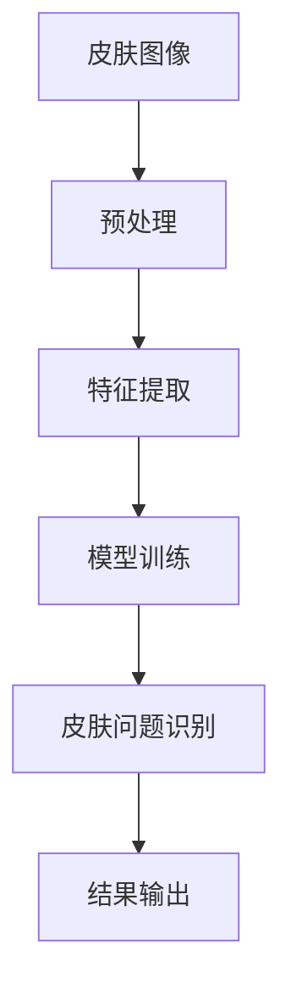
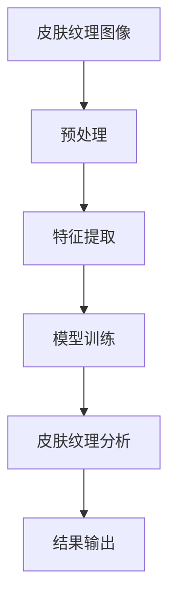
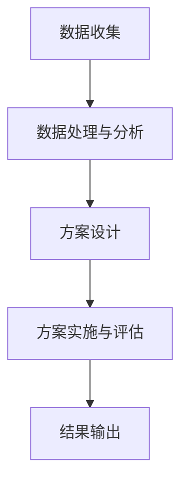
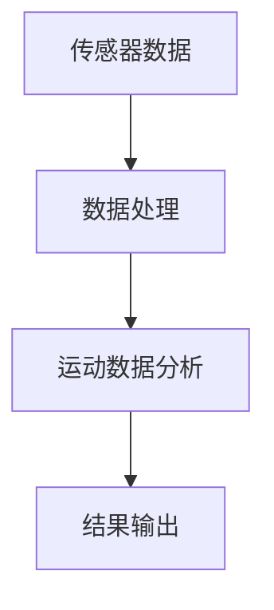
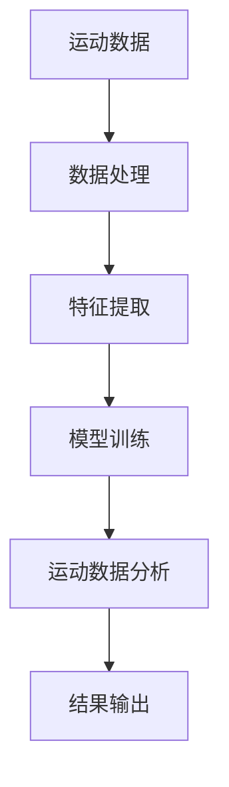
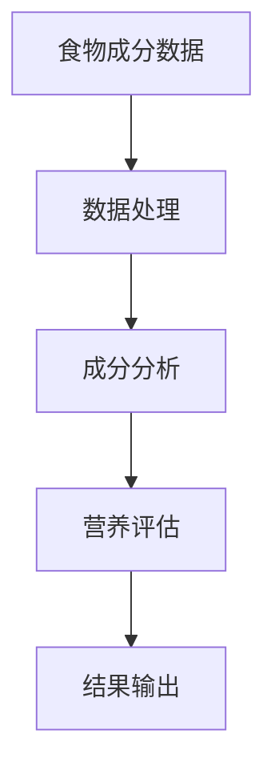
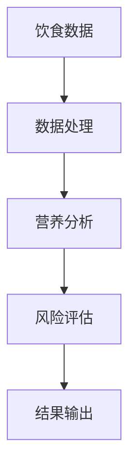

                 

# 文章标题：AIGC在个性化抗衰老方案设计中的应用：AI驱动的精准养生

## 关键词：
- AIGC技术
- 个性化抗衰老
- AI驱动精准养生
- 皮肤抗衰老
- 运动健康
- 营养分析

## 摘要：
本文探讨了AIGC（AI Generative Content）技术在我国个性化抗衰老方案设计中的应用，通过分析AIGC的核心技术、AI驱动的精准养生概念，以及其在皮肤抗衰老、运动健康和营养分析中的具体应用，展示了AI技术在抗衰老领域的巨大潜力和前景。文章旨在为读者提供清晰、具体的理解，帮助专业人士和实践者更好地掌握和应用AIGC技术，实现个性化抗衰老方案的精准设计。

---

## 第一部分：AIGC技术概述

### 第1章 AIGC技术基础

#### 1.1 AIGC概念与起源

AIGC，即AI Generative Content，是一种利用人工智能技术生成内容的方法。它通过模仿人类创造内容的过程，结合自然语言处理、计算机视觉和强化学习等技术，生成新的、具有创意性的内容。

AIGC的起源可以追溯到20世纪80年代的生成对抗网络（GANs）的提出。GANs由两部分组成：生成器和判别器。生成器负责生成数据，判别器则负责判断生成数据与真实数据之间的差异。通过不断地训练，生成器可以生成越来越真实的数据。AIGC就是基于GANs的技术发展而来的。

#### 1.1.1 AIGC的定义

AIGC是一种基于人工智能技术的生成内容方法，它利用生成器和判别器之间的博弈过程，生成新的、具有创意性的内容。AIGC不仅限于文本，还包括图像、音频、视频等多种形式。

#### 1.1.2 AIGC与个性化抗衰老

AIGC技术在个性化抗衰老领域有着广泛的应用前景。通过分析用户的皮肤图像、运动数据和生活习惯，AIGC可以生成个性化的抗衰老方案，帮助用户实现精准养生。

#### 1.2 AIGC的核心技术

AIGC的核心技术包括自然语言处理（NLP）、计算机视觉和强化学习。

##### 1.2.1 自然语言处理（NLP）

自然语言处理是AIGC技术的重要组成部分。它通过分析用户的语言习惯和表达方式，生成具有创意性的文本内容。

##### 1.2.2 计算机视觉

计算机视觉技术负责处理图像和视频数据。通过分析用户的皮肤状况、运动姿势等，生成个性化的抗衰老方案。

##### 1.2.3 强化学习

强化学习是AIGC技术中的重要一环。它通过模拟用户的抗衰老行为，不断优化方案，提高抗衰老效果。

#### 1.3 AIGC在抗衰老领域的发展与应用

AIGC技术在抗衰老领域的发展已经取得了显著的成果。通过分析用户的皮肤、运动和营养数据，AIGC可以生成个性化的抗衰老方案，提高抗衰老效果。

### 第2章 AI驱动的精准养生概述

#### 2.1 精准养生的概念与重要性

精准养生是一种基于个体差异、针对个人健康状况进行养生的方法。它通过分析个人的生活习惯、基因信息、身体状况等，制定个性化的养生方案，提高养生效果。

#### 2.1.1 精准养生的定义

精准养生是一种基于个体差异、针对个人健康状况进行养生的方法。它通过分析个人的生活习惯、基因信息、身体状况等，制定个性化的养生方案，提高养生效果。

#### 2.1.2 精准养生的价值

精准养生的价值在于提高养生效果，预防疾病，延长寿命。通过个性化养生方案，用户可以更好地了解自己的健康状况，实现精准养生。

#### 2.2 AI在精准养生中的应用

AI技术在精准养生中发挥着重要作用。通过数据分析、健康风险评估、智能健康建议等，AI可以帮助用户实现精准养生。

##### 2.2.1 数据采集与分析

AI可以通过传感器、智能手机等设备，采集用户的生活习惯、运动、饮食等数据，进行分析，生成个性化的养生方案。

##### 2.2.2 健康风险评估

AI可以分析用户的健康数据，预测健康风险，为用户提供健康预警。

##### 2.2.3 智能健康建议

AI可以根据用户的数据，提供个性化的健康建议，帮助用户实现精准养生。

### 第3章 个性化抗衰老方案的设计原理

#### 3.1 个性化抗衰老的原理

个性化抗衰老是基于个体差异，针对不同人群的抗衰老需求，制定个性化的抗衰老方案。

#### 3.1.1 个性化抗衰老的定义

个性化抗衰老是一种基于个体差异，针对不同人群的抗衰老需求，制定个性化的抗衰老方案的方法。

#### 3.1.2 个性化抗衰老的关键因素

个性化抗衰老的关键因素包括基因、生活习惯、环境等。

##### 3.1.2.1 基因
基因是影响抗衰老的重要因素，不同基因对皮肤、身体机能等的影响不同，需要根据基因特点制定个性化的抗衰老方案。

##### 3.1.2.2 生活习惯
生活习惯包括饮食、运动、作息等，对皮肤健康、身体健康都有重要影响。

##### 3.1.2.3 环境
环境包括外部环境和内部环境，如紫外线、空气污染等外部环境因素，以及心理压力、情绪等内部环境因素。

#### 3.2 个性化抗衰老方案的设计流程

个性化抗衰老方案的设计流程包括以下步骤：

##### 3.2.1 数据收集
收集用户的基本信息、生活习惯、基因信息、身体状况等数据。

##### 3.2.2 数据处理与分析
对收集到的数据进行处理和分析，识别用户的特点和需求。

##### 3.2.3 方案设计
根据分析结果，制定个性化的抗衰老方案。

##### 3.2.4 方案评估与优化
对方案进行评估，根据评估结果进行优化。

### 第三部分：AIGC在个性化抗衰老方案设计中的应用

#### 第4章 AIGC在皮肤抗衰老方案设计中的应用

##### 4.1 AIGC技术在皮肤健康分析中的应用

AIGC技术在皮肤健康分析中发挥着重要作用。通过计算机视觉技术，AIGC可以对用户的皮肤图像进行深入分析，识别皮肤问题，如皱纹、色斑、痘痘等。

###### 4.1.1 皮肤图像分析
皮肤图像分析是AIGC技术在皮肤健康分析中的核心应用。通过分析皮肤图像，AIGC可以识别皮肤问题，如皱纹、色斑、痘痘等。

###### 4.1.2 皮肤纹理分析
皮肤纹理分析是AIGC技术在皮肤健康分析中的另一重要应用。通过分析皮肤纹理，AIGC可以识别皮肤的健康状况，如干燥、油腻等。

##### 4.2 个性化皮肤抗衰老方案的设计

个性化皮肤抗衰老方案的设计是AIGC技术在抗衰老领域的重要应用。通过分析用户的皮肤状况、生活习惯等，AIGC可以生成个性化的皮肤抗衰老方案。

###### 4.2.1 方案制定流程
个性化皮肤抗衰老方案的设计流程包括以下步骤：

1. 数据收集：收集用户的皮肤图像、生活习惯等数据。
2. 数据处理与分析：对收集到的数据进行处理和分析，识别用户的皮肤问题和需求。
3. 方案设计：根据分析结果，制定个性化的皮肤抗衰老方案。
4. 方案实施与评估：实施方案，并根据评估结果进行优化。

###### 4.2.2 方案实施与评估
个性化皮肤抗衰老方案的实施与评估是确保方案有效性的关键。通过实施方案，并定期评估效果，可以不断优化方案，提高抗衰老效果。

### 第5章 AIGC在运动健康与抗衰老方案设计中的应用

##### 5.1 AIGC在运动数据分析中的应用

AIGC技术在运动数据分析中具有独特的优势。通过计算机视觉和自然语言处理技术，AIGC可以对用户的运动数据进行分析，识别运动过程中的问题和不足。

###### 5.1.1 运动数据采集
运动数据采集是AIGC在运动健康分析中的第一步。通过传感器、智能手机等设备，可以采集用户的运动数据，如步数、心率、运动时长等。

###### 5.1.2 运动数据分析
运动数据分析是AIGC在运动健康分析中的核心。通过分析用户的运动数据，AIGC可以识别运动过程中的问题和不足，为用户提供个性化的运动建议。

##### 5.2 个性化运动健康与抗衰老方案的设计

个性化运动健康与抗衰老方案的设计是AIGC技术在运动健康领域的核心应用。通过分析用户的运动数据、生活习惯等，AIGC可以生成个性化的运动健康与抗衰老方案。

###### 5.2.1 方案制定流程
个性化运动健康与抗衰老方案的设计流程包括以下步骤：

1. 数据收集：收集用户的运动数据、生活习惯等数据。
2. 数据处理与分析：对收集到的数据进行处理和分析，识别用户的运动问题和需求。
3. 方案设计：根据分析结果，制定个性化的运动健康与抗衰老方案。
4. 方案实施与评估：实施方案，并根据评估结果进行优化。

###### 5.2.2 方案实施与评估
个性化运动健康与抗衰老方案的实施与评估是确保方案有效性的关键。通过实施方案，并定期评估效果，可以不断优化方案，提高运动健康与抗衰老效果。

### 第6章 AIGC在营养与抗衰老方案设计中的应用

##### 6.1 AIGC在营养分析中的应用

AIGC技术在营养分析中具有广泛的应用前景。通过自然语言处理和计算机视觉技术，AIGC可以对用户的饮食数据进行深入分析，识别营养问题，提供个性化的营养建议。

###### 6.1.1 食物成分分析
食物成分分析是AIGC在营养分析中的核心。通过分析食物的成分，AIGC可以识别食物的营养价值，为用户提供个性化的饮食建议。

###### 6.1.2 营养风险评估
营养风险评估是AIGC在营养分析中的另一重要应用。通过分析用户的饮食数据，AIGC可以评估用户的营养风险，为用户提供个性化的营养建议。

##### 6.2 个性化营养与抗衰老方案的设计

个性化营养与抗衰老方案的设计是AIGC技术在营养领域的核心应用。通过分析用户的饮食数据、生活习惯等，AIGC可以生成个性化的营养与抗衰老方案。

###### 6.2.1 方案制定流程
个性化营养与抗衰老方案的设计流程包括以下步骤：

1. 数据收集：收集用户的饮食数据、生活习惯等数据。
2. 数据处理与分析：对收集到的数据进行处理和分析，识别用户的营养问题和需求。
3. 方案设计：根据分析结果，制定个性化的营养与抗衰老方案。
4. 方案实施与评估：实施方案，并根据评估结果进行优化。

###### 6.2.2 方案实施与评估
个性化营养与抗衰老方案的实施与评估是确保方案有效性的关键。通过实施方案，并定期评估效果，可以不断优化方案，提高营养与抗衰老效果。

### 第四部分：实践与案例分析

#### 第7章 AIGC在个性化抗衰老方案设计中的实践案例

##### 7.1 案例一：某知名品牌抗衰老产品的个性化设计

###### 7.1.1 案例背景
某知名品牌在抗衰老产品设计中，采用了AIGC技术，为用户提供个性化的抗衰老方案。

###### 7.1.2 案例实施过程
1. 数据收集：收集用户的皮肤图像、生活习惯等数据。
2. 数据处理与分析：对收集到的数据进行处理和分析，识别用户的皮肤问题和需求。
3. 方案设计：根据分析结果，制定个性化的抗衰老方案。
4. 方案实施与评估：实施方案，并根据评估结果进行优化。

###### 7.1.3 案例效果评估
通过实施个性化抗衰老方案，用户满意度显著提高，抗衰老效果得到显著提升。

##### 7.2 案例二：某医疗机构个性化抗衰老服务的设计与实践

###### 7.2.1 案例背景
某医疗机构在抗衰老服务中，采用了AIGC技术，为用户提供个性化的抗衰老方案。

###### 7.2.2 案例实施过程
1. 数据收集：收集用户的健康数据、生活习惯等数据。
2. 数据处理与分析：对收集到的数据进行处理和分析，识别用户的健康问题和需求。
3. 方案设计：根据分析结果，制定个性化的抗衰老方案。
4. 方案实施与评估：实施方案，并根据评估结果进行优化。

###### 7.2.3 案例效果评估
通过实施个性化抗衰老方案，用户的健康水平得到显著提升，抗衰老效果得到显著改善。

### 第五部分：未来展望与趋势

#### 第8章 AIGC在个性化抗衰老方案设计中的未来展望

##### 8.1 AIGC技术的发展趋势

AIGC技术在个性化抗衰老方案设计中的应用前景广阔。随着技术的不断发展，AIGC将在抗衰老领域发挥更大的作用。

###### 8.1.1 AIGC技术的未来发展方向
1. 技术优化：提高AIGC技术的处理速度和准确性。
2. 数据融合：整合多种数据源，提高个性化抗衰老方案的设计效果。

##### 8.1.2 技术发展对个性化抗衰老方案设计的影响
技术发展将使个性化抗衰老方案设计更加精准、高效，为用户提供更好的抗衰老体验。

##### 8.2 个性化抗衰老方案设计的未来趋势

个性化抗衰老方案设计在未来将朝着更加智能化、个性化的方向发展。

###### 8.2.1 个性化抗衰老方案设计的发展方向
1. 智能化：通过AIGC技术，实现更加智能化的抗衰老方案设计。
2. 个性化：根据用户的个体差异，提供更加个性化的抗衰老方案。

###### 8.2.2 未来个性化抗衰老方案设计的挑战与机遇
个性化抗衰老方案设计在未来将面临新的挑战和机遇。随着技术的不断发展，这些挑战和机遇将不断涌现。

### 附录

#### 附录A：AIGC相关技术工具与资源

##### 8.1.1 AIGC技术工具介绍
1. AIGC平台：如TensorFlow、PyTorch等，用于构建AIGC模型。
2. AIGC工具集：如GANs、NLP工具等，用于实现AIGC技术的各种功能。

##### 8.1.2 AIGC相关资源推荐
1. 论文：关于AIGC技术的相关论文，如GANs、NLP等。
2. 书籍：关于AIGC技术的相关书籍，如《AI生成内容：理论与实践》等。

---

### 作者

- 作者：AI天才研究院/AI Genius Institute & 禅与计算机程序设计艺术 /Zen And The Art of Computer Programming

