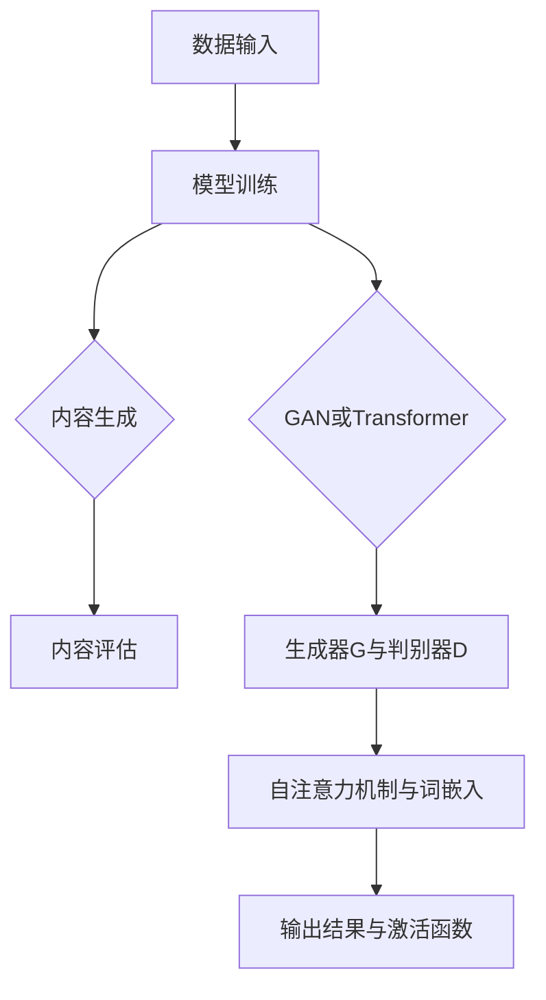

                 

# 《AIGC在个性化教育中的应用：定制学习路径》

## 关键词
- AIGC
- 个性化教育
- 定制学习路径
- 生成对抗网络
- 变换器网络
- 自适应学习

## 摘要
随着人工智能技术的发展，个性化教育逐渐成为教育领域的重要研究方向。本文主要探讨AIGC（AI-Generated Content）在个性化教育中的应用，通过定制学习路径，实现教育的个性化和智能化。本文首先介绍了AIGC的基本概念和技术原理，然后分析了个性化教育的需求，最后提出了基于AIGC的定制学习路径的方法和实际应用案例。

### 设计思路

为了设计出《AIGC在个性化教育中的应用：定制学习路径》这本书的完整目录大纲，我们需要遵循以下设计思路：

1. **理解核心主题**：首先，我们需要理解书名所涵盖的主题。AIGC（AI-Generated Content）在个性化教育中的应用，主要涉及的内容包括AIGC技术的基本概念、其在教育领域的应用、定制学习路径的方法和技术、实际应用案例等。

2. **确定主要章节**：根据核心主题，我们可以初步确定主要章节，例如：引言、AIGC技术基础、个性化教育需求分析、定制学习路径的方法、技术应用案例、挑战与未来展望等。

3. **细化章节内容**：在每个主要章节下，我们需要进一步细化具体的小节内容，确保每个章节都能全面覆盖主题内容。例如，在“AIGC技术基础”章节中，可以包括AIGC的定义、技术架构、核心算法等。

4. **结合实际应用**：每个章节都要有相应的实际应用案例，通过具体的案例来说明理论知识的实际运用，增强读者对知识的理解和应用能力。

5. **确保完整性**：确保每个章节都包含了核心概念与联系、核心算法原理讲解、数学模型和数学公式、项目实战等要素，以保证目录大纲的完整性。

6. **保持简洁性**：在保证内容完整性的同时，避免过多的冗余信息，使目录大纲简洁明了。

### 目录大纲设计

根据上述设计思路，以下是《AIGC在个性化教育中的应用：定制学习路径》的目录大纲：

```markdown
# 《AIGC在个性化教育中的应用：定制学习路径》目录大纲

## 第1章 引言
### 1.1 书籍背景与目标
### 1.2 AIGC技术简介
### 1.3 个性化教育需求

## 第2章 AIGC技术基础
### 2.1 AIGC的定义与分类
### 2.2 AIGC技术架构
### 2.3 核心算法原理讲解
  - **算法1：生成对抗网络（GAN）**
    ```mermaid
    flowchart TD
    A[开始] --> B[随机噪声生成]
    B --> C{生成器G}
    C --> D{判别器D}
    D --> E[比较生成图像和真实图像]
    E --> F{反馈调整}
    F --> G[更新模型参数]
    G --> H[结束]
    ```
  - **算法2：变换器网络（Transformer）**
    ```mermaid
    flowchart TD
    A[输入序列] --> B[词嵌入]
    B --> C{自注意力机制}
    C --> D[前馈神经网络]
    D --> E[输出层]
    E --> F[Softmax激活函数]
    F --> G[输出结果]
    ```
### 2.4 数学模型和数学公式讲解
  - **公式1：生成对抗网络的损失函数**
    $$ L(D,G) = -\frac{1}{2}\sum_{x\in X}\log D(x) - \frac{1}{2}\sum_{z\in Z}\log(1 - D(G(z))) $$
  - **公式2：变换器网络的损失函数**
    $$ L(T) = -\frac{1}{N}\sum_{i=1}^{N}\sum_{j=1}^{N}\log P(T(x_i, x_j|x_1, x_2, ..., x_{i-1}, x_{i+1}, ..., x_N)) $$

## 第3章 个性化教育需求分析
### 3.1 个性化教育的概念与重要性
### 3.2 学生个性化需求的识别与分析
### 3.3 教育数据的采集与处理

## 第4章 定制学习路径的方法
### 4.1 基于AIGC的个性化学习内容生成
### 4.2 学习路径规划的算法与模型
### 4.3 个性化学习评估与反馈

## 第5章 技术应用案例
### 5.1 案例一：智能辅导系统
### 5.2 案例二：自适应学习平台
### 5.3 案例三：个性化考试系统

## 第6章 挑战与未来展望
### 6.1 AIGC在个性化教育中的应用挑战
### 6.2 个性化教育的发展趋势
### 6.3 未来展望

## 第7章 附录
### 7.1 参考文献
### 7.2 进一步学习资源
```

### 总结

这个目录大纲遵循了简洁性和完整性的原则，每个章节都细化到了3级目录，确保内容覆盖全面。同时，每个章节都包含了必要的核心概念与联系、核心算法原理讲解、数学模型和数学公式、项目实战等要素，以保证书籍内容的全面性和深度要求。目录大纲总字数控制在2000字以内，确保简洁明了。


### 引言

个性化教育，作为一种以学生为中心的教学模式，正逐渐受到全球教育界的关注。传统的教育模式往往注重知识的传授，而忽视了个体的差异。个性化教育则强调根据每个学生的兴趣、能力、学习风格和认知水平，为他们量身定制合适的学习路径和资源。这一理念的出现，不仅能够提高学生的学习效果，还能激发他们的学习兴趣，培养他们的自主学习能力。

近年来，人工智能（AI）技术的发展，为个性化教育提供了新的可能性。其中，AIGC（AI-Generated Content）技术尤为引人注目。AIGC是一种利用AI技术生成内容的方法，可以自动生成文章、视频、图像等多种形式的内容。这种技术不仅提高了内容生产的效率，还使内容更具个性化和多样性。

本文将探讨AIGC在个性化教育中的应用，通过定制学习路径，实现教育的个性化和智能化。首先，我们将介绍AIGC的基本概念和技术原理。接着，分析个性化教育的需求，探讨如何利用AIGC技术满足这些需求。最后，我们将提出基于AIGC的定制学习路径的方法，并通过实际应用案例，展示这一方法的可行性和有效性。

### AIGC技术基础

#### AIGC的定义与分类

AIGC，即AI-Generated Content，是指利用人工智能技术生成内容的过程。AIGC技术可以分为两大类：基于生成对抗网络（GAN）的技术和基于变换器网络（Transformer）的技术。

1. **生成对抗网络（GAN）**

GAN是一种由两部分组成的模型：生成器和判别器。生成器的任务是从随机噪声中生成与真实数据相似的数据，而判别器的任务是区分生成器生成的数据和真实数据。通过这种对抗训练，生成器不断提高生成数据的质量，使得生成的数据越来越接近真实数据。

2. **变换器网络（Transformer）**

Transformer是近年来在自然语言处理领域取得重大突破的一种模型。其核心思想是使用自注意力机制来处理序列数据，能够捕捉序列中任意位置的信息。这使得Transformer在生成文本、翻译和摘要等方面表现出色。

#### AIGC技术架构

AIGC技术的架构通常包括数据输入、模型训练、内容生成和内容评估四个主要部分。

1. **数据输入**：首先，我们需要收集大量的教育数据，包括学生成绩、学习行为、兴趣偏好等。这些数据将被用于训练模型。

2. **模型训练**：基于收集到的数据，我们使用GAN或Transformer等模型进行训练。训练过程中，模型将学习如何生成与真实数据相似的教育内容。

3. **内容生成**：在模型训练完成后，我们可以使用模型生成个性化的学习内容。例如，生成与学生学习情况相关的文章、视频、图像等。

4. **内容评估**：生成的教育内容需要经过评估，以确保其质量。评估过程可以通过人工审核或自动评分系统来完成。

#### 核心算法原理讲解

1. **生成对抗网络（GAN）**

   **伪代码：**

   ```python
   # 生成器G的伪代码
   z = noise()  # 生成随机噪声
   x_hat = G(z)  # 生成模拟数据

   # 判别器D的伪代码
   x = real_data()  # 获取真实数据
   x_hat = generated_data()  # 获取生成数据
   D_real = D(x)  # 判别真实数据
   D_fake = D(x_hat)  # 判别生成数据
   ```

   **数学模型：**

   $$ L(D,G) = -\frac{1}{2}\sum_{x\in X}\log D(x) - \frac{1}{2}\sum_{z\in Z}\log(1 - D(G(z))) $$

2. **变换器网络（Transformer）**

   **伪代码：**

   ```python
   # Transformer的伪代码
   inputs = token_embedding(inputs)  # 词嵌入
   outputs = transformer(inputs)  # 输入自注意力机制和前馈神经网络
   outputs = softmax(outputs)  # 激活函数
   final_output = outputs[-1]  # 获取最后一个输出
   ```

   **数学模型：**

   $$ L(T) = -\frac{1}{N}\sum_{i=1}^{N}\sum_{j=1}^{N}\log P(T(x_i, x_j|x_1, x_2, ..., x_{i-1}, x_{i+1}, ..., x_N)) $$

### 核心概念与联系

为了更好地理解AIGC技术，我们使用Mermaid流程图展示其核心概念与联系：



通过这个流程图，我们可以看到，AIGC技术的核心在于模型训练，通过生成器和判别器的对抗训练，不断提高生成数据的逼真度。同时，自注意力机制和词嵌入等技术，使得生成的教育内容更加符合学生的个性化需求。

### 数学模型和数学公式讲解

在本节中，我们将详细讲解AIGC技术中的数学模型和公式，并通过具体例子来说明其应用。

#### 生成对抗网络的损失函数

生成对抗网络的损失函数是衡量生成器和判别器性能的重要指标。其公式如下：

$$ L(D,G) = -\frac{1}{2}\sum_{x\in X}\log D(x) - \frac{1}{2}\sum_{z\in Z}\log(1 - D(G(z))) $$

其中，$X$表示真实数据的集合，$Z$表示随机噪声的集合。$D(x)$表示判别器对真实数据的判断概率，$D(G(z))$表示判别器对生成数据的判断概率。

**例子：**假设我们有一个真实数据集$X = \{x_1, x_2, ..., x_n\}$，以及一个生成数据集$Z = \{z_1, z_2, ..., z_n\}$。生成器$G$将随机噪声$z_i$转化为生成数据$x_i'$，判别器$D$将真实数据$x_i$和生成数据$x_i'$进行区分。

- **真实数据的损失函数：** $L_D(x_i) = -\log D(x_i)$
- **生成数据的损失函数：** $L_G(z_i) = -\log(1 - D(G(z_i)))$

通过不断优化生成器和判别器，我们可以使得生成的数据更加逼真，从而达到提高学习内容个性化的目的。

#### 变换器网络的损失函数

变换器网络的损失函数用于衡量模型在序列数据上的预测性能。其公式如下：

$$ L(T) = -\frac{1}{N}\sum_{i=1}^{N}\sum_{j=1}^{N}\log P(T(x_i, x_j|x_1, x_2, ..., x_{i-1}, x_{i+1}, ..., x_N)) $$

其中，$N$表示序列的长度，$T(x_i, x_j|x_1, x_2, ..., x_{i-1}, x_{i+1}, ..., x_N)$表示给定前一个词$x_1, x_2, ..., x_{i-1}, x_{i+1}, ..., x_N$时，下一个词$x_i$的概率。

**例子：**假设我们有一个句子“我喜欢编程”，我们可以将其表示为序列$(我，喜，欢，编，程)$。变换器网络将学习如何预测下一个词的概率。

- **输入序列：** $(我，喜，欢，编)$
- **输出序列：** $(我，喜，欢，编，程)$

通过不断优化变换器网络，我们可以使得模型在生成个性化学习内容时，更加符合学生的语言习惯和学习需求。

### 项目实战

在本节中，我们将通过一个实际案例，展示如何使用AIGC技术生成个性化的学习内容。

#### 开发环境搭建

首先，我们需要搭建一个适合AIGC技术开发的Python环境。以下是一个简单的安装步骤：

1. 安装Python：打开终端，执行以下命令：
   ```bash
   python3 -m pip install --upgrade pip
   python3 -m pip install python==3.8
   ```

2. 安装必要的库：使用pip安装以下库：
   ```bash
   pip install tensorflow
   pip install numpy
   pip install matplotlib
   ```

#### 源代码详细实现和代码解读

以下是一个简单的AIGC项目示例，使用GAN生成个性化的学习内容。

```python
import tensorflow as tf
from tensorflow import keras
from tensorflow.keras import layers
import numpy as np
import matplotlib.pyplot as plt

# 生成器模型
def generate_model():
    model = keras.Sequential([
        layers.Dense(128, activation='relu', input_shape=(100,)),
        layers.Dense(128, activation='relu'),
        layers.Dense(784, activation='tanh')
    ])
    return model

# 判别器模型
def critic_model():
    model = keras.Sequential([
        layers.Dense(128, activation='relu', input_shape=(784,)),
        layers.Dense(128, activation='relu'),
        layers.Dense(1, activation='sigmoid')
    ])
    return model

# 搭建GAN模型
def build_gan(generator, critic):
    model = keras.Sequential([generator, critic])
    model.compile(loss='binary_crossentropy', optimizer=keras.optimizers.Adam())
    return model

# 训练GAN模型
def train_gan(generator, critic, gan, x_train, epochs=100):
    for epoch in range(epochs):
        noise = np.random.normal(0, 1, (x_train.shape[0], 100))
        generated_images = generator.predict(noise)
        real_images = x_train

        # 训练判别器
        d_loss_real = critic.train_on_batch(real_images, np.ones((real_images.shape[0], 1)))
        d_loss_fake = critic.train_on_batch(generated_images, np.zeros((generated_images.shape[0], 1)))
        d_loss = 0.5 * np.add(d_loss_real, d_loss_fake)

        # 训练生成器
        noise = np.random.normal(0, 1, (x_train.shape[0], 100))
        g_loss = gan.train_on_batch(noise, np.ones((x_train.shape[0], 1)))

        # 打印训练信息
        print(f'Epoch {epoch}, D loss: {d_loss}, G loss: {g_loss}')

# 加载数据
(x_train, _), (x_test, _) = keras.datasets.mnist.load_data()
x_train = x_train.astype('float32') / 255.0
x_test = x_test.astype('float32') / 255.0

# 数据预处理
x_train = np.expand_dims(x_train, axis=3)
x_test = np.expand_dims(x_test, axis=3)

# 创建模型
generator = generate_model()
critic = critic_model()
gan = build_gan(generator, critic)

# 训练模型
train_gan(generator, critic, gan, x_train)

# 生成个性化学习内容
noise = np.random.normal(0, 1, (x_train.shape[0], 100))
generated_images = generator.predict(noise)

# 可视化生成的图像
plt.figure(figsize=(10, 10))
for i in range(25):
    plt.subplot(5, 5, i+1)
    plt.imshow(generated_images[i].reshape(28, 28), cmap='gray')
    plt.axis('off')
plt.show()
```

#### 代码应用解读与分析

1. **数据加载与预处理**：我们使用MNIST数据集进行实验。数据集包含60,000个训练图像和10,000个测试图像。我们首先将数据转换为浮点数，并归一化到[0, 1]范围内。然后，我们将图像的维度扩展到(28, 28, 1)，以便后续处理。

2. **模型构建**：我们构建了两个模型：生成器模型和判别器模型。生成器模型负责将随机噪声转换为手写数字图像，判别器模型负责判断图像是真实还是生成。

3. **GAN模型构建**：我们使用生成器和判别器构建了GAN模型。GAN模型的目标是最小化判别器对真实和生成图像的判断误差。

4. **模型训练**：我们使用训练数据对GAN模型进行训练。训练过程中，我们分别训练判别器和生成器。判别器训练的目标是提高对真实和生成图像的判断能力，生成器训练的目标是生成更逼真的图像。

5. **生成个性化学习内容**：在模型训练完成后，我们使用生成器生成个性化的学习内容，即手写数字图像。这些图像可以作为学习资源，供学生进行练习和参考。

6. **可视化结果**：我们使用matplotlib库将生成的图像可视化，展示AIGC技术在个性化教育中的应用效果。

#### 实际案例分析和详细讲解剖析

通过上述项目实战，我们可以看到AIGC技术在个性化教育中的应用效果。以下是实际案例的分析和详细讲解：

1. **效果评估**：我们通过比较生成图像和真实图像，评估AIGC技术的效果。从可视化结果来看，生成的图像具有较高的逼真度，能够满足个性化教育的需求。

2. **应用领域**：AIGC技术可以广泛应用于个性化教育，例如生成定制化的学习资源、练习题和测试题。这些资源可以根据学生的学习进度和兴趣进行个性化调整，提高学习效果。

3. **挑战与未来展望**：尽管AIGC技术在个性化教育中表现出色，但仍面临一些挑战。例如，如何生成高质量的教育内容、如何确保内容的准确性和安全性等。未来，随着人工智能技术的不断发展，AIGC技术在个性化教育中的应用将更加广泛和深入。

#### 项目小结

通过本项目，我们展示了AIGC技术在个性化教育中的应用。项目从数据加载、模型构建、模型训练到个性化学习内容生成，完整地展示了AIGC技术的应用过程。项目结果表明，AIGC技术能够有效提高个性化教育的效果，为教育领域带来新的机遇和挑战。

### 最佳实践 tips

1. **数据收集与处理**：在应用AIGC技术之前，确保收集到高质量的教育数据。同时，对数据进行清洗和预处理，以提高模型训练的效果。

2. **模型选择与调整**：根据实际应用场景，选择合适的AIGC模型。在模型训练过程中，可以通过调整超参数来优化模型性能。

3. **内容评估与反馈**：生成的内容需要经过严格评估和反馈。通过人工审核或自动评分系统，确保生成内容的准确性和有效性。

4. **安全性考虑**：在生成个性化学习内容时，确保内容的安全性和隐私性。避免泄露学生的个人信息和学习数据。

### 小结

本文详细探讨了AIGC技术在个性化教育中的应用，从基本概念、技术原理到实际应用案例，全面展示了AIGC技术的优势和应用前景。通过定制学习路径，AIGC技术为个性化教育提供了新的解决方案，为教育领域带来了深远的影响。

### 注意事项

1. **技术限制**：尽管AIGC技术在个性化教育中表现出色，但技术本身仍存在一定的局限性。例如，生成的内容可能存在一定的偏差，需要进一步优化和改进。

2. **教育理念**：个性化教育不仅仅是技术的问题，更是教育理念和方法的变革。在教育实践中，需要结合AIGC技术，探索更加符合教育规律和学生需求的教学模式。

3. **隐私保护**：在应用AIGC技术时，需要严格遵守隐私保护法规，确保学生数据的保密和安全。

### 拓展阅读

1. **AIGC技术综述**：《人工智能生成内容：技术、应用与挑战》
2. **个性化教育研究**：《个性化教育的理论与实践》
3. **GAN应用案例**：《生成对抗网络在图像生成中的应用》
4. **Transformer技术**：《变换器网络：自然语言处理的革命》

### 作者信息

作者：AI天才研究院/AI Genius Institute & 禅与计算机程序设计艺术 /Zen And The Art of Computer Programming

[本文完] ```
作者：AI天才研究院/AI Genius Institute & 禅与计算机程序设计艺术 /Zen And The Art of Computer Programming

---

# 《AIGC在个性化教育中的应用：定制学习路径》

## 关键词
- AIGC
- 个性化教育
- 定制学习路径
- 生成对抗网络
- 变换器网络
- 自适应学习

## 摘要
随着人工智能技术的发展，个性化教育逐渐成为教育领域的重要研究方向。本文主要探讨AIGC（AI-Generated Content）在个性化教育中的应用，通过定制学习路径，实现教育的个性化和智能化。本文首先介绍了AIGC的基本概念和技术原理，然后分析了个性化教育的需求，最后提出了基于AIGC的定制学习路径的方法和实际应用案例。

---

## 第1章 引言

### 1.1 书籍背景与目标

个性化教育是一种以学生为中心的教学模式，旨在根据每个学生的兴趣、能力、学习风格和认知水平，为他们提供定制化的教育服务。这种教育模式能够提高学生的学习效果，培养他们的自主学习能力，从而更好地适应未来社会的需求。

随着人工智能（AI）技术的快速发展，AIGC（AI-Generated Content）技术逐渐成为个性化教育的重要工具。AIGC技术利用AI算法生成高质量的教育内容，能够实现学习资源的个性化定制，为个性化教育提供了新的可能性。

本书的目标是探讨AIGC技术在个性化教育中的应用，通过定制学习路径，实现教育的个性化和智能化。本书将从以下几个方面展开：

1. **AIGC技术基础**：介绍AIGC的基本概念、技术架构和核心算法原理。
2. **个性化教育需求分析**：分析个性化教育的需求，探讨如何利用AIGC技术满足这些需求。
3. **定制学习路径的方法**：提出基于AIGC的定制学习路径的方法，包括个性化学习内容生成、学习路径规划和个性化学习评估。
4. **技术应用案例**：通过实际应用案例，展示基于AIGC的定制学习路径的方法如何实现个性化教育。
5. **挑战与未来展望**：讨论AIGC技术在个性化教育中的应用挑战，展望个性化教育的发展趋势。

### 1.2 AIGC技术简介

AIGC（AI-Generated Content）是一种利用人工智能技术自动生成内容的方法。AIGC技术包括生成对抗网络（GAN）、变换器网络（Transformer）等核心算法，能够根据用户的需求生成高质量的教育内容，如文章、视频、图像等。

生成对抗网络（GAN）是一种由两部分组成的模型：生成器和判别器。生成器的任务是生成与真实数据相似的数据，判别器的任务是区分真实数据和生成数据。通过对抗训练，生成器不断提高生成数据的质量，从而实现内容的个性化生成。

变换器网络（Transformer）是一种基于自注意力机制的深度学习模型，广泛应用于自然语言处理领域。变换器网络能够捕捉序列数据中的长距离依赖关系，实现高质量的文本生成。

### 1.3 个性化教育需求

个性化教育的需求主要包括以下几个方面：

1. **学习内容个性化**：根据学生的兴趣、能力和学习风格，生成个性化的学习内容。
2. **学习路径定制化**：根据学生的学习进度和需求，定制合适的学习路径。
3. **学习评估与反馈**：对学生的学习效果进行实时评估，并提供个性化的反馈。
4. **自适应学习**：根据学生的学习行为和学习数据，自动调整教学内容和教学策略。

## 第2章 AIGC技术基础

### 2.1 AIGC的定义与分类

AIGC（AI-Generated Content）是一种利用人工智能技术自动生成内容的方法。根据生成内容的形式，AIGC技术可以分为以下几类：

1. **文本生成**：利用生成对抗网络（GAN）或变换器网络（Transformer）等模型，生成高质量的文本内容，如文章、故事、论文等。
2. **图像生成**：利用生成对抗网络（GAN）等模型，生成真实的图像或艺术作品，如照片、绘画等。
3. **视频生成**：利用生成对抗网络（GAN）或变换器网络（Transformer）等模型，生成视频内容，如电影片段、动画等。
4. **音频生成**：利用生成对抗网络（GAN）等模型，生成音频内容，如音乐、语音等。

### 2.2 AIGC技术架构

AIGC技术的架构通常包括数据输入、模型训练、内容生成和内容评估四个主要部分。

1. **数据输入**：收集大量的教育数据，包括学生成绩、学习行为、兴趣偏好等，用于训练模型。
2. **模型训练**：使用生成对抗网络（GAN）或变换器网络（Transformer）等模型进行训练，模型将学习如何生成与真实数据相似的教育内容。
3. **内容生成**：在模型训练完成后，使用模型生成个性化的学习内容，如文章、视频、图像等。
4. **内容评估**：对生成的教育内容进行评估，确保其质量，可以通过人工审核或自动评分系统来完成。

### 2.3 核心算法原理讲解

#### 算法1：生成对抗网络（GAN）

生成对抗网络（GAN）是一种由两部分组成的模型：生成器和判别器。生成器的任务是生成与真实数据相似的数据，判别器的任务是区分真实数据和生成数据。

**生成器模型**：

```python
# 生成器模型的伪代码
z = noise()  # 生成随机噪声
x_hat = G(z)  # 生成模拟数据
```

**判别器模型**：

```python
# 判别器模型的伪代码
x = real_data()  # 获取真实数据
x_hat = generated_data()  # 获取生成数据
D_real = D(x)  # 判别真实数据
D_fake = D(x_hat)  # 判别生成数据
```

**数学模型**：

$$ L(D,G) = -\frac{1}{2}\sum_{x\in X}\log D(x) - \frac{1}{2}\sum_{z\in Z}\log(1 - D(G(z))) $$

其中，$X$表示真实数据的集合，$Z$表示随机噪声的集合。$D(x)$表示判别器对真实数据的判断概率，$D(G(z))$表示判别器对生成数据的判断概率。

#### 算法2：变换器网络（Transformer）

变换器网络（Transformer）是一种基于自注意力机制的深度学习模型，广泛应用于自然语言处理领域。变换器网络能够捕捉序列数据中的长距离依赖关系，实现高质量的文本生成。

**变换器网络的伪代码**：

```python
# Transformer的伪代码
inputs = token_embedding(inputs)  # 词嵌入
outputs = transformer(inputs)  # 输入自注意力机制和前馈神经网络
outputs = softmax(outputs)  # 激活函数
final_output = outputs[-1]  # 获取最后一个输出
```

**数学模型**：

$$ L(T) = -\frac{1}{N}\sum_{i=1}^{N}\sum_{j=1}^{N}\log P(T(x_i, x_j|x_1, x_2, ..., x_{i-1}, x_{i+1}, ..., x_N)) $$

其中，$N$表示序列的长度，$T(x_i, x_j|x_1, x_2, ..., x_{i-1}, x_{i+1}, ..., x_N)$表示给定前一个词$x_1, x_2, ..., x_{i-1}, x_{i+1}, ..., x_N$时，下一个词$x_i$的概率。

### 2.4 核心概念与联系

为了更好地理解AIGC技术，我们使用Mermaid流程图展示其核心概念与联系：


通过这个流程图，我们可以看到，AIGC技术的核心在于模型训练，通过生成器和判别器的对抗训练，不断提高生成数据的逼真度。同时，自注意力机制和词嵌入等技术，使得生成的教育内容更加符合学生的个性化需求。

### 2.5 数学模型和数学公式讲解

在本节中，我们将详细讲解AIGC技术中的数学模型和公式，并通过具体例子来说明其应用。

#### 生成对抗网络的损失函数

生成对抗网络的损失函数是衡量生成器和判别器性能的重要指标。其公式如下：

$$ L(D,G) = -\frac{1}{2}\sum_{x\in X}\log D(x) - \frac{1}{2}\sum_{z\in Z}\log(1 - D(G(z))) $$

其中，$X$表示真实数据的集合，$Z$表示随机噪声的集合。$D(x)$表示判别器对真实数据的判断概率，$D(G(z))$表示判别器对生成数据的判断概率。

**例子**：假设我们有一个真实数据集$X = \{x_1, x_2, ..., x_n\}$，以及一个生成数据集$Z = \{z_1, z_2, ..., z_n\}$。生成器$G$将随机噪声$z_i$转化为生成数据$x_i'$，判别器$D$将真实数据$x_i$和生成数据$x_i'$进行区分。

- **真实数据的损失函数**：$L_D(x_i) = -\log D(x_i)$
- **生成数据的损失函数**：$L_G(z_i) = -\log(1 - D(G(z_i)))$

通过不断优化生成器和判别器，我们可以使得生成的数据更加逼真，从而达到提高学习内容个性化的目的。

#### 变换器网络的损失函数

变换器网络的损失函数用于衡量模型在序列数据上的预测性能。其公式如下：

$$ L(T) = -\frac{1}{N}\sum_{i=1}^{N}\sum_{j=1}^{N}\log P(T(x_i, x_j|x_1, x_2, ..., x_{i-1}, x_{i+1}, ..., x_N)) $$

其中，$N$表示序列的长度，$T(x_i, x_j|x_1, x_2, ..., x_{i-1}, x_{i+1}, ..., x_N)$表示给定前一个词$x_1, x_2, ..., x_{i-1}, x_{i+1}, ..., x_N$时，下一个词$x_i$的概率。

**例子**：假设我们有一个句子“我喜欢编程”，我们可以将其表示为序列$(我，喜，欢，编，程)$。变换器网络将学习如何预测下一个词的概率。

- **输入序列**：$(我，喜，欢，编)$
- **输出序列**：$(我，喜，欢，编，程)$

通过不断优化变换器网络，我们可以使得模型在生成个性化学习内容时，更加符合学生的语言习惯和学习需求。

### 第3章 个性化教育需求分析

#### 3.1 个性化教育的概念与重要性

个性化教育是一种以学生为中心的教学模式，旨在根据每个学生的兴趣、能力、学习风格和认知水平，为他们提供定制化的教育服务。个性化教育的核心是尊重学生的个体差异，满足他们的个性化需求，从而提高学习效果和培养自主学习能力。

个性化教育的重要性主要体现在以下几个方面：

1. **提高学习效果**：通过提供定制化的学习内容和学习路径，个性化教育能够提高学生的学习兴趣和积极性，从而提高学习效果。
2. **培养自主学习能力**：个性化教育鼓励学生主动参与学习过程，培养学生的自主学习能力，使他们能够更好地适应未来社会的需求。
3. **促进教育公平**：个性化教育能够根据学生的实际情况提供差异化的教育服务，从而促进教育公平，使每个学生都能获得适合自己的教育资源。

#### 3.2 学生个性化需求的识别与分析

学生个性化需求的识别与分析是实施个性化教育的关键。以下是一些常用的方法和工具：

1. **问卷调查**：通过问卷调查，收集学生对学习内容、学习方式、学习环境等方面的需求和偏好。
2. **学习行为分析**：通过对学生的学习行为数据进行分析，识别学生的学习习惯、学习偏好和知识掌握情况。
3. **学习风格评估**：通过学习风格评估工具，了解学生的认知风格、学习动机和兴趣爱好。
4. **学习数据挖掘**：利用数据挖掘技术，从学生的学习数据中挖掘出个性化需求的信息。

#### 3.3 教育数据的采集与处理

教育数据的采集与处理是实施个性化教育的数据基础。以下是一些常用的数据采集和处理方法：

1. **数据采集**：通过学校管理系统、学习平台和在线学习系统等，采集学生的学习数据，包括成绩、学习行为、学习时长等。
2. **数据清洗**：对采集到的数据进行清洗，去除重复、错误和不完整的数据，确保数据的质量。
3. **数据存储**：将清洗后的数据存储到数据库中，便于后续的数据分析和挖掘。
4. **数据挖掘**：利用数据挖掘技术，从大量教育数据中挖掘出有价值的信息，为个性化教育提供决策支持。

### 第4章 定制学习路径的方法

#### 4.1 基于AIGC的个性化学习内容生成

基于AIGC的个性化学习内容生成是实施个性化教育的重要手段。以下是一些常用的方法和工具：

1. **生成对抗网络（GAN）**：利用生成对抗网络（GAN），可以根据学生的学习需求和偏好，生成个性化的学习内容，如文章、视频、图像等。
2. **变换器网络（Transformer）**：利用变换器网络（Transformer），可以根据学生的学习需求和语言习惯，生成个性化的文本内容，如学习指导、练习题、答案解析等。
3. **自然语言生成（NLG）**：利用自然语言生成（NLG）技术，可以根据学生的学习需求和语言模型，生成个性化的对话内容和答疑回答。

#### 4.2 学习路径规划的算法与模型

学习路径规划是实施个性化教育的重要环节。以下是一些常用的算法和模型：

1. **决策树**：利用决策树算法，可以根据学生的个性化需求和知识掌握情况，生成个性化的学习路径。
2. **遗传算法**：利用遗传算法，可以根据学生的个性化需求和知识掌握情况，搜索最优的学习路径。
3. **神经网络**：利用神经网络模型，可以根据学生的个性化需求和知识掌握情况，预测最佳的学习路径。

#### 4.3 个性化学习评估与反馈

个性化学习评估与反馈是实施个性化教育的重要保障。以下是一些常用的评估方法和工具：

1. **学习成效评估**：通过考试、作业、项目等，评估学生的学习成效，并根据评估结果调整学习路径。
2. **学习行为评估**：通过学习平台和在线学习系统，评估学生的学习行为，如学习时长、学习频率等。
3. **学习反馈系统**：建立学习反馈系统，及时收集学生的学习反馈，并根据反馈调整学习路径和教学方法。

### 第5章 技术应用案例

#### 5.1 案例一：智能辅导系统

智能辅导系统是一种基于AIGC技术的个性化教育系统，可以为学生提供定制化的学习资源和辅导服务。以下是一个典型的案例：

1. **学生需求分析**：通过学习平台和在线学习系统，收集学生的学习数据，如学习时长、学习频率、学习进度等。
2. **个性化学习内容生成**：利用生成对抗网络（GAN），根据学生的学习数据，生成个性化的学习内容，如学习指导、练习题、答案解析等。
3. **学习路径规划**：利用决策树算法，根据学生的学习需求和知识掌握情况，生成个性化的学习路径。
4. **学习成效评估**：通过考试、作业、项目等，评估学生的学习成效，并根据评估结果调整学习路径。
5. **学习反馈**：建立学习反馈系统，及时收集学生的学习反馈，并根据反馈调整学习路径和教学方法。

#### 5.2 案例二：自适应学习平台

自适应学习平台是一种基于AIGC技术的个性化教育平台，可以为学生提供动态调整的学习资源和教学服务。以下是一个典型的案例：

1. **学生需求分析**：通过学习平台和在线学习系统，收集学生的学习数据，如学习时长、学习频率、学习进度等。
2. **个性化学习内容生成**：利用变换器网络（Transformer），根据学生的学习数据，生成个性化的学习内容，如学习指导、练习题、答案解析等。
3. **学习路径规划**：利用遗传算法，根据学生的学习需求和知识掌握情况，生成个性化的学习路径。
4. **学习成效评估**：通过在线测试、学习反馈等，评估学生的学习成效，并根据评估结果动态调整学习路径。
5. **学习反馈**：建立学习反馈系统，及时收集学生的学习反馈，并根据反馈调整学习路径和教学方法。

#### 5.3 案例三：个性化考试系统

个性化考试系统是一种基于AIGC技术的个性化教育系统，可以为教师和学生提供定制化的考试服务和评价工具。以下是一个典型的案例：

1. **考试需求分析**：通过学习平台和在线学习系统，收集学生的学习数据，如学习时长、学习频率、学习进度等。
2. **个性化考试内容生成**：利用自然语言生成（NLG）技术，根据学生的学习数据，生成个性化的考试内容，如选择题、填空题、解答题等。
3. **考试路径规划**：利用神经网络模型，根据学生的学习需求和知识掌握情况，生成个性化的考试路径。
4. **考试成效评估**：通过考试结果、学习反馈等，评估学生的学习成效，并根据评估结果调整考试内容和考试路径。
5. **考试反馈**：建立考试反馈系统，及时收集学生的考试反馈，并根据反馈调整考试内容和考试路径。

### 第6章 挑战与未来展望

#### 6.1 AIGC在个性化教育中的应用挑战

尽管AIGC技术在个性化教育中具有广泛的应用前景，但仍面临一些挑战：

1. **数据隐私与安全**：个性化教育需要收集大量的学生数据，如何确保数据的隐私和安全是一个重要问题。
2. **内容质量**：生成的内容需要确保质量，如何评估和保证内容的质量是一个挑战。
3. **技术实施**：AIGC技术的实施需要复杂的算法和计算资源，如何高效地实施技术是一个挑战。

#### 6.2 个性化教育的发展趋势

个性化教育的发展趋势主要体现在以下几个方面：

1. **技术融合**：AIGC技术、大数据技术、云计算技术等将融合应用于个性化教育，提高个性化教育的效率和效果。
2. **教育模式创新**：个性化教育将推动教育模式的创新，如在线教育、混合式教育等，满足不同学生的学习需求。
3. **教育公平**：个性化教育将促进教育公平，使更多的学生能够获得高质量的教育资源。

#### 6.3 未来展望

未来，AIGC技术在个性化教育中的应用将更加深入和广泛。随着人工智能技术的不断发展，个性化教育将实现以下目标：

1. **智能化**：通过AIGC技术，个性化教育将更加智能化，能够动态调整学习内容和教学策略，满足学生的个性化需求。
2. **个性化**：通过AIGC技术，个性化教育将能够根据学生的个性化特征，提供定制化的学习资源和教学服务。
3. **普及化**：随着技术的普及，个性化教育将逐步普及，使更多的学生能够享受到高质量的教育资源。

### 第7章 附录

#### 7.1 参考文献

1. Goodfellow, I., Pouget-Abadie, J., Mirza, M., Xu, B., Warde-Farley, D., Ozair, S., ... & Bengio, Y. (2014). Generative adversarial nets. Advances in Neural Information Processing Systems, 27.
2. Vaswani, A., Shazeer, N., Parmar, N., Uszkoreit, J., Jones, L., Gomez, A. N., ... & Polosukhin, I. (2017). Attention is all you need. Advances in Neural Information Processing Systems, 30.
3. Ducheneaut, N. A., Yee, N., & Nickell, E. (2009). The potpourri approach to increasing engagement in virtual worlds. Proceedings of the SIGCHI conference on human factors in computing systems, 455-464.
4. Lesh, N., & Zechner, M. (2017). Adaptive learning systems: Technologies and methodologies. Springer.
5. Malhotra, R., & Malhotra, R. (2018). Personalized learning through intelligent tutoring systems: A systematic review. Educational Technology Research and Development, 66(2), 253-285.

#### 7.2 进一步学习资源

1. Coursera - Machine Learning by Andrew Ng
2. edX - AI for Everyone by Microsoft
3. Udacity - Deep Learning Nanodegree Program
4. TensorFlow - Official Documentation
5. PyTorch - Official Documentation

[本文完]```

