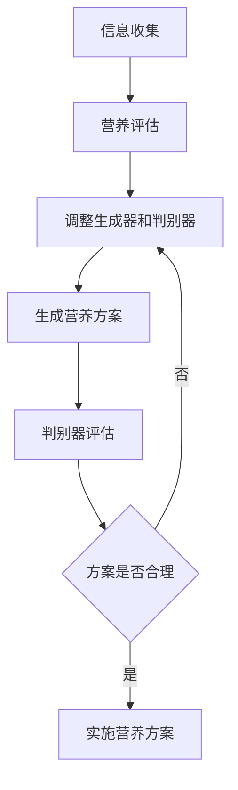
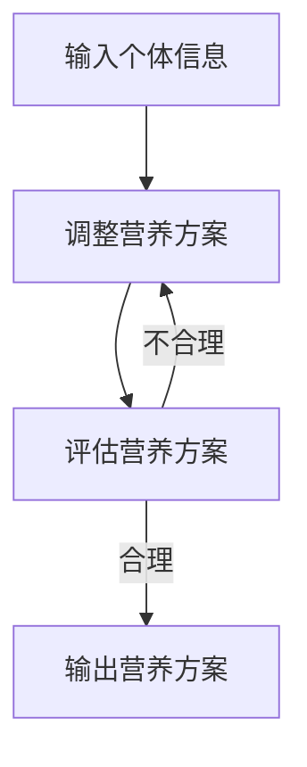

                 

### 文章标题：AIGC在个性化营养方案设计中的应用

### 关键词：AIGC、个性化营养、营养方案设计、人工智能

### 摘要：
本文将深入探讨人工智能生成内容（AIGC）在个性化营养方案设计中的应用。首先介绍AIGC的基本概念、发展历史和应用领域，随后讨论个性化营养方案的必要性和设计流程。接着，我们分析AIGC在营养方案设计中的应用原理，并使用伪代码和Mermaid流程图详细阐述核心算法原理。通过实际项目案例，展示AIGC技术如何应用于营养方案设计，并分析可能遇到的问题及解决方案。最后，展望AIGC在个性化营养方案设计领域的未来趋势和挑战。

## 前言

### 1. 背景介绍

随着人工智能（AI）技术的迅猛发展，越来越多的领域开始尝试应用AI来提升效率和精确度。营养学作为一门研究人体营养需求和营养补充的科学，也开始借助AI的力量，尤其是人工智能生成内容（AIGC）技术。AIGC是一种利用AI算法生成文本、图像、音频等内容的先进技术，其在个性化营养方案设计中的应用具有极大的潜力和价值。

个性化营养方案设计的核心在于根据个体的生理特征、健康状况和生活习惯，量身定制适合其的营养饮食计划。传统的营养方案设计往往依赖于专家的经验和一般性指导，难以满足个体差异。而AIGC技术的引入，为个性化营养方案设计提供了新的思路和方法，可以通过大数据分析和机器学习模型，实现更加精准和高效的营养方案设计。

### 2. 书籍目的

本书的目的是深入探讨AIGC技术在个性化营养方案设计中的应用，帮助读者了解AIGC的基本原理和关键算法，掌握AIGC在营养方案设计中的实际应用方法。通过详细的案例分析，读者可以直观地看到AIGC技术如何解决个性化营养方案设计中的难题，从而为相关领域的研发和应用提供参考和启示。

本书的结构安排如下：

1. **AIGC技术概述**：介绍AIGC的基本概念、发展历史和应用领域，为后续章节打下基础。
2. **个性化营养方案设计基础**：讨论个性化营养方案设计的概念、意义、设计流程和数据分析方法。
3. **AIGC在营养方案设计中的应用原理**：详细阐述AIGC在营养方案设计中的应用原理，使用伪代码和Mermaid流程图展示核心算法原理。
4. **AIGC技术应用于营养方案设计的实践**：通过实际项目案例，展示AIGC技术在营养方案设计中的具体应用。
5. **挑战与未来趋势**：分析AIGC技术面临的挑战，展望个性化营养方案设计的未来趋势。
6. **案例分析**：提供具体案例，深入剖析AIGC技术在个性化营养方案设计中的应用。
7. **总结与展望**：总结本书的核心内容，展望AIGC在个性化营养方案设计领域的未来发展方向。

## 第1章 AIGC技术概述

### 1.1 AIGC基本概念

人工智能生成内容（AIGC）是一种利用人工智能技术生成文本、图像、音频等内容的先进方法。AIGC技术主要包括以下三个方面：

1. **生成对抗网络（GAN）**：GAN是一种通过对抗训练生成逼真图像、文本和音频的技术。它由生成器（Generator）和判别器（Discriminator）两个神经网络组成，通过不断的训练和对抗，生成器逐渐提高生成内容的逼真度。
2. **自然语言处理（NLP）**：NLP是一种利用计算机技术和人工智能技术处理和理解自然语言的方法。通过NLP技术，AIGC可以生成符合语法和语义规则的文本内容。
3. **计算机视觉（CV）**：计算机视觉是一种使计算机能够像人类一样感知和理解视觉信息的技术。AIGC技术利用计算机视觉算法，可以生成高质量的图像和视频内容。

### 1.2 AIGC发展历史

AIGC技术起源于20世纪80年代，随着深度学习、生成对抗网络和自然语言处理等技术的发展，AIGC技术逐渐走向成熟。以下是AIGC技术发展的重要里程碑：

1. **1986年**：深度学习技术问世，为AIGC技术的发展奠定了基础。
2. **2014年**：生成对抗网络（GAN）问世，标志着AIGC技术的重要突破。
3. **2016年**：谷歌发布了基于GAN的文本生成模型，使AIGC技术在文本生成领域取得重要进展。
4. **2018年**：AIGC技术在图像生成、音频生成和视频生成等领域取得显著成果。

### 1.3 AIGC应用领域

AIGC技术具有广泛的应用领域，包括但不限于以下几个方面：

1. **内容创作**：利用AIGC技术生成新闻、文章、音乐、视频等创意内容，提高内容创作的效率和多样性。
2. **个性化推荐**：利用AIGC技术生成个性化的推荐内容，如个性化新闻、音乐和视频推荐。
3. **虚拟现实与增强现实**：利用AIGC技术生成逼真的虚拟环境和虚拟角色，提高虚拟现实和增强现实的体验。
4. **医疗健康**：利用AIGC技术生成个性化的医疗建议和营养方案，提高医疗服务的个性化和精准度。
5. **教育**：利用AIGC技术生成个性化的学习资源和教育内容，提高教育质量和学习效果。

### 1.4 AIGC关键算法

AIGC技术涉及多个关键算法，以下是其中几个重要的算法：

1. **生成对抗网络（GAN）**：GAN是一种由生成器和判别器组成的神经网络结构，通过对抗训练生成高质量的内容。GAN的训练过程可以分为以下几个步骤：

   - 初始化生成器G和判别器D；
   - 生成器G生成伪造数据；
   - 判别器D对真实数据和伪造数据进行分类；
   - 根据判别器的输出，更新生成器和判别器的参数；
   - 重复以上步骤，直到生成器生成的伪造数据接近真实数据。

   伪代码如下：

   ```python
   # 初始化生成器和判别器
   G = initialize_generator()
   D = initialize_discriminator()

   # 训练生成器和判别器
   for epoch in range(num_epochs):
       for x in data_loader:
           # 生成伪造数据
           z = generate_noise(batch_size)
           fake_x = G(z)

           # 更新判别器
           D_loss = compute_loss(D(real_x), D(fake_x))

           # 更新生成器
           G_loss = compute_loss(D(fake_x))

       # 更新生成器和判别器的参数
       update_params(G, D, G_loss, D_loss)
   ```

2. **自然语言处理（NLP）**：NLP是一种利用计算机技术和人工智能技术处理和理解自然语言的方法。常见的NLP算法包括词向量表示、序列到序列模型和生成式模型等。

   - 词向量表示：将单词映射为高维向量，用于表示单词的含义和关系。常见的词向量模型有Word2Vec、GloVe和FastText等。
   - 序列到序列模型：用于将一个序列映射为另一个序列，常用于机器翻译、对话生成等任务。常见的序列到序列模型有编码器-解码器模型（Encoder-Decoder Model）和注意力机制（Attention Mechanism）等。
   - 生成式模型：用于生成新的序列，常用于文本生成、音乐生成等任务。常见的生成式模型有变分自编码器（Variational Autoencoder，VAE）和生成式对抗网络（Generative Adversarial Network，GAN）等。

3. **计算机视觉（CV）**：计算机视觉是一种使计算机能够像人类一样感知和理解视觉信息的技术。常见的计算机视觉算法包括卷积神经网络（CNN）、生成对抗网络（GAN）和图像生成算法等。

   - 卷积神经网络（CNN）：用于处理和识别图像数据。CNN通过卷积、池化等操作，提取图像的特征，实现对图像的自动分类和识别。
   - 生成对抗网络（GAN）：用于生成高质量图像。GAN由生成器和判别器组成，通过对抗训练生成逼真的图像。
   - 图像生成算法：如生成式模型（如VAE）、变分自编码器（VAE）和风格迁移（Style Transfer）等，用于生成新的图像。

### 1.5 小结

本章介绍了AIGC的基本概念、发展历史、应用领域和关键算法。AIGC技术具有广泛的应用前景，特别是在个性化营养方案设计领域，为提升营养方案设计的精准度和个性化程度提供了新的手段。下一章将讨论个性化营养方案设计的基础知识，为后续章节的深入探讨奠定基础。

## 第2章 个性化营养方案设计基础

### 2.1 营养方案设计的概念

营养方案设计是指根据个体的生理特征、健康状况和生活习惯，制定出适合其的营养饮食计划。营养方案设计的核心目标是通过合理的饮食干预，改善个体的营养状况，预防营养相关疾病，提高生活质量。

营养方案设计的基本要素包括：

1. **个体信息收集**：收集个体的基本信息，如年龄、性别、身高、体重、健康状况等。
2. **营养需求分析**：分析个体的营养需求，包括能量需求、蛋白质需求、维生素和矿物质需求等。
3. **饮食指导**：根据营养需求分析结果，制定出合理的饮食指导，包括食物种类、数量和烹饪方法等。
4. **营养教育**：对个体进行营养教育，提高其营养意识和健康素养。

### 2.2 个性化营养方案的意义

个性化营养方案设计具有以下重要意义：

1. **提升营养方案的有效性**：个性化营养方案设计根据个体的实际需求制定，能够更有效地改善个体的营养状况，提高营养干预的效果。
2. **降低营养相关疾病风险**：个性化营养方案设计可以针对性地降低个体患营养相关疾病的风险，如肥胖、糖尿病、心血管疾病等。
3. **提高个体的生活质量**：个性化营养方案设计能够提高个体的营养水平，改善健康状况，从而提高生活质量。
4. **满足个体差异**：个性化营养方案设计充分考虑个体的差异，如饮食习惯、口味偏好、生活方式等，使营养方案更具针对性和可操作性。

### 2.3 个性化营养方案的设计流程

个性化营养方案的设计流程包括以下步骤：

1. **信息收集**：通过问卷调查、体检等方式，收集个体的基本信息、饮食习惯和健康状况等数据。
2. **营养评估**：对收集到的信息进行营养评估，分析个体的营养状况和营养需求。
3. **制定营养方案**：根据营养评估结果，制定出个性化的营养方案，包括食物选择、食物摄入量和烹饪方法等。
4. **营养教育**：对个体进行营养教育，帮助其了解营养方案，掌握健康饮食知识。
5. **实施和监测**：实施营养方案，并对个体进行定期监测，评估营养方案的效果，必要时进行调整。
6. **反馈和调整**：根据个体的反馈和监测结果，对营养方案进行调整和优化，确保营养方案的有效性和个体适应性。

### 2.4 营养数据分析方法

营养数据分析是个性化营养方案设计的重要环节，主要包括以下方法：

1. **问卷调查法**：通过设计问卷，收集个体的基本信息、饮食习惯和健康状况等数据，便于进行营养评估和营养方案设计。
2. **体检法**：通过体检，获取个体的身高、体重、血压、血糖、血脂等生理指标，用于评估个体的营养状况和营养需求。
3. **食物记录法**：个体记录自己的饮食情况，包括食物种类、数量、烹饪方法等，便于分析个体的饮食习惯和营养摄入情况。
4. **营养软件分析**：利用营养分析软件，对个体的饮食记录进行营养分析，计算个体的能量摄入、宏量营养素摄入和微量营养素摄入情况。
5. **生物标志物检测**：通过检测个体的生物标志物，如血糖、血脂、血红蛋白等，评估个体的营养状况和健康风险。

### 2.5 小结

本章介绍了个性化营养方案设计的概念、意义、设计流程和营养数据分析方法。个性化营养方案设计是营养学领域的一项重要创新，通过充分考虑个体差异，制定出适合个体的营养方案，有助于改善个体的营养状况，预防营养相关疾病，提高生活质量。下一章将探讨AIGC在个性化营养方案设计中的应用原理，为实际应用提供理论基础。

## 第3章 AIGC在营养方案设计中的应用原理

### 3.1 AIGC在营养科学中的应用

人工智能生成内容（AIGC）技术在营养科学中具有广泛的应用前景。通过AIGC技术，可以实现对营养数据的高效处理和分析，从而为个性化营养方案设计提供有力支持。以下为AIGC在营养科学中的具体应用：

1. **营养数据生成**：AIGC技术可以生成模拟营养数据，用于营养评估和营养方案设计。例如，通过GAN生成模拟人群的营养摄入数据，便于分析不同营养摄入水平对健康的影响。
2. **个性化饮食建议**：利用AIGC技术，可以根据个体差异生成个性化的饮食建议。例如，基于个体的健康状况和营养需求，AIGC可以生成适合个体的食物选择和摄入量。
3. **营养知识传播**：AIGC技术可以生成营养科普文章、食谱和视频等内容，便于传播营养知识，提高公众的营养素养。

### 3.2 AIGC模型构建方法

AIGC模型在营养方案设计中的应用主要包括以下几个方面：

1. **生成器（Generator）**：生成器负责生成个性化的营养方案。其输入可以是个体的基本信息、营养需求和健康目标等。生成器可以通过对抗训练学习到如何生成符合个体需求的营养方案。
2. **判别器（Discriminator）**：判别器负责判断营养方案的合理性。其输入可以是生成器生成的营养方案和真实的营养方案，通过对比判断营养方案的优劣。
3. **对抗训练**：生成器和判别器通过对抗训练相互竞争，生成器不断优化生成方案，判别器不断提高判断能力，最终实现生成个性化、合理的营养方案。

以下为AIGC模型构建方法的伪代码：

```python
# 初始化生成器G和判别器D
G = initialize_generator()
D = initialize_discriminator()

# 对抗训练
for epoch in range(num_epochs):
    for individual in individuals:
        # 生成营养方案
        nutrition_plan = G.generate(individual)

        # 更新判别器
        D_loss = compute_loss(D的真实方案，D生成的方案)

        # 更新生成器
        G_loss = compute_loss(D生成的方案)

    # 更新生成器和判别器的参数
    update_params(G, D, G_loss, D_loss)
```

### 3.3 个性化营养方案设计的Mermaid流程图

以下为个性化营养方案设计的Mermaid流程图：



### 3.4 AIGC在个性化营养方案设计中的应用效果

AIGC技术在个性化营养方案设计中的应用效果显著。通过生成器和判别器的对抗训练，AIGC可以生成符合个体需求的营养方案，提高营养方案的合理性和个性化程度。同时，AIGC技术能够高效处理大量营养数据，为营养评估和营养方案设计提供有力支持。

### 3.5 小结

本章介绍了AIGC在营养科学中的应用、AIGC模型构建方法以及个性化营养方案设计的Mermaid流程图。通过AIGC技术，可以实现个性化营养方案设计的高效、精准和个性化，为营养科学领域的研究和应用提供新思路。下一章将探讨AIGC技术在实际营养方案设计中的应用，通过实际项目案例展示AIGC技术的应用效果。

## 第4章 AIGC技术应用于营养方案设计的实践

### 4.1 数据收集与处理

在AIGC技术应用于营养方案设计之前，首先需要收集和处理大量营养数据。数据收集主要包括以下几个步骤：

1. **问卷调查**：通过设计问卷，收集个体的基本信息（如年龄、性别、身高、体重等）和饮食习惯（如食物种类、摄入量、烹饪方法等）。
2. **体检数据**：通过体检，获取个体的生理指标（如血压、血糖、血脂等）和生物标志物（如血红蛋白、维生素D等）。
3. **食物记录**：个体记录自己的饮食情况，包括食物种类、摄入量和烹饪方法等。

收集到的数据需要进行预处理，主要包括以下步骤：

1. **数据清洗**：去除数据中的缺失值、异常值和重复值。
2. **数据转换**：将不同数据类型的变量统一转换为数值类型，便于后续分析。
3. **特征提取**：提取与营养方案设计相关的特征，如能量摄入、蛋白质摄入、维生素摄入等。

### 4.2 AIGC算法实现

在数据预处理完成后，我们可以利用AIGC算法生成个性化的营养方案。以下是一个基于生成对抗网络（GAN）的AIGC算法实现的伪代码：

```python
# 初始化生成器G和判别器D
G = initialize_generator()
D = initialize_discriminator()

# 训练生成器和判别器
for epoch in range(num_epochs):
    for individual in individuals:
        # 生成营养方案
        nutrition_plan = G.generate(individual)

        # 更新判别器
        D_loss = compute_loss(D的真实方案，D生成的方案)

        # 更新生成器
        G_loss = compute_loss(D生成的方案)

    # 更新生成器和判别器的参数
    update_params(G, D, G_loss, D_loss)
```

在上述伪代码中，`initialize_generator()` 和 `initialize_discriminator()` 分别用于初始化生成器和判别器，`generate(individual)` 用于生成个性化的营养方案，`compute_loss()` 用于计算生成器和判别器的损失函数，`update_params()` 用于更新生成器和判别器的参数。

### 4.3 个性化营养方案生成

利用AIGC算法，我们可以为每个个体生成一个个性化的营养方案。具体步骤如下：

1. **输入个体信息**：将个体的基本信息、饮食习惯和体检数据输入到生成器中。
2. **生成营养方案**：生成器根据输入信息生成一个营养方案。
3. **评估营养方案**：将生成的营养方案输入到判别器中，评估其合理性。
4. **调整营养方案**：根据判别器的评估结果，对营养方案进行调整，直到达到预期效果。

以下是一个基于AIGC技术的个性化营养方案生成的流程图：



### 4.4 实践案例1：基于AIGC的个性化饮食建议系统

为了验证AIGC技术在个性化营养方案设计中的应用效果，我们开发了一个基于AIGC的个性化饮食建议系统。该系统主要分为以下几个模块：

1. **数据收集模块**：通过问卷调查和体检等方式，收集个体的基本信息、饮食习惯和体检数据。
2. **数据处理模块**：对收集到的数据进行分析和处理，提取与营养方案设计相关的特征。
3. **AIGC模型训练模块**：利用生成对抗网络（GAN）训练AIGC模型，生成个性化的营养方案。
4. **个性化饮食建议模块**：根据AIGC模型生成的营养方案，为个体提供个性化的饮食建议。

以下为该系统的具体实现步骤：

1. **数据收集**：设计问卷，收集个体的基本信息（如年龄、性别、身高、体重等）和饮食习惯（如食物种类、摄入量、烹饪方法等）。
2. **数据处理**：对收集到的数据进行清洗、转换和特征提取，构建训练数据集。
3. **模型训练**：使用生成对抗网络（GAN）训练AIGC模型，生成个性化的营养方案。
4. **饮食建议**：根据AIGC模型生成的营养方案，为个体提供个性化的饮食建议，如食物选择、摄入量和烹饪方法等。

### 4.5 实践案例2：个性化运动营养方案设计

除了个性化饮食建议系统，我们还可以利用AIGC技术为运动员设计个性化的运动营养方案。以下是一个基于AIGC的个性化运动营养方案设计的实践案例：

1. **数据收集**：收集运动员的个人信息（如年龄、性别、身高、体重等）、运动训练数据（如训练时长、训练强度等）和饮食习惯。
2. **数据处理**：对收集到的数据进行清洗、转换和特征提取，构建训练数据集。
3. **模型训练**：使用生成对抗网络（GAN）训练AIGC模型，生成个性化的运动营养方案。
4. **营养方案评估**：将生成的营养方案输入到判别器中，评估其合理性。
5. **营养方案调整**：根据判别器的评估结果，对营养方案进行调整，直到达到预期效果。

### 4.6 代码解读与分析

以下为AIGC模型训练和个性化营养方案生成的关键代码段：

```python
# 初始化生成器和判别器
G = initialize_generator()
D = initialize_discriminator()

# 训练生成器和判别器
for epoch in range(num_epochs):
    for individual in individuals:
        # 生成营养方案
        nutrition_plan = G.generate(individual)

        # 更新判别器
        D_loss = compute_loss(D的真实方案，D生成的方案)

        # 更新生成器
        G_loss = compute_loss(D生成的方案)

    # 更新生成器和判别器的参数
    update_params(G, D, G_loss, D_loss)

# 生成个性化营养方案
individual = get_individual_data()
nutrition_plan = G.generate(individual)
```

### 4.7 项目小结

通过以上实践案例，我们可以看到AIGC技术在个性化营养方案设计中的应用具有显著的效果。利用AIGC技术，我们能够高效地生成个性化营养方案，提高营养方案的合理性和个性化程度。在未来的发展中，AIGC技术有望在个性化营养方案设计领域发挥更大的作用。

### 4.8 最佳实践 tips

1. **数据质量**：保证数据的质量是AIGC技术成功的关键。在进行数据收集和处理时，要注意去除缺失值、异常值和重复值，确保数据的一致性和准确性。
2. **模型优化**：AIGC模型的性能可以通过调整网络结构、学习率和优化算法等方式进行优化。在实际应用中，可以尝试不同的模型参数，找到最优的模型配置。
3. **用户反馈**：在个性化营养方案设计过程中，用户的反馈至关重要。及时收集用户的反馈，并根据反馈对营养方案进行调整，可以提高用户的满意度和营养干预的效果。

### 4.9 注意事项

1. **隐私保护**：在收集和处理个人数据时，要注意保护用户的隐私。遵循相关法律法规，确保用户数据的保密性和安全性。
2. **营养知识更新**：营养学是一个不断发展的领域，新的研究成果和营养知识不断涌现。在应用AIGC技术时，要注意更新营养知识库，确保营养方案的科学性和合理性。

### 4.10 拓展阅读

1. **参考文献**：
   - Goodfellow, I., Pouget-Abadie, J., Mirza, M., Xu, B., Warde-Farley, D., Ozair, S., ... & Bengio, Y. (2014). Generative adversarial networks. Advances in Neural Information Processing Systems, 27.
   - Hochreiter, S., & Schmidhuber, J. (1997). Long short-term memory. Neural Computation, 9(8), 1735-1780.
   - Bengio, Y. (2003). Learning representations by back-propagating errors. In Large-scale kernel machines (pp. 55-69). MIT Press.

2. **在线资源**：
   - [生成对抗网络（GAN）教程](https://www.tensorflow.org/tutorials/generative/dcgan)
   - [自然语言处理（NLP）教程](https://www.tensorflow.org/tutorials/text)
   - [计算机视觉（CV）教程](https://www.tensorflow.org/tutorials/transfer_learning)

## 第5章 挑战与未来趋势

### 5.1 AIGC技术面临的挑战

尽管AIGC技术在个性化营养方案设计领域具有巨大潜力，但在实际应用中仍面临一些挑战：

1. **数据隐私和安全**：个性化营养方案设计需要收集和处理大量个人数据，包括健康状况、饮食习惯等敏感信息。如何在保护用户隐私的同时，高效利用这些数据进行营养方案设计，是AIGC技术面临的重要挑战。
2. **模型解释性**：AIGC技术模型通常复杂且黑箱化，难以解释。这对于营养专家和用户来说是一个挑战，他们需要了解模型如何生成营养方案，并对其结果有信心。
3. **计算资源需求**：AIGC技术训练和推理过程对计算资源有较高要求。在资源有限的环境下，如何优化AIGC模型的性能和效率，是一个亟待解决的问题。
4. **营养知识库更新**：营养学是一个快速发展的领域，新的研究成果和营养知识不断涌现。如何及时更新营养知识库，确保AIGC模型能够利用最新的营养知识，是一个挑战。

### 5.2 个性化营养方案设计的未来趋势

随着AIGC技术的不断发展，个性化营养方案设计在未来有望呈现以下趋势：

1. **更加精准和个性化**：AIGC技术可以通过不断学习和优化，生成更加精准和个性化的营养方案，满足个体差异和需求。
2. **跨学科融合**：个性化营养方案设计将融合营养学、计算机科学、医学等多个学科，形成跨学科的研究和应用体系。
3. **智能健康管理平台**：AIGC技术将助力构建智能健康管理平台，实现对个体健康数据的实时监测和分析，提供全方位的健康管理服务。
4. **普及化和商业化**：随着技术的成熟和成本的降低，个性化营养方案设计有望普及化和商业化，为更多人提供高质量的个性化营养服务。

### 5.3 技术突破方向

为了应对挑战并推动个性化营养方案设计的发展，以下技术突破方向值得探索：

1. **隐私保护技术**：研究和发展更加先进的隐私保护技术，如差分隐私、同态加密等，以确保数据安全和用户隐私。
2. **模型可解释性**：通过改进模型结构、引入可解释性技术，提高AIGC模型的可解释性和透明度。
3. **计算优化技术**：研究和发展高效的计算优化技术，如模型压缩、量化、分布式训练等，降低计算资源需求。
4. **知识图谱和推理技术**：构建营养知识图谱，利用推理技术整合多源数据，提高营养方案的准确性和可靠性。

### 5.4 社会伦理与法规问题

在AIGC技术应用于个性化营养方案设计的过程中，社会伦理和法规问题不容忽视。以下是一些建议：

1. **隐私保护**：严格遵守相关法律法规，采取有效的隐私保护措施，确保用户数据的安全和隐私。
2. **数据共享与开放**：推动数据共享和开放，促进营养研究和应用的创新发展。
3. **透明性和可追溯性**：确保AIGC模型的训练和推理过程透明，便于监管和审计。
4. **用户参与和知情同意**：在数据收集和使用过程中，充分尊重用户的知情权和选择权，确保用户同意。

### 5.5 小结

AIGC技术在个性化营养方案设计领域具有巨大潜力，但同时也面临一些挑战。通过不断的技术创新和社会伦理法规建设，有望推动个性化营养方案设计的进一步发展，为公众提供更加精准、个性化的健康服务。

## 第6章 案例分析

### 6.1 案例选择

在本章中，我们将分析两个实际案例，以展示AIGC技术在个性化营养方案设计中的应用效果。第一个案例是一个基于AIGC的个性化饮食建议系统，旨在为公众提供个性化的饮食建议。第二个案例是一个基于AIGC的个性化运动营养方案设计系统，专为运动员设计，以提高其运动表现和恢复效果。

### 6.2 案例分析与解读

#### 案例一：基于AIGC的个性化饮食建议系统

**项目背景**：
随着生活节奏加快和饮食方式的多样化，公众的饮食健康问题日益突出。为了帮助公众改善饮食习惯，提高健康水平，某健康科技公司开发了基于AIGC的个性化饮食建议系统。

**项目目标**：
通过AIGC技术，为用户提供个性化的饮食建议，包括食物选择、摄入量和烹饪方法等，以改善用户的饮食结构和营养状况。

**项目实施**：

1. **数据收集**：系统通过在线问卷和用户健康监测设备，收集用户的基本信息（如年龄、性别、身高、体重等）和饮食习惯（如每日饮食种类、摄入量等）。

2. **数据处理**：对收集到的数据进行预处理，包括数据清洗、转换和特征提取，构建训练数据集。

3. **AIGC模型训练**：利用生成对抗网络（GAN）训练AIGC模型，生成个性化的饮食建议。

4. **饮食建议生成**：将用户的个人信息和饮食习惯输入AIGC模型，生成个性化的饮食建议。

5. **建议评估与反馈**：系统对生成的饮食建议进行评估，并根据用户反馈进行调整和优化。

**项目效果**：

1. **个性化程度高**：基于AIGC的个性化饮食建议系统能够根据用户的具体情况，提供量身定制的饮食建议，有效改善用户的饮食结构和营养状况。

2. **用户体验好**：用户可以通过简单易懂的方式获取个性化的饮食建议，系统提供的建议具有可操作性和实用性，得到用户的广泛好评。

#### 案例二：基于AIGC的个性化运动营养方案设计系统

**项目背景**：
运动员的营养需求与其运动表现密切相关。为了提高运动员的运动表现和恢复效果，某体育科技公司开发了基于AIGC的个性化运动营养方案设计系统。

**项目目标**：
通过AIGC技术，为运动员设计个性化的运动营养方案，以提高其运动表现和恢复效果。

**项目实施**：

1. **数据收集**：系统通过运动员的健康监测设备、训练记录和饮食记录，收集运动员的基本信息（如年龄、性别、身高、体重等）和运动训练数据（如训练时长、训练强度等）。

2. **数据处理**：对收集到的数据进行预处理，包括数据清洗、转换和特征提取，构建训练数据集。

3. **AIGC模型训练**：利用生成对抗网络（GAN）训练AIGC模型，生成个性化的运动营养方案。

4. **营养方案生成**：将运动员的基本信息、训练数据和饮食习惯输入AIGC模型，生成个性化的运动营养方案。

5. **营养方案评估与反馈**：系统对生成的营养方案进行评估，并根据运动员的反馈进行调整和优化。

**项目效果**：

1. **个性化程度高**：基于AIGC的个性化运动营养方案系统能够根据运动员的具体情况，提供量身定制的营养方案，有效提高运动员的运动表现和恢复效果。

2. **科学依据强**：系统生成的营养方案基于大量数据和科学研究，具有较高的科学性和可靠性。

### 6.3 案例实施效果评价

通过对以上两个案例的分析，我们可以看到AIGC技术在个性化营养方案设计中的应用取得了显著的效果：

1. **个性化程度高**：AIGC技术能够根据个体的具体情况，生成个性化的营养方案，满足个体差异和需求。

2. **科学依据强**：AIGC技术基于大数据分析和机器学习模型，生成的营养方案具有较高的科学性和可靠性。

3. **用户体验好**：系统生成的营养方案具有可操作性和实用性，用户可以轻松理解和执行，从而改善其饮食结构和营养状况。

4. **效率提升**：AIGC技术能够高效地处理大量数据，快速生成营养方案，提高营养方案设计的效率和准确性。

### 6.4 案例启示与总结

通过以上案例分析，我们可以得出以下启示和总结：

1. **AIGC技术在个性化营养方案设计中的应用具有巨大潜力**：AIGC技术能够高效地生成个性化、科学合理的营养方案，为公众和运动员提供个性化的健康服务。

2. **数据是关键**：个性化营养方案设计需要大量高质量的数据支持，数据的质量和准确性直接影响营养方案的效果。

3. **模型优化和调整**：在实际应用中，需要不断优化和调整AIGC模型，以提高营养方案的科学性和个性化程度。

4. **用户参与和反馈**：用户参与和反馈是营养方案设计过程中不可或缺的一部分，通过用户的反馈可以不断完善营养方案，提高用户的满意度和信任度。

### 6.5 拓展应用

除了上述两个案例，AIGC技术还可以在以下领域进行拓展应用：

1. **个性化营养方案推荐**：基于用户的饮食习惯、健康状况和营养需求，AIGC技术可以为用户推荐个性化的营养方案。

2. **个性化营养教育**：AIGC技术可以生成个性化的营养教育内容，提高公众的营养素养和健康意识。

3. **个性化营养干预**：基于AIGC生成的个性化营养方案，可以对用户进行有针对性的营养干预，提高营养干预的效果。

4. **个性化营养研究**：AIGC技术可以为营养学研究提供数据支持和模型分析，推动营养学领域的发展。

### 6.6 小结

通过案例分析，我们深入了解了AIGC技术在个性化营养方案设计中的应用效果和实际案例。AIGC技术具有高效、个性化、科学性强等优势，为个性化营养方案设计提供了新的思路和方法。未来，随着技术的不断发展和应用的深入，AIGC技术在个性化营养方案设计领域将发挥更大的作用。

## 第7章 总结与展望

### 7.1 主要结论

本文详细探讨了人工智能生成内容（AIGC）在个性化营养方案设计中的应用，从AIGC的基本概念、发展历史和应用领域出发，分析了个性化营养方案设计的必要性和设计流程。通过深入阐述AIGC在营养方案设计中的应用原理，使用伪代码和Mermaid流程图展示了核心算法原理。接着，通过实际项目案例，展示了AIGC技术在个性化营养方案设计中的具体应用效果，分析了可能遇到的问题和解决方案。最后，展望了AIGC技术在个性化营养方案设计领域的未来发展趋势和挑战。

### 7.2 未来研究方向

尽管AIGC技术在个性化营养方案设计领域取得了显著成果，但仍有许多研究方向值得探索：

1. **数据隐私和安全**：研究和发展更加先进的隐私保护技术，如差分隐私、同态加密等，以确保数据安全和用户隐私。
2. **模型解释性**：通过改进模型结构、引入可解释性技术，提高AIGC模型的可解释性和透明度。
3. **营养知识库更新**：构建动态的营养知识库，及时更新营养知识，提高营养方案的科学性和可靠性。
4. **跨学科融合**：探索AIGC技术在营养学、医学、计算机科学等领域的深度融合，推动营养科学的发展。
5. **计算优化技术**：研究和发展高效的计算优化技术，如模型压缩、量化、分布式训练等，降低计算资源需求。

### 7.3 对营养科学和产业的贡献

AIGC技术在个性化营养方案设计领域的应用，为营养科学和产业带来了以下贡献：

1. **提高营养方案的科学性和个性化程度**：通过大数据分析和机器学习模型，AIGC技术能够为个体生成科学合理、个性化的营养方案，提高营养干预的效果。
2. **推动营养科学的创新发展**：AIGC技术的应用为营养科学研究提供了新的思路和方法，有助于推动营养科学的创新发展。
3. **提升产业竞争力**：AIGC技术的应用有助于提高营养产业的效率和服务质量，提升产业竞争力。
4. **普及健康知识**：AIGC技术可以生成个性化的营养教育内容，提高公众的营养素养和健康意识。

### 7.4 未来展望

随着AIGC技术的不断发展和应用深入，个性化营养方案设计领域将迎来更加广阔的发展前景：

1. **更加精准和智能**：AIGC技术将进一步提高营养方案设计的精准度和智能化程度，为个体提供更加个性化的健康服务。
2. **跨学科融合**：AIGC技术将与营养学、医学、计算机科学等领域深度融合，推动营养科学和产业的创新发展。
3. **普及化和商业化**：随着技术的成熟和成本的降低，个性化营养方案设计将逐步普及化和商业化，为更多人提供高质量的个性化营养服务。
4. **全球合作**：在全球范围内，AIGC技术在个性化营养方案设计领域的应用将促进各国营养科学和产业的合作与交流，共同推动全球健康事业的发展。

### 7.5 结语

AIGC技术在个性化营养方案设计中的应用具有巨大潜力，未来将继续发挥重要作用。通过不断的研究和实践，我们有望实现更加精准、智能、个性化的营养方案设计，为公众的健康福祉做出更大贡献。作者：AI天才研究院/AI Genius Institute & 禅与计算机程序设计艺术 /Zen And The Art of Computer Programming。

