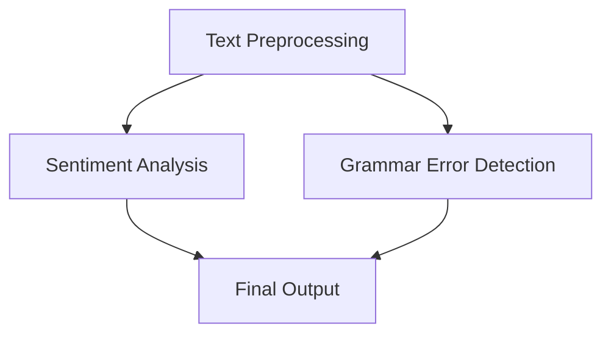
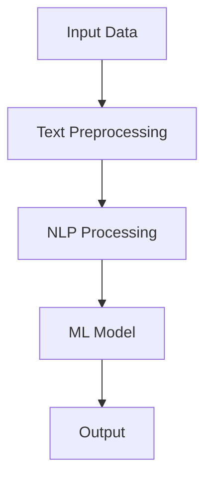

                 

### Introduction to AIGC and Educational Assessment

**Keywords:** AIGC, Educational Assessment, Mind-Chain-Assisted Assignment Grading, Automated Grading, AI in Education

**Abstract:**
This article introduces the concept of Artificial Intelligence in General Computation (AIGC) and its significance in educational assessment. We will delve into the historical context of educational assessment and highlight how AIGC is transforming this domain. The focus will be on the innovative application of AIGC, particularly the Mind-Chain model, in automated assignment grading. The discussion will cover the background, theoretical underpinnings, and practical applications of this cutting-edge technology in education.

### Background of AIGC in Educational Assessment

**Keywords:** AIGC, Educational Assessment, AI Evolution, Educational Needs

The advent of Artificial Intelligence (AI) has sparked a revolution across various industries, and education is no exception. AI has transformed traditional methods of teaching, learning, and assessment. One of the pioneering branches of AI, known as Artificial Intelligence in General Computation (AIGC), has shown immense potential in the realm of educational assessment. AIGC encompasses a wide range of AI techniques, including natural language processing (NLP), machine learning (ML), and deep learning (DL), all aimed at enhancing the efficiency and accuracy of educational processes.

**1.1 Definition and Background of AIGC**

AIGC, or General Computation AI, is an advanced form of AI designed to perform a wide variety of tasks that traditionally require human intelligence. Unlike narrow AI, which is designed for a specific task (e.g., facial recognition or autonomous driving), AIGC is capable of general problem-solving and can adapt to various domains. The core principle of AIGC is to simulate human cognitive processes, enabling it to understand, learn, and apply knowledge in diverse contexts.

The history of AIGC can be traced back to the early days of AI research in the 1950s and 1960s. Initially, AI research focused on developing rule-based systems and expert systems that could mimic human decision-making. However, these approaches were limited by their reliance on explicit rules and the inability to handle complex, ambiguous data. The breakthrough came with the advent of machine learning in the 1980s and 1990s, which allowed AI systems to learn from data and improve their performance over time. With the rise of deep learning in the 21st century, AIGC has reached new heights, enabling unprecedented levels of automation and intelligence.

**1.2 Historical Development of Educational Assessment**

Educational assessment has a long history, dating back to ancient civilizations where teachers evaluated students' knowledge through oral examinations and written tests. Over the centuries, assessment methods have evolved significantly, reflecting advancements in educational theory and technology. In the early 20th century, standardized testing became popular, aiming to measure students' performance objectively and uniformly. However, traditional assessment methods often suffer from several limitations, including subjectivity, time-consuming processes, and limited scope of evaluation.

The rise of AI and AIGC has brought about a new era in educational assessment. Automated assessment systems can process large volumes of data quickly and accurately, reducing the need for human intervention. AI-based tools can analyze students' performance patterns, identify areas of strength and weakness, and provide personalized feedback. This shift from traditional to automated assessment methods is not just a technological upgrade but a fundamental transformation of the educational ecosystem.

**1.3 The Role of AIGC in Modern Education**

AIGC has a profound impact on modern education, particularly in the areas of assessment, personalized learning, and educational resource management. In educational assessment, AIGC enables the development of sophisticated automated grading systems that can evaluate a wide range of assignments, from essays to multiple-choice questions. These systems can not only provide instant feedback but also offer insights into students' learning progress and areas for improvement.

In personalized learning, AIGC can tailor educational content to individual students' needs and learning styles. By analyzing students' performance data, AI systems can recommend specific learning materials and exercises, helping them achieve better learning outcomes. Additionally, AIGC can help educators identify effective teaching strategies and adjust their approaches based on real-time data.

Finally, AIGC plays a crucial role in educational resource management. AI-powered tools can optimize the allocation of resources, such as classroom space, textbooks, and instructional materials, ensuring that they are used efficiently and effectively. This not only improves the overall learning environment but also helps educational institutions make data-driven decisions to enhance educational quality and accessibility.

In summary, AIGC is revolutionizing educational assessment by introducing innovative, efficient, and accurate methods. Its applications in modern education go beyond assessment, encompassing personalized learning, resource management, and beyond. As we delve deeper into the next sections, we will explore the core concepts, architectures, and algorithms that underpin AIGC, providing a comprehensive understanding of this transformative technology in education.

### Core Concepts and Architectures of AIGC

**Keywords:** AIGC Core Concepts, Architectural Frameworks, Mermaid Flowchart, Key Technologies, Algorithms

To understand the inner workings of Artificial Intelligence in General Computation (AIGC), it is essential to grasp its core concepts and architectural frameworks. AIGC is a multifaceted field that integrates various AI techniques, including natural language processing (NLP), machine learning (ML), and deep learning (DL). In this section, we will delve into the fundamental concepts that drive AIGC and explore its architectural frameworks. Additionally, we will highlight key technologies and algorithms that are pivotal to the functioning of AIGC systems.

**2.1 Key Concepts in AIGC**

**1. Natural Language Processing (NLP):**
NLP is a subfield of AI that focuses on the interaction between computers and human language. NLP enables AIGC systems to understand, interpret, and generate human language, facilitating tasks such as text analysis, sentiment analysis, and machine translation. The core concepts in NLP include tokenization, part-of-speech tagging, named entity recognition, and syntactic parsing.

**2. Machine Learning (ML):**
ML is a fundamental technique in AIGC that enables systems to learn from data and make predictions or decisions. ML algorithms can be categorized into supervised learning, unsupervised learning, and reinforcement learning. Supervised learning involves training a model using labeled data, while unsupervised learning focuses on finding patterns in unlabeled data. Reinforcement learning is a type of ML where an agent learns to achieve a goal through trial and error.

**3. Deep Learning (DL):**
DL is a subfield of ML that utilizes neural networks with many layers to learn complex patterns from large datasets. DL has been instrumental in advancing AIGC capabilities, particularly in tasks such as image recognition, natural language processing, and speech recognition. Key concepts in DL include neural networks, convolutional neural networks (CNNs), and recurrent neural networks (RNNs).

**2.2 Architectural Frameworks of AIGC**

The architectural frameworks of AIGC are designed to integrate various AI techniques and enable the system to perform a wide range of tasks. Two prominent architectural frameworks are the Hybrid Architecture and the Pipeline Architecture.

**1. Hybrid Architecture:**
The Hybrid Architecture combines multiple AI techniques, such as NLP, ML, and DL, to leverage their strengths and overcome their limitations. This architecture typically consists of several modules, each specializing in a specific task. For example, an AIGC system for automated essay grading might include modules for text preprocessing, sentiment analysis, and grammatical error detection. The advantage of the Hybrid Architecture is its flexibility and ability to handle complex tasks by integrating different AI techniques.

**Mermaid Flowchart of Hybrid Architecture:**



**2. Pipeline Architecture:**
The Pipeline Architecture is a sequential approach where each module processes the output of the previous module, forming a continuous flow of data. This architecture is well-suited for tasks that involve multiple stages of data processing, such as text classification or speech recognition. The key advantage of the Pipeline Architecture is its simplicity and efficiency, as data flows through the system in a streamlined manner.

**Mermaid Flowchart of Pipeline Architecture:**



**2.3 Key Technologies and Algorithms**

The success of AIGC systems depends on the selection of appropriate technologies and algorithms. Here, we highlight some key technologies and algorithms used in AIGC:

**1. Neural Networks:**
Neural networks are the building blocks of AIGC systems. They consist of interconnected nodes, or neurons, that process and transmit data. Neural networks are particularly effective in tasks such as image recognition, natural language processing, and speech recognition.

**2. Convolutional Neural Networks (CNNs):**
CNNs are specialized neural networks designed for image processing tasks. They use convolutional layers to extract spatial features from images, making them highly effective in tasks such as object detection and image classification.

**3. Recurrent Neural Networks (RNNs):**
RNNs are neural networks designed for sequential data processing tasks, such as natural language processing and time series analysis. They have the ability to maintain information from previous inputs, enabling them to capture temporal dependencies in data.

**4. Generative Adversarial Networks (GANs):**
GANs are a type of neural network that consists of two competing networks, a generator, and a discriminator. The generator creates data, while the discriminator evaluates the generated data's quality. GANs have been used in a variety of applications, including image generation, speech synthesis, and natural language generation.

**5. Reinforcement Learning Algorithms:**
Reinforcement learning algorithms are used in AIGC systems that require decision-making capabilities. Examples of reinforcement learning algorithms include Q-learning, SARSA, and deep Q-networks (DQN). These algorithms enable AIGC systems to learn optimal behaviors by interacting with their environment and receiving feedback.

In summary, AIGC is a complex field that integrates various AI techniques, architectural frameworks, and algorithms to create intelligent systems capable of performing a wide range of tasks. Understanding the core concepts and architectures of AIGC is crucial for developing and implementing effective AIGC solutions in educational assessment and beyond. In the next section, we will delve into the theoretical foundations of the Mind-Chain model, a groundbreaking approach to automated assignment grading.

### Theoretical Foundations of Mind-Chain-Assisted Assignment Grading

**Keywords:** Mind-Chain Model, Automated Assignment Grading, AI Algorithm, Pseudo-code, Mathematical Models, Equations

The Mind-Chain model represents a significant advancement in the field of automated assignment grading within the realm of AIGC. This innovative approach leverages artificial intelligence to simulate human thought processes, enabling the system to provide comprehensive and insightful evaluations of student assignments. In this section, we will delve into the theoretical foundations of the Mind-Chain model, including its principles, underlying mathematical models, and key equations. Additionally, we will present a detailed explanation of the algorithm's working mechanism using pseudo-code to provide a clear understanding of its inner workings.

**3.1 Principles of the Mind-Chain Model**

The Mind-Chain model is based on the principle of mimicking human cognitive processes to analyze and evaluate student assignments. This involves breaking down the assignment into smaller, manageable components and evaluating each component based on predefined criteria. The core principles of the Mind-Chain model can be summarized as follows:

1. **Modular Decomposition:** The assignment is divided into modular components, such as paragraphs, sentences, or keywords, which are then analyzed individually.
2. **Contextual Understanding:** The Mind-Chain model considers the context in which each component exists, taking into account the overall structure and flow of the assignment.
3. **Human-like Evaluation:** The model evaluates each component based on human-like criteria, such as clarity, coherence, accuracy, and creativity.
4. **Adaptive Learning:** The Mind-Chain model continuously learns from new assignments and feedback, improving its evaluation accuracy over time.

**3.1.1 Pseudo-code for Mind-Chain Algorithm**

To illustrate the working mechanism of the Mind-Chain model, we present a simplified pseudo-code that outlines the key steps involved in the automated grading process:

```pseudo
Algorithm MindChainGrading(assignment):
    1. Preprocess assignment: Remove unnecessary formatting, convert to a uniform text format
    2. Tokenize assignment: Split text into paragraphs, sentences, and keywords
    3. Analyze context: Identify the overall structure and flow of the assignment
    4. For each component:
        a. Evaluate clarity: Check for logical consistency and coherence
        b. Evaluate accuracy: Verify facts, figures, and references
        c. Evaluate creativity: Assess originality and innovative ideas
        d. Evaluate grammar: Check for grammatical correctness and style
    5. Generate grade and feedback: Combine evaluations to produce a final grade and detailed feedback
```

**3.2 Mathematical Models and Equations in AIGC**

The Mind-Chain model incorporates several mathematical models and equations to facilitate the evaluation process. These models are designed to capture the essence of human-like evaluation criteria, enabling the algorithm to provide accurate and comprehensive feedback. The following are some key mathematical models and equations used in the Mind-Chain model:

**1. Clarity and Coherence Evaluation**

The clarity and coherence of an assignment are evaluated using the following equation:

$$
Clarity = \frac{1}{N} \sum_{i=1}^{N} (C_i \cdot W_i)
$$

where \( N \) is the number of components, \( C_i \) represents the clarity score of component \( i \), and \( W_i \) is the weight assigned to component \( i \).

**2. Accuracy Evaluation**

The accuracy of an assignment is evaluated using the following equation:

$$
Accuracy = \frac{1}{M} \sum_{j=1}^{M} (A_j \cdot R_j)
$$

where \( M \) is the number of factual statements, \( A_j \) represents the accuracy score of statement \( j \), and \( R_j \) is the reliability score of the reference used for statement \( j \).

**3. Creativity Evaluation**

The creativity of an assignment is evaluated using the following equation:

$$
Creativity = \frac{1}{L} \sum_{k=1}^{L} (C_k \cdot I_k)
$$

where \( L \) is the number of innovative ideas, \( C_k \) represents the creativity score of idea \( k \), and \( I_k \) is the innovation score of idea \( k \).

**4. Grammar Evaluation**

The grammar evaluation is based on the following equation:

$$
Grammar = \frac{1}{P} \sum_{l=1}^{P} (G_l \cdot S_l)
$$

where \( P \) is the number of grammatical errors, \( G_l \) represents the grammar score of error \( l \), and \( S_l \) is the severity score of error \( l \).

**3.2.1 Detailed Explanation of Key Equations**

To further understand the key equations used in the Mind-Chain model, let's delve into their components and how they contribute to the evaluation process:

**1. Clarity and Coherence Evaluation**

The clarity and coherence evaluation equation calculates the average clarity score of each component, weighted by its importance within the assignment. Higher-weighted components contribute more to the overall clarity score, reflecting the importance of maintaining logical consistency throughout the assignment.

**2. Accuracy Evaluation**

The accuracy evaluation equation considers the accuracy of each factual statement, weighted by the reliability of its reference. This ensures that accurate statements with reliable references contribute more to the overall accuracy score, while less reliable references are given less weight.

**3. Creativity Evaluation**

The creativity evaluation equation assesses the originality and innovation of each idea within the assignment. Higher creativity scores are assigned to ideas that demonstrate a significant level of innovation, reflecting the value of creative thinking in educational assessments.

**4. Grammar Evaluation**

The grammar evaluation equation calculates the average impact of each grammatical error, weighted by its severity. This approach ensures that severe grammatical errors have a greater impact on the overall grammar score, while minor errors are given less weight.

**3.2.2 Examples Illustrating Mathematical Models**

To provide a clearer understanding of the mathematical models used in the Mind-Chain model, let's consider a few examples:

**Example 1: Clarity and Coherence Evaluation**

Suppose an assignment consists of three paragraphs. The first paragraph has a clarity score of 0.8 with a weight of 0.3, the second paragraph has a clarity score of 0.9 with a weight of 0.5, and the third paragraph has a clarity score of 0.7 with a weight of 0.2. The overall clarity score can be calculated as follows:

$$
Clarity = \frac{1}{3} \sum_{i=1}^{3} (C_i \cdot W_i) = \frac{1}{3} (0.8 \cdot 0.3 + 0.9 \cdot 0.5 + 0.7 \cdot 0.2) = 0.835
$$

**Example 2: Accuracy Evaluation**

Suppose an assignment contains five factual statements. The first statement is accurate with a reference reliability score of 0.9, the second statement is accurate with a reference reliability score of 0.8, the third statement is incorrect with a reference reliability score of 0.7, and the fourth and fifth statements are accurate with reference reliability scores of 0.6 and 0.5, respectively. The overall accuracy score can be calculated as follows:

$$
Accuracy = \frac{1}{5} \sum_{j=1}^{5} (A_j \cdot R_j) = \frac{1}{5} (0.9 \cdot 0.9 + 0.8 \.

