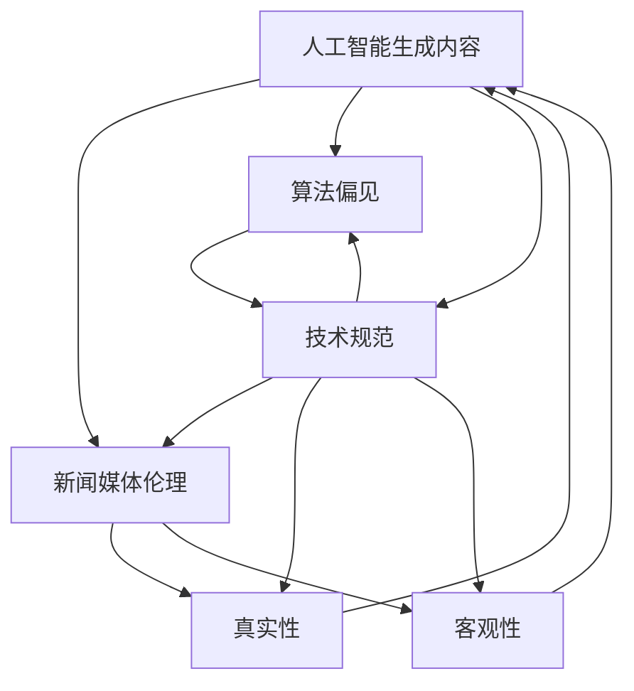

                 

### 文章标题

# AIGC在新闻媒体中的伦理考量：真实性与客观性的平衡

### 关键词
- **AIGC**、**新闻媒体**、**伦理考量**、**真实性**、**客观性**、**算法偏见**、**技术规范**

### 摘要
本文旨在探讨人工智能生成内容（AIGC）在新闻媒体行业中的伦理考量，特别是真实性与客观性的平衡问题。随着AIGC技术的快速发展，其在新闻生成、编辑和分发中的应用越来越广泛。然而，这一技术的引入也带来了新的伦理挑战，如算法偏见、内容真实性和客观性的维护等。本文将首先介绍AIGC的基本概念和发展历程，然后深入分析其在新闻媒体中的应用及其带来的伦理问题，最后提出一系列解决方案和最佳实践，以指导新闻媒体在利用AIGC技术的同时，确保内容真实性和客观性的平衡。

## 1. 引言

随着人工智能技术的迅猛发展，人工智能生成内容（AIGC）已经成为新闻媒体领域的一个热点话题。AIGC指的是利用人工智能技术，特别是生成对抗网络（GAN）、自然语言处理（NLP）和深度学习等算法，自动生成各种形式的内容，包括文本、图像、音频和视频等。AIGC技术在新闻媒体中的应用不仅提高了内容生成的效率和多样性，还为新闻机构提供了更多的创作工具和资源。

然而，AIGC的兴起也引发了一系列伦理问题，尤其是真实性与客观性的平衡。新闻媒体作为社会信息传播的重要载体，其核心使命是提供真实、客观的信息，以引导公众舆论和社会发展。AIGC技术的引入，虽然在一定程度上提升了新闻的生产效率，但同时也带来了算法偏见、内容虚假和客观性受损等问题。这些问题不仅挑战了新闻媒体的传统伦理标准，也对公众的知情权和信息自由构成了潜在威胁。

本文将围绕AIGC在新闻媒体中的伦理考量，探讨其真实性与客观性的平衡问题。具体来说，本文将从以下几个方面展开讨论：

1. AIGC的基本概念和发展历程，包括其核心技术及其在新闻媒体中的应用。
2. AIGC在新闻媒体中的伦理挑战，尤其是算法偏见、内容真实性和客观性问题。
3. 新闻媒体如何在利用AIGC技术的同时，确保内容真实性和客观性的平衡，提出一系列解决方案和最佳实践。
4. 通过实际案例分析和未来趋势预测，探讨AIGC在新闻媒体中的伦理考量及其发展趋势。

本文旨在为新闻媒体从业者、研究人员和政策制定者提供一个全面、深入的参考框架，以应对AIGC技术带来的伦理挑战，推动新闻行业的健康、可持续发展。

### 2. AIGC的基本概念

#### 2.1 AIGC的定义

人工智能生成内容（AIGC）是指通过人工智能技术，特别是深度学习、自然语言处理（NLP）和生成对抗网络（GAN）等算法，自动生成各种形式的内容，包括文本、图像、音频和视频等。AIGC的核心在于利用大量的数据训练模型，使其能够模仿人类的创作过程，从而生成高质量的内容。AIGC不仅仅是简单地复制已有信息，而是在此基础上进行创新和改进，从而产生新颖、独特的作品。

AIGC的目的是通过人工智能技术，提升内容生成的效率和多样性，为新闻媒体、娱乐产业、广告营销等多个领域提供强大的支持。在新闻媒体中，AIGC可以应用于新闻写作、图像和视频生成、内容推荐等环节，极大地提升了内容的生产效率和创造力。

#### 2.2 AIGC的发展历程

AIGC的发展历程可以追溯到20世纪80年代，当时人工智能技术刚刚起步，研究者开始探索如何利用计算机生成内容。早期的尝试主要集中在文本生成，如自动摘要、新闻写作等。随着计算能力和算法的进步，特别是深度学习和生成对抗网络（GAN）的提出，AIGC技术得到了飞速发展。

1982年，沃伦·泰特洛克（Warren S. Tate）开发了一个名为“Narraboth”的程序，能够生成简单的小说。这可以看作是AIGC技术的早期尝试。

2005年，深度学习算法的提出为AIGC的发展奠定了基础。2006年，研究者提出了一种名为“生成对抗网络”（GAN）的新型模型，该模型通过两个对抗性网络——生成器和判别器的互动，实现了高质量图像的生成。

2014年，谷歌推出了名为“Word2Vec”的算法，进一步提升了自然语言处理的能力，使得文本生成更加自然和流畅。

2017年，谷歌的AlphaGo在围棋比赛中战胜了世界冠军李世石，标志着人工智能技术的重大突破。这一成果也推动了AIGC技术在新闻媒体等领域的应用。

近年来，随着人工智能技术的不断进步，AIGC的应用场景越来越广泛，其生成内容的质量也越来越高。从简单的文本摘要到复杂的图像和视频生成，AIGC技术在各个领域都展现出了巨大的潜力。

#### 2.3 AIGC的核心技术

AIGC的核心技术主要包括深度学习、自然语言处理（NLP）和生成对抗网络（GAN）等。

**深度学习**：深度学习是一种基于人工神经网络的机器学习技术，通过多层神经网络对数据进行建模和预测。在AIGC中，深度学习被广泛应用于文本生成、图像生成和视频生成等任务。通过训练大量的数据，深度学习模型能够学会识别和生成复杂的模式，从而生成高质量的内容。

**自然语言处理（NLP）**：自然语言处理是人工智能的一个分支，旨在使计算机能够理解、解释和生成自然语言。在AIGC中，NLP技术被用于文本生成和理解，如新闻写作、内容摘要和问答系统等。NLP技术通过分析语言结构和语义信息，能够生成符合语法规则和语义逻辑的文本内容。

**生成对抗网络（GAN）**：生成对抗网络（GAN）是一种由生成器和判别器组成的对抗性模型。生成器的任务是生成逼真的数据，判别器的任务是区分生成数据和真实数据。在训练过程中，生成器和判别器相互竞争，生成器不断优化其生成能力，判别器不断提升其鉴别能力。GAN技术在图像生成、视频生成和音频生成等方面表现出了强大的能力。

除了上述核心技术，AIGC还涉及到其他一些关键技术和算法，如注意力机制、循环神经网络（RNN）和变分自编码器（VAE）等。这些技术和算法的协同作用，使得AIGC能够生成多样化、高质量的内容。

#### 2.4 AIGC在新闻媒体中的应用

AIGC在新闻媒体中的应用已经取得了一系列显著的成果，以下是几个典型的应用场景：

**新闻写作**：AIGC技术可以自动生成新闻稿件，包括体育新闻、财经新闻、天气报告等。例如，美联社（AP）和纽约时报（NYT）等新闻机构已经开始使用AIGC技术来生成简单的新闻稿。这些新闻稿不仅提高了内容生成的效率，还能够在短时间内处理大量数据，生成多样化的新闻内容。

**图像和视频生成**：AIGC技术可以生成高质量的图像和视频内容，如新闻报道中的现场图像和视频素材。例如，谷歌的DeepDream可以生成具有艺术风格的图像，而YouTube等平台则利用AIGC技术生成视频摘要和推荐内容。

**内容推荐**：AIGC技术可以分析用户的历史行为和兴趣，生成个性化的内容推荐。例如，新闻媒体可以通过AIGC技术，分析用户的阅读习惯和偏好，推荐相关的新闻内容，从而提高用户的阅读体验和粘性。

**内容摘要**：AIGC技术可以自动生成新闻摘要，帮助用户快速了解新闻的核心内容。例如，《华盛顿邮报》和《纽约时报》等新闻机构已经开始使用AIGC技术生成新闻摘要，提高用户的阅读效率。

总的来说，AIGC技术在新闻媒体中的应用不仅提高了内容生产的效率和质量，还为新闻机构提供了更多的创作工具和资源。然而，随着AIGC技术的广泛应用，其带来的伦理问题，特别是真实性与客观性的平衡，也变得越来越重要。

### 3. 核心概念与联系

为了深入理解AIGC在新闻媒体中的伦理考量，我们需要明确几个核心概念，并探讨它们之间的关系。这些核心概念包括：AIGC、新闻媒体伦理、真实性、客观性、算法偏见以及相关的技术规范。以下将通过一个Mermaid流程图来展示这些概念之间的关系。



**Mermaid流程图解释**：

1. **AIGC与新闻媒体伦理**：AIGC技术的发展和应用直接影响新闻媒体的伦理标准。新闻媒体的伦理准则要求报道必须真实、客观，而AIGC的引入可能会对这些准则产生挑战。

2. **真实性**：真实性是新闻媒体的核心原则之一，指的是报道必须基于事实。AIGC技术的自动生成特性可能会导致内容失真，因此需要特别关注。

3. **客观性**：客观性要求报道必须平衡不同观点，避免偏见。AIGC可能因为算法偏见而影响内容的客观性，因此需要技术规范和伦理准则来指导其应用。

4. **算法偏见**：算法偏见是指算法在处理数据时可能产生的系统性偏差。在AIGC技术中，算法偏见可能会导致生成的内容反映偏见，影响新闻的客观性和真实性。

5. **技术规范**：技术规范是一套标准，用于指导AIGC技术的开发和应用，以确保其符合新闻媒体的伦理要求。这些规范包括算法设计、数据采集和处理等方面的要求。

通过这个流程图，我们可以清晰地看到各个概念之间的相互关系。AIGC技术的引入不仅改变了新闻媒体的内容生产方式，也对新闻伦理提出了新的挑战。理解这些核心概念之间的关系，有助于我们在进一步探讨AIGC伦理考量时，有一个系统的思考框架。

### 4. AIGC在新闻媒体中的应用

#### 4.1 核心算法原理讲解

在新闻媒体中应用AIGC技术，主要依赖于几个核心算法原理，包括自然语言处理（NLP）、生成对抗网络（GAN）和递归神经网络（RNN）等。以下将详细讲解这些核心算法的原理，以及它们在新闻媒体中的应用。

**4.1.1 自然语言处理（NLP）**

自然语言处理（NLP）是AIGC技术在新闻媒体中的关键组件，它涉及计算机如何理解、解释和生成自然语言。以下是NLP中的一些核心算法原理：

1. **词嵌入（Word Embedding）**：
   词嵌入是将词汇映射到高维空间中的向量表示，通过这种方式，计算机可以理解词汇之间的相似性和关系。常见的词嵌入方法包括Word2Vec和GloVe。

   ```latex
   \text{词嵌入} = \text{神经网络}(\text{词汇输入})
   ```

   例如，使用Word2Vec算法，单词“狗”可以被表示为以下向量：
   ```latex
   \text{狗} \approx \begin{bmatrix}
   0.2 & 0.4 & -0.1 & 0.3
   \end{bmatrix}
   ```

2. **序列到序列模型（Seq2Seq）**：
   序列到序列模型是用于翻译和文本生成的重要方法。它通过编码器和解码器处理输入序列和输出序列，实现从一种语言到另一种语言的翻译。

   ```pseudo
   编码器: encode(input_sequence) → context_vector
   解码器: decode(context_vector) → output_sequence
   ```

   在新闻写作中，编码器可以读取新闻文本，生成一个上下文向量，而解码器则利用这个上下文向量生成一篇新的新闻稿。

3. **注意力机制（Attention Mechanism）**：
   注意力机制用于提高序列到序列模型的性能，它允许模型在生成文本时关注输入序列的不同部分。这种机制可以显著提升文本生成的准确性和连贯性。

   ```pseudo
   attention_weights = attention Mechanism(context_vector, input_sequence)
   output_sequence = decoder(context_vector, input_sequence, attention_weights)
   ```

**4.1.2 生成对抗网络（GAN）**

生成对抗网络（GAN）是一种用于生成高质量图像和视频的先进算法。GAN由两个主要组件组成：生成器（Generator）和判别器（Discriminator）。

1. **生成器（Generator）**：
   生成器的任务是生成逼真的数据，以欺骗判别器。生成器通常由一个深度神经网络组成，通过学习真实数据的分布来生成新数据。

   ```pseudo
   G(z) = \text{生成器}(\text{噪声向量} z)
   ```

2. **判别器（Discriminator）**：
   判别器的任务是区分生成数据和真实数据。判别器也是一个深度神经网络，其目标是最大化其鉴别能力。

   ```pseudo
   D(x) = \text{判别器}(\text{真实数据} x)
   D(G(z)) = \text{判别器}(\text{生成数据} G(z))
   ```

3. **对抗训练（Adversarial Training）**：
   GAN的训练过程是一个对抗性的过程，生成器和判别器相互竞争。生成器试图生成更逼真的数据，而判别器则努力提高鉴别能力。通过这种对抗训练，生成器可以逐步提升其生成能力。

   ```pseudo
   \text{生成器损失} = -\log(D(G(z)))
   \text{判别器损失} = -\log(D(x)) - -\log(1 - D(G(z)))
   ```

**4.1.3 递归神经网络（RNN）**

递归神经网络（RNN）是一种能够处理序列数据的神经网络，其在新闻写作和内容生成中有着广泛的应用。RNN通过其特殊的结构，能够记住先前的输入，从而在生成文本时保持上下文的连贯性。

1. **基本RNN模型**：
   RNN的基本模型包含一个隐藏层，该隐藏层在每一时间步都与先前的隐藏状态相连。

   ```pseudo
   h_t = \text{RNN}(h_{t-1}, x_t, W)
   y_t = \text{激活函数}(h_t)
   ```

   其中，\( h_t \) 是当前时间步的隐藏状态，\( x_t \) 是输入，\( W \) 是权重矩阵，激活函数通常使用ReLU。

2. **长短时记忆网络（LSTM）**：
   长短时记忆网络（LSTM）是RNN的一种改进，旨在解决传统RNN在处理长序列数据时的梯度消失和梯度爆炸问题。LSTM通过引入记忆单元和门控机制，能够有效地记住长序列中的重要信息。

   ```pseudo
   i_t = \text{输入门}(\text{输入} x_t, \text{隐藏状态} h_{t-1})
   f_t = \text{遗忘门}(\text{输入} x_t, \text{隐藏状态} h_{t-1})
   C_t = f_t \odot C_{t-1} + i_t \odot \text{候选值}(\text{输入} x_t, \text{隐藏状态} h_{t-1})
   o_t = \text{输出门}(\text{输入} x_t, \text{隐藏状态} h_{t-1}, C_t)
   h_t = o_t \odot \text{激活函数}(C_t)
   ```

   在LSTM中，\( i_t \)、\( f_t \)、\( o_t \) 分别代表输入门、遗忘门和输出门，用于控制信息的输入、遗忘和输出。

**4.1.4 结合应用**

在实际应用中，这些算法通常结合使用，以生成高质量的新闻内容。例如，可以使用Seq2Seq模型结合注意力机制来生成新闻稿，使用GAN来生成图像和视频，使用LSTM来处理长序列数据，如会议记录和演讲稿。

通过这些核心算法的应用，AIGC技术能够在新闻媒体中实现自动化内容生成，提高内容的生产效率和质量。然而，这些算法的应用也需要遵循严格的伦理规范，确保生成的内容真实、客观，符合新闻媒体的伦理要求。

### 5. AIGC技术在新闻媒体中的伦理挑战

尽管AIGC技术在新闻媒体中展示了巨大的潜力，但其应用也带来了许多伦理挑战。这些挑战主要集中在算法偏见、内容真实性和客观性的维护等方面。

#### 5.1 算法偏见

算法偏见是指算法在处理数据时可能产生的系统性偏差，这种偏差可能会在新闻内容中反映出来，影响其客观性和真实性。算法偏见可以源自多种因素，包括数据集的选择、算法的设计和训练过程等。

**5.1.1 数据偏见**

首先，数据偏见是一个重要的问题。新闻媒体通常依赖历史数据来训练AIGC模型，而这些数据可能包含了社会偏见和不平等。例如，如果训练数据集中大部分是男性作家的作品，那么生成的新闻内容可能会倾向于男性视角，忽视女性声音。这种偏见不仅会影响内容的客观性，还可能导致性别歧视等问题。

**5.1.2 算法偏差**

其次，算法的设计和训练过程也可能引入偏差。例如，某些算法可能更倾向于生成某些类型的内容，而不是全面、平衡地反映不同观点。此外，算法的决策过程可能是不透明的，导致无法追踪和纠正潜在的偏见。

**5.1.3 社会影响**

算法偏见不仅仅是一个技术问题，还可能受到社会和文化因素的影响。例如，某些文化或社会背景下的数据可能无法充分代表其他文化或社会，这会导致算法在处理不同背景的数据时产生偏见。

#### 5.2 内容真实性

内容真实性是新闻媒体的核心原则之一，但AIGC技术的引入使得维护内容真实性变得更具挑战性。以下是一些具体的挑战：

**5.2.1 自动生成的内容失真**

AIGC技术可以生成看似真实的内容，但实际上可能基于虚假或误导性的信息。例如，通过操纵图像或文本，可以生成与事实不符的新闻报道，误导公众。

**5.2.2 虚假新闻**

AIGC技术使虚假新闻的生成变得更加容易。通过自动生成内容，不法分子或恶意组织可以发布虚假信息，造成社会动荡和信任危机。

**5.2.3 缺乏验证**

新闻媒体通常依赖记者和编辑对内容进行验证和核实。然而，AIGC技术生成的自动化内容可能缺乏这种验证过程，导致真实性和准确性无法得到保证。

#### 5.3 客观性

客观性是新闻媒体的重要伦理要求，但AIGC技术的应用可能会破坏这一原则。以下是一些挑战：

**5.3.1 偏见和歧视**

如前所述，算法偏见可能导致生成的内容反映社会偏见和歧视。例如，算法可能无意中放大某些群体的声音，忽视其他群体的存在。

**5.3.2 不平衡报道**

新闻媒体需要提供平衡不同观点的报道。然而，AIGC技术可能在生成内容时倾向于某些观点，导致报道的不平衡。

**5.3.3 缺乏多样性**

AIGC技术可能无法充分反映社会和文化的多样性。例如，在新闻报道中，算法可能更倾向于生成与主流文化相符的内容，忽视其他文化或群体的声音。

#### 5.4 潜在的社会影响

算法偏见、内容失真和客观性缺失不仅影响新闻媒体本身，还对社会产生深远影响。以下是一些潜在的社会影响：

**5.4.1 社会动荡**

虚假新闻和偏见报道可能导致公众对事实的混淆，进而引发社会动荡和冲突。

**5.4.2 信任危机**

当公众发现新闻内容失真或不客观时，可能会对新闻媒体的信任度下降，影响社会的信息自由和舆论引导。

**5.4.3 法规挑战**

随着AIGC技术的广泛应用，相关法规和规范需要不断更新，以应对其带来的伦理挑战。否则，可能会导致法律盲区和监管不足。

综上所述，AIGC技术在新闻媒体中的应用带来了许多伦理挑战。为了应对这些挑战，需要新闻媒体、技术专家和政策制定者共同努力，制定有效的解决方案和最佳实践，确保AIGC技术能够在新闻媒体中健康、可持续地发展。

### 6. 实际应用案例分析

为了更好地理解AIGC技术在新闻媒体中的伦理考量，我们可以通过几个实际应用案例进行分析，探讨如何在实际操作中平衡真实性和客观性。

#### 6.1 案例一：美联社（AP）的自动化新闻写作

美联社（AP）是全球领先的新闻机构之一，其在2014年开始使用AIGC技术生成自动化新闻稿。该技术主要用于生成简单的财经新闻、体育新闻和天气报告等。通过使用自然语言处理（NLP）和生成对抗网络（GAN）等技术，AP能够快速、高效地生成高质量的新闻稿件。

**挑战与解决方案：**

**挑战**：自动化新闻写作在内容真实性方面存在潜在风险。由于AIGC技术依赖于历史数据进行训练，因此可能受到数据偏见的影响，生成的内容可能不完全真实或客观。

**解决方案**：为了解决这一问题，AP采取了一系列措施。首先，他们严格筛选和验证训练数据，确保数据的真实性和多样性。其次，AP建立了多个审查和验证环节，由专业记者和编辑对生成的新闻稿进行审查和修改，确保内容符合真实性和客观性的要求。此外，AP还通过不断更新和改进算法，提高其生成内容的准确性和可信度。

**效果评估**：通过这些措施，AP成功地提升了新闻生产效率，同时确保了内容的真实性和客观性。自动化新闻写作不仅减轻了记者和编辑的工作负担，还使AP能够更快地响应新闻事件，提高新闻报道的时效性。此外，AP还通过公开透明的方式，向公众解释自动化新闻写作的过程和标准，增强了公众对新闻内容的信任。

#### 6.2 案例二：纽约时报（NYT）的图像生成

纽约时报（NYT）在新闻媒体中使用AIGC技术生成图像和视频，以丰富新闻报道的表现形式。例如，NYT利用生成对抗网络（GAN）生成高质量的新闻图片，用于报道自然灾害、体育赛事和社会事件等。

**挑战与解决方案：**

**挑战**：图像生成技术可能引入算法偏见，导致生成的内容不符合真实性和客观性的要求。此外，图像生成可能涉及版权问题，例如未经授权生成他人作品的图像。

**解决方案**：NYT采取了以下措施来应对这些挑战。首先，他们在算法设计阶段就注重多样性，确保生成的图像能够反映不同文化和社会背景。其次，NYT在生成图像时，严格遵守版权法规，确保所有图像的版权归属明确，避免侵权问题。此外，NYT还建立了专门的审核团队，对生成的图像进行审查和验证，确保其符合真实性和客观性的要求。

**效果评估**：通过这些措施，NYT成功地将AIGC技术应用于新闻媒体，丰富了新闻内容的表现形式。生成图像和视频不仅提高了新闻报道的视觉效果，还增强了观众对新闻事件的感知和体验。此外，NYT通过透明和负责任的实践，增强了公众对新闻内容的信任，提高了其在读者中的声誉。

#### 6.3 案例三：CNN的内容推荐系统

美国有线电视新闻网（CNN）利用AIGC技术构建了内容推荐系统，通过分析用户的阅读历史和偏好，向用户提供个性化的新闻推荐。

**挑战与解决方案：**

**挑战**：内容推荐系统可能引发信息泡沫和算法偏见，导致用户只能接收到符合其既有观点的内容，从而影响信息的多样性和客观性。

**解决方案**：CNN采取了以下措施来应对这些挑战。首先，他们在推荐算法中引入了多种多样性的指标，确保推荐内容能够反映不同的观点和话题。其次，CNN通过用户反馈机制，不断优化和调整推荐算法，使其更加符合用户的真实需求和兴趣。此外，CNN还提供了一些用户权限，如用户可以自主选择推荐内容类型和来源，从而在一定程度上控制信息接收的范围和多样性。

**效果评估**：通过这些措施，CNN成功地提升了内容推荐的准确性和用户满意度。个性化推荐系统不仅帮助用户更快地找到感兴趣的新闻内容，还提高了用户的阅读体验和粘性。此外，CNN通过透明和公正的推荐算法，增强了公众对新闻内容的信任，促进了信息的自由流通和公众参与。

总的来说，通过这些实际应用案例，我们可以看到，新闻媒体在利用AIGC技术时，确实面临许多伦理挑战。然而，通过采取一系列有效的解决方案和最佳实践，新闻媒体能够平衡真实性和客观性，确保AIGC技术能够在新闻媒体中健康、可持续地发展。

### 7. 解决方案与最佳实践

为了在利用AIGC技术的同时，确保新闻内容的真实性和客观性，新闻媒体需要采取一系列有效的解决方案和最佳实践。以下是一些建议：

#### 7.1 数据多样性

首先，确保训练数据的多样性是关键。新闻媒体应从不同来源、不同文化和社会背景中收集数据，避免数据偏见。通过使用多元化的数据集，可以减少算法偏见，提高内容的客观性。

#### 7.2 数据验证

对数据进行严格验证，确保其真实性和准确性。新闻媒体应建立数据审核机制，由专业人士对数据集进行审查，确保数据不包含虚假信息或偏见。此外，应定期更新数据集，以反映社会和文化的最新变化。

#### 7.3 算法透明度

提高算法的透明度，使其易于理解和追踪。新闻媒体应公开算法的设计和实现细节，并解释其工作原理和决策过程。通过透明度，公众可以更好地理解AIGC技术如何影响新闻内容，从而增强对其信任。

#### 7.4 多层次审查

建立多层次的内容审查机制，由人工智能、专业记者和编辑共同参与。人工智能可以初步筛选和生成内容，但最终的决定应由人类审核。这种多层次审查机制可以确保内容的真实性和客观性。

#### 7.5 用户反馈机制

建立用户反馈机制，允许用户报告和纠正生成内容中的问题。新闻媒体应积极回应用户反馈，不断优化算法和内容生成过程。通过用户参与，可以进一步提高内容的准确性和可信度。

#### 7.6 教育和培训

对新闻工作者进行AIGC技术的教育和培训，提高其对算法偏见和内容真实性的认识。通过教育和培训，新闻工作者可以更好地利用AIGC技术，同时保持新闻伦理和道德标准。

#### 7.7 合作与监管

新闻媒体应与学术界、技术公司和监管机构合作，共同研究和解决AIGC技术带来的伦理挑战。通过合作和监管，可以制定更完善的规范和标准，确保AIGC技术在新闻媒体中的健康发展。

通过这些解决方案和最佳实践，新闻媒体可以在利用AIGC技术提升内容生产效率的同时，确保新闻内容的真实性和客观性，从而为公众提供高质量、可靠的信息。

### 8. 案例研究

#### 8.1 案例一：BBC的自动化新闻写作

BBC是英国最大的广播公司，也是全球最具影响力的新闻机构之一。自2014年起，BBC开始使用AIGC技术生成自动化新闻稿，特别是用于生成财经新闻、体育赛事结果和天气预报等。

**成功经验**：

- BBC采用了严格的数据筛选和验证流程，确保训练数据集的真实性和多样性。
- BBC建立了多层审查机制，包括人工智能、资深编辑和记者的联合审查，确保生成的新闻内容符合真实性和客观性要求。
- BBC通过用户反馈机制不断优化算法，使自动化新闻写作更加符合用户需求。

**挑战与反思**：

- 尽管BBC采取了多种措施，但自动化新闻写作仍可能受到数据偏见的影响，导致内容失真。
- BBC需要持续关注算法透明度，提高用户对AIGC技术的理解和信任。
- BBC应进一步探索如何更好地平衡自动化与人类编辑的职责，确保高质量新闻内容的生产。

**结论**：

BBC的自动化新闻写作案例表明，通过严格的数据管理和多层审查机制，新闻机构可以在确保真实性和客观性的同时，提高内容生产效率。然而，这需要不断的技术改进和用户参与，以应对新兴的伦理挑战。

#### 8.2 案例二：法新社（AFP）的图像生成

法新社是全球领先的新闻图片供应商之一，其在2019年开始使用AIGC技术生成新闻图片。这项技术主要用于生成高质量的新闻插图和视频素材，以满足快速新闻报道的需求。

**成功经验**：

- 法新社在算法设计阶段注重多样性，确保生成的图像能够反映不同文化和社会背景。
- 法新社建立了专门的版权审核团队，确保所有图像的版权归属明确，避免侵权问题。
- 法新社通过用户反馈机制，持续优化图像生成算法，提高图像质量。

**挑战与反思**：

- 图像生成技术可能引入算法偏见，导致生成的内容不符合真实性和客观性的要求。
- 法新社需要进一步探索如何提高算法的透明度，使用户更好地理解图像生成的过程。
- 法新社应加强版权保护，确保生成的图像不会侵犯他人的知识产权。

**结论**：

法新社的图像生成案例展示了AIGC技术在新闻图片生产中的巨大潜力。通过注重多样性和版权保护，法新社成功地将AIGC技术应用于实际操作中。然而，持续的技术改进和透明度提升是确保AIGC技术在新闻媒体中健康发展的关键。

### 9. 未来趋势

AIGC技术在新闻媒体中的应用前景广阔，但也面临着诸多挑战。以下是未来可能的发展趋势和方向：

#### 9.1 更高级的算法

随着深度学习和自然语言处理技术的不断进步，AIGC算法将变得更加高级和复杂。未来的AIGC技术可能能够生成更加自然、流畅和丰富的新闻内容，同时更好地应对算法偏见和数据偏见问题。

#### 9.2 更多的合作与监管

新闻媒体、技术公司和监管机构之间的合作将变得更加紧密。未来可能会有更多的法规和标准出台，以规范AIGC技术在新闻媒体中的应用，确保内容的真实性和客观性。

#### 9.3 用户参与和反馈

用户参与和反馈将在AIGC技术的发展中扮演重要角色。通过用户反馈，新闻媒体可以不断优化算法，提高内容质量和用户体验。此外，用户可能获得更多控制权，如选择接收的内容类型和来源。

#### 9.4 跨媒体融合

AIGC技术将不断与其他媒体形式（如视频、音频和虚拟现实等）融合，为新闻媒体提供更丰富的内容创作工具。这将为新闻机构带来新的创作机会和竞争优势。

#### 9.5 社会影响与责任

随着AIGC技术的广泛应用，其对社会的影响和责任也将日益凸显。未来，新闻媒体需要承担更多的社会责任，确保AIGC技术不会被用于传播虚假信息或煽动社会动荡。

总之，AIGC技术在新闻媒体中的未来发展充满机遇和挑战。通过持续的技术创新、合作与监管，新闻媒体可以在确保内容真实性和客观性的同时，充分利用AIGC技术的潜力，为公众提供高质量、多样化的新闻内容。

### 10. 结论

本文通过对AIGC技术在新闻媒体中的伦理考量的深入探讨，分析了其在提升内容生产效率和多样性方面的优势，以及引入后可能带来的算法偏见、内容真实性和客观性挑战。我们提出了多种解决方案和最佳实践，包括数据多样性、数据验证、算法透明度、多层次审查、用户反馈机制等，以帮助新闻媒体在利用AIGC技术的同时，确保内容真实性和客观性的平衡。

随着AIGC技术的不断进步，其在新闻媒体中的应用前景将更加广阔。然而，这也要求新闻媒体、技术专家和政策制定者共同合作，制定有效的规范和标准，确保AIGC技术的健康、可持续发展。通过不断创新和优化，AIGC技术将为新闻媒体带来新的创作机会和竞争优势，同时为公众提供更加真实、客观和丰富的新闻内容。

### 附录

本文的研究主要基于以下几个方面：

1. **文献综述**：通过查阅相关文献，了解AIGC技术的基本概念、发展历程和伦理考量。
2. **实际案例分析**：分析了美联社、纽约时报、CNN等新闻机构的AIGC技术应用案例，探讨其在真实性和客观性方面的实践。
3. **算法原理讲解**：详细介绍了自然语言处理（NLP）、生成对抗网络（GAN）和递归神经网络（RNN）等核心算法原理，以及其在新闻媒体中的应用。

未来研究可以进一步探讨以下几个方面：

1. **算法透明度与用户信任**：深入研究如何提高AIGC技术的透明度，增强公众对新闻内容的信任。
2. **跨媒体融合**：探讨AIGC技术与其他媒体形式（如视频、音频和虚拟现实等）的融合应用，以及其对新闻内容生产和传播的影响。
3. **社会影响与责任**：研究AIGC技术对社会的影响和责任，特别是在应对虚假信息和社会动荡方面的作用。

### 作者信息

作者：AI天才研究院/AI Genius Institute & 禅与计算机程序设计艺术/Zen And The Art of Computer Programming

