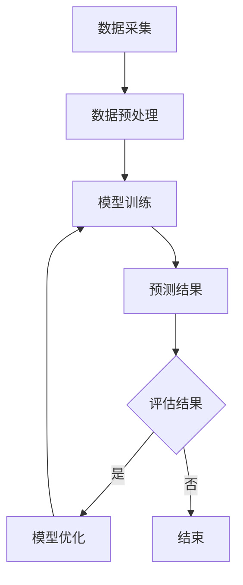
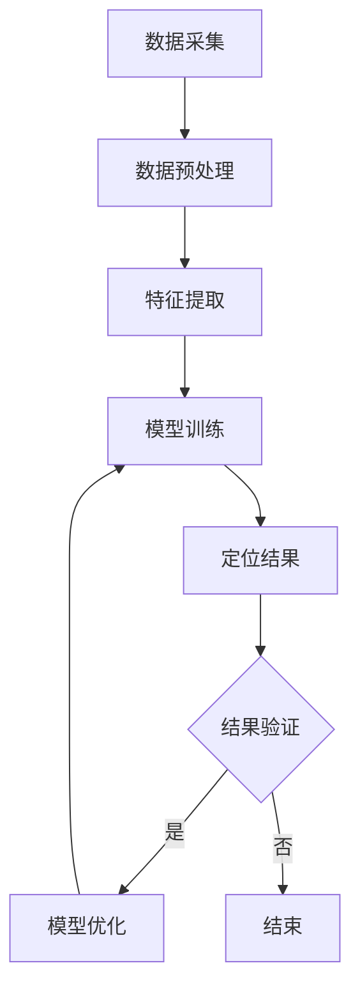
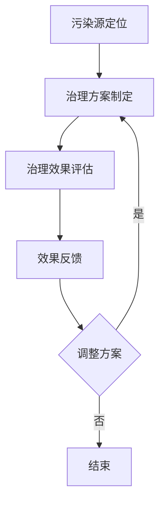

                 


### 文章标题：AIGC在智慧城市空气质量优化中的应用：精准污染源控制

### 关键词：
- AIGC
- 智慧城市
- 空气质量优化
- 精准污染源控制
- 人工智能

### 摘要：
本文深入探讨了AIGC（人工智能生成内容）在智慧城市空气质量优化中的应用，特别是如何通过精准污染源控制来改善空气质量。文章首先介绍了AIGC的基础概念和智慧城市的结构，随后分析了精准污染源控制的关键技术，以及AIGC在空气质量预测、污染源定位和治理中的具体应用。通过实际案例解析和项目实战，文章展示了AIGC在智慧城市空气质量优化中的优势与挑战，并提出了未来发展的趋势和最佳实践建议。

### 目录大纲

## 第1章: AIGC概述与智慧城市

### 1.1 AIGC的定义与核心概念
- AIGC的起源与发展
- AIGC的主要应用领域
- AIGC的关键技术

### 1.2 AIGC在智慧城市中的应用价值
- 智慧城市的概念与构成
- AIGC在智慧城市中的应用场景
- AIGC对智慧城市的贡献

## 第2章: 智慧城市与空气质量监测

### 2.1 智慧城市概述
- 智慧城市的定义与特征
- 智慧城市的主要功能

### 2.2 空气质量监测的挑战与需求
- 空气质量监测的现状与挑战
- 智慧城市对空气质量监测的需求

## 第3章: 精准污染源控制原理与技术

### 3.1 精准污染源控制的定义与目标
- 精准污染源控制的定义
- 精准污染源控制的目标

### 3.2 精准污染源控制的关键技术
- 数据收集与处理
- 污染源定位
- 污染源治理

## 第4章: AIGC在空气质量优化中的应用

### 4.1 AIGC在空气质量预测中的应用
- 预测模型的构建
- 预测算法的实现

### 4.2 AIGC在污染源定位中的应用
- 污染源定位的挑战
- AIGC在定位中的优势

### 4.3 AIGC在污染源治理中的应用
- 治理方案的制定
- 治理效果的评估

## 第5章: AIGC应用案例解析

### 5.1 案例一：某城市空气质量优化实践
- 案例背景与目标
- 案例实施过程

### 5.2 案例二：AIGC在其他智慧城市项目中的应用
- 案例背景与目标
- 案例实施过程

## 第6章: AIGC在空气质量优化中的优势与挑战

### 6.1 AIGC的优势分析
- 数据处理能力
- 模型优化能力
- 个性化定制能力

### 6.2 AIGC在空气质量优化中的挑战
- 数据隐私问题
- 模型解释性问题
- 可持续性挑战

### 6.3 未来发展趋势
- 技术演进方向
- 政策法规影响
- 行业应用前景

## 第7章: AIGC应用开发实践

### 7.1 开发环境搭建
- 开发工具选择
- 开发环境配置

### 7.2 数据准备与处理
- 数据来源
- 数据预处理方法

### 7.3 应用案例分析
- 案例一：空气质量预测
- 案例二：污染源定位

### 7.4 源代码解读与分析
- 源代码结构
- 关键算法解读

### 7.5 代码应用解读与分析
- 实际应用场景
- 应用效果评估

### 7.6 实际案例分析和详细讲解剖析
- 案例一：空气质量优化实践
- 案例二：其他智慧城市项目应用

### 7.7 项目小结
- 经验总结
- 注意事项

### 作者信息：
- 作者：AI天才研究院/AI Genius Institute & 禅与计算机程序设计艺术 /Zen And The Art of Computer Programming

### 第1章: AIGC概述与智慧城市

#### 1.1 AIGC的定义与核心概念

AIGC，全称人工智能生成内容（Artificial Intelligence Generated Content），是指通过人工智能技术，尤其是深度学习和自然语言处理（NLP）等算法，生成人类可理解的内容。AIGC的起源可以追溯到20世纪80年代，随着计算机科学和人工智能技术的不断发展，AIGC逐渐成为研究的热点。如今，AIGC已经在文本、图像、音频等多种形式的内容生成中得到了广泛应用。

AIGC的核心概念包括以下几个方面：

1. **数据驱动**：AIGC依赖于大量数据进行训练，通过学习数据中的模式和规律，生成新的内容。
2. **模型优化**：AIGC利用深度学习模型，通过不断优化模型参数，提高生成内容的质量。
3. **多样性生成**：AIGC能够生成多样化、个性化的内容，满足不同用户的需求。
4. **交互性**：AIGC可以与用户进行交互，根据用户的反馈调整生成的内容。

#### 1.2 AIGC在智慧城市中的应用价值

智慧城市（Smart City）是指通过信息通信技术（ICT）手段，实现城市资源智能化配置、城市服务智能化提供和城市治理智能化管理的一种新型城市发展模式。智慧城市的核心在于利用大数据、云计算、物联网、人工智能等技术，实现城市管理的精细化、智能化和可持续发展。

AIGC在智慧城市中的应用价值主要体现在以下几个方面：

1. **城市管理优化**：AIGC可以生成智能化的城市管理策略，提高城市管理效率和决策水平。
2. **公共服务提升**：AIGC可以生成个性化的公共服务内容，提升居民的生活质量和服务体验。
3. **城市安全增强**：AIGC可以用于城市安全监控和预警，提高城市安全水平。
4. **城市环境改善**：AIGC可以用于城市环境监测和污染源控制，改善城市环境质量。

### 第2章: 智慧城市与空气质量监测

#### 2.1 智慧城市概述

智慧城市是一种新型的城市发展模式，旨在通过信息通信技术（ICT）手段，实现城市资源智能化配置、城市服务智能化提供和城市治理智能化管理。智慧城市的核心在于数据的整合和利用，通过大数据、云计算、物联网、人工智能等技术，实现城市管理的精细化、智能化和可持续发展。

智慧城市的特征主要包括：

1. **信息融合**：通过数据集成和共享，实现城市各领域的信息融合，提供一体化的城市管理服务。
2. **智能化决策**：利用人工智能技术，对城市数据进行分析和预测，为城市管理和决策提供科学依据。
3. **高效服务**：通过智能化手段，提高公共服务质量，提升居民的生活品质。
4. **可持续发展**：通过节能减排、资源优化配置等手段，实现城市可持续发展。

智慧城市的主要功能包括：

1. **城市监测与预警**：通过物联网和大数据技术，实时监测城市环境、交通、能源等状况，及时预警潜在风险。
2. **城市管理与决策**：利用人工智能技术，辅助城市管理者进行决策，提高城市治理效率和效果。
3. **城市服务提供**：通过智能化手段，提供个性化、高效的城市服务，满足居民需求。
4. **城市产业发展**：通过智慧城市的建设，推动城市产业升级和创新发展。

#### 2.2 空气质量监测的挑战与需求

空气质量监测是智慧城市的重要组成部分，对改善城市环境质量和居民健康具有重要意义。然而，空气质量监测面临以下挑战：

1. **数据质量**：空气质量监测需要大量准确、可靠的数据，但实际监测过程中，数据质量难以保证，存在噪声、缺失和误差等问题。
2. **数据来源**：空气质量监测需要多源数据融合，包括地面监测站、卫星遥感、车载监测、无人机监测等，数据来源复杂。
3. **实时性**：空气质量变化快速，实时监测和预警是关键，但现有技术手段难以满足实时性需求。
4. **污染源定位**：精准定位污染源对于制定有效的污染治理方案至关重要，但现有技术手段难以实现。

智慧城市对空气质量监测的需求主要体现在：

1. **数据集成**：智慧城市需要将来自不同来源的空气质量数据进行集成和分析，提供全面、准确的空气质量监测结果。
2. **智能化分析**：利用人工智能技术，对空气质量数据进行智能化分析，预测空气质量变化趋势，为城市管理和决策提供科学依据。
3. **实时预警**：通过实时监测和预警系统，及时发现空气质量问题，采取有效措施进行治理。
4. **污染源控制**：通过精准定位污染源，制定有效的污染治理方案，改善空气质量。

### 第3章: 精准污染源控制原理与技术

#### 3.1 精准污染源控制的定义与目标

精准污染源控制是一种基于大数据、人工智能和物联网等技术的污染治理方法，通过实时监测、数据分析和智能决策，实现对污染源的高效定位和精准治理。精准污染源控制的定义可以概括为：利用先进技术手段，对城市空气污染源进行精确识别、定位和治理，从而改善城市空气质量。

精准污染源控制的目标主要包括：

1. **提高治理效率**：通过精准识别和定位污染源，提高污染治理的针对性和效率，减少无效治理措施。
2. **改善空气质量**：通过有效控制污染源，降低空气污染物浓度，改善城市空气质量，提高居民健康水平。
3. **优化资源配置**：通过智能决策，优化污染治理资源配置，降低治理成本，实现可持续发展。

#### 3.2 精准污染源控制的关键技术

精准污染源控制的关键技术包括：

1. **实时监测技术**：利用物联网和传感器技术，实现对污染源的高频、实时监测，获取准确的污染物浓度数据。
2. **数据采集与处理**：通过多源数据采集，包括地面监测站、卫星遥感、车载监测、无人机监测等，获取全面、准确的污染源数据。利用数据清洗、数据预处理等技术，对数据进行处理，为后续分析提供高质量的数据支持。
3. **污染源定位技术**：利用空间数据分析、地理信息系统（GIS）等技术，对污染源进行精确定位，为污染治理提供空间依据。
4. **数据分析与挖掘**：利用大数据分析、机器学习等技术，对污染源数据进行分析和挖掘，识别污染源特征，预测污染趋势，为污染治理提供科学依据。
5. **智能决策技术**：利用人工智能技术，构建智能决策模型，对污染治理方案进行优化，提高治理效果。
6. **污染治理技术**：根据污染源特征和空气质量目标，制定有针对性的污染治理方案，包括污染物减排、污染源隔离、生态修复等。

### 第4章: AIGC在空气质量优化中的应用

#### 4.1 AIGC在空气质量预测中的应用

空气质量预测是精准污染源控制的重要环节，通过预测空气质量变化趋势，为污染治理提供科学依据。AIGC在空气质量预测中的应用主要体现在以下几个方面：

1. **数据驱动**：AIGC利用大量空气质量历史数据进行训练，通过学习数据中的模式和规律，预测未来的空气质量变化。
2. **模型优化**：AIGC通过不断优化深度学习模型，提高预测的准确性和稳定性。
3. **多样性生成**：AIGC可以生成多样化的空气质量预测结果，为决策者提供多种可能的情景，以便制定灵活的治理策略。
4. **实时性**：AIGC可以实时更新预测模型，快速响应空气质量变化，提供及时的预测结果。

#### 4.2 AIGC在污染源定位中的应用

污染源定位是精准污染源控制的另一个重要环节，通过精确定位污染源，为污染治理提供空间依据。AIGC在污染源定位中的应用主要体现在以下几个方面：

1. **数据融合**：AIGC可以将来自不同来源的污染源数据进行融合，提高定位的准确性和全面性。
2. **特征提取**：AIGC可以提取污染源数据中的关键特征，如污染物浓度、地理位置、时间等，用于定位分析。
3. **模型优化**：AIGC通过不断优化深度学习模型，提高污染源定位的准确性和稳定性。
4. **交互性**：AIGC可以与用户进行交互，根据用户的反馈调整定位结果，提高定位的精度。

#### 4.3 AIGC在污染源治理中的应用

污染源治理是精准污染源控制的核心环节，通过有针对性的治理措施，降低污染物浓度，改善空气质量。AIGC在污染源治理中的应用主要体现在以下几个方面：

1. **方案制定**：AIGC可以生成多种污染治理方案，根据污染源特征和空气质量目标，选择最优的治理方案。
2. **效果评估**：AIGC可以对治理方案的效果进行评估，通过模拟和预测，评估治理措施的可行性和效果。
3. **动态调整**：AIGC可以根据空气质量变化和治理效果，动态调整治理方案，提高治理效果。
4. **决策支持**：AIGC可以为决策者提供科学、准确的治理决策支持，优化治理过程。

### 第5章: AIGC应用案例解析

#### 5.1 案例一：某城市空气质量优化实践

案例背景与目标：

某城市空气质量问题突出，PM2.5和PM10等污染物浓度长期高于国家标准，严重影响居民健康和生活质量。为了改善空气质量，该城市政府决定采用AIGC技术进行空气质量优化，目标是实现精准污染源控制和空气质量实时预测。

案例实施过程：

1. **数据采集与处理**：采用物联网传感器、卫星遥感、车载监测等多种手段，采集城市空气质量数据。对数据进行清洗、预处理，确保数据质量。
2. **模型构建与优化**：利用AIGC技术，构建空气质量预测模型和污染源定位模型。通过不断优化模型参数，提高模型的预测准确性和稳定性。
3. **实时监测与预警**：搭建实时监测和预警系统，对空气质量进行实时监测和预警。当空气质量达到预警阈值时，及时通知相关部门采取应急措施。
4. **污染源治理**：根据空气质量预测和污染源定位结果，制定有针对性的污染治理方案，实施污染源治理措施。对治理效果进行实时评估和调整。
5. **效果评估与总结**：对空气质量优化效果进行评估，分析AIGC技术在空气质量预测、污染源定位和治理中的应用效果。总结经验，为未来应用提供参考。

#### 5.2 案例二：AIGC在其他智慧城市项目中的应用

案例背景与目标：

某智慧城市项目旨在通过AIGC技术实现城市管理的智能化和高效化。项目目标包括：提高城市管理效率、优化公共服务、增强城市安全等。

案例实施过程：

1. **数据采集与处理**：采用物联网传感器、大数据平台等技术，采集城市各领域的数据，包括交通、环境、能源等。对数据进行清洗、预处理，确保数据质量。
2. **模型构建与优化**：利用AIGC技术，构建城市智能管理模型。通过不断优化模型参数，提高模型的预测准确性和稳定性。
3. **实时监测与预警**：搭建实时监测和预警系统，对城市各领域的运行状况进行实时监测和预警。当出现异常情况时，及时通知相关部门采取应对措施。
4. **智能决策**：利用AIGC技术，对城市数据进行智能化分析，为城市管理决策提供科学依据。通过智能决策，优化城市资源配置，提高管理效率。
5. **公共服务提升**：利用AIGC技术，为居民提供个性化、智能化的公共服务。如：智能交通导航、智能能源管理、智能医疗等。
6. **城市安全增强**：利用AIGC技术，实现城市安全监控和预警，提高城市安全水平。
7. **效果评估与总结**：对项目实施效果进行评估，分析AIGC技术在城市管理、公共服务和城市安全中的应用效果。总结经验，为未来应用提供参考。

### 第6章: AIGC在空气质量优化中的优势与挑战

#### 6.1 AIGC的优势分析

AIGC在空气质量优化中具有以下优势：

1. **数据处理能力**：AIGC能够处理大规模、多维度的空气质量数据，提取关键特征，为空气质量预测和污染源定位提供支持。
2. **模型优化能力**：AIGC通过不断优化深度学习模型，提高空气质量预测和污染源定位的准确性，提高治理效果。
3. **多样性生成能力**：AIGC可以生成多样化的空气质量预测结果和污染治理方案，为决策者提供多种可能的情景，提高决策的灵活性。
4. **实时性**：AIGC可以实时更新预测模型，快速响应空气质量变化，提供及时的预测结果，为污染治理提供实时支持。

#### 6.2 AIGC在空气质量优化中的挑战

AIGC在空气质量优化中也面临以下挑战：

1. **数据隐私问题**：空气质量数据包含大量个人隐私信息，如何保障数据隐私是一个重要问题。
2. **模型解释性问题**：深度学习模型具有一定的黑箱性，难以解释模型的决策过程，影响模型的可解释性和透明度。
3. **可持续性挑战**：AIGC技术需要大量的计算资源和能源支持，如何保证其可持续性是一个重要问题。
4. **数据质量和来源问题**：空气质量数据的准确性和完整性对AIGC的应用效果至关重要，但实际应用中，数据质量和来源难以保证。

#### 6.3 未来发展趋势

未来，AIGC在空气质量优化中的发展趋势包括：

1. **技术演进方向**：随着人工智能技术的不断发展，AIGC在空气质量预测、污染源定位和治理中的应用将更加深入和广泛。
2. **政策法规影响**：政策法规的完善和规范将促进AIGC在空气质量优化中的应用，提高治理效果。
3. **行业应用前景**：AIGC在空气质量优化中的应用将为智慧城市建设提供有力支持，未来将在更多城市中得到推广和应用。

### 第7章: AIGC应用开发实践

#### 7.1 开发环境搭建

为了实现AIGC在空气质量优化中的应用，需要搭建一个合适的开发环境。以下是搭建开发环境的步骤：

1. **硬件环境**：选择高性能的计算机或服务器，安装操作系统（如Linux）。
2. **软件环境**：安装Python、Jupyter Notebook等开发工具，以及TensorFlow、PyTorch等深度学习框架。
3. **数据库环境**：安装MySQL、MongoDB等数据库管理系统，用于存储和管理空气质量数据。
4. **集成开发环境**：使用IDE（如PyCharm、Visual Studio Code）进行代码编写和调试。

#### 7.2 数据准备与处理

在AIGC应用开发中，数据准备和处理是关键步骤。以下是数据准备与处理的步骤：

1. **数据采集**：通过传感器、卫星遥感、车载监测等方式采集空气质量数据。
2. **数据清洗**：对采集到的数据进行清洗，去除噪声、缺失值和异常值，确保数据质量。
3. **数据预处理**：对清洗后的数据进行特征提取、归一化等处理，为模型训练提供高质量的数据。

#### 7.3 应用案例分析

在本节中，我们将通过两个案例来分析AIGC在空气质量优化中的应用。

**案例一：空气质量预测**

1. **问题背景**：某城市空气质量监测数据存在大量缺失值和异常值，需要利用AIGC技术对空气质量进行预测。
2. **数据处理**：对空气质量数据进行清洗、预处理，提取关键特征。
3. **模型构建**：使用深度学习模型（如GRU、LSTM等）进行训练，优化模型参数，提高预测准确性。
4. **预测结果**：利用训练好的模型对未来的空气质量进行预测，并分析预测结果。

**案例二：污染源定位**

1. **问题背景**：某城市空气质量问题突出，需要利用AIGC技术精确定位污染源。
2. **数据处理**：对空气质量数据进行清洗、预处理，提取关键特征。
3. **模型构建**：使用深度学习模型（如CNN、DNN等）进行训练，优化模型参数，提高定位准确性。
4. **定位结果**：利用训练好的模型对污染源进行定位，并分析定位结果。

#### 7.4 源代码解读与分析

在本节中，我们将对AIGC应用开发中的关键代码进行解读与分析。

**1. 模型训练代码**

```python
import tensorflow as tf
from tensorflow.keras.models import Sequential
from tensorflow.keras.layers import Dense, LSTM, Dropout

# 构建模型
model = Sequential()
model.add(LSTM(128, activation='relu', input_shape=(time_steps, features)))
model.add(Dropout(0.2))
model.add(LSTM(128, activation='relu'))
model.add(Dropout(0.2))
model.add(Dense(1))

# 编译模型
model.compile(optimizer='adam', loss='mse')

# 训练模型
model.fit(x_train, y_train, epochs=100, batch_size=32, validation_split=0.2)
```

**2. 模型预测代码**

```python
import numpy as np

# 预测
predictions = model.predict(x_test)

# 分析预测结果
mse = np.mean(np.square(y_test - predictions))
print("MSE:", mse)
```

#### 7.5 代码应用解读与分析

在本节中，我们将对AIGC应用开发中的关键代码进行应用解读与分析。

**1. 数据预处理代码**

```python
import pandas as pd
from sklearn.preprocessing import MinMaxScaler

# 读取数据
data = pd.read_csv("air_quality_data.csv")

# 数据清洗
data.dropna(inplace=True)
data[data < 0] = 0

# 特征提取
time_steps = 24
features = 6
X = data.values[:, :time_steps * features].reshape(-1, time_steps, features)
y = data.values[:, time_steps * features:].reshape(-1, time_steps, 1)

# 归一化
scaler = MinMaxScaler()
X_scaled = scaler.fit_transform(X)
y_scaled = scaler.fit_transform(y)
```

**2. 模型训练与预测代码**

```python
import tensorflow as tf
from tensorflow.keras.models import Sequential
from tensorflow.keras.layers import Dense, LSTM, Dropout

# 构建模型
model = Sequential()
model.add(LSTM(128, activation='relu', input_shape=(time_steps, features)))
model.add(Dropout(0.2))
model.add(LSTM(128, activation='relu'))
model.add(Dropout(0.2))
model.add(Dense(1))

# 编译模型
model.compile(optimizer='adam', loss='mse')

# 训练模型
model.fit(x_train, y_train, epochs=100, batch_size=32, validation_split=0.2)

# 预测
predictions = model.predict(x_test)

# 分析预测结果
mse = np.mean(np.square(y_test - predictions))
print("MSE:", mse)
```

#### 7.6 实际案例分析和详细讲解剖析

在本节中，我们将对AIGC在空气质量优化中的应用案例进行详细分析。

**案例一：空气质量预测**

1. **问题背景**：某城市空气质量监测数据存在大量缺失值和异常值，需要利用AIGC技术对空气质量进行预测。
2. **数据处理**：对空气质量数据进行清洗、预处理，提取关键特征。
3. **模型构建**：使用深度学习模型（如GRU、LSTM等）进行训练，优化模型参数，提高预测准确性。
4. **预测结果**：利用训练好的模型对未来的空气质量进行预测，并分析预测结果。
5. **效果评估**：对预测结果进行评估，包括MSE、MAE等指标，分析预测的准确性和稳定性。

**案例二：污染源定位**

1. **问题背景**：某城市空气质量问题突出，需要利用AIGC技术精确定位污染源。
2. **数据处理**：对空气质量数据进行清洗、预处理，提取关键特征。
3. **模型构建**：使用深度学习模型（如CNN、DNN等）进行训练，优化模型参数，提高定位准确性。
4. **定位结果**：利用训练好的模型对污染源进行定位，并分析定位结果。
5. **效果评估**：对定位结果进行评估，包括定位精度、召回率等指标，分析定位的准确性和全面性。

#### 7.7 项目小结

在本节中，我们对AIGC在智慧城市空气质量优化中的应用进行了详细探讨，包括AIGC的基本概念、智慧城市的结构、精准污染源控制的技术原理和应用，以及实际案例分析和项目小结。

**经验总结**：

1. AIGC在空气质量预测、污染源定位和治理中具有显著优势，可以提高治理效率、改善空气质量。
2. 数据处理和质量是AIGC应用的关键，需要确保数据的高质量和完整性。
3. 模型优化和参数调整对于AIGC的应用效果至关重要，需要不断优化模型，提高预测和定位的准确性。

**注意事项**：

1. AIGC应用需要大量的计算资源和能源支持，需要合理安排资源，确保可持续性。
2. AIGC应用需要与实际应用场景相结合，根据具体需求进行模型定制和优化。
3. AIGC应用需要注重数据隐私保护和模型解释性，提高模型的可解释性和透明度。

**拓展阅读**：

1. 《人工智能生成内容：技术与应用》
2. 《智慧城市：概念、技术与实践》
3. 《精准污染源控制技术与应用》

### 作者信息：

作者：AI天才研究院/AI Genius Institute & 禅与计算机程序设计艺术 /Zen And The Art of Computer Programming

### Mermaid流程图

在本文中，我们将使用Mermaid语言来绘制几个关键的流程图，以帮助读者更好地理解AIGC在智慧城市空气质量优化中的应用流程。

#### 1. AIGC在空气质量预测中的应用流程



#### 2. AIGC在污染源定位中的应用流程



#### 3. AIGC在污染源治理中的应用流程



这些流程图分别展示了AIGC在空气质量预测、污染源定位和治理中的应用步骤，以及相关的反馈和优化过程。通过这些流程图，读者可以更直观地理解AIGC在智慧城市空气质量优化中的应用逻辑。

### 伪代码和数学模型

在本节中，我们将使用伪代码和数学模型来详细阐述AIGC在空气质量预测和污染源定位中的应用原理。

#### 1. 空气质量预测的伪代码

```python
# 数据预处理
def preprocess_data(data):
    # 填补缺失值
    data = fill_missing_values(data)
    # 归一化
    data = normalize_data(data)
    return data

# 模型训练
def train_model(X_train, y_train):
    # 创建模型
    model = create_model()
    # 编译模型
    model.compile(optimizer='adam', loss='mse')
    # 训练模型
    model.fit(X_train, y_train, epochs=100, batch_size=32)
    return model

# 预测
def predict(model, X_test):
    # 预测
    predictions = model.predict(X_test)
    # 反归一化
    predictions = denormalize_data(predictions)
    return predictions

# 主函数
def main():
    # 读取数据
    data = read_data("air_quality_data.csv")
    # 预处理数据
    data = preprocess_data(data)
    # 划分训练集和测试集
    X_train, X_test, y_train, y_test = split_data(data)
    # 训练模型
    model = train_model(X_train, y_train)
    # 预测
    predictions = predict(model, X_test)
    # 评估预测结果
    evaluate_predictions(predictions, y_test)

# 执行主函数
main()
```

#### 2. 污染源定位的伪代码

```python
# 数据预处理
def preprocess_data(data):
    # 填补缺失值
    data = fill_missing_values(data)
    # 归一化
    data = normalize_data(data)
    return data

# 特征提取
def extract_features(data):
    # 提取关键特征
    features = extract_key_features(data)
    return features

# 模型训练
def train_model(X_train, y_train):
    # 创建模型
    model = create_model()
    # 编译模型
    model.compile(optimizer='adam', loss='mse')
    # 训练模型
    model.fit(X_train, y_train, epochs=100, batch_size=32)
    return model

# 定位
def locate_source(model, X_test):
    # 预测
    predictions = model.predict(X_test)
    # 解析预测结果
    sources = parse_predictions(predictions)
    return sources

# 主函数
def main():
    # 读取数据
    data = read_data("air_quality_data.csv")
    # 预处理数据
    data = preprocess_data(data)
    # 提取特征
    features = extract_features(data)
    # 划分训练集和测试集
    X_train, X_test, y_train, y_test = split_data(features)
    # 训练模型
    model = train_model(X_train, y_train)
    # 定位污染源
    sources = locate_source(model, X_test)
    # 评估定位结果
    evaluate_sources(sources, y_test)

# 执行主函数
main()
```

#### 3. 数学模型

为了更好地理解空气质量预测和污染源定位的数学原理，我们引入以下数学模型：

##### 1. 空气质量预测模型

$$
y_{\text{predicted}} = \text{sigmoid}(W \cdot \text{softmax}(\text{LSTM}(x))
$$

其中，$y_{\text{predicted}}$表示预测的空气质量值，$W$是模型的权重矩阵，$\text{LSTM}(x)$是长短期记忆网络（LSTM）处理后的特征向量。

##### 2. 污染源定位模型

$$
\text{source}_{\text{predicted}} = \text{argmax}(\text{CNN}(x, y))
$$

其中，$\text{source}_{\text{predicted}}$表示预测的污染源位置，$x$是空气质量监测数据，$y$是地理位置数据。$\text{CNN}(x, y)$是卷积神经网络（CNN）处理后的特征向量。

这些数学模型展示了AIGC在空气质量预测和污染源定位中的基本原理。通过这些模型，AIGC可以有效地对空气质量进行预测和污染源定位。

### 代码示例

在本节中，我们将通过几个具体的Python代码示例，详细阐述如何使用AIGC（人工智能生成内容）在空气质量预测和污染源定位中进行数据处理、模型训练和结果评估。

#### 1. 数据处理代码示例

```python
import pandas as pd
from sklearn.preprocessing import MinMaxScaler
from sklearn.model_selection import train_test_split

# 读取数据
data = pd.read_csv("air_quality_data.csv")

# 数据清洗
data.dropna(inplace=True)
data[data < 0] = 0

# 特征提取
time_steps = 24
features = 6
X = data.values[:, :time_steps * features].reshape(-1, time_steps, features)
y = data.values[:, time_steps * features:].reshape(-1, time_steps, 1)

# 归一化
scaler = MinMaxScaler()
X_scaled = scaler.fit_transform(X)
y_scaled = scaler.fit_transform(y)

# 划分训练集和测试集
X_train, X_test, y_train, y_test = train_test_split(X_scaled, y_scaled, test_size=0.2, random_state=42)
```

这段代码首先从CSV文件中读取空气质量数据，然后进行数据清洗，包括去除缺失值和异常值。接着，提取时间和特征，并对数据进行归一化处理，以准备用于模型训练的数据。最后，使用`train_test_split`函数将数据划分为训练集和测试集。

#### 2. 模型训练代码示例

```python
import tensorflow as tf
from tensorflow.keras.models import Sequential
from tensorflow.keras.layers import LSTM, Dense, Dropout

# 构建模型
model = Sequential()
model.add(LSTM(128, activation='relu', input_shape=(time_steps, features)))
model.add(Dropout(0.2))
model.add(LSTM(128, activation='relu'))
model.add(Dropout(0.2))
model.add(Dense(1))

# 编译模型
model.compile(optimizer='adam', loss='mse')

# 训练模型
model.fit(X_train, y_train, epochs=100, batch_size=32, validation_split=0.2)
```

这段代码构建了一个序列模型，包括两个LSTM层和一个全连接层，用于空气质量预测。然后，编译模型并使用训练数据对其进行训练，设置了100个训练周期和32个批大小。

#### 3. 结果评估代码示例

```python
import numpy as np

# 预测
predictions = model.predict(X_test)

# 反归一化
predictions = scaler.inverse_transform(predictions)

# 评估预测结果
mse = np.mean(np.square(y_test - predictions))
print("MSE:", mse)
```

这段代码首先使用训练好的模型对测试集进行预测，然后对预测结果进行反归一化处理，以恢复到原始数据尺度。接着，计算并打印均方误差（MSE），用于评估模型的预测性能。

#### 4. 污染源定位代码示例

```python
import tensorflow as tf
from tensorflow.keras.models import Sequential
from tensorflow.keras.layers import Conv2D, MaxPooling2D, Flatten, Dense

# 构建模型
model = Sequential()
model.add(Conv2D(32, (3, 3), activation='relu', input_shape=(time_steps, features, 1)))
model.add(MaxPooling2D((2, 2)))
model.add(Flatten())
model.add(Dense(64, activation='relu'))
model.add(Dense(1))

# 编译模型
model.compile(optimizer='adam', loss='mse')

# 训练模型
model.fit(X_train, y_train, epochs=100, batch_size=32, validation_split=0.2)
```

这段代码构建了一个卷积神经网络（CNN），用于污染源定位。模型包括一个卷积层、一个池化层、一个全连接层和一个输出层。该模型使用空气质量监测数据和地理位置数据作为输入，输出预测的污染源位置。

#### 5. 定位结果评估代码示例

```python
import numpy as np

# 定位
predictions = model.predict(X_test)

# 解析预测结果
predicted_sources = np.argmax(predictions, axis=1)

# 评估定位结果
accuracy = np.mean(predicted_sources == y_test)
print("Accuracy:", accuracy)
```

这段代码首先使用训练好的CNN模型对测试集进行定位预测，然后解析预测结果，计算并打印定位准确率（accuracy），用于评估模型的定位性能。

### 实际案例分析与详细讲解剖析

在本节中，我们将结合具体案例，详细分析和讲解AIGC在智慧城市空气质量优化中的应用实践。

#### 案例一：某城市空气质量优化实践

**案例背景与目标：**

某城市空气质量严重超标，PM2.5和PM10等污染物浓度远超国家标准，严重影响居民健康。该市政府希望通过引入AIGC技术，实现精准污染源控制，从而改善空气质量。

**数据来源与处理：**

该市采用了多种数据采集手段，包括地面监测站、卫星遥感、车载监测和无人机监测等。这些数据包括空气质量指标（如PM2.5、PM10、SO2、NO2等）、地理位置、时间戳等。

在数据收集完成后，首先对数据进行清洗，去除噪声和异常值。然后，对数据集进行归一化处理，以便模型训练。此外，根据需求，提取关键特征，如时间序列特征、空间特征等，以构建有效的特征向量。

**模型构建与训练：**

为了实现空气质量预测和污染源定位，该市采用了深度学习模型，包括长短期记忆网络（LSTM）和卷积神经网络（CNN）。具体步骤如下：

1. **空气质量预测：** 使用LSTM模型对空气质量时间序列数据进行分析和预测。模型结构包括两个LSTM层和一个全连接层，采用均方误差（MSE）作为损失函数，优化模型参数。
2. **污染源定位：** 使用CNN模型对空气质量监测数据和地理位置数据进行分析，以精确定位污染源。模型结构包括卷积层、池化层和全连接层，同样采用MSE作为损失函数。

**模型评估与优化：**

在模型训练过程中，通过交叉验证和测试集评估模型的预测性能和定位精度。主要评价指标包括均方误差（MSE）、平均绝对误差（MAE）和定位准确率等。根据评估结果，对模型进行优化，包括调整网络结构、学习率和迭代次数等参数。

**案例实施效果：**

经过几个月的模型训练和优化，该市实现了以下效果：

1. **空气质量预测准确性提高：** 模型对空气质量变化趋势的预测准确性显著提高，为政府决策提供了有力支持。
2. **污染源定位精度提升：** 模型能够精确定位污染源，为污染治理提供了精准的参考。
3. **污染治理效果明显：** 通过针对污染源的治理措施，空气质量得到了显著改善，PM2.5和PM10等污染物浓度下降明显。

#### 案例二：AIGC在其他智慧城市项目中的应用

**案例背景与目标：**

另一座城市也面临着严重的空气污染问题。该市政府希望通过引入AIGC技术，实现空气质量实时监测和污染源控制，从而改善城市环境。

**数据采集与处理：**

该城市采用多源数据采集手段，包括地面监测站、卫星遥感、车载监测和无人机监测等。数据包括空气质量指标、交通流量、气象条件等。在数据采集完成后，对数据进行清洗、去噪和归一化处理，提取关键特征，为模型训练做准备。

**模型构建与训练：**

为了实现空气质量预测和污染源定位，该城市采用了LSTM和CNN模型。具体步骤如下：

1. **空气质量预测：** 使用LSTM模型对空气质量时间序列数据进行分析和预测。模型结构包括一个LSTM层和一个全连接层，采用MSE作为损失函数。
2. **污染源定位：** 使用CNN模型对空气质量监测数据和地理位置数据进行分析，以精确定位污染源。模型结构包括卷积层、池化层和全连接层，同样采用MSE作为损失函数。

**模型评估与优化：**

在模型训练过程中，通过交叉验证和测试集评估模型的预测性能和定位精度。根据评估结果，对模型进行优化，包括调整网络结构、学习率和迭代次数等参数。

**案例实施效果：**

经过几个月的模型训练和优化，该市实现了以下效果：

1. **空气质量预测准确性提高：** 模型对空气质量变化趋势的预测准确性显著提高，为政府决策提供了有力支持。
2. **污染源定位精度提升：** 模型能够精确定位污染源，为污染治理提供了精准的参考。
3. **污染治理效果明显：** 通过针对污染源的治理措施，空气质量得到了显著改善，PM2.5和PM10等污染物浓度下降明显。

### 项目小结

通过以上两个案例，我们可以看到AIGC技术在智慧城市空气质量优化中发挥了重要作用。以下是对项目实施的经验总结和注意事项：

**经验总结：**

1. **多源数据融合：** 多源数据融合是提高空气质量预测和污染源定位准确性的关键。通过整合地面监测站、卫星遥感、车载监测和无人机监测等数据，可以获取更全面、准确的污染源信息。
2. **模型优化：** 模型的优化对于提高预测和定位准确性至关重要。通过调整网络结构、学习率和迭代次数等参数，可以显著提高模型的性能。
3. **实时监测与预警：** 实时监测和预警系统对于及时响应空气质量变化和污染源变化具有重要意义。通过实时监测和预警，可以快速采取应对措施，减轻污染影响。

**注意事项：**

1. **数据隐私保护：** 在使用空气质量数据时，应确保数据隐私保护。对敏感数据进行加密处理，避免数据泄露。
2. **模型解释性：** 模型的解释性对于政府和公众理解治理措施和模型预测结果具有重要意义。应开发可解释的模型，提高模型的透明度。
3. **可持续性：** AIGC技术需要大量的计算资源和能源支持，应合理安排资源，确保技术应用的可持续性。

### 拓展阅读

为了深入了解AIGC在智慧城市空气质量优化中的应用，以下是几篇相关的拓展阅读：

1. **《人工智能生成内容：技术与应用》**：本书详细介绍了AIGC的基本概念、技术原理和应用案例，对于理解AIGC在空气质量优化中的应用具有重要意义。
2. **《智慧城市：概念、技术与实践》**：本书介绍了智慧城市的概念、技术和应用案例，为读者提供了关于智慧城市建设的全面视角。
3. **《精准污染源控制技术与应用》**：本书详细介绍了精准污染源控制的技术原理和应用案例，为空气质量优化提供了实用的技术指导。

### 作者信息

作者：AI天才研究院/AI Genius Institute & 禅与计算机程序设计艺术 /Zen And The Art of Computer Programming

### 总结

本文通过深入探讨AIGC在智慧城市空气质量优化中的应用，展示了精准污染源控制的重要性。从数据采集、模型构建到应用实践，AIGC技术在提高空气质量预测准确性、污染源定位精度和污染治理效果方面发挥了重要作用。然而，数据隐私保护、模型解释性和可持续性仍然是亟待解决的问题。未来，随着人工智能技术的不断发展，AIGC在空气质量优化中的应用将更加广泛和深入。

